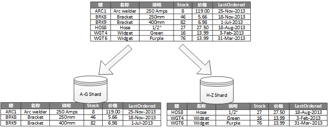
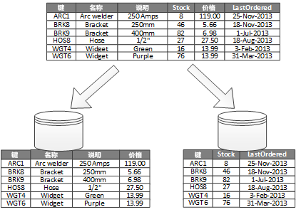
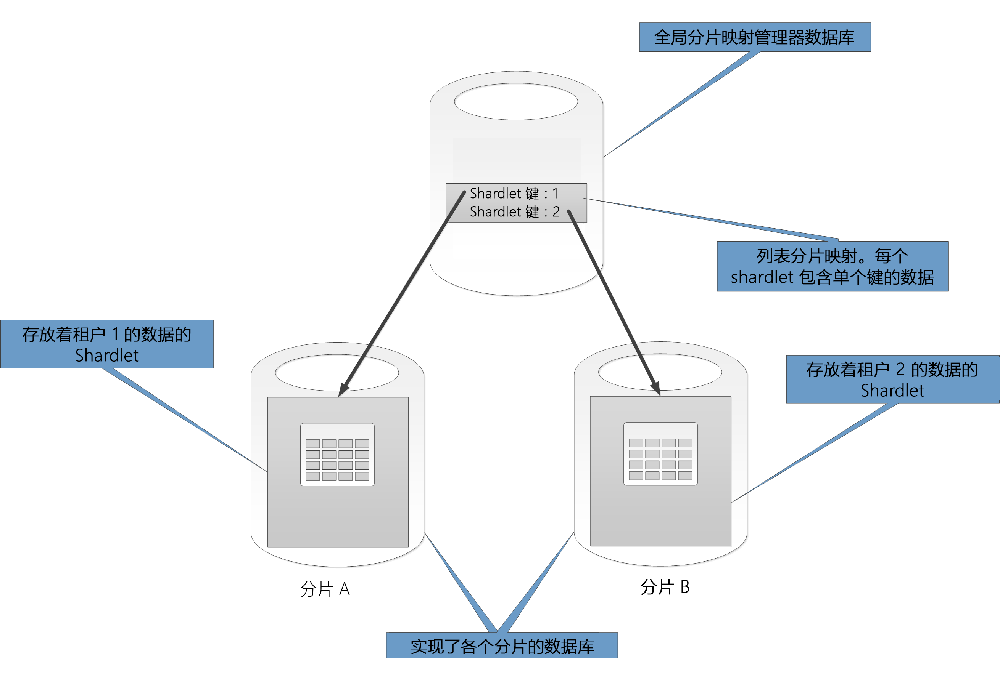
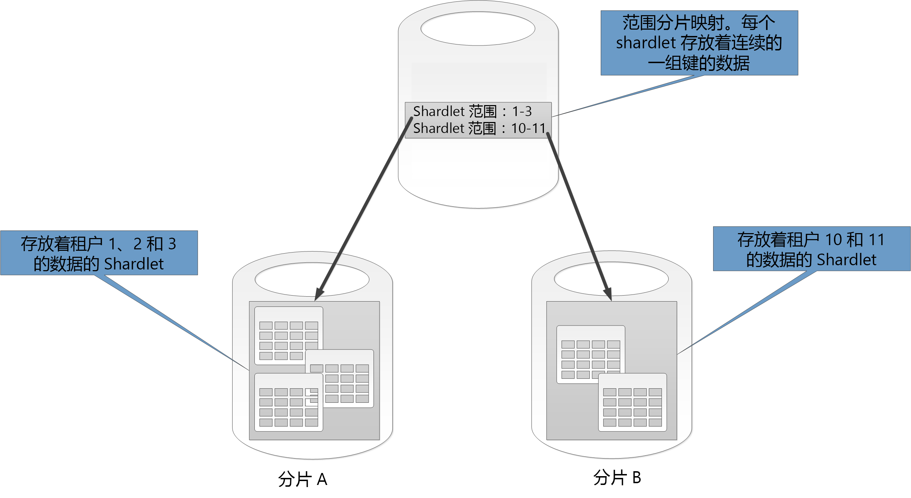
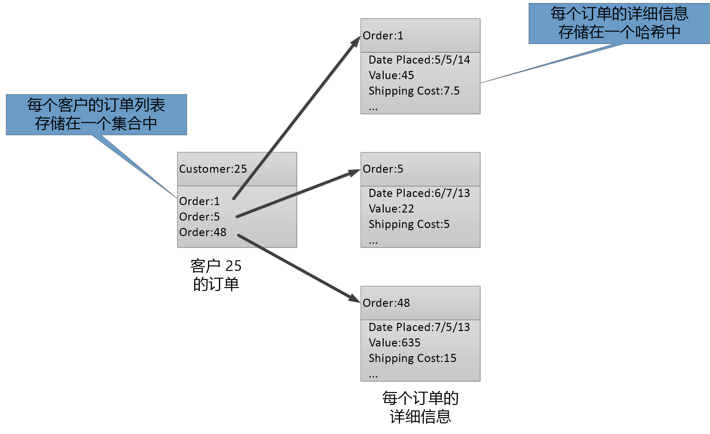

# 数据分区Data partitioning

在许多大型解决方案中，数据分割成独立的分区，而这些分区可以单独进行管理和访问。In many large-scale solutions, data is divided into separate partitions that can be managed and accessed separately. 必须慎重选择分区策略，才能最大程度地提高效益，将负面影响降到最低。The partitioning strategy must be chosen carefully to maximize the benefits while minimizing adverse effects. 分区可以帮助改善缩放性、减少争用，以及优化性能。Partitioning can help improve scalability, reduce contention, and optimize performance. 分区的附带好处是还能提供一种机制，用于通过使用模式来分割数据。Another benefit of partitioning is that it can provide a mechanism for dividing data by the pattern of use. 例如，可以将较旧的、活动性不高（冷）的数据存档在成本较低的数据存储中。For example, you can archive older, less active (cold) data in cheaper data storage.

## 为何要将数据分区？Why partition data?
大多数云应用程序和服务将数据存储与检索当作其操作的一部分。Most cloud applications and services store and retrieve data as part of their operations. 应用程序所用数据存储的设计可能会给系统的性能、吞吐量和缩放性造成严重的影响。The design of the data stores that an application uses can have a significant bearing on the performance, throughput, and scalability of a system. 大型系统中经常应用的一项技术是将数据分割成独立分区。One technique that is commonly applied in large-scale systems is to divide the data into separate partitions.

> 在本文中，术语“分区”是指以物理方式将数据分割成独立数据存储的过程。In this article, the term *partitioning* means the process of physically dividing data into separate data stores. 它与 SQL Server 表分区不同。It is not the same as SQL Server table partitioning.

将数据分区可以带来很多好处。Partitioning data can offer a number of benefits. 例如，应用分区可以：For example, it can be applied in order to:

* **提高缩放性**。**Improve scalability**. 纵向扩展单一数据库系统最终会达到物理硬件的限制。When you scale up a single database system, it will eventually reach a physical hardware limit. 跨多个分区来分割数据，每个分区托管在独立的服务器上，使系统几乎能够无限向外缩放。If you divide data across multiple partitions, each of which is hosted on a separate server, you can scale out the system almost indefinitely.
* **提高性能**。**Improve performance**. 在每个分区上的数据访问操作通过较小的数据卷进行。Data access operations on each partition take place over a smaller volume of data. 如果以适当方式将数据分区，可以提高系统的效率。Provided that the data is partitioned in a suitable way, partitioning can make your system more efficient. 影响多个分区的操作可以同时运行。Operations that affect more than one partition can run in parallel. 每个分区可以靠近使用它的应用程序以最小化网络延迟。Each partition can be located near the application that uses it to minimize network latency.
* **提高可用性**。**Improve availability**. 跨多个服务器隔离数据可避免单点故障。Separating data across multiple servers avoids a single point of failure. 如果服务器发生故障，或正在进行计划的维护，只有该分区中的数据不可用。If a server fails, or is undergoing planned maintenance, only the data in that partition is unavailable. 其他分区上的操作可以继续进行。Operations on other partitions can continue. 增加分区的数量可减少无法使用的数据百分比，从而减轻单个服务器故障造成的相对影响。Increasing the number of partitions reduces the relative impact of a single server failure by reducing the percentage of data that will be unavailable. 复制每个分区可以进一步减少单个分区故障影响操作的可能性。Replicating each partition can further reduce the chance of a single partition failure affecting operations. 它还可以隔离必须持续高度可用的重要数据和具有较低可用性要求的低价值数据（例如日志文件）。It also makes it possible to separate critical data that must be continually and highly available from low-value data that has lower availability requirements (log files, for example).
* **提高安全性**。**Improve security**. 根据数据的性质及其分区方式，可以将机密和非机密数据隔离到不同的分区，因而隔离到不同的服务器或数据存储。Depending on the nature of the data and how it is partitioned, it might be possible to separate sensitive and non-sensitive data into different partitions, and therefore into different servers or data stores. 然后，便可以针对敏感数据专门进行安全优化。Security can then be specifically optimized for the sensitive data.
* **提供操作灵活性**。**Provide operational flexibility**. 使用分区可以从多方面优化操作、最大程度提高管理效率及降低成本。Partitioning offers many opportunities for fine tuning operations, maximizing administrative efficiency, and minimizing cost. 例如，可以根据数据在每个分区中的重要性定义不同的策略，以管理、监视、备份和还原及其他管理任务。For example, you can define different strategies for management, monitoring, backup and restore, and other administrative tasks based on the importance of the data in each partition.
* **将数据存储和使用模式相匹配**。**Match the data store to the pattern of use**. 分区允许根据数据存储提供的成本和内置功能，将每个分区部署在不同类型的数据存储上。Partitioning allows each partition to be deployed on a different type of data store, based on cost and the built-in features that data store offers. 例如，大型二进制数据可存储在 Blob 数据存储中，而结构化程度更高的数据则可保存在文档数据库中。For example, large binary data can be stored in a blob data store, while more structured data can be held in a document database. 有关详细信息，请参阅 Microsoft 网站上模式与实践指南 [Data access for highly-scalable solutions: Using SQL, NoSQL, and polyglot persistence]（高度可缩放解决方案的数据访问：使用 SQL、NoSQL 和 Polyglot 持续性）中的 [Building a polyglot solution]（构建 Polyglot 解决方案）。For more information, see [Building a polyglot solution] in the patterns & practices guide and [Data access for highly-scalable solutions: Using SQL, NoSQL, and polyglot persistence] on the Microsoft website.

有些系统不实施分区，因为分区被视为额外的成本，而不是一项优势。Some systems do not implement partitioning because it is considered a cost rather than an advantage. 持有这种观点的常见原因包括：Common reasons for this rationale include:

* 许多数据存储系统不支持跨分区联接，并且难以维护分区系统中的引用完整性。Many data storage systems do not support joins across partitions, and it can be difficult to maintain referential integrity in a partitioned system. 经常需要在应用代码（分区层）中实施联接和完整性检查，而这可能会导致其他 I/O 和应用程序变复杂。It is frequently necessary to implement joins and integrity checks in application code (in the partitioning layer), which can result in additional I/O and application complexity.
* 维护分区并非总是一项简单的任务。Maintaining partitions is not always a trivial task. 在数据容易发生变化的系统中，可能需要定期重新平衡分区来减少争用和热点。In a system where the data is volatile, you might need to rebalance partitions periodically to reduce contention and hot spots.
* 有些常用的工具不能直接处理已分区的数据。Some common tools do not work naturally with partitioned data.

## 设计分区Designing partitions
可以用不同的方式将数据分区：水平、垂直或功能。Data can be partitioned in different ways: horizontally, vertically, or functionally. 选择的策略取决于数据分区的原因、应用程序的要求和使用该数据的服务。The strategy you choose depends on the reason for partitioning the data, and the requirements of the applications and services that will use the data.

> [!NOTE]
> 本指南中所述分区方案的解释与底层的数据存储技术无关。The partitioning schemes described in this guidance are explained in a way that is independent of the underlying data storage technology. 这些方案可应用到许多类型的数据存储，包括关系数据库和 NoSQL 数据库。They can be applied to many types of data stores, including relational and NoSQL databases.
>
>

### 分区策略Partitioning strategies
数据分区的三个典型策略是：The three typical strategies for partitioning data are:

* **水平分区**（通常称为*分片*）。**Horizontal partitioning** (often called *sharding*). 在此策略中，每个分区本身都是数据存储，但所有分区具有相同的架构。In this strategy, each partition is a data store in its own right, but all partitions have the same schema. 每个分区称为*分片*，保存数据的特定子集，例如电子商务应用程序中一组特定客户的所有订单。Each partition is known as a *shard* and holds a specific subset of the data, such as all the orders for a specific set of customers in an e-commerce application.
* **垂直分区**。**Vertical partitioning**. 在此策略中，每个分区在数据存储中保存项字段的子集。In this strategy, each partition holds a subset of the fields for items in the data store. 这些字段已根据其使用模式进行分割。The fields are divided according to their pattern of use. 例如，将经常访问的字段放在一个垂直分区，将较不经常访问的字段放在另一个垂直分区。For example, frequently accessed fields might be placed in one vertical partition and less frequently accessed fields in another.
* **功能分区**。**Functional partitioning**. 在此策略中，数据已根据系统中每个界限上下文使用数据的方式进行聚合。In this strategy, data is aggregated according to how it is used by each bounded context in the system. 例如，实现发票开立和管理产品库存等独立商务功能的电子商务系统可以将发票数据存储在一个分区，将产品库存数据存储在另一个分区。For example, an e-commerce system that implements separate business functions for invoicing and managing product inventory might store invoice data in one partition and product inventory data in another.

请务必注意，此处所述的三种策略可以结合使用。It’s important to note that the three strategies described here can be combined. 它们不是互斥的，我们建议在设计分区方案时全盘考虑。They are not mutually exclusive, and we recommend that you consider them all when you design a partitioning scheme. 例如，可以将数据分割成分片，然后使用垂直分区进一步细分每个分片中的数据。For example, you might divide data into shards and then use vertical partitioning to further subdivide the data in each shard. 同样地，功能分区中的数据可以拆分成分片（也可以是垂直分区的分片）。Similarly, the data in a functional partition can be split into shards (which can also be vertically partitioned).

但是，每种策略的不同要求可能引发许多冲突问题。However, the differing requirements of each strategy can raise a number of conflicting issues. 在设计符合系统中整体数据处理性能目标的分区方案时，必须加以评估和平衡。You must evaluate and balance all of these when designing a partitioning scheme that meets the overall data processing performance targets for your system. 以下部分更详细讨论每种策略。The following sections explore each of the strategies in more detail.

### 水平分区（分片）Horizontal partitioning (sharding)
图 1 显示了水平分区或分片的概览。Figure 1 shows an overview of horizontal partitioning or sharding. 在此示例中，产品库存数据已根据产品键分割成分片。In this example, product inventory data is divided into shards based on the product key. 每个分片保存分区键（A-G 和 H-Z）的连续范围数据，根据字母顺序排列。Each shard holds the data for a contiguous range of shard keys (A-G and H-Z), organized alphabetically.

*图 1.基于分区键将数据水平分区（分片）**Figure 1. Horizontally partitioning (sharding) data based on a partition key*

分片可让你将负载分散到多台计算机，减少争用并改善性能。Sharding helps you spread the load over more computers, which reduces contention and improves performance. 通过添加在其他服务器上运行的更多分片，可以向外扩展系统。You can scale the system out by adding further shards that run on additional servers.

实施此分区策略时的最重要因素是分片键的选择。The most important factor when implementing this partitioning strategy is the choice of sharding key. 系统运行之后，就很难更改该键。It can be difficult to change the key after the system is in operation. 键必须确保数据已分区，使工作负荷尽可能跨分片平均分配。The key must ensure that data is partitioned so that the workload is as even as possible across the shards.

请注意，不同分片并不一定包含类似的数据卷。Note that different shards do not have to contain similar volumes of data. 重要的考虑因素是平衡请求数目。Rather, the more important consideration is to balance the number of requests. 有些分片可能非常大，但每个项都是少量访问操作的主体。Some shards might be very large, but each item is the subject of a low number of access operations. 其他分片可能较小，但是更常访问每个项。Other shards might be smaller, but each item is accessed much more frequently. 另一个重点是确保单个分片不超过用于托管该分片的数据存储的规模限制（在容量和处理资源方面）。It is also important to ensure that a single shard does not exceed the scale limits (in terms of capacity and processing resources) of the data store that's being used to host that shard.

如果使用分片方案，应避免产生热点（或热分区），否则可能会影响性能与可用性。If you use a sharding scheme, avoid creating hotspots (or hot partitions) that can affect performance and availability. 例如，使用客户标识符的哈希而不是客户名称的第一个字母，可以防止常见和较不常见首字母所造成的不平衡分布。For example, if you use a hash of a customer identifier instead of the first letter of a customer’s name, you prevent the unbalanced distribution that results from common and less common initial letters. 这是一种典型的技巧，可帮助数据更平均地跨分区分布。This is a typical technique that helps distribute data more evenly across partitions.

选择的分片键应该最大程度地减少将来把大分片拆分成较小片段、将小分片合并成较大分区，或者更改描述分区集中存储的数据的架构的要求。Choose a sharding key that minimizes any future requirements to split large shards into smaller pieces, coalesce small shards into larger partitions, or change the schema that describes the data stored in a set of partitions. 这些操作可能非常耗时，并且可能需要在执行时使一个或多个分片脱机。These operations can be very time consuming, and might require taking one or more shards offline while they are performed.

如果复制分片，则某些副本也许能够保持联机，而其他副本会被拆分、合并，或者重新配置。If shards are replicated, it might be possible to keep some of the replicas online while others are split, merged, or reconfigured. 但系统可能需要限制在发生重新配置时可对这些分片中的数据执行的操作。However, the system might need to limit the operations that can be performed on the data in these shards while the reconfiguration is taking place. 例如，副本中的数据可标记为只读以限制任何不一致的范围，否则在重新构建分片时可能会发生不一致性。For example, the data in the replicas can be marked as read-only to limit the scope of inconsistences that might occur while shards are being restructured.

> 有关其中许多考虑因素的详细信息和指导，以及设计实现水平分区的数据存储的最佳实践技巧，请参阅 [Sharding pattern]（分片模式）。For more detailed information and guidance about many of these considerations, and good practice techniques for designing data stores that implement horizontal partitioning, see [Sharding pattern].
>
>

### 垂直分区Vertical partitioning
垂直分区的最常见用途是降低与提取最常访问的项相关的 I/O 和性能成本。The most common use for vertical partitioning is to reduce the I/O and performance costs associated with fetching the items that are accessed most frequently. 图 2 显示了垂直分区的示例。Figure 2 shows an example of vertical partitioning. 在此示例中，每个数据项的不同属性都保存在不同的分区中。In this example, different properties for each data item are held in different partitions. 一个分区保存了经常访问的数据，包括产品的名称、描述和价格信息。One partition holds data that is accessed more frequently, including the name, description, and price information for products. 另一个分区保存了库存量和上次订购日期。Another holds the volume in stock and the last ordered date.

*图 2.按使用模式将数据垂直分区**Figure 2. Vertically partitioning data by its pattern of use*

在此示例中，应用程序在向客户显示产品详细信息时，按常规查询产品名称、描述和价格。In this example, the application regularly queries the product name, description, and price when displaying the product details to customers. 库位和上次从制造商订购产品的日期保存在一个隔离的分区中，因为这两个项通常一起使用。The stock level and date when the product was last ordered from the manufacturer are held in a separate partition because these two items are commonly used together.

此分区方案有额外的优势，转移频率相对较低的数据（产品名称、描述和价格）和较动态的数据（库位和上次订购日期）彼此隔离。This partitioning scheme has the added advantage that the relatively slow-moving data (product name, description, and price) is separated from the more dynamic data (stock level and last ordered date). 如果转移频率较低的数据经常被访问，应用程序可能会发现，在内存中缓存该数据会很有好处。An application might find it beneficial to cache the slow-moving data in memory if it is frequently accessed.

此分区策略的另一个典型案例是最大化机密数据的安全性。Another typical scenario for this partitioning strategy is to maximize the security of sensitive data. 例如，可通过将信用卡号与对应的卡安全验证码存储在独立的分区中来实现此目的。For example, you can do this by storing credit card numbers and the corresponding card security verification numbers in separate partitions.

垂直分区还可以减少数据所需的并发访问数量。Vertical partitioning can also reduce the amount of concurrent access that's needed to the data.

> 垂直分区在数据存储中的实体级运行，会部分规范化某个实体，以将它从*宽*项分割成一组*窄*项。Vertical partitioning operates at the entity level within a data store, partially normalizing an entity to break it down from a *wide* item to a set of *narrow* items. 在理想的情况下，垂直分区适用于 HBase 和 Cassandra 等列导向型数据存储。It is ideally suited for column-oriented data stores such as HBase and Cassandra. 如果列集合中的数据不太可能会更改，还可以考虑使用 SQL Server 中的列存储。If the data in a collection of columns is unlikely to change, you can also consider using column stores in SQL Server.
>
>

### 功能分区Functional partitioning
对于可以在应用程序中为每个不同商业领域或服务识别界限上下文的系统，功能分区提供了一种技术用于改善隔离和数据访问性能。For systems where it is possible to identify a bounded context for each distinct business area or service in the application, functional partitioning provides a technique for improving isolation and data access performance. 功能分区的另一种常见用途是将读写数据与用于报告的只读数据相隔离。Another common use of functional partitioning is to separate read-write data from read-only data that's used for reporting purposes. 图 3 显示了功能分区的概览，其中的库存数据已与客户数据相隔离。Figure 3 shows an overview of functional partitioning where inventory data is separated from customer data.

*图 3.按界限上下文或子域对数据进行功能分区**Figure 3. Functionally partitioning data by bounded context or subdomain*

此分区策略可帮助减少跨系统中不同部件的数据访问争用。This partitioning strategy can help reduce data access contention across different parts of a system.

## 针对缩放性设计分区Designing partitions for scalability
请务必考虑每个分区的大小和工作负荷并进行平衡，使数据分布实现最大伸缩性。It's vital to consider size and workload for each partition and balance them so that data is distributed to achieve maximum scalability. 但是，还必须将数据分区，使它不超过单个分区存储的缩放限制。However, you must also partition the data so that it does not exceed the scaling limits of a single partition store.

在针对缩放性设计分区时，请执行以下步骤：Follow these steps when designing partitions for scalability:

1. 分析应用程序以了解数据访问模式，例如每个查询返回的结果集大小、访问的频率、固有的延迟，以及服务器端计算处理要求。Analyze the application to understand the data access patterns, such as the size of the result set returned by each query, the frequency of access, the inherent latency, and the server-side compute processing requirements. 在许多情况下，一些主要实体需要大部分的处理资源。In many cases, a few major entities will demand most of the processing resources.
2. 使用这种分析来确定当前和将来的缩放性目标，例如数据大小和工作负荷。Use this analysis to determine the current and future scalability targets, such as data size and workload. 然后将数据跨分区分布以符合缩放性目标。Then distribute the data across the partitions to meet the scalability target. 在水平分区策略中，选择适当的分片键对确保分布是否平均很重要。In the horizontal partitioning strategy, choosing the appropriate shard key is important to make sure distribution is even. 有关详细信息，请参阅 [Sharding pattern]（分片模式）。For more information, see the [Sharding pattern].
3. 确保每个分区的可用资源充足，在数据大小和吞吐量方面可以应对缩放性要求。Make sure that the resources available to each partition are sufficient to handle the scalability requirements in terms of data size and throughput. 例如，托管分区的节点可能对存储空间量、处理能力或它所提供的网络带宽施加了硬性限制。For example, the node that's hosting a partition might impose a hard limit on the amount of storage space, processing power, or network bandwidth that it provides. 如果数据存储和处理要求可能会超过这些限制，则可能必须优化分区策略或进一步拆分数据。If the data storage and processing requirements are likely to exceed these limits, it might be necessary to refine your partitioning strategy or split data out further. 例如，实现伸缩性的方法之一是将日志记录数据与核心应用程序功能相隔离。For example, one scalability approach might be to separate logging data from the core application features. 为此，可以使用不同的数据存储来避免整个数据存储要求超过节点的缩放限制。You do this by using separate data stores to prevent the total data storage requirements from exceeding the scaling limit of the node. 如果数据存储的总数超过节点限制，可能需要使用独立的存储节点。If the total number of data stores exceeds the node limit, it might be necessary to use separate storage nodes.
4. 监视使用中的系统以验证数据是否按预期分布，并且分区可以处理其上施加的负载。Monitor the system under use to verify that the data is distributed as expected and that the partitions can handle the load that is imposed on them. 该用法可能不符合分析的预期。It's possible that the usage does not match the usage that's anticipated by the analysis. 在这种情况下，可以重新平衡分区。In that case, it might be possible to rebalance the partitions. 如果无法做到，可能需要重新设计系统的某些部件以获得所需的平衡。Failing that, it might be necessary to redesign some parts of the system to gain the required balance.

请注意，某些云环境会根据基础结构边界分配资源。Note that some cloud environments allocate resources in terms of infrastructure boundaries. 请确保所选边界的限制可在数据存储、处理能力和带宽等方面提供足够的空间，以满足数据量的预期增长。Ensure that the limits of your selected boundary provide enough room for any anticipated growth in the volume of data, in terms of data storage, processing power, and bandwidth.

例如，如果使用 Azure 表存储，繁忙的分片所需的资源可能会超过可供单一分区处理请求的资源。For example, if you use Azure table storage, a busy shard might require more resources than are available to a single partition to handle requests. （单一分区在给定时间段内可处理的请求数量是有限制的。(There is a limit to the volume of requests that can be handled by a single partition in a particular period of time. 请参阅 Microsoft 网站上的 [Azure storage scalability and performance targets]（Azure 存储伸缩性和性能目标）页以了解详细信息。）See the page [Azure storage scalability and performance targets] on the Microsoft website for more details.)

 在此情况下，可能需要对分片进行重新分区以分散负载。If this is the case, the shard might need to be repartitioned to spread the load. 如果这些表的总大小或吞吐量超过存储帐户的容量，可能需要创建其他存储帐户并跨帐户分散表。If the total size or throughput of these tables exceeds the capacity of a storage account, it might be necessary to create additional storage accounts and spread the tables across these accounts. 如果存储帐户的数目超出可供订阅使用的帐户的数目，则可能需要使用多个订阅。If the number of storage accounts exceeds the number of accounts that are available to a subscription, then it might be necessary to use multiple subscriptions.

## 针对查询性能设计分区Designing partitions for query performance
使用较小的数据集和运行并行查询通常可以提高查询性能。Query performance can often be boosted by using smaller data sets and by running parallel queries. 每个分区应该包含整个数据集的一小部分。Each partition should contain a small proportion of the entire data set. 这种数量缩减可以提高查询性能。This reduction in volume can improve the performance of queries. 但是，分区并不是合理设计和配置数据库的替代方式。However, partitioning is not an alternative for designing and configuring a database appropriately. 例如，如果使用关系数据库，则应确保已编制必要的索引。For example, make sure that you have the necessary indexes in place if you are using a relational database.

在针对查询性能设计分区时，请执行以下步骤：Follow these steps when designing partitions for query performance:

1. 检查应用程序的要求和性能：Examine the application requirements and performance:
   * 使用业务要求来确定始终必须快速执行的重要查询。Use the business requirements to determine the critical queries that must always perform quickly.
   * 监视系统以识别任何执行速度缓慢的查询。Monitor the system to identify any queries that perform slowly.
   * 建立最常执行的查询。Establish which queries are performed most frequently. 每个查询的单个实例可能只会造成极少的开销，但是资源的累积消耗却很大。A single instance of each query might have minimal cost, but the cumulative consumption of resources could be significant. 有利的做法是将查询检索的数据隔离到不同的分区甚至缓存中。It might be beneficial to separate the data that's retrieved by these queries into a distinct partition, or even a cache.
2. 将导致性能变慢的数据分区。Partition the data that is causing slow performance:
   * 限制每个分区的大小，使查询响应时间在目标范围内。Limit the size of each partition so that the query response time is within target.
   * 以合理的方式设计分片键，以便在实施水平分区时，使应用程序可以轻松找到分区。Design the shard key so that the application can easily find the partition if you are implementing horizontal partitioning. 这可防止查询需要扫描每个分区。This prevents the query from having to scan through every partition.
   * 考虑分区的位置。Consider the location of a partition. 如果可能，请尽量将数据保留在地理位置靠近访问数据的应用程序和用户的分区中。If possible, try to keep data in partitions that are geographically close to the applications and users that access it.
3. 如果实体有吞吐量和查询性能的要求，请根据该实体使用功能分区。If an entity has throughput and query performance requirements, use functional partitioning based on that entity. 如果这样还是无法满足要求，请同时应用水平分区。If this still doesn't satisfy the requirements, apply horizontal partitioning as well. 在大多数情况下，单个分区策略就已足够，但在某些情况下，结合两种策略会更有效率。In most cases a single partitioning strategy will suffice, but in some cases it is more efficient to combine both strategies.
4. 考虑使用跨分区并行执行的异步查询以改善性能。Consider using asynchronous queries that run in parallel across partitions to improve performance.

## 针对可用性设计分区Designing partitions for availability
将数据分区可以确保整个数据集不会构成单一故障点，并可确保数据集的单个子集可以独立进行管理，从而提高应用程序的可用性。Partitioning data can improve the availability of applications by ensuring that the entire dataset does not constitute a single point of failure and that individual subsets of the dataset can be managed independently. 复制包含重要数据的分区也可以提高可用性。Replicating partitions that contain critical data can also improve availability.

在设计和实施分区时，请考虑以下影响可用性的因素：When designing and implementing partitions, consider the following factors that affect availability:

* **数据对业务运营的重要程度**。**How critical the data is to business operations**. 某些数据可能包含重要的商业信息，例如发票明细或银行交易。Some data might include critical business information such as invoice details or bank transactions. 其他数据可能只是较不重要的操作数据，例如日志文件、性能跟踪，等等。Other data might include less critical operational data, such as log files, performance traces, and so on. 识别每种类型的数据后，请考虑：After identifying each type of data, consider:
  * 利用适当的备份计划将重要数据存储在高度可用的分区中。Storing critical data in highly-available partitions with an appropriate backup plan.
  * 根据每个数据集的不同重要性建立独立的管理和监视机制或过程。Establishing separate management and monitoring mechanisms or procedures for the different criticalities of each dataset. 将具有相同级别重要性的数据放在相同的分区中，以便可以按照相应的频率一同备份。Place data that has the same level of criticality in the same partition so that it can be backed up together at an appropriate frequency. 例如，保存银行交易数据的分区需要备份的频率可能高于保存日志记录或跟踪信息的分区。For example, partitions that hold data for bank transactions might need to be backed up more frequently than partitions that hold logging or trace information.
* **单个分区的管理方式**。**How individual partitions can be managed**. 将分区设计为支持单独管理和维护可提供多种优势。Designing partitions to support independent management and maintenance provides several advantages. 例如：For example:
  * 如果分区失败，可以单独恢复而不影响在其他分区中访问数据的应用程序实例。If a partition fails, it can be recovered independently without affecting instances of applications that access data in other partitions.
  * 按地理区域将数据分区可以在每个位置的非高峰时段进行计划的维护任务。Partitioning data by geographical area allows scheduled maintenance tasks to occur at off-peak hours for each location. 确保分区不会太大，避免任何计划中的维护在这段时间无法完成。Ensure that partitions are not too big to prevent any planned maintenance from being completed during this period.
* **是否要跨分区复制重要数据**。**Whether to replicate critical data across partitions**. 此策略可以提高可用性和性能，不过它也可能会造成一致性问题。This strategy can improve availability and performance, although it can also introduce consistency issues. 对分区中数据做出的更改需要一段时间才能与每个副本同步。It takes time for changes made to data in a partition to be synchronized with every replica. 在这段时间，不同的分区会包含不同的数据值。During this period, different partitions will contain different data values.

## 了解分区对设计和开发的影响Understanding how partitioning affects design and development
使用分区会增大系统设计和开发的复杂性。Using partitioning adds complexity to the design and development of your system. 即使系统一开始只包含单个分区，也必须将分区视为系统设计的基础部分。Consider partitioning as a fundamental part of system design even if the system initially only contains a single partition. 当系统开始遇到性能和缩放性问题时，将分区视为备案只会增大复杂性，你可能已经有了要维护的实时系统。If you address partitioning as an afterthought, when the system starts to suffer performance and scalability issues, the complexity increases because you already have a live system to maintain.

更新系统以将分区整合到此环境中不但需要修改数据访问逻辑，If you update the system to incorporate partitioning in this environment, it necessitates modifying the data access logic. 还可能涉及到迁移大量现有数据以跨分区分布数据，用户希望能够继续使用系统时经常发生这种情况。It can also involve migrating large quantities of existing data to distribute it across partitions, often while users expect to be able to continue using the system.

在某些情况下，分区并不重要，因为初始数据集很小，可以轻松地由单个服务器处理。In some cases, partitioning is not considered important because the initial dataset is small and can be easily handled by a single server. 对于预期不会扩展到超出初始大小的系统而言，这可能是真的，但是许多商务系统都需要能够在用户数量增加时进行扩展。This might be true in a system that is not expected to scale beyond its initial size, but many commercial systems need to expand as the number of users increases. 这种扩展通常伴随着数据量的增长。This expansion is typically accompanied by a growth in the volume of data.

还必须知道，分区不总是发生在大型数据存储上。It's also important to understand that partitioning is not always a function of large data stores. 例如，数百个并发客户端可能会重度访问一个小型数据存储。For example, a small data store might be heavily accessed by hundreds of concurrent clients. 在此情况下，将数据分区有助于减少争用并提高吞吐量。Partitioning the data in this situation can help to reduce contention and improve throughput.

在设计数据分区方案时，请注意以下几点：Consider the following points when you design a data partitioning scheme:

* **尽可能地一并保存每个分区中最常见数据库操作的数据，以最大程度地减少跨分区数据访问操作**。**Where possible, keep data for the most common database operations together in each partition to minimize cross-partition data access operations**. 跨分区查询可能比只在单个分区中查询更费时，但是优化一个查询集的分区可能对其他查询集造成不利影响。Querying across partitions can be more time-consuming than querying only within a single partition, but optimizing partitions for one set of queries might adversely affect other sets of queries. 如果无法避免跨分区查询，则应该通过运行并行查询并在应用程序中聚合结果来最大程度地减少查询时间。When you can't avoid querying across partitions, minimize query time by running parallel queries and aggregating the results within the application. 在某些情况下可能无法使用这种方法，例如需要从查询获取结果并在下一次查询中使用此结果时。This approach might not be possible in some cases, such as when it's necessary to obtain a result from one query and use it in the next query.
* **如果查询利用相当静态的引用数据，例如邮政编码表或产品列表，请考虑将此数据复制到所有分区，以减少在不同分区中执行独立查找操作的要求**。**If queries make use of relatively static reference data, such as postal code tables or product lists, consider replicating this data in all of the partitions to reduce the requirement for separate lookup operations in different partitions**. 这种方法还减少了引用数据变成“热”数据集（经常在整个系统中接受高访问流量）的可能性。This approach can also reduce the likelihood of the reference data becoming a "hot" dataset that is subject to heavy traffic from across the entire system. 不过，将可能发生的任何更改同步到此引用数据也会产生额外的开销。However,   there is an additional cost associated with synchronizing any changes that might occur to this reference data.
* **尽量减少跨垂直和功能分区的引用完整性的要求**。**Where possible, minimize requirements for referential integrity across vertical and functional partitions**. 在这些方案中，应用程序本身负责在更新和使用数据时维护跨分区的引用完整性。In these schemes, the application itself is responsible for maintaining referential integrity across partitions when data is updated and consumed. 必须跨分区联接数据的查询执行的速度远低于只在相同分区内联接数据的查询，因为应用程序通常需要根据某个键，并根据某个外键执行连续查询。Queries that must join data across multiple partitions run more slowly than queries that join data only within the same partition because the application typically needs to perform consecutive queries based on a key and then on a foreign key. 建议复制或取消规范化相关的数据。Instead, consider replicating or de-normalizing the relevant data. 在需要执行跨分区联接时，为了最大限度地减少查询时间，请对各分区运行并行查询，并在应用程序内部联接数据。To minimize the query time where cross-partition joins are necessary, run parallel queries over the partitions and join the data within the application.
* **考虑分区方案可能对跨分区数据一致性产生的影响。****Consider the effect that the partitioning scheme might have on the data consistency across partitions.** 评估强一致性是否为实际要求。Evaluate whether strong consistency is actually a requirement. 云中的常见方法是实施最终一致性。Instead, a common approach in the cloud is to implement eventual consistency. 每个分区中的数据将单独更新，应用程序逻辑可确保所有更新成功完成。The data in each partition is updated separately, and the application logic ensures that the updates are all completed successfully. 此外，它还会处理在运行最终一致操作时查询数据所造成的不一致。It also handles the inconsistencies that can arise from querying data while an eventually consistent operation is running. 有关实施最终一致性的详细信息，请参阅 [Data consistency primer]（数据一致性入门）。For more information about implementing eventual consistency, see the [Data consistency primer].
* **考虑查询如何查找正确的分区**。**Consider how queries locate the correct partition**. 如果查询必须扫描所有分区来查找所需的数据，即使运行多个并行查询，也会对性能产生严重的影响。If a query must scan all partitions to locate the required data, there is a significant impact on performance, even when multiple parallel queries are running. 配合垂直和功能分区策略使用的查询可以自然地指定分区。Queries that are used with vertical and functional partitioning strategies can naturally specify the partitions. 但是，使用水平分区（分片）时，查找项可能很困难，因为每个分片都有相同的架构。However, horizontal partitioning (sharding) can make locating an item difficult because every shard has the same schema. 典型的分片解决方案是维护一种映射，该映射可用于查找特定数据项的分片位置。A typical solution for sharding is to maintain a map that can be used to look up the shard location for specific items of data. 此映射可以在应用程序的分片逻辑中实施，或者由数据存储维护（如果数据存储支持透明分片）。This map can be implemented in the sharding logic of the application, or maintained by the data store if it supports transparent sharding.
* **使用水平分区策略时，请考虑定期重新平衡分片**。**When using a horizontal partitioning strategy, consider periodically rebalancing the shards**. 这有助于根据大小和工作负荷平均分布数据，从而最小化热点，最大化查询性能，并解决物理存储限制。This helps distribute the data evenly by size and by workload to minimize hotspots, maximize query performance, and work around physical storage limitations. 不过，这是一个复杂的任务，通常需要使用定制工具或过程。However, this is a complex task that often requires the use of a custom tool or process.
* **复制每个分区可以进一步防范故障**。**If you replicate each partition, it provides additional protection against failure**. 如果单个副本发生故障，查询可以定向到可用的副本。If a single replica fails, queries can be directed towards a working copy.
* **如果达到了分区策略的物理限制，可能需要将缩放性扩展到其他级别**。**If you reach the physical limits of a partitioning strategy, you might need to extend the scalability to a different level**. 例如，如果分区位于数据库级别，则可能需要在多个数据库中查找或复制分区。For example, if partitioning is at the database level, you might need to locate or replicate partitions in multiple databases. 如果分区已在数据库级别，而物理限制成为一个问题，则可能需要在多个托管帐户中查找或复制分区。If partitioning is already at the database level, and physical limitations are an issue, it might mean that you need to locate or replicate partitions in multiple hosting accounts.
* **避免执行在多个分区中访问数据的事务**。**Avoid transactions that access data in multiple partitions**. 某些数据存储针对修改数据的操作实施事务一致性和完整性，但仅当数据位于单个分区时才能如此。Some data stores implement transactional consistency and integrity for operations that modify data, but only when the data is located in a single partition. 如果需要跨多个分区的事务支持，可能需要实施此支持作为应用程序逻辑的一部分，因为大多数分区系统不提供本机支持。If you need transactional support across multiple partitions, you will probably need to implement this as part of your application logic because most partitioning systems do not provide native support.

所有数据存储都需要某种操作管理和监视活动。All data stores require some operational management and monitoring activity. 任务的范围可能包括加载数据、备份和还原数据、重新组织数据，以及确保系统正常有效地执行。The tasks can range from loading data, backing up and restoring data, reorganizing data, and ensuring that the system is performing correctly and efficiently.

请注意以下会影响操作管理的因素：Consider the following factors that affect operational management:

* **将数据分区时如何实施适当的管理和操作任务**。**How to implement appropriate management and operational tasks when the data is partitioned**. 这些任务可能包括备份与还原、存档数据，监视系统及其他管理任务。These tasks might include backup and restore, archiving data, monitoring the system, and other administrative tasks. 例如，在备份和还原操作期间保持逻辑一致性可能是一个难题。For example, maintaining logical consistency during backup and restore operations can be a challenge.
* **如何将数据载入多个分区，以及如何添加来自其他源的新数据**。**How to load the data into multiple partitions and add new data that's arriving from other sources**. 某些工具和实用程序可能不支持分片数据操作（例如将数据载入正确的分区）。Some tools and utilities might not support sharded data operations such as loading data into the correct partition. 这意味着，可能需要创建或获取新的工具和实用程序。This means that you might have to create or obtain new tools and utilities.
* **如何定期存档和删除数据**。**How to archive and delete the data on a regular basis**. 为防止分区过度增长，需要定期（也许是每月）存档和删除数据。To prevent the excessive growth of partitions, you need to archive and delete data on a regular basis (perhaps monthly). 可能需要转换数据以符合不同的存档架构。It might be necessary to transform the data to match a different archive schema.
* **如何找出数据完整性问题**。**How to locate data integrity issues**. 考虑运行定期过程来查找任何数据完整性的问题，例如一个分区的数据引用了另一个分区中缺少的信息。Consider running a periodic process to locate any data integrity issues such as data in one partition that references missing information in another. 该过程可能会尝试自动修复这些问题，或者向操作人员引发警报，让其手动修复问题。The process can either attempt to fix these issues automatically or raise an alert to an operator to correct the problems manually. 例如，在电子商务应用程序中，订单信息可能保存在一个分区中，但是构成每份订单的行项可能保存在另一个分区中。For example, in an e-commerce application, order information might be held in one partition but the line items that constitute each order might be held in another. 下单的过程需要向其他分区添加数据。The process of placing an order needs to add data to other partitions. 如果此过程失败，就可能会存储没有对应订单的行项。If this process fails, there might be line items stored for which there is no corresponding order.

不同的数据存储技术通常提供自身的功能来支持分区。Different data storage technologies typically provide their own features to support partitioning. 以下部分汇总了 Azure 应用程序常用的数据存储所实施的选项，The following sections summarize the options that are implemented by data stores commonly used by Azure applications. 并描述了设计出可充分利用这些功能的应用程序时的考虑因素。They also describe considerations for designing applications that can best take advantage of these features.

## Azure SQL 数据库的分区策略Partitioning strategies for Azure SQL Database
Azure SQL 数据库是在云中运行的关系数据库即服务。Azure SQL Database is a relational database-as-a-service that runs in the cloud. 它基于 Microsoft SQL Server。It is based on Microsoft SQL Server. 关系数据库将信息分割成表，每个表以一系列的行保存有关实体的信息。A relational database divides information into tables, and each table holds information about entities as a series of rows. 每个行包含的列保存实体各个字段的数据。Each row contains columns that hold the data for the individual fields of an entity. Microsoft 网站上的 [What is Azure SQL Database?]（什么是 Azure SQL 数据库？）页提供了有关创建和使用 SQL 数据库的详细文档。The page [What is Azure SQL Database?] on the Microsoft website provides detailed documentation about creating and using SQL databases.

## 使用弹性数据库进行水平分区Horizontal partitioning with Elastic Database
单个 SQL 数据库对其包含的数据列施加了限制。A single SQL database has a limit to the volume of data that it can contain. 吞吐量受体系结构因素及数据库支持的并发连接数的约束。Throughput is constrained by architectural factors and the number of concurrent connections that it supports. Azure SQL 数据库的弹性数据库功能支持 SQL 数据库的水平缩放。The Elastic Database feature of SQL Database supports horizontal scaling for a SQL database. 使用弹性数据库，可以将数据分区到分布于多个 SQL 数据库的分片中。Using Elastic Database, you can partition your data into shards that are spread across multiple SQL databases. 此外，还可以随着需要处理的数据量的增长和缩减，增加或删除分片。You can also add or remove shards as the volume of data that you need to handle grows and shrinks. 使用弹性数据库还有助于在数据库之间分散负载，以减少争用。Using Elastic Database can also help reduce contention by distributing the load across databases.

> [!NOTE]
> 弹性数据库可以取代 Azure SQL 数据库的联合功能。Elastic Database is a replacement for the Federations feature of Azure SQL Database. 可以使用联合迁移实用工具将现有的 SQL 数据库联合安装迁移到弹性数据库。Existing SQL Database Federation installations can be migrated to Elastic Database by using the Federations migration utility. 如果方案原本无法适应弹性数据库提供的功能，可以实施自己的分片机制。Alternatively, you can implement your own sharding mechanism if your scenario does not lend itself naturally to the features that are provided by Elastic Database.
>
>

每个分片将作为 SQL 数据库实施。Each shard is implemented as a SQL database. 一个分片可以保存多个数据集（称为 *shardlet*）。A shard can hold more than one dataset (referred to as a *shardlet*). 每个数据库将维护描述其所包含的 shardlet 的元数据。Each database maintains metadata that describes the shardlets that it contains. shardlet 可以是单个数据项，也可以是一组共享同一 shardlet 键的项。A shardlet can be a single data item, or it can be a group of items that share the same shardlet key. 例如，如果在多租户应用程序中分片数据，则 shardlet 键可能是租户 ID，给定租户的所有数据都将保存为同一 shardlet 的一部分。For example, if you are sharding data in a multitenant application, the shardlet key can be the tenant ID, and all data for a given tenant can be held as part of the same shardlet. 其他租户的数据保存在不同的 shardlet 中。Data for other tenants would be held in different shardlets.

程序员负责将数据集与 shardlet 键相关联。It is the programmer's responsibility to associate a dataset with a shardlet key. 独立的 SQL 数据库将充当全局分片映射管理器。A separate SQL database acts as a global shard map manager. 此数据库包含系统中所有分片和 shardlet 的列表。This database contains a list of all the shards and shardlets in the system. 访问数据的客户端应用程序先连接到全局分片映射管理器数据库，以获取它在本地缓存的分片映射副本（列出分片和 shardlet）。A client application that accesses data connects first to the global shard map manager database to obtain a copy of the shard map (listing shards and shardlets), which it then caches locally.

然后，应用程序使用这项信息将数据请求路由发送到相应的分片。The application then uses this information to route data requests to the appropriate shard. 此功能隐藏在 Azure SQL 数据库弹性数据库客户端库（以 NuGet 包的形式提供）中的一系列 API 之后。This functionality is hidden behind a series of APIs that are contained in the Azure SQL Database Elastic Database Client Library, which is available as a NuGet package. Microsoft 网站上的 [Elastic Database features overview]（弹性数据库功能概述）页提供了有关弹性数据库的更全面介绍。The page [Elastic Database features overview] on the Microsoft website provides a more comprehensive introduction to Elastic Database.

> [!NOTE]
> 可以复制全局分片映射管理器数据库，以减少延迟并提高可用性。You can replicate the global shard map manager database to reduce latency and improve availability. 如果使用某个高级定价层实施数据库，可以配置活动异地复制以持续将数据复制到不同区域中的数据库。If you implement the database by using one of the Premium pricing tiers, you can configure active geo-replication to continuously copy data to databases in different regions. 在用户所在的每个区域中创建数据库的副本。Create a copy of the database in each region in which users are based. 然后将应用程序配置为连接到此副本，以获取分片映射。Then configure your application to connect to this copy to obtain the shard map.
>
> 另一种方法是使用 Azure SQL 数据同步或 Azure 数据工厂管道来跨区域复制分片映射管理器数据库。An alternative approach is to use Azure SQL Data Sync or an Azure Data Factory pipeline to replicate the shard map manager database across regions. 这种形式的复制将定期运行，更适合用于分片映射不经常更改的情况。This form of replication runs periodically and is more suitable if the shard map changes infrequently. 此外，分片映射管理器数据库不一定要使用高级定价层来创建。Additionally, the shard map manager database does not have to be created by using a Premium pricing tier.
>
>

弹性数据库提供了两种方案用于将数据映射到 shardlet 并将 shardlet 存储在分片中：Elastic Database provides two schemes for mapping data to shardlets and storing them in shards:

* **列表分片映射**描述单个键与 shardlet 之间的关联。A **list shard map** describes an association between a single key and a shardlet. 例如，在多租户系统中，每个租户的数据可与唯一的键相关联，并存储在自身的 shardlet 中。For example, in a multitenant system, the data for each tenant can be associated with a unique key and stored in its own shardlet. 为了保证隐私性和隔离（即，防止租户耗尽其他租户可用的数据存储资源），每个 shardlet 都可以保存在自身的分片中。To guarantee privacy and isolation (that is, to prevent one tenant from exhausting the data storage resources available to others), each shardlet can be held within its own shard.

*图 4.使用列表分片映射将租户数据存储在独立分片中**Figure 4. Using a list shard map to store tenant data in separate shards*

* **范围分片映射**描述一组连续键值与 shardlet 之间的关联。A **range shard map** describes an association between a set of contiguous key values and a shardlet. 在前面所述的多租户示例中，有一个实施专用 shardlet 的替代方案，就是将数据分组成同一 shardlet 中的一组租户（每个租户有自己的键）。In the multitenant example described previously, as an alternative to implementing dedicated shardlets, you can group the data for a set of tenants (each with their own key) within the same shardlet. 此方案的开销低于第一种方案（因为租户共享数据存储资源），但同时会产生数据隐私性和隔离性降低的风险。This scheme is less expensive than the first (because tenants share data storage resources), but it also creates a risk of reduced data privacy and isolation.

*图 5.使用范围分片映射来存储分片中租户范围的数据**Figure 5. Using a range shard map to store data for a range of tenants in a shard*

请注意，单个分片可以包含多个 shardlet 的数据。Note that a single shard can contain the data for several shardlets. 例如，可以使用列表 shardlet 将不同非连续租户的数据存储在同一分片中。For example, you can use list shardlets to store data for different non-contiguous tenants in the same shard. 还可以混合同一分片中的范围 shardlet 和列表 shardlet，不过，会通过全局分片映射管理器数据库中的不同映射对这些 shardlet 寻址。You can also mix range shardlets and list shardlets in the same shard, although they will be addressed through different maps in the global shard map manager database. （全局分片映射管理器数据库可以包含多个分片映射。）图 6 演示了这种方法。(The global shard map manager database can contain multiple shard maps.) Figure 6 depicts this approach.

*图 6.实施多个分片映射**Figure 6. Implementing multiple shard maps*

实施的分区方案可能会对系统性能带来很重的负担。The partitioning scheme that you implement can have a significant bearing on the performance of your system. 此外，还会影响需要添加或删除分片的速率，或者跨分片重新分区数据的速率。It can also affect the rate at which shards have to be added or removed, or the rate at which data must be repartitioned across shards. 使用弹性数据库将数据分区时，应注意以下几点：Consider the following points when you use Elastic Database to partition data:

* 将一起使用的数据分组到同一个分片，并避免执行需要访问保存在多个分片中的数据的操作。Group data that is used together in the same shard, and avoid operations that need to access data that's held in multiple shards. 请记住，使用弹性数据库时，分片本身就是 SQL 数据库，而 Azure SQL 数据库不支持跨数据库联接（这些操作必须在客户端执行）。Keep in mind that with Elastic Database, a shard is a SQL database in its own right, and Azure SQL Database does not support cross-database joins (which have to be performed on the client side). 另请记住，使用 Azure SQL 数据库时，引用完整性条件约束、触发器和一个数据库中的存储过程无法引用另一个数据库中的对象。Remember also that in Azure SQL Database, referential integrity constraints, triggers, and stored procedures in one database cannot reference objects in another. 因此请不要设计在分片之间具有依赖性的系统。Therefore, don't design a system that has dependencies between shards. 但是，SQL 数据库可以包含表（保存查询和其他操作常用的引用数据副本）。A SQL database can, however, contain tables that hold copies of reference data frequently used by queries and other operations. 这些表并不一定属于任何特定 shardlet。These tables do not have to belong to any specific shardlet. 跨分片复制此数据有助于消除联接跨数据库的数据的需要。Replicating this data across shards can help remove the need to join data that spans databases. 在理想的情况下，此类数据应该是静态或缓慢移动的，以最大限度地减少复制工作量并减少数据变陈旧的可能性。Ideally, such data should be static or slow-moving to minimize the replication effort and reduce the chances of it becoming stale.

  > [!NOTE]
  > 尽管 Azure SQL 数据库不支持跨数据库联接，但可以使用弹性数据库 API 执行跨分片查询。Although SQL Database does not support cross-database joins, you can perform cross-shard queries with the Elastic Database API. 这些查询可以透明方式循环访问分片映射引用的所有 shardlet 中保存的数据。These queries can transparently iterate through the data held in all the shardlets that are referenced by a shard map. 弹性数据库 API 将跨分片查询分解成一系列独立查询（每个数据库一个），然后将结果合并在一起。The Elastic Database API breaks cross-shard queries down into a series of individual queries (one for each database) and then merges the results. 有关详细信息，请参阅 Microsoft 网站上的 [Multi-shard querying]（多分片查询）页。For more information, see the page [Multi-shard querying] on the Microsoft website.
  >
  >
* 存储在属于相同分片映射的 shardlet 中的数据应该具有相同的架构。The data stored in shardlets that belong to the same shard map should have the same schema. 例如，创建的列表分片映射不应指向包含租户数据的某些 shardlet 和其他包含产品信息的 shardlet。For example, don't create a list shard map that points to some shardlets containing tenant data and other shardlets containing product information. 弹性数据库不会强制实施此规则，但如果每个 shardlet 都有不同的架构，则数据管理和查询将变得非常复杂。This rule is not enforced by Elastic Database, but data management and querying becomes very complex if each shardlet has a different schema. 在上述示例中，不错的解决方案是创建两个列表分片映射：一个引用租户数据，另一个指向产品信息。In the example just cited, a good solution is to create two list shard maps: one that references tenant data and another that points to product information. 请记住，属于不同 shardlet 的数据可以存储在相同的分片中。Remember that the data belonging to different shardlets can be stored in the same shard.

  > [!NOTE]
  > 弹性数据库 API 的跨分片查询功能依赖于包含相同架构的分片映射中的每个 shardlet。The cross-shard query functionality of the Elastic Database API depends on each shardlet in the shard map containing the same schema.
  >
  >
* 只有保存在相同分片中的数据支持事务操作，而跨分片的数据并不支持。Transactional operations are only supported for data that's held within the same shard, and not across shards. 事务可以跨 shardlet，前提是它们属于同一分片。Transactions can span shardlets as long as they are part of the same shard. 因此，如果业务逻辑需要执行事务，请将受影响的数据存储在同一分片中，或者实施最终一致性。Therefore, if your business logic needs to perform transactions, either store the affected data in the same shard or implement eventual consistency. 有关详细信息，请参阅 [Data consistency primer]（数据一致性入门）。For more information, see the [Data consistency primer].
* 将分片放置在访问这些分片中的数据的用户的附近（即地域查找分片）。Place shards close to the users that access the data in those shards (in other words, geo-locate the shards). 此策略有助于缩短延迟。This strategy helps reduce latency.
* 避免混合高度活跃（热点）和相对不活跃的分片。Avoid having a mixture of highly active (hotspots) and relatively inactive shards. 尽量跨分片平均分散负载。Try to spread the load evenly across shards. 这可能需要编写 shardlet 键的哈希。This might require hashing the shardlet keys.
* 如果要按地域查找分片，请确保哈希键映射到的 shardlet 保存在访问该数据的用户附近存储的分片中。If you are geo-locating shards, make sure that the hashed keys map to shardlets held in shards stored close to the users that access that data.
* 目前，仅支持将有限的一组 SQL 数据类型用作 shardlet 键；*int、bigint、varbinary* 和 *uniqueidentifier*。Currently, only a limited set of SQL data types are supported as shardlet keys; *int, bigint, varbinary,* and *uniqueidentifier*. SQL *int* 和 *bigint* 类型映射为 C# 中的 *int* 和 *long* 数据类型，并且具有相同的范围。The SQL *int* and *bigint* types correspond to the *int* and *long* data types in C#, and have the same ranges. SQL *varbinary* 类型可以使用 C# 中的 *Byte* 数组处理，SQL *uniqueidentier* 类型映射为 .NET Framework 中的 *Guid* 类。The SQL *varbinary* type can be handled by using a *Byte* array in C#, and the SQL *uniqueidentier* type corresponds to the *Guid* class in the .NET Framework.

顾名思义，弹性数据库可在数据量缩小和增大时，让系统添加和删除分片。As the name implies, Elastic Database makes it possible for a system to add and remove shards as the volume of data shrinks and grows. Azure SQL 数据库弹性数据库客户端库中的 API 可让应用程序动态创建和删除分片（并以透明方式更新分片映射管理器）。The APIs in the Azure SQL Database Elastic Database client library enable an application to create and delete shards dynamically (and transparently update the shard map manager). 但删除分片是破坏性操作，还需要删除该分片中的所有数据。However, removing a shard is a destructive operation that also requires deleting all the data in that shard.

如果应用程序需要将一个分片拆分成两个独立的分片或者将分片组合在一起，弹性数据库可提供独立的拆分/合并服务。If an application needs to split a shard into two separate shards or combine shards, Elastic Database provides a separate split-merge service. 此服务在云托管的服务中（开发人员必须创建此云托管服务）运行，并安全地在分片之间迁移数据。This service runs in a cloud-hosted service (which must be created by the developer) and migrates data safely between shards. 有关详细信息，请参阅 Microsoft 网站上的主题 [Scaling using the Elastic Database split-merge tool]（使用弹性数据库拆分/合并工具进行缩放）。For more information, see the topic [Scaling using the Elastic Database split-merge tool] on the Microsoft website.

## Azure 存储的分区策略Partitioning strategies for Azure Storage
Azure 存储提供用于管理数据的四个抽象：Azure storage provides four abstractions for managing data:

* Blob 存储用于存储非结构化对象数据。Blob Storage stores unstructured object data. Blob 可以是任何类型的文本或二进制数据，例如文档、媒体文件或应用程序安装程序。A blob can be any type of text or binary data, such as a document, media file, or application installer. Blob 存储也称为对象存储。Blob storage is also referred to as Object storage.
* 表存储用于存储结构化数据集。Table Storage stores structured datasets. 表存储是一个 NoSQL“键-属性”数据存储，可以用于实现快速开发以及快速访问大量数据。Table storage is a NoSQL key-attribute data store, which allows for rapid development and fast access to large quantities of data.
* 队列存储为云服务的各个组件之间的工作流处理和通信提供可靠的消息传送。Queue Storage provides reliable messaging for workflow processing and for communication between components of cloud services.
* 文件存储使用标准 SMB 协议为旧版应用程序提供共享存储。File Storage offers shared storage for legacy applications using the standard SMB protocol. Azure 虚拟机和云服务可通过装载的共享在应用程序组件之间共享文件数据，本地应用程序可通过文件服务 REST API 来访问共享中的文件数据。Azure virtual machines and cloud services can share file data across application components via mounted shares, and on-premises applications can access file data in a share via the File service REST API.

表存储和 Blob 存储本质上是经过优化的键-值存储，可以分别保存结构化和非结构化数据。Table storage and blob storage are essentially key-value stores that are optimized to hold structured and unstructured data respectively. 存储队列提供用于构建松散耦合且可缩放应用程序的机制。Storage queues provide a mechanism for building loosely coupled, scalable applications. 表存储、文件存储、Blob 存储和存储队列在 Azure 存储帐户的上下文中创建。Table storage, file storage, blob storage, and storage queues are created within the context of an Azure storage account. 存储帐户支持三种形式的冗余：Storage accounts support three forms of redundancy:

* **本地冗余存储**，可以维护单个数据中心内的三个数据副本。**Locally redundant storage**, which maintains three copies of data within a single datacenter. 这种形式的冗余可防范硬件故障，但无法防范涉及整个数据中心的灾难。This form of redundancy protects against hardware failure but not against a disaster that encompasses the entire datacenter.
* **区域冗余存储空间**，可以维护在相同区域中跨不同数据中心（或跨两个地理位置靠近近的区域）分散的三个数据副本。**Zone-redundant storage**, which maintains three copies of data spread across different datacenters within the same region (or across two geographically close regions). 这种形式的冗余可以防范单个数据中心发生的灾难，但无法防范影响整个区域的大规模网络中断。This form of redundancy can protect against disasters that occur within a single datacenter, but cannot protect against large-scale network disconnects that affect an entire region. 请注意，区域冗余存储空间目前仅适用于块 Blob。Note that zone-redundant storage is currently only available for block blobs.
* **异地冗余存储**，可维护六个数据副本。三个副本在一个区域中（用户所在的区域），另外三个副本在远程区域中。**Geo-redundant storage**, which maintains six copies of data: three copies in one region (your local region), and another three copies in a remote region. 这种形式的冗余提供最高级别的灾难保护。This form of redundancy provides the highest level of disaster protection.

Microsoft 已发布 Azure 存储的缩放性目标。Microsoft has published scalability targets for Azure Storage. 有关详细信息，请参阅 Microsoft 网站上的 [Azure Storage scalability and performance targets]（Azure 存储伸缩性和性能目标）页。For more information, see the page [Azure Storage scalability and performance targets] on the Microsoft website. 目前，总存储帐户容量不能超过 500 TB。Currently, the total storage account capacity cannot exceed 500 TB. （这包括保存在表存储、文件存储和 Blob 存储中的数据大小和保存在存储队列中的未处理消息大小）。(This includes the size of data that's held in table storage, file storage and blob storage, as well as outstanding messages that are held in storage queue).

一个存储帐户（假设是 1-KB 实体、Blob 或消息大小）的最大请求比率为每秒 20,000 个请求。The maximum request rate for a storage account (assuming a 1-KB entity, blob, or message size) is 20,000 requests per second. 一个存储帐户具有每个文件共享 1000 IOPS（8 KB 大小）的最大值。A storage account has a maximum of 1000 IOPS (8 KB in size) per file share. 如果系统可能会超过这些限制，请考虑跨多个存储帐户分散负载。If your system is likely to exceed these limits, consider partitioning the load across multiple storage accounts. 单个 Azure 订阅最多可以创建 200 个存储帐户。A single Azure subscription can create up to 200 storage accounts. 但是，请注意这些限制会随时更改。However, note that these limits might change over time.

## 将 Azure 表存储分区Partitioning Azure table storage
Azure 表存储是存储的键/值，专为分区而设计。Azure table storage is a key-value store that's designed around partitioning. 所有实体都存储在分区中，分区在内部由 Azure 表存储管理。All entities are stored in a partition, and partitions are managed internally by Azure table storage. 存储在表中的每个实体需要提供一个双部分键，其中包括：Each entity that's stored in a table must provide a two-part key that includes:

* **分区键**。**The partition key**. 这是一个字符串值，确定 Azure 表存储会在哪个分区中放置实体。This is a string value that determines in which partition Azure table storage will place the entity. 具有相同分区键的所有实体将存储在同一分区中。All entities with the same partition key will be stored in the same partition.
* **行键**。**The row key**. 这是另一个字符串值，用于标识分区中的实体。This is another string value that identifies the entity within the partition. 分区中的所有实体已按此键的词法升序排序。All entities within a partition are sorted lexically, in ascending order, by this key. 每个实体的分区键/行键组合必须是唯一的，且长度不能超过 1 KB。The partition key/row key combination must be unique for each entity and cannot exceed 1 KB in length.

实体数据的剩余部分由应用程序定义的字段组成。The remainder of the data for an entity consists of application-defined fields. 没有强制实施特定的架构，每个行可以包含一组不同的应用程序定义字段。No particular schemas are enforced, and each row can contain a different set of application-defined fields. 唯一的限制是实体的大小上限（包括分区和行键）目前为 1 MB。The only limitation is that the maximum size of an entity (including the partition and row keys) is currently 1 MB. 表的大小上限为 200 TB，但是这些数字将来可能会更改。The maximum size of a table is 200 TB, although these figures might change in the future. （请查看 Microsoft 网站上的 [Azure Storage scalability and performance targets]（Azure 存储伸缩性和性能目标）页以了解有关这些限制的最新信息。）(Check the page [Azure Storage scalability and performance targets] on the Microsoft website for the most recent information about these limits.)

如果尝试存储的实体超过此容量，请考虑将它们拆分成多个表。If you are attempting to store entities that exceed this capacity, then consider splitting them into multiple tables. 使用垂直分区，并将字段分割成很有可能一起访问的组。Use vertical partitioning to divide the fields into the groups that are most likely to be accessed together.

图 7 显示了一个虚构电子商务应用程序的示例存储帐户（Contoso 数据）的逻辑结构。Figure 7 shows the logical structure of an example storage account (Contoso Data) for a fictitious e-commerce application. 存储帐户包含三个表（“客户信息”、“产品信息”和“订单信息”）。The storage account contains three tables: Customer Info, Product Info, and Order Info. 每个表有多个分区。Each table has multiple partitions.

在“客户信息”表中，数据已根据客户所在的城市分区，行键包含客户 ID。In the Customer Info table, the data is partitioned according to the city in which the customer is located, and the row key contains the customer ID. 在“产品信息”表中，产品已按产品类别分区，行键包含产品编号。In the Product Info table, the products are partitioned by product category, and the row key contains the product number. 在“订单信息”表中，订单已按下单日期分区，行键指定了收到订单的时间。In the Order Info table, the orders are partitioned by the date on which they were placed, and the row key specifies the time the order was received. 请注意，所有数据都已按行键在每个分区中排序。Note that all data is ordered by the row key in each partition.

*图 7.示例存储帐户中的表和分区**Figure 7. The tables and partitions in an example storage account*

> [!NOTE]
> Azure 表存储还会将时间戳字段添加到每个实体。Azure table storage also adds a timestamp field to each entity. 时间戳字段由表存储维护，并在每次修改实体并写回分区时更新。The timestamp field is maintained by table storage and is updated each time the entity is modified and written back to a partition. 表存储服务使用此字段来实施乐观并发访问。The table storage service uses this field to implement optimistic concurrency. （每次应用程序将实体写回表存储时，表存储服务将比较正在实体中写入的时间戳值和保存在表存储中的值。(Each time an application writes an entity back to table storage, the table storage service compares the value of the timestamp in the entity that's being written with the value that's held in table storage. 如果值不同，则表示另一个应用程序必须已修改此实体，因为已检索该实体且写入操作失败。）If the values are different, it means that another application must have modified the entity since it was last retrieved, and the write operation fails. 请不要在自己的代码中修改此字段，也不要在创建新实体时指定此字段的值。Don't modify this field in your own code, and don't specify a value for this field when you create a new entity.
>
>

Azure 表存储使用分区键来确定如何存储数据。Azure table storage uses the partition key to determine how to store the data. 如果将具有先前未用过的分区键的实体添加到表中，Azure 表存储将为此实体创建新的分区。If an entity is added to a table with a previously unused partition key, Azure table storage creates a new partition for this entity. 具有相同分区键的其他实体将存储在同一分区中。Other entities with the same partition key will be stored in the same partition.

此机制将有效地实施自动向外扩展策略。This mechanism effectively implements an automatic scale-out strategy. 每个分区将存储在 Azure 数据中心的单个服务器上（以帮助确保从单个分区中检索数据的查询可以快速运行）。Each partition is stored on a single server in an Azure datacenter to help ensure that queries that retrieve data from a single partition run quickly. 但是不同的分区可以分布在多个服务器上。However, different partitions can be distributed across multiple servers. 此外，如果这些分区的大小受限，单个服务器可以托管多个分区。Additionally, a single server can host multiple partitions if these partitions are limited in size.

在设计 Azure 表存储的实体时，请注意以下几点：Consider the following points when you design your entities for Azure table storage:

* 分区键与行键值的选择应该与访问数据的方式一致。The selection of partition key and row key values should be driven by the way in which the data is accessed. 选择支持大多数查询的分区键/行键组合。Choose a partition key/row key combination that supports the majority of your queries. 最有效的查询将通过指定分区键和行键来检索数据。The most efficient queries retrieve data by specifying the partition key and the row key. 可以通过扫描单个分区来满足指定分区键和行键范围的查询。Queries that specify a partition key and a range of row keys can be completed by scanning a single partition. 这是相当快速的方法，因为数据以行键的顺序保存。This is relatively fast because the data is held in row key order. 如果查询未指定要扫描的分区，分区键可能要求 Azure 表存储扫描数据的每个分区。If queries don't specify which partition to scan, the partition key might require Azure table storage to scan every partition for your data.

  > [!TIP]
  > 如果实体有一个自然键，请使用它作为分区键，并指定空白字符串作为行键。If an entity has one natural key, then use it as the partition key and specify an empty string as the row key. 如果实体具有包含两个属性的复合键，请选择变化最慢的属性作为分区键，另一个属性作为行键。If an entity has a composite key comprising two properties, select the slowest changing property as the partition key and the other as the row key. 如果实体有两个以上的键属性，请使用属性的串联来提供分区键和行键。If an entity has more than two key properties, use a concatenation of properties to provide the partition and row keys.
  >
  >
* 如果使用分区和行键以外的字段定期执行查找数据的查询，请考虑实施[索引表模式]。If you regularly perform queries that look up data by using fields other than the partition and row keys, consider implementing the [index table pattern].
* 如果使用单调递增或递减序列（例如“0001”、“0002”、“0003”，依次类推）生成分区键，而每个分区只包含有限的数据量，则 Azure 表存储可用物理方式将同一个服务器上的这些分区分组在一起。If you generate partition keys by using a monotonic increasing or decreasing sequence (such as "0001", "0002", "0003", and so on) and each partition only contains a limited amount of data, then Azure table storage can physically group these partitions together on the same server. 这个机制假设应用程序很可能在连续范围的分区中执行查询（范围查询），并已针对此情况进行优化。This mechanism assumes that the application is most likely to perform queries across a contiguous range of partitions (range queries) and is optimized for this case. 但是，这种方法可能会导致热点聚焦在单个服务器上，因为新实体的所有插入可能集中在连续范围的其中一端。However, this approach can lead to hotspots focused on a single server because all insertions of new entities are likely to be concentrated at one end or the other of the contiguous ranges. 这也会降低伸缩性。It can also reduce scalability. 若要跨服务器更平均地分散负载，请考虑编写分区键哈希，使序列更加随机。To spread the load more evenly across servers, consider hashing the partition key to make the sequence more random.
* Azure 表存储支持属于相同分区的实体的事务操作。Azure table storage supports transactional operations for entities that belong to the same partition. 这意味着，应用程序可以原子单位的形式执行多次插入、更新、删除、替换或合并操作（前提是事务不包含 100 个以上的实体，且请求负载不超过 4 MB）。This means that an application can perform multiple insert, update, delete, replace, or merge operations as an atomic unit (as long as the transaction doesn't include more than 100 entities and the payload of the request doesn't exceed 4 MB). 跨多个分区的操作不是事务式的，并且可能需要按 [Data consistency primer]（数据一致性入门）中所述实施最终一致性。Operations that span multiple partitions are not transactional, and might require you to implement eventual consistency as described by the [Data consistency primer]. 有关表存储和事务的详细信息，请转到 Microsoft 网站上的 [Performing entity group transactions]（执行实体组事务）页。For more information about table storage and transactions, go to the page [Performing entity group transactions] on the Microsoft website.
* 出于以下原因，请特别注意分区键的粒度：Give careful attention to the granularity of the partition key because of the following reasons:
  * 对每个实体使用相同的分区键使表存储服务创建保存在一台服务器上的单个大型分区。Using the same partition key for every entity causes the table storage service to create a single large partition that's held on one server. 这可以防止它向外扩展，并改为将负载焦点放在单个服务器上。This prevents it from scaling out and instead focuses the load on a single server. 因此，这种方法只适用于管理少数实体的系统。As a result, this approach is only suitable for systems that manage a small number of entities. 但是，这种方法确实能确保所有实体都可以参与实体组事务。However, this approach does ensure that all entities can participate in entity group transactions.
  * 对每个实体使用唯一的分区键使表存储服务为每个实体创建不同的分区，可能会导致大量的小分区（取决于实体的大小）。Using a unique partition key for every entity causes the table storage service to create a separate partition for each entity, possibly resulting in a large number of small partitions (depending on the size of the entities). 这种方法比使用单个分区键更具伸缩性，但是无法进行实体组事务。This approach is more scalable than using a single partition key, but entity group transactions are not possible. 此外，检索多个实体的查询可能涉及到读取多台服务器。Also, queries that fetch more than one entity might involve reading from more than one server. 但是，如果应用程序执行范围查询，使用单调序列生成分区键可能有助于优化这些查询。However, if the application performs range queries, then using a monotonic sequence to generate the partition keys might help to optimize these queries.
  * 跨实体子集共享分区键可将相同分区中的相关实体分组。Sharing the partition key across a subset of entities makes it possible for you to group related entities in the same partition. 涉及使用实体组事务执行的相关实体的操作，以及提取一组相关实体的查询，可能通过访问单个服务器即可满足。Operations that involve related entities can be performed by using entity group transactions, and queries that fetch a set of related entities can be satisfied by accessing a single server.

有关 Azure 表存储中的分区的更多信息，请参阅 Microsoft 网站上的 [Azure storage table design guide]（Azure 存储表设计指南）一文。For additional information about partitioning data in Azure table storage, see the article [Azure storage table design guide] on the Microsoft website.

## 将 Azure Blob 存储分区Partitioning Azure blob storage
Azure Blob 存储可保存大型二进制对象 -- 目前可保存高达 5 TB 的块 Blob 或 1 TB 的页Blob。Azure blob storage makes it possible to hold large binary objects--currently up to 5 TB in size for block blobs or 1 TB for page blobs. （有关最新信息，请转到 Microsoft 网站上的 [Azure Storage scalability and performance targets]（Azure 存储伸缩性和性能目标）页。）在方案中使用块 Blob，例如，需要在其中快速上传或下载大量数据的数据流。(For the most recent information, go to the page [Azure Storage scalability and performance targets] on the Microsoft website.) Use block blobs in scenarios such as streaming where you need to upload or download large volumes of data quickly. 对需要随机而不是串行访问部分数据的应用程序使用页 Blob。Use page blobs for applications that require random rather than serial access to parts of the data.

每个 Blob（块或页）保存在 Azure 存储帐户中的容器内。Each blob (either block or page) is held in a container in an Azure storage account. 可以使用容器将具有相同安全需求的相关 Blob 分组在一起。You can use containers to group related blobs that have the same security requirements. 这种分组是逻辑性的，而不是物理性的。This grouping is logical rather than physical. 在容器中，每个 Blob 都有唯一的名称。Inside a container, each blob has a unique name.

Blob 的分区键是帐户名称 + 容器名称 + Blob 名称。The partition key for a blob is account name + container name + blob name. 这意味着如果 Blob 上的负载需要，每个 Blob 都可以具有其自己的分区。This means each blob can have its own partition if load on the blob demands it. 尽管可以在众多服务器间分布 Blob 以便扩大对其的访问权限，但只能由单个服务器为单个 Blob 提供服务。Blobs can be distributed across many servers in order to scale out access to them, but a single blob can only be served by a single server. 

写入单个块（块 Blob）或页（页 Blob）的操作是原子性的，但跨块、页或 Blob 的操作则不是。The actions of writing a single block (block blob) or page (page blob) are atomic, but operations that span blocks, pages, or blobs are not. 如果需要在跨块、页和 Blob 写入操作时确保一致性，需要使用 Blob 租约取消写入锁。If you need to ensure consistency when performing write operations across blocks, pages, and blobs, take out a write lock by using a blob lease.

Azure Blob 存储将高达每秒 60 MB 的传输速率或每个 Blob 每秒 500 个请求作为目标。Azure blob storage targets transfer rates of up to 60 MB per second or 500 requests per second for each blob. 如果预期会超过这些限制，并且 Blob 数据相当静态，请考虑使用 Azure 内容交付网络复制 Blob。If you anticipate surpassing these limits, and the blob data is relatively static, then consider replicating blobs by using the Azure Content Delivery Network. 有关详细信息，请参阅 Microsoft 网站上的 [Azure 内容交付网络]。For more information, see the page [Azure Content Delivery Network] on the Microsoft website. 有关其他指导和注意事项，请参阅[使用 Azure 内容交付网络]。For additional guidance and considerations, see [Using Azure Content Delivery Network].

## 将 Azure 存储队列分区Partitioning Azure storage queues
Azure 存储队列可让你在进程之间实施异步消息传送。Azure storage queues enable you to implement asynchronous messaging between processes. Azure 存储帐户可以包含任意数目的队列，而每个队列可以包含任意数目的消息。An Azure storage account can contain any number of queues, and each queue can contain any number of messages. 唯一的限制是存储帐户中的可用空间。The only limitation is the space that's available in the storage account. 单个消息的大小上限是 64 KB。The maximum size of an individual message is 64 KB. 如果需要比这个限制更大的消息，请考虑改用 Azure 服务总线队列。If you require messages bigger than this, then consider using Azure Service Bus queues instead.

每个存储队列在其所属的存储帐户中都有唯一的名称。Each storage queue has a unique name within the storage account that contains it. Azure 根据名称将队列分区。Azure partitions queues based on the name. 同一个队列的所有消息存储在同一分区中，由单个服务器所控制。All messages for the same queue are stored in the same partition, which is controlled by a single server. 不同的队列可以由不同的服务器管理，以帮助平衡负载。Different queues can be managed by different servers to help balance the load. 服务器的队列分配对于应用程序和用户而言是透明的。The allocation of queues to servers is transparent to applications and users.

 在大型应用程序中，请勿将相同的存储队列用于应用程序的所有实例，因为这种方法可能使托管队列的服务器成为热点。In a large-scale application, don't use the same storage queue for all instances of the application because this approach might cause the server that's hosting the queue to become a hotspot. 请将不同的队列用于应用程序的不同功能区域。Instead, use different queues for different functional areas of the application. Azure 存储队列不支持事务，因此将消息定向到不同的队列对消息传送一致性的影响应该很小。Azure storage queues do not support transactions, so directing messages to different queues should have little impact on messaging consistency.

Azure 存储队列每秒最多可以处理 2,000 个消息。An Azure storage queue can handle up to 2,000 messages per second.  如果需要以更高的速率处理消息，请考虑创建多个队列。If you need to process messages at a greater rate than this, consider creating multiple queues. 例如，在全局应用程序中的独立存储帐户中创建独立的存储队列，以处理每个区域中运行的应用程序实例。For example, in a global application, create separate storage queues in separate storage accounts to handle application instances that are running in each region.

## Azure 服务总线的分区策略Partitioning strategies for Azure Service Bus
Azure 服务总线使用消息中转站处理发送到服务总线队列或主题的消息。Azure Service Bus uses a message broker to handle messages that are sent to a Service Bus queue or topic. 默认情况下，所有发送到队列或主题的消息都由相同的消息中转站进程处理。By default, all messages that are sent to a queue or topic are handled by the same message broker process. 这种体系结构可限制消息队列的总体吞吐量。This architecture can place a limitation on the overall throughput of the message queue. 但是，还可以在创建队列或主题时，将队列或主题分区。However, you can also partition a queue or topic when it is created. 为此，可将队列或主题描述的 *EnablePartitioning* 属性设为 *true*。You do this by setting the *EnablePartitioning* property of the queue or topic description to *true*.

分区的队列或主题将分割成多个段，每个段都受到独立消息存储和消息中转站的支持。A partitioned queue or topic is divided into multiple fragments, each of which is backed by a separate message store and message broker. 服务总线负责创建和管理这些段。Service Bus takes responsibility for creating and managing these fragments. 当应用程序将消息发布到分区的队列或主题时，服务总线会将消息分配给该队列或主题的段。When an application posts a message to a partitioned queue or topic, Service Bus assigns the message to a fragment for that queue or topic. 当应用程序收到队列或订阅的消息时，服务总线会检查每个段中的下一条可用消息，然后将其传递给应用程序进行处理。When an application receives a message from a queue or subscription, Service Bus checks each fragment for the next available message and then passes it to the application for processing.

这种结构有助于跨消息代理和消息存储分散负载，提高伸缩性并提高可用性。This structure helps distribute the load across message brokers and message stores, increasing scalability and improving availability. 如果有一个段的消息中转站或消息存储暂时无法使用，服务总线可以从某一个剩余的可用段检索消息。If the message broker or message store for one fragment is temporarily unavailable, Service Bus can retrieve messages from one of the remaining available fragments.

服务总线将消息分配给段，如下所示：Service Bus assigns a message to a fragment as follows:

* 如果消息属于会话，所有具有 * SessionId* 属性的相同值都将发送到相同的段。If the message belongs to a session, all messages with the same value for the * SessionId*  property are sent to the same fragment.
* 如果消息不属于会话，但发件人已指定 *PartitionKey* 属性的值，则具有相同 *PartitionKey* 值的所有消息都将发送到相同的段。If the message does not belong to a session, but the sender has specified a value for the *PartitionKey* property, then all messages with the same *PartitionKey* value are sent to the same fragment.

  > [!NOTE]
  > 如果同时指定 *SessionId* 和 *PartitionKey* 属性，则两者需要设置为相同的值，否则消息会被拒绝。If the *SessionId* and *PartitionKey* properties are both specified, then they must be set to the same value or the message will be rejected.
  >
  >
* 如果未指定消息的 *SessionId* 和 *PartitionKey* 属性，但已启用重复侦测，则将使用 *MessageId* 属性。If the *SessionId* and *PartitionKey* properties for a message are not specified, but duplicate detection is enabled, the *MessageId* property will be used. 具有相同 *MessageId* 的所有消息定向到相同的段。All messages with the same *MessageId* will be directed to the same fragment.
* 如果消息不包含 *SessionId、PartitionKey* 或 *MessageId* 属性，则服务总线以有序方式案将消息分配给段。If messages do not include a *SessionId, PartitionKey,* or *MessageId* property, then Service Bus assigns messages to fragments sequentially. 如果某个段不可用，服务总线将移到下一个段。If a fragment is unavailable, Service Bus will move on to the next. 这意味着，消息传送基础结构中的暂时故障不造成消息发送操作失败。This means that a temporary fault in the messaging infrastructure does not cause the message-send operation to fail.

确定是否或者如何将服务总线消息队列或主题分区时，请注意以下几点：Consider the following points when deciding if or how to partition a Service Bus message queue or topic:

* 服务总线队列和主题在服务总线命名空间的范围内创建。Service Bus queues and topics are created within the scope of a Service Bus namespace. 服务总线当前允许为每个命名空间最多创建 100 个分区的队列或主题。Service Bus currently allows up to 100 partitioned queues or topics per namespace.
* 每个服务总线命名空间都会给可用资源规定配额，例如每个主题的订阅数、每秒的并发发送和接收请求数，以及可以建立的最大并发连接数。Each Service Bus namespace imposes quotas on the available resources, such as the number of subscriptions per topic, the number of concurrent send and receive requests per second, and the maximum number of concurrent connections that can be established. Microsoft 网站上的 [Service Bus quotas]（服务总线配额）页上描述了这些配额。These quotas are documented on the Microsoft website on the page [Service Bus quotas]. 如果预期会超过这些值，请创建更多包含自身队列和主题的命名空间，并跨这些命名空间分散工作。If you expect to exceed these values, then create additional namespaces with their own queues and topics, and spread the work across these namespaces. 例如，在每个区域的全局应用程序中创建不同的命名空间，并将应用程序实例配置为使用最接近命名空间中的队列和主题。For example, in a global application, create separate namespaces in each region and configure application instances to use the queues and topics in the nearest namespace.
* 作为事务一部分发送的消息必须指定分区键。Messages that are sent as part of a transaction must specify a partition key. 这可能是 *SessionId*、*PartitionKey* 或 *MessageId* 属性。This can be a *SessionId*, *PartitionKey*, or *MessageId* property. 作为相同事务一部分发送的所有消息必须指定相同的分区键，因为它们需要由相同的消息代理进程进行处理。All messages that are sent as part of the same transaction must specify the same partition key because they must be handled by the same message broker process. 无法将消息发送到同一事务中的不同队列或主题。You cannot send messages to different queues or topics within the same transaction.
* 无法将分区的队列或主题配置为在空闲状态时自动删除。Partitioned queues and topics can't be configured to be automatically deleted when they become idle.
* 如果要构建跨平台解决方案或混合解决方案，当前无法将分区的队列和主题与高级消息队列协议 (AMQP) 配合使用。Partitioned queues and topics can't currently be used with the Advanced Message Queuing Protocol (AMQP) if you are building cross-platform or hybrid solutions.

## Cosmos DB 的分区策略Partitioning strategies for Cosmos DB

Azure Cosmos DB 是可以使用 [Azure Cosmos DB SQL API][cosmosdb-sql-api] 存储 JSON 文档的 NoSQL 数据库。Azure Cosmos DB is a NoSQL database that can store JSON documents using the [Azure Cosmos DB SQL API][cosmosdb-sql-api]. Cosmos DB 数据库中的文档是对象或其他数据片段的 JSON 序列化表示形式。A document in a Cosmos DB database is a JSON-serialized representation of an object or other piece of data. 没有强制实施固定的架构，但是每个文档必须包含唯一 ID。No fixed schemas are enforced except that every document must contain a unique ID.

文档已组织成集合。Documents are organized into collections. 可将相关的文档统一分组在集合中。You can group related documents together in a collection. 例如，在维护博客文章的系统中，可以将每篇博客文章的内容存储为某个集合中的文档。For example, in a system that maintains blog postings, you can store the contents of each blog post as a document in a collection. 还可以为每个主题类型创建集合。You can also create collections for each subject type. 或者，在多租户应用程序（例如可让不同作者控制和管理自己的博客文章的系统）中，可以根据作者将博客分区，并为每位作者创建独立的集合。Alternatively, in a multitenant application, such as a system where different authors control and manage their own blog posts, you can partition blogs by author and create separate collections for each author. 分配给集合的存储空间有弹性，并且可以根据需要缩小或增大。The storage space that's allocated to collections is elastic and can shrink or grow as needed.

Cosmos DB 支持按应用程序定义的分区键对数据自动分区。Cosmos DB supports automatic partitioning of data based on an application-defined partition key. “逻辑分区”是指用于存储单个分区键值对应的所有数据的分区。A *logical partition* is a partition that stores all the data for a single partition key value. 分区键值相同的所有文档放置在同一逻辑分区内。All documents that share the same value for the partition key are placed within the same logical partition. Cosmos DB 根据分区键的哈希来分配值。Cosmos DB distributes values according to hash of the partition key. 逻辑分区的最大大小为 10 GB。A logical partition has a maximum size of 10 GB. 因此，选择分区键是设计时的重要决定。Therefore, the choice of the partition key is an important decision at design time. 请选择值甚至访问模式的范围广的属性。Choose a property with a wide range of values and even access patterns. 有关详细信息，请参阅 [Azure Cosmos DB 中的分区和规模](/azure/cosmos-db/partition-data)。For more information, see [Partition and scale in Azure Cosmos DB](/azure/cosmos-db/partition-data).

> [!NOTE]
> 每个 Cosmos DB 数据库都有一个性能级别用于确定它所获取的资源量。Each Cosmos DB database has a *performance level* that determines the amount of resources it gets. 性能级别与*请求单位* (RU) 比率限制关联。A performance level is associated with a *request unit* (RU) rate limit. RU 比率限制指定要保留的并可供该集合独占使用的资源量。The RU rate limit specifies the volume of resources that's reserved and available for exclusive use by that collection. 集合的成本取决于为该集合选择的性能级别。The cost of a collection depends on the performance level that's selected for that collection. 性能级别（以及 RU 比率限制）越高，则费用就越高。The higher the performance level (and RU rate limit) the higher the charge. 可以使用 Azure 门户来调整集合的性能级别。You can adjust the performance level of a collection by using the Azure portal. 有关详细信息，请参阅 [Azure Cosmos DB 中的请求单位][cosmos-db-ru]。For more information, see [Request Units in Azure Cosmos DB][cosmos-db-ru].
>
>

如果 Cosmos DB 提供的分区机制不够用，则可能需要在应用程序级别进行数据分片。If the paritioning mechanism that Cosmos DB provides is not sufficient, you may need to shard the data at the application level. 文档集合提供一个自然机制用于在单一数据库中将数据分区。Document collections provide a natural mechanism for partitioning data within a single database. 实施分片的最简单方法是为每个分片创建一个集合。The simplest way to implement sharding is to create a collection for each shard. 容器是逻辑资源，可以跨一个或多个服务器。Containers are logical resources and can span one or more servers. 固定大小的容器最大限制为 10 GB，10,000 RU/s 吞吐量。Fixed-size containers have a maximum limit of 10 GB and 10,000 RU/s throughput. 不限大小的容器没有最大存储大小，但必须指定分区键。Unlimited containers do not have a maximum sotrage size, but must specify a partition key. 使用应用程序分片时，客户端应用程序必须将请求定向到适当的分片，这通常是根据定义分片键的某些数据属性，通过实施自身的映射机制来实现的。With application sharding, the client application must direct requests to the appropriate shard, usually by implementing its own mapping mechanism based on some attributes of the data that define the shard key. 

所有数据库在 Cosmos DB 数据库帐户的上下文中创建。All databases are created in the context of a Cosmos DB database account. 单个帐户可以包含多个数据库，并指定要在其中创建数据库的区域。A single account can contain several databases, and it specifies in which regions the databases are created. 每个帐户还强制实施自身访问控制。Each account also enforces its own access control. 可以使用 Cosmos DB 帐户异地查找靠近需要访问帐户的用户的分片（数据库中的集合），并强制实施限制，以便只有这些用户才能连接到这些帐户。You can use Cosmos DB accounts to geo-locate shards (collections within databases) close to the users who need to access them, and enforce restrictions so that only those users can connect to them.

确定如何使用 Cosmos DB SQL API 将数据分区时，请注意以下几点：Consider the following points when deciding how to partition data with the Cosmos DB SQL API:

* **Cosmos DB 数据库的可用资源受限于帐户的配额限制**。**The resources available to a Cosmos DB database are subject to the quota limitations of the account**. 每个数据库可以保存许多集合，每个集合都与控制该集合 RU 比率限制（保留吞吐量）的性能级别相关联。Each database can hold a number of collections, and each collection is associated with a performance level that governs the RU rate limit (reserved throughput) for that collection. 有关详细信息，请参阅 [Azure 订阅和服务限制、配额与约束][azure-limits]。For more information, see [Azure subscription and service limits, quotas, and constraints][azure-limits].
* **每个文档必须有一个可用于在保存该文档的集合中唯一标识该文档的属性**。**Each document must have an attribute that can be used to uniquely identify that document within the collection in which it is held**. 此属性与分片键不同，后者定义文档要保存在哪个集合中。This attribute is different from the shard key, which defines which collection holds the document. 一个集合可以包含大量的文档。A collection can contain a large number of documents. 理论上只受限于文档 ID 的最大长度。In theory, it's limited only by the maximum length of the document ID. 文档 ID 最多可包含 255 个字符。The document ID can be up to 255 characters.
* **针对文档的所有操作都在事务的上下文中执行。事务的范围包含该文档的集合。****All operations against a document are performed within the context of a transaction. Transactions are scoped to the collection in which the document is contained.** 如果操作失败，已执行的工作会回滚。If an operation fails, the work that it has performed is rolled back. 当文档正在接受某项操作时，所做的任何更改将受限于快照级隔离。While a document is subject to an operation, any changes that are made are subject to snapshot-level isolation. 例如，如果创建新文档的请求失败，此机制将保证另一个同时查询数据库的用户不会看到当时删除的部分文档。This mechanism guarantees that if, for example, a request to create a new document fails, another user who's querying the database simultaneously will not see a partial document that is then removed.
* **数据库查询的范围也限于集合级别**。**Database queries are also scoped to the collection level**. 单个查询只能从一个集合检索数据。A single query can retrieve data from only one collection. 如果需要从多个集合检索数据，则必须分别查询每个集合，并将结果合并到应用程序代码中。If you need to retrieve data from multiple collections, you must query each collection individually and merge the results in your application code.
* **Cosmos DB 支持可与文档一起全部存储在集合中的可编程项**。**Cosmos DB supports programmable items that can all be stored in a collection alongside documents**. 这包括存储过程、用户定义的函数和触发器（以 JavaScript 编写）。These include stored procedures, user-defined functions, and triggers (written in JavaScript). 这些项可以访问同一集合中的任何文档。These items can access any document within the same collection. 此外，这些项在环境事务的范围内运行（如果是由于针对文档执行了创建、删除或替换操作而激发了触发器），或者通过启动新的事务执行（如果是由于显式客户端请求结果而运行的存储过程）。Furthermore, these items run either inside the scope of the ambient transaction (in the case of a trigger that fires as the result of a create, delete, or replace operation performed against a document), or by starting a new transaction (in the case of a stored procedure that is run as the result of an explicit client request). 如果可编程项中的代码引发异常，事务会回滚。If the code in a programmable item throws an exception, the transaction is rolled back. 可以使用存储过程和触发器来维护文档之间的完整性和一致性，但这些文档必须属于同一集合。You can use stored procedures and triggers to maintain integrity and consistency between documents, but these documents must all be part of the same collection.
* **要在数据库中保存的集合应该不太可能会超过由集合的性能级别定义的吞吐量限制**。**The collections that you intend to hold in the databases should be unlikely to exceed the throughput limits defined by the performance levels of the collections**. 有关详细信息，请参阅 [Azure Cosmos DB 中的请求单位][cosmos-db-ru]。For more information, see [Request Units in Azure Cosmos DB][cosmos-db-ru]. 如果预计会达到这些限制，请考虑在不同的帐户中跨数据库拆分集合，以减少每个集合的负载。If you anticipate reaching these limits, consider splitting collections across databases in different accounts to reduce the load per collection.

## Azure 搜索的分区策略Partitioning strategies for Azure Search
搜索数据的功能通常是许多 web 应用程序提供的主要导航和浏览方法。The ability to search for data is often the primary method of navigation and exploration that's provided by many web applications. 它可以帮助用户根据搜索条件的组合快速查找资源（例如，电子商务应用程序中的产品）。It helps users find resources quickly (for example, products in an e-commerce application) based on combinations of search criteria. Azure 搜索服务针对 Web 内容提供全文搜索功能，并包括自动提示、根据近似的匹配内容建议查询，以及分面导航等功能。The Azure Search service provides full-text search capabilities over web content, and includes features such as type-ahead, suggested queries based on near matches, and faceted navigation. 有关这些功能的完整说明，请参阅 Microsoft 网站上的 [What is Azure Search?]（什么是 Azure 搜索？）页。A full description of these capabilities is available on the page [What is Azure Search?] on the Microsoft website.

Azure 搜索将可搜索的内容存储为数据库中的 JSON 文档。Azure Search stores searchable content as JSON documents in a database. 可以定义一些索引，用于在这些文档中指定可搜索的字段，并将这些定义提供给 Azure 搜索。You define indexes that specify the searchable fields in these documents and provide these definitions to Azure Search. 当用户提交搜索请求时，Azure 搜索将使用适当的索引来查找匹配项。When a user submits a search request, Azure Search uses the appropriate indexes to find matching items.

为了减少争用，Azure 搜索使用的存储可以分割为 1、2、3、4、6 或 12 个分区，并且每个分区最多可以复制 6 次。To reduce contention, the storage that's used by Azure Search can be divided into 1, 2, 3, 4, 6, or 12 partitions, and each partition can be replicated up to 6 times. 分区数目乘以副本数目的乘积称为*搜索单位* (SU)。The product of the number of partitions multiplied by the number of replicas is called the *search unit* (SU). Azure 搜索的单个实例最多可以包含 36 个 SU（具有 12 个分区的数据库最多只支持 3 个副本）。A single instance of Azure Search can contain a maximum of 36 SUs (a database with 12 partitions only supports a maximum of 3 replicas).

需要支付分配给服务的每个 SU 的费用。You are billed for each SU that is allocated to your service. 当可搜索内容的数量增加或搜索请求的比率增大时，可以将 SU 添加到 Azure 搜索的现有实例以处理额外的负载。As the volume of searchable content increases or the rate of search requests grows, you can add SUs to an existing instance of Azure Search to handle the extra load. Azure 搜索本身可以跨分区平均分配文档。Azure Search itself distributes the documents evenly across the partitions. 目前不支持任何手动分区策略。No manual partitioning strategies are currently supported.

每个分区最多可以包含 1500 万个文档或占用 300 GB 存储空间（取两者中较小者）。Each partition can contain a maximum of 15 million documents or occupy 300 GB of storage space (whichever is smaller). 最多可以创建 50 个索引。You can create up to 50 indexes. 服务的性能因文档的复杂性、可用索引以及网络延迟的影响而有所不同。The performance of the service varies and depends on the complexity of the documents, the available indexes, and the effects of network latency. 一般而言，单个副本 (1 SU) 每秒应该可以处理 15 个查询 (QPS)，不过，我们建议使用自己的数据执行基准计算，以获取更精确的吞吐量测量值。On average, a single replica (1 SU) should be able to handle 15 queries per second (QPS), although we recommend performing benchmarking with your own data to obtain a more precise measure of throughput. 有关详细信息，请参阅 Microsoft 网站上的 [Service limits in Azure Search]（Azure 搜索中的服务限制）页。For more information, see the page [Service limits in Azure Search] on the Microsoft website.

> [!NOTE]
> 可以将有限的一组数据类型存储在可搜索文档中，这些类型包括字符串、布尔值、数字数据、日期时间数据和一些地理数据。You can store a limited set of data types in searchable documents, including strings, Booleans, numeric data, datetime data, and some geographical data. 有关详细信息，请参阅 Microsoft 网站上的 [Supported data types (Azure Search)]（支持的数据类型（Azure 搜索））页。For more details, see the page [Supported data types (Azure Search)] on the Microsoft website.
>
>

只能有限地控制 Azure 搜索如何对每个服务实例的数据分区。You have limited control over how Azure Search partitions data for each instance of the service. 但是，在全局环境中，可以通过使用以下任一策略将服务本身分区，以进一步提高性能并减少延迟和争用：However, in a global environment you might be able to improve performance and reduce latency and contention further by partitioning the service itself using either of the following strategies:

* 在每个地理区域中创建 Azure 搜索的实例，并确保客户端应用程序定向到最靠近的可用实例。Create an instance of Azure Search in each geographic region, and ensure that client applications are directed towards the nearest available instance. 此策略要求跨服务的所有实例及时复制对可搜索内容所做的任何更新。This strategy requires that any updates to searchable content are replicated in a timely manner across all instances of the service.
* 创建双层 Azure 搜索：Create two tiers of Azure Search:

  * 每个区域中一个本地服务，其中包含用户在该区域中最常访问的数据。A local service in each region that contains the data that's most frequently accessed by users in that region. 用户可将请求定向到此处以加快查询速度，但返回的结果有限。Users can direct requests here for fast but limited results.
  * 一个包含所有数据的全局服务。A global service that encompasses all the data. 用户可将请求定向到此处以返回更完整的结果，但查询速度会变慢。Users can direct requests here for slower but more complete results.

当搜索的数据存在明显的区域性差异时，最适合使用此方法。This approach is most suitable when there is a significant regional variation in the data that's being searched.

## Azure Redis 缓存的分区策略Partitioning strategies for Azure Redis Cache
Azure Redis 缓存在云中提供基于 Redis 键-值数据存储的共享缓存服务。Azure Redis Cache provides a shared caching service in the cloud that's based on the Redis key-value data store. 顾名思义，Azure Redis 缓存旨在用作缓存解决方案。As its name implies, Azure Redis Cache is intended as a caching solution. 它只用于保存暂时性数据，而不是用作永久性的数据存储。Use it only for holding transient data and not as a permanent data store. 如果缓存不可用，利用 Azure Redis 缓存的应用程序应可继续工作。Applications that utilize Azure Redis Cache should be able to continue functioning if the cache is unavailable. Azure Redis 缓存支持主要/辅助复制，可提供高可用性，但目前缓存大小上限为 53 GB。Azure Redis Cache supports primary/secondary replication to provide high availability, but currently limits the maximum cache size to 53 GB. 如果需要更多的空间，则必须创建更多缓存。If you need more space than this, you must create additional caches. 有关详细信息，请转到 Microsoft 网站上的 [Azure Redis Cache]（Azure Redis 缓存）页。For more information, go to the page [Azure Redis Cache] on the Microsoft website.

将 Redis 数据存储分区涉及到跨 Redis 服务的实例拆分数据。Partitioning a Redis data store involves splitting the data across instances of the Redis service. 每个实例构成单个分区。Each instance constitutes a single partition. Azure Redis 缓存将抽象化幕后的 Redis 服务，而不直接公开它们。Azure Redis Cache abstracts the Redis services behind a façade and does not expose them directly. 实施分区的最简单方法是创建多个 Azure Redis 缓存实例，并在其中分散数据。The simplest way to implement partitioning is to create multiple Azure Redis Cache instances and spread the data across them.

可以将每个数据项与指定要在哪个缓存中存储该数据项的标识符（分区键）相关联。You can associate each data item with an identifier (a partition key) that specifies which cache stores the data item. 然后，客户端应用程序逻辑可以使用此标识符将请求路由到相应的分区。The client application logic can then use this identifier to route requests to the appropriate partition. 此方案非常简单，但如果分区方案发生更改（例如，如果已创建其他 Azure Redis 缓存实例），则可能需要重新配置客户端应用程序。This scheme is very simple, but if the partitioning scheme changes (for example, if additional Azure Redis Cache instances are created), client applications might need to be reconfigured.

本机 Redis（非 Azure Redis 缓存）支持基于 Redis 群集的服务器端分区。Native Redis (not Azure Redis Cache) supports server-side partitioning based on Redis clustering. 使用此方法时，可以使用哈希机制跨服务器平均分割数据。In this approach, you can divide the data evenly across servers by using a hashing mechanism. 每个 Redis 服务器将存储用于描述分区保存的哈希键范围的元数据，同时还包含有关哪些哈希键位于其他服务器上的分区中的信息。Each Redis server stores metadata that describes the range of hash keys that the partition holds, and also contains information about which hash keys are located in the partitions on other servers.

客户端应用程序只需将请求发送到任何参与方 Redis 服务器（可能是最靠近的服务器）。Client applications simply send requests to any of the participating Redis servers (probably the closest one). Redis 服务器检查客户端请求。The Redis server examines the client request. 如果可以在本地解决，则执行请求的操作。If it can be resolved locally, it performs the requested operation. 否则将请求转发到相应的服务器。Otherwise it forwards the request on to the appropriate server.

此模型是使用 Redis 群集实施的，Redis 网站上的 [Redis 群集教程]页上提供了更详细的说明。This model is implemented by using Redis clustering, and is described in more detail on the [Redis cluster tutorial] page on the Redis website. Redis 群集对客户端应用程序而言是透明的。Redis clustering is transparent to client applications. 其他 Redis 服务器可以添加到群集（数据将重新分区），而无需重新配置客户端。Additional Redis servers can be added to the cluster (and the data can be re-partitioned) without requiring that you reconfigure the clients.

> [!IMPORTANT]
> Azure Redis 缓存目前不支持 Redis 群集。Azure Redis Cache does not currently support Redis clustering. 如果想要对 Azure 实施此方法，必须通过将 Redis 安装在一组 Azure 虚拟机上并手动配置这些虚拟机，来实施自己的 Redis 服务器。If you want to implement this approach with Azure, then you must implement your own Redis servers by installing Redis on a set of Azure virtual machines and configuring them manually. Microsoft 网站上的 [Running Redis on a CentOS Linux VM in Azure]（在 Azure 中的 CentOS Linux VM 上运行 Redis）页逐步讲解了一个示例，演示如何构建和配置作为 Azure VM 运行的 Redis 节点。The page [Running Redis on a CentOS Linux VM in Azure] on the Microsoft website walks through an example that shows you how to build and configure a Redis node running as an Azure VM.
>
>

Redis 网站上的 [Partitioning: how to split data among multiple Redis instances]（分区：如何在多个 Redis 实例之间拆分数据）页提供了有关使用 Redis 实施分区的更多信息。The page [Partitioning: how to split data among multiple Redis instances] on the Redis website provides more information about implementing partitioning with Redis. 本部分的余下内容假设要实施客户端分区或代理辅助分区。The remainder of this section assumes that you are implementing client-side or proxy-assisted partitioning.

在确定如何使用 Azure Redis 缓存将数据分区时，请注意以下几点：Consider the following points when deciding how to partition data with Azure Redis Cache:

* Azure Redis 缓存并非旨在用作永久性的数据存储，因此无论实施哪种分区方案，应用程序代码都必须能够从非缓存中位置检索数据。Azure Redis Cache is not intended to act as a permanent data store, so whatever partitioning scheme you implement, your application code must be able to retrieve data from a location that's not the cache.
* 应该将经常访问的数据一起保存在同一分区中。Data that is frequently accessed together should be kept in the same partition. Redis 是一个功能强大的键-值存储，提供多种高度优化的机制用于建构数据。Redis is a powerful key-value store that provides several highly optimized mechanisms for structuring data. 这些机制可能是下列其中一种：These mechanisms can be one of the following:

  * 简单字符串（长度最大为 512 MB 的二进制数据）Simple strings (binary data up to 512 MB in length)
  * 列表等聚合类型（可充当队列和堆栈）Aggregate types such as lists (which can act as queues and stacks)
  * 集（已排序和未排序）Sets (ordered and unordered)
  * 哈希（可将相关的字段分组在一起，例如表示对象中字段的项）Hashes (which can group related fields together, such as the items that represent the fields in an object)
* 聚合类型可让你将许多相关值与同一个键相关联。The aggregate types enable you to associate many related values with the same key. Redis 键标识列表、集或哈希，而不是它包含的数据项。A Redis key identifies a list, set, or hash rather than the data items that it contains. 可以在 Azure Redis 缓存中使用这些类型，Redis 网站上的 [Data types]（数据类型）页已提供了说明。These types are all available with Azure Redis Cache and are described by the [Data types] page on the Redis website. 例如，跟踪客户所下订单的电子商务系统部件中，每位客户的详细信息可能存储在 Redis 哈希中，使用客户 ID 键控。For example, in part of an e-commerce system that tracks the orders that are placed by customers, the details of each customer can be stored in a Redis hash that is keyed by using the customer ID. 每个哈希可以保存该客户的订单 ID 集合。Each hash can hold a collection of order IDs for the customer. 一个独立的 Redis 集可以保存订单（同样已结构化为哈希），使用订单 ID 键控。A separate Redis set can hold the orders, again structured as hashes, and keyed by using the order ID. 图 8 显示了此结构。Figure 8 shows this structure. 请注意，Redis 不实施任何形式的引用完整性，因此开发人员需要负责维护客户与订单之间的关系。Note that Redis does not implement any form of referential integrity, so it is the developer's responsibility to maintain the relationships between customers and orders.

*图 8.记录客户订单及其详细信息的 Redis 存储中的建议结构**Figure 8. Suggested structure in Redis storage for recording customer orders and their details*

> [!NOTE]
> 在 Redis 中，所有键都是二进制数据值（例如 Redis 字符串），最多可包含 512 MB 的数据。In Redis, all keys are binary data values (like Redis strings) and can contain up to 512 MB of data. 在理论上，键几乎可以包含任何信息。In theory, a key can contain almost any information. 但是，我们建议为键采用可以描述数据类型并标识实体的一致命名约定，但是该约定不可过长。However, we recommend adopting a consistent naming convention for keys that is descriptive of the type of data and that identifies the entity, but is not excessively long. 常见的做法是使用“entity_type:ID”形式的键。A common approach is to use keys of the form "entity_type:ID". 例如，可以使用“customer:99”来表示客户 ID 99 的键。For example, you can use "customer:99" to indicate the key for a customer with the ID 99.
>
>

* 可以通过将相关信息存储在同一数据库的不同聚合中来实施垂直分区。You can implement vertical partitioning by storing related information in different aggregations in the same database. 例如，在电子商务应用程序中，可以将经常访问的产品相关信息存储在一个 Redis 哈希中，将较少使用的详细信息存储在另一个 Redis 哈希中。For example, in an e-commerce application, you can store commonly accessed information about products in one Redis hash and less frequently used detailed information in another.
  这两个哈希可以使用同一产品 ID 作为键的一部分。Both hashes can use the same product ID as part of the key. 例如，可以使用“product：nn”（其中 nn 是产品 ID）来表示产品信息，使用 “product_details：nn”来表示详细数据。For example, you can use "product: *nn*" (where *nn* is the product ID) for the product information and "product_details: *nn*" for the detailed data. 此策略可以帮助减少大多数查询可能检索的数据量。This strategy can help reduce the volume of data that most queries are likely to retrieve.
* 可以重新分区 Redis 数据存储，但请记住，这是一项复杂且耗时的任务。You can repartition a Redis data store, but keep in mind that it's a complex and time-consuming task. Redis 群集可以自动将数据重新分区，但是此功能无法在 Azure Redis 缓存中使用。Redis clustering can repartition data automatically, but this capability is not available with Azure Redis Cache. 因此，在设计分区方案时，应该尽量在每个分区中保留足够的可用空间，以适应一段时间后数据预期增长。Therefore, when you design your partitioning scheme, try to leave sufficient free space in each partition to allow for expected data growth over time. 但请记住，Azure Redis 缓存旨在暂时缓存数据，而保存在缓存中的数据具有有限的生存期（以生存时间 (TTL) 值指定）。However, remember that Azure Redis Cache is intended to cache data temporarily, and that data held in the cache can have a limited lifetime specified as a time-to-live (TTL) value. 对于相对容易变化的数据而言，TTL 可以短一点，但对于静态数据而言，TTL 可以更长一些。For relatively volatile data, the TTL can be short, but for static data the TTL can be a lot longer. 如果此数据量可能会填满缓存，则应避免在缓存中存储大量长时间留存的数据。Avoid storing large amounts of long-lived data in the cache if the volume of this data is likely to fill the cache. 如果空间价格不菲，可以指定一个逐出策略，让 Azure Redis 缓存删除数据。You can specify an eviction policy that causes Azure Redis Cache to remove data if space is at a premium.

  > [!NOTE]
  > 使用 Azure Redis 缓存时，可以通过选择适当的定价层来指定缓存的最大大小（从 250 MB 到 53 GB）。When you use Azure Redis cache, you specify the maximum size of the cache (from 250 MB to 53 GB) by selecting the appropriate pricing tier. 但是，创建 Azure Redis 缓存后，无法增大（或减小）其大小。However, after an Azure Redis Cache has been created, you cannot increase (or decrease) its size.
  >
  >
* Redis 批处理与事务不能跨多个连接，因此受批处理或事务影响的所有数据应保存在同一数据库（分片）中。Redis batches and transactions cannot span multiple connections, so all data that is affected by a batch or transaction should be held in the same database (shard).

  > [!NOTE]
  > Redis 事务中的操作序列不一定是原子性的。A sequence of operations in a Redis transaction is not necessarily atomic. 构成事务的命令已经过验证，并在执行之前已排入队列。The commands that compose a transaction are verified and queued before they run. 如果在此阶段期间发生错误，会丢弃整个队列。If an error occurs during this phase, the entire queue is discarded. 但是，成功提交事务后，排入队列的命令就会按顺序运行。However, after the transaction has been successfully submitted, the queued commands run in sequence. 如果任一命令失败，只有该命令停止运行。If any command fails, only that command stops running. 队列中所有前面与后面的命令都将执行。All previous and subsequent commands in the queue are performed. 有关详细信息，请转到 Redis 网站上的 [Transactions]（事务）页。For more information, go to the [Transactions] page on the Redis website.
  >
  >
* Redis 支持有限数量的原子操作。Redis supports a limited number of atomic operations. 这种类型的、支持多个键和值的操作只有 MGET 和 MSET 操作。The only operations of this type that support multiple keys and values are MGET and MSET operations. MGET 操作返回指定键列表的值集合，MSET 操作可以存储指定键列表的值集合。MGET operations return a collection of values for a specified list of keys, and MSET operations store a collection of values for a specified list of keys. 如果需要使用这些操作，必须将 MSET 和 MGET 命令引用的键-值对存储在同一数据库中。If you need to use these operations, the key-value pairs that are referenced by the MSET and MGET commands must be stored within the same database.

## Azure Service Fabric 的分区策略Partitioning Strategies for Azure Service Fabric
Azure Service Fabric 是在云中提供分布式应用程序的运行时的微服务平台。Azure Service Fabric is a microservices platform that provides a runtime for distributed applications in the cloud. Service Fabric 支持 .Net guest 可执行文件、有状态和无状态服务以及容器。Service Fabric supports .Net guest executables, stateful and stateless services, and containers. 有状态服务提供[可靠集合][service-fabric-reliable-collections]以永久存储 Service Fabric 群集内的键值集合中的数据。Stateful services provide a [reliable collection][service-fabric-reliable-collections] to persistently store data in a key-value collection within the Service Fabric cluster. 有关可靠集合中分区键的策略的详细信息，请参阅 [Azure Service Fabric 中的可靠集合的相关指导原则和建议]。For more information about strategies for partioning keys in a reliable collection, see [guidelines and recommendations for reliable collections in Azure Service Fabric].

### 详细信息More information
* [Azure Service Fabric 概述]是有关 Azure Service Fabric 的简介。[Overview of Azure Service Fabric] is an introduction to Azure Service Fabric.
* [分区 Service Fabric 可靠服务]提供有关 Azure Service Fabric 中的可靠服务的详细信息。[Partition Service Fabric reliable services] provides more information about reliable services in Azure Service Fabric.

## Azure 事件中心的分区策略Partitioning strategies for Azure Event Hubs

[Azure 事件中心][event-hubs]可用于大规模数据流，并且分区内置于服务中以启用水平缩放。[Azure Event Hubs][event-hubs] is designed for data streaming at massive scale, and partitioning is built into the service to enable horizontal scaling. 每个使用者只读取消息流的的特定分区。Each consumer only reads a specific partition of the message stream. 

事件发布者只知道其分区密钥，而不知道事件要发布到的分区。The event publisher is only aware of its partition key, not the partition to which the events are published. 键与分区的这种分离使发送者无需了解有关下游处理的过多信息。This decoupling of key and partition insulates the sender from needing to know too much about the downstream processing. （它也可能将事件直接发送到给定的分区，但通常不建议这样做。）(It's also possible send events directly to a given partition, but generally that's not recommended.)  

选择分区计数时，请考虑长期规模。Consider long-term scale when you select the partition count. 创建事件中心后，将无法更改分区数。After an event hub is created, you can't change the number of partitions. 

有关在事件中心使用分区的详细信息，请参阅[什么是事件中心？]。For more information about using partitions in Event Hubs, see [What is Event Hubs?].

有关可用性和一致性之间的权衡，请参阅[事件中心中的可用性和一致性]。For considerations about trade-offs between availability and consistency, see [Availability and consistency in Event Hubs].

## 重新平衡分区Rebalancing partitions
随着系统变成熟并且你对使用模式的了解加深，可能需要调整分区方案。As a system matures and you understand the usage patterns better, you might have to adjust the partitioning scheme. 例如，各个分区可能开始吸引比例不当的流量并且变得热门，导致过度争用资源。For example, individual partitions might start attracting a disproportionate volume of traffic and become hot, leading to excessive contention. 此外，可能会低估某些分区中的数据量，使得你即将达到这些分区中的存储容量限制。Additionally, you might have underestimated the volume of data in some partitions, causing you to approach the limits of the storage capacity in these partitions. 无论原因为何，有时需要重新平衡分区才能更平均地分散负载。Whatever the cause, it is sometimes necessary to rebalance partitions to spread the load more evenly.

在某些情况下，不公开数据分配到服务器的方式的数据存储系统会在可用资源限制范围内自动重新平衡分区。In some cases, data storage systems that don't publicly expose how data is allocated to servers can automatically rebalance partitions within the limits of the resources available. 在其他情况下，重新平衡是由两个阶段组成的管理任务：In other situations, rebalancing is an administrative task that consists of two stages:

1. 确定新的分区策略，以确认：Determining the new partitioning strategy to ascertain:
   * 哪些分区可能需要拆分（或可能需要合并）。Which partitions might need to be split (or possibly combined).
   * 如何通过设计新的分区键将数据分配到这些新的分区。How to allocate data to these new partitions by designing new partition keys.
2. 将受影响的数据从旧的分区方案迁移到一组新的分区。Migrating the affected data from the old partitioning scheme to the new set of partitions.

> [!NOTE]
> 数据库集合到服务器的映射是透明的，但仍可能会达到 Cosmos DB 账户的存储容量与吞吐量限制。The mapping of database collections to servers is transparent, but you can still reach the storage capacity and throughput limits of a Cosmos DB account. 如果发生这种情况，可能需要重新设计分区方案并迁移数据。If this happens, you might need to redesign your partitioning scheme and migrate the data.
>
>

根据数据存储技术和数据存储系统的设计，可以在分区被使用时在分区之间迁移数据（联机迁移）。Depending on the data storage technology and the design of your data storage system, you might be able to migrate data between partitions while they are in use (online migration). 如果不可行，可能需要在重新定位数据时使受影响的分区暂时不可用（脱机迁移）。If this isn't possible, you might need to make the affected partitions temporarily unavailable while the data is relocated (offline migration).

## 脱机迁移Offline migration
脱机迁移可以说是最简单的方法，因为这可以减少发生争用的可能性。Offline migration is arguably the simplest approach because it reduces the chances of contention occurring. 移动和重新构建正在迁移的数据时不要更改数据。Don't make any changes to the data while it is being moved and restructured.

从概念上讲，此过程包括以下步骤：Conceptually, this process includes the following steps:

1. 将分片标记为脱机。Mark the shard offline.
2. 拆分/合并数据，并将其转移到新分片。Split-merge and move the data to the new shards.
3. 验证数据。Verify the data.
4. 使新分片联机。Bring the new shards online.
5. 删除旧分片。Remove the old shard.

要保持某种程度的可用性，可以在步骤 1 中将原始分片标记为只读，而不是使其不可用。To retain some availability, you can mark the original shard as read-only in step 1 rather than making it unavailable. 这样，应用程序便可以在移动数据时读取数据，但不能更改数据。This allows applications to read the data while it is being moved but not to change it.

## 联机迁移Online migration
执行联机迁移更复杂，但是用户比较不受干扰，因为数据在整个过程中保持可用。Online migration is more complex to perform but less disruptive to users because data remains available during the entire procedure. 该过程与脱机迁移类似，不同之处在于，原始分片不会标记为脱机（步骤 1）。The process is similar to that used by offline migration, except that the original shard is not marked offline (step 1). 根据迁移过程的数据粒度（例如，是逐项还是逐分片执行的），客户端应用程序中的数据访问代码可能需要处理保存在两个位置（原始分片和新分片）的数据的读取和写入。Depending on the granularity of the migration process (for example, whether it's done item by item or shard by shard), the data access code in the client applications might have to handle reading and writing data that's held in two locations (the original shard and the new shard).

有关支持联机迁移的解决方案示例，请参阅 Microsoft 网站上的文章 [Scaling using the Elastic Database split-merge tool]（使用弹性数据库拆分/合并工具进行缩放）。For an example of a solution that supports online migration, see the article [Scaling using the Elastic Database split-merge tool] on the Microsoft website.

## 相关模式和指南Related patterns and guidance
考虑有关实现数据一致性的策略时，以下模式也可能与方案相关：When considering strategies for implementing data consistency, the following patterns might also be relevant to your scenario:

* Microsoft 网站上的 [Data consistency primer]（数据一致性入门）页介绍了在云等分布式环境中保持一致性的策略。The [Data consistency primer] page on the Microsoft website describes strategies for maintaining consistency in a distributed environment such as the cloud.
* Microsoft 网站上的 [数据分区指南]（数据分区指南）页笼统概述了如何设计分区以符合分布式解决方案中的各种条件。The [Data partitioning guidance] page on the Microsoft website provides a general overview of how to design partitions to meet various criteria in a distributed solution.
* Microsoft 网站上介绍的[Sharding pattern]汇总了有关分片数据的常见策略。The [sharding pattern] as described on the Microsoft website summarizes some common strategies for sharding data.
* Microsoft 网站上介绍的[索引表模式]演示了如何基于数据创建辅助索引。The [index table pattern] as described on the Microsoft website illustrates how to create secondary indexes over data. 此方法可让应用程序使用未引用集合主键的查询快速检索数据。An application can quickly retrieve data with this approach, by using queries that do not reference the primary key of a collection.
* Microsoft 网站上介绍的[具体化视图模式]介绍了如何生成预先填充的视图，用于汇总数据以支持快速查询操作。The [materialized view pattern] as described on the Microsoft website describes how to generate pre-populated views that summarize data to support fast query operations. 如果包含汇总数据的分区分布在多个站点上，此方法可能对分区的数据存储很有用。This approach can be useful in a partitioned data store if the partitions that contain the data being summarized are distributed across multiple sites.
* Microsoft 网站上的文章 [使用 Azure 内容交付网络]（使用 Azure 内容交付网络）提供了有关配置和使用 Azure 内容交付网络的更多指导。The [Using Azure Content Delivery Network] article on the Microsoft website provides additional guidance on configuring and using Content Delivery Network with Azure.

## 详细信息More information
* Microsoft 网站上的 [What is Azure SQL Database?]（什么是 Azure SQL 数据库？）页提供了有关如何创建和使用 SQL 数据库的详细文档。The page [What is Azure SQL Database?] on the Microsoft website provides detailed documentation that describes how to create and use SQL databases.
* Microsoft 网站上的 [Elastic Database features overview]（弹性数据库功能概述）页提供了有关弹性数据库的综合介绍。The page [Elastic Database features overview] on the Microsoft website provides a comprehensive introduction to Elastic Database.
* Microsoft 网站上的 [Scaling using the Elastic Database split-merge tool]（使用弹性数据库拆分/合并工具进行缩放）页包含有关使用拆分/合并服务管理弹性数据库分片的信息。The page [Scaling using the Elastic Database split-merge tool] on the Microsoft website contains information about using the split-merge service to manage Elastic Database shards.
* Microsoft 网站上的 [Azure storage scalability and performance targets（Azure 存储伸缩性和性能目标）](https://msdn.microsoft.com/library/azure/dn249410.aspx)页介绍了 Azure 存储的当前大小和吞吐量限制。The page [Azure storage scalability and performance targets](https://msdn.microsoft.com/library/azure/dn249410.aspx) on the Microsoft website documents the current sizing and throughput limits of Azure Storage.
* Microsoft 网站上的 [Performing entity group transactions]（执行实体组事务）页提供了有关通过存储在 Azure 表存储的实体执行事务操作的详细信息。The page [Performing entity group transactions] on the Microsoft website provides detailed information about implementing transactional operations over entities that are stored in Azure table storage.
* Microsoft 网站上的 [Azure Storage table design guide]（Azure 存储表设计指南）一文包含有关在 Azure 表存储中分区数据的详细信息。The article [Azure Storage table design guide] on the Microsoft website contains detailed information about partitioning data in Azure table storage.
* Microsoft 网站上的 [使用 Azure 内容交付网络]（使用 Azure 内容交付网络）页介绍了如何使用 Azure 内容交付网络复制保存在 Azure Blob 存储中的数据。The page [Using Azure Content Delivery Network] on the Microsoft website describes how to replicate data that's held in Azure blob storage by using the Azure Content Delivery Network.
* Microsoft 网站上的 [What is Azure Search?]（什么是 Azure 搜索？）页全面介绍了 Azure 搜索提供的功能。The page [What is Azure Search?] on the Microsoft website provides a full description of the capabilities that are available in Azure Search.
* Microsoft 网站上的 [Service limits in Azure Search]（Azure 搜索中的服务限制）页包含有关每个 Azure 搜索实例的容量的信息。The page [Service limits in Azure Search] on the Microsoft website contains information about the capacity of each instance of Azure Search.
* Microsoft 网站上的 [Supported data types (Azure Search)]（支持的数据类型（Azure 搜索））页汇总了可以在可搜索文档和索引中使用的数据类型。The page [Supported data types (Azure Search)] on the Microsoft website summarizes the data types that you can use in searchable documents and indexes.
* Microsoft 网站上的 [Azure Redis Cache]（Azure Redis 缓存）页提供了 Azure Redis 缓存的介绍。The page [Azure Redis Cache] on the Microsoft website provides an introduction to Azure Redis Cache.
* Redis 网站上的 [Partitioning: how to split data among multiple Redis instances]（分区：如何在多个 Redis 实例之间拆分数据）页提供了有关如何使用 Redis 实施分区的信息。The [Partitioning: how to split data among multiple Redis instances] page on the Redis website provides information about how to implement partitioning with Redis.
* Microsoft 网站上的 [Running Redis on a CentOS Linux VM in Azure]（在 Azure 中的 CentOS Linux VM 上运行 Redis）页逐步讲解了一个示例，演示如何构建和配置作为 Azure VM 运行的 Redis 节点。The page [Running Redis on a CentOS Linux VM in Azure] on the Microsoft website walks through an example that shows you how to build and configure a Redis node running as an Azure VM.
* Redis 网站上的 [Data types]（数据类型）页介绍了可在 Redis 和 Azure Redis 缓存中使用的数据类型。The [Data types] page on the Redis website describes the data types that are available with Redis and Azure Redis Cache.

[事件中心中的可用性和一致性]: /azure/event-hubs/event-hubs-availability-and-consistency
[Availability and consistency in Event Hubs]: /azure/event-hubs/event-hubs-availability-and-consistency
[azure-limits]: /azure/azure-subscription-service-limits
[Azure 内容交付网络]: /azure/cdn/cdn-overview
[Azure Content Delivery Network]: /azure/cdn/cdn-overview
[Azure Redis Cache]: http://azure.microsoft.com/services/cache/
[Azure 存储可伸缩性和性能目标]: /azure/storage/storage-scalability-targets
[Azure Storage Scalability and Performance Targets]: /azure/storage/storage-scalability-targets
[Azure 存储表设计指南]: /azure/storage/storage-table-design-guide
[Azure Storage Table Design Guide]: /azure/storage/storage-table-design-guide
[构建多语言解决方案]: https://msdn.microsoft.com/library/dn313279.aspx
[Building a Polyglot Solution]: https://msdn.microsoft.com/library/dn313279.aspx
[cosmos-db-ru]: /azure/cosmos-db/request-units
[针对高度可伸缩解决方案的数据访问：使用 SQL、NoSQL 和多语言持久性]: https://msdn.microsoft.com/library/dn271399.aspx
[Data Access for Highly-Scalable Solutions: Using SQL, NoSQL, and Polyglot Persistence]: https://msdn.microsoft.com/library/dn271399.aspx
[Data consistency primer]: http://aka.ms/Data-Consistency-Primer
[数据分区指南]: https://msdn.microsoft.com/library/dn589795.aspx
[Data Partitioning Guidance]: https://msdn.microsoft.com/library/dn589795.aspx
[数据类型]: http://redis.io/topics/data-types
[Data Types]: http://redis.io/topics/data-types
[cosmosdb-sql-api]: /azure/cosmos-db/sql-api-introduction
[Elastic Database features overview]: /azure/sql-database/sql-database-elastic-scale-introduction
[event-hubs]: /azure/event-hubs
[Federations Migration Utility]: https://code.msdn.microsoft.com/vstudio/Federations-Migration-ce61e9c1
[Azure Service Fabric 中的可靠集合的相关指导原则和建议]: /azure/service-fabric/service-fabric-reliable-services-reliable-collections-guidelines
[guidelines and recommendations for reliable collections in Azure Service Fabric]: /azure/service-fabric/service-fabric-reliable-services-reliable-collections-guidelines
[索引表模式]: http://aka.ms/Index-Table-Pattern
[Index Table Pattern]: http://aka.ms/Index-Table-Pattern
[具体化视图模式]: http://aka.ms/Materialized-View-Pattern
[Materialized View Pattern]: http://aka.ms/Materialized-View-Pattern
[Multi-shard querying]: /azure/sql-database/sql-database-elastic-scale-multishard-querying
[Azure Service Fabric 概述]: /azure/service-fabric/service-fabric-overview
[Overview of Azure Service Fabric]: /azure/service-fabric/service-fabric-overview
[分区 Service Fabric 可靠服务]: /azure/service-fabric/service-fabric-concepts-partitioning
[Partition Service Fabric reliable services]: /azure/service-fabric/service-fabric-concepts-partitioning
[Partitioning: how to split data among multiple Redis instances]: http://redis.io/topics/partitioning
[执行实体组事务]: https://msdn.microsoft.com/library/azure/dd894038.aspx
[Performing Entity Group Transactions]: https://msdn.microsoft.com/library/azure/dd894038.aspx
[Redis 群集教程]: http://redis.io/topics/cluster-tutorial
[Redis cluster tutorial]: http://redis.io/topics/cluster-tutorial
[Running Redis on a CentOS Linux VM in Azure]: http://blogs.msdn.com/b/tconte/archive/2012/06/08/running-redis-on-a-centos-linux-vm-in-windows-azure.aspx
[Scaling using the Elastic Database split-merge tool]: /azure/sql-database/sql-database-elastic-scale-overview-split-and-merge
[使用 Azure 内容交付网络]: /azure/cdn/cdn-create-new-endpoint
[Using Azure Content Delivery Network]: /azure/cdn/cdn-create-new-endpoint
[Service Bus quotas]: /azure/service-bus-messaging/service-bus-quotas
[service-fabric-reliable-collections]: /azure/service-fabric/service-fabric-reliable-services-reliable-collections
[Service limits in Azure Search]:  /azure/search/search-limits-quotas-capacity
[Sharding pattern]: http://aka.ms/Sharding-Pattern
[支持的数据类型（Azure 搜索）]:  https://msdn.microsoft.com/library/azure/dn798938.aspx
[Supported Data Types (Azure Search)]:  https://msdn.microsoft.com/library/azure/dn798938.aspx
[Transactions]: http://redis.io/topics/transactions
[什么是事件中心？]: /azure/event-hubs/event-hubs-what-is-event-hubs
[What is Event Hubs?]: /azure/event-hubs/event-hubs-what-is-event-hubs
[What is Azure Search?]: /azure/search/search-what-is-azure-search
[What is Azure SQL Database?]: /azure/sql-database/sql-database-technical-overview
