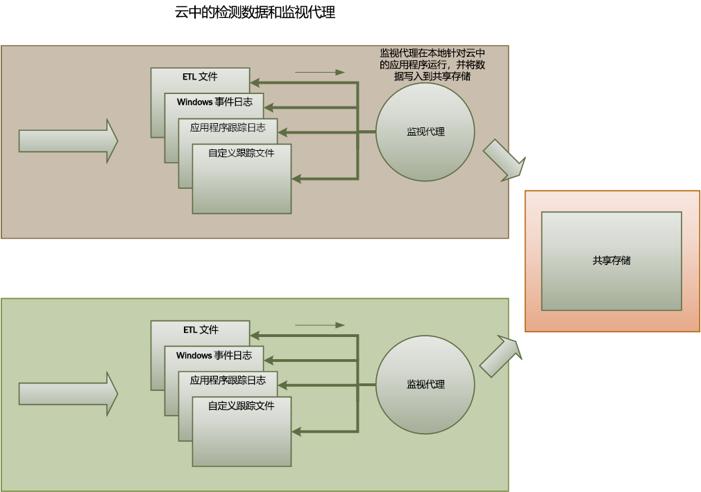
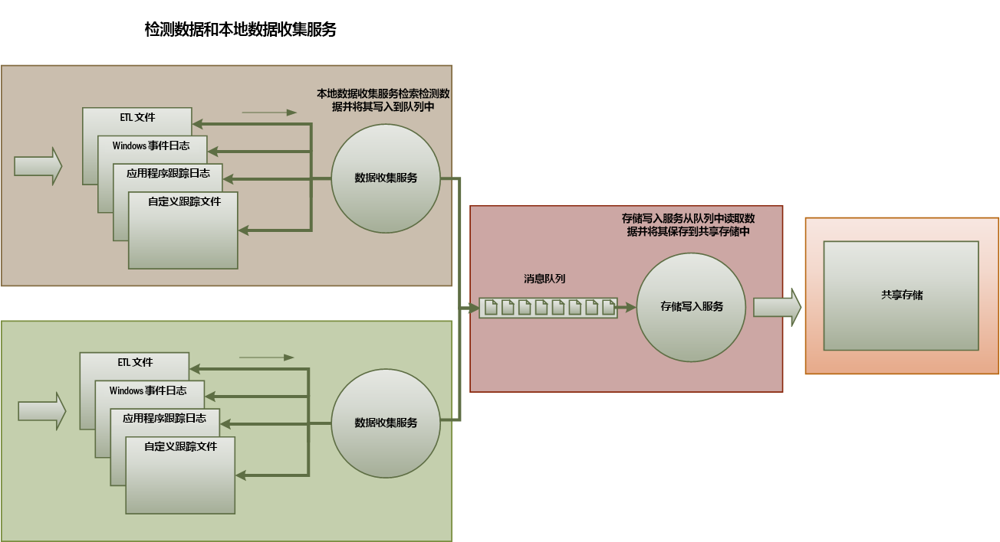
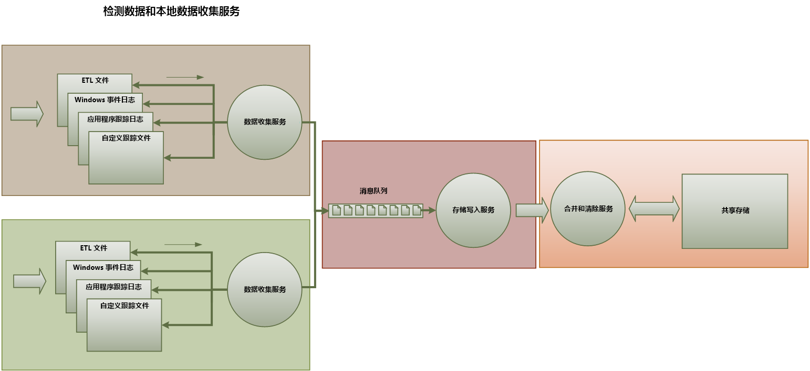

# <a name="monitoring-and-diagnostics"></a><span data-ttu-id="da097-103">监视和诊断</span><span class="sxs-lookup"><span data-stu-id="da097-103">Monitoring and diagnostics</span></span>
[!INCLUDE [header](../_includes/header.md)]

<span data-ttu-id="da097-104">根据具体的性质，云中运行的分布式应用程序及服务是由许多移动部件组成的复杂软件片段。</span><span class="sxs-lookup"><span data-stu-id="da097-104">Distributed applications and services running in the cloud are, by their nature, complex pieces of software that comprise many moving parts.</span></span> <span data-ttu-id="da097-105">在生产环境中，重要的是能够跟踪用户使用系统的方式，跟踪资源利用率以及在一般情况下监视系统的运行状况和性能。</span><span class="sxs-lookup"><span data-stu-id="da097-105">In a production environment, it's important to be able to track the way in which users utilize your system, trace resource utilization, and generally monitor the health and performance of your system.</span></span> <span data-ttu-id="da097-106">可以使用本文中的信息作为诊断辅助，来检测和更正问题，同时帮助找出潜在的问题并避免其发生。</span><span class="sxs-lookup"><span data-stu-id="da097-106">You can use this information as a diagnostic aid to detect and correct issues, and also to help spot potential problems and prevent them from occurring.</span></span>

## <a name="monitoring-and-diagnostics-scenarios"></a><span data-ttu-id="da097-107">监视和诊断方案</span><span class="sxs-lookup"><span data-stu-id="da097-107">Monitoring and diagnostics scenarios</span></span>
<span data-ttu-id="da097-108">可以使用监视功能深入了解系统运行状况。</span><span class="sxs-lookup"><span data-stu-id="da097-108">You can use monitoring to gain an insight into how well a system is functioning.</span></span> <span data-ttu-id="da097-109">监视是维持服务质量目标的重要部分。</span><span class="sxs-lookup"><span data-stu-id="da097-109">Monitoring is a crucial part of maintaining quality-of-service targets.</span></span> <span data-ttu-id="da097-110">收集监视数据的常见方案包括：</span><span class="sxs-lookup"><span data-stu-id="da097-110">Common scenarios for collecting monitoring data include:</span></span>

* <span data-ttu-id="da097-111">确保系统保持正常运行。</span><span class="sxs-lookup"><span data-stu-id="da097-111">Ensuring that the system remains healthy.</span></span>
* <span data-ttu-id="da097-112">跟踪系统及其组件元素的可用性。</span><span class="sxs-lookup"><span data-stu-id="da097-112">Tracking the availability of the system and its component elements.</span></span>
* <span data-ttu-id="da097-113">维护性能，以确保系统的吞吐量不会在工作量增加时意外降级。</span><span class="sxs-lookup"><span data-stu-id="da097-113">Maintaining performance to ensure that the throughput of the system does not degrade unexpectedly as the volume of work increases.</span></span>
* <span data-ttu-id="da097-114">保证系统符合任何与客户议定的服务级别协议 (SLA)。</span><span class="sxs-lookup"><span data-stu-id="da097-114">Guaranteeing that the system meets any service-level agreements (SLAs) established with customers.</span></span>
* <span data-ttu-id="da097-115">保护系统、用户及其数据的隐私性和安全性。</span><span class="sxs-lookup"><span data-stu-id="da097-115">Protecting the privacy and security of the system, users, and their data.</span></span>
* <span data-ttu-id="da097-116">跟踪基于审核或法规目的而执行的操作。</span><span class="sxs-lookup"><span data-stu-id="da097-116">Tracking the operations that are performed for auditing or regulatory purposes.</span></span>
* <span data-ttu-id="da097-117">监视系统的日常使用情况，并查明哪些趋势在未解决的情况下可能会导致问题。</span><span class="sxs-lookup"><span data-stu-id="da097-117">Monitoring the day-to-day usage of the system and spotting trends that might lead to problems if they're not addressed.</span></span>
* <span data-ttu-id="da097-118">跟踪发生的问题，从初始报告到分析可能原因、纠正、后续软件更新和部署。</span><span class="sxs-lookup"><span data-stu-id="da097-118">Tracking issues that occur, from initial report through to analysis of possible causes, rectification, consequent software updates, and deployment.</span></span>
* <span data-ttu-id="da097-119">跟踪操作和调试软件版本。</span><span class="sxs-lookup"><span data-stu-id="da097-119">Tracing operations and debugging software releases.</span></span>

> [!NOTE]
> <span data-ttu-id="da097-120">此列表并不完整。</span><span class="sxs-lookup"><span data-stu-id="da097-120">This list is not intended to be comprehensive.</span></span> <span data-ttu-id="da097-121">本文档重点介绍的这些方案是执行监视时最常见的情况。</span><span class="sxs-lookup"><span data-stu-id="da097-121">This document focuses on these scenarios as the most common situations for performing monitoring.</span></span> <span data-ttu-id="da097-122">可能存在一些较不常见的方案，或特定于环境的方案。</span><span class="sxs-lookup"><span data-stu-id="da097-122">There might be others that are less common or are specific to your environment.</span></span>
> 
> 

<span data-ttu-id="da097-123">以下部分更详细说明了这些方案。</span><span class="sxs-lookup"><span data-stu-id="da097-123">The following sections describe these scenarios in more detail.</span></span> <span data-ttu-id="da097-124">每种方案的信息使用以下格式介绍：</span><span class="sxs-lookup"><span data-stu-id="da097-124">The information for each scenario is discussed in the following format:</span></span>

1. <span data-ttu-id="da097-125">方案的简要概述</span><span class="sxs-lookup"><span data-stu-id="da097-125">A brief overview of the scenario</span></span>
2. <span data-ttu-id="da097-126">此方案的典型要求</span><span class="sxs-lookup"><span data-stu-id="da097-126">The typical requirements of this scenario</span></span>
3. <span data-ttu-id="da097-127">支持方案所需的原始检测数据，以及此信息的可能来源</span><span class="sxs-lookup"><span data-stu-id="da097-127">The raw instrumentation data that's required to support the scenario, and possible sources of this information</span></span>
4. <span data-ttu-id="da097-128">如何分析与合并此原始数据，以生成有意义的诊断信息</span><span class="sxs-lookup"><span data-stu-id="da097-128">How this raw data can be analyzed and combined to generate meaningful diagnostic information</span></span>

## <a name="health-monitoring"></a><span data-ttu-id="da097-129">运行状况监视</span><span class="sxs-lookup"><span data-stu-id="da097-129">Health monitoring</span></span>
<span data-ttu-id="da097-130">如果系统正在运行并能够处理请求，则表示运行正常。</span><span class="sxs-lookup"><span data-stu-id="da097-130">A system is healthy if it is running and capable of processing requests.</span></span> <span data-ttu-id="da097-131">运行状况监视的目的是生成系统的当前运行状况的快照，以便能够验证系统的所有组件是否正在按预期运行。</span><span class="sxs-lookup"><span data-stu-id="da097-131">The purpose of health monitoring is to generate a snapshot of the current health of the system so that you can verify that all components of the system are functioning as expected.</span></span>

### <a name="requirements-for-health-monitoring"></a><span data-ttu-id="da097-132">运行状况监视的要求</span><span class="sxs-lookup"><span data-stu-id="da097-132">Requirements for health monitoring</span></span>
<span data-ttu-id="da097-133">如果系统的任何部件被视为运行状况不正常，应该快速（在几秒内）向操作员发出警报。</span><span class="sxs-lookup"><span data-stu-id="da097-133">An operator should be alerted quickly (within a matter of seconds) if any part of the system is deemed to be unhealthy.</span></span> <span data-ttu-id="da097-134">操作员应该能够确定系统的哪些部件运行正常，以及哪些部件遇到问题。</span><span class="sxs-lookup"><span data-stu-id="da097-134">The operator should be able to ascertain which parts of the system are functioning normally, and which parts are experiencing problems.</span></span> <span data-ttu-id="da097-135">系统运行状况可以通过交通灯系统来突出显示：</span><span class="sxs-lookup"><span data-stu-id="da097-135">System health can be highlighted through a traffic-light system:</span></span>

* <span data-ttu-id="da097-136">红色表示不正常（系统已停止）</span><span class="sxs-lookup"><span data-stu-id="da097-136">Red for unhealthy (the system has stopped)</span></span>
* <span data-ttu-id="da097-137">黄色表示部分正常（系统正在运行但功能减少）</span><span class="sxs-lookup"><span data-stu-id="da097-137">Yellow for partially healthy (the system is running with reduced functionality)</span></span>
* <span data-ttu-id="da097-138">绿色表示完全正常</span><span class="sxs-lookup"><span data-stu-id="da097-138">Green for completely healthy</span></span>

<span data-ttu-id="da097-139">全面的运行状况监视系统可让操作员向下钻取系统，以查看子系统和组件的运行状态。</span><span class="sxs-lookup"><span data-stu-id="da097-139">A comprehensive health-monitoring system enables an operator to drill down through the system to view the health status of subsystems and components.</span></span> <span data-ttu-id="da097-140">例如，如果整个系统被描述为部分正常，则操作员应该能够进一步确定哪些功能当前不可用。</span><span class="sxs-lookup"><span data-stu-id="da097-140">For example, if the overall system is depicted as partially healthy, the operator should be able to zoom in and determine which functionality is currently unavailable.</span></span>

### <a name="data-sources-instrumentation-and-data-collection-requirements"></a><span data-ttu-id="da097-141">数据源、检测和数据收集要求</span><span class="sxs-lookup"><span data-stu-id="da097-141">Data sources, instrumentation, and data-collection requirements</span></span>
<span data-ttu-id="da097-142">支持运行状况监视所需的原始数据可以由以下情况生成：</span><span class="sxs-lookup"><span data-stu-id="da097-142">The raw data that's required to support health monitoring can be generated as a result of:</span></span>

* <span data-ttu-id="da097-143">跟踪用户请求的执行。</span><span class="sxs-lookup"><span data-stu-id="da097-143">Tracing execution of user requests.</span></span> <span data-ttu-id="da097-144">此信息可以用来确定哪些请求已成功、哪些请求已失败，以及每个请求花费了多长时间。</span><span class="sxs-lookup"><span data-stu-id="da097-144">This information can be used to determine which requests have succeeded, which have failed, and how long each request takes.</span></span>
* <span data-ttu-id="da097-145">合成用户监视。</span><span class="sxs-lookup"><span data-stu-id="da097-145">Synthetic user monitoring.</span></span> <span data-ttu-id="da097-146">此过程将模拟用户执行的步骤，并遵循预先定义的一系列步骤。</span><span class="sxs-lookup"><span data-stu-id="da097-146">This process simulates the steps performed by a user and follows a predefined series of steps.</span></span> <span data-ttu-id="da097-147">应该捕获每个步骤的结果。</span><span class="sxs-lookup"><span data-stu-id="da097-147">The results of each step should be captured.</span></span>
* <span data-ttu-id="da097-148">日志记录异常、错误和警告。</span><span class="sxs-lookup"><span data-stu-id="da097-148">Logging exceptions, faults, and warnings.</span></span> <span data-ttu-id="da097-149">若要捕获此信息，可以在应用程序代码中嵌入跟踪语句，以及从系统引用的任何服务的事件日志中检索信息。</span><span class="sxs-lookup"><span data-stu-id="da097-149">This information can be captured as a result of trace statements embedded into the application code, as well as retrieving information from the event logs of any services that the system references.</span></span>
* <span data-ttu-id="da097-150">监视系统使用的任何第三方服务的运行状况。</span><span class="sxs-lookup"><span data-stu-id="da097-150">Monitoring the health of any third-party services that the system uses.</span></span> <span data-ttu-id="da097-151">这种监视可能需要检索并分析这些服务提供的运行状况数据。</span><span class="sxs-lookup"><span data-stu-id="da097-151">This monitoring might require retrieving and parsing health data that these services supply.</span></span> <span data-ttu-id="da097-152">这些信息可能采取各种格式。</span><span class="sxs-lookup"><span data-stu-id="da097-152">This information might take a variety of formats.</span></span>
* <span data-ttu-id="da097-153">终结点监视。</span><span class="sxs-lookup"><span data-stu-id="da097-153">Endpoint monitoring.</span></span> <span data-ttu-id="da097-154">“可用性监视”部分详细介绍了该机制。</span><span class="sxs-lookup"><span data-stu-id="da097-154">This mechanism is described in more detail in the "Availability monitoring" section.</span></span>
* <span data-ttu-id="da097-155">收集环境性能信息，例如后台 CPU 利用率或 I/O（包括网络）活动。</span><span class="sxs-lookup"><span data-stu-id="da097-155">Collecting ambient performance information, such as background CPU utilization or I/O (including network) activity.</span></span>

### <a name="analyzing-health-data"></a><span data-ttu-id="da097-156">分析运行状况数据</span><span class="sxs-lookup"><span data-stu-id="da097-156">Analyzing health data</span></span>
<span data-ttu-id="da097-157">运行状况监视的重点在于快速指示系统是否正在运行。</span><span class="sxs-lookup"><span data-stu-id="da097-157">The primary focus of health monitoring is to quickly indicate whether the system is running.</span></span> <span data-ttu-id="da097-158">如果检测到关键组件的运行状况不正常，即时数据热分析可以触发警报。</span><span class="sxs-lookup"><span data-stu-id="da097-158">Hot analysis of the immediate data can trigger an alert if a critical component is detected as unhealthy.</span></span> <span data-ttu-id="da097-159">（例如，无法响应一系列连续的 ping。）然后操作员可以采取适当的纠正措施。</span><span class="sxs-lookup"><span data-stu-id="da097-159">(It fails to respond to a consecutive series of pings, for example.) The operator can then take the appropriate corrective action.</span></span>

<span data-ttu-id="da097-160">更高级的系统可能包含对最近和当前工作负荷运行冷分析的预测元素。</span><span class="sxs-lookup"><span data-stu-id="da097-160">A more advanced system might include a predictive element that performs a cold analysis over recent and current workloads.</span></span> <span data-ttu-id="da097-161">冷分析可以找出趋势并确定系统是否可能一直保持正常，或是否即将需要其他资源。</span><span class="sxs-lookup"><span data-stu-id="da097-161">A cold analysis can spot trends and determine whether the system is likely to remain healthy or whether the system will need additional resources.</span></span> <span data-ttu-id="da097-162">此预测元素应该基于关键的性能度量值，例如：</span><span class="sxs-lookup"><span data-stu-id="da097-162">This predictive element should be based on critical performance metrics, such as:</span></span>

* <span data-ttu-id="da097-163">每个服务或子系统中定向请求的速率。</span><span class="sxs-lookup"><span data-stu-id="da097-163">The rate of requests directed at each service or subsystem.</span></span>
* <span data-ttu-id="da097-164">这些请求的响应时间。</span><span class="sxs-lookup"><span data-stu-id="da097-164">The response times of these requests.</span></span>
* <span data-ttu-id="da097-165">流入和流出每个服务的数据量。</span><span class="sxs-lookup"><span data-stu-id="da097-165">The volume of data flowing into and out of each service.</span></span>

<span data-ttu-id="da097-166">如果任何度量值超过定义的阈值，系统可以引发警报，让操作员或自动调整功能（如果有）采取必要的预防措施，以保持系统正常运行。</span><span class="sxs-lookup"><span data-stu-id="da097-166">If the value of any metric exceeds a defined threshold, the system can raise an alert to enable an operator or autoscaling (if available) to take the preventative actions necessary to maintain system health.</span></span> <span data-ttu-id="da097-167">这些措施可能涉及到添加资源、重新启动一个或多个失败的服务，或者向优先级较低的请求应用限制。</span><span class="sxs-lookup"><span data-stu-id="da097-167">These actions might involve adding resources, restarting one or more services that are failing, or applying throttling to lower-priority requests.</span></span>

## <a name="availability-monitoring"></a><span data-ttu-id="da097-168">可用性监视</span><span class="sxs-lookup"><span data-stu-id="da097-168">Availability monitoring</span></span>
<span data-ttu-id="da097-169">运行状况真正良好的系统要求构成该系统的组件和子系统可用。</span><span class="sxs-lookup"><span data-stu-id="da097-169">A truly healthy system requires that the components and subsystems that compose the system are available.</span></span> <span data-ttu-id="da097-170">可用性监视与运行状况监视密切相关。</span><span class="sxs-lookup"><span data-stu-id="da097-170">Availability monitoring is closely related to health monitoring.</span></span> <span data-ttu-id="da097-171">但是运行状况监视提供系统当前运行状况的实时视图，而可用性监视涉及到跟踪系统及其组件的可用性，以生成有关系统运行时间的统计信息。</span><span class="sxs-lookup"><span data-stu-id="da097-171">But whereas health monitoring provides an immediate view of the current health of the system, availability monitoring is concerned with tracking the availability of the system and its components to generate statistics about the uptime of the system.</span></span>

<span data-ttu-id="da097-172">在许多系统中，某些组件（例如数据库）配置了内置冗余，以便在发生严重故障或连接断开时快速故障转移。</span><span class="sxs-lookup"><span data-stu-id="da097-172">In many systems, some components (such as a database) are configured with built-in redundancy to permit rapid failover in the event of a serious fault or loss of connectivity.</span></span> <span data-ttu-id="da097-173">在理想情况下，用户不会察觉到这种故障。</span><span class="sxs-lookup"><span data-stu-id="da097-173">Ideally, users should not be aware that such a failure has occurred.</span></span> <span data-ttu-id="da097-174">但从可用性监视的立场来看，有必要尽量多地收集有关此类故障的信息，以找出原因，采取纠正措施，并防止故障再次发生。</span><span class="sxs-lookup"><span data-stu-id="da097-174">But from an availability monitoring perspective, it's necessary to gather as much information as possible about such failures to determine the cause and take corrective actions to prevent them from recurring.</span></span>

<span data-ttu-id="da097-175">跟踪可用性所需的数据可能取决于一些低级因素。</span><span class="sxs-lookup"><span data-stu-id="da097-175">The data that's required to track availability might depend on a number of lower-level factors.</span></span> <span data-ttu-id="da097-176">其中的许多因素可能特定于应用程序、系统和环境。</span><span class="sxs-lookup"><span data-stu-id="da097-176">Many of these factors might be specific to the application, system, and environment.</span></span> <span data-ttu-id="da097-177">有效的监视系统将捕获对应于这些低层因素的可用性数据，然后将其聚合以提供系统的整体视图。</span><span class="sxs-lookup"><span data-stu-id="da097-177">An effective monitoring system captures the availability data that corresponds to these low-level factors and then aggregates them to give an overall picture of the system.</span></span> <span data-ttu-id="da097-178">例如，在电子商务系统中，可让客户下单的商务功能可能取决于存储订单详细数据的存储库，以及为这些订单处理货币交易的付款系统。</span><span class="sxs-lookup"><span data-stu-id="da097-178">For example, in an e-commerce system, the business functionality that enables a customer to place orders might depend on the repository where order details are stored and the payment system that handles the monetary transactions for paying for these orders.</span></span> <span data-ttu-id="da097-179">因此，系统的下单部件的可用性取决于存储库和付款子系统的可用性。</span><span class="sxs-lookup"><span data-stu-id="da097-179">The availability of the order-placement part of the system is therefore a function of the availability of the repository and the payment subsystem.</span></span>

### <a name="requirements-for-availability-monitoring"></a><span data-ttu-id="da097-180">可用性监视的要求</span><span class="sxs-lookup"><span data-stu-id="da097-180">Requirements for availability monitoring</span></span>
<span data-ttu-id="da097-181">操作员还应能够查看每个系统和子系统的历史可用性，并使用此信息来找出任何可能会造成一个或多个子系统定期发生故障的趋势。</span><span class="sxs-lookup"><span data-stu-id="da097-181">An operator should also be able to view the historical availability of each system and subsystem, and use this information to spot any trends that might cause one or more subsystems to periodically fail.</span></span> <span data-ttu-id="da097-182">（服务是否在一天的特定时间开始发生故障，而该时间对应于高峰处理时间？）</span><span class="sxs-lookup"><span data-stu-id="da097-182">(Do services start to fail at a particular time of day that corresponds to peak processing hours?)</span></span>

<span data-ttu-id="da097-183">监视解决方案不仅能够提供可用性的即时和历史视图或每个子系统的其他视图。</span><span class="sxs-lookup"><span data-stu-id="da097-183">A monitoring solution should provide an immediate and historical view of the availability or unavailability of each subsystem.</span></span> <span data-ttu-id="da097-184">此外，还应该能够在一个或多个服务发生故障或用户无法连接到服务时快速向操作员发出警报。</span><span class="sxs-lookup"><span data-stu-id="da097-184">It should also be capable of quickly alerting an operator when one or more services fail or when users can't connect to services.</span></span> <span data-ttu-id="da097-185">这不仅仅是监视每个服务，而且还要检查尝试与服务通信失败时，每个用户执行的操作。</span><span class="sxs-lookup"><span data-stu-id="da097-185">This is a matter of not only monitoring each service, but also examining the actions that each user performs if these actions fail when they attempt to communicate with a service.</span></span> <span data-ttu-id="da097-186">在某种程度上，连接失败是正常情况，这有可能是因为暂时性错误。</span><span class="sxs-lookup"><span data-stu-id="da097-186">To some extent, a degree of connectivity failure is normal and might be due to transient errors.</span></span> <span data-ttu-id="da097-187">但允许系统就特定时段发生的指定子系统连接失败次数发出警报可能会有帮助。</span><span class="sxs-lookup"><span data-stu-id="da097-187">But it might be useful to allow the system to raise an alert for the number of connectivity failures to a specified subsystem that occur during a specific period.</span></span>

### <a name="data-sources-instrumentation-and-data-collection-requirements"></a><span data-ttu-id="da097-188">数据源、检测和数据收集要求</span><span class="sxs-lookup"><span data-stu-id="da097-188">Data sources, instrumentation, and data-collection requirements</span></span>
<span data-ttu-id="da097-189">使用运行状况监视时，支持可用性监视所需的原始数据可以通过合成用户监视和记录任何异常、错误和警告来生成。</span><span class="sxs-lookup"><span data-stu-id="da097-189">As with health monitoring, the raw data that's required to support availability monitoring can be generated as a result of synthetic user monitoring and logging any exceptions, faults, and warnings that might occur.</span></span> <span data-ttu-id="da097-190">此外，还可以通过执行终结点监视来获取可用性数据。</span><span class="sxs-lookup"><span data-stu-id="da097-190">In addition, availability data can be obtained from performing endpoint monitoring.</span></span> <span data-ttu-id="da097-191">应用程序可以公开一个或多个正常的终结点，每个终结点将对系统中的某个功能区进行测试访问。</span><span class="sxs-lookup"><span data-stu-id="da097-191">The application can expose one or more health endpoints, each testing access to a functional area within the system.</span></span> <span data-ttu-id="da097-192">监视系统可以根据定义的计划来 ping 每个终结点，并收集结果（成功或失败）。</span><span class="sxs-lookup"><span data-stu-id="da097-192">The monitoring system can ping each endpoint by following a defined schedule and collect the results (success or fail).</span></span>

<span data-ttu-id="da097-193">必须记录所有的超时和网络连接失败，以及连接重试次数。</span><span class="sxs-lookup"><span data-stu-id="da097-193">All timeouts, network connectivity failures, and connection retry attempts must be recorded.</span></span> <span data-ttu-id="da097-194">所有数据应该标有时间戳。</span><span class="sxs-lookup"><span data-stu-id="da097-194">All data should be time-stamped.</span></span>

<a name="analyzing-availability-data"></a>

### <a name="analyzing-availability-data"></a><span data-ttu-id="da097-195">分析可用性数据</span><span class="sxs-lookup"><span data-stu-id="da097-195">Analyzing availability data</span></span>
<span data-ttu-id="da097-196">必须聚合并关联检测数据，以支持以下类型的分析：</span><span class="sxs-lookup"><span data-stu-id="da097-196">The instrumentation data must be aggregated and correlated to support the following types of analysis:</span></span>

* <span data-ttu-id="da097-197">系统和子系统的即时可用性。</span><span class="sxs-lookup"><span data-stu-id="da097-197">The immediate availability of the system and subsystems.</span></span>
* <span data-ttu-id="da097-198">系统和子系统的可用性故障率。</span><span class="sxs-lookup"><span data-stu-id="da097-198">The availability failure rates of the system and subsystems.</span></span> <span data-ttu-id="da097-199">在理想情况下，操作员应该能够将故障与特定的活动相关联；系统发生故障时正在执行什么操作？</span><span class="sxs-lookup"><span data-stu-id="da097-199">Ideally, an operator should be able to correlate failures with specific activities: what was happening when the system failed?</span></span>
* <span data-ttu-id="da097-200">系统或任何子系统跨任何指定时段的故障率历史视图，以及故障发生时系统上的负载（例如用户请求数）。</span><span class="sxs-lookup"><span data-stu-id="da097-200">A historical view of failure rates of the system or any subsystems across any specified period, and the load on the system (number of user requests, for example) when a failure occurred.</span></span>
* <span data-ttu-id="da097-201">无法使用系统或任何子系统的原因。</span><span class="sxs-lookup"><span data-stu-id="da097-201">The reasons for unavailability of the system or any subsystems.</span></span> <span data-ttu-id="da097-202">例如，原因可能是服务未运行、断开连接、已连接但超时，以及已连接但返回了错误。</span><span class="sxs-lookup"><span data-stu-id="da097-202">For example, the reasons might be service not running, connectivity lost, connected but timing out, and connected but returning errors.</span></span>

<span data-ttu-id="da097-203">可以使用以下公式计算服务在某个时间段的可用性百分比：</span><span class="sxs-lookup"><span data-stu-id="da097-203">You can calculate the percentage availability of a service over a period of time by using the following formula:</span></span>

```
%Availability =  ((Total Time – Total Downtime) / Total Time ) * 100
```

<span data-ttu-id="da097-204">这有助于评估 SLA。</span><span class="sxs-lookup"><span data-stu-id="da097-204">This is useful for SLA purposes.</span></span> <span data-ttu-id="da097-205">（本指南稍后将详细介绍 [SLA 监视](#SLA-monitoring)。）*停机*的定义取决于服务。</span><span class="sxs-lookup"><span data-stu-id="da097-205">([SLA monitoring](#SLA-monitoring) is described in more detail later in this guidance.) The definition of *downtime* depends on the service.</span></span> <span data-ttu-id="da097-206">例如，Visual Studio Online 将停机定义为客户尝试连接到服务花费的时间超过 120 秒，以及在该时段建立连接后，所有基本读取和写入操作均失败。</span><span class="sxs-lookup"><span data-stu-id="da097-206">For example, Visual Studio Team Services Build Service defines downtime as the period (total accumulated minutes) during which Build Service is unavailable.</span></span> <span data-ttu-id="da097-207">如果所有连续的 HTTP 均请求“生成服务”执行由客户发起的操作，全部的分钟数导致了“错误代码”或未返回响应，则一个分钟数被视为对于给定的用户计划不可用。</span><span class="sxs-lookup"><span data-stu-id="da097-207">A minute is considered unavailable if all continuous HTTP requests to Build Service to perform customer-initiated operations throughout the minute either result in an error code or do not return a response.</span></span>

## <a name="performance-monitoring"></a><span data-ttu-id="da097-208">性能监视</span><span class="sxs-lookup"><span data-stu-id="da097-208">Performance monitoring</span></span>
<span data-ttu-id="da097-209">随着系统的压力越来越大（由于用户数量增加），这些用户访问的数据集大小会增加，一个或多个组件发生故障的可能性也越大。</span><span class="sxs-lookup"><span data-stu-id="da097-209">As the system is placed under more and more stress (by increasing the volume of users), the size of the datasets that these users access grows and the possibility of failure of one or more components becomes more likely.</span></span> <span data-ttu-id="da097-210">通常，在组件发生故障之前的性能会降低。</span><span class="sxs-lookup"><span data-stu-id="da097-210">Frequently, component failure is preceded by a decrease in performance.</span></span> <span data-ttu-id="da097-211">如果可以检测到这种下降，就可以采取主动措施来补救这种局面。</span><span class="sxs-lookup"><span data-stu-id="da097-211">If you're able detect such a decrease, you can take proactive steps to remedy the situation.</span></span>

<span data-ttu-id="da097-212">系统性能取决于许多因素。</span><span class="sxs-lookup"><span data-stu-id="da097-212">System performance depends on a number of factors.</span></span> <span data-ttu-id="da097-213">每个因素通常是通过关键性能指标 (KPI) 来度量的，例如每秒的数据库事务数，或在指定时间范围内成功为其提供服务的网络请求量。</span><span class="sxs-lookup"><span data-stu-id="da097-213">Each factor is typically measured through key performance indicators (KPIs), such as the number of database transactions per second or the volume of network requests that are successfully serviced in a specified time frame.</span></span> <span data-ttu-id="da097-214">其中一些 KPI 可用作特定的性能度量，还有一些 KPI 可能派生自度量值的组合。</span><span class="sxs-lookup"><span data-stu-id="da097-214">Some of these KPIs might be available as specific performance measures, whereas others might be derived from a combination of metrics.</span></span>

> [!NOTE]
> <span data-ttu-id="da097-215">若要判断性能是不良还是良好，需要了解系统应该能够运行的性能级别。</span><span class="sxs-lookup"><span data-stu-id="da097-215">Determining poor or good performance requires that you understand the level of performance at which the system should be capable of running.</span></span> <span data-ttu-id="da097-216">这需要系统在典型负载下工作时观测系统，并在一段时间后捕获每个 KPI 的数据。</span><span class="sxs-lookup"><span data-stu-id="da097-216">This requires observing the system while it's functioning under a typical load and capturing the data for each KPI over a period of time.</span></span> <span data-ttu-id="da097-217">这可能包括在测试环境中于模拟负载下运行系统，并在将系统部署到生产环境之前收集相应的数据。</span><span class="sxs-lookup"><span data-stu-id="da097-217">This might involve running the system under a simulated load in a test environment and gathering the appropriate data before deploying the system to a production environment.</span></span>
> 
> <span data-ttu-id="da097-218">还应确保性能监视操作不会给系统造成负担。</span><span class="sxs-lookup"><span data-stu-id="da097-218">You should also ensure that monitoring for performance purposes does not become a burden on the system.</span></span> <span data-ttu-id="da097-219">可以动态调整有关性能监视过程收集数据的详细度。</span><span class="sxs-lookup"><span data-stu-id="da097-219">You might be able to dynamically adjust the level of detail for the data that the performance monitoring process gathers.</span></span>
> 
> 

### <a name="requirements-for-performance-monitoring"></a><span data-ttu-id="da097-220">性能监视的要求</span><span class="sxs-lookup"><span data-stu-id="da097-220">Requirements for performance monitoring</span></span>
<span data-ttu-id="da097-221">若要检查系统性能，操作员通常需要查看如下所述的信息：</span><span class="sxs-lookup"><span data-stu-id="da097-221">To examine system performance, an operator typically needs to see information that includes:</span></span>

* <span data-ttu-id="da097-222">对用户请求的响应速率。</span><span class="sxs-lookup"><span data-stu-id="da097-222">The response rates for user requests.</span></span>
* <span data-ttu-id="da097-223">并发用户请求数。</span><span class="sxs-lookup"><span data-stu-id="da097-223">The number of concurrent user requests.</span></span>
* <span data-ttu-id="da097-224">网络流量。</span><span class="sxs-lookup"><span data-stu-id="da097-224">The volume of network traffic.</span></span>
* <span data-ttu-id="da097-225">完成业务事务的速率。</span><span class="sxs-lookup"><span data-stu-id="da097-225">The rates at which business transactions are being completed.</span></span>
* <span data-ttu-id="da097-226">请求的平均处理时间。</span><span class="sxs-lookup"><span data-stu-id="da097-226">The average processing time for requests.</span></span>

<span data-ttu-id="da097-227">提供可帮助操作员找出关联性的工具也很有帮助，例如：</span><span class="sxs-lookup"><span data-stu-id="da097-227">It can also be helpful to provide tools that enable an operator to help spot correlations, such as:</span></span>

* <span data-ttu-id="da097-228">并发用户数目与请求延迟时间的比较（在用户发送请求之后开始处理请求所花费的时间）。</span><span class="sxs-lookup"><span data-stu-id="da097-228">The number of concurrent users versus request latency times (how long it takes to start processing a request after the user has sent it).</span></span>
* <span data-ttu-id="da097-229">并发用户数目与平均响应时间的比较（在请求开始处理之后完成请求所花费的时间长度）。</span><span class="sxs-lookup"><span data-stu-id="da097-229">The number of concurrent users versus the average response time (how long it takes to complete a request after it has started processing).</span></span>
* <span data-ttu-id="da097-230">请求数量与处理错误次数。</span><span class="sxs-lookup"><span data-stu-id="da097-230">The volume of requests versus the number of processing errors.</span></span>

<span data-ttu-id="da097-231">操作员不但要获取此高级功能信息，而且还应该能够在系统中获取每个组件性能的详细视图。</span><span class="sxs-lookup"><span data-stu-id="da097-231">Along with this high-level functional information, an operator should be able to obtain a detailed view of the performance for each component in the system.</span></span> <span data-ttu-id="da097-232">通常可以通过低级性能计数器跟踪信息来提供此数据，例如：</span><span class="sxs-lookup"><span data-stu-id="da097-232">This data is typically provided through low-level performance counters that track information such as:</span></span>

* <span data-ttu-id="da097-233">内存利用率。</span><span class="sxs-lookup"><span data-stu-id="da097-233">Memory utilization.</span></span>
* <span data-ttu-id="da097-234">线程数。</span><span class="sxs-lookup"><span data-stu-id="da097-234">Number of threads.</span></span>
* <span data-ttu-id="da097-235">CPU 处理时间。</span><span class="sxs-lookup"><span data-stu-id="da097-235">CPU processing time.</span></span>
* <span data-ttu-id="da097-236">请求队列长度。</span><span class="sxs-lookup"><span data-stu-id="da097-236">Request queue length.</span></span>
* <span data-ttu-id="da097-237">磁盘或网络 I/O 速率和错误数。</span><span class="sxs-lookup"><span data-stu-id="da097-237">Disk or network I/O rates and errors.</span></span>
* <span data-ttu-id="da097-238">写入或读取的字节数。</span><span class="sxs-lookup"><span data-stu-id="da097-238">Number of bytes written or read.</span></span>
* <span data-ttu-id="da097-239">中间件指标，例如队列长度。</span><span class="sxs-lookup"><span data-stu-id="da097-239">Middleware indicators, such as queue length.</span></span>

<span data-ttu-id="da097-240">所有视觉效果应该允许操作员指定时间间隔。</span><span class="sxs-lookup"><span data-stu-id="da097-240">All visualizations should allow an operator to specify a time period.</span></span> <span data-ttu-id="da097-241">显示的数据可能是当前状况的快照和/或性能的历史视图。</span><span class="sxs-lookup"><span data-stu-id="da097-241">The displayed data might be a snapshot of the current situation and/or a historical view of the performance.</span></span>

<span data-ttu-id="da097-242">操作员应该能够根据任何指定的时间间隔为任何指定值的任何性能度量引发警报。</span><span class="sxs-lookup"><span data-stu-id="da097-242">An operator should be able to raise an alert based on any performance measure for any specified value during any specified time interval.</span></span>

### <a name="data-sources-instrumentation-and-data-collection-requirements"></a><span data-ttu-id="da097-243">数据源、检测和数据收集要求</span><span class="sxs-lookup"><span data-stu-id="da097-243">Data sources, instrumentation, and data-collection requirements</span></span>
<span data-ttu-id="da097-244">可以通过监视用户请求抵达并通过系统的进度来收集高级性能数据（吞吐量、并发用户数、业务事务数、错误率等）。</span><span class="sxs-lookup"><span data-stu-id="da097-244">You can gather high-level performance data (throughput, number of concurrent users, number of business transactions, error rates, and so on) by monitoring the progress of users' requests as they arrive and pass through the system.</span></span> <span data-ttu-id="da097-245">这涉及到在应用程序代码的关键点中添加跟踪语句以及计时信息。</span><span class="sxs-lookup"><span data-stu-id="da097-245">This involves incorporating tracing statements at key points in the application code, together with timing information.</span></span> <span data-ttu-id="da097-246">应该捕获所有故障、异常和警告并提供足够的数据，以将其与导致其发生的请求相关联。</span><span class="sxs-lookup"><span data-stu-id="da097-246">All faults, exceptions, and warnings should be captured with sufficient data for correlating them with the requests that caused them.</span></span> <span data-ttu-id="da097-247">Internet 信息服务 (IIS) 日志是另一个有用的信息来源。</span><span class="sxs-lookup"><span data-stu-id="da097-247">The Internet Information Services (IIS) log is another useful source.</span></span>

<span data-ttu-id="da097-248">如果可能，还应捕获应用程序使用的任何外部系统的性能数据。</span><span class="sxs-lookup"><span data-stu-id="da097-248">If possible, you should also capture performance data for any external systems that the application uses.</span></span> <span data-ttu-id="da097-249">这些外部系统可能提供自身的性能计数器，或其他用于请求性能数据的功能。</span><span class="sxs-lookup"><span data-stu-id="da097-249">These external systems might provide their own performance counters or other features for requesting performance data.</span></span> <span data-ttu-id="da097-250">如果无法做到这一点，则应该记录信息，例如，对外部系统发出的每个请求的开始时间和结束时间，以及操作的状态（成功、失败或警告）。</span><span class="sxs-lookup"><span data-stu-id="da097-250">If this is not possible, record information such as the start time and end time of each request made to an external system, together with the status (success, fail, or warning) of the operation.</span></span> <span data-ttu-id="da097-251">例如，可以使用秒表为请求计时；在请求开始时启动计时器，在请求完成时停止计时器。</span><span class="sxs-lookup"><span data-stu-id="da097-251">For example, you can use a stopwatch approach to time requests: start a timer when the request starts and then stop the timer when the request finishes.</span></span>

<span data-ttu-id="da097-252">系统中各个组件的低级性能数据可通过 Windows 性能计数器和 Azure 诊断等功能和服务来获取。</span><span class="sxs-lookup"><span data-stu-id="da097-252">Low-level performance data for individual components in a system might be available through features and services such as Windows performance counters and Azure Diagnostics.</span></span>

### <a name="analyzing-performance-data"></a><span data-ttu-id="da097-253">分析性能数据</span><span class="sxs-lookup"><span data-stu-id="da097-253">Analyzing performance data</span></span>
<span data-ttu-id="da097-254">许多分析工作包括根据用户请求类型聚合性能数据和/或每个请求发送到的子系统或服务。</span><span class="sxs-lookup"><span data-stu-id="da097-254">Much of the analysis work consists of aggregating performance data by user request type and/or the subsystem or service to which each request is sent.</span></span> <span data-ttu-id="da097-255">用户请求的示例包括将商品添加到购物车，或在电子商务系统中执行结算过程。</span><span class="sxs-lookup"><span data-stu-id="da097-255">An example of a user request is adding an item to a shopping cart or performing the checkout process in an e-commerce system.</span></span>

<span data-ttu-id="da097-256">另一项常见要求是以选择的百分位数聚合性能数据。</span><span class="sxs-lookup"><span data-stu-id="da097-256">Another common requirement is summarizing performance data in selected percentiles.</span></span> <span data-ttu-id="da097-257">例如，操作员可以确定 99% 的请求、95% 的请求和 70% 的请求的响应时间。</span><span class="sxs-lookup"><span data-stu-id="da097-257">For example, an operator might determine the response times for 99 percent of requests, 95 percent of requests, and 70 percent of requests.</span></span> <span data-ttu-id="da097-258">可能存在 SLA 目标或其他针对每个百分位数设置的目标。</span><span class="sxs-lookup"><span data-stu-id="da097-258">There might be SLA targets or other goals set for each percentile.</span></span> <span data-ttu-id="da097-259">应该以接近实时的频率报告持续结果，以帮助检测即时问题。</span><span class="sxs-lookup"><span data-stu-id="da097-259">The ongoing results should be reported in near real time to help detect immediate issues.</span></span> <span data-ttu-id="da097-260">此外，应聚合较长一段时间的结果以生成统计信息。</span><span class="sxs-lookup"><span data-stu-id="da097-260">The results should also be aggregated over the longer time for statistical purposes.</span></span>

<span data-ttu-id="da097-261">如果延迟问题影响了性能，操作员应该能够通过检查每个请求执行的每个步骤是否有延迟，以快速识别发生瓶颈的原因。</span><span class="sxs-lookup"><span data-stu-id="da097-261">In the case of latency issues affecting performance, an operator should be able to quickly identify the cause of the bottleneck by examining the latency of each step that each request performs.</span></span> <span data-ttu-id="da097-262">因此，性能数据必须提供一种方式来使每个步骤的性能度量相关联，以将这些度量关联到特定的请求。</span><span class="sxs-lookup"><span data-stu-id="da097-262">The performance data must therefore provide a means of correlating performance measures for each step to tie them to a specific request.</span></span>

<span data-ttu-id="da097-263">根据可视化要求，有用的做法是生成并存储包含原始数据视图的多维数据集。</span><span class="sxs-lookup"><span data-stu-id="da097-263">Depending on the visualization requirements, it might be useful to generate and store a data cube that contains views of the raw data.</span></span> <span data-ttu-id="da097-264">使用此多维数据集可对性能信息进行复杂的即席查询和分析。</span><span class="sxs-lookup"><span data-stu-id="da097-264">This data cube can allow complex ad hoc querying and analysis of the performance information.</span></span>

## <a name="security-monitoring"></a><span data-ttu-id="da097-265">安全监视</span><span class="sxs-lookup"><span data-stu-id="da097-265">Security monitoring</span></span>
<span data-ttu-id="da097-266">包含机密数据的所有商务系统必须实施安全结构。</span><span class="sxs-lookup"><span data-stu-id="da097-266">All commercial systems that include sensitive data must implement a security structure.</span></span> <span data-ttu-id="da097-267">安全机制的复杂性通常取决于数据的机密性。</span><span class="sxs-lookup"><span data-stu-id="da097-267">The complexity of the security mechanism is usually a function of the sensitivity of the data.</span></span> <span data-ttu-id="da097-268">在需要对用户进行身份验证的系统中，应该记录：</span><span class="sxs-lookup"><span data-stu-id="da097-268">In a system that requires users to be authenticated, you should record:</span></span>

* <span data-ttu-id="da097-269">所有登录尝试，不论是失败还是成功的尝试。</span><span class="sxs-lookup"><span data-stu-id="da097-269">All sign-in attempts, whether they fail or succeed.</span></span>
* <span data-ttu-id="da097-270">所有执行的操作，以及经过身份验证的用户访问的所有资源的详细信息。</span><span class="sxs-lookup"><span data-stu-id="da097-270">All operations performed by--and the details of all resources accessed by--an authenticated user.</span></span>
* <span data-ttu-id="da097-271">当用户终止其会话并注销时。</span><span class="sxs-lookup"><span data-stu-id="da097-271">When a user ends a session and signs out.</span></span>

<span data-ttu-id="da097-272">监视可以帮助检测系统受到的攻击。</span><span class="sxs-lookup"><span data-stu-id="da097-272">Monitoring might be able to help detect attacks on the system.</span></span> <span data-ttu-id="da097-273">例如，出现大量失败的登录尝试可能表示发生暴力破解攻击。</span><span class="sxs-lookup"><span data-stu-id="da097-273">For example, a large number of failed sign-in attempts might indicate a brute-force attack.</span></span> <span data-ttu-id="da097-274">而请求意外激增可能是拒绝服务 (DDoS) 攻击的后果。</span><span class="sxs-lookup"><span data-stu-id="da097-274">An unexpected surge in requests might be the result of a distributed denial-of-service (DDoS) attack.</span></span> <span data-ttu-id="da097-275">必须准备好监视对所有资源的所有请求，不论这些请求源于何处。</span><span class="sxs-lookup"><span data-stu-id="da097-275">You must be prepared to monitor all requests to all resources regardless of the source of these requests.</span></span> <span data-ttu-id="da097-276">具有登录漏洞的系统可能不需要用户实际登录就会意外地将资源公开给外界。</span><span class="sxs-lookup"><span data-stu-id="da097-276">A system that has a sign-in vulnerability might accidentally expose resources to the outside world without requiring a user to actually sign in.</span></span>

### <a name="requirements-for-security-monitoring"></a><span data-ttu-id="da097-277">安全监视的要求</span><span class="sxs-lookup"><span data-stu-id="da097-277">Requirements for security monitoring</span></span>
<span data-ttu-id="da097-278">安全监视的最重要方面是可让操作员快速：</span><span class="sxs-lookup"><span data-stu-id="da097-278">The most critical aspects of security monitoring should enable an operator to quickly:</span></span>

* <span data-ttu-id="da097-279">检测未经身份验证的实体尝试的入侵。</span><span class="sxs-lookup"><span data-stu-id="da097-279">Detect attempted intrusions by an unauthenticated entity.</span></span>
* <span data-ttu-id="da097-280">识别实体尝试对无权访问的数据执行操作。</span><span class="sxs-lookup"><span data-stu-id="da097-280">Identify attempts by entities to perform operations on data for which they have not been granted access.</span></span>
* <span data-ttu-id="da097-281">确定系统或其某个部件是受到内部还是外部的攻击。</span><span class="sxs-lookup"><span data-stu-id="da097-281">Determine whether the system, or some part of the system, is under attack from outside or inside.</span></span> <span data-ttu-id="da097-282">（例如，已经过身份验证的恶意用户可能正在尝试使系统停机。）</span><span class="sxs-lookup"><span data-stu-id="da097-282">(For example, a malicious authenticated user might be attempting to bring the system down.)</span></span>

<span data-ttu-id="da097-283">要满足这些要求，应将以下情况通知给操作员：</span><span class="sxs-lookup"><span data-stu-id="da097-283">To support these requirements, an operator should be notified:</span></span>

* <span data-ttu-id="da097-284">同一帐户在指定时间段内的登录尝试反复失败。</span><span class="sxs-lookup"><span data-stu-id="da097-284">If one account makes repeated failed sign-in attempts within a specified period.</span></span>
* <span data-ttu-id="da097-285">已经过身份验证的帐户在指定时间段内反复尝试访问禁止的资源。</span><span class="sxs-lookup"><span data-stu-id="da097-285">If one authenticated account repeatedly tries to access a prohibited resource during a specified period.</span></span>
* <span data-ttu-id="da097-286">在指定时间段内发生大量未经身份验证或未授权的请求。</span><span class="sxs-lookup"><span data-stu-id="da097-286">If a large number of unauthenticated or unauthorized requests occur during a specified period.</span></span>

<span data-ttu-id="da097-287">提供给操作员的信息应包括每个请求来源的主机地址。</span><span class="sxs-lookup"><span data-stu-id="da097-287">The information that's provided to an operator should include the host address of the source for each request.</span></span> <span data-ttu-id="da097-288">如果特定的地址范围定期发生安全违规，则可以阻止这些主机。</span><span class="sxs-lookup"><span data-stu-id="da097-288">If security violations regularly arise from a particular range of addresses, these hosts might be blocked.</span></span>

<span data-ttu-id="da097-289">保持系统安全的关键部分是能够快速检测偏离常规模式的操作。</span><span class="sxs-lookup"><span data-stu-id="da097-289">A key part in maintaining the security of a system is being able to quickly detect actions that deviate from the usual pattern.</span></span> <span data-ttu-id="da097-290">可以可视化方式显示失败和/或成功登录请求数等信息，以帮助检测是否在非常规时间出现活动高峰。</span><span class="sxs-lookup"><span data-stu-id="da097-290">Information such as the number of failed and/or successful sign-in requests can be displayed visually to help detect whether there is a spike in activity at an unusual time.</span></span> <span data-ttu-id="da097-291">（此活动的示例包括，用户在 3:00 AM 登录并执行大量操作，而他们的工作时间从 9:00 AM 才开始）。</span><span class="sxs-lookup"><span data-stu-id="da097-291">(An example of this activity is users signing in at 3:00 AM and performing a large number of operations when their working day starts at 9:00 AM).</span></span> <span data-ttu-id="da097-292">此信息还可用于帮助配置基于时间的自动缩放。</span><span class="sxs-lookup"><span data-stu-id="da097-292">This information can also be used to help configure time-based autoscaling.</span></span> <span data-ttu-id="da097-293">例如，如果操作员观测到大量用户定期在一天的特定时间登录，操作员可以安排启动附加的身份验证服务来处理此工作量，并在高峰过后，关闭这些附加的服务。</span><span class="sxs-lookup"><span data-stu-id="da097-293">For example, if an operator observes that a large number of users regularly sign in at a particular time of day, the operator can arrange to start additional authentication services to handle the volume of work, and then shut down these additional services when the peak has passed.</span></span>

### <a name="data-sources-instrumentation-and-data-collection-requirements"></a><span data-ttu-id="da097-294">数据源、检测和数据收集要求</span><span class="sxs-lookup"><span data-stu-id="da097-294">Data sources, instrumentation, and data-collection requirements</span></span>
<span data-ttu-id="da097-295">安全性属于大多数分布式系统的全方位层面。</span><span class="sxs-lookup"><span data-stu-id="da097-295">Security is an all-encompassing aspect of most distributed systems.</span></span> <span data-ttu-id="da097-296">而相关的数据可能会在整个系统的多个点生成。</span><span class="sxs-lookup"><span data-stu-id="da097-296">The pertinent data is likely to be generated at multiple points throughout a system.</span></span> <span data-ttu-id="da097-297">应该考虑采用安全信息和事件管理 (SIEM) 方法来收集应用程序、网络设备、服务器、防火墙、防病毒软件及其他入侵预防元素引发的事件所生成的安全性相关信息。</span><span class="sxs-lookup"><span data-stu-id="da097-297">You should consider adopting a Security Information and Event Management (SIEM) approach to gather the security-related information that results from events raised by the application, network equipment, servers, firewalls, antivirus software, and other intrusion-prevention elements.</span></span>

<span data-ttu-id="da097-298">安全监视可以整合来自不属于应用程序的工具的数据。</span><span class="sxs-lookup"><span data-stu-id="da097-298">Security monitoring can incorporate data from tools that are not part of your application.</span></span> <span data-ttu-id="da097-299">这些工具可以包括外部机构识别端口扫描活动的实用工具，或者检测尝试在未经身份验证的情况下访问应用程序和数据的网络过滤器。</span><span class="sxs-lookup"><span data-stu-id="da097-299">These tools can include utilities that identify port-scanning activities by external agencies, or network filters that detect attempts to gain unauthenticated access to your application and data.</span></span>

<span data-ttu-id="da097-300">在所有情况下，收集的数据必须可让管理员确定任何攻击的性质，并采取适当的应对措施。</span><span class="sxs-lookup"><span data-stu-id="da097-300">In all cases, the gathered data must enable an administrator to determine the nature of any attack and take the appropriate countermeasures.</span></span>

### <a name="analyzing-security-data"></a><span data-ttu-id="da097-301">分析安全数据</span><span class="sxs-lookup"><span data-stu-id="da097-301">Analyzing security data</span></span>
<span data-ttu-id="da097-302">安全监视的功能之一是监视数据的各种来源。</span><span class="sxs-lookup"><span data-stu-id="da097-302">A feature of security monitoring is the variety of sources from which the data arises.</span></span> <span data-ttu-id="da097-303">不同格式和详细程度通常需要对捕获的信息进行复杂分析，以将其关联成一致的信息线索。</span><span class="sxs-lookup"><span data-stu-id="da097-303">The different formats and level of detail often require complex analysis of the captured data to tie it together into a coherent thread of information.</span></span> <span data-ttu-id="da097-304">除了最简单的情况外（例如检测大量的失败登录，或者在未经授权的情况下反复尝试访问重要资源），有时可能无法对安全数据执行任何复杂的自动化处理。</span><span class="sxs-lookup"><span data-stu-id="da097-304">Apart from the simplest of cases (such as detecting a large number of failed sign-ins, or repeated attempts to gain unauthorized access to critical resources), it might not be possible to perform any complex automated processing of security data.</span></span> <span data-ttu-id="da097-305">最好是将此数据（标上时间戳，但以非原始格式表示）写入到安全存储库，以供专家进行手动分析。</span><span class="sxs-lookup"><span data-stu-id="da097-305">Instead, it might be preferable to write this data, time-stamped but otherwise in its original form, to a secure repository to allow for expert manual analysis.</span></span>

<a name="SLA-monitoring"></a>

## <a name="sla-monitoring"></a><span data-ttu-id="da097-306">SLA 监视</span><span class="sxs-lookup"><span data-stu-id="da097-306">SLA monitoring</span></span>
<span data-ttu-id="da097-307">许多支持客户付款的商务系统以 SLA 形式保证系统的性能。</span><span class="sxs-lookup"><span data-stu-id="da097-307">Many commercial systems that support paying customers make guarantees about the performance of the system in the form of SLAs.</span></span> <span data-ttu-id="da097-308">在根本上，SLA 规定系统可以在议定的时间范围内处理定义的工作量，且不会丢失重要信息。</span><span class="sxs-lookup"><span data-stu-id="da097-308">Essentially, SLAs state that the system can handle a defined volume of work within an agreed time frame and without losing critical information.</span></span> <span data-ttu-id="da097-309">SLA 监视涉及到确保系统能够满足可度量的 SLA。</span><span class="sxs-lookup"><span data-stu-id="da097-309">SLA monitoring is concerned with ensuring that the system can meet measurable SLAs.</span></span>

> [!NOTE]
> <span data-ttu-id="da097-310">SLA 监视与性能监视密切相关。</span><span class="sxs-lookup"><span data-stu-id="da097-310">SLA monitoring is closely related to performance monitoring.</span></span> <span data-ttu-id="da097-311">但是，性能监视渉及到确保系统以*最佳方式*工作，SLA 监视由定义*最佳方式*实际含义的合约责任所管控。</span><span class="sxs-lookup"><span data-stu-id="da097-311">But whereas performance monitoring is concerned with ensuring that the system functions *optimally*, SLA monitoring is governed by a contractual obligation that defines what *optimally* actually means.</span></span>
> 
> 

<span data-ttu-id="da097-312">SLA 中经常会规定以下条款：</span><span class="sxs-lookup"><span data-stu-id="da097-312">SLAs are often defined in terms of:</span></span>

* <span data-ttu-id="da097-313">整体系统可用性。</span><span class="sxs-lookup"><span data-stu-id="da097-313">Overall system availability.</span></span> <span data-ttu-id="da097-314">例如，组织可能会保证系统在 99.9% 的时间内可用。</span><span class="sxs-lookup"><span data-stu-id="da097-314">For example, an organization might guarantee that the system will be available for 99.9 percent of the time.</span></span> <span data-ttu-id="da097-315">这相当于每年停机时间不超过 9 小时或每周停机时间约 10 分钟。</span><span class="sxs-lookup"><span data-stu-id="da097-315">This equates to no more than 9 hours of downtime per year, or approximately 10 minutes a week.</span></span>
* <span data-ttu-id="da097-316">操作吞吐量。</span><span class="sxs-lookup"><span data-stu-id="da097-316">Operational throughput.</span></span> <span data-ttu-id="da097-317">这个方面通常以一个或多个高水位线来表示，例如，保证系统能够支持多达 100,000 个并发用户请求，或处理 10,000 个并发业务事务。</span><span class="sxs-lookup"><span data-stu-id="da097-317">This aspect is often expressed as one or more high-water marks, such as guaranteeing that the system can support up to 100,000 concurrent user requests or handle 10,000 concurrent business transactions.</span></span>
* <span data-ttu-id="da097-318">操作响应时间。</span><span class="sxs-lookup"><span data-stu-id="da097-318">Operational response time.</span></span> <span data-ttu-id="da097-319">系统还可能对请求的处理速率做出保证。</span><span class="sxs-lookup"><span data-stu-id="da097-319">The system might also make guarantees for the rate at which requests are processed.</span></span> <span data-ttu-id="da097-320">例如，所有业务事务的 99% 应在 2 秒内完成，而且单个事务花费的时间不会超过 10 秒。</span><span class="sxs-lookup"><span data-stu-id="da097-320">An example is that 99 percent of all business transactions will finish within 2 seconds, and no single transaction will take longer than 10 seconds.</span></span>

> [!NOTE]
> <span data-ttu-id="da097-321">商务系统的某些合同还可能包括有关客户支持的 SLA。</span><span class="sxs-lookup"><span data-stu-id="da097-321">Some contracts for commercial systems might also include SLAs for customer support.</span></span> <span data-ttu-id="da097-322">例如所有服务台应在 5 分钟内对请求做出响应，所有问题的 99% 应在 1 个工作日内完全解决。</span><span class="sxs-lookup"><span data-stu-id="da097-322">An example is that all help-desk requests will elicit a response within 5 minutes, and that 99 percent of all problems will be fully addressed within 1 working day.</span></span> <span data-ttu-id="da097-323">有效的[问题跟踪](#issue-tracking)（本部分稍后会介绍）是满足此类 SLA 的关键所在。</span><span class="sxs-lookup"><span data-stu-id="da097-323">Effective [issue tracking](#issue-tracking) (described later in this section) is key to meeting SLAs such as these.</span></span>
> 
> 

### <a name="requirements-for-sla-monitoring"></a><span data-ttu-id="da097-324">SLA 监视的要求</span><span class="sxs-lookup"><span data-stu-id="da097-324">Requirements for SLA monitoring</span></span>
<span data-ttu-id="da097-325">在最高层面上，操作员应该能够快速确定系统是否符合议定的 SLA。</span><span class="sxs-lookup"><span data-stu-id="da097-325">At the highest level, an operator should be able to determine at a glance whether the system is meeting the agreed SLAs or not.</span></span> <span data-ttu-id="da097-326">如果不符合，则操作员可以向下钻取并检查底层因素，以确定性能未达标准的原因。</span><span class="sxs-lookup"><span data-stu-id="da097-326">And if not, the operator should be able to drill down and examine the underlying factors to determine the reasons for substandard performance.</span></span>

<span data-ttu-id="da097-327">通常，可以用可视化方式描述的高级指标包括：</span><span class="sxs-lookup"><span data-stu-id="da097-327">Typical high-level indicators that can be depicted visually include:</span></span>

* <span data-ttu-id="da097-328">服务运行时间百分比。</span><span class="sxs-lookup"><span data-stu-id="da097-328">The percentage of service uptime.</span></span>
* <span data-ttu-id="da097-329">应用程序吞吐量（根据每秒成功的事务和/或操作数度量）。</span><span class="sxs-lookup"><span data-stu-id="da097-329">The application throughput (measured in terms of successful transactions and/or operations per second).</span></span>
* <span data-ttu-id="da097-330">成功/失败的应用程序请求数。</span><span class="sxs-lookup"><span data-stu-id="da097-330">The number of successful/failing application requests.</span></span>
* <span data-ttu-id="da097-331">应用程序和系统的故障、异常和警告数。</span><span class="sxs-lookup"><span data-stu-id="da097-331">The number of application and system faults, exceptions, and warnings.</span></span>

<span data-ttu-id="da097-332">应该能够根据指定的时间段筛选所有这些指标。</span><span class="sxs-lookup"><span data-stu-id="da097-332">All of these indicators should be capable of being filtered by a specified period of time.</span></span>

<span data-ttu-id="da097-333">一个云应用程序可能会包含在多个子系统和组件中。</span><span class="sxs-lookup"><span data-stu-id="da097-333">A cloud application will likely comprise a number of subsystems and components.</span></span> <span data-ttu-id="da097-334">操作员应该能够选择某个高级指标，并确定底层元素的运行状况如何影响该指标。</span><span class="sxs-lookup"><span data-stu-id="da097-334">An operator should be able to select a high-level indicator and see how it's composed from the health of the underlying elements.</span></span> <span data-ttu-id="da097-335">例如，如果整个系统的运行时间低于可接受的值，操作员应该能够进一步确定哪些元素造成此故障。</span><span class="sxs-lookup"><span data-stu-id="da097-335">For example, if the uptime of the overall system falls below an acceptable value, an operator should be able to zoom in and determine which elements are contributing to this failure.</span></span>

> [!NOTE]
> <span data-ttu-id="da097-336">需要慎重定义系统运行时间。</span><span class="sxs-lookup"><span data-stu-id="da097-336">System uptime needs to be defined carefully.</span></span> <span data-ttu-id="da097-337">在使用冗余确保最大可用性的系统中，元素的单个实例可能会发生故障，但系统仍可以保持正常运行。</span><span class="sxs-lookup"><span data-stu-id="da097-337">In a system that uses redundancy to ensure maximum availability, individual instances of elements might fail, but the system can remain functional.</span></span> <span data-ttu-id="da097-338">运行状况监视提供的系统运行时间应该指明每个元素的聚合运行时间，而无需多余地指出系统实际上是否已停止。</span><span class="sxs-lookup"><span data-stu-id="da097-338">System uptime as presented by health monitoring should indicate the aggregate uptime of each element and not necessarily whether the system has actually halted.</span></span> <span data-ttu-id="da097-339">此外，可以隔离故障。</span><span class="sxs-lookup"><span data-stu-id="da097-339">Additionally, failures might be isolated.</span></span> <span data-ttu-id="da097-340">因此，即使特定系统不使用，系统的余下部分可能仍然可用，但是功能却会减少。</span><span class="sxs-lookup"><span data-stu-id="da097-340">So even if a specific system is unavailable, the remainder of the system might remain available, although with decreased functionality.</span></span> <span data-ttu-id="da097-341">（在电子商务系统中，系统故障可能会阻止客户下单，但客户仍可浏览产品目录。）</span><span class="sxs-lookup"><span data-stu-id="da097-341">(In an e-commerce system, a failure in the system might prevent a customer from placing orders, but the customer might still be able to browse the product catalog.)</span></span>
> 
> 

<span data-ttu-id="da097-342">为了生成警报，如果有任何高级指标超出指定的阈值，系统应该能够引发事件。</span><span class="sxs-lookup"><span data-stu-id="da097-342">For alerting purposes, the system should be able to raise an event if any of the high-level indicators exceed a specified threshold.</span></span> <span data-ttu-id="da097-343">构成高级指针的各项因素的较低级详细信息应该可以用作警报系统的上下文数据。</span><span class="sxs-lookup"><span data-stu-id="da097-343">The lower-level details of the various factors that compose the high-level indicator should be available as contextual data to the alerting system.</span></span>

### <a name="data-sources-instrumentation-and-data-collection-requirements"></a><span data-ttu-id="da097-344">数据源、检测和数据收集要求</span><span class="sxs-lookup"><span data-stu-id="da097-344">Data sources, instrumentation, and data-collection requirements</span></span>
<span data-ttu-id="da097-345">支持 SLA 监视所需的原始数据类似于性能监视所需的原始数据，以及运行状况和可用性监视的某些方面。</span><span class="sxs-lookup"><span data-stu-id="da097-345">The raw data that's required to support SLA monitoring is similar to the raw data that's required for performance monitoring, together with some aspects of health and availability monitoring.</span></span> <span data-ttu-id="da097-346">（有关详细信息，请参阅相关部分。）可以通过以下方式捕获此数据：</span><span class="sxs-lookup"><span data-stu-id="da097-346">(See those sections for more details.) You can capture this data by:</span></span>

* <span data-ttu-id="da097-347">执行终结点监视。</span><span class="sxs-lookup"><span data-stu-id="da097-347">Performing endpoint monitoring.</span></span>
* <span data-ttu-id="da097-348">日志记录异常、错误和警告。</span><span class="sxs-lookup"><span data-stu-id="da097-348">Logging exceptions, faults, and warnings.</span></span>
* <span data-ttu-id="da097-349">跟踪用户请求的执行。</span><span class="sxs-lookup"><span data-stu-id="da097-349">Tracing the execution of user requests.</span></span>
* <span data-ttu-id="da097-350">监视系统所用任何第三方服务的可用性。</span><span class="sxs-lookup"><span data-stu-id="da097-350">Monitoring the availability of any third-party services that the system uses.</span></span>
* <span data-ttu-id="da097-351">使用性能度量值和计数器。</span><span class="sxs-lookup"><span data-stu-id="da097-351">Using performance metrics and counters.</span></span>

<span data-ttu-id="da097-352">必须为所有数据计时并标上时间戳。</span><span class="sxs-lookup"><span data-stu-id="da097-352">All data must be timed and time-stamped.</span></span>

### <a name="analyzing-sla-data"></a><span data-ttu-id="da097-353">分析 SLA 数据</span><span class="sxs-lookup"><span data-stu-id="da097-353">Analyzing SLA data</span></span>
<span data-ttu-id="da097-354">必须聚合检测数据，以生成系统整体性能视图。</span><span class="sxs-lookup"><span data-stu-id="da097-354">The instrumentation data must be aggregated to generate a picture of the overall performance of the system.</span></span> <span data-ttu-id="da097-355">聚合数据还必须支持向下钻取，以便能够检查底层子系统的性能。</span><span class="sxs-lookup"><span data-stu-id="da097-355">Aggregated data must also support drill-down to enable examination of the performance of the underlying subsystems.</span></span> <span data-ttu-id="da097-356">例如，应该能够：</span><span class="sxs-lookup"><span data-stu-id="da097-356">For example, you should be able to:</span></span>

* <span data-ttu-id="da097-357">计算指定时间段的用户请求总数，并确定这些请求的成功率和失败率。</span><span class="sxs-lookup"><span data-stu-id="da097-357">Calculate the total number of user requests during a specified period and determine the success and failure rate of these requests.</span></span>
* <span data-ttu-id="da097-358">合并用户请求的响应时间，以生成系统响应时间的整体视图。</span><span class="sxs-lookup"><span data-stu-id="da097-358">Combine the response times of user requests to generate an overall view of system response times.</span></span>
* <span data-ttu-id="da097-359">分析用户请求的进度，将请求的整体响应时间细分为该请求中单个工作项的响应时间。</span><span class="sxs-lookup"><span data-stu-id="da097-359">Analyze the progress of user requests to break down the overall response time of a request into the response times of the individual work items in that request.</span></span>  
* <span data-ttu-id="da097-360">根据任何特定时间段的运行时间百分比确定系统的整体可用性。</span><span class="sxs-lookup"><span data-stu-id="da097-360">Determine the overall availability of the system as a percentage of uptime for any specific period.</span></span>
* <span data-ttu-id="da097-361">分析系统中每个组件和服务的可用性时间百分比。</span><span class="sxs-lookup"><span data-stu-id="da097-361">Analyze the percentage time availability of the individual components and services in the system.</span></span> <span data-ttu-id="da097-362">这可能包括分析第三方服务生成的日志。</span><span class="sxs-lookup"><span data-stu-id="da097-362">This might involve parsing logs that third-party services have generated.</span></span>

<span data-ttu-id="da097-363">许多商务系统要求根据议定的 SLA 来报告指定时间段（通常是一个月）的实际性能数据。</span><span class="sxs-lookup"><span data-stu-id="da097-363">Many commercial systems are required to report real performance figures against agreed SLAs for a specified period, typically a month.</span></span> <span data-ttu-id="da097-364">如果在该时间段不符合 SLA，则可以使用此信息计算客户的信用或其他形式的偿还额度。</span><span class="sxs-lookup"><span data-stu-id="da097-364">This information can be used to calculate credits or other forms of repayments for customers if the SLAs are not met during that period.</span></span> <span data-ttu-id="da097-365">可以使用[分析可用性数据](#analyzing-availability-data)部分中所述的方法来计算服务可用性。</span><span class="sxs-lookup"><span data-stu-id="da097-365">You can calculate availability for a service by using the technique described in the section [Analyzing availability data](#analyzing-availability-data).</span></span>

<span data-ttu-id="da097-366">在内部，组织还可以跟踪导致服务故障的事故数目与性质。</span><span class="sxs-lookup"><span data-stu-id="da097-366">For internal purposes, an organization might also track the number and nature of incidents that caused services to fail.</span></span> <span data-ttu-id="da097-367">学习如何快速解决或完全消除这些问题，将有助于减少停机时间并满足 SLA。</span><span class="sxs-lookup"><span data-stu-id="da097-367">Learning how to resolve these issues quickly, or eliminate them completely, will help to reduce downtime and meet SLAs.</span></span>

## <a name="auditing"></a><span data-ttu-id="da097-368">审核</span><span class="sxs-lookup"><span data-stu-id="da097-368">Auditing</span></span>
<span data-ttu-id="da097-369">根据应用程序的性质，可能有法令或其他法规规定要求审核用户执行的操作并记录所有数据的访问。</span><span class="sxs-lookup"><span data-stu-id="da097-369">Depending on the nature of the application, there might be statutory or other legal regulations that specify requirements for auditing users' operations and recording all data access.</span></span> <span data-ttu-id="da097-370">审核可以提供将客户链接到特定请求的证据。</span><span class="sxs-lookup"><span data-stu-id="da097-370">Auditing can provide evidence that links customers to specific requests.</span></span> <span data-ttu-id="da097-371">在许多电子商务系统中，不可否认性是帮助维护客户与负责应用程序或服务组织之间的信任的重要因素。</span><span class="sxs-lookup"><span data-stu-id="da097-371">Non-repudiation is an important factor in many e-business systems to help maintain trust be between a customer and the organization that's responsible for the application or service.</span></span>

### <a name="requirements-for-auditing"></a><span data-ttu-id="da097-372">审核的要求</span><span class="sxs-lookup"><span data-stu-id="da097-372">Requirements for auditing</span></span>
<span data-ttu-id="da097-373">分析人员必须能够跟踪用户执行业务操作的顺序，以便可以重构用户的操作。</span><span class="sxs-lookup"><span data-stu-id="da097-373">An analyst must be able to trace the sequence of business operations that users are performing so that you can reconstruct users' actions.</span></span> <span data-ttu-id="da097-374">可能只是出于记录或法证调查而需要这样做。</span><span class="sxs-lookup"><span data-stu-id="da097-374">This might be necessary simply as a matter of record, or as part of a forensic investigation.</span></span>

<span data-ttu-id="da097-375">审核信息高度机密。</span><span class="sxs-lookup"><span data-stu-id="da097-375">Audit information is highly sensitive.</span></span> <span data-ttu-id="da097-376">它可能包含识别系统用户的数据，以及用户执行的任务。</span><span class="sxs-lookup"><span data-stu-id="da097-376">It will likely include data that identifies the users of the system, together with the tasks that they're performing.</span></span> <span data-ttu-id="da097-377">为此，审核信息很可能以报告形式提供给受信任的分析人员，而不是使用支持向下钻取图形操作的交互式系统。</span><span class="sxs-lookup"><span data-stu-id="da097-377">For this reason, audit information will most likely take the form of reports that are available only to trusted analysts rather than as an interactive system that supports drill-down of graphical operations.</span></span> <span data-ttu-id="da097-378">分析人员应该能够生成各种报告。</span><span class="sxs-lookup"><span data-stu-id="da097-378">An analyst should be able to generate a range of reports.</span></span> <span data-ttu-id="da097-379">例如，报告可以列出在指定时间范围内发生的所有用户活动、详述单个用户的活动时序，或列出针对一个或多个资源执行的一系列操作。</span><span class="sxs-lookup"><span data-stu-id="da097-379">For example, reports might list all users' activities occurring during a specified time frame, detail the chronology of activity for a single user, or list the sequence of operations performed against one or more resources.</span></span>

### <a name="data-sources-instrumentation-and-data-collection-requirements"></a><span data-ttu-id="da097-380">数据源、检测和数据收集要求</span><span class="sxs-lookup"><span data-stu-id="da097-380">Data sources, instrumentation, and data-collection requirements</span></span>
<span data-ttu-id="da097-381">审核信息的主要来源可能包括：</span><span class="sxs-lookup"><span data-stu-id="da097-381">The primary sources of information for auditing can include:</span></span>

* <span data-ttu-id="da097-382">管理用户身份验证的安全系统。</span><span class="sxs-lookup"><span data-stu-id="da097-382">The security system that manages user authentication.</span></span>
* <span data-ttu-id="da097-383">记录用户活动的跟踪日志。</span><span class="sxs-lookup"><span data-stu-id="da097-383">Trace logs that record user activity.</span></span>
* <span data-ttu-id="da097-384">跟踪所有可识别和不可识别网络请求的安全日志。</span><span class="sxs-lookup"><span data-stu-id="da097-384">Security logs that track all identifiable and unidentifiable network requests.</span></span>

<span data-ttu-id="da097-385">审核数据的格式及其存储方式可能受到法规要求的约束。</span><span class="sxs-lookup"><span data-stu-id="da097-385">The format of the audit data and the way in which it's stored might be driven by regulatory requirements.</span></span> <span data-ttu-id="da097-386">例如，可能无法以任何方式清理数据。</span><span class="sxs-lookup"><span data-stu-id="da097-386">For example, it might not be possible to clean the data in any way.</span></span> <span data-ttu-id="da097-387">（必须以其原始格式记录。）对保存数据的存储库的访问必须受到保护，以防篡改数据</span><span class="sxs-lookup"><span data-stu-id="da097-387">(It must be recorded in its original format.) Access to the repository where it's held must be protected to prevent tampering.</span></span>

### <a name="analyzing-audit-data"></a><span data-ttu-id="da097-388">分析审核数据</span><span class="sxs-lookup"><span data-stu-id="da097-388">Analyzing audit data</span></span>
<span data-ttu-id="da097-389">分析人员必须能够完全访问原始格式的原始数据。</span><span class="sxs-lookup"><span data-stu-id="da097-389">An analyst must be able to access the raw data in its entirety, in its original form.</span></span> <span data-ttu-id="da097-390">除了生成一般审核报告的要求外，用于分析此数据的工具还可能专门化及保持为系统的外部工具。</span><span class="sxs-lookup"><span data-stu-id="da097-390">Aside from the requirement to generate common audit reports, the tools for analyzing this data are likely to be specialized and kept external to the system.</span></span>

## <a name="usage-monitoring"></a><span data-ttu-id="da097-391">使用情况监视</span><span class="sxs-lookup"><span data-stu-id="da097-391">Usage monitoring</span></span>
<span data-ttu-id="da097-392">使用情况监视跟踪如何使用应用程序的功能和组件。</span><span class="sxs-lookup"><span data-stu-id="da097-392">Usage monitoring tracks how the features and components of an application are used.</span></span> <span data-ttu-id="da097-393">操作员可以使用收集的数据来实现以下目的：</span><span class="sxs-lookup"><span data-stu-id="da097-393">An operator can use the gathered data to:</span></span>

* <span data-ttu-id="da097-394">确定重度使用的功能，以及确定系统中的任何潜在热点。</span><span class="sxs-lookup"><span data-stu-id="da097-394">Determine which features are heavily used and determine any potential hotspots in the system.</span></span> <span data-ttu-id="da097-395">高流量元素可受益于功能分区或更平均分散负载的平均复制。</span><span class="sxs-lookup"><span data-stu-id="da097-395">High-traffic elements might benefit from functional partitioning or even replication to spread the load more evenly.</span></span> <span data-ttu-id="da097-396">操作员还可以使用此信息来确定哪些功能不常使用，并且可能成为未来版本中淘汰或取代的候选项。</span><span class="sxs-lookup"><span data-stu-id="da097-396">An operator can also use this information to ascertain which features are infrequently used and are possible candidates for retirement or replacement in a future version of the system.</span></span>
* <span data-ttu-id="da097-397">获取正常使用情况下系统操作事件的相关信息。</span><span class="sxs-lookup"><span data-stu-id="da097-397">Obtain information about the operational events of the system under normal use.</span></span> <span data-ttu-id="da097-398">例如，在电子商务站点中，可以记录有关交易数和负责这些交易的客户数的统计信息。</span><span class="sxs-lookup"><span data-stu-id="da097-398">For example, in an e-commerce site, you can record the statistical information about the number of transactions and the volume of customers that are responsible for them.</span></span> <span data-ttu-id="da097-399">此信息可在客户数增加时用于容量规划。</span><span class="sxs-lookup"><span data-stu-id="da097-399">This information can be used for capacity planning as the number of customers grows.</span></span>
* <span data-ttu-id="da097-400">检测（可能为间接）系统性能或功能的用户满意度。</span><span class="sxs-lookup"><span data-stu-id="da097-400">Detect (possibly indirectly) user satisfaction with the performance or functionality of the system.</span></span> <span data-ttu-id="da097-401">例如，如果电子商务系统中大量客户定期放弃其购物车，则可能表示结算功能出现问题。</span><span class="sxs-lookup"><span data-stu-id="da097-401">For example, if a large number of customers in an e-commerce system regularly abandon their shopping carts, this might be due to a problem with the checkout functionality.</span></span>
* <span data-ttu-id="da097-402">生成帐单信息。</span><span class="sxs-lookup"><span data-stu-id="da097-402">Generate billing information.</span></span> <span data-ttu-id="da097-403">商务应用程序或多租户服务可能会由于客户使用资源而向其收费。</span><span class="sxs-lookup"><span data-stu-id="da097-403">A commercial application or multitenant service might charge customers for the resources that they use.</span></span>
* <span data-ttu-id="da097-404">强制实施配额。</span><span class="sxs-lookup"><span data-stu-id="da097-404">Enforce quotas.</span></span> <span data-ttu-id="da097-405">如果多租户系统中的用户在指定时间段超过其付费的处理时间或资源使用量配额，则可以限制其访问或限制处理。</span><span class="sxs-lookup"><span data-stu-id="da097-405">If a user in a multitenant system exceeds their paid quota of processing time or resource usage during a specified period, their access can be limited or processing can be throttled.</span></span>

### <a name="requirements-for-usage-monitoring"></a><span data-ttu-id="da097-406">使用情况监视的要求</span><span class="sxs-lookup"><span data-stu-id="da097-406">Requirements for usage monitoring</span></span>
<span data-ttu-id="da097-407">若要检查系统使用情况，操作员通常需要查看如下所述的信息：</span><span class="sxs-lookup"><span data-stu-id="da097-407">To examine system usage, an operator typically needs to see information that includes:</span></span>

* <span data-ttu-id="da097-408">每个子系统正在处理并被定向到每个资源的请求数。</span><span class="sxs-lookup"><span data-stu-id="da097-408">The number of requests that are processed by each subsystem and directed to each resource.</span></span>
* <span data-ttu-id="da097-409">每个用户执行的工作。</span><span class="sxs-lookup"><span data-stu-id="da097-409">The work that each user is performing.</span></span>
* <span data-ttu-id="da097-410">每个用户占用的数据存储量。</span><span class="sxs-lookup"><span data-stu-id="da097-410">The volume of data storage that each user occupies.</span></span>
* <span data-ttu-id="da097-411">每个用户正在访问的资源。</span><span class="sxs-lookup"><span data-stu-id="da097-411">The resources that each user is accessing.</span></span>

<span data-ttu-id="da097-412">操作员还应该能够生成图形。</span><span class="sxs-lookup"><span data-stu-id="da097-412">An operator should also be able to generate graphs.</span></span> <span data-ttu-id="da097-413">例如，图形可以显示使用资源最多的用户或最常访问的资源。</span><span class="sxs-lookup"><span data-stu-id="da097-413">For example, a graph might display the most resource-hungry users, or the most frequently accessed resources or system features.</span></span>

### <a name="data-sources-instrumentation-and-data-collection-requirements"></a><span data-ttu-id="da097-414">数据源、检测和数据收集要求</span><span class="sxs-lookup"><span data-stu-id="da097-414">Data sources, instrumentation, and data-collection requirements</span></span>
<span data-ttu-id="da097-415">可在相对较高的级别执行使用情况跟踪。</span><span class="sxs-lookup"><span data-stu-id="da097-415">Usage tracking can be performed at a relatively high level.</span></span> <span data-ttu-id="da097-416">可以记下每个请求的开始时间和结束时间，以及请求的性质（读取、写入等等，具体取决于相关的资源）。</span><span class="sxs-lookup"><span data-stu-id="da097-416">It can note the start and end times of each request and the nature of the request (read, write, and so on, depending on the resource in question).</span></span> <span data-ttu-id="da097-417">可以通过以下方式获取此信息：</span><span class="sxs-lookup"><span data-stu-id="da097-417">You can obtain this information by:</span></span>

* <span data-ttu-id="da097-418">跟踪用户活动。</span><span class="sxs-lookup"><span data-stu-id="da097-418">Tracing user activity.</span></span>
* <span data-ttu-id="da097-419">捕获度量每项资源利用率的性能计数器。</span><span class="sxs-lookup"><span data-stu-id="da097-419">Capturing performance counters that measure the utilization for each resource.</span></span>
* <span data-ttu-id="da097-420">监视每个用户的资源消耗量。</span><span class="sxs-lookup"><span data-stu-id="da097-420">Monitoring the resource consumption by each user.</span></span>

<span data-ttu-id="da097-421">为了计量，还需要能够识别哪些用户负责执行哪些操作，以及这些操作利用的资源。</span><span class="sxs-lookup"><span data-stu-id="da097-421">For metering purposes, you also need to be able to identify which users are responsible for performing which operations, and the resources that these operations utilize.</span></span> <span data-ttu-id="da097-422">收集的信息应该详细到足以实现精确的计费。</span><span class="sxs-lookup"><span data-stu-id="da097-422">The gathered information should be detailed enough to enable accurate billing.</span></span>

<a name="issue-tracking"></a>

## <a name="issue-tracking"></a><span data-ttu-id="da097-423">问题跟踪</span><span class="sxs-lookup"><span data-stu-id="da097-423">Issue tracking</span></span>
<span data-ttu-id="da097-424">如果系统中发生意外的事件或行为，客户与其他用户可以报告问题。</span><span class="sxs-lookup"><span data-stu-id="da097-424">Customers and other users might report issues if unexpected events or behavior occurs in the system.</span></span> <span data-ttu-id="da097-425">问题跟踪涉及到管理这些问题、将其与解决系统中任何底层问题的工作量相关联，以及将可能的解决方案通知给客户。</span><span class="sxs-lookup"><span data-stu-id="da097-425">Issue tracking is concerned with managing these issues, associating them with efforts to resolve any underlying problems in the system, and informing customers of possible resolutions.</span></span>

### <a name="requirements-for-issue-tracking"></a><span data-ttu-id="da097-426">问题跟踪的要求</span><span class="sxs-lookup"><span data-stu-id="da097-426">Requirements for issue tracking</span></span>
<span data-ttu-id="da097-427">通常使用独立的系统执行问题跟踪，使操作员可以记录和报告用户所报告的问题的详细信息。</span><span class="sxs-lookup"><span data-stu-id="da097-427">Operators often perform issue tracking by using a separate system that enables them to record and report the details of problems that users report.</span></span> <span data-ttu-id="da097-428">这些详细信息可以包含用户正在尝试执行的任务、问题的症状、事件序列，以及发出的任何错误或警告消息等信息。</span><span class="sxs-lookup"><span data-stu-id="da097-428">These details can include the tasks that the user was trying to perform, symptoms of the problem, the sequence of events, and any error or warning messages that were issued.</span></span>

### <a name="data-sources-instrumentation-and-data-collection-requirements"></a><span data-ttu-id="da097-429">数据源、检测和数据收集要求</span><span class="sxs-lookup"><span data-stu-id="da097-429">Data sources, instrumentation, and data-collection requirements</span></span>
<span data-ttu-id="da097-430">问题跟踪数据的初始数据源是在第一时间报告问题的用户。</span><span class="sxs-lookup"><span data-stu-id="da097-430">The initial data source for issue-tracking data is the user who reported the issue in the first place.</span></span> <span data-ttu-id="da097-431">用户可能会提供其他数据，例如：</span><span class="sxs-lookup"><span data-stu-id="da097-431">The user might be able to provide additional data such as:</span></span>

* <span data-ttu-id="da097-432">故障转储（如果应用程序包含用户桌面上运行的组件）。</span><span class="sxs-lookup"><span data-stu-id="da097-432">A crash dump (if the application includes a component that runs on the user's desktop).</span></span>
* <span data-ttu-id="da097-433">屏幕截图。</span><span class="sxs-lookup"><span data-stu-id="da097-433">A screen snapshot.</span></span>
* <span data-ttu-id="da097-434">发生错误的日期与时间，以及任何其他环境信息（例如用户的位置）。</span><span class="sxs-lookup"><span data-stu-id="da097-434">The date and time when the error occurred, together with any other environmental information such as the user's location.</span></span>

<span data-ttu-id="da097-435">此信息可用于输入到调试工作，并帮助构建将来软件版本的待办事项。</span><span class="sxs-lookup"><span data-stu-id="da097-435">This information can be used to help the debugging effort and help construct a backlog for future releases of the software.</span></span>

### <a name="analyzing-issue-tracking-data"></a><span data-ttu-id="da097-436">分析问题跟踪数据</span><span class="sxs-lookup"><span data-stu-id="da097-436">Analyzing issue-tracking data</span></span>
<span data-ttu-id="da097-437">不同的用户可能会报告相同的问题。</span><span class="sxs-lookup"><span data-stu-id="da097-437">Different users might report the same problem.</span></span> <span data-ttu-id="da097-438">问题跟踪系统应该将常见报告相关联。</span><span class="sxs-lookup"><span data-stu-id="da097-438">The issue-tracking system should associate common reports.</span></span>

<span data-ttu-id="da097-439">调试工作的进度应该针对每个问题报告进行记录。</span><span class="sxs-lookup"><span data-stu-id="da097-439">The progress of the debugging effort should be recorded against each issue report.</span></span> <span data-ttu-id="da097-440">当问题解决时，可以将解决方案通知给客户。</span><span class="sxs-lookup"><span data-stu-id="da097-440">When the problem is resolved, the customer can be informed of the solution.</span></span>

<span data-ttu-id="da097-441">如果用户报告了一个问题，而该问题在问题跟踪系统中有已知的解决方案，则操作员应该能够立即将解决方案通知给用户。</span><span class="sxs-lookup"><span data-stu-id="da097-441">If a user reports an issue that has a known solution in the issue-tracking system, the operator should be able to inform the user of the solution immediately.</span></span>

## <a name="tracing-operations-and-debugging-software-releases"></a><span data-ttu-id="da097-442">跟踪操作和调试软件版本。</span><span class="sxs-lookup"><span data-stu-id="da097-442">Tracing operations and debugging software releases</span></span>
<span data-ttu-id="da097-443">当用户报告问题时，用户通常只留意对其操作的即时影响。</span><span class="sxs-lookup"><span data-stu-id="da097-443">When a user reports an issue, the user is often only aware of the immediate impact that it has on their operations.</span></span> <span data-ttu-id="da097-444">用户只能将自己遇到的结果报告给负责维护系统的操作员。</span><span class="sxs-lookup"><span data-stu-id="da097-444">The user can only report the results of their own experience back to an operator who is responsible for maintaining the system.</span></span> <span data-ttu-id="da097-445">这些体验通常只是一个或多个基本问题的可视症状。</span><span class="sxs-lookup"><span data-stu-id="da097-445">These experiences are usually just a visible symptom of one or more fundamental problems.</span></span> <span data-ttu-id="da097-446">在许多情况下，分析人员必须认真找出基本操作的时序，以建立问题的根本原因。</span><span class="sxs-lookup"><span data-stu-id="da097-446">In many cases, an analyst will need to dig through the chronology of the underlying operations to establish the root cause of the problem.</span></span> <span data-ttu-id="da097-447">此过程称为*根本原因分析*。</span><span class="sxs-lookup"><span data-stu-id="da097-447">This process is called *root cause analysis*.</span></span>

> [!NOTE]
> <span data-ttu-id="da097-448">根本原因分析可能发现应用程序的设计缺乏效率。</span><span class="sxs-lookup"><span data-stu-id="da097-448">Root cause analysis might uncover inefficiencies in the design of an application.</span></span> <span data-ttu-id="da097-449">在这种情况下，可以重新设计受影响的元素，并将其部署为后续版本的一部分。</span><span class="sxs-lookup"><span data-stu-id="da097-449">In these situations, it might be possible to rework the affected elements and deploy them as part of a subsequent release.</span></span> <span data-ttu-id="da097-450">此程序需要仔细控制，并且应该密切监视更新的组件。</span><span class="sxs-lookup"><span data-stu-id="da097-450">This process requires careful control, and the updated components should be monitored closely.</span></span>
> 
> 

### <a name="requirements-for-tracing-and-debugging"></a><span data-ttu-id="da097-451">跟踪和调试的要求</span><span class="sxs-lookup"><span data-stu-id="da097-451">Requirements for tracing and debugging</span></span>
<span data-ttu-id="da097-452">为了跟踪意外的事件和其他问题，至关重要的一点是，监视数据必须提供足够的信息，使分析人员可以回溯这些问题的起源并重新构建发生的事件序列。</span><span class="sxs-lookup"><span data-stu-id="da097-452">For tracing unexpected events and other problems, it's vital that the monitoring data provides enough information to enable an analyst to trace back to the origins of these issues and reconstruct the sequence of events that occurred.</span></span> <span data-ttu-id="da097-453">此信息必须足以让分析人员能够诊断任何问题的根本原因。</span><span class="sxs-lookup"><span data-stu-id="da097-453">This information must be sufficient to enable an analyst to diagnose the root cause of any problems.</span></span> <span data-ttu-id="da097-454">开发者可以做出必要的修改以防止问题再次发生。</span><span class="sxs-lookup"><span data-stu-id="da097-454">A developer can then make the necessary modifications to prevent them from recurring.</span></span>

### <a name="data-sources-instrumentation-and-data-collection-requirements"></a><span data-ttu-id="da097-455">数据源、检测和数据收集要求</span><span class="sxs-lookup"><span data-stu-id="da097-455">Data sources, instrumentation, and data-collection requirements</span></span>
<span data-ttu-id="da097-456">故障排除可能涉及到跟踪所有作为操作一部分调用的方法（及其参数），而此操作会构建树状结构，描述当客户发出特定请求时通过系统的逻辑流。</span><span class="sxs-lookup"><span data-stu-id="da097-456">Troubleshooting can involve tracing all the methods (and their parameters) invoked as part of an operation to build up a tree that depicts the logical flow through the system when a customer makes a specific request.</span></span> <span data-ttu-id="da097-457">需要捕获和记录系统由于执行此流而生成的异常和警告。</span><span class="sxs-lookup"><span data-stu-id="da097-457">Exceptions and warnings that the system generates as a result of this flow need to be captured and logged.</span></span>

<span data-ttu-id="da097-458">为了支持调试，系统可以提供挂钩，使操作员能够在系统中的关键点捕获状态信息。</span><span class="sxs-lookup"><span data-stu-id="da097-458">To support debugging, the system can provide hooks that enable an operator to capture state information at crucial points in the system.</span></span> <span data-ttu-id="da097-459">或者，系统可以在选定的操作进行时提供详细的逐步信息。</span><span class="sxs-lookup"><span data-stu-id="da097-459">Or, the system can deliver detailed step-by-step information as selected operations progress.</span></span> <span data-ttu-id="da097-460">捕获这种程度的详细信息可能对系统造成额外的负担，这应该是一个短暂的过程。</span><span class="sxs-lookup"><span data-stu-id="da097-460">Capturing data at this level of detail can impose an additional load on the system and should be a temporary process.</span></span> <span data-ttu-id="da097-461">操作员使用此过程的主要场合是发生了极不寻常的事件序列，或系统中新发布的一个或多个元素需要仔细监视，以确保其按预期运行。</span><span class="sxs-lookup"><span data-stu-id="da097-461">An operator uses this process mainly when a highly unusual series of events occurs and is difficult to replicate, or when a new release of one or more elements into a system requires careful monitoring to ensure that the elements function as expected.</span></span>

## <a name="the-monitoring-and-diagnostics-pipeline"></a><span data-ttu-id="da097-462">监视和诊断管道</span><span class="sxs-lookup"><span data-stu-id="da097-462">The monitoring and diagnostics pipeline</span></span>
<span data-ttu-id="da097-463">监视大规模分布式系统是一个很大的难题。</span><span class="sxs-lookup"><span data-stu-id="da097-463">Monitoring a large-scale distributed system poses a significant challenge.</span></span> <span data-ttu-id="da097-464">前一部分中所述的每种方案不一定是孤立的方案。</span><span class="sxs-lookup"><span data-stu-id="da097-464">Each of the scenarios described in the previous section should not necessarily be considered in isolation.</span></span> <span data-ttu-id="da097-465">可能每种情况所需的监视和诊断数据中发生相当程度的重叠，但此数据可能需要以不同方式进行处理和呈现。</span><span class="sxs-lookup"><span data-stu-id="da097-465">There is likely to be a significant overlap in the monitoring and diagnostic data that's required for each situation, although this data might need to be processed and presented in different ways.</span></span> <span data-ttu-id="da097-466">出于这些原因，应该获取监视和诊断的总体视图。</span><span class="sxs-lookup"><span data-stu-id="da097-466">For these reasons, you should take a holistic view of monitoring and diagnostics.</span></span>

<span data-ttu-id="da097-467">可将整个监视和诊断过程设想为构成图 1 所示各阶段的管道。</span><span class="sxs-lookup"><span data-stu-id="da097-467">You can envisage the entire monitoring and diagnostics process as a pipeline that comprises the stages shown in Figure 1.</span></span>


<span data-ttu-id="da097-469">*图 1.监视和诊断管道中的阶段*</span><span class="sxs-lookup"><span data-stu-id="da097-469">*Figure 1. The stages in the monitoring and diagnostics pipeline*</span></span>

<span data-ttu-id="da097-470">图 1 突出显示了如何从各种数据源获取用于监视与诊断的数据。</span><span class="sxs-lookup"><span data-stu-id="da097-470">Figure 1 highlights how the data for monitoring and diagnostics can come from a variety of data sources.</span></span> <span data-ttu-id="da097-471">检测和收集阶段的任务包括：确定要从哪些源中捕获数据、确定捕获哪些数据、如何捕获数据以及如何格式化此数据，以便可以轻松检查数据。</span><span class="sxs-lookup"><span data-stu-id="da097-471">The instrumentation and collection stages are concerned with identifying the sources from where the data needs to be captured, determining which data to capture, how to capture it, and how to format this data so that it can be easily examined.</span></span> <span data-ttu-id="da097-472">分析/诊断阶段采用原始数据，并使用它生成操作员可用来确定系统状态的有意义信息。</span><span class="sxs-lookup"><span data-stu-id="da097-472">The analysis/diagnosis stage takes the raw data and uses it to generate meaningful information that an operator can use to determine the state of the system.</span></span> <span data-ttu-id="da097-473">操作员可以使用此信息做出有关要采取可能措施的决策，并且结果可以回送到检测/收集阶段。</span><span class="sxs-lookup"><span data-stu-id="da097-473">The operator can use this information to make decisions about possible actions to take, and then feed the results back into the instrumentation and collection stages.</span></span> <span data-ttu-id="da097-474">可视化/警报阶段呈现系统状态的耗用视图。</span><span class="sxs-lookup"><span data-stu-id="da097-474">The visualization/alerting stage phase presents a consumable view of the system state.</span></span> <span data-ttu-id="da097-475">可以使用一系列仪表板以接近实时的频率显示信息。</span><span class="sxs-lookup"><span data-stu-id="da097-475">It can display information in near real time by using a series of dashboards.</span></span> <span data-ttu-id="da097-476">此外，可以生成报告、图形和图表，以提供可以帮助识别长期趋势的数据的历史视图。</span><span class="sxs-lookup"><span data-stu-id="da097-476">And it can generate reports, graphs, and charts to provide a historical view of the data that can help identify long-term trends.</span></span> <span data-ttu-id="da097-477">如果信息指出 KPI 可能会超过可接受的界限，则此阶段还可以对操作员触发警报。</span><span class="sxs-lookup"><span data-stu-id="da097-477">If information indicates that a KPI is likely to exceed acceptable bounds, this stage can also trigger an alert to an operator.</span></span> <span data-ttu-id="da097-478">在某些情况下，警报还可用于触发尝试采取纠正措施（例如自动调整）的自动化过程。</span><span class="sxs-lookup"><span data-stu-id="da097-478">In some cases, an alert can also be used to trigger an automated process that attempts to take corrective actions, such as autoscaling.</span></span>

<span data-ttu-id="da097-479">请注意，这些步骤会构建连续流程，其中的各个段都会同时发生。</span><span class="sxs-lookup"><span data-stu-id="da097-479">Note that these steps constitute a continuous-flow process where the stages are happening in parallel.</span></span> <span data-ttu-id="da097-480">在理想情况下，所有阶段应该可以动态配置。</span><span class="sxs-lookup"><span data-stu-id="da097-480">Ideally, all the phases should be dynamically configurable.</span></span> <span data-ttu-id="da097-481">在某些时间点，尤其是在新部署系统或发生问题时，可能需要更频繁地收集扩展数据。</span><span class="sxs-lookup"><span data-stu-id="da097-481">At some points, especially when a system has been newly deployed or is experiencing problems, it might be necessary to gather extended data on a more frequent basis.</span></span> <span data-ttu-id="da097-482">在其他时候，应该可以恢复为捕获基本级别的重要信息，以验证系统是否正常工作。</span><span class="sxs-lookup"><span data-stu-id="da097-482">At other times, it should be possible to revert to capturing a base level of essential information to verify that the system is functioning properly.</span></span>

<span data-ttu-id="da097-483">此外，整个监视过程应该被视为实时进行的解决方案，该解决方案将要根据反馈进行微调和改善。</span><span class="sxs-lookup"><span data-stu-id="da097-483">Additionally, the entire monitoring process should be considered a live, ongoing solution that's subject to fine-tuning and improvements as a result of feedback.</span></span> <span data-ttu-id="da097-484">例如，首先可以度量许多因素以确定系统运行状况。</span><span class="sxs-lookup"><span data-stu-id="da097-484">For example, you might start with measuring many factors to determine system health.</span></span> <span data-ttu-id="da097-485">经过一段时间的分析可能会得到优化，你会丢弃无关的度量，以便能够更专注于所需的数据，同时可将后台干扰降到最低。</span><span class="sxs-lookup"><span data-stu-id="da097-485">Analysis over time might lead to a refinement as you discard measures that aren't relevant, enabling you to more precisely focus on the data that you need while minimizing background noise.</span></span>

## <a name="sources-of-monitoring-and-diagnostic-data"></a><span data-ttu-id="da097-486">监视和诊断数据的源</span><span class="sxs-lookup"><span data-stu-id="da097-486">Sources of monitoring and diagnostic data</span></span>
<span data-ttu-id="da097-487">监视过程使用的信息可能来自多个源，如图 1 所示。</span><span class="sxs-lookup"><span data-stu-id="da097-487">The information that the monitoring process uses can come from several sources, as illustrated in Figure 1.</span></span> <span data-ttu-id="da097-488">在应用程序级别，信息来自系统代码中整合的跟踪日志。</span><span class="sxs-lookup"><span data-stu-id="da097-488">At the application level, information comes from trace logs incorporated into the code of the system.</span></span> <span data-ttu-id="da097-489">开发人员应该遵循通过其代码跟踪控制流的标准方法。</span><span class="sxs-lookup"><span data-stu-id="da097-489">Developers should follow a standard approach for tracking the flow of control through their code.</span></span> <span data-ttu-id="da097-490">例如，在进入方法时发出跟踪消息，用于指定方法的名称、当前时间、每个参数的值，以及任何其他相关信息。</span><span class="sxs-lookup"><span data-stu-id="da097-490">For example, an entry to a method can emit a trace message that specifies the name of the method, the current time, the value of each parameter, and any other pertinent information.</span></span> <span data-ttu-id="da097-491">记录进入和退出时间也可能会有用。</span><span class="sxs-lookup"><span data-stu-id="da097-491">Recording the entry and exit times can also prove useful.</span></span>

<span data-ttu-id="da097-492">应该记录所有异常和警告，并确保保留任何嵌入异常和警告的完整跟踪。</span><span class="sxs-lookup"><span data-stu-id="da097-492">You should log all exceptions and warnings, and ensure that you retain a full trace of any nested exceptions and warnings.</span></span> <span data-ttu-id="da097-493">在理想情况下，还应该捕获用于识别运行代码的用户的信息，以及活动关联信息（可在其通过系统时跟踪请求）。</span><span class="sxs-lookup"><span data-stu-id="da097-493">Ideally, you should also capture information that identifies the user who is running the code, together with activity correlation information (to track requests as they pass through the system).</span></span> <span data-ttu-id="da097-494">此外，应记录访问所有资源（例如消息队列、数据库、文件及其他依赖服务）的尝试。</span><span class="sxs-lookup"><span data-stu-id="da097-494">And you should log attempts to access all resources such as message queues, databases, files, and other dependent services.</span></span> <span data-ttu-id="da097-495">此信息可用于计量和审核目的。</span><span class="sxs-lookup"><span data-stu-id="da097-495">This information can be used for metering and auditing purposes.</span></span>

<span data-ttu-id="da097-496">许多应用程序使用库和框架来执行常见任务，例如访问数据存储，或通过网络进行通信。</span><span class="sxs-lookup"><span data-stu-id="da097-496">Many applications make use of libraries and frameworks to perform common tasks such as accessing a data store or communicating over a network.</span></span> <span data-ttu-id="da097-497">这些框架可配置为提供其自身的跟踪消息和原始诊断信息，例如事务速率、数据传输成功和失败数。</span><span class="sxs-lookup"><span data-stu-id="da097-497">These frameworks might be configurable to provide their own trace messages and raw diagnostic information, such as transaction rates and data transmission successes and failures.</span></span>

> [!NOTE]
> <span data-ttu-id="da097-498">许多现代框架会自动发布性能和跟踪事件。</span><span class="sxs-lookup"><span data-stu-id="da097-498">Many modern frameworks automatically publish performance and trace events.</span></span> <span data-ttu-id="da097-499">捕获此信息只是提供了一种方式用于检索此信息并将其存储在可以处理和分析的位置。</span><span class="sxs-lookup"><span data-stu-id="da097-499">Capturing this information is simply a matter of providing a means to retrieve and store it where it can be processed and analyzed.</span></span>
> 
> 

<span data-ttu-id="da097-500">应用程序运行所在的操作系统可能是低级的系统范围信息的源，例如，指出 I/O 速率、内存利用率和 CPU 使用率的性能计数器。</span><span class="sxs-lookup"><span data-stu-id="da097-500">The operating system where the application is running can be a source of low-level system-wide information, such as performance counters that indicate I/O rates, memory utilization, and CPU usage.</span></span> <span data-ttu-id="da097-501">可能还会报告操作系统错误（例如，无法正常打开文件）。</span><span class="sxs-lookup"><span data-stu-id="da097-501">Operating system errors (such as the failure to open a file correctly) might also be reported.</span></span>

<span data-ttu-id="da097-502">还应该考虑到运行系统的底层基础结构和组件。</span><span class="sxs-lookup"><span data-stu-id="da097-502">You should also consider the underlying infrastructure and components on which your system runs.</span></span> <span data-ttu-id="da097-503">虚拟机、虚拟网络和存储服务全都可以是重要底层基础结构级别的性能计数器及其他诊断数据的源。</span><span class="sxs-lookup"><span data-stu-id="da097-503">Virtual machines, virtual networks, and storage services can all be sources of important infrastructure-level performance counters and other diagnostic data.</span></span>

<span data-ttu-id="da097-504">如果应用程序使用其他外部服务（例如 Web 服务器或数据库管理系统），这些服务可能会发布自身的跟踪信息、日志和性能计数器。</span><span class="sxs-lookup"><span data-stu-id="da097-504">If your application uses other external services, such as a web server or database management system, these services might publish their own trace information, logs, and performance counters.</span></span> <span data-ttu-id="da097-505">示例包括 SQL Server 动态管理视图（用于跟踪针对 SQL Server 数据库执行的操作）和 IIS 跟踪日志（用于记录对 Web 服务器发出的请求）。</span><span class="sxs-lookup"><span data-stu-id="da097-505">Examples include SQL Server Dynamic Management Views for tracking operations performed against a SQL Server database, and IIS trace logs for recording requests made to a web server.</span></span>

<span data-ttu-id="da097-506">修改系统的组件和部署新版本时，必须能够将问题、事件和度量值归因于每个版本。</span><span class="sxs-lookup"><span data-stu-id="da097-506">As the components of a system are modified and new versions are deployed, it's important to be able to attribute issues, events, and metrics to each version.</span></span> <span data-ttu-id="da097-507">应将此信息关联回到发布管道，以便能够快速跟踪并纠正特定组件版本的问题。</span><span class="sxs-lookup"><span data-stu-id="da097-507">This information should be tied back to the release pipeline so that problems with a specific version of a component can be tracked quickly and rectified.</span></span>

<span data-ttu-id="da097-508">安全问题可能会发生在系统中的任何时间点。</span><span class="sxs-lookup"><span data-stu-id="da097-508">Security issues might occur at any point in the system.</span></span> <span data-ttu-id="da097-509">例如，用户可能尝试以无效的用户 ID 或密码登录。</span><span class="sxs-lookup"><span data-stu-id="da097-509">For example, a user might attempt to sign in with an invalid user ID or password.</span></span> <span data-ttu-id="da097-510">已经身份验证的用户可能会尝试在未获授权的情况下获取对资源的访问权限。</span><span class="sxs-lookup"><span data-stu-id="da097-510">An authenticated user might try to obtain unauthorized access to a resource.</span></span> <span data-ttu-id="da097-511">或者，用户可能会提供无效或过期的密钥以访问加密的信息。</span><span class="sxs-lookup"><span data-stu-id="da097-511">Or a user might provide an invalid or outdated key to access encrypted information.</span></span> <span data-ttu-id="da097-512">始终应该记录成功和失败请求的安全相关信息。</span><span class="sxs-lookup"><span data-stu-id="da097-512">Security-related information for successful and failing requests should always be logged.</span></span>

<span data-ttu-id="da097-513">[检测应用程序](#instrumenting-an-application)部分包含了有关应该捕获的信息的更多指导。</span><span class="sxs-lookup"><span data-stu-id="da097-513">The section [Instrumenting an application](#instrumenting-an-application) contains more guidance on the information that you should capture.</span></span> <span data-ttu-id="da097-514">但可以使用各种策略收集此信息：</span><span class="sxs-lookup"><span data-stu-id="da097-514">But you can use a variety of strategies to gather this information:</span></span>

* <span data-ttu-id="da097-515">**应用程序/系统监视**。</span><span class="sxs-lookup"><span data-stu-id="da097-515">**Application/system monitoring**.</span></span> <span data-ttu-id="da097-516">此策略会使用应用程序、应用程序框架、操作系统和底层基础结构中的内部源。</span><span class="sxs-lookup"><span data-stu-id="da097-516">This strategy uses internal sources within the application, application frameworks, operating system, and infrastructure.</span></span> <span data-ttu-id="da097-517">应用程序代码可以在客户端请求的生命周期内于重要的时间点生成自身的监视数据。</span><span class="sxs-lookup"><span data-stu-id="da097-517">The application code can generate its own monitoring data at notable points during the lifecycle of a client request.</span></span> <span data-ttu-id="da097-518">应用程序可以包含跟踪语句，可以根据情况选择性地启用或禁用这些语句。</span><span class="sxs-lookup"><span data-stu-id="da097-518">The application can include tracing statements that might be selectively enabled or disabled as circumstances dictate.</span></span> <span data-ttu-id="da097-519">还可以通过使用诊断框架动态注入诊断。</span><span class="sxs-lookup"><span data-stu-id="da097-519">It might also be possible to inject diagnostics dynamically by using a diagnostics framework.</span></span> <span data-ttu-id="da097-520">这些框架通常会提供可以附加到代码中各个检测点并在这些点捕获跟踪数据的插件。</span><span class="sxs-lookup"><span data-stu-id="da097-520">These frameworks typically provide plug-ins that can attach to various instrumentation points in your code and capture trace data at these points.</span></span>
  
    <span data-ttu-id="da097-521">此外，代码和/或底层基础结构可能会在关键点引发事件。</span><span class="sxs-lookup"><span data-stu-id="da097-521">Additionally, your code and/or the underlying infrastructure might raise events at critical points.</span></span> <span data-ttu-id="da097-522">配置为侦听这些事件的监视代理可以记录事件信息。</span><span class="sxs-lookup"><span data-stu-id="da097-522">Monitoring agents that are configured to listen for these events can record the event information.</span></span>
* <span data-ttu-id="da097-523">**实际用户监视**。</span><span class="sxs-lookup"><span data-stu-id="da097-523">**Real user monitoring**.</span></span> <span data-ttu-id="da097-524">此方法记录用户与应用程序之间的交互并观测每个请求和响应的流。</span><span class="sxs-lookup"><span data-stu-id="da097-524">This approach records the interactions between a user and the application and observes the flow of each request and response.</span></span> <span data-ttu-id="da097-525">此信息可能具有双重用途：可供每个用户用来计量使用情况，并且可用于确定用户享用的服务质量是否适当（例如，快速响应时间、低延迟和发生最少错误）。</span><span class="sxs-lookup"><span data-stu-id="da097-525">This information can have a two-fold purpose: it can be used for metering usage by each user, and it can be used to determine whether users are receiving a suitable quality of service (for example, fast response times, low latency, and minimal errors).</span></span> <span data-ttu-id="da097-526">可以使用捕获的数据识别最常发生失败的关注区域。</span><span class="sxs-lookup"><span data-stu-id="da097-526">You can use the captured data to identify areas of concern where failures occur most often.</span></span> <span data-ttu-id="da097-527">还可以使用这些数据来识别其中系统可能由于应用程序中的热点或其他某种形式的瓶颈而变慢的元素。</span><span class="sxs-lookup"><span data-stu-id="da097-527">You can also use the data to identify elements where the system slows down, possibly due to hotspots in the application or some other form of bottleneck.</span></span> <span data-ttu-id="da097-528">如果谨慎实施这种方法，则可以通过用于调试和测试的应用程序重新构建用户的流。</span><span class="sxs-lookup"><span data-stu-id="da097-528">If you implement this approach carefully, it might be possible to reconstruct users' flows through the application for debugging and testing purposes.</span></span>
  
  > [!IMPORTANT]
  > <span data-ttu-id="da097-529">通过监视实际用户而捕获的数据应被视为高度机密，因为它可能包含机密材料。</span><span class="sxs-lookup"><span data-stu-id="da097-529">You should consider the data that's captured by monitoring real users to be highly sensitive because it might include confidential material.</span></span> <span data-ttu-id="da097-530">如果要保存捕获的数据，必须将其妥善存储。</span><span class="sxs-lookup"><span data-stu-id="da097-530">If you save captured data, store it securely.</span></span> <span data-ttu-id="da097-531">如果要出于性能监视或调试目的而使用数据，首先应剥离所有个人识别信息。</span><span class="sxs-lookup"><span data-stu-id="da097-531">If you want to use the data for performance monitoring or debugging purposes, strip out all personally identifiable information first.</span></span>
  > 
  > 
* <span data-ttu-id="da097-532">**合成用户监视**。</span><span class="sxs-lookup"><span data-stu-id="da097-532">**Synthetic user monitoring**.</span></span> <span data-ttu-id="da097-533">使用这种方法，可以编写自己的测试客户端来模拟用户，并执行可配置但典型的一系列操作。</span><span class="sxs-lookup"><span data-stu-id="da097-533">In this approach, you write your own test client that simulates a user and performs a configurable but typical series of operations.</span></span> <span data-ttu-id="da097-534">可以跟踪测试客户端的性能，以帮助确定系统的状态。</span><span class="sxs-lookup"><span data-stu-id="da097-534">You can track the performance of the test client to help determine the state of the system.</span></span> <span data-ttu-id="da097-535">还可以使用测试客户端的多个实例作为负载测试操作的一部分，以确定系统在压力下如何响应，以及在这些情况下生成哪种监视输出。</span><span class="sxs-lookup"><span data-stu-id="da097-535">You can also use multiple instances of the test client as part of a load-testing operation to establish how the system responds under stress, and what sort of monitoring output is generated under these conditions.</span></span>
  
  > [!NOTE]
  > <span data-ttu-id="da097-536">可以实施实际和合成用户监视，方法是包含代码来跟踪方法调用的执行并为其计时，以及包含应用程序的其他重要部分。</span><span class="sxs-lookup"><span data-stu-id="da097-536">You can implement real and synthetic user monitoring by including code that traces and times the execution of method calls and other critical parts of an application.</span></span>
  > 
  > 
* <span data-ttu-id="da097-537">**分析**。</span><span class="sxs-lookup"><span data-stu-id="da097-537">**Profiling**.</span></span> <span data-ttu-id="da097-538">这种方法主要以监视和改善应用程序性能为目标。</span><span class="sxs-lookup"><span data-stu-id="da097-538">This approach is primarily targeted at monitoring and improving application performance.</span></span> <span data-ttu-id="da097-539">它不是在实际和合成用户监视使用的功能级别运行，而是在应用程序运行时捕获更低级信息。</span><span class="sxs-lookup"><span data-stu-id="da097-539">Rather than operating at the functional level of real and synthetic user monitoring, it captures lower-level information as the application runs.</span></span> <span data-ttu-id="da097-540">若要实施分析，可以定期对应用程序的执行状态进行采样（确定应用程序在特定时间点正在运行哪个代码片段）。</span><span class="sxs-lookup"><span data-stu-id="da097-540">You can implement profiling by using periodic sampling of the execution state of an application (determining which piece of code that the application is running at a given point in time).</span></span> <span data-ttu-id="da097-541">也可以使用在重要时刻（例如方法调用的开始和结束时间）将探测插入代码的检测，而此检测会记录何时调用方法和每个调用花费多长时间。</span><span class="sxs-lookup"><span data-stu-id="da097-541">You can also use instrumentation that inserts probes into the code at important junctures (such as the start and end of a method call) and records which methods were invoked, at what time, and how long each call took.</span></span> <span data-ttu-id="da097-542">然后可以分析该数据以确定应用程序的哪些部分可能会导致性能问题。</span><span class="sxs-lookup"><span data-stu-id="da097-542">You can then analyze this data to determine which parts of the application might cause performance problems.</span></span>
* <span data-ttu-id="da097-543">**终结点监视**。</span><span class="sxs-lookup"><span data-stu-id="da097-543">**Endpoint monitoring**.</span></span> <span data-ttu-id="da097-544">此方法专门使用应用程序公开的一个或多个诊断终结点来启用监视。</span><span class="sxs-lookup"><span data-stu-id="da097-544">This technique uses one or more diagnostic endpoints that the application exposes specifically to enable monitoring.</span></span> <span data-ttu-id="da097-545">终结点提供一个进入应用程序代码的途径，并可返回有关系统运行状况的信息。</span><span class="sxs-lookup"><span data-stu-id="da097-545">An endpoint provides a pathway into the application code and can return information about the health of the system.</span></span> <span data-ttu-id="da097-546">不同的终结点可以专注于功能的各方面。</span><span class="sxs-lookup"><span data-stu-id="da097-546">Different endpoints can focus on various aspects of the functionality.</span></span> <span data-ttu-id="da097-547">可以编写自己的诊断客户端，用于定期将请求发送到这些终结点，并同化响应。</span><span class="sxs-lookup"><span data-stu-id="da097-547">You can write your own diagnostics client that sends periodic requests to these endpoints and assimilate the responses.</span></span> <span data-ttu-id="da097-548">有关详细信息，请参阅[运行状况终结点监视模式](../patterns/health-endpoint-monitoring.md)。</span><span class="sxs-lookup"><span data-stu-id="da097-548">For more information, see the [Health Endpoint Monitoring Pattern](../patterns/health-endpoint-monitoring.md).</span></span>

<span data-ttu-id="da097-549">要获得最大覆盖范围，应该搭配使用这些方法。</span><span class="sxs-lookup"><span data-stu-id="da097-549">For maximum coverage, you should use a combination of these techniques.</span></span>

<a name="instrumenting-an-application"></a>

## <a name="instrumenting-an-application"></a><span data-ttu-id="da097-550">检测应用程序</span><span class="sxs-lookup"><span data-stu-id="da097-550">Instrumenting an application</span></span>
<span data-ttu-id="da097-551">检测是监视过程不可或缺的一部分。</span><span class="sxs-lookup"><span data-stu-id="da097-551">Instrumentation is a critical part of the monitoring process.</span></span> <span data-ttu-id="da097-552">只要首先捕捉到能帮助做出这些决定的数据，就可以做出有关系统的性能和运行状况的有意义的决定。</span><span class="sxs-lookup"><span data-stu-id="da097-552">You can make meaningful decisions about the performance and health of a system only if you first capture the data that enables you to make these decisions.</span></span> <span data-ttu-id="da097-553">使用检测收集的信息应该足以让你评估性能、诊断问题和做出决策，而不要求登录远程生产服务器来手动执行跟踪（和调试）。</span><span class="sxs-lookup"><span data-stu-id="da097-553">The information that you gather by using instrumentation should be sufficient to enable you to assess performance, diagnose problems, and make decisions without requiring you to sign in to a remote production server to perform tracing (and debugging) manually.</span></span> <span data-ttu-id="da097-554">检测数据通常包括写入跟踪日志的信息和度量值。</span><span class="sxs-lookup"><span data-stu-id="da097-554">Instrumentation data typically comprises metrics and information that's written to trace logs.</span></span>

<span data-ttu-id="da097-555">跟踪日志的内容可能是由应用程序写入文本数据的结果，这是由于跟踪事件而创建的二进制数据（如果应用程序使用 Windows 事件跟踪 - ETW）。</span><span class="sxs-lookup"><span data-stu-id="da097-555">The contents of a trace log can be the result of textual data that's written by the application or binary data that's created as the result of a trace event (if the application is using Event Tracing for Windows--ETW).</span></span> <span data-ttu-id="da097-556">还可以从系统日志生成它们，这些日志将记录基础结构部件（例如 Web 服务器）生成的事件。</span><span class="sxs-lookup"><span data-stu-id="da097-556">They can also be generated from system logs that record events arising from parts of the infrastructure, such as a web server.</span></span> <span data-ttu-id="da097-557">文本日志消息通常可供用户阅读，但也应该以可让它们被自动化系统轻松分析的格式来写入它们。</span><span class="sxs-lookup"><span data-stu-id="da097-557">Textual log messages are often designed to be human-readable, but they should also be written in a format that enables an automated system to parse them easily.</span></span>

<span data-ttu-id="da097-558">还应该将日志分类。</span><span class="sxs-lookup"><span data-stu-id="da097-558">You should also categorize logs.</span></span> <span data-ttu-id="da097-559">不要将所有跟踪数据写入单个日志，但使用独立的日志来记录系统不同操作层面的跟踪输出。</span><span class="sxs-lookup"><span data-stu-id="da097-559">Don't write all trace data to a single log, but use separate logs to record the trace output from different operational aspects of the system.</span></span> <span data-ttu-id="da097-560">这样，便可以从相应的日志读取，而不必处理单个冗长的文件，因而可以快速筛选日志消息。</span><span class="sxs-lookup"><span data-stu-id="da097-560">You can then quickly filter log messages by reading from the appropriate log rather than having to process a single lengthy file.</span></span> <span data-ttu-id="da097-561">切勿将具有不同安全要求的信息（例如审核信息和调试数据）写入同一日志。</span><span class="sxs-lookup"><span data-stu-id="da097-561">Never write information that has different security requirements (such as audit information and debugging data) to the same log.</span></span>

> [!NOTE]
> <span data-ttu-id="da097-562">日志可以作为文件系统上的文件来实施，或者用其他某种格式保存，例如 Blob 存储中的 Blob。</span><span class="sxs-lookup"><span data-stu-id="da097-562">A log might be implemented as a file on the file system, or it might be held in some other format, such as a blob in blob storage.</span></span> <span data-ttu-id="da097-563">日志信息还可以保存在更结构化的存储中，例如表中的行。</span><span class="sxs-lookup"><span data-stu-id="da097-563">Log information might also be held in more structured storage, such as rows in a table.</span></span>
> 
> 

<span data-ttu-id="da097-564">度量值通常是系统中某个层面或资源在特定时间的度量或计数，附有一个或多个关联的标记或维度（有时称为*样本*）。</span><span class="sxs-lookup"><span data-stu-id="da097-564">Metrics will generally be a measure or count of some aspect or resource in the system at a specific time, with one or more associated tags or dimensions (sometimes called a *sample*).</span></span> <span data-ttu-id="da097-565">隔离时度量值的单个实例通常没有用。</span><span class="sxs-lookup"><span data-stu-id="da097-565">A single instance of a metric is usually not useful in isolation.</span></span> <span data-ttu-id="da097-566">必须在经过一段时间后捕获度量值。</span><span class="sxs-lookup"><span data-stu-id="da097-566">Instead, metrics have to be captured over time.</span></span> <span data-ttu-id="da097-567">要考虑的要点是应该记录哪些度量值，以及多久记录一次。</span><span class="sxs-lookup"><span data-stu-id="da097-567">The key issue to consider is which metrics you should record and how frequently.</span></span> <span data-ttu-id="da097-568">过于频繁地生成度量值数据可能对系统造成极大的额外负担，而不常捕获度量值可能导致遗漏造重大事件的情况。</span><span class="sxs-lookup"><span data-stu-id="da097-568">Generating data for metrics too often can impose a significant additional load on the system, whereas capturing metrics infrequently might cause you to miss the circumstances that lead to a significant event.</span></span> <span data-ttu-id="da097-569">考虑因素根据度量值的不同而异。</span><span class="sxs-lookup"><span data-stu-id="da097-569">The considerations will vary from metric to metric.</span></span> <span data-ttu-id="da097-570">例如，服务器上的 CPU 利用率可能在很短时间内就有很大的变化，但只在高利用率长时间存活超过数分钟时才变成问题。</span><span class="sxs-lookup"><span data-stu-id="da097-570">For example, CPU utilization on a server might vary significantly from second to second, but high utilization becomes an issue only if it's long-lived over a number of minutes.</span></span>

<a name="information-for-correlating-data"></a>

### <a name="information-for-correlating-data"></a><span data-ttu-id="da097-571">关联数据的信息</span><span class="sxs-lookup"><span data-stu-id="da097-571">Information for correlating data</span></span>
<span data-ttu-id="da097-572">可以轻松监视单个系统级别的性能计数器、捕获资源的度量值，以及从各种日志文件获取应用程序跟踪信息。</span><span class="sxs-lookup"><span data-stu-id="da097-572">You can easily monitor individual system-level performance counters, capture metrics for resources, and obtain application trace information from various log files.</span></span> <span data-ttu-id="da097-573">但某些形式的监视需要监视管道中的分析与诊断阶段，才能使从多个源检索的数据相关联。</span><span class="sxs-lookup"><span data-stu-id="da097-573">But some forms of monitoring require the analysis and diagnostics stage in the monitoring pipeline to correlate the data that's retrieved from several sources.</span></span> <span data-ttu-id="da097-574">此数据可能在原始数据中采用多种格式，并且必须为分析过程提供足够的检测数据，才能映射这些不同的格式。</span><span class="sxs-lookup"><span data-stu-id="da097-574">This data might take several forms in the raw data, and the analysis process must be provided with sufficient instrumentation data to be able to map these different forms.</span></span> <span data-ttu-id="da097-575">例如，在应用程序框架级别，某个任务可能由线程 ID 标识。</span><span class="sxs-lookup"><span data-stu-id="da097-575">For example, at the application framework level, a task might be identified by a thread ID.</span></span> <span data-ttu-id="da097-576">在应用程序中，同一工作可能与执行该任务的用户的用户 ID 相关联。</span><span class="sxs-lookup"><span data-stu-id="da097-576">Within an application, the same work might be associated with the user ID for the user who is performing that task.</span></span>

<span data-ttu-id="da097-577">此外，线程与用户请求之间不可能存在 1:1 映射，因为异步操作可能重复使用相同的线程，代表多个用户执行操作。</span><span class="sxs-lookup"><span data-stu-id="da097-577">Also, there's unlikely to be a 1:1 mapping between threads and user requests, because asynchronous operations might reuse the same threads to perform operations on behalf of more than one user.</span></span> <span data-ttu-id="da097-578">当执行事务流过系统时，单个请求可能由多个线程处理，因此事情变得更加复杂。</span><span class="sxs-lookup"><span data-stu-id="da097-578">To complicate matters further, a single request might be handled by more than one thread as execution flows through the system.</span></span> <span data-ttu-id="da097-579">如果可能，请将每个请求与通过系统作为请求上下文一部分而传播的唯一活动 ID 相关联。</span><span class="sxs-lookup"><span data-stu-id="da097-579">If possible, associate each request with a unique activity ID that's propagated through the system as part of the request context.</span></span> <span data-ttu-id="da097-580">（用于生成活动 ID 并将其加入跟踪信息的方法取决于用于捕获跟踪数据的技术。）</span><span class="sxs-lookup"><span data-stu-id="da097-580">(The technique for generating and including activity IDs in trace information depends on the technology that's used to capture the trace data.)</span></span>

<span data-ttu-id="da097-581">所有监视数据应该以相同的方式标上时间戳。</span><span class="sxs-lookup"><span data-stu-id="da097-581">All monitoring data should be time-stamped in the same way.</span></span> <span data-ttu-id="da097-582">为了保持一致，请使用协调世界时记录所有日期和时间。</span><span class="sxs-lookup"><span data-stu-id="da097-582">For consistency, record all dates and times by using Coordinated Universal Time.</span></span> <span data-ttu-id="da097-583">这有助于更轻松地跟踪事件序列。</span><span class="sxs-lookup"><span data-stu-id="da097-583">This will help you more easily trace sequences of events.</span></span>

> [!NOTE]
> <span data-ttu-id="da097-584">在不同时区和网络中运行的计算机可能不同步。</span><span class="sxs-lookup"><span data-stu-id="da097-584">Computers operating in different time zones and networks might not be synchronized.</span></span> <span data-ttu-id="da097-585">请不要依赖于单独使用时间戳来使跨越多台计算机的检测数据相关联。</span><span class="sxs-lookup"><span data-stu-id="da097-585">Don't depend on using time stamps alone for correlating instrumentation data that spans multiple machines.</span></span>
> 
> 

### <a name="information-to-include-in-the-instrumentation-data"></a><span data-ttu-id="da097-586">要包含在检测数据中的信息</span><span class="sxs-lookup"><span data-stu-id="da097-586">Information to include in the instrumentation data</span></span>
<span data-ttu-id="da097-587">确定需要收集哪些检测数据时，请注意以下几点：</span><span class="sxs-lookup"><span data-stu-id="da097-587">Consider the following points when you're deciding which instrumentation data you need to collect:</span></span>

* <span data-ttu-id="da097-588">确保跟踪事件所捕获的信息是机器和用户可读的信息。</span><span class="sxs-lookup"><span data-stu-id="da097-588">Make sure that information captured by trace events is machine and human readable.</span></span> <span data-ttu-id="da097-589">对此信息采用妥善定义的架构，以帮助自动处理跨系统的日志数据，并为读取日志的操作和工程人员提供一致性。</span><span class="sxs-lookup"><span data-stu-id="da097-589">Adopt well-defined schemas for this information to facilitate automated processing of log data across systems, and to provide consistency to operations and engineering staff reading the logs.</span></span> <span data-ttu-id="da097-590">包含环境信息，例如部署环境、运行进程的计算机、进程的详细信息，以及调用堆栈。</span><span class="sxs-lookup"><span data-stu-id="da097-590">Include environmental information, such as the deployment environment, the machine on which the process is running, the details of the process, and the call stack.</span></span>  
* <span data-ttu-id="da097-591">仅当必要时才启用分析，因为它可能对系统造成很大的开销。</span><span class="sxs-lookup"><span data-stu-id="da097-591">Enable profiling only when necessary because it can impose a significant overhead on the system.</span></span> <span data-ttu-id="da097-592">使用检测进行的分析会在发生每个事件（例如方法调用）时记录事件，而采样只记录选定的事件。</span><span class="sxs-lookup"><span data-stu-id="da097-592">Profiling by using instrumentation records an event (such as a method call) every time it occurs, whereas sampling records only selected events.</span></span> <span data-ttu-id="da097-593">选择可以基于时间（每 n 秒一次）或者基于频率（每 n 个请求一次）。</span><span class="sxs-lookup"><span data-stu-id="da097-593">The selection can be time-based (once every *n* seconds), or frequency-based (once every *n* requests).</span></span> <span data-ttu-id="da097-594">如果事件频繁发生，通过检测进行分析可能造成太大的负担，并且本身会影响整体性能。</span><span class="sxs-lookup"><span data-stu-id="da097-594">If events occur very frequently, profiling by instrumentation might cause too much of a burden and itself affect overall performance.</span></span> <span data-ttu-id="da097-595">在此情况下，最好使用采样方法。</span><span class="sxs-lookup"><span data-stu-id="da097-595">In this case, the sampling approach might be preferable.</span></span> <span data-ttu-id="da097-596">但是，如果事件频率太低，则采样可能会遗漏事件。</span><span class="sxs-lookup"><span data-stu-id="da097-596">However, if the frequency of events is low, sampling might miss them.</span></span> <span data-ttu-id="da097-597">在此情况下，检测可能是更好的方法。</span><span class="sxs-lookup"><span data-stu-id="da097-597">In this case, instrumentation might be the better approach.</span></span>
* <span data-ttu-id="da097-598">提供足够的上下文，使开发人员或管理员能够确定每个请求的源。</span><span class="sxs-lookup"><span data-stu-id="da097-598">Provide sufficient context to enable a developer or administrator to determine the source of each request.</span></span> <span data-ttu-id="da097-599">这可能包括某种形式的活动 ID（用于标识请求的特定实例）。</span><span class="sxs-lookup"><span data-stu-id="da097-599">This might include some form of activity ID that identifies a specific instance of a request.</span></span> <span data-ttu-id="da097-600">此外还可能包括可用于使此活动与执行的计算工作和使用的资源相关联的信息。</span><span class="sxs-lookup"><span data-stu-id="da097-600">It might also include information that can be used to correlate this activity with the computational work performed and the resources used.</span></span> <span data-ttu-id="da097-601">请注意，此工作可能跨进程与计算机边界。</span><span class="sxs-lookup"><span data-stu-id="da097-601">Note that this work might cross process and machine boundaries.</span></span> <span data-ttu-id="da097-602">对于计量，上下文还应该包括（直接或间接通过其他关联信息）导致发出请求的客户引用。</span><span class="sxs-lookup"><span data-stu-id="da097-602">For metering, the context should also include (either directly or indirectly via other correlated information) a reference to the customer who caused the request to be made.</span></span> <span data-ttu-id="da097-603">此上下文提供有关捕获监视数据时应用程序状态的有用信息。</span><span class="sxs-lookup"><span data-stu-id="da097-603">This context provides valuable information about the application state at the time that the monitoring data was captured.</span></span>
* <span data-ttu-id="da097-604">记录所有请求，以及从中发出这些请求的位置或区域。</span><span class="sxs-lookup"><span data-stu-id="da097-604">Record all requests, and the locations or regions from which these requests are made.</span></span> <span data-ttu-id="da097-605">此信息可以帮助确定是否有任何位置特定的热点。</span><span class="sxs-lookup"><span data-stu-id="da097-605">This information can assist in determining whether there are any location-specific hotspots.</span></span> <span data-ttu-id="da097-606">此信息还提供有用的数据帮助确定是否要将应用程序或其使用的数据重新分区。</span><span class="sxs-lookup"><span data-stu-id="da097-606">This information can also be useful in determining whether to repartition an application or the data that it uses.</span></span>
* <span data-ttu-id="da097-607">仔细记录并捕获异常的详细信息。</span><span class="sxs-lookup"><span data-stu-id="da097-607">Record and capture the details of exceptions carefully.</span></span> <span data-ttu-id="da097-608">通常，丢失重要的调试信息是因为不良的异常处理。</span><span class="sxs-lookup"><span data-stu-id="da097-608">Often, critical debug information is lost as a result of poor exception handling.</span></span> <span data-ttu-id="da097-609">捕获应用程序引发的异常的完整详细信息，如果可能，还应包含任何内部异常及其他上下文信息。</span><span class="sxs-lookup"><span data-stu-id="da097-609">Capture the full details of exceptions that the application throws, including any inner exceptions and other context information.</span></span> <span data-ttu-id="da097-610">在可能的情况下，可以包括调用堆栈。</span><span class="sxs-lookup"><span data-stu-id="da097-610">Include the call stack if possible.</span></span>
* <span data-ttu-id="da097-611">应用程序的不同元素捕获的数据必须一致，因为这可以帮助分析事件，并使其与用户请求相关联。</span><span class="sxs-lookup"><span data-stu-id="da097-611">Be consistent in the data that the different elements of your application capture, because this can assist in analyzing events and correlating them with user requests.</span></span> <span data-ttu-id="da097-612">请考虑使用完整且可配置的日志记录包来收集信息，而不是依赖于开发人员实施全部采用相同方法的不同系统部件。</span><span class="sxs-lookup"><span data-stu-id="da097-612">Consider using a comprehensive and configurable logging package to gather information, rather than depending on developers to adopt the same approach as they implement different parts of the system.</span></span> <span data-ttu-id="da097-613">从关键性能计数器收集数据，例如执行的 I/O 数量、网络利用率、请求数、内存使用率，以及 CPU 利用率。</span><span class="sxs-lookup"><span data-stu-id="da097-613">Gather data from key performance counters, such as the volume of I/O being performed, network utilization, number of requests, memory use, and CPU utilization.</span></span> <span data-ttu-id="da097-614">某些基础结构服务可能提供自身的特定性能计数器，例如数据库连接数、执行事务的速率，以及成功或失败的事务数。</span><span class="sxs-lookup"><span data-stu-id="da097-614">Some infrastructure services might provide their own specific performance counters, such as the number of connections to a database, the rate at which transactions are being performed, and the number of transactions that succeed or fail.</span></span> <span data-ttu-id="da097-615">应用程序还可以定义自身的特定性能计数器。</span><span class="sxs-lookup"><span data-stu-id="da097-615">Applications might also define their own specific performance counters.</span></span>
* <span data-ttu-id="da097-616">记录所有对外部服务进行的调用，例如数据库系统、Web 服务或其他作为基础结构一部分的系统级服务。</span><span class="sxs-lookup"><span data-stu-id="da097-616">Log all calls made to external services, such as database systems, web services, or other system-level services that are part of the infrastructure.</span></span> <span data-ttu-id="da097-617">记录执行每个调用花费的时间，以及调用成功或失败的相关信息。</span><span class="sxs-lookup"><span data-stu-id="da097-617">Record information about the time taken to perform each call, and the success or failure of the call.</span></span> <span data-ttu-id="da097-618">如果可能，请捕获所有重试和由于发生任何暂时性错误而失败的相关信息。</span><span class="sxs-lookup"><span data-stu-id="da097-618">If possible, capture information about all retry attempts and failures for any transient errors that occur.</span></span>

### <a name="ensuring-compatibility-with-telemetry-systems"></a><span data-ttu-id="da097-619">确保与遥测系统兼容</span><span class="sxs-lookup"><span data-stu-id="da097-619">Ensuring compatibility with telemetry systems</span></span>
<span data-ttu-id="da097-620">在许多情况下，检测生成的信息将作为一系列事件生成，并被传递到独立的遥测系统进行处理和分析。</span><span class="sxs-lookup"><span data-stu-id="da097-620">In many cases, the information that instrumentation produces is generated as a series of events and passed to a separate telemetry system for processing and analysis.</span></span> <span data-ttu-id="da097-621">遥测系统通常独立于任何特定应用程序或技术，但是信息应会遵循通常由架构所定义的特定格式。</span><span class="sxs-lookup"><span data-stu-id="da097-621">A telemetry system is typically independent of any specific application or technology, but it expects information to follow a specific format that's usually defined by a schema.</span></span> <span data-ttu-id="da097-622">架构有效地指定一个合约，用于定义遥测系统可以引入的数据字段和类型。</span><span class="sxs-lookup"><span data-stu-id="da097-622">The schema effectively specifies a contract that defines the data fields and types that the telemetry system can ingest.</span></span> <span data-ttu-id="da097-623">架构应通用化，以便能够从各种平台和设备传入数据。</span><span class="sxs-lookup"><span data-stu-id="da097-623">The schema should be generalized to allow for data arriving from a range of platforms and devices.</span></span>

<span data-ttu-id="da097-624">常用的架构应该包含所有检测事件公用的字段，例如事件名称、事件时间、发件人的 IP 地址，以及与其他事件关联所需的详细信息（例如用户 ID、设备 ID 和应用程序 ID）。</span><span class="sxs-lookup"><span data-stu-id="da097-624">A common schema should include fields that are common to all instrumentation events, such as the event name, the event time, the IP address of the sender, and the details that are required for correlating with other events (such as a user ID, a device ID, and an application ID).</span></span> <span data-ttu-id="da097-625">请记住，事件可能由任意数目的设备引发，因此架构不应依赖于设备类型。</span><span class="sxs-lookup"><span data-stu-id="da097-625">Remember that any number of devices might raise events, so the schema should not depend on the device type.</span></span> <span data-ttu-id="da097-626">此外，同一应用程序的事件可能由许多不同设备引发；应用程序可能支持漫游或其他某种形式的跨设备分发。</span><span class="sxs-lookup"><span data-stu-id="da097-626">Additionally, various devices might raise events for the same application; the application might support roaming or some other form of cross-device distribution.</span></span>

<span data-ttu-id="da097-627">架构还可能包含与不同应用程序常用的特定方案相关的域字段。</span><span class="sxs-lookup"><span data-stu-id="da097-627">The schema might also include domain fields that are relevant to a particular scenario that's common across different applications.</span></span> <span data-ttu-id="da097-628">这可能是有关异常、应用程序开始和结束事件，以及 Web 服务 API 调用成功和/或失败的信息。</span><span class="sxs-lookup"><span data-stu-id="da097-628">This might be information about exceptions, application start and end events, and success and/or failure of web service API calls.</span></span> <span data-ttu-id="da097-629">使用相同域字段的集的所有应用程序应发出相同的事件集，从而能够生成一组常见报告和分析。</span><span class="sxs-lookup"><span data-stu-id="da097-629">All applications that use the same set of domain fields should emit the same set of events, enabling a set of common reports and analytics to be built.</span></span>

<span data-ttu-id="da097-630">最后，架构可能包含自定义字段，用于捕获应用程序特定事件的详细信息。</span><span class="sxs-lookup"><span data-stu-id="da097-630">Finally, a schema might contain custom fields for capturing the details of application-specific events.</span></span>

### <a name="best-practices-for-instrumenting-applications"></a><span data-ttu-id="da097-631">检测应用程序的最佳实践</span><span class="sxs-lookup"><span data-stu-id="da097-631">Best practices for instrumenting applications</span></span>
<span data-ttu-id="da097-632">以下列表汇总了有关检测云中运行的分布式应用程序的最佳实践。</span><span class="sxs-lookup"><span data-stu-id="da097-632">The following list summarizes best practices for instrumenting a distributed application running in the cloud.</span></span>

* <span data-ttu-id="da097-633">使日志易于阅读，且易于分析。</span><span class="sxs-lookup"><span data-stu-id="da097-633">Make logs easy to read and easy to parse.</span></span> <span data-ttu-id="da097-634">尽可能使用结构化日志。</span><span class="sxs-lookup"><span data-stu-id="da097-634">Use structured logging where possible.</span></span> <span data-ttu-id="da097-635">日志消息简明扼要。</span><span class="sxs-lookup"><span data-stu-id="da097-635">Be concise and descriptive in log messages.</span></span>
* <span data-ttu-id="da097-636">写入每条日志记录时，在所有日志中标识源并提供上下文和计时信息。</span><span class="sxs-lookup"><span data-stu-id="da097-636">In all logs, identify the source and provide context and timing information as each log record is written.</span></span>
* <span data-ttu-id="da097-637">对所有时间戳使用相同的时区和格式。</span><span class="sxs-lookup"><span data-stu-id="da097-637">Use the same time zone and format for all time stamps.</span></span> <span data-ttu-id="da097-638">这有助于使跨不同地理区域运行的硬件和服务的操作事件相关联。</span><span class="sxs-lookup"><span data-stu-id="da097-638">This will help to correlate events for operations that span hardware and services running in different geographic regions.</span></span>
* <span data-ttu-id="da097-639">将日志分类并将消息写入适当的日志文件。</span><span class="sxs-lookup"><span data-stu-id="da097-639">Categorize logs and write messages to the appropriate log file.</span></span>
* <span data-ttu-id="da097-640">不要透露有关系统的机密信息或有关用户的个人信息。</span><span class="sxs-lookup"><span data-stu-id="da097-640">Do not disclose sensitive information about the system or personal information about users.</span></span> <span data-ttu-id="da097-641">在记录之前删除此信息，但确保保留相关的详细信息。</span><span class="sxs-lookup"><span data-stu-id="da097-641">Scrub this information before it's logged, but ensure that the relevant details are retained.</span></span> <span data-ttu-id="da097-642">例如，从任何数据库连接字符串中删除 ID 和密码，但将其余信息写入日志，使分析人员可以确定系统是否正在访问正确的数据库。</span><span class="sxs-lookup"><span data-stu-id="da097-642">For example, remove the ID and password from any database connection strings, but write the remaining information to the log so that an analyst can determine that the system is accessing the correct database.</span></span> <span data-ttu-id="da097-643">记录所有严重异常，但允许管理员打开和关闭更低级异常和警告的日志记录。</span><span class="sxs-lookup"><span data-stu-id="da097-643">Log all critical exceptions, but enable the administrator to turn logging on and off for lower levels of exceptions and warnings.</span></span> <span data-ttu-id="da097-644">此外，捕获并记录所有重试逻辑信息。</span><span class="sxs-lookup"><span data-stu-id="da097-644">Also, capture and log all retry logic information.</span></span> <span data-ttu-id="da097-645">此数据可用于监视系统的暂时性运行状况。</span><span class="sxs-lookup"><span data-stu-id="da097-645">This data can be useful in monitoring the transient health of the system.</span></span>
* <span data-ttu-id="da097-646">跟踪进程调用，例如对外部 Web 服务或数据库发出的请求。</span><span class="sxs-lookup"><span data-stu-id="da097-646">Trace out of process calls, such as requests to external web services or databases.</span></span>
* <span data-ttu-id="da097-647">不要在同一日志文件中混合具有不同安全要求的日志消息。</span><span class="sxs-lookup"><span data-stu-id="da097-647">Don't mix log messages with different security requirements in the same log file.</span></span> <span data-ttu-id="da097-648">例如，不要将调试和审核信息写入同一日志。</span><span class="sxs-lookup"><span data-stu-id="da097-648">For example, don't write debug and audit information to the same log.</span></span>
* <span data-ttu-id="da097-649">除了审核事件外，请确保所有日志调用不会阻止业务操作进度的即发即弃操作。</span><span class="sxs-lookup"><span data-stu-id="da097-649">With the exception of auditing events, make sure that all logging calls are fire-and-forget operations that do not block the progress of business operations.</span></span> <span data-ttu-id="da097-650">审核事件例外，因为它对企业很重要，并且可以分类为业务操作的基本部分。</span><span class="sxs-lookup"><span data-stu-id="da097-650">Auditing events are exceptional because they are critical to the business and can be classified as a fundamental part of business operations.</span></span>
* <span data-ttu-id="da097-651">确保日志记录可扩展，并且对具体目标没有任何直接依赖性。</span><span class="sxs-lookup"><span data-stu-id="da097-651">Make sure that logging is extensible and does not have any direct dependencies on a concrete target.</span></span> <span data-ttu-id="da097-652">例如，不要使用 *System.Diagnostics.Trace* 写入信息，而是定义用于公开日志记录方法，并可通过任何相应方式实现的抽象接口（例如 *ILogger*）。</span><span class="sxs-lookup"><span data-stu-id="da097-652">For example, rather than writing information by using *System.Diagnostics.Trace*, define an abstract interface (such as *ILogger*) that exposes logging methods and that can be implemented through any appropriate means.</span></span>
* <span data-ttu-id="da097-653">确保所有日志记录具有故障安全性，并且永不触发任何级联错误。</span><span class="sxs-lookup"><span data-stu-id="da097-653">Make sure that all logging is fail-safe and never triggers any cascading errors.</span></span> <span data-ttu-id="da097-654">日志记录不得引发任何异常。</span><span class="sxs-lookup"><span data-stu-id="da097-654">Logging must not throw any exceptions.</span></span>
* <span data-ttu-id="da097-655">将检测视为进行中的迭代过程，并定期检查日志，而不只是在出现问题时。</span><span class="sxs-lookup"><span data-stu-id="da097-655">Treat instrumentation as an ongoing iterative process and review logs regularly, not just when there is a problem.</span></span>

## <a name="collecting-and-storing-data"></a><span data-ttu-id="da097-656">收集和存储数据</span><span class="sxs-lookup"><span data-stu-id="da097-656">Collecting and storing data</span></span>
<span data-ttu-id="da097-657">监视过程的收集阶段涉及到检索检测生成的信息、格式化此数据以更方便使用分析/诊断阶段，以及将已转换的数据保存在可靠存储中。</span><span class="sxs-lookup"><span data-stu-id="da097-657">The collection stage of the monitoring process is concerned with retrieving the information that instrumentation generates, formatting this data to make it easier for the analysis/diagnosis stage to consume, and saving the transformed data in reliable storage.</span></span> <span data-ttu-id="da097-658">从分布式系统的不同部件收集的检测数据可以保存在各种位置，并以不同的格式保存。</span><span class="sxs-lookup"><span data-stu-id="da097-658">The instrumentation data that you gather from different parts of a distributed system can be held in a variety of locations and with varying formats.</span></span> <span data-ttu-id="da097-659">例如，应用程序代码可以生成跟踪日志并生成应用程序事件日志数据，而监视应用程序使用的基础结构的关键层面性能计数器可以通过其他技术来捕获。</span><span class="sxs-lookup"><span data-stu-id="da097-659">For example, your application code might generate trace log files and generate application event log data, whereas performance counters that monitor key aspects of the infrastructure that your application uses can be captured through other technologies.</span></span> <span data-ttu-id="da097-660">应用程序使用的任何第三方组件和服务可以使用独立的跟踪文件、Blob 存储甚至自定义数据存储提供不同格式的检测信息。</span><span class="sxs-lookup"><span data-stu-id="da097-660">Any third-party components and services that your application uses might provide instrumentation information in different formats, by using separate trace files, blob storage, or even a custom data store.</span></span>

<span data-ttu-id="da097-661">执行数据收集的方式通常是通过可从生成检测数据应用程序自动运行的收集服务。</span><span class="sxs-lookup"><span data-stu-id="da097-661">Data collection is often performed through a collection service that can run autonomously from the application that generates the instrumentation data.</span></span> <span data-ttu-id="da097-662">图 2 演示了此体系结构的示例，其中突出显示了检测数据收集子系统。</span><span class="sxs-lookup"><span data-stu-id="da097-662">Figure 2 illustrates an example of this architecture, highlighting the instrumentation data-collection subsystem.</span></span>


<span data-ttu-id="da097-664">*图 2.收集检测数据*</span><span class="sxs-lookup"><span data-stu-id="da097-664">*Figure 2. Collecting instrumentation data*</span></span>

<span data-ttu-id="da097-665">请注意这是一个简化视图。</span><span class="sxs-lookup"><span data-stu-id="da097-665">Note that this is a simplified view.</span></span> <span data-ttu-id="da097-666">收集服务不一定是单一过程，可能包含不同计算机上运行的许多构成部件，如以下部分中所述。</span><span class="sxs-lookup"><span data-stu-id="da097-666">The collection service is not necessarily a single process and might comprise many constituent parts running on different machines, as described in the following sections.</span></span> <span data-ttu-id="da097-667">此外，如果必须对某些遥测数据快速执行分析（热分析，如后面的[支持热、暖和冷分析](#supporting-hot-warm-and-cold-analysis)部分中所述），收集服务外部运行的本地组件可以立即执行分析任务。</span><span class="sxs-lookup"><span data-stu-id="da097-667">Additionally, if the analysis of some telemetry data must be performed quickly (hot analysis, as described in the section [Supporting hot, warm, and cold analysis](#supporting-hot-warm-and-cold-analysis) later in this document), local components that operate outside the collection service might perform the analysis tasks immediately.</span></span> <span data-ttu-id="da097-668">图 2 针对选定的事件描述了这种情况。</span><span class="sxs-lookup"><span data-stu-id="da097-668">Figure 2 depicts this situation for selected events.</span></span> <span data-ttu-id="da097-669">在分析处理后，结果可以直接发送到可视化和警报子系统。</span><span class="sxs-lookup"><span data-stu-id="da097-669">After analytical processing, the results can be sent directly to the visualization and alerting subsystem.</span></span> <span data-ttu-id="da097-670">需要暖分析或冷分析的数据将保留在存储中，同时等候处理。</span><span class="sxs-lookup"><span data-stu-id="da097-670">Data that's subjected to warm or cold analysis is held in storage while it awaits processing.</span></span>

<span data-ttu-id="da097-671">对于 Azure 应用程序和服务，Azure 诊断提供了一个可行的解决方案来捕获数据。</span><span class="sxs-lookup"><span data-stu-id="da097-671">For Azure applications and services, Azure Diagnostics provides one possible solution for capturing data.</span></span> <span data-ttu-id="da097-672">Azure 诊断从每个计算节点的以下源收集数据、将其聚合，然后上传到 Azure 存储：</span><span class="sxs-lookup"><span data-stu-id="da097-672">Azure Diagnostics gathers data from the following sources for each compute node, aggregates it, and then uploads it to Azure Storage:</span></span>

* <span data-ttu-id="da097-673">IIS 日志</span><span class="sxs-lookup"><span data-stu-id="da097-673">IIS logs</span></span>
* <span data-ttu-id="da097-674">IIS 失败请求日志</span><span class="sxs-lookup"><span data-stu-id="da097-674">IIS Failed Request logs</span></span>
* <span data-ttu-id="da097-675">Windows 事件日志</span><span class="sxs-lookup"><span data-stu-id="da097-675">Windows event logs</span></span>
* <span data-ttu-id="da097-676">性能计数器</span><span class="sxs-lookup"><span data-stu-id="da097-676">Performance counters</span></span>
* <span data-ttu-id="da097-677">故障转储</span><span class="sxs-lookup"><span data-stu-id="da097-677">Crash dumps</span></span>
* <span data-ttu-id="da097-678">Azure 诊断基础结构日志</span><span class="sxs-lookup"><span data-stu-id="da097-678">Azure Diagnostics infrastructure logs</span></span>  
* <span data-ttu-id="da097-679">自定义错误日志</span><span class="sxs-lookup"><span data-stu-id="da097-679">Custom error logs</span></span>
* <span data-ttu-id="da097-680">.NET EventSource</span><span class="sxs-lookup"><span data-stu-id="da097-680">.NET EventSource</span></span>
* <span data-ttu-id="da097-681">基于清单的 ETW</span><span class="sxs-lookup"><span data-stu-id="da097-681">Manifest-based ETW</span></span>

<span data-ttu-id="da097-682">有关详细信息，请参阅 [Azure: Telemetry Basics and Troubleshooting](http://social.technet.microsoft.com/wiki/contents/articles/18146.windows-azure-telemetry-basics-and-troubleshooting.aspx)（Azure：遥测基础知识和疑难解答）一文。</span><span class="sxs-lookup"><span data-stu-id="da097-682">For more information, see the article [Azure: Telemetry Basics and Troubleshooting](http://social.technet.microsoft.com/wiki/contents/articles/18146.windows-azure-telemetry-basics-and-troubleshooting.aspx).</span></span>

### <a name="strategies-for-collecting-instrumentation-data"></a><span data-ttu-id="da097-683">收集检测数据的策略</span><span class="sxs-lookup"><span data-stu-id="da097-683">Strategies for collecting instrumentation data</span></span>
<span data-ttu-id="da097-684">考虑到云的弹性，为了避免从系统中每个节点手动检索遥测数据，应该安排将数据发送到中心位置并进行合并。</span><span class="sxs-lookup"><span data-stu-id="da097-684">Considering the elastic nature of the cloud, and to avoid the necessity of manually retrieving telemetry data from every node in the system, you should arrange for the data to be transferred to a central location and consolidated.</span></span> <span data-ttu-id="da097-685">在跨多个数据中心的系统中，先根据区域收集、合并数据，再将数据存储在区域中，然后将区域数据聚合成单个中心系统可能很有帮助。</span><span class="sxs-lookup"><span data-stu-id="da097-685">In a system that spans multiple datacenters, it might be useful to first collect, consolidate, and store data on a region-by-region basis, and then aggregate the regional data into a single central system.</span></span>

<span data-ttu-id="da097-686">若要优化带宽使用，可以选择以区块方式（如批）发送较不紧急的数据。</span><span class="sxs-lookup"><span data-stu-id="da097-686">To optimize the use of bandwidth, you can elect to transfer less urgent data in chunks, as batches.</span></span> <span data-ttu-id="da097-687">不过，数据不得无限期延迟，特别是当它包含时间敏感的信息时。</span><span class="sxs-lookup"><span data-stu-id="da097-687">However, the data must not be delayed indefinitely, especially if it contains time-sensitive information.</span></span>

#### <a name="pulling-and-pushing-instrumentation-data"></a><span data-ttu-id="da097-688">*提取和推送检测数据*</span><span class="sxs-lookup"><span data-stu-id="da097-688">*Pulling and pushing instrumentation data*</span></span>
<span data-ttu-id="da097-689">检测数据收集子系统可以从各种日志和应用程序的每个实例的其他源主动检索检测数据（*提取模型*）。</span><span class="sxs-lookup"><span data-stu-id="da097-689">The instrumentation data-collection subsystem can actively retrieve instrumentation data from the various logs and other sources for each instance of the application (the *pull model*).</span></span> <span data-ttu-id="da097-690">或者，它可以用作被动接收者，等候要从构成应用程序每个实例的组件发送的数据（*推送模型*）。</span><span class="sxs-lookup"><span data-stu-id="da097-690">Or, it can act as a passive receiver that waits for the data to be sent from the components that constitute each instance of the application (the *push model*).</span></span>

<span data-ttu-id="da097-691">实现提取模型的方法是将本地运行的监视代理与应用程序的每个实例配合使用。</span><span class="sxs-lookup"><span data-stu-id="da097-691">One approach to implementing the pull model is to use monitoring agents that run locally with each instance of the application.</span></span> <span data-ttu-id="da097-692">监视代理是独立的进程，可定期检索（提取）已在本地节点收集的遥测数据，并将此信息直接写入到应用程序所有实例共享的中心存储。</span><span class="sxs-lookup"><span data-stu-id="da097-692">A monitoring agent is a separate process that periodically retrieves (pulls) telemetry data collected at the local node and writes this information directly to centralized storage that all instances of the application share.</span></span> <span data-ttu-id="da097-693">这是 Azure 诊断实施的机制。</span><span class="sxs-lookup"><span data-stu-id="da097-693">This is the mechanism that Azure Diagnostics implements.</span></span> <span data-ttu-id="da097-694">Azure Web 或辅助角色的每个实例可以配置为捕获本地存储的诊断和其他跟踪信息。</span><span class="sxs-lookup"><span data-stu-id="da097-694">Each instance of an Azure web or worker role can be configured to capture diagnostic and other trace information that's stored locally.</span></span> <span data-ttu-id="da097-695">与每个实例一起运行的监视代理将指定的数据复制到 Azure 存储。</span><span class="sxs-lookup"><span data-stu-id="da097-695">The monitoring agent that runs alongside each instance copies the specified data to Azure Storage.</span></span> <span data-ttu-id="da097-696">[Enabling Diagnostics in Azure Cloud Services and Virtual Machines](/azure/cloud-services/cloud-services-dotnet-diagnostics)（在 Azure 云服务和虚拟机中启用诊断）一文提供了有关此过程的详细信息。</span><span class="sxs-lookup"><span data-stu-id="da097-696">The article [Enabling Diagnostics in Azure Cloud Services and Virtual Machines](/azure/cloud-services/cloud-services-dotnet-diagnostics) provides more details on this process.</span></span> <span data-ttu-id="da097-697">某些元素（例如 IIS 日志、故障转储和自定义错误日志）将写入 Blob 存储。</span><span class="sxs-lookup"><span data-stu-id="da097-697">Some elements, such as IIS logs, crash dumps, and custom error logs, are written to blob storage.</span></span> <span data-ttu-id="da097-698">而来自 Windows 事件日志、ETW 事件和性能计数器的数据将记录在表存储中。</span><span class="sxs-lookup"><span data-stu-id="da097-698">Data from the Windows event log, ETW events, and performance counters is recorded in table storage.</span></span> <span data-ttu-id="da097-699">图 3 演示了此机制。</span><span class="sxs-lookup"><span data-stu-id="da097-699">Figure 3 illustrates this mechanism.</span></span>



<span data-ttu-id="da097-701">*图 3.使用监视代理提取信息并写入共享存储*</span><span class="sxs-lookup"><span data-stu-id="da097-701">*Figure 3. Using a monitoring agent to pull information and write to shared storage*</span></span>

> [!NOTE]
> <span data-ttu-id="da097-702">监视代理非常适合用于捕获从数据源自然提取的检测数据。</span><span class="sxs-lookup"><span data-stu-id="da097-702">Using a monitoring agent is ideally suited to capturing instrumentation data that's naturally pulled from a data source.</span></span> <span data-ttu-id="da097-703">例如来自 SQL Server 管理视图的信息或 Azure 服务总线队列的长度。</span><span class="sxs-lookup"><span data-stu-id="da097-703">An example is information from SQL Server Dynamic Management Views or the length of an Azure Service Bus queue.</span></span>
> 
> 

<span data-ttu-id="da097-704">使用刚才介绍的方法可以有效地在单个位置存储数量有限的节点上运行小型应用程序的遥测数据。</span><span class="sxs-lookup"><span data-stu-id="da097-704">It's feasible to use the approach just described to store telemetry data for a small-scale application running on a limited number of nodes in a single location.</span></span> <span data-ttu-id="da097-705">但是，复杂、高度可缩放的全局云应用程序可以从数百个 Web 和辅助角色、数据库分片和其他服务生成大量的数据。</span><span class="sxs-lookup"><span data-stu-id="da097-705">However, a complex, highly scalable, global cloud application might generate huge volumes of data from hundreds of web and worker roles, database shards, and other services.</span></span> <span data-ttu-id="da097-706">此大量数据很容易超额占用单个中心位置提供的 I/O 带宽。</span><span class="sxs-lookup"><span data-stu-id="da097-706">This flood of data can easily overwhelm the I/O bandwidth available with a single, central location.</span></span> <span data-ttu-id="da097-707">因此，遥测解决方案必须可缩放，以防止它在系统扩展时成为瓶颈。</span><span class="sxs-lookup"><span data-stu-id="da097-707">Therefore, your telemetry solution must be scalable to prevent it from acting as a bottleneck as the system expands.</span></span> <span data-ttu-id="da097-708">在理想情况下，应整合某种程度的冗余，以降低系统部件发生故障时丢失重要监视信息（例如审核或计费数据）的风险。</span><span class="sxs-lookup"><span data-stu-id="da097-708">Ideally, your solution should incorporate a degree of redundancy to reduce the risks of losing important monitoring information (such as auditing or billing data) if part of the system fails.</span></span>

<span data-ttu-id="da097-709">若要解决这些问题，可按图 4 中所示实施队列。</span><span class="sxs-lookup"><span data-stu-id="da097-709">To address these issues, you can implement queuing, as shown in Figure 4.</span></span> <span data-ttu-id="da097-710">在此体系结构中，本地监视代理（如果可以进行相应的配置）或自定义数据收集服务（如果不可以进行相应的配置）会将数据发布到队列。</span><span class="sxs-lookup"><span data-stu-id="da097-710">In this architecture, the local monitoring agent (if it can be configured appropriately) or custom data-collection service (if not) posts data to a queue.</span></span> <span data-ttu-id="da097-711">异步运行的独立进程（图 4 中的“存储写入服务”）会采用此队列中的数据，并将其写入共享存储。</span><span class="sxs-lookup"><span data-stu-id="da097-711">A separate process running asynchronously (the storage writing service in Figure 4) takes the data in this queue and writes it to shared storage.</span></span> <span data-ttu-id="da097-712">消息队列适用于这种方案，因为它“至少提供一次”语义，确保一旦发布就不丢失队列的数据。</span><span class="sxs-lookup"><span data-stu-id="da097-712">A message queue is suitable for this scenario because it provides "at least once" semantics that help ensure that queued data will not be lost after it's posted.</span></span> <span data-ttu-id="da097-713">可以使用独立的辅助角色来实施存储写入服务。</span><span class="sxs-lookup"><span data-stu-id="da097-713">You can implement the storage writing service by using a separate worker role.</span></span>



<span data-ttu-id="da097-715">*图 4.使用队列来缓冲检测数据*</span><span class="sxs-lookup"><span data-stu-id="da097-715">*Figure 4. Using a queue to buffer instrumentation data*</span></span>

<span data-ttu-id="da097-716">在收到数据时，本地数据收集服务可将数据立即添加到队列。</span><span class="sxs-lookup"><span data-stu-id="da097-716">The local data-collection service can add data to a queue immediately after it's received.</span></span> <span data-ttu-id="da097-717">队列可以充当缓冲区，存储写入服务可以按自身的步调检索和写入数据。</span><span class="sxs-lookup"><span data-stu-id="da097-717">The queue acts as a buffer, and the storage writing service can retrieve and write the data at its own pace.</span></span> <span data-ttu-id="da097-718">默认情况下，队列根据先进先出的原则运行。</span><span class="sxs-lookup"><span data-stu-id="da097-718">By default, a queue operates on a first-in, first-out basis.</span></span> <span data-ttu-id="da097-719">但如果消息包含必须更快处理的数据，可以设置消息的优先级，以通过队列将其加速。</span><span class="sxs-lookup"><span data-stu-id="da097-719">But you can prioritize messages to accelerate them through the queue if they contain data that must be handled more quickly.</span></span> <span data-ttu-id="da097-720">有关详细信息，请参阅[优先级队列](https://msdn.microsoft.com/library/dn589794.aspx)模式。</span><span class="sxs-lookup"><span data-stu-id="da097-720">For more information, see the [Priority Queue](https://msdn.microsoft.com/library/dn589794.aspx) pattern.</span></span> <span data-ttu-id="da097-721">或者，可以使用不同的通道（例如服务总线主题），根据所需的分析处理形式将数据定向到不同的目标。</span><span class="sxs-lookup"><span data-stu-id="da097-721">Alternatively, you can use different channels (such as Service Bus topics) to direct data to different destinations depending on the form of analytical processing that's required.</span></span>

<span data-ttu-id="da097-722">为了实现伸缩性，可以运行存储写入服务的多个实例。</span><span class="sxs-lookup"><span data-stu-id="da097-722">For scalability, you can run multiple instances of the storage writing service.</span></span> <span data-ttu-id="da097-723">如果有大量的事件，可以使用事件中心将数据分派给不同的计算资源进行处理和存储。</span><span class="sxs-lookup"><span data-stu-id="da097-723">If there is a high volume of events, you can use an event hub to dispatch the data to different compute resources for processing and storage.</span></span>

<a name="consolidating-instrumentation-data"></a>

#### <a name="consolidating-instrumentation-data"></a><span data-ttu-id="da097-724">*合并检测数据*</span><span class="sxs-lookup"><span data-stu-id="da097-724">*Consolidating instrumentation data*</span></span>
<span data-ttu-id="da097-725">数据收集服务从应用程序的单个实例检索的检测数据提供了该实例运行状况和性能的本地化视图。</span><span class="sxs-lookup"><span data-stu-id="da097-725">The instrumentation data that the data-collection service retrieves from a single instance of an application gives a localized view of the health and performance of that instance.</span></span> <span data-ttu-id="da097-726">要评估系统的整体运行状况，需要将本地视图中某些层面的数据合并在一起。</span><span class="sxs-lookup"><span data-stu-id="da097-726">To assess the overall health of the system, it's necessary to consolidate some aspects of the data in the local views.</span></span> <span data-ttu-id="da097-727">这可以在存储数据之后执行，但在某些情况下，也可以在收集数据时进行。</span><span class="sxs-lookup"><span data-stu-id="da097-727">You can perform this after the data has been stored, but in some cases, you can also achieve it as the data is collected.</span></span> <span data-ttu-id="da097-728">系统不会直接将检测数据写入共享存储，而是通过独立的数据合并服务传递检测数据，此服务可以合并数据，并可充当筛选器和清理进程。</span><span class="sxs-lookup"><span data-stu-id="da097-728">Rather than being written directly to shared storage, the instrumentation data can pass through a separate data consolidation service that combines data and acts as a filter and cleanup process.</span></span> <span data-ttu-id="da097-729">例如，包含相同关联信息（例如活动 ID）的检测数据可以合并。</span><span class="sxs-lookup"><span data-stu-id="da097-729">For example, instrumentation data that includes the same correlation information such as an activity ID can be amalgamated.</span></span> <span data-ttu-id="da097-730">（用户可能在一个节点上开始执行业务操作，在出现节点故障时，或根据负载均衡的配置方式，传输到另一个节点。）此进程还可以检测和删除任何重复数据（如果遥测服务使用消息队列将检测数据推送到存储，则始终存在这种可能性）。</span><span class="sxs-lookup"><span data-stu-id="da097-730">(It's possible that a user starts performing a business operation on one node and then gets transferred to another node in the event of node failure, or depending on how load balancing is configured.) This process can also detect and remove any duplicated data (always a possibility if the telemetry service uses message queues to push instrumentation data out to storage).</span></span> <span data-ttu-id="da097-731">图 5 演示了此结构的示例。</span><span class="sxs-lookup"><span data-stu-id="da097-731">Figure 5 illustrates an example of this structure.</span></span>



<span data-ttu-id="da097-733">*图 5.使用独立的服务来合并和清理检测数据*</span><span class="sxs-lookup"><span data-stu-id="da097-733">*Figure 5. Using a separate service to consolidate and clean up instrumentation data*</span></span>

### <a name="storing-instrumentation-data"></a><span data-ttu-id="da097-734">存储检测数据</span><span class="sxs-lookup"><span data-stu-id="da097-734">Storing instrumentation data</span></span>
<span data-ttu-id="da097-735">前面内容中相当简单的视图描述了检测数据的存储方式。</span><span class="sxs-lookup"><span data-stu-id="da097-735">The previous discussions have depicted a rather simplistic view of the way in which instrumentation data is stored.</span></span> <span data-ttu-id="da097-736">事实上，可以合理使用最适合每种类型可能使用方式的技术来存储不同类型的信息。</span><span class="sxs-lookup"><span data-stu-id="da097-736">In reality, it can make sense to store the different types of information by using technologies that are most appropriate to the way in which each type is likely to be used.</span></span>

<span data-ttu-id="da097-737">例如，Azure Blob 和表存储在访问方式方面有一些相似之处。</span><span class="sxs-lookup"><span data-stu-id="da097-737">For example, Azure blob and table storage have some similarities in the way in which they're accessed.</span></span> <span data-ttu-id="da097-738">但对可以使用它来执行的操作却有所限制，并且保留的数据的数据粒度相当不同。</span><span class="sxs-lookup"><span data-stu-id="da097-738">But they have limitations in the operations that you can perform by using them, and the granularity of the data that they hold is quite different.</span></span> <span data-ttu-id="da097-739">如果需要运行更多的分析操作或需要对数据使用全文搜索功能，可能更适合使用数据存储，因为它提供的功能已针对特定类型的查询和数据访问进行优化。</span><span class="sxs-lookup"><span data-stu-id="da097-739">If you need to perform more analytical operations or require full-text search capabilities on the data, it might be more appropriate to use data storage that provides capabilities that are optimized for specific types of queries and data access.</span></span> <span data-ttu-id="da097-740">例如：</span><span class="sxs-lookup"><span data-stu-id="da097-740">For example:</span></span>

* <span data-ttu-id="da097-741">性能计数器数据可以存储在 SQL 数据库中以启用即时分析。</span><span class="sxs-lookup"><span data-stu-id="da097-741">Performance counter data can be stored in a SQL database to enable ad hoc analysis.</span></span>
* <span data-ttu-id="da097-742">将跟踪日志存储在 Azure Cosmos DB 中可能更好。</span><span class="sxs-lookup"><span data-stu-id="da097-742">Trace logs might be better stored in Azure Cosmos DB.</span></span>
* <span data-ttu-id="da097-743">安全信息可以写入 HDFS。</span><span class="sxs-lookup"><span data-stu-id="da097-743">Security information can be written to HDFS.</span></span>
* <span data-ttu-id="da097-744">需要全文搜索的信息可以使用弹性搜索来存储（还可以使用丰富检索来加速搜索）。</span><span class="sxs-lookup"><span data-stu-id="da097-744">Information that requires full-text search can be stored through Elasticsearch (which can also speed searches by using rich indexing).</span></span>

<span data-ttu-id="da097-745">可以实施一个附加的服务用于定期从共享存储检索数据，根据数据用途来分区和筛选数据，然后将其写入一组适合的数据存储，如图 6 所示。</span><span class="sxs-lookup"><span data-stu-id="da097-745">You can implement an additional service that periodically retrieves the data from shared storage, partitions and filters the data according to its purpose, and then writes it to an appropriate set of data stores as shown in Figure 6.</span></span> <span data-ttu-id="da097-746">另一种方法是在合并和清理过程中包含此功能，并在检索到数据时直接将它写入这些存储，而不是将它存储在中间共享存储区域。</span><span class="sxs-lookup"><span data-stu-id="da097-746">An alternative approach is to include this functionality in the consolidation and cleanup process and write the data directly to these stores as it's retrieved rather than saving it in an intermediate shared storage area.</span></span> <span data-ttu-id="da097-747">每一种方法有其优点和缺点。</span><span class="sxs-lookup"><span data-stu-id="da097-747">Each approach has its advantages and disadvantages.</span></span> <span data-ttu-id="da097-748">实施独立分区服务可以减少合并与清理服务的负载，至少可在需要时重新生成某些分区的数据（取决于共享存储中保留的数据量）。</span><span class="sxs-lookup"><span data-stu-id="da097-748">Implementing a separate partitioning service lessens the load on the consolidation and cleanup service, and it enables at least some of the partitioned data to be regenerated if necessary (depending on how much data is retained in shared storage).</span></span> <span data-ttu-id="da097-749">但是，这会消耗更多的资源。</span><span class="sxs-lookup"><span data-stu-id="da097-749">However, it consumes additional resources.</span></span> <span data-ttu-id="da097-750">此外，在从每个应用程序实例接收检测数据与将此数据转换成有用信息之间可能出现延迟。</span><span class="sxs-lookup"><span data-stu-id="da097-750">Also, there might be a delay between the receipt of instrumentation data from each application instance and the conversion of this data into actionable information.</span></span>


<span data-ttu-id="da097-752">*图 6.根据分析和存储要求将数据分区*</span><span class="sxs-lookup"><span data-stu-id="da097-752">*Figure 6. Partitioning data according to analytical and storage requirements*</span></span>

<span data-ttu-id="da097-753">可能会出于多个目的而需要同一检测数据。</span><span class="sxs-lookup"><span data-stu-id="da097-753">The same instrumentation data might be required for more than one purpose.</span></span> <span data-ttu-id="da097-754">例如，性能计数器可用于提供系统在一段时间内的性能历史视图。</span><span class="sxs-lookup"><span data-stu-id="da097-754">For example, performance counters can be used to provide a historical view of system performance over time.</span></span> <span data-ttu-id="da097-755">此信息也可能与其他使用情况数据结合来生成客户帐单信息。</span><span class="sxs-lookup"><span data-stu-id="da097-755">This information might be combined with other usage data to generate customer billing information.</span></span> <span data-ttu-id="da097-756">在这些情况下，可将同一数据发送到多个目标，例如文档数据库（可充当用于保存帐单信息的长期存储）和多维存储（用于处理复杂的性能分析）。</span><span class="sxs-lookup"><span data-stu-id="da097-756">In these situations, the same data might be sent to more than one destination, such as a document database that can act as a long-term store for holding billing information, and a multidimensional store for handling complex performance analytics.</span></span>

<span data-ttu-id="da097-757">还应该考虑需要数据的紧急程度。</span><span class="sxs-lookup"><span data-stu-id="da097-757">You should also consider how urgently the data is required.</span></span> <span data-ttu-id="da097-758">提供警报信息的数据必须快速访问，因此应该保留在快速数据存储中，并编制索引或结构化以优化警报系统运行的查询。</span><span class="sxs-lookup"><span data-stu-id="da097-758">Data that provides information for alerting must be accessed quickly, so it should be held in fast data storage and indexed or structured to optimize the queries that the alerting system performs.</span></span> <span data-ttu-id="da097-759">在某些情况下，可能需要遥测服务收集每个节点上要格式化的数据，并在本地存储数据，以便警报系统的本地实例可以快速通知任何问题。</span><span class="sxs-lookup"><span data-stu-id="da097-759">In some cases, it might be necessary for the telemetry service that gathers the data on each node to format and save data locally so that a local instance of the alerting system can quickly notify you of any issues.</span></span> <span data-ttu-id="da097-760">同一数据可以发送到前面图表中显示的存储写入服务，如果出于其他目的而需要它，则集中存储。</span><span class="sxs-lookup"><span data-stu-id="da097-760">The same data can be dispatched to the storage writing service shown in the previous diagrams and stored centrally if it's also required for other purposes.</span></span>

<span data-ttu-id="da097-761">用于更深入分析、报告和找出历史趋势的信息较不紧急，并且可用支持数据采矿和即席查询的方式存储。</span><span class="sxs-lookup"><span data-stu-id="da097-761">Information that's used for more considered analysis, for reporting, and for spotting historical trends is less urgent and can be stored in a manner that supports data mining and ad hoc queries.</span></span> <span data-ttu-id="da097-762">有关详细信息，请参阅本文档后面的[支持热、暖和冷分析](#supporting-hot-warm-and-cold-analysis)部分。</span><span class="sxs-lookup"><span data-stu-id="da097-762">For more information, see the section [Supporting hot, warm, and cold analysis](#supporting-hot-warm-and-cold-analysis) later in this document.</span></span>

#### <a name="log-rotation-and-data-retention"></a><span data-ttu-id="da097-763">*日志轮转和数据保留期*</span><span class="sxs-lookup"><span data-stu-id="da097-763">*Log rotation and data retention*</span></span>
<span data-ttu-id="da097-764">检测可能生成相当多的数据。</span><span class="sxs-lookup"><span data-stu-id="da097-764">Instrumentation can generate considerable volumes of data.</span></span> <span data-ttu-id="da097-765">从原始日志、跟踪文件和在每个节点上捕获的其他信息开始，到共享存储中保留的此数据的已合并、已清理和已分区视图，此数据可能保留在多个位置。</span><span class="sxs-lookup"><span data-stu-id="da097-765">This data can be held in several places, starting with the raw log files, trace files, and other information captured at each node to the consolidated, cleaned, and partitioned view of this data held in shared storage.</span></span> <span data-ttu-id="da097-766">在某些情况下，处理并传输数据后，可以从每个节点中删除原始数据。</span><span class="sxs-lookup"><span data-stu-id="da097-766">In some cases, after the data has been processed and transferred, the original raw source data can be removed from each node.</span></span> <span data-ttu-id="da097-767">在其他情况下，可能有必要存储原始信息，或者这样做会有用。</span><span class="sxs-lookup"><span data-stu-id="da097-767">In other cases, it might be necessary or simply useful to save the raw information.</span></span> <span data-ttu-id="da097-768">例如，出于调试目的而生成的数据最好能够保留原始格式，但是纠正任何 Bug 之后，就可以迅速将其丢弃。</span><span class="sxs-lookup"><span data-stu-id="da097-768">For example, data that's generated for debugging purposes might be best left available in its raw form but can then be discarded quickly after any bugs have been rectified.</span></span>

<span data-ttu-id="da097-769">性能数据通常有较长的寿命，因此可用于找出性能趋势，以及进行容量规划。</span><span class="sxs-lookup"><span data-stu-id="da097-769">Performance data often has a longer life so that it can be used for spotting performance trends and for capacity planning.</span></span> <span data-ttu-id="da097-770">此数据的合并视图通常在一段有限的时间内保持联机以实现快速访问。</span><span class="sxs-lookup"><span data-stu-id="da097-770">The consolidated view of this data is usually kept online for a finite period to enable fast access.</span></span> <span data-ttu-id="da097-771">过了这段时间后，可以将其存档或丢弃。</span><span class="sxs-lookup"><span data-stu-id="da097-771">After that, it can be archived or discarded.</span></span> <span data-ttu-id="da097-772">针对客户计量和计费收集的数据可能需要无限期保存。</span><span class="sxs-lookup"><span data-stu-id="da097-772">Data gathered for metering and billing customers might need to be saved indefinitely.</span></span> <span data-ttu-id="da097-773">此外，法规要求可能规定，针对审核和安全目的收集的信息也需要存档和保存。</span><span class="sxs-lookup"><span data-stu-id="da097-773">Additionally, regulatory requirements might dictate that information collected for auditing and security purposes also needs to be archived and saved.</span></span> <span data-ttu-id="da097-774">此数据也很机密，因此可能需要加密或进行保护，以防止篡改。</span><span class="sxs-lookup"><span data-stu-id="da097-774">This data is also sensitive and might need to be encrypted or otherwise protected to prevent tampering.</span></span> <span data-ttu-id="da097-775">切勿记录诸如用户密码或其他可用于实行身份诈骗的信息。</span><span class="sxs-lookup"><span data-stu-id="da097-775">You should never record users' passwords or other information that might be used to commit identity fraud.</span></span> <span data-ttu-id="da097-776">应该先从数据中清除此类详细信息，再存储数据。</span><span class="sxs-lookup"><span data-stu-id="da097-776">Such details should be scrubbed from the data before it's stored.</span></span>

#### <a name="down-sampling"></a><span data-ttu-id="da097-777">*向下采样*</span><span class="sxs-lookup"><span data-stu-id="da097-777">*Down-sampling*</span></span>
<span data-ttu-id="da097-778">存储能够找出长期趋势的历史数据很有用。</span><span class="sxs-lookup"><span data-stu-id="da097-778">It's useful to store historical data so you can spot long-term trends.</span></span> <span data-ttu-id="da097-779">无需保存整个旧数据，而可以向下采样数据，以降低其分辨率并节省存储成本。</span><span class="sxs-lookup"><span data-stu-id="da097-779">Rather than saving old data in its entirety, it might be possible to down-sample the data to reduce its resolution and save storage costs.</span></span> <span data-ttu-id="da097-780">举例来说，无需保存每分钟的性能指标，而可以合并超过一个月的数据，以构成每小时的视图。</span><span class="sxs-lookup"><span data-stu-id="da097-780">As an example, rather than saving minute-by-minute performance indicators, you can consolidate data that's more than a month old to form an hour-by-hour view.</span></span>

### <a name="best-practices-for-collecting-and-storing-logging-information"></a><span data-ttu-id="da097-781">收集和存储日志记录信息的最佳实践</span><span class="sxs-lookup"><span data-stu-id="da097-781">Best practices for collecting and storing logging information</span></span>
<span data-ttu-id="da097-782">以下列表汇总了有关捕获和存储日志记录信息的最佳实践：</span><span class="sxs-lookup"><span data-stu-id="da097-782">The following list summarizes best practices for capturing and storing logging information:</span></span>

* <span data-ttu-id="da097-783">监视代理或数据收集服务应该作为进程外服务运行，并且应易于部署。</span><span class="sxs-lookup"><span data-stu-id="da097-783">The monitoring agent or data-collection service should run as an out-of-process service and should be simple to deploy.</span></span>
* <span data-ttu-id="da097-784">来自监视代理或数据收集服务的所有输出应该是与计算机、操作系统或网络协议无关的格式。</span><span class="sxs-lookup"><span data-stu-id="da097-784">All output from the monitoring agent or data-collection service should be an agnostic format that's independent of the machine, operating system, or network protocol.</span></span> <span data-ttu-id="da097-785">例如，以自我描述格式发出信息，例如 JSON、MessagePack 或 Protobuf，而不是 ETL/ETW。</span><span class="sxs-lookup"><span data-stu-id="da097-785">For example, emit information in a self-describing format such as JSON, MessagePack, or Protobuf rather than ETL/ETW.</span></span> <span data-ttu-id="da097-786">使用标准格式能够使系统构造处理管道；以议定的格式读取、转换和发送数据的组件可以轻松集成。</span><span class="sxs-lookup"><span data-stu-id="da097-786">Using a standard format enables the system to construct processing pipelines; components that read, transform, and send data in the agreed format can be easily integrated.</span></span>
* <span data-ttu-id="da097-787">监视和数据收集进程必须是故障安全的，并且不得触发任何级联错误状况。</span><span class="sxs-lookup"><span data-stu-id="da097-787">The monitoring and data-collection process must be fail-safe and must not trigger any cascading error conditions.</span></span>
* <span data-ttu-id="da097-788">将信息发送到数据接收器时，如果发生暂时性故障，监视代理或数据收集服务应该已准备好重新排列遥测数据的顺序，以便首先发送最新的信息。</span><span class="sxs-lookup"><span data-stu-id="da097-788">In the event of a transient failure in sending information to a data sink, the monitoring agent or data-collection service should be prepared to reorder telemetry data so that the newest information is sent first.</span></span> <span data-ttu-id="da097-789">（监视代理/数据收集服务可以自行选择删除较旧数据，或将其存储在本地，并在稍后将其传输以便与新版本同步。）</span><span class="sxs-lookup"><span data-stu-id="da097-789">(The monitoring agent/data-collection service might elect to drop the older data, or save it locally and transmit it later to catch up, at its own discretion.)</span></span>

## <a name="analyzing-data-and-diagnosing-issues"></a><span data-ttu-id="da097-790">分析数据和诊断问题</span><span class="sxs-lookup"><span data-stu-id="da097-790">Analyzing data and diagnosing issues</span></span>
<span data-ttu-id="da097-791">监视和诊断过程的重要组成部分是分析收集的数据，以获取系统整体运行状况的视图。</span><span class="sxs-lookup"><span data-stu-id="da097-791">An important part of the monitoring and diagnostics process is analyzing the gathered data to obtain a picture of the overall well-being of the system.</span></span> <span data-ttu-id="da097-792">应该已定义自己的 KPI 和性能度量值，并且必须了解如何根据分析要求构建已收集的数据。</span><span class="sxs-lookup"><span data-stu-id="da097-792">You should have defined your own KPIs and performance metrics, and it's important to understand how you can structure the data that has been gathered to meet your analysis requirements.</span></span> <span data-ttu-id="da097-793">此外，还必须了解如何在不同的度量值中捕获数据，以及如何关联日志文件，因为此信息可能是跟踪事件序列的关键，并可帮助诊断发生的问题。</span><span class="sxs-lookup"><span data-stu-id="da097-793">It's also important to understand how the data that's captured in different metrics and log files is correlated, because this information can be key to tracking a sequence of events and help diagnose problems that arise.</span></span>

<span data-ttu-id="da097-794">如[合并检测数据](#consolidating-instrumentation-data)部分中所述，系统每个部件的数据通常在本地捕获，但一般需要在与参与系统的其他站点上生成的数据相合并。</span><span class="sxs-lookup"><span data-stu-id="da097-794">As described in the section [Consolidating instrumentation data](#consolidating-instrumentation-data), the data for each part of the system is typically captured locally, but it generally needs to be combined with data generated at other sites that participate in the system.</span></span> <span data-ttu-id="da097-795">需要慎重关联此信息，以确保准确合并数据。</span><span class="sxs-lookup"><span data-stu-id="da097-795">This information requires careful correlation to ensure that data is combined accurately.</span></span> <span data-ttu-id="da097-796">例如，操作的使用数据可能跨越托管用户连接的网站的节点、运行作为此操作一部分访问之独立服务的节点，以及另一节点上保留的数据存储。</span><span class="sxs-lookup"><span data-stu-id="da097-796">For example, the usage data for an operation might span a node that hosts a website to which a user connects, a node that runs a separate service accessed as part of this operation, and data storage held on another node.</span></span> <span data-ttu-id="da097-797">此信息必须关联在一起，以提供操作的资源和处理使用情况的整体视图。</span><span class="sxs-lookup"><span data-stu-id="da097-797">This information needs to be tied together to provide an overall view of the resource and processing usage for the operation.</span></span> <span data-ttu-id="da097-798">某些预处理和数据筛选可能发生在捕获数据的节点上，而聚合与格式化更可能发生中心节点上。</span><span class="sxs-lookup"><span data-stu-id="da097-798">Some pre-processing and filtering of data might occur on the node on which the data is captured, whereas aggregation and formatting are more likely to occur on a central node.</span></span>

<a name="supporting-hot-warm-and-cold-analysis"></a>

### <a name="supporting-hot-warm-and-cold-analysis"></a><span data-ttu-id="da097-799">支持热、暖和冷分析</span><span class="sxs-lookup"><span data-stu-id="da097-799">Supporting hot, warm, and cold analysis</span></span>
<span data-ttu-id="da097-800">出于可视化、报告和警报目的分析与重新格式化数据可能是消耗自身资源集的复杂过程。</span><span class="sxs-lookup"><span data-stu-id="da097-800">Analyzing and reformatting data for visualization, reporting, and alerting purposes can be a complex process that consumes its own set of resources.</span></span> <span data-ttu-id="da097-801">某些形式的监视是时间关键型的，需要立即分析数据是否有效。</span><span class="sxs-lookup"><span data-stu-id="da097-801">Some forms of monitoring are time-critical and require immediate analysis of data to be effective.</span></span> <span data-ttu-id="da097-802">这称为*热分析*。</span><span class="sxs-lookup"><span data-stu-id="da097-802">This is known as *hot analysis*.</span></span> <span data-ttu-id="da097-803">示例包括警报所需的分析，以及安全监视的某些方面（例如检测对系统的攻击）。</span><span class="sxs-lookup"><span data-stu-id="da097-803">Examples include the analyses that are required for alerting and some aspects of security monitoring (such as detecting an attack on the system).</span></span> <span data-ttu-id="da097-804">用于这些目的所需的数据必须快速可用且结构化，才能有效处理。</span><span class="sxs-lookup"><span data-stu-id="da097-804">Data that's required for these purposes must be quickly available and structured for efficient processing.</span></span> <span data-ttu-id="da097-805">有时可能需要将分析处理转移到保留数据的单个节点。</span><span class="sxs-lookup"><span data-stu-id="da097-805">In some cases, it might be necessary to move the analysis processing to the individual nodes where the data is held.</span></span>

<span data-ttu-id="da097-806">其他形式的分析不太注重时间，一旦收到原始数据，可能需要一些计算和聚合。</span><span class="sxs-lookup"><span data-stu-id="da097-806">Other forms of analysis are less time-critical and might require some computation and aggregation after the raw data has been received.</span></span> <span data-ttu-id="da097-807">这称为*暖分析*。</span><span class="sxs-lookup"><span data-stu-id="da097-807">This is called *warm analysis*.</span></span> <span data-ttu-id="da097-808">性能分析通常属于此类别。</span><span class="sxs-lookup"><span data-stu-id="da097-808">Performance analysis often falls into this category.</span></span> <span data-ttu-id="da097-809">在此情况下，隔离、单个性能事件在统计上不重要。</span><span class="sxs-lookup"><span data-stu-id="da097-809">In this case, an isolated, single performance event is unlikely to be statistically significant.</span></span> <span data-ttu-id="da097-810">（可能由突发高峰或小异常所导致。）来自事件序列的数据应该提供更可靠的系统性能视图。</span><span class="sxs-lookup"><span data-stu-id="da097-810">(It might be caused by a sudden spike or glitch.) The data from a series of events should provide a more reliable picture of system performance.</span></span>

<span data-ttu-id="da097-811">暖分析还可用于帮助诊断运行状况问题。</span><span class="sxs-lookup"><span data-stu-id="da097-811">Warm analysis can also be used to help diagnose health issues.</span></span> <span data-ttu-id="da097-812">运行状况事件通常通过热分析来处理，并且可以立即引发警报。</span><span class="sxs-lookup"><span data-stu-id="da097-812">A health event is typically processed through hot analysis and can raise an alert immediately.</span></span> <span data-ttu-id="da097-813">操作员应该能够通过检查来自暖路径的数据，深入到运行状况事件的原因。</span><span class="sxs-lookup"><span data-stu-id="da097-813">An operator should be able to drill into the reasons for the health event by examining the data from the warm path.</span></span> <span data-ttu-id="da097-814">此数据应该包含导致问题事件的相关信息，而此问题已造成运行状况事件。</span><span class="sxs-lookup"><span data-stu-id="da097-814">This data should contain information about the events leading up to the issue that caused the health event.</span></span>

<span data-ttu-id="da097-815">某些类型的监视会生成更长期的数据。</span><span class="sxs-lookup"><span data-stu-id="da097-815">Some types of monitoring generate more long-term data.</span></span> <span data-ttu-id="da097-816">并且可以根据预先定义的计划，在日后运行分析。</span><span class="sxs-lookup"><span data-stu-id="da097-816">This analysis can be performed at a later date, possibly according to a predefined schedule.</span></span> <span data-ttu-id="da097-817">在某些情况下，分析可能需要对一段时间内捕获的大量数据捕获执行复杂筛选。</span><span class="sxs-lookup"><span data-stu-id="da097-817">In some cases, the analysis might need to perform complex filtering of large volumes of data captured over a period of time.</span></span> <span data-ttu-id="da097-818">这称为*冷分析*。</span><span class="sxs-lookup"><span data-stu-id="da097-818">This is called *cold analysis*.</span></span> <span data-ttu-id="da097-819">关键要求是在捕获数据后，便将其安全地存储。</span><span class="sxs-lookup"><span data-stu-id="da097-819">The key requirement is that the data is stored safely after it has been captured.</span></span> <span data-ttu-id="da097-820">例如，使用情况监视和审核需要常规时间点系统状态的精确视图，但这种状态信息不必在收集后立即进行处理。</span><span class="sxs-lookup"><span data-stu-id="da097-820">For example, usage monitoring and auditing require an accurate picture of the state of the system at regular points in time, but this state information does not have to be available for processing immediately after it has been gathered.</span></span>

<span data-ttu-id="da097-821">操作员还可以使用冷分析提供预测性运行状况分析的数据。</span><span class="sxs-lookup"><span data-stu-id="da097-821">An operator can also use cold analysis to provide the data for predictive health analysis.</span></span> <span data-ttu-id="da097-822">操作员可将指定时间段内收集的历史信息与当前运行状况数据（从热路径检索）结合使用，以找出即将导致运行状况问题的趋势。</span><span class="sxs-lookup"><span data-stu-id="da097-822">The operator can gather historical information over a specified period and use it in conjunction with the current health data (retrieved from the hot path) to spot trends that might soon cause health issues.</span></span> <span data-ttu-id="da097-823">在这些情况下，可能需要引发警报以启用要采取的纠正措施。</span><span class="sxs-lookup"><span data-stu-id="da097-823">In these cases, it might be necessary to raise an alert so that corrective action can be taken.</span></span>

### <a name="correlating-data"></a><span data-ttu-id="da097-824">关联数据</span><span class="sxs-lookup"><span data-stu-id="da097-824">Correlating data</span></span>
<span data-ttu-id="da097-825">检测捕获的数据可提供系统状态的快照，但分析的目的是为了能够对这些数据采取措施。</span><span class="sxs-lookup"><span data-stu-id="da097-825">The data that instrumentation captures can provide a snapshot of the system state, but the purpose of analysis is to make this data actionable.</span></span> <span data-ttu-id="da097-826">例如：</span><span class="sxs-lookup"><span data-stu-id="da097-826">For example:</span></span>

* <span data-ttu-id="da097-827">什么原因在特定的时间于系统级别导致了密集 I/O 负载？</span><span class="sxs-lookup"><span data-stu-id="da097-827">What has caused an intense I/O loading at the system level at a specific time?</span></span>
* <span data-ttu-id="da097-828">是大量数据库操作的后果吗？</span><span class="sxs-lookup"><span data-stu-id="da097-828">Is it the result of a large number of database operations?</span></span>
* <span data-ttu-id="da097-829">数据库响应时间、每秒事务数，以及同一时刻的应用程序响应时间是否反映了这种情况？</span><span class="sxs-lookup"><span data-stu-id="da097-829">Is this reflected in the database response times, the number of transactions per second, and application response times at the same juncture?</span></span>

<span data-ttu-id="da097-830">如果是这样，可以降低负载的一种补救措施是将数据分片到更多的服务器上。</span><span class="sxs-lookup"><span data-stu-id="da097-830">If so, one remedial action that might reduce the load might be to shard the data over more servers.</span></span> <span data-ttu-id="da097-831">此外，异常可能是由于系统的任何级别发生故障而引起。</span><span class="sxs-lookup"><span data-stu-id="da097-831">In addition, exceptions can arise as a result of a fault in any level of the system.</span></span> <span data-ttu-id="da097-832">一个级别发生异常通常会在上一级别触发另一起故障。</span><span class="sxs-lookup"><span data-stu-id="da097-832">An exception in one level often triggers another fault in the level above.</span></span>

<span data-ttu-id="da097-833">出于这些原因，需要能够将每个级别中不同类型的监视数据相关联，以生成系统及其上运行的应用程序的状态整体视图。</span><span class="sxs-lookup"><span data-stu-id="da097-833">For these reasons, you need to be able to correlate the different types of monitoring data at each level to produce an overall view of the state of the system and the applications that are running on it.</span></span> <span data-ttu-id="da097-834">然后可以使用此信息确定系统是否正常工作，以及确定提高系统质量所采用的措施。</span><span class="sxs-lookup"><span data-stu-id="da097-834">You can then use this information to make decisions about whether the system is functioning acceptably or not, and determine what can be done to improve the quality of the system.</span></span>

<span data-ttu-id="da097-835">如[关联数据的信息](#information-for-correlating-data)部分中所述，必须确保原始检测数据包括足够的上下文和活动 ID 信息，以支持关联事件所需的聚合。</span><span class="sxs-lookup"><span data-stu-id="da097-835">As described in the section [Information for correlating data](#information-for-correlating-data), you must ensure that the raw instrumentation data includes sufficient context and activity ID information to support the required aggregations for correlating events.</span></span> <span data-ttu-id="da097-836">此外，此数据可能以不同的格式保存，并且可能需要分析此信息，以将它转换成标准化格式以供分析。</span><span class="sxs-lookup"><span data-stu-id="da097-836">Additionally, this data might be held in different formats, and it might be necessary to parse this information to convert it into a standardized format for analysis.</span></span>

### <a name="troubleshooting-and-diagnosing-issues"></a><span data-ttu-id="da097-837">排查和诊断问题</span><span class="sxs-lookup"><span data-stu-id="da097-837">Troubleshooting and diagnosing issues</span></span>
<span data-ttu-id="da097-838">诊断需要能够确定故障或意外行为的原因，包括执行根本原因分析。</span><span class="sxs-lookup"><span data-stu-id="da097-838">Diagnosis requires the ability to determine the cause of faults or unexpected behavior, including performing root cause analysis.</span></span> <span data-ttu-id="da097-839">所需的信息通常包括：</span><span class="sxs-lookup"><span data-stu-id="da097-839">The information that's required typically includes:</span></span>

* <span data-ttu-id="da097-840">在指定的时间范围内来自整个系统或指定子系统的事件日志和跟踪的详细信息。</span><span class="sxs-lookup"><span data-stu-id="da097-840">Detailed information from event logs and traces, either for the entire system or for a specified subsystem during a specified time window.</span></span>
* <span data-ttu-id="da097-841">由任何指定级别的异常和故障造成的完整堆栈跟踪，而这些异常和故障在指定的时间段发生在系统或指定的子系统中。</span><span class="sxs-lookup"><span data-stu-id="da097-841">Complete stack traces resulting from exceptions and faults of any specified level that occur within the system or a specified subsystem during a specified period.</span></span>
* <span data-ttu-id="da097-842">在指定的时间范围内系统或指定子系统中任何位置的任何故障进程的故障转储。</span><span class="sxs-lookup"><span data-stu-id="da097-842">Crash dumps for any failed processes either anywhere in the system or for a specified subsystem during a specified time window.</span></span>
* <span data-ttu-id="da097-843">记录所有用户或选定用户在指定时间段所执行的操作的活动日志。</span><span class="sxs-lookup"><span data-stu-id="da097-843">Activity logs recording the operations that are performed either by all users or for selected users during a specified period.</span></span>

<span data-ttu-id="da097-844">出于故障排除目的分析数据通常需要对系统体系结构以及构成解决方案的各种组件具有深厚的技术知识。</span><span class="sxs-lookup"><span data-stu-id="da097-844">Analyzing data for troubleshooting purposes often requires a deep technical understanding of the system architecture and the various components that compose the solution.</span></span> <span data-ttu-id="da097-845">因此，在很大程度上经常需要人工干预来解释数据、建立问题的原因，以及建议适当策略来更正问题。</span><span class="sxs-lookup"><span data-stu-id="da097-845">As a result, a large degree of manual intervention is often required to interpret the data, establish the cause of problems, and recommend an appropriate strategy to correct them.</span></span> <span data-ttu-id="da097-846">可能只适合以其原始格式存储此信息的副本，并使它可供专家进行冷分析。</span><span class="sxs-lookup"><span data-stu-id="da097-846">It might be appropriate simply to store a copy of this information in its original format and make it available for cold analysis by an expert.</span></span>

## <a name="visualizing-data-and-raising-alerts"></a><span data-ttu-id="da097-847">可视化数据和引发警报</span><span class="sxs-lookup"><span data-stu-id="da097-847">Visualizing data and raising alerts</span></span>
<span data-ttu-id="da097-848">任何监视系统的重要层面是能够使用以下方式呈现数据：操作员可以快速找出任何趋势或问题。</span><span class="sxs-lookup"><span data-stu-id="da097-848">An important aspect of any monitoring system is the ability to present the data in such a way that an operator can quickly spot any trends or problems.</span></span> <span data-ttu-id="da097-849">此外，如果发生可能需要注意的重大事件，必须能够快速通知操作员。</span><span class="sxs-lookup"><span data-stu-id="da097-849">Also important is the ability to quickly inform an operator if a significant event has occurred that might require attention.</span></span>

<span data-ttu-id="da097-850">数据呈现可以采取多种形式，包括使用仪表板、警报和报告的视觉效果。</span><span class="sxs-lookup"><span data-stu-id="da097-850">Data presentation can take several forms, including visualization by using dashboards, alerting, and reporting.</span></span>

### <a name="visualization-by-using-dashboards"></a><span data-ttu-id="da097-851">使用仪表板进行可视化</span><span class="sxs-lookup"><span data-stu-id="da097-851">Visualization by using dashboards</span></span>
<span data-ttu-id="da097-852">可视化数据的最常见方式是使用仪表板，将信息显示为一系列图表、图形或其他某种插图形式。</span><span class="sxs-lookup"><span data-stu-id="da097-852">The most common way to visualize data is to use dashboards that can display information as a series of charts, graphs, or some other illustration.</span></span> <span data-ttu-id="da097-853">这些项无法参数化，分析人员应该能够针对任何特定情况选择重要参数（例如时间段）。</span><span class="sxs-lookup"><span data-stu-id="da097-853">These items can be parameterized, and an analyst should be able to select the important parameters (such as the time period) for any specific situation.</span></span>

<span data-ttu-id="da097-854">仪表板可以分层方式进行组织。</span><span class="sxs-lookup"><span data-stu-id="da097-854">Dashboards can be organized hierarchically.</span></span> <span data-ttu-id="da097-855">顶层仪表板提供系统各层面的整体视图，但具有可让操作员向下钻取详细信息的工具。</span><span class="sxs-lookup"><span data-stu-id="da097-855">Top-level dashboards can give an overall view of each aspect of the system but enable an operator to drill down to the details.</span></span> <span data-ttu-id="da097-856">例如，描述系统整体磁盘 I/O 的仪表板应该允许分析人员查看每个磁盘的 I/O 速率，以确定是否有一个或多个特定设备造成流量比例分配不当。</span><span class="sxs-lookup"><span data-stu-id="da097-856">For example, a dashboard that depicts the overall disk I/O for the system should allow an analyst to view the I/O rates for each individual disk to ascertain whether one or more specific devices account for a disproportionate volume of traffic.</span></span> <span data-ttu-id="da097-857">在理想情况下，仪表板还应显示相关信息，例如生成此 I/O 的每个请求的源（用户或活动）。</span><span class="sxs-lookup"><span data-stu-id="da097-857">Ideally, the dashboard should also display related information, such as the source of each request (the user or activity) that's generating this I/O.</span></span> <span data-ttu-id="da097-858">然后，此信息可用于确定是否（以及如何）将负载更平均地分散到各个设备，以及如果添加更多设备，系统的运行是否更好。</span><span class="sxs-lookup"><span data-stu-id="da097-858">This information can then be used to determine whether (and how) to spread the load more evenly across devices, and whether the system would perform better if more devices were added.</span></span>

<span data-ttu-id="da097-859">仪表板还可使用颜色编码或其他一些视觉提示，来指示出现异常或超出预期范围的值。</span><span class="sxs-lookup"><span data-stu-id="da097-859">A dashboard might also use color-coding or some other visual cues to indicate values that appear anomalous or that are outside an expected range.</span></span> <span data-ttu-id="da097-860">使用上面的示例：</span><span class="sxs-lookup"><span data-stu-id="da097-860">Using the previous example:</span></span>

* <span data-ttu-id="da097-861">其 I/O 速率在经过一段较长时间后接近最大容量的磁盘（热磁盘）可以红色突出显示。</span><span class="sxs-lookup"><span data-stu-id="da097-861">A disk with an I/O rate that's approaching its maximum capacity over an extended period (a hot disk) can be highlighted in red.</span></span>
* <span data-ttu-id="da097-862">其 I/O 速率定期以最大限制运行的磁盘（暖磁盘）可以黄色突出显示。</span><span class="sxs-lookup"><span data-stu-id="da097-862">A disk with an I/O rate that periodically runs at its maximum limit over short periods (a warm disk) can be highlighted in yellow.</span></span>
* <span data-ttu-id="da097-863">呈现正常使用情况的磁盘可以绿色显示。</span><span class="sxs-lookup"><span data-stu-id="da097-863">A disk that's exhibiting normal usage can be displayed in green.</span></span>

<span data-ttu-id="da097-864">请注意，若要让仪表板系统有效工作，它必须包含要处理的原始数据。</span><span class="sxs-lookup"><span data-stu-id="da097-864">Note that for a dashboard system to work effectively, it must have the raw data to work with.</span></span> <span data-ttu-id="da097-865">如果要构建自己的仪表板系统或利用其他组织开发的仪表板，则必须了解需要在何种级别的数据粒度收集哪些检测数据，以及应该如何格式化以供仪表板使用。</span><span class="sxs-lookup"><span data-stu-id="da097-865">If you are building your own dashboard system, or using a dashboard developed by another organization, you must understand which instrumentation data you need to collect, at what levels of granularity, and how it should be formatted for the dashboard to consume.</span></span>

<span data-ttu-id="da097-866">良好的仪表板不只显示信息，还提供一种方法，让分析人员提出有关该信息的特定问题。</span><span class="sxs-lookup"><span data-stu-id="da097-866">A good dashboard does not only display information, it also enables an analyst to pose ad hoc questions about that information.</span></span> <span data-ttu-id="da097-867">某些系统为操作员提供了管理工具用于运行这些任务和浏览底层数据。</span><span class="sxs-lookup"><span data-stu-id="da097-867">Some systems provide management tools that an operator can use to perform these tasks and explore the underlying data.</span></span> <span data-ttu-id="da097-868">或者，可以根据用于保存此信息的存储库直接查询，或将其导入 Microsoft Excel 等工具，以进一步进行分析和报告。</span><span class="sxs-lookup"><span data-stu-id="da097-868">Alternatively, depending on the repository that's used to hold this information, it might be possible to query this data directly, or import it into tools such as Microsoft Excel for further analysis and reporting.</span></span>

> [!NOTE]
> <span data-ttu-id="da097-869">应该限制只有已获授权的人员可以访问仪表板；此信息可能是商业机密。</span><span class="sxs-lookup"><span data-stu-id="da097-869">You should restrict access to dashboards to authorized personnel, because this information might be commercially sensitive.</span></span> <span data-ttu-id="da097-870">还应保护仪表板中的底层数据，以防止用户将其更改。</span><span class="sxs-lookup"><span data-stu-id="da097-870">You should also protect the underlying data for dashboards to prevent users from changing it.</span></span>
> 
> 

### <a name="raising-alerts"></a><span data-ttu-id="da097-871">引发警报</span><span class="sxs-lookup"><span data-stu-id="da097-871">Raising alerts</span></span>
<span data-ttu-id="da097-872">警报是分析监视和检测数据，并在检测到重大事件时生成通知的过程。</span><span class="sxs-lookup"><span data-stu-id="da097-872">Alerting is the process of analyzing the monitoring and instrumentation data and generating a notification if a significant event is detected.</span></span>

<span data-ttu-id="da097-873">警报有助于确保系统保持正常运行、可响应性和安全。</span><span class="sxs-lookup"><span data-stu-id="da097-873">Alerting helps ensure that the system remains healthy, responsive, and secure.</span></span> <span data-ttu-id="da097-874">它是任何系统的重要部分，可对用户做出性能、可用性和隐私性保证，并指出数据可能需要立即处理。</span><span class="sxs-lookup"><span data-stu-id="da097-874">It's an important part of any system that makes performance, availability, and privacy guarantees to the users where the data might need to be acted on immediately.</span></span> <span data-ttu-id="da097-875">事件若触发警报，可能需要通知操作员。</span><span class="sxs-lookup"><span data-stu-id="da097-875">An operator might need to be notified of the event that triggered the alert.</span></span> <span data-ttu-id="da097-876">警报还可用于调用系统功能，例如自动调整。</span><span class="sxs-lookup"><span data-stu-id="da097-876">Alerting can also be used to invoke system functions such as autoscaling.</span></span>

<span data-ttu-id="da097-877">警报通常取决于以下检测数据：</span><span class="sxs-lookup"><span data-stu-id="da097-877">Alerting usually depends on the following instrumentation data:</span></span>

* <span data-ttu-id="da097-878">安全事件。</span><span class="sxs-lookup"><span data-stu-id="da097-878">Security events.</span></span> <span data-ttu-id="da097-879">如果事件日志指出反复发生身份验证和/或授权失败，则表示系统可能遭受攻击，操作员应会收到通知。</span><span class="sxs-lookup"><span data-stu-id="da097-879">If the event logs indicate that repeated authentication and/or authorization failures are occurring, the system might be under attack and an operator should be informed.</span></span>
* <span data-ttu-id="da097-880">性能指标</span><span class="sxs-lookup"><span data-stu-id="da097-880">Performance metrics.</span></span> <span data-ttu-id="da097-881">如果特定性能度量值超出指定的阈值，系统必须快速响应。</span><span class="sxs-lookup"><span data-stu-id="da097-881">The system must quickly respond if a particular performance metric exceeds a specified threshold.</span></span>
* <span data-ttu-id="da097-882">可用性信息。</span><span class="sxs-lookup"><span data-stu-id="da097-882">Availability information.</span></span> <span data-ttu-id="da097-883">如果检测到错误，可能需要快速重新启动一个或多个子系统，或故障转移到备份资源。</span><span class="sxs-lookup"><span data-stu-id="da097-883">If a fault is detected, it might be necessary to quickly restart one or more subsystems, or fail over to a backup resource.</span></span> <span data-ttu-id="da097-884">子系统反复发生故障可能意味着较严重的问题。</span><span class="sxs-lookup"><span data-stu-id="da097-884">Repeated faults in a subsystem might indicate more serious concerns.</span></span>

<span data-ttu-id="da097-885">操作员可能通过使用多种传送渠道（例如电子邮件、寻呼机或短信）接收警报信息。</span><span class="sxs-lookup"><span data-stu-id="da097-885">Operators might receive alert information by using many delivery channels such as email, a pager device, or an SMS text message.</span></span> <span data-ttu-id="da097-886">警报还可以指示情况的严重性。</span><span class="sxs-lookup"><span data-stu-id="da097-886">An alert might also include an indication of how critical a situation is.</span></span> <span data-ttu-id="da097-887">许多警报系统支持订户组，属于同一个组的所有操作员将收到同一组警报。</span><span class="sxs-lookup"><span data-stu-id="da097-887">Many alerting systems support subscriber groups, and all operators who are members of the same group can receive the same set of alerts.</span></span>

<span data-ttu-id="da097-888">警报系统应该可自定义，并且来自底层检测数据的适当值可以作为参数提供。</span><span class="sxs-lookup"><span data-stu-id="da097-888">An alerting system should be customizable, and the appropriate values from the underlying instrumentation data can be provided as parameters.</span></span> <span data-ttu-id="da097-889">操作员可通过这种方法筛选数据，并着重于那些阈值或关注的值组合。</span><span class="sxs-lookup"><span data-stu-id="da097-889">This approach enables an operator to filter data and focus on those thresholds or combinations of values that are of interest.</span></span> <span data-ttu-id="da097-890">请注意，在某些情况下，原始检测数据可以提供给警报系统。</span><span class="sxs-lookup"><span data-stu-id="da097-890">Note that in some cases, the raw instrumentation data can be provided to the alerting system.</span></span> <span data-ttu-id="da097-891">在其他情况下，可能更适合提供聚合的数据。</span><span class="sxs-lookup"><span data-stu-id="da097-891">In other situations, it might be more appropriate to supply aggregated data.</span></span> <span data-ttu-id="da097-892">（例如，如果节点的 CPU 利用率在过去 10 分钟超过 90%，则可能触发警报）。</span><span class="sxs-lookup"><span data-stu-id="da097-892">(For example, an alert can be triggered if the CPU utilization for a node has exceeded 90 percent over the last 10 minutes).</span></span> <span data-ttu-id="da097-893">提供给警报系统的详细信息还应包括任何适当的摘要和上下文信息。</span><span class="sxs-lookup"><span data-stu-id="da097-893">The details provided to the alerting system should also include any appropriate summary and context information.</span></span> <span data-ttu-id="da097-894">此数据可以帮助降低误报事件误发警报的可能性。</span><span class="sxs-lookup"><span data-stu-id="da097-894">This data can help reduce the possibility that false-positive events will trip an alert.</span></span>

### <a name="reporting"></a><span data-ttu-id="da097-895">报告</span><span class="sxs-lookup"><span data-stu-id="da097-895">Reporting</span></span>
<span data-ttu-id="da097-896">报告用于生成系统的整体视图。</span><span class="sxs-lookup"><span data-stu-id="da097-896">Reporting is used to generate an overall view of the system.</span></span> <span data-ttu-id="da097-897">它可以合并历史数据以及当前信息。</span><span class="sxs-lookup"><span data-stu-id="da097-897">It might incorporate historical data in addition to current information.</span></span> <span data-ttu-id="da097-898">报告本身的要求划分为两大类：操作报告和安全报告。</span><span class="sxs-lookup"><span data-stu-id="da097-898">Reporting requirements themselves fall into two broad categories: operational reporting and security reporting.</span></span>

<span data-ttu-id="da097-899">操作报告通常包括以下方面：</span><span class="sxs-lookup"><span data-stu-id="da097-899">Operational reporting typically includes the following aspects:</span></span>

* <span data-ttu-id="da097-900">聚合统计信息，用于了解指定事件范围内整个系统或指定子系统的资源利用率</span><span class="sxs-lookup"><span data-stu-id="da097-900">Aggregating statistics that you can use to understand resource utilization of the overall system or specified subsystems during a specified time window</span></span>
* <span data-ttu-id="da097-901">识别整个系统或指定子系统在指定时间段内的资源使用趋势</span><span class="sxs-lookup"><span data-stu-id="da097-901">Identifying trends in resource usage for the overall system or specified subsystems during a specified period</span></span>
* <span data-ttu-id="da097-902">监视整个系统或指定子系统在指定时间段发生的异常</span><span class="sxs-lookup"><span data-stu-id="da097-902">Monitoring the exceptions that have occurred throughout the system or in specified subsystems during a specified period</span></span>
* <span data-ttu-id="da097-903">根据部署的资源确定应用程序的效率，并了解是否可以减少资源量（及其相关成本），而不无谓地影响性能</span><span class="sxs-lookup"><span data-stu-id="da097-903">Determining the efficiency of the application in terms of the deployed resources, and understanding whether the volume of resources (and their associated cost) can be reduced without affecting performance unnecessarily</span></span>

<span data-ttu-id="da097-904">安全报告涉及到跟踪客户的系统使用情况。</span><span class="sxs-lookup"><span data-stu-id="da097-904">Security reporting is concerned with tracking customers' use of the system.</span></span> <span data-ttu-id="da097-905">其中可能包括：</span><span class="sxs-lookup"><span data-stu-id="da097-905">It can include:</span></span>

* <span data-ttu-id="da097-906">审核用户操作。</span><span class="sxs-lookup"><span data-stu-id="da097-906">Auditing user operations.</span></span> <span data-ttu-id="da097-907">这需要记录每个用户执行的单个请求，以及日期和时间。</span><span class="sxs-lookup"><span data-stu-id="da097-907">This requires recording the individual requests that each user performs, together with dates and times.</span></span> <span data-ttu-id="da097-908">应该结构化数据，使管理员能够快速重新构建用户在指定时间段执行的操作序列。</span><span class="sxs-lookup"><span data-stu-id="da097-908">The data should be structured to enable an administrator to quickly reconstruct the sequence of operations that a user performs over a specified period.</span></span>
* <span data-ttu-id="da097-909">按用户跟踪资源使用情况。</span><span class="sxs-lookup"><span data-stu-id="da097-909">Tracking resource use by user.</span></span> <span data-ttu-id="da097-910">这需要记录用户每个请求访问构成系统的各种资源的方式，以及访问的时间长短。</span><span class="sxs-lookup"><span data-stu-id="da097-910">This requires recording how each request for a user accesses the various resources that compose the system, and for how long.</span></span> <span data-ttu-id="da097-911">管理员必须能够使用此数据，按用户生成指定时间段的利用率报告（可能出于计费目的）。</span><span class="sxs-lookup"><span data-stu-id="da097-911">An administrator must be able to use this data to generate a utilization report by user over a specified period, possibly for billing purposes.</span></span>

<span data-ttu-id="da097-912">在许多情况下，批处理进程可以根据定义的计划生成报告。</span><span class="sxs-lookup"><span data-stu-id="da097-912">In many cases, batch processes can generate reports according to a defined schedule.</span></span> <span data-ttu-id="da097-913">（正常情况下，延迟不是问题。）但在需要时，它们还应该可以根据特定情况生成报告。</span><span class="sxs-lookup"><span data-stu-id="da097-913">(Latency is not normally an issue.) But they should also be available for generation on an ad hoc basis if needed.</span></span> <span data-ttu-id="da097-914">举例来说，如果要将数据存储在关系数据库（例如 Azure SQL 数据库）中，则可以使用 SQL Server Reporting Services 等工具来提取并格式化数据，然后将其呈现为一组报告。</span><span class="sxs-lookup"><span data-stu-id="da097-914">As an example, if you are storing data in a relational database such as Azure SQL Database, you can use a tool such as SQL Server Reporting Services to extract and format data and present it as a set of reports.</span></span>

## <a name="related-patterns-and-guidance"></a><span data-ttu-id="da097-915">相关模式和指南</span><span class="sxs-lookup"><span data-stu-id="da097-915">Related patterns and guidance</span></span>
* <span data-ttu-id="da097-916">[Autoscaling guidance](../best-practices/auto-scaling.md)（自动缩放指南）介绍如何通过减少操作员持续监视系统性能的需要来降低管理开销，并做出有关添加或删除资源的决策。</span><span class="sxs-lookup"><span data-stu-id="da097-916">[Autoscaling guidance](../best-practices/auto-scaling.md) describes how to decrease management overhead by reducing the need for an operator to continually monitor the performance of a system and make decisions about adding or removing resources.</span></span>
* <span data-ttu-id="da097-917">[Health Endpoint Monitoring Pattern](https://msdn.microsoft.com/library/dn589789.aspx)（运行状况终结点监视模式）介绍如何在应用程序中实施可让外部工具通过公开终结点定期访问的功能检查。</span><span class="sxs-lookup"><span data-stu-id="da097-917">[Health Endpoint Monitoring Pattern](https://msdn.microsoft.com/library/dn589789.aspx) describes how to implement functional checks within an application that external tools can access through exposed endpoints at regular intervals.</span></span>
* <span data-ttu-id="da097-918">[Priority Queue Pattern](https://msdn.microsoft.com/library/dn589794.aspx)（优先级队列模式）说明如何排定队列消息的优先级，以便在较不紧急的消息之前接收和处理紧急请求。</span><span class="sxs-lookup"><span data-stu-id="da097-918">[Priority Queue Pattern](https://msdn.microsoft.com/library/dn589794.aspx) shows how to prioritize queued messages so that urgent requests are received and can be processed before less urgent messages.</span></span>

## <a name="more-information"></a><span data-ttu-id="da097-919">详细信息</span><span class="sxs-lookup"><span data-stu-id="da097-919">More information</span></span>
* [<span data-ttu-id="da097-920">监视、诊断和排查 Microsoft Azure 存储问题</span><span class="sxs-lookup"><span data-stu-id="da097-920">Monitor, diagnose, and troubleshoot Microsoft Azure Storage</span></span>](/azure/storage/storage-monitoring-diagnosing-troubleshooting)
* <span data-ttu-id="da097-921">[Azure: Telemetry Basics and Troubleshooting](http://social.technet.microsoft.com/wiki/contents/articles/18146.windows-azure-telemetry-basics-and-troubleshooting.aspx)（Azure：遥测基础知识和疑难解答）</span><span class="sxs-lookup"><span data-stu-id="da097-921">[Azure: Telemetry Basics and Troubleshooting](http://social.technet.microsoft.com/wiki/contents/articles/18146.windows-azure-telemetry-basics-and-troubleshooting.aspx)</span></span>
* [<span data-ttu-id="da097-922">在 Azure 云服务和虚拟机中启用诊断</span><span class="sxs-lookup"><span data-stu-id="da097-922">Enabling Diagnostics in Azure Cloud Services and Virtual Machines</span></span>](/azure/cloud-services/cloud-services-dotnet-diagnostics)
* <span data-ttu-id="da097-923">[Azure Redis 缓存](https://azure.microsoft.com/services/cache/)、[Azure Cosmos DB](https://azure.microsoft.com/services/cosmos-db/) 和 [HDInsight](https://azure.microsoft.com/services/hdinsight/)</span><span class="sxs-lookup"><span data-stu-id="da097-923">[Azure Redis Cache](https://azure.microsoft.com/services/cache/), [Azure Cosmos DB](https://azure.microsoft.com/services/cosmos-db/), and [HDInsight](https://azure.microsoft.com/services/hdinsight/)</span></span>
* [<span data-ttu-id="da097-924">如何使用 Service Bus 队列</span><span class="sxs-lookup"><span data-stu-id="da097-924">How to use Service Bus queues</span></span>](/azure/service-bus-messaging/service-bus-dotnet-get-started-with-queues)
* <span data-ttu-id="da097-925">[SQL Server business intelligence in Azure Virtual Machines](/azure/virtual-machines/windows/sqlclassic/virtual-machines-windows-classic-ps-sql-bi)（Azure 虚拟机中的 SQL Server Business Intelligence）</span><span class="sxs-lookup"><span data-stu-id="da097-925">[SQL Server business intelligence in Azure Virtual Machines](/azure/virtual-machines/windows/sqlclassic/virtual-machines-windows-classic-ps-sql-bi)</span></span>
* <span data-ttu-id="da097-926">[Receive alert notifications](/azure/monitoring-and-diagnostics/insights-receive-alert-notifications)（接收警报通知）和 [Track service health](/azure/monitoring-and-diagnostics/insights-service-health)（跟踪服务运行状况）</span><span class="sxs-lookup"><span data-stu-id="da097-926">[Receive alert notifications](/azure/monitoring-and-diagnostics/insights-receive-alert-notifications) and [Track service health](/azure/monitoring-and-diagnostics/insights-service-health)</span></span>
* [<span data-ttu-id="da097-927">Application Insights</span><span class="sxs-lookup"><span data-stu-id="da097-927">Application Insights</span></span>](/azure/application-insights/app-insights-overview)

