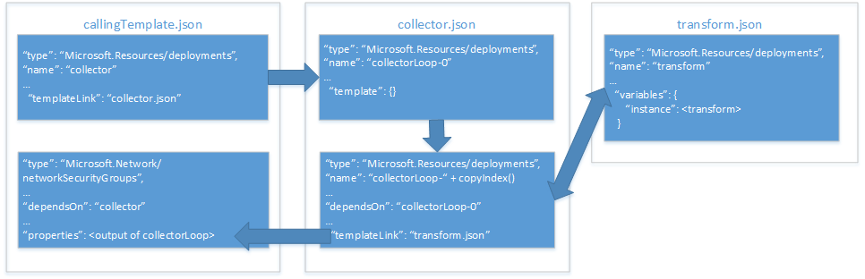

# <a name="implement-a-property-transformer-and-collector-in-an-azure-resource-manager-template"></a><span data-ttu-id="65a8c-103">在 Azure 资源管理器模板中实现属性转换器和收集器</span><span class="sxs-lookup"><span data-stu-id="65a8c-103">Implement a property transformer and collector in an Azure Resource Manager template</span></span>

<span data-ttu-id="65a8c-104">在[将对象用作 Azure 资源管理器模板中的参数][objects-as-parameters]中，了解如何在对象中存储资源属性值并在部署时将其应用到资源。</span><span class="sxs-lookup"><span data-stu-id="65a8c-104">In [use an object as a parameter in an Azure Resource Manager template][objects-as-parameters], you learned how to store resource property values in an object and apply them to a resource during deployment.</span></span> <span data-ttu-id="65a8c-105">虽然这样管理参数非常有用，但它仍然要求每次在模板中使用时，将对象的属性映射到资源属性。</span><span class="sxs-lookup"><span data-stu-id="65a8c-105">While this is a very useful way to manage your parameters, it still requires you to map the object's properties to resource properties each time you use it in your template.</span></span>

<span data-ttu-id="65a8c-106">为了解决此问题，可实现属性转换和收集器模板，循环访问对象数组并将其转换为资源所需的 JSON 架构。</span><span class="sxs-lookup"><span data-stu-id="65a8c-106">To work around this, you can implement a property transform and collector template that iterates your object array and transforms it into the JSON schema expected by the resource.</span></span>

> [!IMPORTANT]
> <span data-ttu-id="65a8c-107">此方法要求对资源管理器模板和功能有深入的了解。</span><span class="sxs-lookup"><span data-stu-id="65a8c-107">This approach requires that you have a deep understanding of Resource Manager templates and functions.</span></span>

<span data-ttu-id="65a8c-108">让我们通过一个部署[网络安全组 (NSG)][nsg]的示例来看看如何实现属性收集器和转换器。</span><span class="sxs-lookup"><span data-stu-id="65a8c-108">Let's take a look at how we can implement a property collector and transformer with an example that deploys a [network security group (NSG)][nsg].</span></span> <span data-ttu-id="65a8c-109">下图显示了模板和模板中的资源之间的关系：</span><span class="sxs-lookup"><span data-stu-id="65a8c-109">The diagram below shows the relationship between our templates and our resources within those templates:</span></span>



<span data-ttu-id="65a8c-111">调用模板包含两个资源：</span><span class="sxs-lookup"><span data-stu-id="65a8c-111">Our **calling template** includes two resources:</span></span>
* <span data-ttu-id="65a8c-112">调用收集器模板的模板链接。</span><span class="sxs-lookup"><span data-stu-id="65a8c-112">a template link that invokes our **collector template**.</span></span>
* <span data-ttu-id="65a8c-113">要部署的 NSG 资源。</span><span class="sxs-lookup"><span data-stu-id="65a8c-113">the NSG resource to deploy.</span></span>

<span data-ttu-id="65a8c-114">收集器模板包含两个资源：</span><span class="sxs-lookup"><span data-stu-id="65a8c-114">Our **collector template** includes two resources:</span></span>
* <span data-ttu-id="65a8c-115">定位点资源。</span><span class="sxs-lookup"><span data-stu-id="65a8c-115">an **anchor** resource.</span></span>
* <span data-ttu-id="65a8c-116">在复制循环中调用转换模板的模板链接。</span><span class="sxs-lookup"><span data-stu-id="65a8c-116">a template link that invokes the transform template in a copy loop.</span></span>

<span data-ttu-id="65a8c-117">转换模板包含一个资源：带有变量的空模板，该模板能将 `source` JSON 转换为主模板中 NSG 资源所需要的 JSON 架构。</span><span class="sxs-lookup"><span data-stu-id="65a8c-117">Our **transform template** includes a single resource: an empty template with a variable that transforms our `source` JSON to the JSON schema expected by our NSG resource in the **main template**.</span></span>

## <a name="parameter-object"></a><span data-ttu-id="65a8c-118">参数对象</span><span class="sxs-lookup"><span data-stu-id="65a8c-118">Parameter object</span></span>

<span data-ttu-id="65a8c-119">我们使用[对象即参数][objects-as-parameters]中的 `securityRules` 参数对象。</span><span class="sxs-lookup"><span data-stu-id="65a8c-119">We'll be using our `securityRules` parameter object from [objects as parameters][objects-as-parameters].</span></span> <span data-ttu-id="65a8c-120">转换模板会将 `securityRules` 数组中的每个对象转换为调用模板中 NSG 资源所需要的 JSON 架构。</span><span class="sxs-lookup"><span data-stu-id="65a8c-120">Our **transform template** will transform each object in the `securityRules` array into the JSON schema expected by the NSG resource in our **calling template**.</span></span>

```json
{
    "$schema": "https://schema.management.azure.com/schemas/2015-01-01/deploymentParameters.json#",
    "contentVersion": "1.0.0.0",
    "parameters":{ 
      "networkSecurityGroupsSettings": {
      "value": {
          "securityRules": [
            {
              "name": "RDPAllow",
              "description": "allow RDP connections",
              "direction": "Inbound",
              "priority": 100,
              "sourceAddressPrefix": "*",
              "destinationAddressPrefix": "10.0.0.0/24",
              "sourcePortRange": "*",
              "destinationPortRange": "3389",
              "access": "Allow",
              "protocol": "Tcp"
            },
            {
              "name": "HTTPAllow",
              "description": "allow HTTP connections",
              "direction": "Inbound",
              "priority": 200,
              "sourceAddressPrefix": "*",
              "destinationAddressPrefix": "10.0.1.0/24",
              "sourcePortRange": "*",
              "destinationPortRange": "80",
              "access": "Allow",
              "protocol": "Tcp"
            }
          ]
        }
      }
    }
  }
```

<span data-ttu-id="65a8c-121">我们首先看一下转换模板。</span><span class="sxs-lookup"><span data-stu-id="65a8c-121">Let's look at our **transform template** first.</span></span>

## <a name="transform-template"></a><span data-ttu-id="65a8c-122">转换模板</span><span class="sxs-lookup"><span data-stu-id="65a8c-122">Transform template</span></span>

<span data-ttu-id="65a8c-123">转换模板包含从收集器模板传递的两个参数：</span><span class="sxs-lookup"><span data-stu-id="65a8c-123">Our **transform template** includes two parameters that are passed from the **collector template**:</span></span> 
* <span data-ttu-id="65a8c-124">`source` 是接收属性数组的属性值对象的对象。</span><span class="sxs-lookup"><span data-stu-id="65a8c-124">`source` is an object that receives one of the property value objects from the property array.</span></span> <span data-ttu-id="65a8c-125">在本示例中，`"securityRules"` 数组的每个对象会以一次一个的方式传入。</span><span class="sxs-lookup"><span data-stu-id="65a8c-125">In our example, each object from the `"securityRules"` array will be passed in one at a time.</span></span>
* <span data-ttu-id="65a8c-126">`state` 是接收所有以前转换的连接结果的数组。</span><span class="sxs-lookup"><span data-stu-id="65a8c-126">`state` is an array that receives the concatenated results of all the previous transforms.</span></span> <span data-ttu-id="65a8c-127">这是转换后的 JSON 的集合。</span><span class="sxs-lookup"><span data-stu-id="65a8c-127">This is the collection of transformed JSON.</span></span>

<span data-ttu-id="65a8c-128">参数如下所示：</span><span class="sxs-lookup"><span data-stu-id="65a8c-128">Our parameters look like this:</span></span>

```json
{
  "$schema": "http://schema.management.azure.com/schemas/2015-01-01/deploymentTemplate.json#",
  "contentVersion": "1.0.0.0",
  "parameters": {
    "source": { "type": "object" },
    "state": {
      "type": "array",
      "defaultValue": [ ]
    }
  },
```

<span data-ttu-id="65a8c-129">模板还会定义一个名为 `instance` 的变量。</span><span class="sxs-lookup"><span data-stu-id="65a8c-129">Our template also defines a variable named `instance`.</span></span> <span data-ttu-id="65a8c-130">它执行 `source` 对象到所需的 JSON 架构的实际转换：</span><span class="sxs-lookup"><span data-stu-id="65a8c-130">It performs the actual tranform of our `source` object into the required JSON schema:</span></span>

```json
  "variables": {
    "instance": [
      {
        "name": "[parameters('source').name]",
        "properties":{
            "description": "[parameters('source').description]",
            "protocol": "[parameters('source').protocol]",
            "sourcePortRange": "[parameters('source').sourcePortRange]",
            "destinationPortRange": "[parameters('source').destinationPortRange]",
            "sourceAddressPrefix": "[parameters('source').sourceAddressPrefix]",
            "destinationAddressPrefix": "[parameters('source').destinationAddressPrefix]",
            "access": "[parameters('source').access]",
            "priority": "[parameters('source').priority]",
            "direction": "[parameters('source').direction]"            
        }
      }
    ]

  },
```

<span data-ttu-id="65a8c-131">最后，模板的 `output` 将收集的 `state` 参数的转换与当前由 `instance` 变量执行的转换相连接：</span><span class="sxs-lookup"><span data-stu-id="65a8c-131">Finally, the `output` of our template concatenates the collected transforms of our `state` parameter with the current transform performed by our `instance` variable:</span></span>

```json
  "outputs": {
    "collection": {
      "type": "array",
      "value": "[concat(parameters('state'), variables('instance'))]"
    }
```

<span data-ttu-id="65a8c-132">接下来，我们介绍收集器模板，了解它如何传入参数值。</span><span class="sxs-lookup"><span data-stu-id="65a8c-132">Next, let's take a look at our **collector template** to see how it passes in our parameter values.</span></span>

## <a name="collector-template"></a><span data-ttu-id="65a8c-133">收集器模板</span><span class="sxs-lookup"><span data-stu-id="65a8c-133">Collector template</span></span>

<span data-ttu-id="65a8c-134">收集器模板包含三个参数：</span><span class="sxs-lookup"><span data-stu-id="65a8c-134">Our **collector template** includes three parameters:</span></span>
* <span data-ttu-id="65a8c-135">`source` 是完整的参数对象数组。</span><span class="sxs-lookup"><span data-stu-id="65a8c-135">`source` is our complete parameter object array.</span></span> <span data-ttu-id="65a8c-136">它通过调用模板传入。</span><span class="sxs-lookup"><span data-stu-id="65a8c-136">It's passed in by the **calling template**.</span></span> <span data-ttu-id="65a8c-137">它的名称与转换模板中的 `source` 参数相同，但你可能已经注意到了有一个重要差异：它是完整的数组，但我们一次只能将该数组中的一个元素传递给转换模板。</span><span class="sxs-lookup"><span data-stu-id="65a8c-137">This has the same name as the `source` parameter in our **transform template** but there is one key difference that you may have already noticed: this is the complete array, but we only pass one element of this array to the **transform template** at a time.</span></span>
* <span data-ttu-id="65a8c-138">`transformTemplateUri` 是转换模板的 URI。</span><span class="sxs-lookup"><span data-stu-id="65a8c-138">`transformTemplateUri` is the URI of our **transform template**.</span></span> <span data-ttu-id="65a8c-139">为了让模板可以重复使用，我们在此将其定义为参数。</span><span class="sxs-lookup"><span data-stu-id="65a8c-139">We're defining it as a parameter here for template reusability.</span></span>
* <span data-ttu-id="65a8c-140">`state` 刚开始是空数组，我们将其传递给转换模板。</span><span class="sxs-lookup"><span data-stu-id="65a8c-140">`state` is an initially empty array that we pass to our **transform template**.</span></span> <span data-ttu-id="65a8c-141">当复制循环完成时，它存储转换后的参数对象的集合。</span><span class="sxs-lookup"><span data-stu-id="65a8c-141">It stores the collection of transformed parameter objects when the copy loop is complete.</span></span>

<span data-ttu-id="65a8c-142">参数如下所示：</span><span class="sxs-lookup"><span data-stu-id="65a8c-142">Our parameters look like this:</span></span>

```json
  "parameters": {
    "source": { "type": "array" },
    "transformTemplateUri": { "type": "string" },
    "state": {
      "type": "array",
      "defaultValue": [ ]
    }
``` 

<span data-ttu-id="65a8c-143">接下来，我们定义一个名为 `count` 的变量。</span><span class="sxs-lookup"><span data-stu-id="65a8c-143">Next, we define a variable named `count`.</span></span> <span data-ttu-id="65a8c-144">其值为 `source` 参数对象数组的长度：</span><span class="sxs-lookup"><span data-stu-id="65a8c-144">Its value is the length of the `source` parameter object array:</span></span>

```json
  "variables": {
    "count": "[length(parameters('source'))]"
  },
```

<span data-ttu-id="65a8c-145">正如你所料，我们在复制循环中将其用于迭代数。</span><span class="sxs-lookup"><span data-stu-id="65a8c-145">As you might suspect, we use it for the number of iterations in our copy loop.</span></span>

<span data-ttu-id="65a8c-146">现在我们来看看资源。</span><span class="sxs-lookup"><span data-stu-id="65a8c-146">Now let's take a look at our resources.</span></span> <span data-ttu-id="65a8c-147">我们定义两种资源：</span><span class="sxs-lookup"><span data-stu-id="65a8c-147">We define two resources:</span></span>
* <span data-ttu-id="65a8c-148">`loop-0` 是复制循环的基于零的资源。</span><span class="sxs-lookup"><span data-stu-id="65a8c-148">`loop-0` is the zero-based resource for our copy loop.</span></span>
* <span data-ttu-id="65a8c-149">`loop-` 与 `copyIndex(1)` 函数结果连接，以生成基于迭代且以 `1` 开头的唯一资源名称。</span><span class="sxs-lookup"><span data-stu-id="65a8c-149">`loop-` is concatenated with the result of the `copyIndex(1)` function to generate a unique iteration-based name for our resource, starting with `1`.</span></span>

<span data-ttu-id="65a8c-150">资源如下所示：</span><span class="sxs-lookup"><span data-stu-id="65a8c-150">Our resources look like this:</span></span>

```json
  "resources": [
    {
      "type": "Microsoft.Resources/deployments",
      "apiVersion": "2015-01-01",
      "name": "loop-0",
      "properties": {
        "mode": "Incremental",
        "parameters": { },
        "template": {
          "$schema": "http://schema.management.azure.com/schemas/2015-01-01/deploymentTemplate.json#",
          "contentVersion": "1.0.0.0",
          "parameters": { },
          "variables": { },
          "resources": [ ],
          "outputs": {
            "collection": {
              "type": "array",
              "value": "[parameters('state')]"
            }
          }
        }
      }
    },
    {
      "type": "Microsoft.Resources/deployments",
      "apiVersion": "2015-01-01",
      "name": "[concat('loop-', copyindex(1))]",
      "copy": {
        "name": "iterator",
        "count": "[variables('count')]",
        "mode": "serial"
      },
      "dependsOn": [
        "loop-0"
      ],
      "properties": {
        "mode": "Incremental",
        "templateLink": { "uri": "[parameters('transformTemplateUri')]" },
        "parameters": {
          "source": { "value": "[parameters('source')[copyindex()]]" },
          "state": { "value": "[reference(concat('loop-', copyindex())).outputs.collection.value]" }
        }
      }
    }
  ],
```

<span data-ttu-id="65a8c-151">我们仔细看一下在嵌套模板中传递给转换模板的参数。</span><span class="sxs-lookup"><span data-stu-id="65a8c-151">Let's take a closer look at the parameters we're passing to our **transform template** in the nested template.</span></span> <span data-ttu-id="65a8c-152">回想一下，`source` 参数传递 `source` 参数对象数组中的当前对象。</span><span class="sxs-lookup"><span data-stu-id="65a8c-152">Recall from earlier that our `source` parameter passes the current object in the `source` parameter object array.</span></span> <span data-ttu-id="65a8c-153">`state` 参数发生收集所在的位置，因为它接收复制循环的前一次迭代的输出（请注意，`reference()` 函数使用无参数的 `copyIndex()` 函数来引用以前链接的模板对象的 `name`）并将其传递给当前迭代。</span><span class="sxs-lookup"><span data-stu-id="65a8c-153">The `state` parameter is where the collection happens, because it takes the output of the previous iteration of our copy loop&mdash;notice that the `reference()` function uses the `copyIndex()` function with no parameter to reference the `name` of our previous linked template object&mdash;and passes it to the current iteration.</span></span>

<span data-ttu-id="65a8c-154">最后，模板的 `output` 返回转换模板的最后一次迭代的 `output`：</span><span class="sxs-lookup"><span data-stu-id="65a8c-154">Finally, the `output` of our template returns the `output` of the last iteration of our **transform template**:</span></span>

```json
  "outputs": {
    "result": {
      "type": "array",
      "value": "[reference(concat('loop-', variables('count'))).outputs.collection.value]"
    }
  }
```
<span data-ttu-id="65a8c-155">将转换模板的最后一次迭代的 `output` 返回到调用模板似乎有悖常理，因为我们好像是将其存储在 `source` 参数中的。</span><span class="sxs-lookup"><span data-stu-id="65a8c-155">It may seem counterintuitive to return the `output` of the last iteration of our **transform template** to our **calling template** because it appeared we were storing it in our `source` parameter.</span></span> <span data-ttu-id="65a8c-156">但请记住，这是转换模板的最后一次迭代，将保存转换后的属性对象的完整数组，并且这就是我们想要返回的内容。</span><span class="sxs-lookup"><span data-stu-id="65a8c-156">However, remember that it's the last iteration of our **transform template** that holds the complete array of transformed property objects, and that's what we want to return.</span></span>

<span data-ttu-id="65a8c-157">最后，我们看看如何从调用模板中调用收集器模板。</span><span class="sxs-lookup"><span data-stu-id="65a8c-157">Finally, let's take a look at how to call the **collector template** from our **calling template**.</span></span>

## <a name="calling-template"></a><span data-ttu-id="65a8c-158">调用模板</span><span class="sxs-lookup"><span data-stu-id="65a8c-158">Calling template</span></span>

<span data-ttu-id="65a8c-159">调用模板定义一个名为 `networkSecurityGroupsSettings` 的单个参数：</span><span class="sxs-lookup"><span data-stu-id="65a8c-159">Our **calling template** defines a single parameter named `networkSecurityGroupsSettings`:</span></span>

```json
...
"parameters": {
    "networkSecurityGroupsSettings": {
        "type": "object"
    }
```

<span data-ttu-id="65a8c-160">接下来，模板定义一个名为 `collectorTemplateUri` 的单个变量：</span><span class="sxs-lookup"><span data-stu-id="65a8c-160">Next, our template defines a single variable named `collectorTemplateUri`:</span></span>

```json
"variables": {
    "collectorTemplateUri": "[uri(deployment().properties.templateLink.uri, 'collector.template.json')]"
  }
```

<span data-ttu-id="65a8c-161">如你所料，这是收集器模板的 URI，将由链接模板资源使用：</span><span class="sxs-lookup"><span data-stu-id="65a8c-161">As you would expect, this is the URI for the **collector template** that will be used by our linked template resource:</span></span>

```json
{
    "apiVersion": "2015-01-01",
    "name": "collector",
    "type": "Microsoft.Resources/deployments",
    "properties": {
        "mode": "Incremental",
        "templateLink": {
            "uri": "[variables('linkedTemplateUri')]",
            "contentVersion": "1.0.0.0"
        },
        "parameters": {
            "source" : {"value": "[parameters('networkSecurityGroupsSettings').securityRules]"},
            "transformTemplateUri": { "value": "[uri(deployment().properties.templateLink.uri, 'transform.json')]"}
        }
    }
}
```

<span data-ttu-id="65a8c-162">我们向收集器模板传递两个参数：</span><span class="sxs-lookup"><span data-stu-id="65a8c-162">We pass two parameters to the **collector template**:</span></span>
* <span data-ttu-id="65a8c-163">`source` 是属性对象数组。</span><span class="sxs-lookup"><span data-stu-id="65a8c-163">`source` is our property object array.</span></span> <span data-ttu-id="65a8c-164">在本示例中是 `networkSecurityGroupsSettings` 参数。</span><span class="sxs-lookup"><span data-stu-id="65a8c-164">In our example, it's our `networkSecurityGroupsSettings` parameter.</span></span>
* <span data-ttu-id="65a8c-165">`transformTemplateUri` 是刚才通过收集器模板的 URI 定义的变量。</span><span class="sxs-lookup"><span data-stu-id="65a8c-165">`transformTemplateUri` is the variable we just defined with the URI of our **collector template**.</span></span>

<span data-ttu-id="65a8c-166">最后，`Microsoft.Network/networkSecurityGroups` 资源直接将 `collector` 链接模板资源的 `output` 分配给 `securityRules` 属性：</span><span class="sxs-lookup"><span data-stu-id="65a8c-166">Finally, our `Microsoft.Network/networkSecurityGroups` resource directly assigns the `output` of the `collector` linked template resource to its `securityRules` property:</span></span>

```json
    {
      "apiVersion": "2015-06-15",
      "type": "Microsoft.Network/networkSecurityGroups",
      "name": "networkSecurityGroup1",
      "location": "[resourceGroup().location]",
      "properties": {
        "securityRules": "[reference('firstResource').outputs.result.value]"
      }
    }
  ],
  "outputs": {
      "instance":{
          "type": "array",
          "value": "[reference('firstResource').outputs.result.value]"
      }

  }
```

## <a name="next-steps"></a><span data-ttu-id="65a8c-167">后续步骤</span><span class="sxs-lookup"><span data-stu-id="65a8c-167">Next steps</span></span>

* <span data-ttu-id="65a8c-168">此技术可在[模板构建块项目](https://github.com/mspnp/template-building-blocks)和 [Azure 参考体系结构](/azure/architecture/reference-architectures/)中实现。</span><span class="sxs-lookup"><span data-stu-id="65a8c-168">This technique is implemented in the [template building blocks project](https://github.com/mspnp/template-building-blocks) and the [Azure reference architectures](/azure/architecture/reference-architectures/).</span></span> <span data-ttu-id="65a8c-169">可以使用这些来创建自己的体系结构或部署一个参考体系结构。</span><span class="sxs-lookup"><span data-stu-id="65a8c-169">You can use these to create your own architecture or deploy one of our reference architectures.</span></span>

<!-- links -->
[objects-as-parameters]: ./objects-as-parameters.md
[resource-manager-linked-template]: /azure/azure-resource-manager/resource-group-linked-templates
[resource-manager-variables]: /azure/azure-resource-manager/resource-group-template-functions-deployment
[nsg]: /azure/virtual-network/virtual-networks-nsg
