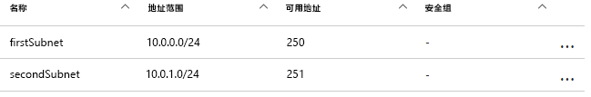
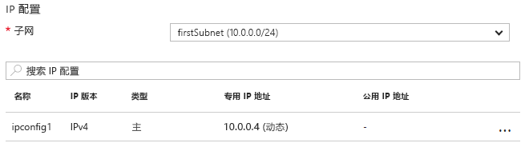

# <a name="update-a-resource-in-an-azure-resource-manager-template"></a><span data-ttu-id="ad938-103">在 Azure 资源管理器模板上更新资源</span><span class="sxs-lookup"><span data-stu-id="ad938-103">Update a resource in an Azure Resource Manager template</span></span>

<span data-ttu-id="ad938-104">在某些情况下，在部署过程中需要更新资源。</span><span class="sxs-lookup"><span data-stu-id="ad938-104">There are some scenarios in which you need to update a resource during a deployment.</span></span> <span data-ttu-id="ad938-105">如果在创建其他依赖资源之前无法指定该资源的所有属性，则可能遇到此情况。</span><span class="sxs-lookup"><span data-stu-id="ad938-105">You might encounter this scenario when you cannot specify all the properties for a resource until other, dependent resources are created.</span></span> <span data-ttu-id="ad938-106">例如，如果为负载均衡器创建后端池，则可以更新虚拟机 (VM) 上的网络接口 (NIC) 来将其包括在后端池中。</span><span class="sxs-lookup"><span data-stu-id="ad938-106">For example, if you create a backend pool for a load balancer, you might update the network interfaces (NICs) on your virtual machines (VMs) to include them in the backend pool.</span></span> <span data-ttu-id="ad938-107">虽然资源管理器支持在部署期间更新资源，但必须正确设计模板以避免错误并确保将部署作为更新进行处理。</span><span class="sxs-lookup"><span data-stu-id="ad938-107">And while Resource Manager supports updating resources during deployment, you must design your template correctly to avoid errors and to ensure the deployment is handled as an update.</span></span>

<span data-ttu-id="ad938-108">首先，必须在模板中将资源引用一次来创建资源，然后用同一名称引用资源来对其进行更新。</span><span class="sxs-lookup"><span data-stu-id="ad938-108">First, you must reference the resource once in the template to create it and then reference the resource by the same name to update it later.</span></span> <span data-ttu-id="ad938-109">不过，如果两个资源在模板中具有相同的名称，则 Resource Manager 将引发异常。</span><span class="sxs-lookup"><span data-stu-id="ad938-109">However, if two resources have the same name in a template, Resource Manager throws an exception.</span></span> <span data-ttu-id="ad938-110">若要避免此错误，请在所链接或包括为子模板的另一个模板中使用 `Microsoft.Resources/deployments` 资源类型指定更新的资源。</span><span class="sxs-lookup"><span data-stu-id="ad938-110">To avoid this error, specify the updated resource in a second template that's either linked or included as a subtemplate using the `Microsoft.Resources/deployments` resource type.</span></span>

<span data-ttu-id="ad938-111">其次，必须指定要更改的现有属性的名称或者要在嵌套模板中添加的属性的新名称。</span><span class="sxs-lookup"><span data-stu-id="ad938-111">Second, you must either specify the name of the existing property to change or a new name for a property to add in the nested template.</span></span> <span data-ttu-id="ad938-112">还必须指定原始属性及其原始值。</span><span class="sxs-lookup"><span data-stu-id="ad938-112">You must also specify the original properties and their original values.</span></span> <span data-ttu-id="ad938-113">如果提供原始属性和值失败，则资源管理器会假定想要创建新资源并将删除原始资源。</span><span class="sxs-lookup"><span data-stu-id="ad938-113">If you fail to provide the original properties and values, Resource Manager assumes you want to create a new resource and deletes the original resource.</span></span>

## <a name="example-template"></a><span data-ttu-id="ad938-114">示例模板</span><span class="sxs-lookup"><span data-stu-id="ad938-114">Example template</span></span>

<span data-ttu-id="ad938-115">让我们看一下演示此操作的示例模板。</span><span class="sxs-lookup"><span data-stu-id="ad938-115">Let's look at an example template that demonstrates this.</span></span> <span data-ttu-id="ad938-116">我们的模板部署一个名为 `firstVNet` 的虚拟网络，其中包含一个名为 `firstSubnet` 的子网。</span><span class="sxs-lookup"><span data-stu-id="ad938-116">Our template deploys a virtual network  named `firstVNet` that has one subnet named `firstSubnet`.</span></span> <span data-ttu-id="ad938-117">然后，它将部署一个名为 `nic1` 的虚拟网络接口 (NIC)，并将其与我们的子网相关联。</span><span class="sxs-lookup"><span data-stu-id="ad938-117">It then deploys a virtual network interface (NIC) named `nic1` and associates it with our subnet.</span></span> <span data-ttu-id="ad938-118">然后，一个名为 `updateVNet` 的部署资源包括通过添加名为 `secondSubnet` 的辅助子网来更新 `firstVNet` 资源的嵌套模板。</span><span class="sxs-lookup"><span data-stu-id="ad938-118">Then, a deployment resource named `updateVNet` includes a nested template that updates our `firstVNet` resource by adding a second subnet named `secondSubnet`.</span></span> 

```json
{
  "$schema": "https://schema.management.azure.com/schemas/2015-01-01/deploymentTemplate.json#",
  "contentVersion": "1.0.0.0",
  "parameters": {},
  "resources": [
      {
      "apiVersion": "2016-03-30",
      "name": "firstVNet",
      "location":"[resourceGroup().location]",
      "type": "Microsoft.Network/virtualNetworks",
      "properties": {
          "addressSpace":{"addressPrefixes": [
              "10.0.0.0/22"
          ]},
          "subnets":[              
              {
                  "name":"firstSubnet",
                  "properties":{
                    "addressPrefix":"10.0.0.0/24"
                  }
              }
            ]
      }
    },
    {
        "apiVersion": "2015-06-15",
        "type":"Microsoft.Network/networkInterfaces",
        "name":"nic1",
        "location":"[resourceGroup().location]",
        "dependsOn": [
            "firstVNet"
        ],
        "properties": {
            "ipConfigurations":[
                {
                    "name":"ipconfig1",
                    "properties": {
                        "privateIPAllocationMethod":"Dynamic",
                        "subnet": {
                            "id": "[concat(resourceId('Microsoft.Network/virtualNetworks','firstVNet'),'/subnets/firstSubnet')]"
                        }
                    }
                }
            ]
        }
    },
    {
      "apiVersion": "2015-01-01",
      "type": "Microsoft.Resources/deployments",
      "name": "updateVNet",
      "dependsOn": [
          "nic1"
      ],
      "properties": {
        "mode": "Incremental",
        "parameters": {},
        "template": {
          "$schema": "http://schema.management.azure.com/schemas/2015-01-01/deploymentTemplate.json#",
          "contentVersion": "1.0.0.0",
          "parameters": {},
          "variables": {},
          "resources": [
              {
                  "apiVersion": "2016-03-30",
                  "name": "firstVNet",
                  "location":"[resourceGroup().location]",
                  "type": "Microsoft.Network/virtualNetworks",
                  "properties": {
                      "addressSpace": "[reference('firstVNet').addressSpace]",
                      "subnets":[
                          {
                              "name":"[reference('firstVNet').subnets[0].name]",
                              "properties":{
                                  "addressPrefix":"[reference('firstVNet').subnets[0].properties.addressPrefix]"
                                  }
                          },
                          {
                              "name":"secondSubnet",
                              "properties":{
                                  "addressPrefix":"10.0.1.0/24"
                                  }
                          }
                     ]
                  }
              }
          ],
          "outputs": {}
          }
        }
    }
  ],
  "outputs": {}
}
```

<span data-ttu-id="ad938-119">让我们首先看看 `firstVNet` 资源的资源对象。</span><span class="sxs-lookup"><span data-stu-id="ad938-119">Let's take a look at the resource object for our `firstVNet` resource first.</span></span> <span data-ttu-id="ad938-120">请注意，我们将重新指定嵌套模板中的 `firstVNet` 的设置&mdash;这是因为资源管理器不允许同一个模板中有相同的部署名称，而嵌套模板被视为不同的模板。</span><span class="sxs-lookup"><span data-stu-id="ad938-120">Notice that we respecify the settings for our `firstVNet` in a nested template&mdash;this is because Resource Manager doesn't allow the same deployment name within the same template and nested templates are considered to be a different template.</span></span> <span data-ttu-id="ad938-121">通过重新指定 `firstSubnet` 资源的值，我们将指示资源管理器更新现有的资源，而不是将其删除并重新部署。</span><span class="sxs-lookup"><span data-stu-id="ad938-121">By respecifying our values for our `firstSubnet` resource, we are telling Resource Manager to update the existing resource instead of deleting it and redeploying it.</span></span> <span data-ttu-id="ad938-122">最后，在此更新期间采用 `secondSubnet` 的新设置。</span><span class="sxs-lookup"><span data-stu-id="ad938-122">Finally, our new settings for `secondSubnet` are picked up during this update.</span></span>

## <a name="try-the-template"></a><span data-ttu-id="ad938-123">尝试模板</span><span class="sxs-lookup"><span data-stu-id="ad938-123">Try the template</span></span>

<span data-ttu-id="ad938-124">如果要试验此模板，请按照下列步骤进行操作：</span><span class="sxs-lookup"><span data-stu-id="ad938-124">If you would like to experiment with this template, follow these steps:</span></span>

1.  <span data-ttu-id="ad938-125">转到 Azure 门户，选择“+”图标，搜索“模板部署”</span><span class="sxs-lookup"><span data-stu-id="ad938-125">Go to the Azure portal, select the **+** icon, and search for the **template deployment** resource type, and select it.</span></span>
2.  <span data-ttu-id="ad938-126">导航到“模板部署”页，选择“创建”按钮。</span><span class="sxs-lookup"><span data-stu-id="ad938-126">Navigate to the **template deployment** page, select the **create** button.</span></span> <span data-ttu-id="ad938-127">此按钮会打开“自定义部署”边栏选项卡。</span><span class="sxs-lookup"><span data-stu-id="ad938-127">This button opens the **custom deployment** blade.</span></span>
3.  <span data-ttu-id="ad938-128">选择“编辑”图标。</span><span class="sxs-lookup"><span data-stu-id="ad938-128">Select the **edit** icon.</span></span>
4.  <span data-ttu-id="ad938-129">选择空模板。</span><span class="sxs-lookup"><span data-stu-id="ad938-129">Delete the empty template.</span></span>
5.  <span data-ttu-id="ad938-130">将示例模板复制粘贴到右侧窗格中。</span><span class="sxs-lookup"><span data-stu-id="ad938-130">Copy and paste the sample template into the right pane.</span></span>
6.  <span data-ttu-id="ad938-131">选择“保存”按钮。</span><span class="sxs-lookup"><span data-stu-id="ad938-131">Select the **save** button.</span></span>
7.  <span data-ttu-id="ad938-132">返回到“自定义部署”窗格，但是这一次包含一些下拉列表框。</span><span class="sxs-lookup"><span data-stu-id="ad938-132">You return to the **custom deployment** pane, but this time there are some drop-down list boxes.</span></span> <span data-ttu-id="ad938-133">选择订阅，或者创建新订阅或使用现有资源组，然后选择位置。</span><span class="sxs-lookup"><span data-stu-id="ad938-133">Select your subscription, either create new or use existing resource group, and select a location.</span></span> <span data-ttu-id="ad938-134">查看条款和条件，并选择“我同意”按钮。</span><span class="sxs-lookup"><span data-stu-id="ad938-134">Review the terms and conditions, then select the **I agree** button.</span></span>
8.  <span data-ttu-id="ad938-135">选择“购买”按钮。</span><span class="sxs-lookup"><span data-stu-id="ad938-135">Select the **purchase** button.</span></span>

<span data-ttu-id="ad938-136">在部署完成后，打开在门户中指定的资源组。</span><span class="sxs-lookup"><span data-stu-id="ad938-136">Once deployment has finished, open the resource group you specified in the portal.</span></span> <span data-ttu-id="ad938-137">将看到名为 `firstVNet` 的虚拟网络和名为 `nic1` 的 NIC。</span><span class="sxs-lookup"><span data-stu-id="ad938-137">You see a virtual network named `firstVNet` and a NIC named `nic1`.</span></span> <span data-ttu-id="ad938-138">单击 `firstVNet`，并单击 `subnets`。</span><span class="sxs-lookup"><span data-stu-id="ad938-138">Click `firstVNet`, then click `subnets`.</span></span> <span data-ttu-id="ad938-139">会看到原来创建的 `firstSubnet`，还会看到已在 `updateVNet` 资源中添加的 `secondSubnet`。</span><span class="sxs-lookup"><span data-stu-id="ad938-139">You see the `firstSubnet` that was originally created, and you see the `secondSubnet` that was added in the `updateVNet` resource.</span></span> 



<span data-ttu-id="ad938-141">然后，返回到资源组并单击 `nic1`，并单击 `IP configurations`。</span><span class="sxs-lookup"><span data-stu-id="ad938-141">Then, go back to the resource group and click `nic1` then click `IP configurations`.</span></span> <span data-ttu-id="ad938-142">在 `IP configurations` 部分中，`subnet` 设置为 `firstSubnet (10.0.0.0/24)`。</span><span class="sxs-lookup"><span data-stu-id="ad938-142">In the `IP configurations` section, the `subnet` is set to `firstSubnet (10.0.0.0/24)`.</span></span> 



<span data-ttu-id="ad938-144">原始 `firstVNet` 已更新而非重新创建。</span><span class="sxs-lookup"><span data-stu-id="ad938-144">The original `firstVNet` has been updated instead of recreated.</span></span> <span data-ttu-id="ad938-145">如果 `firstVNet` 是重新创建的，则 `nic1` 不会与 `firstVNet` 相关联。</span><span class="sxs-lookup"><span data-stu-id="ad938-145">If `firstVNet` had been recreated, `nic1` would not be associated with `firstVNet`.</span></span>

## <a name="next-steps"></a><span data-ttu-id="ad938-146">后续步骤</span><span class="sxs-lookup"><span data-stu-id="ad938-146">Next steps</span></span>

* <span data-ttu-id="ad938-147">此技术可在[模板构建块项目](https://github.com/mspnp/template-building-blocks)和 [Azure 参考体系结构](/azure/architecture/reference-architectures/)中实现。</span><span class="sxs-lookup"><span data-stu-id="ad938-147">This technique is implemented in the [template building blocks project](https://github.com/mspnp/template-building-blocks) and the [Azure reference architectures](/azure/architecture/reference-architectures/).</span></span> <span data-ttu-id="ad938-148">可以使用这些来创建自己的体系结构或部署一个参考体系结构。</span><span class="sxs-lookup"><span data-stu-id="ad938-148">You can use these to create your own architecture or deploy one of our reference architectures.</span></span>
