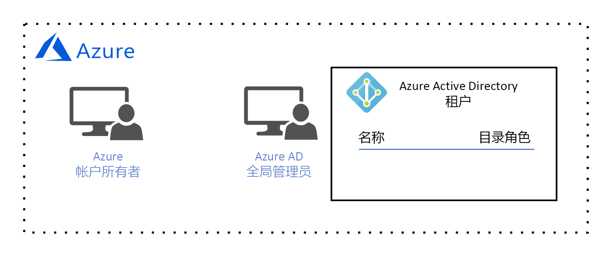

# Azure 调控设计指南

本设计指南的受众是组织中的中心 IT 角色。 中心 IT 负责设计和实施组织的云调控体系结构。 根据[什么是云资源调控？](governance-explainer.md)说明文章中所述，调控是指根据组织的目标和要求，对 Azure 资源的使用持续进行管理、监视和审核的过程。

本指南旨在描述一组假设性的调控目标和要求，并帮助你了解设计组织调控体系结构的过程。 然后，本指南介绍如何配置 Azure 调控工具以满足这些目标和要求。 

在基础采用阶段，我们的目标是将简单的工作负荷部署到 Azure。 这可以满足以下要求：
* 由负责部署和维护简单工作负荷的**工作负荷所有者**进行标识管理。 工作负荷所有者需要有权创建、读取、更新和删除资源，以及有权将这些权限委托给标识管理系统中的其他用户。
* 将简单工作负荷的所有资源作为单个管理单元进行管理。

## 许可 Azure

在开始设计调控模型之前，必须了解 Azure 的许可方式。 这是因为，与 Azure 许可证关联的管理帐户对所有 Azure 资源拥有最高级别的访问权限。 这些管理帐户构成了调控模型的基础。  

> [!NOTE]
> 如果组织的某个现有 [Microsoft 企业协议](https://www.microsoft.com/licensing/licensing-programs/enterprise.aspx)不包括 Azure，可以通过做出前期货币承诺来添加 Azure。 有关详细信息，请参阅[为企业获得 Azure 许可](https://azure.microsoft.com/pricing/enterprise-agreement/)。 

将 Azure 添加到组织的企业协议时，系统已提示组织创建 **Azure 帐户**。 在帐户创建过程中，已创建 **Azure 帐户所有者**，以及具有**全局管理员**帐户的 Azure Active Directory (Azure AD) 租户。 Azure AD 租户是一个逻辑构造，它代表 Azure AD 的安全专用实例。

*图 1.充当 Azure 帐户管理者和 Azure AD 全局管理员的 Azure 帐户。*

## 身份管理

Azure 只信任 [Azure AD](/azure/active-directory) 进行用户身份验证以及授权用户访问资源，因此，Azure AD 是我们的标识管理系统。 Azure AD 全局管理员拥有最高级别的权限，可以执行标识相关的所有操作，包括创建用户和分配权限。 

我们的要求是由负责部署和维护简单工作负荷的**工作负荷所有者**进行标识管理。 工作负荷所有者需要有权创建、读取、更新和删除资源，以及有权将这些权限委托给标识管理系统中的其他用户。

Azure AD 全局管理员将为**工作负荷所有者**创建**工作负荷所有者**帐户：

*图 2.Azure AD 全局管理员创建工作负荷所有者用户帐户。*

在将此用户添加到**订阅**之前，我们无法分配资源访问权限，因此，我们将在后续两个部分执行该操作。 

## 资源管理范围

随着组织部署的资源不断增多，调控这些资源的复杂性也会不断提高。 Azure 实施逻辑容器层次结构，使组织能够以不同的粒度级（称为**范围**）管理管理组中的资源。 

资源管理范围的最高层级是**订阅**级别。 订阅由建立资金承诺，并负责支付所有订阅相关 Azure 资源费用的 Azure **帐户所有者**创建：

*图 3.Azure 帐户所有者创建订阅。*

创建订阅时，Azure **帐户所有者**会将 Azure AD 租户与订阅相关联，此 Azure AD 租户用于对用户进行身份验证和授权：

*图 4.Azure 帐户所有者将 Azure AD 租户与订阅相关联。*

你可能已注意到，目前没有任何用户与订阅相关联，这意味着，无人有权管理资源。 在现实中，**帐户所有者**是订阅的所有者，有权对订阅中的资源执行任何操作。 但是，从实际的术语讲，**帐户所有者**更像是组织中的财务人员，他们不负责创建、读取、更新和删除资源 - 这些任务由**工作负荷所有者**执行。 因此，我们需要将**工作负荷所有者**添加到订阅并分配权限。

由于**帐户所有者**目前是唯一有权将**工作负荷所有者**添加到订阅的用户，因此他们需要将**工作负荷所有者**添加到订阅：

*图 5.Azure 帐户所有者将工作负荷所有者添加到订阅。*

Azure **帐户所有者**通过分配[基于角色的访问控制 (RBAC)](/azure/role-based-access-control/) 角色将权限授予**工作负荷所有者**。 RBAC 角色指定**工作负荷所有者**对单个资源类型或一组资源类型拥有的一组权限。

请注意，在此示例中，为**帐户所有者**分配了[内置的**所有者**角色](/azure/role-based-access-control/built-in-roles#owner)： 

*图 6.为工作负荷所有者分配了内置的所有者角色。*

内置的**所有者**角色在订阅范围向**工作负荷所有者**授予所有权限。 

> [!IMPORTANT]
> Azure **帐户所有者**负责与订阅关联的财务承诺，但**工作负荷所有者**拥有相同的权限。 **帐户所有者**必须信任**工作负荷所有者**部署订阅预算范围内的资源。

管理范围的下一个级别是**资源组**级别。 资源组是资源的逻辑容器。 在资源组级别应用的操作将应用到组中的所有资源。 此外，必须注意，每个用户的权限继承自下一个更高级别，除非在该范围显式更改了这些权限。 

为了演示这种继承方式，让我们看一下当**工作负荷所有者**创建资源组时会发生什么情况：

*图 7.工作负荷所有者创建资源组，并在资源组范围继承内置的所有者角色。*

同样，内置的**所有者**角色在资源组范围向**工作负荷所有者**授予所有权限。 如前所述，此角色继承自订阅级别。 如果在此范围将不同的角色分配到此用户，则只会将此分配应用到此范围。

管理范围的最低级别是**资源**级别。 在资源级别应用的操作只应用到资源本身。 再次强调，资源级别的权限继承自资源组范围。 例如，让我们看一下当**工作负荷所有者**在资源组中部署[虚拟网络](/azure/virtual-network/virtual-networks-overview)时会发生什么情况：

*图 8.工作负荷所有者创建资源，并在资源范围继承内置的所有者角色。*

**工作负荷所有者**在资源范围继承所有者角色，这意味着，工作负荷所有者对该虚拟网络拥有所有权限。 

## 摘要

在本文中，我们已了解到：

* Azure 只信任使用 Azure AD 进行标识管理。
* 订阅具有最高的资源管理范围，每个订阅与一个 Azure AD 租户相关联。 只有关联的 Azure AD 租户中的用户有权访问订阅中的资源。
* 资源管理范围有三个级别：订阅、资源组和资源。 使用 RBAC 角色在每个范围分配权限。 RBAC 角色从更高的范围继承到较低的范围。

## 后续步骤

返回[基础采用阶段概述](overview.md)，了解如何实施此调控模型。 然后，选择某种类型的工作负荷并了解如何部署它。