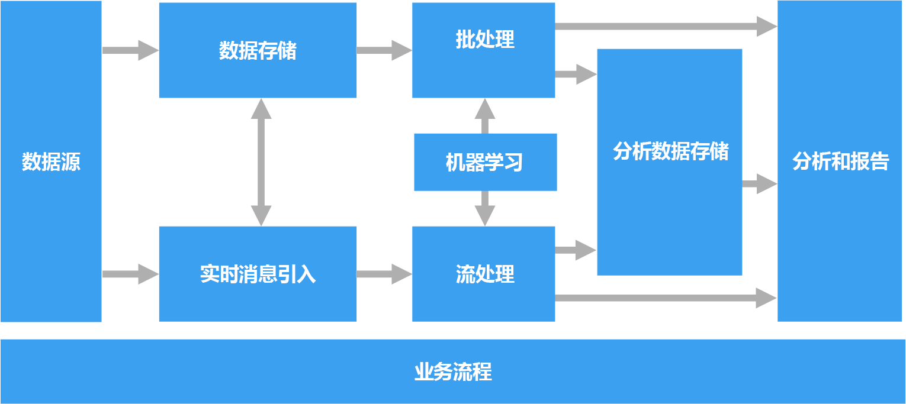
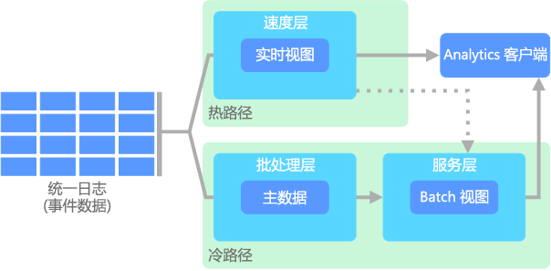

# 大数据体系结构

大数据体系结构设计用来处理对传统数据库系统而言太大或太复杂的数据的引入、处理和分析。 组织进入大数据领域的门槛各不相同，具体取决于用户的权限及其工具的功能。 对某些组织来说，大数据可能意味着数百个 GB 的数据，而对另一些组织来说，大数据则意味着数百个 TB 的数据。 随着处理大数据集的工具的发展，大数据的涵义也在不断地变化。 慢慢地，这个术语更多的是指通过高级分析从数据集获取的价值，而不是严格地指数据的大小，虽然这种情况下的数据往往是很大的。

多年来，数据格局一直在变。 数据的功能和预期功能一直在变。 存储成本在大幅下降，而数据的收集手段则在增多。 一些数据会瞬间出现，需要不断地进行收集和观察。 另一些数据出现速度较慢，但却是很大型的区块，通常是以数十年的历史数据的形式出现。 你面对的可能是高级分析问题，也可能是需要机器学习的问题。 这些都是大数据体系结构寻求解决的难题。

大数据解决方案通常涉及一个或多个以下类型的工作负荷：

* 静态大数据源的批处理。
* 移动中的大数据的实时处理。
* 大数据的交互式浏览。
* 预测分析和机器学习。

需要解决以下难题时，可以考虑使用大数据体系结构：

* 存储和处理对传统数据库而言数量太大的数据。
* 转换非结构化数据以进行分析和报告。
* 实时或者以较低的延迟捕获、处理和分析无限的数据流。

## 大数据体系结构的组件

下图显示了组成大数据体系结构的逻辑组件。 单个解决方案可能不会包含此图中的每个项目。

 

大多数大数据体系结构都包括下列组件中的一些或全部：

* **数据源**。 所有大数据解决方案一开始都有一个或多个数据源。 示例包括：

    * 应用程序数据存储，例如关系数据库。
    * 应用程序生成的静态文件，例如 Web 服务器日志文件。
    * 实时数据源，例如 IoT 设备。

* **数据存储**。 用于批处理操作的数据通常存储在分布式文件存储中，该存储可以容纳大量各种格式的大型文件。 这类存储通常称为 *Data Lake*。 用于实现此存储的选项包括 Azure Data Lake Store 和 Azure 存储中的 blob 容器。

* **批处理**。 由于数据集很大，因此大数据解决方案通常必须使用长时间运行的批处理作业来处理数据文件，以便筛选、聚合和准备用于分析的数据。 这些作业通常涉及读取源文件、对它们进行处理，以及将输出写入到新文件。 选项包括在 Azure Data Lake Analytics 中运行 U-SQL 作业，在 HDInsight Hadoop 群集中使用 Hive、Pig 或自定义 Map/Reduce 作业，或者在 HDInsight Spark 群集中使用 Java、Scala 或 Python 程序。

* **实时消息引入**。 如果解决方案包括实时源，则体系结构必须包括一种方法来捕获并存储进行流处理的实时消息。 这可以是一个简单的数据存储，将在其中将传入消息放置在一个文件夹中以进行处理。 不过，许多解决方案都需要一个消息引入存储来充当消息缓冲区，以及支持横向扩展处理、可靠传递和其他消息队列语义。 此部分的流式处理体系结构通常称为流缓冲。 选项包括 Azure 事件中心、Azure IoT 中心和 Kafka。

* **流处理**。 捕获实时消息后，解决方案必须通过筛选、聚合以及准备用于分析的数据来处理消息。 然后，会将处理后的流数据写入到输出接收器。 Azure 流分析基于不断运行的 SQL 查询提供托管流处理服务，这些查询对无限的流进行操作。 还可以在 HDInsight 群集中使用开源 Apache 流式处理技术，例如 Storm 和 Spark 流式处理。

* **分析数据存储**。 许多大数据解决方案会先准备用于分析的数据，然后以结构化格式提供已处理的数据供分析工具查询。 如大多数传统业务智能 (BI) 解决方案中所见，用来为这些查询提供服务的分析数据存储可以是 Kimball 样式的关系数据仓库。 另外，可以通过低延迟 NoSQL 技术（例如 HBase，或通过分布式数据存储中的数据文件提供元数据抽象的交互式 Hive 数据库）来提供数据。 Azure SQL 数据仓库针对大规模的基于云的数据仓库提供托管服务。 HDInsight 支持交互式 Hive、HBase 和 Spark SQL，也可以使用这些技术来提供用于分析的数据。

* **分析和报告**。 大多数大数据解决方案的目的是通过分析和报告提供对数据的见解。 若要使用户能够对数据进行分析，体系结构可以包括一个数据建模层，例如 Azure Analysis Services 中的多维 OLAP 多维数据集或表格数据模型。 它还可以使用 Microsoft Power BI 或 Microsoft Excel 中的建模和可视化技术支持自助式 BI。 分析和报告还可以采用适用于数据科学家或数据分析人员的交互式数据浏览形式。 对于这些方案，许多 Azure 服务都支持分析笔记本（例如 Jupyter），这允许这些用户通过 Python 或 R 利用其现有技能。对于大规模数据浏览，可以使用 Microsoft R Server，可以独立使用，也可以将其与 Spark 一起使用。

* **业务流程**。 大多数大数据解决方案都包括重复的数据处理操作（封装在工作流中），这些操作对源数据进行转换、在多个源和接收器之间移动数据、将已处理的数据加载到分析数据存储中，或者直接将结果推送到报表或仪表板。 若要自动执行这些工作流，可以使用诸如 Azure 数据工厂或 Apache Oozie 和 Sqoop 的业务流程技术。

## Lambda 体系结构

使用极大型数据集时，运行客户端所需的查询类型可能需要很长时间。 这些查询无法实时执行，并且通常需要 [MapReduce](https://en.wikipedia.org/wiki/MapReduce) 之类的算法跨整个数据集进行并行操作。 然后，结果会与原始数据分开存储，用于查询。

此方法的一个缺点是会造成延迟 &mdash; 如果处理需要数小时，则查询返回的结果可能是数小时之前的数据的结果。 最好是能够获取一些实时结果（也许准确性稍欠），然后将这些结果与批处理分析结果结合在一起。

**lambda 体系结构**首先由 Nathan Marz 提出，通过创建两个数据流路径来解决此问题。 所有进入系统的数据都经过这两个路径：

* **批处理层**（冷路径）以原始形式存储所有传入数据，对数据进行批处理。 该处理的结果作为**批处理视图**存储。

* **速度层**（热路径）可实时分析数据。 设计此层是为了降低延迟，但代价是准确性也会降低。

批处理层将结果馈送到**服务层**中，后者会编制批处理视图的索引，以便提高查询效率。 速度层会根据最新数据使用增量更新来更新服务层。

流入热路径的数据受速度层提出的延迟要求约束，因此可以尽快处理。 通常情况下，这需要牺牲一定程度的准确性，以便数据尽快就绪。 例如，在使用某个 IoT 方案时，需要通过大量的温度传感器发送遥测数据。 可以使用速度层来处理传入数据的滑动时间窗口。 

另一方面，流入冷路径中的数据不受这些相同的低延迟要求约束。 这样可以跨大型数据集进行高精度计算，这样的计算可能很耗时。 

热路径和冷路径最终在分析客户端应用程序处会合。 如果需要实时显示时间性要求高但准确性要求可能不高的数据，客户端会从热路径获取结果。 否则，客户端会从冷路径选择结果来显示时间性要求不高但准确性要求高的数据。 换言之，一开始可以使用时限相对较短的热路径的数据作为结果，稍后再使用冷路径的准确性较高的数据对结果进行更新。

存储在批处理层的原始数据是不可变的。 传入数据始终追加到现有数据上，不覆盖以前的数据。 对特定基准的值进行更改时，所做的更改会作为带时间戳的新事件记录来存储。 这样就可以选择历史记录中任意时间点的已收集数据重新进行计算。 根据最初的原始数据重新计算批处理视图这一功能很重要，因为这样就可以随着系统的发展不断创建新视图。 

## Kappa 体系结构

Lambda 体系结构的一个缺点是复杂。 处理逻辑显示在冷路径和热路径两个不同的位置，而且使用不同的框架。 这样会导致计算逻辑重复，而且两个路径的体系结构管理起来也很复杂。

**Kappa 体系结构**由 Jay Kreps 提出，用于替代 Lambda 体系结构。 它的基本目的与 Lambda 体系结构相同，但有一个重要区别：所有数据流经一个路径，使用一个流处理系统。 

某些方面与 Lambda 体系结构的批处理层有些类似，那就是，事件数据不可变，而且全都可以收集，而不是只能收集一部分。 数据作为事件流引入到能容错的分布式统一日志中。 这些事件按顺序排列。一个事件的当前状态只在追加新事件的情况下更改。 与 Lambda 体系结构的速度层类似，所有事件处理均在输入流的基础上进行，作为实时视图保存。 

如需重新计算整个数据集（相当于 Lambda 中批处理层执行的操作），只需重播该流即可，通常可使用并行方式及时完成计算。

## 物联网 (IoT)

从实用角度来看，物联网 (IoT) 囊括连接到 Internet 的任何设备， 其中包括电脑、移动电话、智能表、智能调温器、智能致冷器、联网汽车、植入式心脏监测仪，以及任何其他可以连接到 Internet 并可发送或接收数据的设备。 连接的设备数与日俱增，从其收集的数据量也是如此。 通常情况下，此类数据是在受到严格约束且有时候延迟很严重的环境中收集的。 另外一些情况下，数据是在低延迟环境中通过数千甚至数百万台设备发送的，这就要求能够快速引入数据并对其进行相应的处理。 因此，为了应对这些约束和特殊要求，需要正确地进行规划。

事件驱动的体系结构是 IoT 解决方案的中心环节。 下列图表显示 IoT 可能出现的逻辑体系结构。 此图表强调体系结构的事件流式传输组件。

云网关使用可靠、低延迟的消息传递系统在云边界引入设备事件。

设备可能会直接将事件发送到云网关，或通过现场网关发送。 现场网关是一种专用设备或软件，通常与接收事件并将事件转接到云网关的设备位于同一位置。 现场网关也可预处理原始设备事件，执行过滤、聚合或协议转换等功能。

引入后，事件将通过一个或多个流处理器，此处理器可将数据路由到存储等位置，也可执行分析和其他处理。

下面是一些常见的处理类型。 （此列表并未囊括所有类型。）

- 将事件数据写入冷存储，用于存档或批处理分析。

- 热路径分析，实时（或近乎实时）分析事件流，以检测异常，识别滚动时间范围内的模式，或者在流中出现特殊情况时触发警报。 

- 处理设备中特殊类型的非遥测消息，例如通知和警报。 

- 机器学习。

具有灰色阴影的框表示 IoT 系统的组件，虽然这些组件与事件流式传输没有直接关系，但为了完整起见，仍在此处提出。

- 设备注册表是预配设备的数据库，包括设备 ID 和常见的设备元数据，如位置信息。

- 预配 API 是一种常见的外部接口，用于预配和注册新设备。

- 某些 IoT 解决方案可使命令和控制消息发送到设备。

相关的 Azure 服务：

- [Azure IoT 中心](https://azure.microsoft.com/services/iot-hub/)
- [Azure 事件中心](https://azure.microsoft.com/services/event-hubs/)
- [Azure 流分析](https://azure.microsoft.com/services/stream-analytics/)  

阅读 [Azure IoT reference architecture](https://azure.microsoft.com/updates/microsoft-azure-iot-reference-architecture-available/)（Azure IoT 参考体系结构），详细了解 Azure 上的 IoT。

