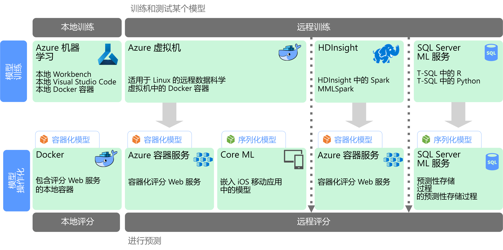

# 规模化机器学习

机器学习 (ML) 是用来根据数学算法对预测模型进行训练的一种技术。 机器学习分析数据字段之间的关系来预测未知值。

创建和部署机器学习模型是一个迭代过程：

* 数据科学家探究源数据来确定“特征”与预测的“标签”之间的关系。
* 数据科学家根据合适的算法对模型进行训练和验证，以查明用于预测的最佳模型。
* 最佳模型作为 Web 服务或其他封装的功能部署到生产环境中。
* 收集新数据时，会定期重新训练模型来改进其有效性。

规模化机器学习解决了两个不同的可伸缩性关注点。 第一个关注点是针对大型数据集对模型进行训练，这种数据集需要群集的横向扩展功能来进行训练。 第二个关注点是以合适的方式实施已学习的模型，以便可以进行缩放来满足使用它的应用程序的需求。 通常，这是通过将预测功能部署为可以横向扩展的 Web 服务来实现的。

规模化机器学习的优势是它能够生成强大的预测功能，因为更好的模型通常可以产生更多的数据。 在对模型进行训练后，可以将其部署为无状态、高性能、可横向扩展的 Web 服务。 

## 模型编制和训练

在模型编制和训练阶段中，数据科学家使用 Python 和 R 之类的语言以交互方式对数据进行探究来实现以下目的：

* 从大量数据存储中提取样本。
* 查找并处理离群值、重复项和缺失值，以便清理数据。
* 通过统计性分析和可视化确定数据中的关联和关系。
* 创建新的计算特征来改进对统计关系的预测。
* 根据预测算法对机器学习模型进行训练。
* 使用在训练期间预留的数据对已训练的模型进行验证。

若要支持此交互式分析和建模阶段，数据平台必须使数据科学家能够使用各种工具来探究数据。 此外，对复杂的机器学习模型进行训练可能需要密集处理大量数据，因此必须有足够的资源用于横向扩展模型训练。

## 模型部署和使用

当模型就绪可部署时，可以将其封装为 Web 服务并部署到云中、边缘设备中或企业机器学习执行环境中。 此部署过程称为实施。

## 挑战

规模化机器学习带来了一些挑战：

- 通常需要大量数据来训练模型，尤其是对于深度学习模型。
- 需要先准备这些大数据集，然后才能开始对模型进行训练。
- 模型训练阶段必须访问大数据存储。 通常使用用于数据准备的同一大数据群集（例如 Spark）来执行模型训练。 
- 对于深度学习之类的方案，群集不但要能够提供 CPU 横向扩展，而且还需要由启用了 GPU 的节点构成。

## Azure 中的规模化机器学习

在决定要在训练和实施阶段使用哪些机器学习服务之前，请考虑是要从头训练一个模型，还是有预构建的模型可以满足你的要求。 许多情况下，使用预构建的模型只需要调用某个 Web 服务或使用机器学习库来加载现有模型。 包括的一些选项如下： 

- 使用 Microsoft 认知服务提供的 Web 服务。
- 使用认知工具包提供的预先训练的神经网络模型。
- 嵌入由 Core ML 提供的适用于 iOS 应用的序列化模型。 

如果预构建的模型不适合你的数据或应用场景，Azure 中的选项还包括 Azure 机器学习、基于 Spark MLlib 和 MMLSpark 的 HDInsight、认知工具包以及 SQL 机器学习服务。 如果决定使用自定义模型，必须设计一个管道并使其包括模型训练和实施。 

有关 Azure 中用于机器学习的技术选择，请参阅以下主题：

- [选择认知服务技术](../technology-choices/cognitive-services.md)
- [选择机器学习技术](../technology-choices/data-science-and-machine-learning.md)
- [选择自然语言处理技术](../technology-choices/natural-language-processing.md)
