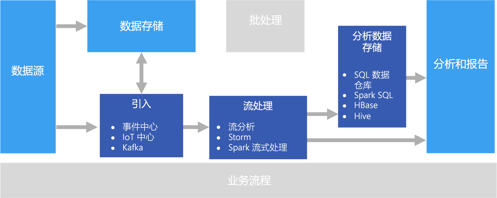

# 实时处理

实时处理以最低的延迟对实时捕获的数据流进行处理，以生成实时（或近乎实时）报告或自动响应。 例如，实时监视解决方案可以使用传感器数据来检测车流量。 可以使用此数据动态更新地图以显示交通堵塞情况，或自动启动堵塞车道或其他交通管理系统。

实时处理定义为处理无约束输入数据流，处理时要求延迟极短 &mdash; 以毫秒或秒计。 此传入数据通常以非结构化或半结构化格式（例如 JSON）传送，其处理要求与[批处理](./batch-processing.md)相同，但周转时间更短，可支持实时使用。

处理的数据通常写入已针对分析和可视进行优化的分析数据存储。 还可以将处理的数据直接引入分析和报告层，以用于分析、商业智能和实时仪表板可视化。

## 挑战

实时处理解决方案的最大难题之一是实时引入、处理和存储消息，尤其是消息量很大时。 执行处理时不能阻塞引入管道。 数据存储必须支持大量写入。 另一个难题是快速处理数据，例如，实时生成警报，或者在实时（或近乎实时）仪表板中显示数据。

## 体系结构

实时处理体系结构包含以下逻辑组件。

- **实时消息引入。** 该体系结构必须提供一种方法来捕获和存储流处理使用方使用的实时消息。 在简单的场合中，可将此服务实施为简单的数据存储，以便将新消息放入其中的某个文件夹。 但是，解决方案通常需要一个充当消息缓冲区的消息中转站，例如 Azure 事件中心。 消息中转站应支持横向扩展处理和可靠传递。

- **流处理。** 捕获实时消息后，解决方案必须通过筛选、聚合以及准备用于分析的数据来处理消息。

- **分析数据存储。** 许多大数据解决方案会先准备用于分析的数据，然后以结构化格式提供已处理的数据供分析工具查询。 

- **分析和报告。** 大多数大数据解决方案的目的是通过分析和报告提供对数据的见解。 

## 技术选择

建议对 Azure 中的实时处理解决方案选择以下技术。

### 实时消息引入

- **Azure 事件中心**。 Azure 事件中心是一个消息队列解决方案，每秒可引入数百万条事件消息。 多个使用者可以并行处理捕获的事件数据。
- **Azure IoT 中心**。 Azure IoT 中心在连接到 Internet 的设备之间提供双向通信，并提供一个可以处理数百万个同时连接的设备的可缩放消息队列。
- **Apache Kafka**。 Kafka 是一个开源消息队列和流处理应用程序，经扩展后每秒可以处理多个消息生成者发出的数百万条消息，并将它们路由到多个使用者。 在 Azure 中，Kafka 作为 HDInsight 群集类型提供。

有关详细信息，请参阅[实时消息引入](../technology-choices/real-time-ingestion.md)。

### 数据存储

- **Azure 存储 Blob 容器**或 **Azure Data Lake Store**。 传入的实时数据通常在消息中转站中捕获（如上所述），但在某些情况下，最好是监视文件夹中的新文件，并在创建或更新文件时对其进行处理。 此外，许多实时处理解决方案将流数据与静态引用数据合并，这些数据可存储在文件存储中。 最后，可将文件存储用作捕获的实时数据的输出目标，以便存档，或者在 [lambda 体系结构](../big-data/index.md#lambda-architecture)中做进一步的批处理。

有关详细信息，请参阅[数据存储](../technology-choices/data-storage.md)。

### 流处理

- **Azure 流分析**。 Azure 流分析可以针对无约束的数据流运行永久查询。 这些查询使用存储或消息中转站中的数据流、根据时态窗口筛选和聚合数据，并将结果写入接收器（例如存储）、数据库，或直接写入 Power BI 中的报表。
- **Storm**。 Apache Storm 是适用于流处理的开源框架，它使用 Spout 和 Bolt 的拓扑，从实时流数据源使用、处理和输出结果。 可以在 Azure HDInsight 群集中预配 Storm，并以 Java 或 C# 实施拓扑。
- **Spark Streaming**。 Apache Spark 是适用于常规数据处理的开源分布式平台。 Spark 提供 Spark 流 API，在其中可以使用受支持的任何 Spark 语言（包括 Java、Scala 和 Python）编写代码。 Spark 2.0 引入了 Spark 结构化流 API，该 API 提供更简单且更一致的编程模型。 Spark 2.0 在 Azure HDInsight 群集中提供。

有关详细信息，请参阅[流处理](../technology-choices/stream-processing.md)。

### 分析数据存储

- **SQL 数据仓库**、**HBase**、**Spark** 或 **Hive**。 可将处理的实时数据存储在 Azure SQL 数据仓库等关系数据库、HBase 等 NoSQL 存储中，或者将其作为文件存储在分布式存储中，然后，可以根据这些文件来定义和查询 Spark 或 Hive 表。

有关详细信息，请参阅[分析数据存储](../technology-choices/analytical-data-stores.md)。

### 分析和报告

- **Azure Analysis Services**、**Power BI** 和 **Microsoft Excel**。 像批处理的数据一样，存储在分析数据存储中的已处理的实时数据可用于历史报告和分析。 此外，可以使用 Power BI 从延迟足够低的分析数据源发布实时（或近乎实时）的报告和可视化效果；在某些情况下，还可以直接从流处理的输出发布。

有关详细信息，请参阅[分析和报告](../technology-choices/analysis-visualizations-reporting.md)。

在单纯的实时解决方案中，大多数处理业务流程由消息引入和流处理组件管理。 但是，在结合批处理与实时处理的 lambda 体系结构中，可能需要使用 Azure 数据工厂或 Apache Oozie 和 Sqoop 等业务流程框架来管理捕获的实时数据的批处理工作流。

