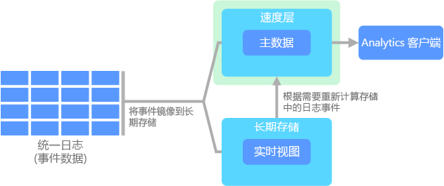

# 大数据体系结构Big data architectures

大数据体系结构设计用来处理对传统数据库系统而言太大或太复杂的数据的引入、处理和分析。A big data architecture is designed to handle the ingestion, processing, and analysis of data that is too large or complex for traditional database systems. 组织进入大数据领域的门槛各不相同，具体取决于用户的权限及其工具的功能。The threshold at which organizations enter into the big data realm differs, depending on the capabilities of the users and their tools. 对某些组织来说，大数据可能意味着数百个 GB 的数据，而对另一些组织来说，大数据则意味着数百个 TB 的数据。For some, it can mean hundreds of gigabytes of data, while for others it means hundreds of terabytes. 随着处理大数据集的工具的发展，大数据的涵义也在不断地变化。As tools for working with big data sets advance, so does the meaning of big data. 慢慢地，这个术语更多的是指通过高级分析从数据集获取的价值，而不是严格地指数据的大小，虽然这种情况下的数据往往是很大的。More and more, this term relates to the value you can extract from your data sets through advanced analytics, rather than strictly the size of the data, although in these cases they tend to be quite large.

多年来，数据格局一直在变。Over the years, the data landscape has changed. 数据的功能和预期功能一直在变。What you can do, or are expected to do, with data has changed. 存储成本在大幅下降，而数据的收集手段则在增多。The cost of storage has fallen dramatically, while the means by which data is collected keeps growing. 一些数据会瞬间出现，需要不断地进行收集和观察。Some data arrives at a rapid pace, constantly demanding to be collected and observed. 另一些数据出现速度较慢，但却是很大型的区块，通常是以数十年的历史数据的形式出现。Other data arrives more slowly, but in very large chunks, often in the form of decades of historical data. 你面对的可能是高级分析问题，也可能是需要机器学习的问题。You might be facing an advanced analytics problem, or one that requires machine learning. 这些都是大数据体系结构寻求解决的难题。These are challenges that big data architectures seek to solve.

大数据解决方案通常涉及一个或多个以下类型的工作负荷：Big data solutions typically involve one or more of the following types of workload:

* 静态大数据源的批处理。Batch processing of big data sources at rest.
* 移动中的大数据的实时处理。Real-time processing of big data in motion.
* 大数据的交互式浏览。Interactive exploration of big data.
* 预测分析和机器学习。Predictive analytics and machine learning.

需要解决以下难题时，可以考虑使用大数据体系结构：Consider big data architectures when you need to:

* 存储和处理对传统数据库而言数量太大的数据。Store and process data in volumes too large for a traditional database.
* 转换非结构化数据以进行分析和报告。Transform unstructured data for analysis and reporting.
* 实时或者以较低的延迟捕获、处理和分析无限的数据流。Capture, process, and analyze unbounded streams of data in real time, or with low latency.

## 大数据体系结构的组件Components of a big data architecture

下图显示了组成大数据体系结构的逻辑组件。The following diagram shows the logical components that fit into a big data architecture. 单个解决方案可能不会包含此图中的每个项目。Individual solutions may not contain every item in this diagram.

 

大多数大数据体系结构都包括下列组件中的一些或全部：Most big data architectures include some or all of the following components:

* **数据源**。**Data sources**. 所有大数据解决方案一开始都有一个或多个数据源。All big data solutions start with one or more data sources. 示例包括：Examples include:

    * 应用程序数据存储，例如关系数据库。Application data stores, such as relational databases.
    * 应用程序生成的静态文件，例如 Web 服务器日志文件。Static files produced by applications, such as web server log files.
    * 实时数据源，例如 IoT 设备。Real-time data sources, such as IoT devices.

* **数据存储**。**Data storage**. 用于批处理操作的数据通常存储在分布式文件存储中，该存储可以容纳大量各种格式的大型文件。Data for batch processing operations is typically stored in a distributed file store that can hold high volumes of large files in various formats. 这类存储通常称为 *Data Lake*。This kind of store is often called a *data lake*. 用于实现此存储的选项包括 Azure Data Lake Store 和 Azure 存储中的 blob 容器。Options for implementing this storage include Azure Data Lake Store or blob containers in Azure Storage.

* **批处理**。**Batch processing**. 由于数据集很大，因此大数据解决方案通常必须使用长时间运行的批处理作业来处理数据文件，以便筛选、聚合和准备用于分析的数据。Because the data sets are so large, often a big data solution must process data files using long-running batch jobs to filter, aggregate, and otherwise prepare the data for analysis. 这些作业通常涉及读取源文件、对它们进行处理，以及将输出写入到新文件。Usually these jobs involve reading source files, processing them, and writing the output to new files. 选项包括在 Azure Data Lake Analytics 中运行 U-SQL 作业，在 HDInsight Hadoop 群集中使用 Hive、Pig 或自定义 Map/Reduce 作业，或者在 HDInsight Spark 群集中使用 Java、Scala 或 Python 程序。Options include running U-SQL jobs in Azure Data Lake Analytics, using Hive, Pig, or custom Map/Reduce jobs in an HDInsight Hadoop cluster, or using Java, Scala, or Python programs in an HDInsight Spark cluster.

* **实时消息引入**。**Real-time message ingestion**. 如果解决方案包括实时源，则体系结构必须包括一种方法来捕获并存储进行流处理的实时消息。If the solution includes real-time sources, the architecture must include a way to capture and store real-time messages for stream processing. 这可以是一个简单的数据存储，将在其中将传入消息放置在一个文件夹中以进行处理。This might be a simple data store, where incoming messages are dropped into a folder for processing. 不过，许多解决方案都需要一个消息引入存储来充当消息缓冲区，以及支持横向扩展处理、可靠传递和其他消息队列语义。However, many solutions need a message ingestion store to act as a buffer for messages, and to support scale-out processing, reliable delivery, and other message queuing semantics. 此部分的流式处理体系结构通常称为流缓冲。This portion of a streaming architecture is often referred to as stream buffering. 选项包括 Azure 事件中心、Azure IoT 中心和 Kafka。Options include Azure Event Hubs, Azure IoT Hub, and Kafka.

* **流处理**。**Stream processing**. 捕获实时消息后，解决方案必须通过筛选、聚合以及准备用于分析的数据来处理消息。After capturing real-time messages, the solution must process them by filtering, aggregating, and otherwise preparing the data for analysis. 然后，会将处理后的流数据写入到输出接收器。The processed stream data is then written to an output sink. Azure 流分析基于不断运行的 SQL 查询提供托管流处理服务，这些查询对无限的流进行操作。Azure Stream Analytics provides a managed stream processing service based on perpetually running SQL queries that operate on unbounded streams. 还可以在 HDInsight 群集中使用开源 Apache 流式处理技术，例如 Storm 和 Spark 流式处理。You can also use open source Apache streaming technologies like Storm and Spark Streaming in an HDInsight cluster.

* **分析数据存储**。**Analytical data store**. 许多大数据解决方案会先准备用于分析的数据，然后以结构化格式提供已处理的数据供分析工具查询。Many big data solutions prepare data for analysis and then serve the processed data in a structured format that can be queried using analytical tools. 如大多数传统业务智能 (BI) 解决方案中所见，用来为这些查询提供服务的分析数据存储可以是 Kimball 样式的关系数据仓库。The analytical data store used to serve these queries can be a Kimball-style relational data warehouse, as seen in most traditional business intelligence (BI) solutions. 另外，可以通过低延迟 NoSQL 技术（例如 HBase，或通过分布式数据存储中的数据文件提供元数据抽象的交互式 Hive 数据库）来提供数据。Alternatively, the data could be presented through a low-latency NoSQL technology such as HBase, or an interactive Hive database that provides a metadata abstraction over data files in the distributed data store. Azure SQL 数据仓库针对大规模的基于云的数据仓库提供托管服务。Azure SQL Data Warehouse provides a managed service for large-scale, cloud-based data warehousing. HDInsight 支持交互式 Hive、HBase 和 Spark SQL，也可以使用这些技术来提供用于分析的数据。HDInsight supports Interactive Hive, HBase, and Spark SQL, which can also be used to serve data for analysis.

* **分析和报告**。**Analysis and reporting**. 大多数大数据解决方案的目的是通过分析和报告提供对数据的见解。The goal of most big data solutions is to provide insights into the data through analysis and reporting. 若要使用户能够对数据进行分析，体系结构可以包括一个数据建模层，例如 Azure Analysis Services 中的多维 OLAP 多维数据集或表格数据模型。To empower users to analyze the data, the architecture may include a data modeling layer, such as a multidimensional OLAP cube or tabular data model in Azure Analysis Services. 它还可以使用 Microsoft Power BI 或 Microsoft Excel 中的建模和可视化技术支持自助式 BI。It might also support self-service BI, using the modeling and visualization technologies in Microsoft Power BI or Microsoft Excel. 分析和报告还可以采用适用于数据科学家或数据分析人员的交互式数据浏览形式。Analysis and reporting can also take the form of interactive data exploration by data scientists or data analysts. 对于这些方案，许多 Azure 服务都支持分析笔记本（例如 Jupyter），这允许这些用户通过 Python 或 R 利用其现有技能。对于大规模数据浏览，可以使用 Microsoft R Server，可以独立使用，也可以将其与 Spark 一起使用。For these scenarios, many Azure services support analytical notebooks, such as Jupyter, enabling these users to leverage their existing skills with Python or R. For large-scale data exploration, you can use Microsoft R Server, either standalone or with Spark.

* **业务流程**。**Orchestration**. 大多数大数据解决方案都包括重复的数据处理操作（封装在工作流中），这些操作对源数据进行转换、在多个源和接收器之间移动数据、将已处理的数据加载到分析数据存储中，或者直接将结果推送到报表或仪表板。Most big data solutions consist of repeated data processing operations, encapsulated in workflows, that transform source data, move data between multiple sources and sinks, load the processed data into an analytical data store, or push the results straight to a report or dashboard. 若要自动执行这些工作流，可以使用诸如 Azure 数据工厂或 Apache Oozie 和 Sqoop 的业务流程技术。To automate these workflows, you can use an orchestration technology such Azure Data Factory or Apache Oozie and Sqoop.

## Data LakeData lake

如果你阅读过有关大数据的文章，则可能已见过 _Data Lake_ 这个术语。If you have read anything about big data, it's likely you've seen the term _data lake_. 你可能已见过该词用于与存储大量数据相关的产品或概念的名称。You may have seen the word used for the name of a product, or perhaps a concept about storing large quantities of data. 

Data Lake 由存储和处理两部分组成。A data lake consists of both storage and processing. 生成 Data Lake 存储有多个目的：容错、确保无限可伸缩性，以及在引入不同形状和大小的数据时实现高吞吐量。Data lake storage is built with several goals in mind: fault-tolerance, infinite scalability, and high-throughput ingestion of data with varying shapes and sizes. Data Lake 处理涉及生成一个或多个用于实现此类目的的处理引擎，可以对存储在 Data Lake 中的数据进行大规模的处理。Data lake processing involves one or more processing engines built with these goals in mind, and can operate on data stored in a data lake at scale.

Data Lake 存储通常用于事件流式处理或 IoT 方案，因为此类存储可以保存大量的关系数据和非关系数据，不需进行转换，也不需架构定义。Data lake stores are often used in event streaming or IoT scenarios, because they can persist large amounts of relational and nonrelational data without transformation or schema definition. 此类存储可以在低延迟的状况下处理大量的小型写入数据，并已针对大规模的吞吐量进行了优化。They are built to handle high volumes of small writes at low latency, and are optimized for massive throughput.

另一常用于数据方案的术语是“数据市场”。Another term commonly used in data scenarios is _data mart_. 通常情况下，数据市场是一种可以进行清理、打包和结构化操作的数据存储，目的是方便使用。Typically, a data mart is a store of data that is cleansed, packaged, and structured for easy consumption. 与数据市场不同，Data Lake 旨在引入原始数据，让其保留原始形式或尽量少处理的形式，这样就可以采用不同方式在不同的时间提问问题。Unlike a data mart, a data lake is designed to ingest raw data, leaving it in its original or least-processed form to allow questions to be asked in various ways and at various times. 如果像在数据市场中那样采用特定方式对数据进行清理和结构化操作，则在将来出现新问题或新工具时，就会难以适应数据的处理和分析方式。If the data is cleansed and structured in a specific way, like in a data mart, then it is difficult to adapt how the data is processed and analyzed when new questions or tools come about in the future. 这就是 Data Lake 包含存储和处理两个不同实体的原因。This is why a data lake is composed of both storage and processing as separate entities.

相关的 Azure 服务：Relevant Azure service:
- [Azure Data LakeAzure Data Lake](https://azure.microsoft.com/scenarios/data-lake/)

## Lambda 体系结构Lambda architecture

使用极大型数据集时，运行客户端所需的查询类型可能需要很长时间。When working with very large data sets, it can take a long time to run the sort of queries that clients need. 这些查询无法实时执行，并且通常需要 [MapReduce](https://en.wikipedia.org/wiki/MapReduce) 之类的算法跨整个数据集进行并行操作。These queries can't be performed in real time, and often require algorithms such as [MapReduce](https://en.wikipedia.org/wiki/MapReduce) that operate in parallel across the entire data set. 然后，结果会与原始数据分开存储，用于查询。The results are then stored separately from the raw data and used for querying.

此方法的一个缺点是会造成延迟 &mdash; 如果处理需要数小时，则查询返回的结果可能是数小时之前的数据的结果。One drawback to this approach is that it introduces latency &mdash; if processing takes a few hours, a query may return results that are several hours old. 最好是能够获取一些实时结果（也许准确性稍欠），然后将这些结果与批处理分析结果结合在一起。Ideally, you would like to get some results in real time (perhaps with some loss of accuracy), and combine these results with the results from the batch analytics.

**lambda 体系结构**首先由 Nathan Marz 提出，通过创建两个数据流路径来解决此问题。The **lambda architecture**, first proposed by Nathan Marz, addresses this problem by creating two paths for data flow. 所有进入系统的数据都经过这两个路径：All data coming into the system goes through these two paths:

* **批处理层**（冷路径）以原始形式存储所有传入数据，对数据进行批处理。A **batch layer** (cold path) stores all of the incoming data in its raw form and performs batch processing on the data. 该处理的结果作为**批处理视图**存储。The result of this processing is stored as a **batch view**.

* **速度层**（热路径）可实时分析数据。A **speed layer** (hot path) analyzes data in real time. 设计此层是为了降低延迟，但代价是准确性也会降低。This layer is designed for low latency, at the expense of accuracy.

批处理层将结果馈送到**服务层**中，后者会编制批处理视图的索引，以便提高查询效率。The batch layer feeds into a **serving layer** that indexes the batch view for efficient querying. 速度层会根据最新数据使用增量更新来更新服务层。The speed layer updates the serving layer with incremental updates based on the most recent data.

流入热路径的数据受速度层提出的延迟要求约束，因此可以尽快处理。Data that flows into the hot path is constrained by latency requirements imposed by the speed layer, so that it can be processed as quickly as possible. 通常情况下，这需要牺牲一定程度的准确性，以便数据尽快就绪。Often, this requires a tradeoff of some level of accuracy in favor of data that is ready as quickly as possible. 例如，在使用某个 IoT 方案时，需要通过大量的温度传感器发送遥测数据。For example, consider an IoT scenario where a large number of temperature sensors are sending telemetry data. 可以使用速度层来处理传入数据的滑动时间窗口。The speed layer may be used to process a sliding time window of the incoming data. 

另一方面，流入冷路径中的数据不受这些相同的低延迟要求约束。Data flowing into the cold path, on the other hand, is not subject to the same low latency requirements. 这样可以跨大型数据集进行高精度计算，这样的计算可能很耗时。This allows for high accuracy computation across large data sets, which can be very time intensive. 

热路径和冷路径最终在分析客户端应用程序处会合。Eventually, the hot and cold paths converge at the analytics client application. 如果需要实时显示时间性要求高但准确性要求可能不高的数据，客户端会从热路径获取结果。If the client needs to display timely, yet potentially less accurate data in real time, it will acquire its result from the hot path. 否则，客户端会从冷路径选择结果来显示时间性要求不高但准确性要求高的数据。Otherwise, it will select results from the cold path to display less timely but more accurate data. 换言之，一开始可以使用时限相对较短的热路径的数据作为结果，稍后再使用冷路径的准确性较高的数据对结果进行更新。In other words, the hot path has data for a relatively small window of time, after which the results can be updated with more accurate data from the cold path.

存储在批处理层的原始数据是不可变的。The raw data stored at the batch layer is immutable. 传入数据始终追加到现有数据上，不覆盖以前的数据。Incoming data is always appended to the existing data, and the previous data is never overwritten. 对特定基准的值进行更改时，所做的更改会作为带时间戳的新事件记录来存储。Any changes to the value of a particular datum are stored as a new timestamped event record. 这样就可以选择历史记录中任意时间点的已收集数据重新进行计算。This allows for recomputation at any point in time across the history of the data collected. 根据最初的原始数据重新计算批处理视图这一功能很重要，因为这样就可以随着系统的发展不断创建新视图。The ability to recompute the batch view from the original raw data is important, because it allows for new views to be created as the system evolves. 

## Kappa 体系结构Kappa architecture

Lambda 体系结构的一个缺点是复杂。A drawback to the lambda architecture is its complexity. 处理逻辑显示在冷路径和热路径两个不同的位置，而且使用不同的框架。Processing logic appears in two different places &mdash; the cold and hot paths &mdash; using different frameworks. 这样会导致计算逻辑重复，而且两个路径的体系结构管理起来也很复杂。This leads to duplicate computation logic and the complexity of managing the architecture for both paths.

**Kappa 体系结构**由 Jay Kreps 提出，用于替代 Lambda 体系结构。The **kappa architecture** was proposed by Jay Kreps as an alternative to the lambda architecture. 它的基本目的与 Lambda 体系结构相同，但有一个重要区别：所有数据流经一个路径，使用一个流处理系统。It has the same basic goals as the lambda architecture, but with an important distinction: All data flows through a single path, using a stream processing system. 

某些方面与 Lambda 体系结构的批处理层有些类似，那就是，事件数据不可变，而且全都可以收集，而不是只能收集一部分。There are some similarities to the lambda architecture's batch layer, in that the event data is immutable and all of it is collected, instead of a subset. 数据作为事件流引入到能容错的分布式统一日志中。The data is ingested as a stream of events into a distributed and fault tolerant unified log. 这些事件按顺序排列。一个事件的当前状态只在追加新事件的情况下更改。These events are ordered, and the current state of an event is changed only by a new event being appended. 与 Lambda 体系结构的速度层类似，所有事件处理均在输入流的基础上进行，作为实时视图保存。Similar to a lambda architecture's speed layer, all event processing is performed on the input stream and persisted as a real-time view. 

如需重新计算整个数据集（相当于 Lambda 中批处理层执行的操作），只需重播该流即可，通常可使用并行方式及时完成计算。If you need to recompute the entire data set (equivalent to what the batch layer does in lambda), you simply replay the stream, typically using parallelism to complete the computation in a timely fashion.

## 物联网 (IoT)Internet of Things (IoT)

从实用角度来看，物联网 (IoT) 囊括连接到 Internet 的任何设备，From a practical viewpoint, Internet of Things (IoT) represents any device that is connected to the Internet. 其中包括电脑、移动电话、智能表、智能调温器、智能致冷器、联网汽车、植入式心脏监测仪，以及任何其他可以连接到 Internet 并可发送或接收数据的设备。This includes your PC, mobile phone, smart watch, smart thermostat, smart refrigerator, connected automobile, heart monitoring implants, and anything else that connects to the Internet and sends or receives data. 连接的设备数与日俱增，从其收集的数据量也是如此。The number of connected devices grows every day, as does the amount of data collected from them. 通常情况下，此类数据是在受到严格约束且有时候延迟很严重的环境中收集的。Often this data is being collected in highly constrained, sometimes high-latency environments. 另外一些情况下，数据是在低延迟环境中通过数千甚至数百万台设备发送的，这就要求能够快速引入数据并对其进行相应的处理。In other cases, data is sent from low-latency environments by thousands or millions of devices, requiring the ability to rapidly ingest the data and process accordingly. 因此，为了应对这些约束和特殊要求，需要正确地进行规划。Therefore, proper planning is required to handle these constraints and unique requirements.

事件驱动的体系结构是 IoT 解决方案的中心环节。Event-driven architectures are central to IoT solutions. 下列图表显示 IoT 可能出现的逻辑体系结构。The following diagram shows a possible logical architecture for IoT. 此图表强调体系结构的事件流式传输组件。The diagram emphasizes the event-streaming components of the architecture.

云网关使用可靠、低延迟的消息传递系统在云边界引入设备事件。The **cloud gateway** ingests device events at the cloud boundary, using a reliable, low latency messaging system.

设备可能会直接将事件发送到云网关，或通过现场网关发送。Devices might send events directly to the cloud gateway, or through a **field gateway**. 现场网关是一种专用设备或软件，通常与接收事件并将事件转接到云网关的设备位于同一位置。A field gateway is a specialized device or software, usually collocated with the devices, that receives events and forwards them to the cloud gateway. 现场网关也可预处理原始设备事件，执行过滤、聚合或协议转换等功能。The field gateway might also preprocess the raw device events, performing functions such as filtering, aggregation, or protocol transformation.

引入后，事件将通过一个或多个流处理器，此处理器可将数据路由到存储等位置，也可执行分析和其他处理。After ingestion, events go through one or more **stream processors** that can route the data (for example, to storage) or perform analytics and other processing.

下面是一些常见的处理类型。The following are some common types of processing. （此列表并未囊括所有类型。）(This list is certainly not exhaustive.)

- 将事件数据写入冷存储，用于存档或批处理分析。Writing event data to cold storage, for archiving or batch analytics.

- 热路径分析，实时（或近乎实时）分析事件流，以检测异常，识别滚动时间范围内的模式，或者在流中出现特殊情况时触发警报。Hot path analytics, analyzing the event stream in (near) real time, to detect anomalies, recognize patterns over rolling time windows, or trigger alerts when a specific condition occurs in the stream. 

- 处理设备中特殊类型的非遥测消息，例如通知和警报。Handling special types of nontelemetry messages from devices, such as notifications and alarms. 

- 机器学习。Machine learning.

具有灰色阴影的框表示 IoT 系统的组件，虽然这些组件与事件流式传输没有直接关系，但为了完整起见，仍在此处提出。The boxes that are shaded gray show components of an IoT system that are not directly related to event streaming, but are included here for completeness.

- 设备注册表是预配设备的数据库，包括设备 ID 和常见的设备元数据，如位置信息。The **device registry** is a database of the provisioned devices, including the device IDs and usually device metadata, such as location.

- 预配 API 是一种常见的外部接口，用于预配和注册新设备。The **provisioning API** is a common external interface for provisioning and registering new devices.

- 某些 IoT 解决方案可使命令和控制消息发送到设备。Some IoT solutions allow **command and control messages** to be sent to devices.

相关的 Azure 服务：Relevant Azure services:

- [Azure IoT 中心Azure IoT Hub](https://azure.microsoft.com/services/iot-hub/)
- [Azure 事件中心Azure Event Hubs](https://azure.microsoft.com/services/event-hubs/)
- [Azure 流分析Azure Stream Analytics](https://azure.microsoft.com/services/stream-analytics/)  

阅读 [Azure IoT reference architecture](https://azure.microsoft.com/updates/microsoft-azure-iot-reference-architecture-available/)（Azure IoT 参考体系结构），详细了解 Azure 上的 IoT。Learn more about IoT on Azure by reading the [Azure IoT reference architecture](https://azure.microsoft.com/updates/microsoft-azure-iot-reference-architecture-available/).

