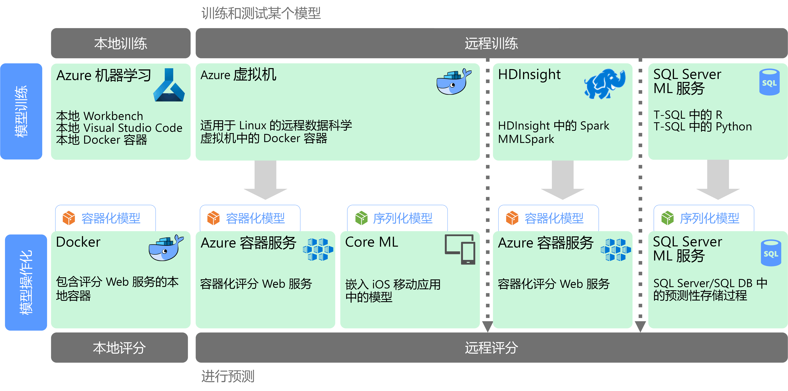

# 规模化机器学习Machine learning at scale

机器学习 (ML) 是用来根据数学算法对预测模型进行训练的一种技术。Machine learning (ML) is a technique used to train predictive models based on mathematical algorithms. 机器学习分析数据字段之间的关系来预测未知值。Machine learning analyzes the relationships between data fields to predict unknown values.

创建和部署机器学习模型是一个迭代过程：Creating and deploying a machine learning model is an iterative process:

* 数据科学家探究源数据来确定“特征”与预测的“标签”之间的关系。Data scientists explore the source data to determine relationships between *features* and predicted *labels*.
* 数据科学家根据合适的算法对模型进行训练和验证，以查明用于预测的最佳模型。The data scientists train and validate models based on appropriate algorithms to find the optimal model for prediction.
* 最佳模型作为 Web 服务或其他封装的功能部署到生产环境中。The optimal model is deployed into production, as a web service or some other encapsulated function.
* 收集新数据时，会定期重新训练模型来改进其有效性。As new data is collected, the model is periodically retrained to improve is effectiveness.

规模化机器学习解决了两个不同的可伸缩性关注点。Machine learning at scale addresses two different scalability concerns. 第一个关注点是针对大型数据集对模型进行训练，这种数据集需要群集的横向扩展功能来进行训练。The first is training a model against large data sets that require the scale-out capabilities of a cluster to train. 第二个关注点是以合适的方式实施已学习的模型，以便可以进行缩放来满足使用它的应用程序的需求。The second centers is operationalizating the learned model in a way that can scale to meet the demands of the applications that consume it. 通常，这是通过将预测功能部署为可以横向扩展的 Web 服务来实现的。Typically this is accomplished by deploying the predictive capabilities as a web service that can then be scaled out.

规模化机器学习的优势是它能够生成强大的预测功能，因为更好的模型通常可以产生更多的数据。Machine learning at scale has the benefit that it can produce powerful, predictive capabilities because better models typically result from more data. 在对模型进行训练后，可以将其部署为无状态、高性能、可横向扩展的 Web 服务。Once a model is trained, it can be deployed as a stateless, highly-performant, scale-out web service. 

## 模型编制和训练Model preparation and training

在模型编制和训练阶段中，数据科学家使用 Python 和 R 之类的语言以交互方式对数据进行探究来实现以下目的：During the model preparation and training phase, data scientists explore the data interactively using languages like Python and R to:

* 从大量数据存储中提取样本。Extract samples from high volume data stores.
* 查找并处理离群值、重复项和缺失值，以便清理数据。Find and treat outliers, duplicates, and missing values to clean the data.
* 通过统计性分析和可视化确定数据中的关联和关系。Determine correlations and relationships in the data through statistical analysis and visualization.
* 创建新的计算特征来改进对统计关系的预测。Generate new calculated features that improve the predictiveness of statistical relationships.
* 根据预测算法对机器学习模型进行训练。Train ML models based on predictive algorithms.
* 使用在训练期间预留的数据对已训练的模型进行验证。Validate trained models using data that was withheld during training.

若要支持此交互式分析和建模阶段，数据平台必须使数据科学家能够使用各种工具来探究数据。To support this interactive analysis and modeling phase, the data platform must enable data scientists to explore data using a variety of tools. 此外，对复杂的机器学习模型进行训练可能需要密集处理大量数据，因此必须有足够的资源用于横向扩展模型训练。Additionally, the training of a complex machine learning model can require a lot of intensive processing of high volumes of data, so sufficient resources for scaling out the model training is essential.

## 模型部署和使用Model deployment and consumption

当模型就绪可部署时，可以将其封装为 Web 服务并部署到云中、边缘设备中或企业机器学习执行环境中。When a model is ready to be deployed, it can be encapsulated as a web service and deployed in the cloud, to an edge device, or within an enterprise ML execution environment. 此部署过程称为实施。This deployment process is referred to as operationalization.

## 挑战Challenges

规模化机器学习带来了一些挑战：Machine learning at scale produces a few challenges:

- 通常需要大量数据来训练模型，尤其是对于深度学习模型。You typically need a lot of data to train a model, especially for deep learning models.
- 需要先准备这些大数据集，然后才能开始对模型进行训练。You need to prepare these big data sets before you can even begin training your model.
- 模型训练阶段必须访问大数据存储。The model training phase must access the big data stores. 通常使用用于数据准备的同一大数据群集（例如 Spark）来执行模型训练。It's common to perform the model training using the same big data cluster, such as Spark, that is used for data preparation. 
- 对于深度学习之类的方案，群集不但要能够提供 CPU 横向扩展，而且还需要由启用了 GPU 的节点构成。For scenarios such as deep learning, not only will you need a cluster that can provide you scale out on CPUs, but your cluster will need to consist of GPU-enabled nodes.

## Azure 中的规模化机器学习Machine learning at scale in Azure

在决定要在训练和实施阶段使用哪些机器学习服务之前，请考虑是要从头训练一个模型，还是有预构建的模型可以满足你的要求。Before deciding which ML services to use in training and operationalization, consider whether you need to train a model at all, or if a prebuilt model can meet your requirements. 许多情况下，使用预构建的模型只需要调用某个 Web 服务或使用机器学习库来加载现有模型。In many cases, using a prebuilt model is just a matter of calling a web service or using an ML library to load an existing model. 包括的一些选项如下：Some options include: 

- 使用 Microsoft 认知服务提供的 Web 服务。Use the web services provided by Microsoft Cognitive Services.
- 使用认知工具包提供的预先训练的神经网络模型。Use the pretrained neural network models provided by Cognitive Toolkit.
- 嵌入由 Core ML 提供的适用于 iOS 应用的序列化模型。Embed the serialized models provided by Core ML for an iOS apps. 

如果预构建的模型不适合你的数据或应用场景，Azure 中的选项还包括 Azure 机器学习、基于 Spark MLlib 和 MMLSpark 的 HDInsight、认知工具包以及 SQL 机器学习服务。If a prebuilt model does not fit your data or your scenario, options in Azure include Azure Machine Learning, HDInsight with Spark MLlib and MMLSpark, Cognitive Toolkit, and SQL Machine Learning Services. 如果决定使用自定义模型，必须设计一个管道并使其包括模型训练和实施。If you decide to use a custom model, you must design a pipeline that includes model training and operationalization. 

有关 Azure 中用于机器学习的技术选择，请参阅以下主题：For a list of technology choices for ML in Azure, see the following topics:

- [选择认知服务技术Choosing a cognitive services technology](../technology-choices/cognitive-services.md)
- [选择机器学习技术Choosing a machine learning technology](../technology-choices/data-science-and-machine-learning.md)
- [选择自然语言处理技术Choosing a natural language processing technology](../technology-choices/natural-language-processing.md)
