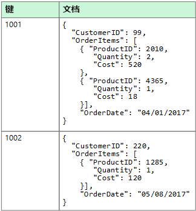
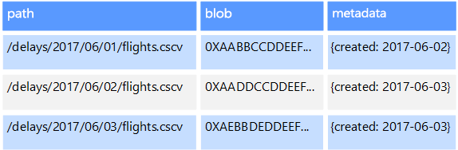
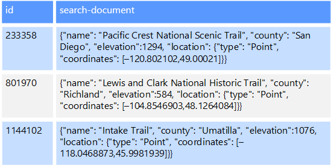

# 非关系数据和 NoSQLNon-relational data and NoSQL

非关系数据库是一种不使用表格架构的数据库，这种包含行和列的架构在传统的数据库系统中很常见。A *non-relational database* is a database that does not use the tabular schema of rows and columns found in most traditional database systems. 与传统数据库相反，非关系数据库使用经过优化的存储模型，符合所存储数据类型的具体要求。Instead, non-relational databases use a storage model that is optimized for the specific requirements of the type of data being stored. 例如，可以将数据存储为简单的键值对、JSON 文档或者由边缘和顶点组成的图形。For example, data may be stored as simple key/value pairs, as JSON documents, or as a graph consisting of edges and vertices. 

所有这些数据存储的共同点是不使用[关系模型](./relational-data.md)。What all of these data stores have in common is that they don't use a [relational model](./relational-data.md). 另外，这些数据存储会尽量细化所支持的数据类型以及所允许的数据查询方式。Also, they tend to be more specific in the type of data they support and how data can be queried. 例如，时序数据存储适用于对基于时间的数据序列进行查询，而图形数据存储则适用于对实体之间的权重关系进行分析。For example, time series data stores are optimized for queries over time-based sequences of data, while graph data stores are optimized for exploring weighted relationships between entities. 这两种格式都不适合事务数据管理任务。Neither format would generalize well to the task of managing transactional data. 

*NoSQL* 这个术语是指一类数据存储，此类存储不使用 SQL 而是使用其他编程语言和构造来查询数据。The term *NoSQL* refers to data stores that do not use SQL for queries, and instead use other programming languages and constructs to query the data. 在实践中，“NoSQL”是指“非关系数据库”，虽然许多此类数据库支持 SQL 兼容查询。In practice, "NoSQL" means "non-relational database," even though many of these databases do support SQL-compatible queries. 但是，其基础查询执行策略通常与传统 RDBMS 执行 SQL 查询的方式有很大的不同。However, the underlying query execution strategy is usually very different from the way a traditional RDBMS would execute the same SQL query.

以下部分介绍非关系数据库或 NoSQL 数据库的主要类别。The following sections describe the major categories of non-relational or NoSQL database.

## 文档数据存储Document data stores
文档数据存储在称为“文档”的实体中管理一组命名的字符串字段和对象数据值。A document data store manages a set of named string fields and object data values in an entity referred to as a *document*. 这些数据存储通常以 JSON 文档形式存储数据。These data stores typically store data in the form of JSON documents. 每个字段值可以是标量项，例如数字，也可以是复合元素，例如列表或父-子集合。Each field value could be a scalar item, such as a number, or a compound element, such as a list or a parent-child collection. 可以通过多种方式（例如 XML、YAML、JSON、BSON）将文档字段中的数据编码，甚至可以将其存储为纯文本。The data in the fields of a document can be encoded in a variety of ways, including XML, YAML, JSON, BSON, or even stored as plain text. 文档中的字段会向存储管理系统公开，因此应用程序能够使用这些字段中的值查询和筛选数据。The fields within documents are exposed to the storage management system, enabling an application to query and filter data by using the values in these fields.  

通常，文档包含实体的整个数据。Typically, a document contains the entire data for an entity. 至于实体由哪些项构成，则取决于所用的应用程序。What items constitute an entity are application specific. 例如，实体可能包含客户和/或订单的详细信息。For example, an entity could contain the details of a customer, an order, or a combination of both. 单个文档可能包含会在关系数据库管理系统 (RDBMS) 中的多个关系表之间分散的信息。A single document might contain information that would be spread across several relational tables in a relational database management system (RDBMS). 文档存储不要求所有文档具有相同的结构。A document store does not require that all documents have the same structure. 这种自由格式方法提供了极大的灵活性。This free-form approach provides a great deal of flexibility. 例如，应用程序可将不同的数据存储在文档中，以应对业务需求的变化。For example, applications can store different data in documents in response to a change in business requirements.  

  

应用程序可以使用文档键检索文档。The application can retrieve documents by using the document key. 文档键是文档的唯一标识符，通常已经过哈希处理，可帮助均匀分配数据。This is a unique identifier for the document, which is often hashed, to help distribute data evenly. 某些文档数据库可自动创建文档键。Some document databases create the document key automatically. 还有一些文档数据库允许指定要用作键的文档属性。Others enable you to specify an attribute of the document to use as the key. 应用程序还可以基于一个或多个字段的值查询文档。The application can also query documents based on the value of one or more fields. 有些文档数据库支持索引，从而有助于根据一个或多个已编制索引的字段快速查找文档。Some document databases support indexing to facilitate fast lookup of documents based on one or more indexed fields.  

许多文档数据库支持就地更新，使应用程序能够在不重写整个文档的情况下修改文档中特定字段的值。Many document databases support in-place updates, enabling an application to modify the values of specific fields in a document without rewriting the entire document. 基于单个文档中的多个字段执行的读取和写入操作通常是原子性的。Read and write operations over multiple fields in a single document are usually atomic.

相关的 Azure 服务：Relevant Azure service:  

- [Azure Cosmos DBAzure Cosmos DB](https://azure.microsoft.com/services/cosmos-db/)

## 列式数据存储Columnar data stores
列式数据存储或列系列数据存储会将数据整理到列和行中。A columnar or column-family data store organizes data into columns and rows. 最简单形式的列系列数据存储可能与关系数据库十分类似，至少在概念上是这样。In its simplest form, a column-family data store can appear very similar to a relational database, at least conceptually. 列系列数据库的真正强大之处在于，它能够以非规范化方式将稀疏数据结构化，该方式源自面向列的数据存储方式。The real power of a column-family database lies in its denormalized approach to structuring sparse data, which stems from the column-oriented approach to storing data.  

可将列系列数据存储视为使用行与列保存表格数据，但是，列已分割为称作“列系列”的组。You can think of a column-family data store as holding tabular data with rows and columns, but the columns are divided into groups known as column families. 每个列系列保存一组逻辑相关的且通常以单元形式检索或处理的列。Each column family holds a set of columns that are logically related and are typically retrieved or manipulated as a unit. 其他单独访问的数据可存储在单独的列系列中。Other data that is accessed separately can be stored in separate column families. 在列系列中，可以动态添加新列，行可以稀疏分布（即，行不需要包含每个列的值）。Within a column family, new columns can be added dynamically, and rows can be sparse (that is, a row doesn't need to have a value for every column). 

下图显示了包含两个列系列（`Identity` 和 `Contact Info`）的示例。The following diagram shows an example with two column families, `Identity` and `Contact Info`. 在每个列系列中，单个实体的数据具有相同的行键。The data for a single entity has the same row key in each column family. 此结构体现了列系列方法的重要优势，即列系列中任意给定对象的行可以动态变化，因此，这种形式的数据存储非常适用于存储各种架构的数据。This structure, where the rows for any given object in a column family can vary dynamically, is an important benefit of the column-family approach, making this form of data store highly suited for storing data with varying schemas.

与键/值存储或文档数据库不同，大多数列系列数据库以物理方式根据键顺序而不是通过计算哈希来存储数据。Unlike a key/value store or a document database, most column-family databases physically store data in key order, rather than by computing a hash. 可以将行键视为主索引，因此可以通过特定的键或一系列键进行基于键的访问。The row key is considered the primary index and enables key-based access via a specific key or a range of keys. 某些实现允许基于列系列中的特定列创建辅助索引。Some implementations allow you to create secondary indexes over specific columns in a column family. 使用辅助索引可以根据列值而不是行键检索数据。Secondary indexes let you retrieve data by columns value, rather than row key.

在磁盘上，列系列中的所有列一起存储在同一文件中，每个文件中有特定数目的行。On disk, all of the columns within a column family are stored together in the same file, with a certain number of rows in each file. 使用大型数据集时，此方法会产生性能优势，因为一次只集中查询数个列，减少了需要从磁盘读取的数据量。With large data sets, this approach creates a performance benefit by reducing the amount of data that needs to be read from disk when only a few columns are queried together at a time. 

针对行执行的读取和写入操作通常是在单个列系列中执行的原子操作，不过，某些实现可以跨多个列系列对整行进行原子操作。Read and write operations for a row are usually atomic within a single column family, although some implementations provide atomicity across the entire row, spanning multiple column families.

相关的 Azure 服务：Relevant Azure service:  

- [HDInsight 中的 HBaseHBase in HDInsight](/azure/hdinsight/hdinsight-hbase-overview)

## 键/值数据存储Key/value data stores
键/值存储实质上是一个大型哈希表。A key/value store is essentially a large hash table. 将每个数据值与唯一的键关联后，键/值存储会使用此键通过相应的哈希函数来存储数据。You associate each data value with a unique key, and the key/value store uses this key to store the data by using an appropriate hashing function. 选择的哈希函数可在整个数据存储中均匀分配哈希键。The hashing function is selected to provide an even distribution of hashed keys across the data storage.

大多数键/值存储仅支持简单的查询、插入和删除操作。Most key/value stores only support simple query, insert, and delete operations. 若要修改某个值（修改一部分或整个值），应用程序必须覆盖整个值的现有数据。To modify a value (either partially or completely), an application must overwrite the existing data for the entire value. 在大多数实现中，读取或写入单个值是原子操作。In most implementations, reading or writing a single value is an atomic operation. 如果值较大，写入操作可能需要一段时间。If the value is large, writing may take some time.

应用程序可将任意数据存储为一组值，不过，某些键/值存储会对值的最大大小施加限制。An application can store arbitrary data as a set of values, although some key/value stores impose limits on the maximum size of values. 存储的值对存储系统软件不透明。The stored values are opaque to the storage system software. 应用程序必须提供并解释所有架构信息。Any schema information must be provided and interpreted by the application. 从本质上讲，值是 Blob，键/值存储只是根据键检索或存储值。Essentially, values are blobs and the key/value store simply retrieves or stores the value by key.

键/值存储特别适合应用程序使用单个键或一系列键的值来进行简单的查找，但不怎么适合需要跨不同的键/值表来查询数据（例如，需要跨多个表来联接数据）的系统。Key/value stores are highly optimized for applications performing simple lookups using the value of the key, or by a range of keys, but are less suitable for systems that need to query data across different tables of keys/values, such as joining data across multiple tables. 

键/值存储也不适合除了按键值进行查找，还必须按非键值进行查询或筛选的情况。Key/value stores are also not optimized for scenarios where querying or filtering by non-key values is important, rather than performing lookups based only on keys. 例如，对于关系数据库，可以使用 WHERE 子句来筛选非键列，以便查找记录，但键/值存储通常不会提供针对值的此类查找功能，仅在需要对所有值进行慢扫描的情况下才提供此类功能。For example, with a relational database, you can find a record by using a WHERE clause to filter the non-key columns, but key/values stores usually do not have this type of lookup capability for values, or if they do it requires a slow scan of all values.

单个键/值存储就具有极高的可伸缩性，因为数据存储可在独立计算机上的多个节点之间轻松分配数据。A single key/value store can be extremely scalable, as the data store can easily distribute data across multiple nodes on separate machines.

相关的 Azure 服务：Relevant Azure services:  
- [Azure Cosmos DB 表 APIAzure Cosmos DB Table API](/azure/cosmos-db/table-introduction)  
- [Azure Redis 缓存Azure Redis Cache](https://azure.microsoft.com/services/cache/)  
- [Azure 表存储Azure Table Storage](https://azure.microsoft.com/services/storage/tables/)

## 图形数据存储Graph data stores
图形数据存储管理两类信息：节点信息和边缘信息。A graph data store manages two types of information, nodes and edges. 节点表示实体，边缘表示这些实体之间的关系。Nodes represent entities, and edges specify the relationships between these entities. 节点和边缘都可以包含一些属性用于提供有关该节点或边缘的信息（类似于表中的列）。Both nodes and edges can have properties that provide information about that node or edge, similar to columns in a table. 边缘还可以包含一个方向用于指示关系的性质。Edges can also have a direction indicating the nature of the relationship.  

图形数据存储的用途是让应用程序有效执行需遍历节点和边缘网络的查询，以及分析实体之间的关系。The purpose of a graph data store is to allow an application to efficiently perform queries that traverse the network of nodes and edges, and to analyze the relationships between entities. 下图显示了已结构化为图形的组织人员数据。The following diagram shows an organization's personnel data structured as a graph. 实体为员工和部门，边缘指示隶属关系以及员工所在的部门。The entities are employees and departments, and the edges indicate reporting relationships and the department in which employees work. 在此图形中，边缘上的箭头显示关系的方向。In this graph, the arrows on the edges show the direction of the relationships.

使用此结构可以简单直接地执行类似于“查找 Sarah 的直接或间接下属”或“谁与 John 在同一个部门工作？”的查询。This structure makes it straightforward to perform queries such as "Find all employees who report directly or indirectly to Sarah" or "Who works in the same department as John?" 对于包含大量实体和关系的大型图形，可以极快地执行非常复杂的分析。For large graphs with lots of entities and relationships, you can perform very complex analyses very quickly. 多个图形数据库提供一种可用于高效遍历关系网络的查询语言。Many graph databases provide a query language that you can use to traverse a network of relationships efficiently.  

相关的 Azure 服务：Relevant Azure service:  
- [Azure Cosmos DB 图形 APIAzure Cosmos DB Graph API](/azure/cosmos-db/graph-introduction)  

## 时序数据存储Time series data stores
时序数据是按时间组织的一组值，时序数据存储适用于此类数据。Time series data is a set of values organized by time, and a time series data store is optimized for this type of data. 时序数据存储必须支持极大量的写入，因为它们通常会从大量源实时收集大量数据。Time series data stores must support a very high number of writes, as they typically collect large amounts of data in real time from a large number of sources. 时序数据存储适用于存储遥测数据。Time series data stores are optimized for storing telemetry data. 方案包括 IoT 传感器或应用程序/系统计数器。Scenarios include IoT sensors or application/system counters. 更新极少发生，而删除操作往往以批量操作的形式执行。Updates are rare, and deletes are often done as bulk operations.

尽管写入时序数据库的记录通常较小，但记录数量往往很大，并且总数据大小可能迅速增长。Although the records written to a time series database are generally small, there are often a large number of records, and total data size can grow rapidly. 时序数据存储还处理无序的以及晚到的数据，可以自动编制数据点的索引，并且对于按时间窗口描述的查询，它还负责优化。Time series data stores also handle out-of-order and late-arriving data, automatic indexing of data points, and optimizations for queries described in terms of windows of time. 可以通过最后这项功能跨数百万数据点和多个数据流快速运行查询，为时序可视化提供支持。通常会通过这种方式来使用时序数据。This last feature enables queries to run across millions of data points and multiple data streams quickly, in order to support time series visualizations, which is a common way that time series data is consumed. 

有关详细信息，请参阅[时序解决方案](../scenarios/time-series.md)For more information, see [Time series solutions](../scenarios/time-series.md)

相关的 Azure 服务：Relevant Azure service:  
- [Azure 时序见解Azure Time Series Insights](https://azure.microsoft.com/services/time-series-insights/)  
- [将 OpenTSDB 与 HBase on HDInsight 配合使用OpenTSDB with HBase on HDInsight](/azure/hdinsight/hdinsight-hbase-overview)

## 对象数据存储Object data stores
对象数据存储适用于存储和检索大型二进制对象或 Blob，例如图像、文本文件、视频和音频流、大型应用程序数据对象和文档、虚拟机磁盘映像。Object data stores are optimized for storing and retrieving large binary objects or blobs such as images, text files, video and audio streams, large application data objects and documents, and virtual machine disk images. 对象包括存储的数据、某些元数据，以及用于访问对象的唯一 ID。An object consists of the stored data, some metadata, and a unique ID for accessing the object. 对象存储旨在支持单个来说很大的文件，其提供的总存储容量很大，可以管理所有文件。Object stores are designed to support files that are individually very large, as well provide large amounts of total storage to manage all files.  

某些对象数据存储可以跨多个服务器节点复制给定的 Blob，因此可以快速地进行并行读取。Some object data stores replicate a given blob across multiple server nodes, which enables fast parallel reads. 反过来也可以对大文件中包含的数据进行横向扩展查询，因为通常在不同的服务器上会运行多个进程，这些进程均可同时查询大数据文件。This in turn enables the scale-out querying of data contained in large files, because multiple processes, typically running on different servers, can each query the large data file simultaneously.

对象数据存储的一个特例是网络文件共享。One special case of object data stores is the network file share. 使用文件共享时，可以通过服务器消息块 (SMB) 之类的标准网络协议在整个网络中访问文件。Using file shares enables files to be accessed across a network using standard networking protocols like server message block (SMB). 在提供了相应的安全和并发访问控制机制的前提下，以这种方法共享数据可让分布式服务提供高度可缩放的数据访问方式来执行基本的低级操作，例如简单的读取和写入请求。Given appropriate security and concurrent access control mechanisms, sharing data in this way can enable distributed services to provide highly scalable data access for basic, low level operations such as simple read and write requests.

相关的 Azure 服务：Relevant Azure service:   

- [Azure Blob 存储Azure Blob Storage](https://azure.microsoft.com/services/storage/blobs/)  
- [Azure Data Lake StoreAzure Data Lake Store](https://azure.microsoft.com/services/data-lake-store/)  
- [Azure 文件存储Azure File Storage](https://azure.microsoft.com/services/storage/files/)  

## 外部索引数据存储External index data stores

外部索引数据存储提供搜索功能，可以搜索在其他数据存储和服务中保存的信息。External index data stores provide the ability to search for information held in other data stores and services. 外部索引可充当任何数据存储的辅助索引，并且可以用来编制大量数据的索引，可以对这些索引进行近实时的访问。An external index acts as a secondary index for any data store, and can be used to index massive volumes of data and provide near real-time access to these indexes. 

例如，你可能将文本文件存储在某个文件系统中。For example, you might have text files stored in a file system. 按文件路径查找文件很快，但根据文件内容进行搜索时，需要扫描所有文件，这很慢。Finding a file by its file path is quick, but searching based on the contents of the file would require a scan of all of the files, which is slow. 使用外部索引时，可以先创建辅助搜索索引，然后快速查找与条件相符的文件的路径。An external index lets you create secondary search indexes and then quickly find the path to the files that match your criteria. 外部索引的另一示例应用是用于只按键索引的键/值存储。Another example application of an external index is with key/value stores that only index by the key. 可以根据数据中的值生成一个辅助索引，然后快速查找可以唯一标识每个匹配项的键。You can build a secondary index based on the values in the data, and quickly look up the key that uniquely identifies each matched item. 

运行一个索引编制进程即可创建索引。The indexes are created by running an indexing process. 可以使用由数据存储触发的拉取模型或者由应用程序代码启动的推送模型来执行此操作。This can be performed using a pull model, triggered by the data store, or using a push model, initiated by application code. 索引可以是多维的，并且可以支持对大量文本数据进行自定义文本搜索。Indexes can be multidimensional and may support free-text searches across large volumes of text data. 

外部索引数据存储通常用于支持全文搜索和基于 Web 的搜索。External index data stores are often used to support full text and web based search. 在这些示例中，搜索可以采用精确匹配或模糊匹配。In these cases, searching can be exact or fuzzy. 模糊搜索查找与一组字词匹配的文档，并计算它们的匹配程度。A fuzzy search finds documents that match a set of terms and calculates how closely they match. 某些外部索引还支持语言分析，因此可以根据同义词、类型扩展来返回匹配项（例如，将“狗”作为“宠物”的匹配项返回），以及根据词干来返回匹配项（例如，搜索“run”时，也会返回“ran”和“running”作为匹配项）。Some external indexes also support linguistic analysis that can return matches based on synonyms, genre expansions (for example, matching "dogs" to "pets"), and stemming (for example, searching for "run" also matches "ran" and "running"). 

相关的 Azure 服务：Relevant Azure service:  

- [Azure 搜索Azure Search](https://azure.microsoft.com/services/search/)

## 典型要求Typical requirements
非关系数据存储所使用的存储体系结构通常不同于关系数据库所使用的。Non-relational data stores often use a different storage architecture from that used by relational databases. 具体说来，非关系数据存储通常没有固定的架构。Specifically, they tend towards having no fixed schema. 另外，此类存储通常不支持事务，即使支持事务，也会对其范围进行限制，而且出于可伸缩性原因，通常不包括辅助索引。Also, they tend not to support transactions, or else restrict the scope of transactions, and they generally don't include secondary indexes for scalability reasons.

下表对每种非关系数据存储的要求进行了比较：The following compares the requirements for each of the non-relational data stores:

| 要求Requirement | 文档数据Document data | 列系列数据Column-family data | 键/值数据Key/value data | 图形数据Graph data | 
| --- | --- | --- | --- | --- | 
| 规范化Normalization | 非规范化Denormalized | 非规范化Denormalized | 非规范化Denormalized | 规范化Normalized | 
| 架构Schema | 基于读取的架构Schema on read | 列系列定义基于写入，列架构基于读取Column families defined on write, column schema on read | 基于读取的架构Schema on read | 基于读取的架构Schema on read | 
| 一致性（跨并发事务）Consistency (across concurrent transactions) | 可调式一致性，文档级别保证Tunable consistency, document-level guarantees | 列系列级别保证Column-family&ndash;level guarantees | 键级别保证Key-level guarantees | 图形级别保证Graph-level guarantees 
| 原子性（事务范围）Atomicity (transaction scope) | 集合Collection | 表Table | 表Table | 图形Graph | 
| 锁定策略Locking Strategy | 乐观（无锁）Optimistic (lock free) | 悲观（行锁）Pessimistic (row locks) | 乐观 (ETag)Optimistic (ETag) | 
| 访问模式Access pattern | 随机访问Random access | 对高/宽数据进行聚合Aggregates on tall/wide data | 随机访问Random access | 随机访问Random access |
| 索引Indexing | 主要和辅助索引Primary and secondary indexes | 主要和辅助索引Primary and secondary indexes | 仅主要索引Primary index only | 主要和辅助索引Primary and secondary indexes | 
| 数据形状Data shape | 文档Document | 列系列包含列的表格Tabular with column families containing columns | 键和值Key and value | 包含边缘和顶点的图形Graph containing edges and vertices | 
| 稀疏Sparse | 是Yes | 是Yes | 是Yes | 否No | 
| 宽（很多列/属性）Wide (lots of columns/attributes) | 是Yes | 是Yes | 否No | 否No |  
| 基准大小Datum size | 小 (KB) 到中（低 MB）Small (KBs) to medium (low MBs) | 中 (MB) 到大（低 GB）Medium (MBs) to Large (low GBs) | 小 (KB)Small (KBs) | 小 (KB)Small (KBs) | 
| 总体最大规模Overall Maximum Scale | 极大 (PB)Very Large (PBs) | 极大 (PB)Very Large (PBs) | 极大 (PB)Very Large (PBs) | 大 (TB)Large (TBs) | 

| 要求Requirement | 时序数据Time series data | 对象数据Object data | 外部索引数据External index data |
| --- | --- | --- | --- |
| 规范化Normalization | 规范化Normalized | 非规范化Denormalized | 非规范化Denormalized |
| 架构Schema | 基于读取的架构Schema on read | 基于读取的架构Schema on read | 基于写入的架构Schema on write | 
| 一致性（跨并发事务）Consistency (across concurrent transactions) | 不适用N/A | 不适用N/A | 不适用N/A | 
| 原子性（事务范围）Atomicity (transaction scope) | 不适用N/A | 对象Object | 不适用N/A |
| 锁定策略Locking Strategy | 不适用N/A | 悲观（Blob 锁）Pessimistic (blob locks) | 不适用N/A |
| 访问模式Access pattern | 随机访问和聚合Random access and aggregation | 顺序访问Sequential access | 随机访问Random access | 
| 索引Indexing | 主要和辅助索引Primary and secondary indexes | 仅主要索引Primary index only | 不适用N/A |
| 数据形状Data shape | 表格Tabular | Blob 和元数据Blob and metadata | 文档Document |
| 稀疏Sparse | 否No | 不适用N/A | 否No | 
| 宽（很多列/属性）Wide (lots of columns/attributes) |  否No | 是Yes | 是Yes |  
| 基准大小Datum size | 小 (KB)Small (KBs) | 大 (GB) 到极大 (TB)Large (GBs) to Very Large (TBs) | 小 (KB)Small (KBs) |
| 总体最大规模Overall Maximum Scale | 大（低 TB）Large (low TBs)  | 极大 (PB)Very Large (PBs) | 大（低 TB）Large (low TBs) | 

