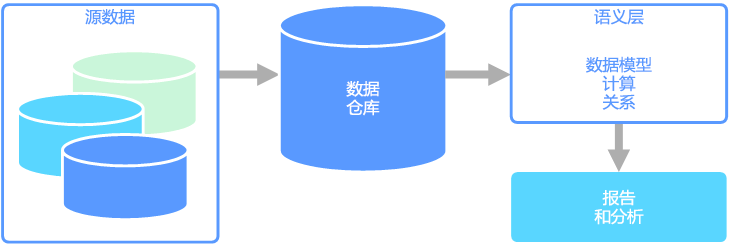

# 语义建模

语义数据模型是一个概念模型，描述了它包含的数据元素的含义。 各个组织经常使用其自己的术语来表示事物，有时使用同义词，甚至同一术语具有不同的含义。 例如，库存数据库可能使用资产 ID 和序列号来跟踪设备部件，但销售数据库可能将序列号称为资产 ID。 如果没有对关系进行描述的模型，则没有简单的方法来将这些值关联起来。 

语义建模基于数据库架构提供了一定级别的抽象，因此，用户不需要知道基础数据结构。 这使得最终用户可以更容易地查询数据，不需要基于基础架构执行聚合和联接。 此外，通常会将列重命名为对用户更友好的名称，使数据的上下文和含义更加明确。

语义建模主要用于高频读取应用场景中，例如分析和商业智能 (OLAP)，与之相对的是高频写入事务数据处理 (OLTP)。 这主要是由典型语义层的性质导致的：

- 设置了聚合行为，以便报告工具可以正确显示它们。
- 定义了业务逻辑和计算。
- 包括了面向时间的计算。
- 数据通常是从多个源集成的。 

传统上，由于这些原因，语义层放置在数据仓库之上。

有两种主要类型的语义模型：

* **表格**。 使用关系建模构造（模型、表、列）。 在内部，元数据是从 OLAP 建模构造（多维数据集、维、度量值）继承的。 代码和脚本使用 OLAP 元数据。
* **多维**。 使用传统的 OLAP 建模构造（多维数据集、维、度量值）。

相关的 Azure 服务：
- [Azure Analysis Services](https://azure.microsoft.com/services/analysis-services/)

## 示例用例

某个组织将数据存储在大型数据库中。 它希望使此数据可供业务用户和客户用来创建其自己的报表以及执行某些分析。 一种选择是向那些用户授予对数据库的直接访问权限。 但是，这样做有几个缺点，包括安全性管理和访问控制。 此外，数据库的设计（包括表和列的名称）对用户而言可能难以理解。 用户将需要知道要查询哪些表，应当如何联接那些表，还需要知道为获得正确结果而必须应用的其他业务逻辑。 用户甚至还需要了解 SQL 之类的查询语言才能入门。 通常，这将导致多个用户在报告相同的指标时出现不同的结果。

另一种选择是将用户需要的所有信息封装到一个语义模型中。 用户可以使用他们选择的报告工具更轻松地查询语义模型。 语义模型提供的数据是从数据仓库中拉取的，这确保了所有用户看到的是单一版本的真实数据。 语义模型还提供了友好的表名和列名、表之间的关系、说明、计算以及行级安全性。

## 语义建模的典型特征

语义建模和分析处理通常具有以下特征：

| 要求 | 说明 |
| --- | --- |
| 架构 | 写入时架构，强制实施|
| 使用事务 | 否 |
| 锁定策略 | 无 |
| 可更新 | 否（通常需要重新计算多维数据集） |
| 可追加 | 否（通常需要重新计算多维数据集） |
| 工作负载 | 高频读取，只读的 |
| 索引 | 多维索引 |
| 基准大小 | 中小型 |
| 模型 | 多维 |
| 数据形状：| 多维数据集或星型/雪花型架构 |
| 查询灵活性 | 高度灵活 |
| 规模： | 大型（数十到数百 GB） |

## 另请参阅

- [数据仓库](../scenarios/data-warehousing.md)
- [联机分析处理 (OLAP)](../scenarios/online-analytical-processing.md)
