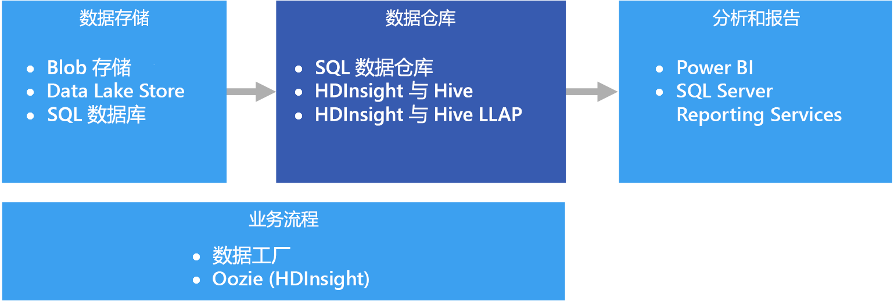

# 数据仓库和数据市场Data warehousing and data marts

数据仓库是一个集中式、组织有序的关系存储库，其中保存了许多或所有业务领域的一个或多个不同源的集成数据。A data warehouse is a central, organizational, relational repository of integrated data from one or more disparate sources, across many or all subject areas. 数据仓库存储当前数据和历史数据，可用于通过不同的方式报告和分析数据。Data warehouses store current and historical data and are used for reporting and analysis of the data in different ways.

若要将数据移到数据仓库，需定期从包含重要业务信息的各种源提取数据。To move data into a data warehouse, it is extracted on a periodic basis from various sources that contain important business information. 移动数据时，可以格式化、清理、验证、汇总和重新组织数据。As the data is moved, it can be formatted, cleaned, validated, summarized, and reorganized. 或者，可以使用仓库中提供的聚合视图存储最低详细程度的数据用于报告。Alternately, the data can be stored in the lowest level of detail, with aggregated views provided in the warehouse for reporting. 在任一情况下，数据仓库都是通过商业智能 (BI) 工具进行报告、分析和做出重要业务决策所用的数据的永久存储空间。In either case, the data warehouse becomes a permanent storage space for data used for reporting, analysis, and forming important business decisions using business intelligence (BI) tools.

## 数据市场和操作数据存储Data marts and operational data stores

大规模管理数据会很复杂，使用单个数据仓库呈现整个企业的所有数据的做法越来越不常见。Managing data at scale is complex, and it is becoming less common to have a single data warehouse that represents all data across the entire enterprise. 相反，组织往往会创建称作“数据市场”的更有针对性的小型数据仓库来公开所需的数据，以进行分析。Instead, organizations create smaller, more focused data warehouses, called *data marts*, that expose the desired data for analytics purposes. 业务流程会将操作数据存储中维护的数据填充到数据市场。An orchestration process populates the data marts from data maintained in an operational data store. 操作数据存储充当源事务系统与数据市场之间的中介。The operational data store acts as an intermediary between the source transactional system and the data mart. 操作数据存储管理的数据是源事务系统中数据的清理版本，通常是数据仓库或数据市场维护的历史数据子集。Data managed by the operational data store is a cleaned version of the data present in the source transactional system, and is typically a subset of the historical data that is maintained by the data warehouse or data mart. 

## 何时使用此解决方案When to use this solution

需要将大量数据从操作型系统转换为易于理解、最新且精确的格式时，请选择数据仓库。Choose a data warehouse when you need to turn massive amounts of data from operational systems into a format that is easy to understand, current, and accurate. 数据仓库不需要遵循可在操作/OLTP 数据库中使用的相同简洁数据结构。Data warehouses do not need to follow the same terse data structure you may be using in your operational/OLTP databases. 可以使用企业用户和分析师能够理解的列名，重构架构来简化数据关系，并将多个表合并成一个表。You can use column names that make sense to business users and analysts, restructure the schema to simplify data relationships, and consolidate several tables into one. 这些步骤有助于引导用户创建即席报表，或者在 BI 系统中创建报表和分析数据，而无需求助于数据库管理员 (DBA) 或数据开发人员。These steps help guide users who need to create ad hoc reports, or create reports and analyze the data in BI systems, without the help of a database administrator (DBA) or data developer.

出于性能原因需要将历史数据与源事务系统分开时，请考虑使用数据仓库。Consider using a data warehouse when you need to keep historical data separate from the source transaction systems for performance reasons. 数据仓库提供通用格式、通用键、通用数据模型和通用访问方法的集成使用位置，使用它可以从多个位置轻松访问历史数据。Data warehouses make it easy to access historical data from multiple locations, by providing a centralized location using common formats, common keys, common data models, and common access methods.

数据仓库已针对读取访问进行优化，与针对源事务系统运行报告相比，数据仓库可以更快地生成报告。Data warehouses are optimized for read access, resulting in faster report generation compared to running reports against the source transaction system. 此外，数据仓库提供以下优势：In addition, data warehouses provide the following benefits:

* 可以从用作单一事实源的数据仓库存储和访问多个源的所有历史数据。All historical data from multiple sources can be stored and accessed from a data warehouse as the single source of truth.
* 将数据导入数据仓库时，可以通过清理数据，提供更准确的数据以及一致的代码和说明来改善数据质量。You can improve data quality by cleaning up data as it is imported into the data warehouse, providing more accurate data as well as providing consistent codes and descriptions.
* 在查询处理周期，报告工具不会与事务源系统争用资源。Reporting tools do not compete with the transactional source systems for query processing cycles. 数据仓库可让事务系统专注于处理写入操作，同时，数据仓库可满足大多数读取请求。A data warehouse allows the transactional system to focus predominantly on handling writes, while the data warehouse satisfies the majority of read requests.
* 数据仓库可以帮助整合不同软件中的数据。A data warehouse can help consolidate data from different software.
* 借助数据挖掘工具，可以针对仓库中存储的数据，使用自动化方法发现隐藏的模式。Data mining tools can help you find hidden patterns using automatic methodologies against data stored in your warehouse.
* 使用数据仓库可以更轻松地为授权用户提供安全访问，同时限制其他人的访问。Data warehouses make it easier to provide secure access to authorized users, while restricting access to others. 无需授予业务用户对源数据的访问权限，从而消除了一个或多个生产事务系统中潜在的攻击途径。There is no need to grant business users access to the source data, thereby removing a potential attack vector against one or more production transaction systems.
* 使用数据仓库可以更轻松地基于数据创建商业智能解决方案，例如 [OLAP 多维数据集](online-analytical-processing.md)。Data warehouses make it easier to create business intelligence solutions on top of the data, such as [OLAP cubes](online-analytical-processing.md).

## 挑战Challenges

根据业务需求正确配置数据仓库时可能存在以下一些难题：Properly configuring a data warehouse to fit the needs of your business can bring some of the following challenges:

* 提交正确为业务概念建模所需的时间。Committing the time required to properly model your business concepts. 这是一个重要步骤，因为数据仓库由信息驱动，而概念映射项目的余下部分。This is an important step, as data warehouses are information driven, where concept mapping drives the rest of the project. 这涉及到标准化业务相关的术语和常见格式（例如货币和日期），以及通过业务用户可以理解的、但仍可确保数据聚合和关系准确性的方式来重构架构。This involves standardizing business-related terms and common formats (such as currency and dates), and restructuring the schema in a way that makes sense to business users but still ensures accuracy of data aggregates and relationships.
* 规划和设置数据业务流程。Planning and setting up your data orchestration. 考虑因素包括如何将数据从源事务系统复制到数据仓库，以及何时从操作数据存储移出历史数据，并将其移入仓库。Consideration include how to copy data from the source transactional system to the data warehouse, and when to move historical data out of your operational data stores and into the warehouse.
* 将数据导入仓库时，通过清理数据来保持或改善数据质量。Maintaining or improving data quality by cleaning the data as it is imported into the warehouse.

## Azure 中的数据仓库Data warehousing in Azure

在 Azure 中，你可能维护了一个或多个数据源，不管是客户交易的数据，还是各部门使用的各种业务应用程序中的数据。In Azure, you may have one or more sources of data, whether from customer transactions, or from various business applications used by various departments. 此数据通常存储在一个或多个 [OLTP](online-transaction-processing.md) 数据库中。This data is traditionally stored in one or more [OLTP](online-transaction-processing.md) databases. 可以在网络共享、Azure 存储 Blob 或 Data Lake 等其他存储媒体中保存这些数据。The data could be persisted in other storage mediums such as network shares, Azure Storage Blobs, or a data lake. 数据仓库本身或者 Azure SQL 数据库等关系数据库也可以存储数据。The data could also be stored by the data warehouse itself or in a relational database such as Azure SQL Database. 分析数据存储层的用途是满足分析和报告工具针对数据仓库或数据市场发出的查询。The purpose of the analytical data store layer is to satisfy queries issued by analytics and reporting tools against the data warehouse or data mart. 在 Azure 中，可以使用 Azure SQL 数据仓库，或者结合使用 Azure HDInsight 和 Hive 或交互式查询来实现此分析存储功能。In Azure, this analytical store capability can be met with Azure SQL Data Warehouse, or with Azure HDInsight using Hive or Interactive Query. 此外，需要使用 Azure 数据工厂或 Oozie on Azure HDInsight 执行某种程度的协调，定期将数据从数据存储移动或复制到数据仓库。In addition, you will need some level of orchestration to periodically move or copy data from data storage to the data warehouse, which can be done using Azure Data Factory or Oozie on Azure HDInsight.

可以根据需要，使用多个选项在 Azure 中实施数据仓库。There are several options for implementing a data warehouse in Azure, depending on your needs. 以下列表划分为两个类别：[对称多处理](https://en.wikipedia.org/wiki/Symmetric_multiprocessing) (SMP) 和[大规模并行处理](https://en.wikipedia.org/wiki/Massively_parallel) (MPP)。The following lists are broken into two categories, [symmetric multiprocessing](https://en.wikipedia.org/wiki/Symmetric_multiprocessing) (SMP) and [massively parallel processing](https://en.wikipedia.org/wiki/Massively_parallel) (MPP). 

SMP：SMP:

- [Azure SQL 数据库Azure SQL Database](/azure/sql-database/)
- [虚拟机中的 SQL ServerSQL Server in a virtual machine](/sql/sql-server/sql-server-technical-documentation)

MPP：MPP:

- [Azure 数据仓库Azure Data Warehouse](/azure/sql-data-warehouse/sql-data-warehouse-overview-what-is)
- [HDInsight 上的 Apache HiveApache Hive on HDInsight](/azure/hdinsight/hadoop/hdinsight-use-hive)
- [HDInsight 上的交互式查询 (Hive LLAP)Interactive Query (Hive LLAP) on HDInsight](/azure/hdinsight/interactive-query/apache-interactive-query-get-started)

经验法规是，基于 SMP 的仓库最适合中小型数据集（最大 4-100 TB），而 MPP 通常适合大数据。As a general rule, SMP-based warehouses are best suited for small to medium data sets (up to 4-100 TB), while MPP is often used for big data. 小、中、大数据的界限在一定程度上根据组织的定义和支持基础结构而定。The delineation between small/medium and big data partly has to do with your organization's definition and supporting infrastructure. （请参阅[选择 OLTP 数据存储](online-transaction-processing.md#scalability-capabilities)。）(See [Choosing an OLTP data store](online-transaction-processing.md#scalability-capabilities).) 

除了数据大小以外，工作负荷模式的类型也是一个很大的决定因素。Beyond data sizes, the type of workload pattern is likely to be a greater determining factor. 例如，使用 SMP 解决方案运行复杂的查询可能速度很慢，而要改用 MPP 解决方案。For example, complex queries may be too slow for an SMP solution, and require an MPP solution instead. 基于 MPP 系统在处理小型数据时可能会降低性能，因为作业在节点之间分配和合并。MPP-based systems are likely to impose a performance penalty with small data sizes, due to the way jobs are distributed and consolidated across nodes. 如果数据大小已超过 1 TB 并且预期会不断增长，可考虑选择 MPP 解决方案。If your data sizes already exceed 1 TB and are expected to continually grow, consider selecting an MPP solution. 但是，如果数据大小小于 1 TB，但工作负荷超过了 SMP 解决方案的可用资源，则 MPP 也可能是最佳选择。However, if your data sizes are less than this, but your workloads are exceeding the available resources of your SMP solution, then MPP may be your best option as well.

由数据仓库访问或存储的数据可能来自众多的数据源，包括 [Azure Data Lake Store](/azure/data-lake-store/) 等数据湖。The data accessed or stored by your data warehouse could come from a number of data sources, including a data lake, such as [Azure Data Lake Store](/azure/data-lake-store/). 请观看视频课程 [Azure Data Lake and Azure Data Warehouse: Applying Modern Practices to Your App](https://azure.microsoft.com/resources/videos/build-2016-azure-data-lake-and-azure-data-warehouse-applying-modern-practices-to-your-app/)（Azure Data Lake 和 Azure 数据仓库：将新式做法运用到应用中），其中比较了可以利用 Azure Data Lake 的各种 MPP 服务的不同优势。For a video session that compares the different strengths of MPP services that can use Azure Data Lake, see [Azure Data Lake and Azure Data Warehouse: Applying Modern Practices to Your App](https://azure.microsoft.com/resources/videos/build-2016-azure-data-lake-and-azure-data-warehouse-applying-modern-practices-to-your-app/).

SMP 系统的特征是提供共享所有资源（CPU/内存/磁盘）的单个关系数据库管理系统实例。SMP systems are characterized by a single instance of a relational database management system sharing all resources (CPU/Memory/Disk). 可以纵向扩展 SMP 系统。You can scale up an SMP system. 对于 VM 上运行的 SQL Server，可以纵向扩展 VM 大小。For SQL Server running on a VM, you can scale up the VM size. 对于 Azure SQL 数据库，可以通过选择不同的服务层来纵向扩展。For Azure SQL Database, you can scale up by selecting a different service tier. 

可以通过添加更多计算节点（它们具有自身的 CPU、内存和 I/O 子系统）来横向扩展 MPP 系统。MPP systems can be scaled out by adding more compute nodes (which have their own CPU, memory and I/O subsystems). 服务器的纵向扩展存在物理限制，从这一点看，根据工作负荷，横向扩展更有利。There are physical limitations to scaling up a server, at which point scaling out is more desirable, depending on the workload. 但是，MPP 解决方案需要不同的技能组合，因为数据的查询、建模和分区存在差异，此外，并行处理存在一些独特的考虑因素。However, MPP solutions require a different skillset, due to variances in querying, modeling, partitioning of data, and other factors unique to parallel processing. 

在决定要使用哪个 SMP 解决方案时，请参阅 [Azure SQL 数据库和 Azure VM 中的 SQL Server 详述](/azure/sql-database/sql-database-paas-vs-sql-server-iaas#a-closer-look-at-azure-sql-database-and-sql-server-on-azure-vms)。When deciding which SMP solution to use, see [A closer look at Azure SQL Database and SQL Server on Azure VMs](/azure/sql-database/sql-database-paas-vs-sql-server-iaas#a-closer-look-at-azure-sql-database-and-sql-server-on-azure-vms). 

Azure SQL 数据仓库还可用于小型和中型数据集，其中的工作负荷是计算和内存密集型的。Azure SQL Data Warehouse can also be used for small and medium datasets, where the workload is compute and memory intensive. 阅读有关 SQL 数据仓库模式和常见方案的详细信息：Read more about SQL Data Warehouse patterns and common scenarios:

- [SQL 数据仓库模式和对立模式SQL Data Warehouse Patterns and Anti-Patterns](https://blogs.msdn.microsoft.com/sqlcat/2017/09/05/azure-sql-data-warehouse-workload-patterns-and-anti-patterns/)
- [Azure SQL 数据仓库加载模式和策略SQL Data Warehouse Loading Patterns and Strategies](https://blogs.msdn.microsoft.com/sqlcat/2017/05/17/azure-sql-data-warehouse-loading-patterns-and-strategies/)
- [将数据迁移到 Azure SQL 数据仓库Migrating Data to Azure SQL Data Warehouse](https://blogs.msdn.microsoft.com/sqlcat/2016/08/18/migrating-data-to-azure-sql-data-warehouse-in-practice/)
- [使用 Azure SQL 数据仓库的常见 ISV 应用程序模式Common ISV Application Patterns Using Azure SQL Data Warehouse](https://blogs.msdn.microsoft.com/sqlcat/2017/09/05/common-isv-application-patterns-using-azure-sql-data-warehouse/)

## 关键选择条件Key selection criteria

若要缩小选择范围，请先回答以下问题：To narrow the choices, start by answering these questions:

- 你希望使用托管服务还是由你管理自己的服务器？Do you want a managed service rather than managing your own servers?

- 是否要处理极大型数据集，或非常复杂且长时间运行的查询？Are you working with extremely large data sets or highly complex, long-running queries? 如果是，请考虑 MPP 选项。If yes, consider an MPP option. 

- 对于大型数据集，数据源是结构化还是非结构化的？For a large data set, is the data source structured or unstructured? 非结构化数据可能需要在 HDInsight 上的 Spark、Azure Databricks、HDInsight 上的 Hive LLAP 或 Azure Data Lake Analytics 等大数据环境中处理。Unstructured data may need to be processed in a big data environment such as Spark on HDInsight, Azure Databricks, Hive LLAP on HDInsight, or Azure Data Lake Analytics. 所有这些工具可以充当 ELT（提取、加载、转换）和 ETL（提取、转换、加载）引擎。All of these can serve as ELT (Extract, Load, Transform) and ETL (Extract, Transform, Load) engines. 它们可将处理的数据输出为结构化数据，以便更方便地载入 SQL 数据仓库或其他选项之一。They can output the processed data into structured data, making it easier to load into SQL Data Warehouse or one of the other options. 对于结构化数据，SQL 数据仓库针对需要超高性能的计算密集型工作负荷提供一个称为“计算优化”的性能层。For structured data, SQL Data Warehouse has a performance tier called Optimized for Compute, for compute-intensive workloads requiring ultra-high performance.

- 是否需要将历史数据与当前的操作数据分开？Do you want to separate your historical data from your current, operational data? 如果是，请选择需要[业务流程](../technology-choices/pipeline-orchestration-data-movement.md)的选项。If so, select one of the options where [orchestration](../technology-choices/pipeline-orchestration-data-movement.md) is required. 这些独立的仓库已针对重度读取访问进行优化，最适合用作单独的历史数据存储。These are standalone warehouses optimized for heavy read access, and are best suited as a separate historical data store.

- 除了 OLTP 数据存储外，是否需要集成来自其他多个源的数据？Do you need to integrate data from several sources, beyond your OLTP data store? 如果是，请考虑可以轻松集成多个数据源的选项。If so, consider options that easily integrate multiple data sources. 

- 是否有多租户要求？Do you have a multi-tenancy requirement? 如果是，SQL 数据仓库不能很好地满足此要求。If so, SQL Data Warehouse is not ideal for this requirement. 有关详细信息，请参阅 [SQL 数据仓库模式和对立模式](https://blogs.msdn.microsoft.com/sqlcat/2017/09/05/azure-sql-data-warehouse-workload-patterns-and-anti-patterns/)。For more information, see [SQL Data Warehouse Patterns and Anti-Patterns](https://blogs.msdn.microsoft.com/sqlcat/2017/09/05/azure-sql-data-warehouse-workload-patterns-and-anti-patterns/).

- 是否偏向于关系数据存储？Do you prefer a relational data store? 如果是，请将选项缩小为提供关系数据存储的产品，但另请注意，可以根据需要使用 PolyBase 等工具来查询非关系数据存储。If so, narrow your options to those with a relational data store, but also note that you can use a tool like PolyBase to query non-relational data stores if needed. 但是，如果决定使用 PolyBase，请针对工作负荷的非结构化数据集运行性能测试。If you decide to use PolyBase, however, run performance tests against your unstructured data sets for your workload.

- 是否有实时报告要求？Do you have real-time reporting requirements? 如果在执行大量的单一实例插入时需要快速的查询响应时间，请将选项缩小为可以支持实时报告的产品。If you require rapid query response times on high volumes of singleton inserts, narrow your options to those that can support real-time reporting.

- 是否需要支持大量并发用户和连接？Do you need to support a large number of concurrent users and connections? 能否支持大量并发用户/连接取决于多个因素。The ability to support a number of concurrent users/connections depends on several factors. 

    - 对于 Azure SQL 数据库，请根据服务层参阅[规定的资源限制](/azure/sql-database/sql-database-resource-limits)。For Azure SQL Database, refer to the [documented resource limits](/azure/sql-database/sql-database-resource-limits) based on your service tier. 
    
    - SQL Server 最多允许 32,767 个用户连接。SQL Server allows a maximum of 32,767 user connections. 在 VM 上运行时，性能取决于 VM 大小和其他因素。When running on a VM, performance will depend on the VM size and other factors. 
    
    - SQL 数据仓库对并发查询数和并发连接数施加了限制。SQL Data Warehouse has limits on concurrent queries and concurrent connections. 有关详细信息，请参阅 [SQL 数据仓库中的并发性和工作负荷管理](/azure/sql-data-warehouse/sql-data-warehouse-develop-concurrency)。For more information, see [Concurrency and workload management in SQL Data Warehouse](/azure/sql-data-warehouse/sql-data-warehouse-develop-concurrency). 考虑使用互补性的服务，例如 [Azure Analysis Services](/azure/analysis-services/analysis-services-overview) 来克服 SQL 数据仓库的限制。Consider using complementary services, such as [Azure Analysis Services](/azure/analysis-services/analysis-services-overview), to overcome limits in SQL Data Warehouse.

- 使用的是哪种类型的工作负荷？What sort of workload do you have? 一般情况下，基于 MPP 仓库解决方案最适合用于面向批处理的分析工作负荷。In general, MPP-based warehouse solutions are best suited for analytical, batch-oriented workloads. 如果工作负荷是事务性的，并且附带了许多小规模读/写操作或多个逐行操作，请考虑使用某个 SMP 选项。If your workloads are transactional by nature, with many small read/write operations or multiple row-by-row operations, consider using one of the SMP options. 但如果在 HDInsight 群集中使用流处理（例如 Spark 流），或者在 Hive 表中存储数据，则不适用此原则。One exception to this guideline is when using stream processing on an HDInsight cluster, such as Spark Streaming, and storing the data within a Hive table.

## 功能矩阵Capability Matrix

以下各表汇总了功能上的关键差异。The following tables summarize the key differences in capabilities.

### 常规功能General capabilities

| | Azure SQL 数据库Azure SQL Database | SQL Server (VM)SQL Server (VM) | SQL 数据仓库SQL Data Warehouse | HDInsight 上的 Apache HiveApache Hive on HDInsight | HDInsight 上的 Hive LLAPHive LLAP on HDInsight |
| --- | --- | --- | --- | --- | --- | -- |
| 是托管服务Is managed service | 是Yes | 否No | 是Yes | 是 1Yes 1 | 是 1Yes 1 |
| 需要数据业务流程（保存数据/历史数据的副本）Requires data orchestration (holds copy of data/historical data) | 否No | 否No | 是Yes | 是Yes | 是Yes |
| 轻松集成多个数据源Easily integrate multiple data sources | 否No | 否No | 是Yes | 是Yes | 是Yes |
| 支持暂停计算Supports pausing compute | 否No | 否No | 是Yes | 否 2No 2 | 否 2No 2 |
| 关系数据存储Relational data store | 是Yes | 是Yes |  是Yes | 否No | 否No |
| 实时报告Real-time reporting | 是Yes | 是Yes | 否No | 否No | 是Yes |
| 灵活的备份还原点Flexible backup restore points | 是Yes | 是Yes | 否 3No 3 | 是 4Yes 4 | 是 4Yes 4 |
| SMP/MPPSMP/MPP | SMPSMP | SMPSMP | MPPMPP | MPPMPP | MPPMPP |

[1] 手动配置和缩放。[1] Manual configuration and scaling.

[2] 不需 HDInsight 群集时可将其删除，然后重新创建。[2] HDInsight clusters can be deleted when not needed, and then re-created. 将外部数据存储附加到群集，以便在删除群集后可以保留数据。Attach an external data store to your cluster so your data is retained when you delete your cluster. 可以通过创建按需 HDInsight 群集来处理工作负荷，使用 Azure 数据工厂将群集的生命周期自动化，然后在处理完成后删除该群集。You can use Azure Data Factory to automate your cluster's lifecycle by creating an on-demand HDInsight cluster to process your workload, then delete it once the processing is complete.

[3] 使用 SQL 数据仓库时，可将数据库还原到过去 7 天的任何可用还原点。[3] With SQL Data Warehouse, you can restore a database to any available restore point within the last seven days. 快照 4 到 8 小时启动一次，可供使用 7 天。Snapshots start every four to eight hours and are available for seven days. 快照超过 7 天将过期，其还原点不再可用。When a snapshot is older than seven days, it expires and its restore point is no longer available.

[4] 考虑使用可按需备份和还原的[外部 Hive 元存储](/azure/hdinsight/hdinsight-hadoop-provision-linux-clusters#use-hiveoozie-metastore)。[4] Consider using an [external Hive metastore](/azure/hdinsight/hdinsight-hadoop-provision-linux-clusters#use-hiveoozie-metastore) that can be backed up and restored as needed. 可对数据或第三方 HDInsight 备份和还原解决方案使用适用于 Blob 存储或 Data Lake Store 的标准备份和还原选项，例如，可以使用 [Imanis Data](https://azure.microsoft.com/blog/imanis-data-cloud-migration-backup-for-your-big-data-applications-on-azure-hdinsight/) 来提高灵活性和易用性。Standard backup and restore options that apply to Blob Storage or Data Lake Store can be used for the data, or third party HDInsight backup and restore solutions, such as [Imanis Data](https://azure.microsoft.com/blog/imanis-data-cloud-migration-backup-for-your-big-data-applications-on-azure-hdinsight/) can be used for greater flexibility and ease of use.

### 可伸缩性功能Scalability capabilities

| | Azure SQL 数据库Azure SQL Database | SQL Server (VM)SQL Server (VM) |  SQL 数据仓库SQL Data Warehouse | HDInsight 上的 Apache HiveApache Hive on HDInsight | HDInsight 上的 Hive LLAPHive LLAP on HDInsight |
| --- | --- | --- | --- | --- | --- | -- |
| 用于实现高可用性的的冗余区域服务器Redundant regional servers for high availability  | 是Yes | 是Yes | 是Yes | 否No | 否No |
| 支持查询横向扩展（分布式查询）Supports query scale out (distributed queries)  | 否No | 否No | 是Yes | 是Yes | 是Yes |
| 动态可伸缩性（纵向扩展）Dynamic scalability (scale up)  | 是Yes | 否No | 是 1Yes 1 | 否No | 否No |
| 支持数据的内存中缓存Supports in-memory caching of data | 是Yes |  是Yes | 否No | 是Yes | 是Yes |

[1] SQL 数据仓库允许通过调整数据仓库单位 (DWU) 数目来纵向扩展和缩减。[1] SQL Data Warehouse allows you to scale up or doanw by adjusting the number of data warehouse units (DWUs). 请参阅[管理 Azure SQL 数据仓库中的计算能力](/azure/sql-data-warehouse/sql-data-warehouse-manage-compute-overview)。See [Manage compute power in Azure SQL Data Warehouse](/azure/sql-data-warehouse/sql-data-warehouse-manage-compute-overview).

### 安全功能Security capabilities

|                         |           Azure SQL 数据库Azure SQL Database            |  虚拟机中的 SQL ServerSQL Server in a virtual machine  | SQL 数据仓库SQL Data Warehouse |   HDInsight 上的 Apache HiveApache Hive on HDInsight    |    HDInsight 上的 Hive LLAPHive LLAP on HDInsight     |
|-------------------------|-----------------------------------------|-----------------------------------|--------------------|-------------------------------|-------------------------------|
|     身份验证Authentication      | SQL / Azure Active Directory (Azure AD)SQL / Azure Active Directory (Azure AD) | SQL / Azure AD / Active DirectorySQL / Azure AD / Active Directory |   SQL / Azure ADSQL / Azure AD   | 本地 / Azure AD 1local / Azure AD 1 | 本地 / Azure AD 1local / Azure AD 1 |
|      授权Authorization      |                   是Yes                   |                是Yes                |        是Yes         |              是Yes              |       是 1Yes 1        |
|        审核Auditing         |                   是Yes                   |                是Yes                |        是Yes         |              是Yes              |       是 1Yes 1        |
| 静态数据加密Data encryption at rest |            是 2Yes 2             |         是 2Yes 2          |  是 2Yes 2  |       是 2Yes 2        |       是 1Yes 1        |
|   行级别安全性Row-level security    |                   是Yes                   |                是Yes                |        是Yes         |              否No               |       是 1Yes 1        |
|   支持防火墙Supports firewalls    |                   是Yes                   |                是Yes                |        是Yes         |              是Yes              |       是 3Yes 3        |
|  动态数据掩码Dynamic data masking   |                   是Yes                   |                是Yes                |        是Yes         |              否No               |       是 1Yes 1        |

[1] 需要使用[已加入域的 HDInsight 群集](/azure/hdinsight/domain-joined/apache-domain-joined-introduction)。[1] Requires using a [domain-joined HDInsight cluster](/azure/hdinsight/domain-joined/apache-domain-joined-introduction).

[2] 需要使用透明数据加密 (TDE) 来加密和解密静止数据。[2] Requires using Transparent Data Encryption (TDE) to encrypt and decrypt your data at rest.

[3] [在 Azure 虚拟网络中使用时](/azure/hdinsight/hdinsight-extend-hadoop-virtual-network)受支持。[3] Supported when [used within an Azure Virtual Network](/azure/hdinsight/hdinsight-extend-hadoop-virtual-network).

阅读有关保护数据仓库的详细信息：Read more about securing your data warehouse:

* [保护 SQL 数据库Securing your SQL Database](/azure/sql-database/sql-database-security-overview#connection-security)
* [保护 SQL 数据仓库中的数据库Secure a database in SQL Data Warehouse](/azure/sql-data-warehouse/sql-data-warehouse-overview-manage-security)
* [使用 Azure 虚拟网络扩展 Azure HDInsightExtend Azure HDInsight using an Azure Virtual Network](/azure/hdinsight/hdinsight-extend-hadoop-virtual-network)
* [已加入域的 HDInsight 群集的企业级 Hadoop 安全性Enterprise-level Hadoop security with domain-joined HDInsight clusters](/azure/hdinsight/domain-joined/apache-domain-joined-introduction)

