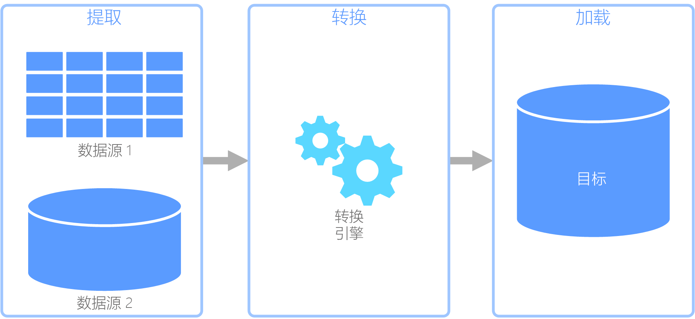

# 提取、转换和加载 (ETL)

组织面临的常见难题是如何从多个源收集多种格式的数据，并将其转移到一个或多个数据存储。 目标的数据存储类型可能与源不同，并且格式通常不同，或者在将数据载入其最终目标之前，需要对其进行整理或清理。

过去几年以来，行业中已开发了多种工具、服务和过程来解决这些难题。 不管采用哪种过程，往往都需要协调工作，并在数据管道中应用某种级别的数据转换。 以下部分重点介绍执行这些任务的常用方法。

## 提取、转换和加载 (ETL)

提取、转换和加载 (ETL) 是一个数据管道，用于从各种源收集数据、根据业务规则转换数据，然后将其载入目标数据存储。 ETL 中的转换工作在专用引擎中发生，通常涉及到使用临时表来暂时保存正在转换、并最终要载入其目标的数据。

数据转换通常涉及到各种操作，例如筛选、排序、聚合、联接数据、清理数据、删除重复数据和验证数据。

通常，三个 ETL 阶段是同时运行的，以节省时间。 例如，在提取数据时，转换过程可以处理已收到的数据并做好加载数据的准备，加载过程可以开始处理已准备好的数据，而无需等待整个提取过程完成。

相关的 Azure 服务：
- [Azure 数据工厂 v2](https://azure.microsoft.com/services/data-factory/)

其他工具：
- [SQL Server Integration Services (SSIS)](/sql/integration-services/sql-server-integration-services)

## 提取、加载和转换 (ELT)

提取、加载和转换 (ELT) 与 ETL 的唯一不同之处在于转换的发生位置。 在 ELT 管道中，转换发生在目标数据存储中。 在不使用单独转换引擎的情况下，将使用目标数据存储的处理功能来转换数据。 这就从管道中删除了转换引擎，从而简化了体系结构。 此方法的另一个好处是，缩放目标数据存储也会缩放 ELT 管道性能。 但是，仅当目标系统足够强大，可以有效转换数据时，ELT 才能正常工作。

ELT 的典型用例属于大数据领域。 例如，首先可将所有源数据提取到 Hadoop 分布式文件系统 (HDFS) 或 Azure Data Lake Store 等可缩放存储中的平面文件。 然后，可以使用 Spark、Hive 或 PolyBase 等技术查询源数据。 ELT 的关键之处在于，用于执行转换的数据存储是最终要在其中使用数据的同一数据存储。 此数据存储直接从可缩放的存储读取，而不是将数据载入其自身的专有存储。 此方法跳过了 ETL 中存在的数据复制步骤，针对大型数据集运行时可能很耗时。

在实践中，目标数据存储是使用 Hadoop 群集（使用 Hive 或 Spark）的[数据仓库](./data-warehousing.md)，或 SQL 数据仓库。 一般情况下，架构在查询时叠加在平面文件数据上，并存储为表，因此，可以像查询数据存储中的其他任何数据一样查询这些数据。 这些表称为外部表，因为数据不在数据存储本身管理的存储中，而是在某个外部可缩放存储中。 

数据存储只管理数据的架构，并在读取时应用架构。 例如，使用 Hive 的 Hadoop 群集会描述一个 Hive 表，其中的数据源实际上是 HDFS 中一组文件的路径。 在 SQL 数据仓库中，PolyBase 可以实现相同的结果 &mdash; 针对数据库本身外部存储的数据创建一个表。 加载源数据后，可以使用数据存储的功能处理外部表中的数据。 在大数据方案中，这意味着数据存储必须能够执行大规模并行处理 (MPP)，将数据分解成较小区块，并跨多台计算机并行分配区块处理负载。

ELT 管道的最后一个阶段通常是将源数据转换为最终格式，对于需要支持的查询类型，此格式更为有效。 例如，可将数据分区。 此外，ELT 可以使用 Parquet 等优化的存储格式，以纵栏表形式存储面向行的数据，并提供优化的索引。 

相关的 Azure 服务：

- [Azure SQL 数据仓库](/azure/sql-data-warehouse/sql-data-warehouse-overview-what-is)
- [基于 Hive 的 HDInsight](/azure/hdinsight/hadoop/hdinsight-use-hive)
- [Azure 数据工厂 v2](https://azure.microsoft.com/services/data-factory/)
- [Oozie on HDInsight](/azure/hdinsight/hdinsight-use-oozie-linux-mac)

其他工具：

- [SQL Server Integration Services (SSIS)](/sql/integration-services/sql-server-integration-services)

## 数据流和控制流

在数据管道的上下文中，控制流确保有序处理一组任务。 若要实施这些任务的正确处理顺序，可以使用优先约束。 可将这些约束视为工作流关系图中的连接器，如下图所示。 每个任务都有结果，例如成功、失败或完成。 只有在前面的任务已完成并生成了结果时，后面的任务才会启动处理。

控制流以任务的形式执行数据流。 在数据流任务中，会从源提取数据、转换数据，或将数据载入数据存储。 一个数据流任务的输出可以是下一个数据流任务的输入，数据流可以并行运行。 与控制流不同，无法在数据流中的任务之间添加约束。 但是，可以添加数据查看器来观察每个任务处理的数据。

在上图中，控制流包含多个任务，其中一个任务是数据流任务。 有一个任务嵌套在容器中。 可以使用容器来提供任务结构和工作单元。 一个例子是使用容器来重复集合中的元素，例如文件夹中的文件，或数据库语句。

相关的 Azure 服务：
- [Azure 数据工厂 v2](https://azure.microsoft.com/services/data-factory/)

其他工具：
- [SQL Server Integration Services (SSIS)](/sql/integration-services/sql-server-integration-services)

## 技术选择

- [联机事务处理 (OLTP) 数据存储](./online-transaction-processing.md#oltp-in-azure)
- [联机分析处理 (OLAP) 数据存储](./online-analytical-processing.md#olap-in-azure)
- [数据仓库](./data-warehousing.md)
- [管道业务流程](../technology-choices/pipeline-orchestration-data-movement.md)
