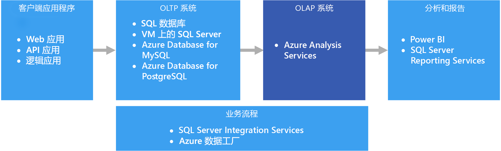
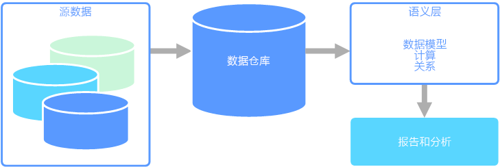

# 联机分析处理 (OLAP)Online analytical processing (OLAP)

联机分析处理 (OLAP) 是一种用于组织大型业务数据库的技术，并且支持复杂分析。Online analytical processing (OLAP) is a technology that organizes large business databases and supports complex analysis. 它可用来执行复杂的分析查询，且不会对事务系统产生负面影响。It can be used to perform complex analytical queries without negatively affecting transactional systems.

企业用来存储其所有事务和记录的数据库称为[联机事务处理 (OLTP)](online-transaction-processing.md) 数据库。The databases that a business uses to store all its transactions and records are called [online transaction processing (OLTP)](online-transaction-processing.md) databases. 这些数据库通常具有一次一个输入的记录。These databases usually have records that are entered one at a time. 它们通常包含对组织有价值的大量信息。Often they contain a great deal of information that is valuable to the organization. 但是，用于 OLTP 的数据库不是为分析而设计的。The databases that are used for OLTP, however, were not designed for analysis. 因此，从这些数据库中检索答案从时间和工作量角度而言成本高昂。Therefore, retrieving answers from these databases is costly in terms of time and effort. OLAP 系统设计用来以高性能方式从数据中提取此商业智能信息。OLAP systems were designed to help extract this business intelligence information from the data in a highly performant way. 这是因为 OLAP 数据库针对高频读取和低频写入进行了优化。This is because OLAP databases are optimized for heavy read, low write workloads.

 

## 语义建模Semantic modeling

语义数据模型是一个概念模型，描述了它包含的数据元素的含义。A semantic data model is a conceptual model that describes the meaning of the data elements it contains. 各个组织经常使用其自己的术语来表示事物，有时使用同义词，甚至同一术语具有不同的含义。Organizations often have their own terms for things, sometimes with synonyms, or even different meanings for the same term. 例如，库存数据库可能使用资产 ID 和序列号来跟踪设备部件，但销售数据库可能将序列号称为资产 ID。For example, an inventory database might track a piece of equipment with an asset ID and a serial number, but a sales database might refer to the serial number as the asset ID. 如果没有对关系进行描述的模型，则没有简单的方法来将这些值关联起来。There is no simple way to relate these values without a model that describes the relationship. 

语义建模基于数据库架构提供了一定级别的抽象，因此，用户不需要知道基础数据结构。Semantic modeling provides a level of abstraction over the database schema, so that users don't need to know the underlying data structures. 这使得最终用户可以更容易地查询数据，不需要基于基础架构执行聚合和联接。This makes it easier for end users to query data without performing aggregates and joins over the underlying schema. 此外，通常会将列重命名为对用户更友好的名称，使数据的上下文和含义更加明确。Also, usually columns are renamed to more user-friendly names, so that the context and meaning of the data are more obvious.

语义建模主要用于高频读取应用场景中，例如分析和商业智能 (OLAP)，与之相对的是高频写入事务数据处理 (OLTP)。Semantic modeling is predominately used for read-heavy scenarios, such as analytics and business intelligence (OLAP), as opposed to more write-heavy transactional data processing (OLTP). 这主要是由典型语义层的性质导致的：This is mostly due to the nature of a typical semantic layer:

- 设置了聚合行为，以便报告工具可以正确显示它们。Aggregation behaviors are set so that reporting tools display them properly.
- 定义了业务逻辑和计算。Business logic and calculations are defined.
- 包括了面向时间的计算。Time-oriented calculations are included.
- 数据通常是从多个源集成的。Data is often integrated from multiple sources. 

传统上，由于这些原因，语义层放置在数据仓库之上。Traditionally, the semantic layer is placed over a data warehouse for these reasons.

有两种主要类型的语义模型：There are two primary types of semantic models:

* **表格**。**Tabular**. 使用关系建模构造（模型、表、列）。Uses relational modeling constructs (model, tables, columns). 在内部，元数据是从 OLAP 建模构造（多维数据集、维、度量值）继承的。Internally, metadata is inherited from OLAP modeling constructs (cubes, dimensions, measures). 代码和脚本使用 OLAP 元数据。Code and script use OLAP metadata.
* **多维**。**Multidimensional**. 使用传统的 OLAP 建模构造（多维数据集、维、度量值）。Uses traditional OLAP modeling constructs (cubes, dimensions, measures).

相关的 Azure 服务：Relevant Azure service:
- [Azure Analysis ServicesAzure Analysis Services](https://azure.microsoft.com/services/analysis-services/)

## 示例用例Example use case

某个组织将数据存储在大型数据库中。An organization has data stored in a large database. 它希望使此数据可供业务用户和客户用来创建其自己的报表以及执行某些分析。It wants to make this data available to business users and customers to create their own reports and do some analysis. 一种选择是向那些用户授予对数据库的直接访问权限。One option is just to give those users direct access to the database. 但是，这样做有几个缺点，包括安全性管理和访问控制。However, there are several drawbacks to doing this, including managing security and controlling access. 此外，数据库的设计（包括表和列的名称）对用户而言可能难以理解。Also, the design of the database, including the names of tables and columns, may be hard for a user to understand. 用户将需要知道要查询哪些表，应当如何联接那些表，还需要知道为获得正确结果而必须应用的其他业务逻辑。Users would need to know which tables to query, how those tables should be joined, and other business logic that must be applied to get the correct results. 用户甚至还需要了解 SQL 之类的查询语言才能入门。Users would also need to know a query language like SQL even to get started. 通常，这将导致多个用户在报告相同的指标时出现不同的结果。Typically this leads to multiple users reporting the same metrics but with different results.

另一种选择是将用户需要的所有信息封装到一个语义模型中。Another option is to encapsulate all of the information that users need into a semantic model. 用户可以使用他们选择的报告工具更轻松地查询语义模型。The semantic model can be more easily queried by users with a reporting tool of their choice. 语义模型提供的数据是从数据仓库中拉取的，这确保了所有用户看到的是单一版本的真实数据。The data provided by the semantic model is pulled from a data warehouse, ensuring that all users see a single version of the truth. 语义模型还提供了友好的表名和列名、表之间的关系、说明、计算以及行级安全性。The semantic model also provides friendly table and column names, relationships between tables, descriptions, calculations, and row-level security.

## 语义建模的典型特征Typical traits of semantic modeling

语义建模和分析处理通常具有以下特征：Semantic modeling and analytical processing tends to have the following traits:

| 要求Requirement | 说明Description |
| --- | --- |
| 架构Schema | 写入时架构，强制实施Schema on write, strongly enforced|
| 使用事务Uses Transactions | 否No |
| 锁定策略Locking Strategy | 无None |
| 可更新Updateable | 否（通常需要重新计算多维数据集）No (typically requires recomputing cube) |
| 可追加Appendable | 否（通常需要重新计算多维数据集）No (typically requires recomputing cube) |
| 工作负载Workload | 高频读取，只读的Heavy reads, read-only |
| 索引Indexing | 多维索引Multidimensional indexing |
| 基准大小Datum size | 中小型Small to medium sized |
| 模型Model | 多维Multidimensional |
| 数据形状：Data shape:| 多维数据集或星型/雪花型架构Cube or star/snowflake schema |
| 查询灵活性Query flexibility | 高度灵活Highly flexible |
| 规模：Scale: | 大型（数十到数百 GB）Large (10s-100s GBs) |

## 何时使用此解决方案When to use this solution

在下列应用场景中，请考虑使用 OLAP：Consider OLAP in the following scenarios:

- 你需要快速执行复杂的分析和临时查询，且不能对 OLTP 系统产生负面影响。You need to execute complex analytical and ad hoc queries rapidly, without negatively affecting your OLTP systems. 
- 你希望为业务用户提供一种简单的方式来基于数据生成报表You want to provide business users with a simple way to generate reports from your data
- 你希望提供大量聚合，这些聚合将使用户能够快速获得一致的结果。You want to provide a number of aggregations that will allow users to get fast, consistent results. 

OLAP 对于针对大量数据应用聚合计算特别有用。OLAP is especially useful for applying aggregate calculations over large amounts of data. OLAP 系统针对高频读取应用场景（例如分析和商业智能）进行了优化。OLAP systems are optimized for read-heavy scenarios, such as analytics and business intelligence. OLAP 允许用户将多维数据分割为切片，可以采用二维方式（例如透视表）查看切片，或者按特定值来筛选数据。OLAP allows users to segment multi-dimensional data into slices that can be viewed in two dimensions (such as a pivot table) or filter the data by specific values. 此过程有时称为对数据进行“切片和切块”，并且无论是否在多个数据源之间对数据进行了分区，都可以执行此过程。This process is sometimes called "slicing and dicing" the data, and can be done regardless of whether the data is partitioned across several data sources. 这可以帮助用户查明趋势、点模式，以及在不需要知道传统数据分析详细信息的情况下探索数据。This helps users to find trends, spot patterns, and explore the data without having to know the details of traditional data analysis.

语义模型可以帮助业务用户抽象关系复杂性，并且更轻松地快速分析数据。Semantic models can help business users abstract relationship complexities and make it easier to analyze data quickly.

## 挑战Challenges

对于 OLAP 系统提供的所有好处，它们也带来了一些挑战：For all the benefits OLAP systems provide, they do produce a few challenges:

- 尽管 OLTP 系统中的数据不断通过从各种源流入的事务进行更新，但是，OLAP 数据存储通常按更长的间隔进行刷新，具体取决于业务需求。Whereas data in OLTP systems is constantly updated through transactions flowing in from various sources, OLAP data stores are typically refreshed at a much slower intervals, depending on business needs. 这意味着 OLAP 系统更适用于战略业务决策，而非适用于立即对更改做出响应。This means OLAP systems are better suited for strategic business decisions, rather than immediate responses to changes. 另外，还需要规划一定级别的数据清理和业务流程来使 OLAP 数据存储保持最新。Also, some level of data cleansing and orchestration needs to be planned to keep the OLAP data stores up-to-date.
- 与 OLTP 系统中使用的传统的规范化关系表不同，OLAP 数据模型通常是多维的。Unlike traditional, normalized, relational tables found in OLTP systems, OLAP data models tend to be multidimensional. 这导致难以或无法直接映射到实体关系或面向对象的模型，在这种模型中，每个属性映射到一个列。This makes it difficult or impossible to directly map to entity-relationship or object-oriented models, where each attribute is mapped to one column. 相反，OLAP 系统通常使用星型或雪花型架构，而非使用传统的规范化。Instead, OLAP systems typically use a star or snowflake schema in place of traditional normalization.

## Azure 中的 OLAPOLAP in Azure

在 Azure 中，OLTP 系统（例如 Azure SQL 数据库）中存放的数据将复制到 OLAP 系统（例如 [Azure Analysis Services](/azure/analysis-services/analysis-services-overview)）。In Azure, data held in OLTP systems such as Azure SQL Database is copied into the OLAP system, such as [Azure Analysis Services](/azure/analysis-services/analysis-services-overview). 数据探索和可视化工具（例如 [Power BI](https://powerbi.microsoft.com)、Excel 和第三方选件）连接到 Analysis Services 服务器，用户可以通过交互性强且视觉效果丰富的方式来了解建模的数据。Data exploration and visualization tools like [Power BI](https://powerbi.microsoft.com), Excel, and third-party options connect to Analysis Services servers and provide users with highly interactive and visually rich insights into the modeled data. 从 OLTP 到 OLAP 的数据流通常是使用 SQL Server Integration Services 安排的，可以使用 [Azure 数据工厂](/azure/data-factory/concepts-integration-runtime)执行这些服务。The flow of data from OLTP data to OLAP is typically orchestrated using SQL Server Integration Services, which can be executed using [Azure Data Factory](/azure/data-factory/concepts-integration-runtime).

在 Azure 中，以下所有数据存储都将满足 OLAP 的核心要求：In Azure, all of the following data stores will meet the core requirements for OLAP:

- [具有列存储索引的 SQL ServerSQL Server with Columnstore indexes](/sql/relational-databases/indexes/get-started-with-columnstore-for-real-time-operational-analytics)
- [Azure Analysis ServicesAzure Analysis Services](/azure/analysis-services/analysis-services-overview)
- [SQL Server Analysis Services (SSAS)SQL Server Analysis Services (SSAS)](/sql/analysis-services/analysis-services)

SQL Server Analysis Services (SSAS) 为商业智能应用程序提供 OLAP 和数据挖掘功能。SQL Server Analysis Services (SSAS) offers OLAP and data mining functionality for business intelligence applications. 可以将 SSAS 安装在本地服务器上，也可以将其安装在 Azure 中的虚拟机内的主机上。You can either install SSAS on local servers, or host within a virtual machine in Azure. Azure Analysis Services 是一项完全托管的服务，提供与 SSAS 相同的主要功能。Azure Analysis Services is a fully managed service that provides the same major features as SSAS. Azure Analysis Services 支持连接到云中的[各种数据源](/azure/analysis-services/analysis-services-datasource)和组织中的本地数据源。Azure Analysis Services supports connecting to [various data sources](/azure/analysis-services/analysis-services-datasource) in the cloud and on-premises in your organization.

聚集列存储索引在 SQL Server 2014 及更高版本中可用，并且最适用于 OLAP 工作负荷。Clustered Columnstore indexes are available in SQL Server 2014 and above, as well as Azure SQL Database, and are ideal for OLAP workloads. 但是，从 SQL Server 2016（包括 Azure SQL 数据库）开始，可以通过使用可更新的非聚集列存储索引来利用混合事务/分析处理 (HTAP)。However, beginning with SQL Server 2016 (including Azure SQL Database), you can take advantage of hybrid transactional/analytics processing (HTAP) through the use of updateable nonclustered columnstore indexes. HTAP 使得你可以在同一平台上执行 OLTP 和 OLAP 处理，这样将不需要存储数据的多个副本，并且不需要具有不同的 OLTP 和 OLAP 系统。HTAP enables you to perform OLTP and OLAP processing on the same platform, which removes the need to store multiple copies of your data, and eliminates the need for distinct OLTP and OLAP systems. 有关详细信息，请参阅 [Get started with Columnstore for real-time operational analytics](/sql/relational-databases/indexes/get-started-with-columnstore-for-real-time-operational-analytics)（用于实时运营分析的列存储入门）。For more information, see [Get started with Columnstore for real-time operational analytics](/sql/relational-databases/indexes/get-started-with-columnstore-for-real-time-operational-analytics).

## 关键选择条件Key selection criteria

若要缩小选择范围，请先回答以下问题：To narrow the choices, start by answering these questions:

- 你希望使用托管服务还是由你管理自己的服务器？Do you want a managed service rather than managing your own servers?

- 是否要求使用 Azure Active Directory (Azure AD) 进行安全的身份验证？Do you require secure authentication using Azure Active Directory (Azure AD)?

- 是否要执行实时分析？Do you want to conduct real-time analytics? 如果是，请将选项范围缩小到支持实时分析的那些选项。If so, narrow your options to those that support real-time analytics. 

    此上下文中的“实时分析”适用于将同时运行运营和分析工作负荷的单个数据源，例如企业资源规划 (ERP) 应用程序。*Real-time analytics* in this context applies to a single data source, such as an enterprise resource planning (ERP) application, that will run both an operational and an analytics workload. 如果需要集成来自多个源的数据，或者需要使用预先聚合的数据（例如多维数据集）来获得极致分析性能，你可能还需要一个单独的数据仓库。If you need to integrate data from multiple sources, or require extreme analytics performance by using pre-aggregated data such as cubes, you might still require a separate data warehouse.

- 是否需要使用预先聚合的数据，例如，提供使分析对业务用户而言更友好的语义模型？Do you need to use pre-aggregated data, for example to provide semantic models that make analytics more business user friendly? 如果是，请选择一个支持多维数据集或表格语义模型的选项。If yes, choose an option that supports multidimensional cubes or tabular semantic models. 

    提供聚合可以帮助用户一致地计算数据聚合。Providing aggregates can help users consistently calculate data aggregates. 当处理许多行中的多个列时，预先聚合的数据还可以提供很大的性能提升。Pre-aggregated data can also provide a large performance boost when dealing with several columns across many rows. 数据可以在多维数据集中预先聚合，也可以在表格语义模型中预先聚合。Data can be pre-aggregated in multidimensional cubes or tabular semantic models.

- 除了 OLTP 数据存储外，是否需要集成来自其他多个源的数据？Do you need to integrate data from several sources, beyond your OLTP data store? 如果是，请考虑可以轻松集成多个数据源的选项。If so, consider options that easily integrate multiple data sources.

## 功能矩阵Capability matrix

以下各表汇总了功能上的关键差异。The following tables summarize the key differences in capabilities.

### 常规功能General capabilities

| | Azure Analysis ServicesAzure Analysis Services | SQL Server Analysis ServicesSQL Server Analysis Services | 具有列存储索引的 SQL ServerSQL Server with Columnstore Indexes | 具有列存储索引的 Azure SQL 数据库Azure SQL Database with Columnstore Indexes |
| --- | --- | --- | --- | --- |
| 是托管服务Is managed service | 是Yes | 否No | 否No | 是Yes |
| 支持多维数据集Supports multidimensional cubes | 否No | 是Yes | 否No | 否No |
| 支持表格语义模型Supports tabular semantic models | 是Yes | 是Yes | 否No | 否No |
| 轻松集成多个数据源Easily integrate multiple data sources | 是Yes | 是Yes | 否 1No 1 | 否 1No 1 |
| 支持实时分析Supports real-time analytics | 否No | 否No | 是Yes | 是Yes |
| 要求具有从多个源复制数据的流程Requires process to copy data from source(s) | 是Yes | 是Yes | 否No | 否No |
| Azure AD 集成Azure AD integration | 是Yes | 否No | 否 2No 2 | 是Yes |

[1] 虽然 SQL Server 和 Azure SQL 数据库无法用来从多个外部数据源进行查询以及与之进行集成，但仍然可以构建一个管道并通过它使用 [SSIS](/sql/integration-services/sql-server-integration-services) 或 [Azure 数据工厂](/azure/data-factory/)执行此操作。[1] Although SQL Server and Azure SQL Database cannot be used to query from and integrate multiple external data sources, you can still build a pipeline that does this for you using [SSIS](/sql/integration-services/sql-server-integration-services) or [Azure Data Factory](/azure/data-factory/). Azure VM 中托管的 SQL Server 具有其他选项，例如链接服务器和 [PolyBase](/sql/relational-databases/polybase/polybase-guide)。SQL Server hosted in an Azure VM has additional options, such as linked servers and [PolyBase](/sql/relational-databases/polybase/polybase-guide). 有关详细信息，请参阅[管道业务流程、控制流和数据移动](../technology-choices/pipeline-orchestration-data-movement.md)。For more information, see [Pipeline orchestration, control flow, and data movement](../technology-choices/pipeline-orchestration-data-movement.md).

[2] 不支持使用 Azure AD 帐户连接到在 Azure 虚拟机上运行的 SQL Server。[2] Connecting to SQL Server running on an Azure Virtual Machine is not supported using an Azure AD account. 请改用域 Active Directory 帐户。Use a domain Active Directory account instead.

### 可伸缩性功能Scalability Capabilities

|                                                  | Azure Analysis ServicesAzure Analysis Services | SQL Server Analysis ServicesSQL Server Analysis Services | 具有列存储索引的 SQL ServerSQL Server with Columnstore Indexes | 具有列存储索引的 Azure SQL 数据库Azure SQL Database with Columnstore Indexes |
|--------------------------------------------------|-------------------------|------------------------------|-------------------------------------|---------------------------------------------|
| 用于实现高可用性的的冗余区域服务器Redundant regional servers for high availability |           是Yes           |              否No              |                 是Yes                 |                     是Yes                     |
|             支持查询横向扩展Supports query scale out             |           是Yes           |              否No              |                 是Yes                 |                     否No                      |
|          动态可伸缩性（纵向扩展）Dynamic scalability (scale up)          |           是Yes           |              否No              |                 是Yes                 |                     否No                      |

