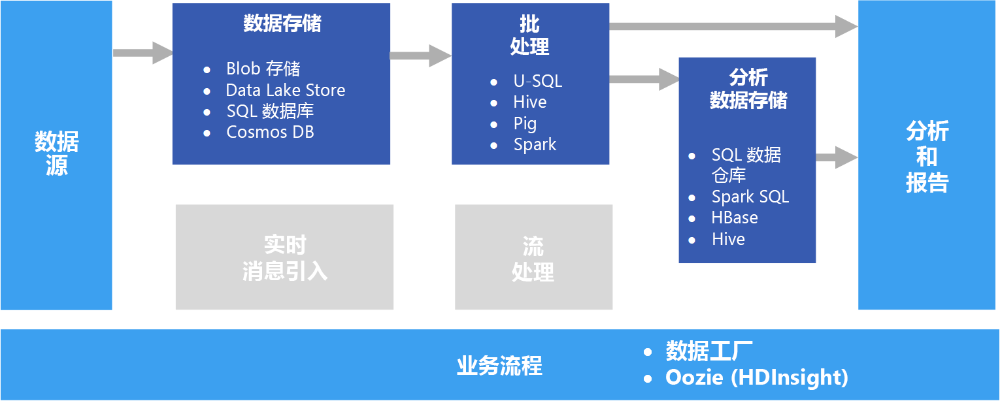

# 批处理Batch processing

一种常见的大数据方案是批处理静态数据。A common big data scenario is batch processing of data at rest. 在此方案中，源数据通过源应用程序本身或业务流程工作流载入数据存储。In this scenario, the source data is loaded into data storage, either by the source application itself or by an orchestration workflow. 然后，业务流程工作流启动的并行化作业就地处理该数据。The data is then processed in-place by a parallelized job, which can also be initiated by the orchestration workflow. 处理过程可以包括多个迭代步骤。然后，转换的结果将载入可由分析和报告组件查询的分析数据存储。The processing may include multiple iterative steps before the transformed results are loaded into an analytical data store, which can be queried by analytics and reporting components.

例如，可将 Web 服务器的日志复制到某个文件夹，然后在夜间对其进行处理，以生成 Web 活动的每日报告。For example, the logs from a web server might be copied to a folder and then processed overnight to generate daily reports of web activity.

## 何时使用此解决方案When to use this solution

从简单的数据转换到更完整的 ETL（提取-转换-加载）管道等各种场合，都可以使用批处理。Batch processing is used in a variety of scenarios, from simple data transformations to a more complete ETL (extract-transform-load) pipeline. 在大数据上下文中，批处理可以处理极大的数据集，其中的计算会消耗很长时间。In a big data context, batch processing may operate over very large data sets, where the computation takes significant time. （有关示例，请参阅 [Lambda 体系结构](../concepts/big-data.md#lambda-architecture)。）批处理通常促成进一步的交互式探索，为机器学习提供随时可建模的数据，或者将数据写入针对分析和可视化进行优化的数据存储。(For example, see [Lambda architecture](../concepts/big-data.md#lambda-architecture).) Batch processing typically leads to further interactive exploration, provides the modeling-ready data for machine learning, or writes the data to a data store that is optimized for analytics and visualization.

批处理的一个示例是将大量的平面半结构化 CSV 或 JSON 文件转换为架构化和结构化格式供进一步查询。One example of batch processing is transforming a large set of flat, semi-structured CSV or JSON files into a schematized and structured format that is ready for further querying. 通常，会将数据从用于引入的原始格式（例如 CSV）转换为查询性能更好的二进制格式，因为二进制以纵栏表格式存储数据，并且通常提供索引和有关数据的内联统计信息。Typically the data is converted from the raw formats used for ingestion (such as CSV) into binary formats that are more performant for querying because they store data in a columnar format, and often provide indexes and inline statistics about the data.

## 挑战Challenges

- **数据格式和编码**。**Data format and encoding**. 如果文件使用意外的格式或编码，会发生一些很难调试的问题。Some of the most difficult issues to debug happen when files use an unexpected format or encoding. 例如，源文件可能混用 UTF-16 和 UTF-8 编码，或者包含意外的分隔符（空格与制表符）或意外的字符。For example, source files might use a mix of UTF-16 and UTF-8 encoding, or contain unexpected delimiters (space versus tab), or include unexpected characters. 另一个常见例子是包含解释为分隔符的制表符、空格或逗号的文本字段。Another common example is text fields that contain tabs, spaces, or commas that are interpreted as delimiters. 数据加载和分析逻辑必须足够灵活，可以检测和处理这些问题。Data loading and parsing logic must be flexible enough to detect and handle these issues.

- **协调时间切片。****Orchestrating time slices.** 通常，源数据被放置在反映处理窗口的文件夹层次结构中，并按年、月、日、小时等属性进行组织。Often source data is placed in a folder hierarchy that reflects processing windows, organized by year, month, day, hour, and so on. 在某些情况下，数据可能延迟到达。In some cases, data may arrive late. 例如，假设某个 Web 服务器发生故障，3 月 7 日生成的日志可能要到 3 月 9 日才会出现在文件夹中供处理。For example, suppose that a web server fails, and the logs for March 7th don't end up in the folder for processing until March 9th. 会不会因为延迟到达而将其忽略？Are they just ignored because they're too late? 下游处理逻辑是否可以处理无序的记录？Can the downstream processing logic handle out-of-order records?

## 体系结构Architecture

批处理体系结构包含以下逻辑组件，如上图所示。A batch processing architecture has the following logical components, shown in the diagram above.

- **数据存储。****Data storage.** 通常是一个分布式文件存储，可充当大量采用各种格式的大型文件的存储库。Typically a distributed file store that can serve as a repository for high volumes of large files in various formats. 一般情况下，这种类型的存储通常称为 Data Lake。Generically, this kind of store is often referred to as a data lake. 

- **批处理。****Batch processing.** 大数据的庞大性通常意味着，解决方案必须使用长时间运行的批处理作业来处理数据文件，以便筛选、聚合和准备用于分析的数据。The high-volume nature of big data often means that solutions must process data files using long-running batch jobs to filter, aggregate, and otherwise prepare the data for analysis. 这些作业通常涉及读取源文件、对它们进行处理，以及将输出写入到新文件。Usually these jobs involve reading source files, processing them, and writing the output to new files. 

- **分析数据存储。****Analytical data store.** 许多大数据解决方案会先准备用于分析的数据，然后以结构化格式提供已处理的数据供分析工具查询。Many big data solutions are designed to prepare data for analysis and then serve the processed data in a structured format that can be queried using analytical tools. 

- **分析和报告。****Analysis and reporting.** 大多数大数据解决方案的目标是通过分析和报告提供对数据的见解。The goal of most big data solutions is to provide insights into the data through analysis and reporting. 

- **业务流程。****Orchestration.** 使用批处理时，通常需要通过某种业务流程将数据迁移或复制到数据存储、批处理、分析数据存储和报告层。With batch processing, typically some orchestration is required to migrate or copy the data into your data storage, batch processing, analytical data store, and reporting layers.

## 技术选择Technology choices

建议对 Azure 中的批处理解决方案选择以下技术。The following technologies are recommended choices for batch processing solutions in Azure.

### 数据存储Data storage

- **Azure 存储 Blob 容器**。**Azure Storage Blob Containers**. 许多现有的 Azure 业务流程已在利用 Azure Blob 存储，因此它是大数据存储的适当选择。Many existing Azure business processes already make use of Azure blob storage, making this a good choice for a big data store.
- **Azure Data Lake Store**。**Azure Data Lake Store**. Azure Data Lake Store 为任何大小的文件提供几乎无限的存储，并提供广泛的安全选项，因此非常适合极大规模的大数据解决方案，让它们在一个集中式存储中存储异类格式的数据。Azure Data Lake Store offers virtually unlimited storage for any size of file, and extensive security options, making it a good choice for extremely large-scale big data solutions that require a centralized store for data in heterogeneous formats.

有关详细信息，请参阅[数据存储](../technology-choices/data-storage.md)。For more information, see [Data storage](../technology-choices/data-storage.md).

### 批处理Batch processing

- **U-SQL**。**U-SQL**. U-SQL 是 Azure Data Lake Analytics 使用的查询处理语言。U-SQL is the query processing language used by Azure Data Lake Analytics. 它将 SQL 的声明性 C# 的过程扩展性相结合，利用并行度来实现高效的大规模数据处理。It combines the declarative nature of SQL with the procedural extensibility of C#, and takes advantage of parallelism to enable efficient processing of data at massive scale.
- **Hive**。**Hive**. Hive 是类似 SQL 的语言，受大多数 Hadoop 分发版（包括 HDInsight）的支持。Hive is a SQL-like language that is supported in most Hadoop distributions, including HDInsight. 使用它可以处理任何 HDFS 兼容存储（包括 Azure Blob 存储和 Azure Data Lake Store）中的数据。It can be used to process data from any HDFS-compatible store, including Azure blob storage and Azure Data Lake Store.
- **Pig**。**Pig**. Pig 是许多 Hadoop 分发版（包括 HDInsight）中使用的声明性大数据处理语言。Pig is a declarative big data processing language used in many Hadoop distributions, including HDInsight. 它特别适合用于处理非结构化或半结构化数据。It is particularly useful for processing data that is unstructured or semi-structured.
- **Spark**。**Spark**. Spark 引擎支持以各种语言（包括 Java、Scala 和 Python）编写的批处理程序。The Spark engine supports batch processing programs written in a range of languages, including Java, Scala, and Python. Spark 使用分布式体系结构跨多个工作节点并行处理数据。Spark uses a distributed architecture to process data in parallel across multiple worker nodes.

有关详细信息，请参阅[批处理](../technology-choices/batch-processing.md)。For more information, see [Batch processing](../technology-choices/batch-processing.md).

### 分析数据存储Analytical data store

- **SQL 数据仓库**。**SQL Data Warehouse**. Azure SQL 数据仓库是经过优化的基于 SQL Server 数据库技术的托管服务，支持大规模数据仓库工作负荷。Azure SQL Data Warehouse is a managed service based on SQL Server database technologies and optimized to support large-scale data warehousing workloads.
- **Spark SQL**。**Spark SQL**. Spark SQL 是在 Spark 基础上构建的 API，支持创建可使用 SQL 语法查询的数据帧和表。Spark SQL is an API built on Spark that supports the creation of dataframes and tables that can be queried using SQL syntax.
- **HBase**。**HBase**. HBase 是一种低延迟的 NoSQL 存储，为查询结构化和半结构化数据提供高性能、灵活的选项。HBase is a low-latency NoSQL store that offers a high-performance, flexible option for querying structured and semi-structured data.
- **Hive**。**Hive**. 除了用于批处理以外，Hive 还提供概念上类似于典型关系数据库管理系统的数据库体系结构。In addition to being useful for batch processing, Hive offers a database architecture that is conceptually similar to that of a typical relational database management system. 借助 Hive 查询性能的创新改进（例如 Tez 引擎和 Stinger 方案），在某些场合下，可以有效利用 Hive 表作为分析查询的源。Improvements in Hive query performance through innovations like the Tez engine and Stinger initiative mean that Hive tables can be used effectively as sources for analytical queries in some scenarios.

有关详细信息，请参阅[分析数据存储](../technology-choices/analytical-data-stores.md)。For more information, see [Analytical data stores](../technology-choices/analytical-data-stores.md).

### 分析和报告Analytics and reporting

- **Azure Analysis Services**。**Azure Analysis Services**. 许多大数据解决方案包含集中式联机分析处理 (OLAP) 数据模型（通常称为多维数据集）并据此生成报告、仪表板和交互式“切片和切块”，因此可以模拟传统的企业商业智能体系结构。Many big data solutions emulate traditional enterprise business intelligence architectures by including a centralized online analytical processing (OLAP) data model (often referred to as a cube) on which reports, dashboards, and interactive “slice and dice” analysis can be based. Azure Analysis Services 支持创建多维和表格模型来满足此需求。Azure Analysis Services supports the creation of multidimensional and tabular models to meet this need.
- **Power BI**。**Power BI**. 数据分析师可以使用 Power BI，基于 OLAP 模型中的数据模型或者直接从分析数据存储创建交互式数据可视化效果。Power BI enables data analysts to create interactive data visualizations based on data models in an OLAP model or directly from an analytical data store.
- **Microsoft Excel**。**Microsoft Excel**. Microsoft Excel 是全球最广泛使用的软件应用程序之一，提供大量的数据分析和可视化功能。Microsoft Excel is one of the most widely used software applications in the world, and offers a wealth of data analysis and visualization capabilities. 数据分析师可以使用 Excel 从分析数据存储构建文档数据模型，或者将 OLAP 数据模型中的数据检索到交互式数据透视表和图表。Data analysts can use Excel to build document data models from analytical data stores, or to retrieve data from OLAP data models into interactive PivotTables and charts.

有关详细信息，请参阅[分析和报告](../technology-choices/analysis-visualizations-reporting.md)。For more information, see [Analytics and reporting](../technology-choices/analysis-visualizations-reporting.md).

### 业务流程Orchestration

- **Azure 数据工厂****Azure Data Factory**. 使用 Azure 数据工厂管道可以定义一系列根据重复临时窗口计划的活动。Azure Data Factory pipelines can be used to define a sequence of activities, scheduled for recurring temporal windows. 这些活动可以在按需 HDInsight 群集中启动数据复制操作，以及：Hive、Pig、MapReduce 或 Spark 作业；Azure Date Lake Analytics 中的 U-SQL 作业；Azure SQL 数据仓库或 Azure SQL 数据库中的存储过程。These activities can initiate data copy operations as well as Hive, Pig, MapReduce, or Spark jobs in on-demand HDInsight clusters; U-SQL jobs in Azure Date Lake Analytics; and stored procedures in Azure SQL Data Warehouse or Azure SQL Database.
- **Oozie** 和 **Sqoop**。**Oozie** and **Sqoop**. Oozie 是 Apache Hadoop 生态系统的作业自动化引擎，可用于启动数据复制操作和 Hive、Pig 与 MapReduce 作业来处理数据，以及启动 Sqoop 作业在 HDFS 与 SQL 数据库之间复制数据。Oozie is a job automation engine for the Apache Hadoop ecosystem and can be used to initiate data copy operations as well as Hive, Pig, and MapReduce jobs to process data and Sqoop jobs to copy data between HDFS and SQL databases.

有关详细信息，请参阅[管道业务流程](../technology-choices/pipeline-orchestration-data-movement.md)For more information, see [Pipeline orchestration](../technology-choices/pipeline-orchestration-data-movement.md)
