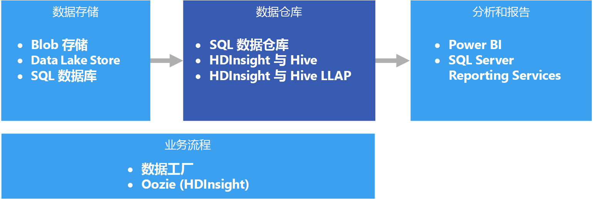

# 数据仓库和数据市场

数据仓库是一个集中式、组织有序的关系存储库，其中保存了许多或所有业务领域的一个或多个不同源的集成数据。 数据仓库存储当前数据和历史数据，可用于通过不同的方式报告和分析数据。

若要将数据移到数据仓库，需定期从包含重要业务信息的各种源提取数据。 移动数据时，可以格式化、清理、验证、汇总和重新组织数据。 或者，可以使用仓库中提供的聚合视图存储最低详细程度的数据用于报告。 在任一情况下，数据仓库都是通过商业智能 (BI) 工具进行报告、分析和做出重要业务决策所用的数据的永久存储空间。

## 数据市场和操作数据存储

大规模管理数据会很复杂，使用单个数据仓库呈现整个企业的所有数据的做法越来越不常见。 相反，组织往往会创建称作“数据市场”的更有针对性的小型数据仓库来公开所需的数据，以进行分析。 业务流程会将操作数据存储中维护的数据填充到数据市场。 操作数据存储充当源事务系统与数据市场之间的中介。 操作数据存储管理的数据是源事务系统中数据的清理版本，通常是数据仓库或数据市场维护的历史数据子集。 

## 何时使用此解决方案

需要将大量数据从操作型系统转换为易于理解、最新且精确的格式时，请选择数据仓库。 数据仓库不需要遵循可在操作/OLTP 数据库中使用的相同简洁数据结构。 可以使用企业用户和分析师能够理解的列名，重构架构来简化数据关系，并将多个表合并成一个表。 这些步骤有助于引导用户创建即席报表，或者在 BI 系统中创建报表和分析数据，而无需求助于数据库管理员 (DBA) 或数据开发人员。

出于性能原因需要将历史数据与源事务系统分开时，请考虑使用数据仓库。 数据仓库提供通用格式、通用键、通用数据模型和通用访问方法的集成使用位置，使用它可以从多个位置轻松访问历史数据。

数据仓库已针对读取访问进行优化，与针对源事务系统运行报告相比，数据仓库可以更快地生成报告。 此外，数据仓库提供以下优势：

* 可以从用作单一事实源的数据仓库存储和访问多个源的所有历史数据。
* 将数据导入数据仓库时，可以通过清理数据，提供更准确的数据以及一致的代码和说明来改善数据质量。
* 在查询处理周期，报告工具不会与事务源系统争用资源。 数据仓库可让事务系统专注于处理写入操作，同时，数据仓库可满足大多数读取请求。
* 数据仓库可以帮助整合不同软件中的数据。
* 借助数据挖掘工具，可以针对仓库中存储的数据，使用自动化方法发现隐藏的模式。
* 使用数据仓库可以更轻松地为授权用户提供安全访问，同时限制其他人的访问。 无需授予业务用户对源数据的访问权限，从而消除了一个或多个生产事务系统中潜在的攻击途径。
* 使用数据仓库可以更轻松地基于数据创建商业智能解决方案，例如 [OLAP 多维数据集](online-analytical-processing.md)。

## 挑战

根据业务需求正确配置数据仓库时可能存在以下一些难题：

* 提交正确为业务概念建模所需的时间。 这是一个重要步骤，因为数据仓库由信息驱动，而概念映射项目的余下部分。 这涉及到标准化业务相关的术语和常见格式（例如货币和日期），以及通过业务用户可以理解的、但仍可确保数据聚合和关系准确性的方式来重构架构。
* 规划和设置数据业务流程。 考虑因素包括如何将数据从源事务系统复制到数据仓库，以及何时从操作数据存储移出历史数据，并将其移入仓库。
* 将数据导入仓库时，通过清理数据来保持或改善数据质量。

## Azure 中的数据仓库

在 Azure 中，你可能维护了一个或多个数据源，不管是客户交易的数据，还是各部门使用的各种业务应用程序中的数据。 此数据通常存储在一个或多个 [OLTP](online-transaction-processing.md) 数据库中。 可以在网络共享、Azure 存储 Blob 或 Data Lake 等其他存储媒体中保存这些数据。 数据仓库本身或者 Azure SQL 数据库等关系数据库也可以存储数据。 分析数据存储层的用途是满足分析和报告工具针对数据仓库或数据市场发出的查询。 在 Azure 中，可以使用 Azure SQL 数据仓库，或者结合使用 Azure HDInsight 和 Hive 或交互式查询来实现此分析存储功能。 此外，需要使用 Azure 数据工厂或 Oozie on Azure HDInsight 执行某种程度的协调，定期将数据从数据存储移动或复制到数据仓库。

相关服务：

* [Azure SQL 数据库](/azure/sql-database/)
* [VM 中的 SQL Server](/sql/sql-server/sql-server-technical-documentation)
* [Azure 数据仓库](/azure/sql-data-warehouse/sql-data-warehouse-overview-what-is)
* [HDInsight 上的 Apache Hive](/azure/hdinsight/hadoop/hdinsight-use-hive)
* [HDInsight 上的交互式查询 (Hive LLAP)](/azure/hdinsight/interactive-query/apache-interactive-query-get-started)

## 技术选择

- [数据仓库](../technology-choices/data-warehouses.md)
- [管道业务流程](../technology-choices/pipeline-orchestration-data-movement.md)

