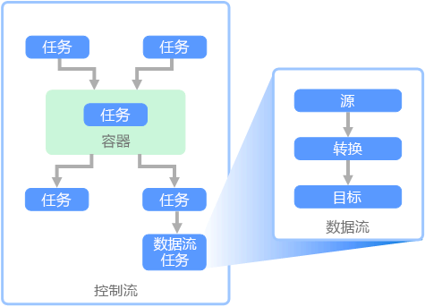

# 提取、转换和加载 (ETL)Extract, transform, and load (ETL)

组织面临的常见难题是如何从多个源收集多种格式的数据，并将其转移到一个或多个数据存储。A common problem that organizations face is how to gathering data from multiple sources, in multiple formats, and move it to one or more data stores. 目标的数据存储类型可能与源不同，并且格式通常不同，或者在将数据载入其最终目标之前，需要对其进行整理或清理。The destination may not be the same type of data store as the source, and often the format is different, or the data needs to be shaped or cleaned before loading it into its final destination.

过去几年以来，行业中已开发了多种工具、服务和过程来解决这些难题。Various tools, services, and processes have been developed over the years to help address these challenges. 不管采用哪种过程，往往都需要协调工作，并在数据管道中应用某种级别的数据转换。No matter the process used, there is a common need to coordinate the work and apply some level of data transformation within the data pipeline. 以下部分重点介绍执行这些任务的常用方法。The following sections highlight the common methods used to perform these tasks.

## 提取、转换和加载 (ETL)Extract, transform, and load (ETL)

提取、转换和加载 (ETL) 是一个数据管道，用于从各种源收集数据、根据业务规则转换数据，然后将其载入目标数据存储。Extract, transform, and load (ETL) is a data pipeline used to collect data from various sources, transform the data according to business rules, and load it into a destination data store. ETL 中的转换工作在专用引擎中发生，通常涉及到使用临时表来暂时保存正在转换、并最终要载入其目标的数据。The transformation work in ETL takes place in a specialized engine, and often involves using staging tables to temporarily hold data as it is being transformed and ultimately loaded to its destination.

数据转换通常涉及到各种操作，例如筛选、排序、聚合、联接数据、清理数据、删除重复数据和验证数据。The data transformation that takes place usually involves various operations, such as filtering, sorting, aggregating, joining data, cleaning data, deduplicating, and validating data.

通常，三个 ETL 阶段是同时运行的，以节省时间。Often, the three ETL phases are run in parallel to save time. 例如，在提取数据时，转换过程可以处理已收到的数据并做好加载数据的准备，加载过程可以开始处理已准备好的数据，而无需等待整个提取过程完成。For example, while data is being extracted, a transformation process could be working on data already received and prepare it for loading, and a loading process can begin working on the prepared data, rather than waiting for the entire extraction process to complete.

相关的 Azure 服务：Relevant Azure service:
- [Azure 数据工厂 v2Azure Data Factory v2](https://azure.microsoft.com/services/data-factory/)

其他工具：Other tools:
- [SQL Server Integration Services (SSIS)SQL Server Integration Services (SSIS)](/sql/integration-services/sql-server-integration-services)

## 提取、加载和转换 (ELT)Extract, load, and transform (ELT)

提取、加载和转换 (ELT) 与 ETL 的唯一不同之处在于转换的发生位置。Extract, load, and transform (ELT) differs from ETL solely in where the transformation takes place. 在 ELT 管道中，转换发生在目标数据存储中。In the ELT pipeline, the transformation occurs in the target data store. 在不使用单独转换引擎的情况下，将使用目标数据存储的处理功能来转换数据。Instead of using a separate transformation engine, the processing capabilities of the target data store are used to transform data. 这就从管道中删除了转换引擎，从而简化了体系结构。This simplifies the architecture by removing the transformation engine from the pipeline. 此方法的另一个好处是，缩放目标数据存储也会缩放 ELT 管道性能。Another benefit to this approach is that scaling the target data store also scales the ELT pipeline performance. 但是，仅当目标系统足够强大，可以有效转换数据时，ELT 才能正常工作。However, ELT only works well when the target system is powerful enough to transform the data efficiently.

ELT 的典型用例属于大数据领域。Typical use cases for ELT fall within the big data realm. 例如，首先可将所有源数据提取到 Hadoop 分布式文件系统 (HDFS) 或 Azure Data Lake Store 等可缩放存储中的平面文件。For example, you might start by extracting all of the source data to flat files in scalable storage such as Hadoop distributed file system (HDFS) or Azure Data Lake Store. 然后，可以使用 Spark、Hive 或 PolyBase 等技术查询源数据。Technologies such as Spark, Hive, or PolyBase can then be used to query the source data. ELT 的关键之处在于，用于执行转换的数据存储是最终要在其中使用数据的同一数据存储。The key point with ELT is that the data store used to perform the transformation is the same data store where the data is ultimately consumed. 此数据存储直接从可缩放的存储读取，而不是将数据载入其自身的专有存储。This data store reads directly from the scalable storage, instead of loading the data into its own proprietary storage. 此方法跳过了 ETL 中存在的数据复制步骤，针对大型数据集运行时可能很耗时。This approach skips the data copy step present in ETL, which can be a time consuming operation for large data sets.

在实践中，目标数据存储是使用 Hadoop 群集（使用 Hive 或 Spark）的[数据仓库](./data-warehousing.md)，或 SQL 数据仓库。In practice, the target data store is a [data warehouse](./data-warehousing.md) using either a Hadoop cluster (using Hive or Spark) or a SQL Data Warehouse. 一般情况下，架构在查询时叠加在平面文件数据上，并存储为表，因此，可以像查询数据存储中的其他任何数据一样查询这些数据。In general, a schema is overlaid on the flat file data at query time and stored as a table, enabling the data to be queried like any other table in the data store. 这些表称为外部表，因为数据不在数据存储本身管理的存储中，而是在某个外部可缩放存储中。These are referred to as external tables because the data does not reside in storage managed by the data store itself, but on some external scalable storage. 

数据存储只管理数据的架构，并在读取时应用架构。The data store only manages the schema of the data and applies the schema on read. 例如，使用 Hive 的 Hadoop 群集会描述一个 Hive 表，其中的数据源实际上是 HDFS 中一组文件的路径。For example, a Hadoop cluster using Hive would describe a Hive table where the data source is effectively a path to a set of files in HDFS. 在 SQL 数据仓库中，PolyBase 可以实现相同的结果 &mdash; 针对数据库本身外部存储的数据创建一个表。In SQL Data Warehouse, PolyBase can achieve the same result &mdash; creating a table against data stored externally to the database itself. 加载源数据后，可以使用数据存储的功能处理外部表中的数据。Once the source data is loaded, the data present in the external tables can be processed using the capabilities of the data store. 在大数据方案中，这意味着数据存储必须能够执行大规模并行处理 (MPP)，将数据分解成较小区块，并跨多台计算机并行分配区块处理负载。In big data scenarios, this means the data store must be capable of massively parallel processing (MPP), which breaks the data into smaller chunks and distributes processing of the chunks across multiple machines in parallel.

ELT 管道的最后一个阶段通常是将源数据转换为最终格式，对于需要支持的查询类型，此格式更为有效。The final phase of the ELT pipeline is typically to transform the source data into a final format that is more efficient for the types of queries that need to be supported. 例如，可将数据分区。For example, the data may be partitioned. 此外，ELT 可以使用 Parquet 等优化的存储格式，以纵栏表形式存储面向行的数据，并提供优化的索引。Also, ELT might use optimized storage formats like Parquet, which stores row-oriented data in a columnar fashion and providess optimized indexing. 

相关的 Azure 服务：Relevant Azure service:

- [Azure SQL 数据仓库Azure SQL Data Warehouse](/azure/sql-data-warehouse/sql-data-warehouse-overview-what-is)
- [基于 Hive 的 HDInsightHDInsight with Hive](/azure/hdinsight/hadoop/hdinsight-use-hive)
- [Azure 数据工厂 v2Azure Data Factory v2](https://azure.microsoft.com/services/data-factory/)
- [Oozie on HDInsightOozie on HDInsight](/azure/hdinsight/hdinsight-use-oozie-linux-mac)

其他工具：Other tools:

- [SQL Server Integration Services (SSIS)SQL Server Integration Services (SSIS)](/sql/integration-services/sql-server-integration-services)

## 数据流和控制流Data flow and control flow

在数据管道的上下文中，控制流确保有序处理一组任务。In the context of data pipelines, the control flow ensures orderly processing of a set of tasks. 若要实施这些任务的正确处理顺序，可以使用优先约束。To enforce the correct processing order of these tasks, precedence constraints are used. 可将这些约束视为工作流关系图中的连接器，如下图所示。You can think of these constraints as connectors in a workflow diagram, as shown in the image below. 每个任务都有结果，例如成功、失败或完成。Each task has an outcome, such as success, failure, or completion. 只有在前面的任务已完成并生成了结果时，后面的任务才会启动处理。Any subsequent task does not initiate processing until its predecessor has completed with one of these outcomes.

控制流以任务的形式执行数据流。Control flows execute data flows as a task. 在数据流任务中，会从源提取数据、转换数据，或将数据载入数据存储。In a data flow task, data is extracted from a source, transformed, or loaded into a data store. 一个数据流任务的输出可以是下一个数据流任务的输入，数据流可以并行运行。The output of one data flow task can be the input to the next data flow task, and data flowss can run in parallel. 与控制流不同，无法在数据流中的任务之间添加约束。Unlike control flows, you cannot add constraints between tasks in a data flow. 但是，可以添加数据查看器来观察每个任务处理的数据。You can, however, add a data viewer to observe the data as it is processed by each task.

在上图中，控制流包含多个任务，其中一个任务是数据流任务。In the diagram above, there are several tasks within the control flow, one of which is a data flow task. 有一个任务嵌套在容器中。One of the tasks is nested within a container. 可以使用容器来提供任务结构和工作单元。Containers can be used to provide structure to tasks, providing a unit of work. 一个例子是使用容器来重复集合中的元素，例如文件夹中的文件，或数据库语句。One such example is for repeating elements within a collection, such as files in a folder or database statements.

相关的 Azure 服务：Relevant Azure service:
- [Azure 数据工厂 v2Azure Data Factory v2](https://azure.microsoft.com/services/data-factory/)

其他工具：Other tools:
- [SQL Server Integration Services (SSIS)SQL Server Integration Services (SSIS)](/sql/integration-services/sql-server-integration-services)

## 技术选择Technology choices

- [联机事务处理 (OLTP) 数据存储Online Transaction Processing (OLTP) data stores](../technology-choices/oltp-data-stores.md)
- [联机分析处理 (OLAP) 数据存储Online Analytical Processing (OLAP) data stores](../technology-choices/olap-data-stores.md)
- [数据仓库Data warehouses](../technology-choices/data-warehouses.md)
- [管道业务流程Pipeline orchestration](../technology-choices/pipeline-orchestration-data-movement.md)
