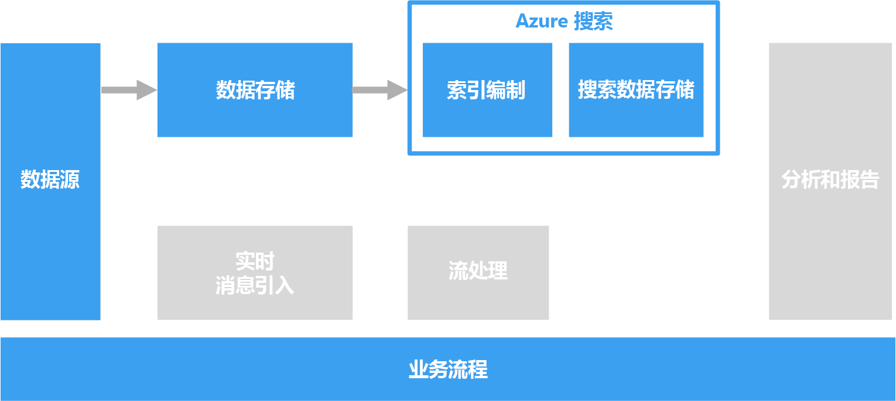

# 为搜索处理自由格式文本

若要支持搜索，可以对包含文本段落的文档执行自由格式文本处理。

文本搜索通过构造针对文档集合预先计算的专用索引进行工作。 客户端应用程序提交包含搜索词的查询。 查询返回一个结果集，其中包含根据每个文档与搜索条件的匹配程度排序的文档列表。 搜索集还可能包括文档与条件进行匹配时所处的上下文，这使得应用程序能够突出显示文档中的匹配段落。 

自由格式文本处理可以基于大量的嘈杂文本数据生成有用的可操作数据。 结果可以为非结构化文档提供定义完善的且可查询的结构。

## 挑战

- 处理自由格式文本文档的集合通常需要密集进行计算，而且非常耗时。
- 为了高效地搜索自由格式文本，搜索索引应当支持基于具有相似构造的词语进行模糊搜索。 例如，搜索索引是通过词元化和语言词干分解构建的，因此，对“run”的查询将与包含“ran”和“running”的文档匹配。

## 体系结构

在大多数情况下，源文本文档将加载到对象存储，例如 Azure 存储或 Azure Data Lake Store。 例外情况是在 SQL Server 或 Azure SQL 数据库中使用全文搜索。 在这种情况下，文档数据加载到由数据库管理的表中。 一旦存储，将批量处理文档来创建索引。

## 技术选择

用于创建搜索索引的选项包括 Azure 搜索、Elasticsearch 和基于 Solr 的 HDInsight。 这些技术每一种都可以基于文档集合来填充搜索索引。 Azure 搜索提供了索引器，它们可以自动针对从纯文本到 Excel 和 PDF 格式的文档填充索引。 在 HDInsight 上，Apache Solr 可以为许多类型（包括纯文本、Word 和 PDF）的二进制文件编制索引。 在构造索引后，客户端可以通过 REST API 访问搜索接口。 

如果文本数据存储在 SQL Server 或 Azure SQL 数据库中，则可以使用数据库中内置的全文索引。 数据库可以基于同一数据库中存储的文本、二进制或 XML 数据来填充索引。 客户端使用 T-SQL 查询进行搜索。 

有关详细信息，请参阅[搜索数据存储](../technology-choices/search-options.md)。
