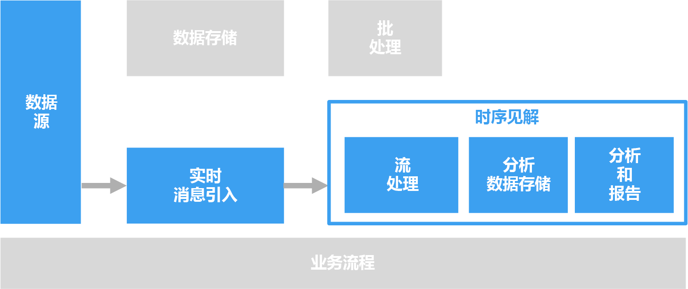

# 时序解决方案

时序数据是按时间组织的一组值。 时序数据的示例包括传感器数据、股票价格、点击流数据和应用程序遥测数据。 可以分析时序数据以生成历史趋势、实时警报或预测建模。

 

时序数据表示资产或过程是如何随时间变化的。 这些数据带有时间戳，但更重要的是，时间才是用于查看或分析数据的最有意义的轴。 时序数据通常按时间顺序到达，通常被视为插入，而不是数据库的更新。 因此，可以测量不同时间发生的变化，以便追溯过去的变化和预测将来的变化。 正因如此，最好是使用散点图或折线图将时序数据可视化。

时序数据的一些示例包括：

- 捕获一段时间的股票价格以检测趋势。
- 服务器性能，例如 CPU 使用率、I/O 负载、内存使用率和网络带宽消耗量。
- 工业设备传感器发出的遥测数据，可用于检测待处理的设备故障和触发警报通知。
- 实时汽车遥测数据（包括某个时间范围内的车速、刹车状况和加速能力），以便为驾驶员生成聚合风险评分。

在上述每种情况下，都可以看到，时间是最有意义的轴。 按事件的抵达顺序显示事件是时序数据的一个关键特征，因为存在自然的时态顺序。 这不同于从标准 OLTP 数据管道捕获的数据，在此类管道中，数据可能无序进入并随时更新。

## 何时使用此解决方案

如果需要引入其战略值以一段时间内的变化为中心的数据，并且主要是插入新数据而极少更新数据（甚至根本不会更新），请选择时序解决方案。 可以使用此信息来检测异常、可视化趋势、将当前数据与历史数据相比较，等等。 此类体系结构最适合用于预测建模和预测结果，因为在一段时间后，可以获得变化的历史记录，并将其应用到任意数量的预测模型。 

时序提供以下优势：

* 明确呈现资产或过程在不同时间的变化。
* 帮助你快速检测许多相关源的变化，突出异常和新的趋势。
* 最适合预测建模和预测。

### 物联网 (IoT)

IoT 设备收集的数据原生就很适合时序存储和分析。 传入的数据将会插入而极少更新（甚至不会更新）。 数据带有时间戳，按接收顺序插入并按时间顺序显示，使用户能够发现趋势、查明异常，并将这些信息用于预测分析。

有关详细信息，请参阅[物联网](../big-data/index.md#internet-of-things-iot)。

### 实时分析

时序数据通常是时间敏感的 &mdash; 也就是说，必须快速处理，以实时查明趋势或生成警报。 在这种情况下，生成见解出现任何延迟都可能导致停机和业务影响。 此外，通常需要关联来自各种不同源（例如传感器）的数据。

最好是部署一个流处理层来实时处理传入的数据，并以较高的精度和粒度处理所有这些数据。 根据流体系结构和流缓冲与流处理层的组件，有时做不到这一点。 可能需要减少时序数据来部分地降低精度。 为此，可以处理滑动时间窗口（例如若干秒），使处理层能够及时执行计算。 在显示较长时间的数据时，还可能需要向下采样和聚合数据，例如，进行缩放以显示过去几个月捕获的数据。

## 挑战

* 时序数据通常很大，尤其是在 IoT 方案中。 存储、索引、查询、分析和可视化时序数据可能很困难。 
* 可能很难找到高速存储与强大计算操作的适当组合来处理实时分析，同时最小化面市时间和总体投资成本。

## 体系结构

在涉及到时序数据的许多方案（例如 IoT）中，数据是实时捕获的。 因此，[实时处理](../big-data/real-time-processing.md)体系结构比较适合。 

[IoT 中心](/azure/iot-hub/)、[事件中心](/azure/event-hubs/)或 [Kafka on HDInsight](/azure/hdinsight/kafka/apache-kafka-introduction) 会将一个或多个数据源的数据引入流缓冲层。 接下来，在流处理层中处理数据。该层可以选择性地将处理后的数据转发到机器学习服务进行预测分析。 处理后的数据存储在 [HBase](/azure/hdinsight/hbase/apache-hbase-overview)、[Azure Cosmos DB](/azure/cosmos-db/)、Azure Data Lake 或 Blob 存储等分析数据存储中。 可以使用 Power BI 或 OpenTSDB（如果数据存储在 HBase 中）等分析和报告应用程序或服务来显示要分析的时序数据。

另一个选项是使用 [Azure 时序见解](/azure/time-series-insights/)。 时序见解是处理时序数据的完全托管服务。 在此体系结构中，时序见解执行流处理、数据存储以及分析和报告的角色。 它从 IoT 中心或事件中心接受流数据，并近乎实时地存储、处理、分析和显示数据。 它不会预先聚合数据，而是存储原始事件。

时序见解采用自适应架构，这意味着，无需执行任何数据准备就能开始派生见解。 这样，便可以顺畅地浏览、比较和关联各种数据源。 时序见解还提供类似于 SQL 的筛选器和聚合，能够构造、可视化、比较和覆盖各种时序模式与热图，并可以保存和共享查询。 

## 技术选择

- [数据存储](../technology-choices/data-storage.md)
- [分析、可视化和报告](../technology-choices/analysis-visualizations-reporting.md)
- [分析数据存储](../technology-choices/analytical-data-stores.md)
- [流处理](../technology-choices/stream-processing.md)