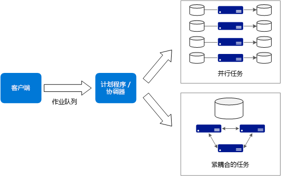
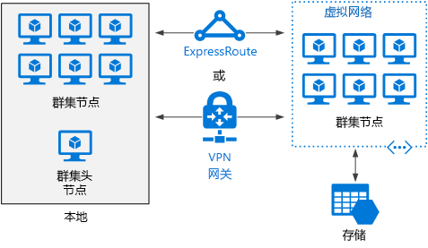

# 大计算的体系结构样式

术语“大计算”指的是需要大量核心的大规模工作负载，核心数量通常以数百或数千计。 方案包括图像渲染、流体动力学、金融风险建模、石油勘探、药物设计和工程应力分析等等。

以下是大计算应用程序的一些典型特征：

- 工作可拆分为离散的任务，这些任务可以跨多个核心同时运行。
- 各任务都是有限的。 接收一些输入，执行某些处理操作，然后生成输出。 整个应用程序的运行时间（从数分钟到数天）有限。 常见模式是突然预配大量核心，在应用程序完成后，核心数量减少到零。 
- 应用程序不需要全天候运行。 但是，系统必须处理节点故障或应用程序故障。
- 对于某些应用程序，任务是独立的且可并行运行。 在其他情况下，任务紧密耦合，这意味着它们必须交互或交换中间结果。 在该情况下，请考虑使用 InfiniBand 和远程直接内存访问 (RDMA) 等高速联网技术。 
- 可以根据工作负载，使用不同大小的计算密集型 VM（H16r、H16mr 和 A9）。

## 此体系结构适用的情况

- 模拟和数字运算等计算密集型操作。
- 计算密集型模拟，须拆分到多台计算机（10 - 1000 台）的 CPU 中。
- 对一台计算机的内存要求过高的模拟，须拆分到多台计算机中。
- 长时间运行的计算，在一台计算机上完成计算会花费过长时间。
- 必须运行 100 次或 1000 次的较小型计算，如 Monte Carlo 模拟。

## 优点

- 高性能和“[易并行][embarrassingly-parallel]”处理。
- 可以利用数百或数千个计算机核心更快地解决大型问题。
- 可以通过 InfiniBand 高速专用网络，访问高性能专用硬件。
- 可以根据工作需要预配 VM，然后再将它们关闭。 

## 挑战

- 管理 VM 基础结构。
- 管理数字运算量。 
- 及时预配数千个核心。
- 对于紧密耦合的任务，添加更多核心可能会减少返回量。 可能需要进行试验来找到最适宜的核心数。

## 使用 Azure Batch 的大计算

[Azure Batch][batch] 是一个托管服务，适用于运行大规模高性能计算 (HPC) 应用程序。

使用 Azure Batch 配置 VM 池并上传应用程序和数据文件。 然后 Batch 服务预配 VM、将任务分配给 VM、运行任务并监视进度。 Batch 可以根据工作负载横向扩展 VM。 Batch 还提供作业计划。

 

## 在虚拟机上运行的大计算

可以使用 [Microsoft HPC Pack][hpc-pack] 管理 VM 群集以及计划并监视 HPC 作业。 在此方法中，必须预配并管理 VM 和网络基础结构。 如果有现有的 HPC 工作负载且要将其部分或全部移动到 Azure，请考虑使用此方法。 可将整个 HPC 群集移动到 Azure，或本地保存 HPC 群集但对迸发容量使用 Azure。 有关详细信息，请参阅[适用于大规模计算工作负载的 Batch 和 HPC 解决方案][batch-hpc-solutions]。

### 部署到 Azure 的 HPC Pack

在此方案中，HPC 群集完全是在 Azure 中创建的。

 
 
头节点向群集提供管理和作业计划服务。 对于紧密耦合的任务，所使用的 RDMA 网络需提供极高的带宽，并在 VM 之间提供低延迟的通信。 有关详细信息，请参阅[在 Azure 中部署 HPC Pack 2016 群集][deploy-hpc-azure]。

### 将 HPC 群集迸发到 Azure

在此方案中，组织在本地运行 HPC Pack，并对迸发容量使用 Azure VM。 群集的头节点位于本地。 ExpressRoute 或 VPN 网关将本地网络连接到 Azure VNet。

 

[batch]: /azure/batch/
[batch-hpc-solutions]: /azure/batch/batch-hpc-solutions
[deploy-hpc-azure]: /azure/virtual-machines/windows/hpcpack-2016-cluster
[embarrassingly-parallel]: https://en.wikipedia.org/wiki/Embarrassingly_parallel
[hpc-pack]: https://technet.microsoft.com/library/cc514029

 
