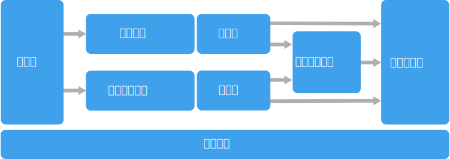

# 大数据体系结构样式

大数据体系结构设计用来处理对传统数据库系统而言太大或太复杂的数据的引入、处理和分析。

 大数据解决方案通常涉及一个或多个以下类型的工作负荷：

- 静态大数据源的批处理。
- 移动中的大数据的实时处理。
- 大数据的交互式浏览。
- 预测分析和机器学习。

大多数大数据体系结构都包括下列组件中的一些或全部：

- **数据源**：所有大数据解决方案都以一个或多个数据源开始。 示例包括：

    - 应用程序数据存储，例如关系数据库。
    - 应用程序生成的静态文件，例如 Web 服务器日志文件。
    - 实时数据源，例如 IoT 设备。

- **数据存储**：用于批处理操作的数据通常存储在分布式文件存储中，该存储可以容纳大量各种格式的大型文件。 这类存储通常称为 *Data Lake*。 用于实现此存储的选项包括 Azure Data Lake Store 和 Azure 存储中的 blob 容器。 

- **批处理**：因为数据集很大，所以，大数据解决方案通常必须使用长时间运行的批处理作业来处理数据文件，从而筛选、聚合以及准备用于分析的数据。 这些作业通常涉及读取源文件、对它们进行处理，以及将输出写入到新文件。 选项包括在 Azure Data Lake Analytics 中运行 U-SQL 作业，在 HDInsight Hadoop 群集中使用 Hive、Pig 或自定义 Map/Reduce 作业，或者在 HDInsight Spark 群集中使用 Java、Scala 或 Python 程序。

- **实时消息引入**：如果解决方案包括实时源，则体系结构必须包括一种方法来捕获并存储实时消息以进行流式处理。 这可以是一个简单的数据存储，将在其中将传入消息放置在一个文件夹中以进行处理。 不过，许多解决方案都需要一个消息引入存储来充当消息缓冲区，以及支持横向扩展处理、可靠传递和其他消息队列语义。 选项包括 Azure 事件中心、Azure IoT 中心和 Kafka。

- **流式处理**：捕获实时消息后，解决方案必须通过筛选、聚合以及准备用于分析的数据来处理消息。 然后，会将处理后的流数据写入到输出接收器。 Azure 流分析基于不断运行的 SQL 查询提供托管流处理服务，这些查询对无限的流进行操作。 还可以在 HDInsight 群集中使用开源 Apache 流式处理技术，例如 Storm 和 Spark 流式处理。

- **分析数据存储**：许多大数据解决方案会准备用于分析的数据，然后以结构化格式提供已处理的数据，可以使用分析工具查询这些数据。 如大多数传统业务智能 (BI) 解决方案中所见，用来为这些查询提供服务的分析数据存储可以是 Kimball 样式的关系数据仓库。 另外，可以通过低延迟 NoSQL 技术（例如 HBase，或通过分布式数据存储中的数据文件提供元数据抽象的交互式 Hive 数据库）来提供数据。 Azure SQL 数据仓库针对大规模的基于云的数据仓库提供托管服务。 HDInsight 支持交互式 Hive、HBase 和 Spark SQL，也可以使用这些技术来提供用于分析的数据。

- **分析和报告**：大多数大数据解决方案的目标是通过分析和报告提供对数据的洞察。 若要使用户能够对数据进行分析，体系结构可以包括一个数据建模层，例如 Azure Analysis Services 中的多维 OLAP 多维数据集或表格数据模型。 它还可以使用 Microsoft Power BI 或 Microsoft Excel 中的建模和可视化技术支持自助式 BI。 分析和报告还可以采用适用于数据科学家或数据分析人员的交互式数据浏览形式。 对于这些方案，许多 Azure 服务都支持分析笔记本（例如 Jupyter），这允许这些用户通过 Python 或 R 利用其现有技能。对于大规模数据浏览，可以使用 Microsoft R Server，可以独立使用，也可以将其与 Spark 一起使用。

- **业务流程**：大多数大数据解决方案都包括重复的数据处理操作（封装在工作流中），这些操作对源数据进行转换、在多个源和接收器之间移动数据、将已处理的数据加载到分析数据存储中，或者直接将结果推送到报表或仪表板。 若要自动执行这些工作流，可以使用诸如 Azure 数据工厂或 Apache Oozie 和 Sqoop 的业务流程技术。

Azure 包括了可以在大数据体系结构中使用的许多服务。 它们大致划分为两个类别：

- 托管服务，包括 Azure Data Lake Store、Azure Data Lake Analytics、Azure 数据仓库、Azure 流分析、Azure 事件中心、Azure IoT 中心和 Azure 数据工厂。
- 基于 Apache Hadoop 平台的开源技术，包括 HDFS、HBase、Hive、Pig、Spark、Storm、Oozie、Sqoop 和 Kafka。 这些技术在 Azure HDInsight 服务中的 Azure 上可用。

这些选项不是互斥的，并且许多解决方案将开源技术与 Azure 服务组合使用。

## 何时使用此体系结构

当具有以下需求时，请考虑使用此体系结构样式：

- 存储和处理对传统数据库而言数量太大的数据。
- 转换非结构化数据以进行分析和报告。
- 实时或者以较低的延迟捕获、处理和分析无限的数据流。
- 使用 Azure 机器学习或 Microsoft 认知服务。

## 优点

- **技术选择**。 可以在 HDInsight 群集中将 Azure 托管服务和 Apache 技术混搭使用，以利用现有技能或技术投资。
- **通过并行确保性能**。 大数据解决方案利用了并行，从而可以实现扩展到大量数据的高性能解决方案。
- **弹性缩放**。 大数据体系结构中的所有组件都支持横向扩展预配，以便你可以调整解决方案来适应小型或大型工作负荷，并且仅为你使用的资源付款。
- **与现有解决方案的互操作性**。 大数据体系结构的组件还用于 IoT 处理和企业 BI 解决方案，使得你可以创建涉及各种数据工作负荷的集成解决方案。

## 挑战

- **复杂性**。 大数据解决方案可能非常复杂，有大量组件用来处理来自多个数据源的数据引入。 构建、测试大数据流程以及对其进行故障排除可能比较困难。 而且，可能必须在多个系统中使用大量配置设置以优化性能。
- **技能集**。 许多大数据技术都是高度专用的，并使用对较一般的应用程序体系结构而言不常见的框架和语言。 另一方面，大数据技术在不断发展基于更成熟语言的新 API。 例如，Azure Data Lake Analytics 中的 U-SQL 语言基于 Transact-SQL 和 C# 的组合。 类似地，基于 SQL 的 API 可用于 Hive、HBase 和 Spark。
- **技术成熟度**。 大数据中使用的许多技术在不断发展。 虽然诸如 Hive 和 Pig 的核心 Hadoop 技术已经稳定，但是诸如 Spark 的新兴技术随每个新版本引入了大量的更改和增强。 与其他 Azure 服务相比，诸如 Azure Data Lake Analytics 和 Azure 数据工厂的托管服务相对年轻，并且可能会随时间发展。
- **安全性**。 大数据解决方案通常依赖于将所有静态数据存储在一个集中式 Data Lake 中。 确保对此数据的访问安全可能比较困难，尤其是当必须通过多个应用程序和平台引入和使用数据时。

## 最佳做法

- **利用并行**。 大多数大数据处理技术会将工作负荷分布到多个处理单元中。 这需要以可拆分格式创建和存储静态数据文件。 分布式文件系统（例如 HDFS）可以优化读取和写入性能，并且通过多个群集节点并行执行实际处理，这降低了整体作业时间。

- **将数据分区**。 批处理通常按定期计划进行 &mdash; 例如，每周或每月。 请根据与处理计划匹配的时间期间对数据文件和数据结构（例如表）进行分区。 这可以简化数据引入和作业计划，并且能够更轻松地排除故障。 另外，对在 Hive、U-SQL 或 SQL 查询中使用的表进行分区可以显著提高查询性能。

- **应用读取时架构语义**。 使用 Data Lake，可以组合使用多种格式的文件存储，无论是结构化的、半结构化的还是非结构化的。 使用*读取时架构*语义，这些语义在处理数据时而非存储数据时将架构投射到数据上。 这增加了解决方案的灵活性，并且可以防止在数据引入期间由于数据验证和类型检查而导致瓶颈。

- **就地处理数据**。 传统 BI 解决方案通常使用提取、转换和加载 (ETL) 流程将数据移动到数据仓库。 大数据解决方案用于处理更大的数据量和更多样化的格式，它们通常使用 ETL 的变体，例如转换、提取和加载 (TEL)。 使用此方法时，将在分布式数据存储中处理数据，将其转换为所需的结构，然后将转换后的数据移动到分析数据存储中。

- **平衡利用率和时间成本**。 对于批处理作业，请务必考虑两个因素：计算节点的每单位成本，以及使用这些节点完成作业的每分钟成本。 例如，某个批处理作业可能需要四个群集节点并花费八个小时。 但是，该作业可能只是在前两个小时内使用所有四个节点，在那之后，可能只需要两个节点。 在这种情况下，在两个节点上运行整个作业将增加总的作业时间，但是不会使其翻倍，因此总成本更低。 在某些业务方案中，与使用利用率低下的群集资源而导致更高的成本相比，延长处理时间可能更为合适。

- **单独的群集资源**。 在部署 HDInsight 群集时，通常会通过为每种类型的工作负荷预配单独的群集资源来获得更好的性能。 例如，尽管 Spark 群集包括 Hive，但是，如果需要通过 Hive 和 Spark 执行大量处理，则应当考虑部署单独的专用 Spark 和 Hadoop 群集。 类似地，如果使用 HBase 和 Storm 进行低延迟流处理并使用 Hive 进行批处理，请考虑为 Storm、HBase 和 Hadoop 部署单独的群集。

- **安排数据引入**。 在某些情况下，现有业务应用程序可以将用于批处理的数据文件直接写入到 Azure 存储 Blob 容器中，HDInsight 或 Azure Data Lake Analytics 可以从该容器中使用这些数据文件。 不过，你通常需要安排将数据从内部或外部数据源引入到 Data Lake 中。 可以使用某个业务流程工作流或管道（例如 Azure 数据工厂或 Oozie 支持的那些）以可预测且可集中管理的方式实现此目的。

- **尽早清理敏感数据**。 在此过程中，数据引入工作流应当尽早清理敏感数据以避免将其存储在 Data Lake 中。
