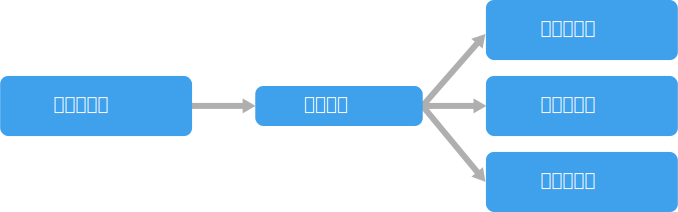
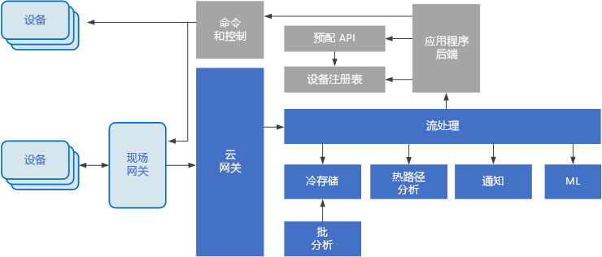

# 事件驱动的体系结构样式Event-driven architecture style

事件驱动的体系结构由生成事件流的事件生成者和侦听事件的事件使用者组成。An event-driven architecture consists of **event producers** that generate a stream of events, and **event consumers** that listen for the events. 

事件可几乎实时发送，因此使用者可在事件发生时立即做出响应。Events are delivered in near real time, so consumers can respond immediately to events as they occur. 生成者脱离使用者 &mdash; 生成者不知道哪个使用者正在侦听。Producers are decoupled from consumers &mdash; a producer doesn't know which consumers are listening. 使用者之间也能彼此脱离，且每个使用者都能看到所有事件。Consumers are also decoupled from each other, and every consumer sees all of the events. 这与[使用者竞争][competing-consumers]模式不同，在此模式中，使用者从队列中拉取消息，且消息仅处理一次（假设没有错误）。This differs from a [Competing Consumers][competing-consumers] pattern, where consumers pull messages from a queue and a message is processed just once (assuming no errors). 在某些系统中（例如 IoT），必须大量引入事件。In some systems, such as IoT, events must be ingested at very high volumes.

事件驱动的体系结构可以使用发布/订阅模式或事件流模式。An event driven architecture can use a pub/sub model or an event stream model. 

- **发布/订阅**：消息传递基础结构会跟踪订阅。**Pub/sub**: The messaging infrastructure keeps track of subscriptions. 事件发布后，它会将事件发送给每位订阅者。When an event is published, it sends the event to each subscriber. 事件在接收后，便无法重播，新订阅者也看不见此事件。After an event is received, it cannot be replayed, and new subscribers do not see the event. 

- **事件流式处理**：事件会写入日志。**Event streaming**: Events are written to a log. 事件是（在分区中）经过严格排序的，而且具有持久性。Events are strictly ordered (within a partition) and durable. 客户端不会订阅流，但是客户端可以读取该流的任何部分。Clients don't subscribe to the stream, instead a client can read from any part of the stream. 客户端负责提升它在流中的位置。The client is responsible for advancing its position in the stream. 这意味着客户端可以随时加入，并可以重播事件。That means a client can join at any time, and can replay events.

在使用者端，有一些常见的变化：On the consumer side, there are some common variations:

- **简单事件处理**。**Simple event processing**. 事件会立即触发使用者中的某项操作。An event immediately triggers an action in the consumer. 例如，可以将 Azure Functions 与服务总线触发器配合使用，每当消息发布到服务总线主题后，函数便开始执行。For example, you could use Azure Functions with a Service Bus trigger, so that a function executes whenever a message is published to a Service Bus topic.

- **复杂事件处理**。**Complex event processing**. 使用者使用 Azure 流分析或 Apache Storm 之类的技术处理一系列事件，寻找事件数据中的模式。A consumer processes a series of events, looking for patterns in the event data, using a technology such as Azure Stream Analytics or Apache Storm. 例如，如果移动平均超过特定阈值，便可聚合在某个时间范围内从嵌入式设备读取的信息，并生成通知。For example, you could aggregate readings from an embedded device over a time window, and generate a notification if the moving average crosses a certain threshold. 

- **事件流处理**。**Event stream processing**. 使用 Azure IoT 中心或 Apache Kafka 等数据流平台作为管道引入事件并将其馈送到流处理器。Use a data streaming platform, such as Azure IoT Hub or Apache Kafka, as a pipeline to ingest events and feed them to stream processors. 此流处理器可处理或转换流。The stream processors act to process or transform the stream. 不同应用程序子系统可能有多种流处理器。There may be multiple stream processors for different subsystems of the application. 此方法非常适合 IoT 工作负荷。This approach is a good fit for IoT workloads.

事件可能来源于系统之外，例如 IoT 解决方案中的物理设备。The source of the events may be external to the system, such as physical devices in an IoT solution. 在这种情况下，系统必须能够以数据源需要的容量和吞吐量来引入数据。In that case, the system must be able to ingest the data at the volume and throughput that is required by the data source.

在上面的逻辑图中，每种类型的使用者都显示为单个框。In the logical diagram above, each type of consumer is shown as a single box. 实际情况中通常有多个使用者实例，可避免使用者成为系统中的单点故障。In practice, it's common to have multiple instances of a consumer, to avoid having the consumer become a single point of failure in system. 处理事件的容量和频率可能还需要多个实例。Multiple instances might also be necessary to handle the volume and frequency of events. 此外，单个使用者可以处理多个线程上的事件。Also, a single consumer might process events on multiple threads. 如果必须按照顺序处理事件，或者需要“恰一次”语义，这就会带来一些挑战。This can create challenges if events must be processed in order, or require exactly-once semantics. 请参阅[尽量减少协调][minimize-coordination]。See [Minimize Coordination][minimize-coordination]. 

## 何时使用此体系结构When to use this architecture

- 多个子系统必须处理相同的事件。Multiple subsystems must process the same events. 
- 延迟时间最短的实时处理。Real-time processing with minimum time lag.
- 复杂事件处理，如模式匹配或时间范围内的聚合。Complex event processing, such as pattern matching or aggregation over time windows.
- 大量且快速的数据，如 IoT。High volume and high velocity of data, such as IoT.

## 优点Benefits

- 生成者和使用者相脱离。Producers and consumers are decoupled.
- 没有点到点的集成。No point-to point-integrations. 容易向系统添加新使用者。It's easy to add new consumers to the system.
- 使用者在事件发生时便可立即响应。Consumers can respond to events immediately as they arrive. 
- 具有高缩放性，分布广泛。Highly scalable and distributed. 
- 子系统具有独立的事件流视图。Subsystems have independent views of the event stream.

## 挑战Challenges

- 有保证的传递。Guaranteed delivery. 在某些系统中，尤其是在 IoT 方案中，保证数据传递至关重要。In some systems, especially in IoT scenarios, it's crucial to guarantee that events are delivered.
- 按顺序或者“恰一次”处理事件。Processing events in order or exactly once. 每种使用者类型通常都在多个实例中运行，以提供复原能力和可伸缩性。Each consumer type typically runs in multiple instances, for resiliency and scalability. 如果必须按顺序（在使用者类型中）处理事件，或处理逻辑不是幂等的，就会带来挑战。This can create a challenge if the events must be processed in order (within a consumer type), or if the processing logic is not idempotent.

## IoT 体系结构IoT architecture

事件驱动的体系结构是 IoT 解决方案的中心环节。Event-driven architectures are central to IoT solutions. 下列图表显示 IoT 可能出现的逻辑体系结构。The following diagram shows a possible logical architecture for IoT. 此图表强调体系结构的事件流式传输组件。The diagram emphasizes the event-streaming components of the architecture.

云网关使用可靠、低延迟的消息传递系统在云边界引入设备事件。The **cloud gateway** ingests device events at the cloud boundary, using a reliable, low latency messaging system.

设备可能会直接将事件发送到云网关，或通过现场网关发送。Devices might send events directly to the cloud gateway, or through a **field gateway**. 现场网关是一种专用设备或软件，通常与接收事件并将事件转接到云网关的设备位于同一位置。A field gateway is a specialized device or software, usually colocated with the devices, that receives events and forwards them to the cloud gateway. 现场网关也可预处理原始设备事件，执行过滤、聚合或协议转换等功能。The field gateway might also preprocess the raw device events, performing functions such as filtering, aggregation, or protocol transformation.

引入后，事件将通过一个或多个流处理器，此处理器可将数据路由到存储等位置，也可执行分析和其他处理。After ingestion, events go through one or more **stream processors** that can route the data (for example, to storage) or perform analytics and other processing.

下面是一些常见的处理类型。The following are some common types of processing. （此列表并未囊括所有类型。）(This list is certainly not exhaustive.)

- 将事件数据写入冷存储，用于存档或批处理分析。Writing event data to cold storage, for archiving or batch analytics.

- 热路径分析，实时（或近乎实时）分析事件流，以检测异常，识别滚动时间范围内的模式，或者在流中出现特殊情况时触发警报。Hot path analytics, analyzing the event stream in (near) real time, to detect anomalies, recognize patterns over rolling time windows, or trigger alerts when a specific condition occurs in the stream. 

- 处理设备中特殊类型的非遥测消息，例如通知和警报。Handling special types of non-telemetry messages from devices, such as notifications and alarms. 

- 机器学习。Machine learning.

具有灰色阴影的框表示 IoT 系统的组件，虽然这些组件与事件流式传输没有直接关系，但为了完整起见，仍在此处提出。The boxes that are shaded gray show components of an IoT system that are not directly related to event streaming, but are included here for completeness.

- 设备注册表是预配设备的数据库，包括设备 ID 和常见的设备元数据，如位置信息。The **device registry** is a database of the provisioned devices, including the device IDs and usually device metadata, such as location.

- 预配 API 是一种常见的外部接口，用于预配和注册新设备。The **provisioning API** is a common external interface for provisioning and registering new devices.

- 某些 IoT 解决方案可使命令和控制消息发送到设备。Some IoT solutions allow **command and control messages** to be sent to devices.

> 本部分介绍了 IoT 的极高级别视图，需要考虑许多细微问题和挑战。This section has presented a very high-level view of IoT, and there are many subtleties and challenges to consider. 要获取更为详细的参考体系结构和讨论，请参阅 [Microsoft Azure IoT 参考体系结构][iot-ref-arch]（PDF 下载）。For a more detailed reference architecture and discussion, see the [Microsoft Azure IoT Reference Architecture][iot-ref-arch] (PDF download).

 <!-- links -->

[competing-consumers]: ../../patterns/competing-consumers.md
[iot-ref-arch]: https://azure.microsoft.com/updates/microsoft-azure-iot-reference-architecture-available/
[minimize-coordination]: ../design-principles/minimize-coordination.md

