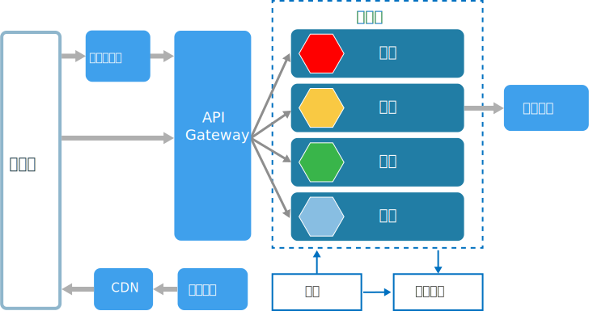
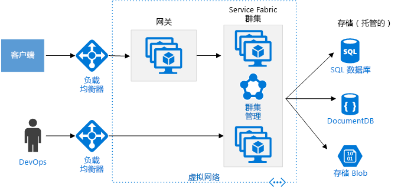

# 微服务体系结构样式Microservices architecture style

微服务体系结构由一系列小型的自治服务组成。A microservices architecture consists of a collection of small, autonomous services. 每个服务都是自包含服务，并且应实现单个业务功能。Each service is self-contained and should implement a single business capability. 有关在 Azure 上构建微服务体系结构的详细指导，请参阅[在 Azure 中设计、构建和操作微服务](../../microservices/index.md)。For detailed guidance about building a microservices architecture on Azure, see [Designing, building, and operating microservices on Azure](../../microservices/index.md).

 
在某些方面，微服务是面向服务的体系结构 (SOA) 的自然演变，但微服务与 SOA 之间也存在一些差异。In some ways, microservices are the natural evolution of service oriented architectures (SOA), but there are differences between microservices and SOA. 下面是微服务的一些典型特征：Here are some defining characteristics of a microservice:

- 在微服务体系结构中，服务具有规模小、独立和松散耦合的特点。In a microservices architecture, services are small, independent, and loosely coupled.

- 每个服务都是一个单独的基本代码，可由小型开发团队管理。Each service is a separate codebase, which can be managed by a small development team.

- 服务可独立部署。Services can be deployed independently. 团队可以更新现有服务，而无需重新生成和重新部署整个应用程序。A team can update an existing service without rebuilding and redeploying the entire application.

- 服务负责暂留自己的数据或外部状态。Services are responsible for persisting their own data or external state. 这一点与传统模型不同，后者由单独的数据层处理数据暂留。This differs from the traditional model, where a separate data layer handles data persistence.

- 服务通过定义完善的 API 相互通信。Services communicate with each other by using well-defined APIs. 每个服务的内部实现细节均对其他服务隐藏。Internal implementation details of each service are hidden from other services.

- 服务无需共享相同的技术堆栈、库或框架。Services don't need to share the same technology stack, libraries, or frameworks.

除了服务本身，典型微服务体系结构中还会出现其他组件：Besides for the services themselves, some other components appear in a typical microservices architecture:

**管理**。**Management**. 管理组件负责将服务放置在节点上、标识故障、跨节点重新平衡服务等等。The management component is responsible for placing services on nodes, identifying failures, rebalancing services across nodes, and so forth.  

**服务发现**。**Service Discovery**.  维护一个包含服务及其所在节点的列表。Maintains a list of services and which nodes they are located on. 支持使用服务查找功能查找服务的终结点。Enables service lookup to find the endpoint for a service. 

**API 网关**。**API Gateway**. API 网关是客户端的入口点。The API gateway is the entry point for clients. 客户端不直接调用服务，Clients don't call services directly. 而是调用 API 网关，网关再将调用转发到后端上的相应服务。Instead, they call the API gateway, which forwards the call to the appropriate services on the back end. API 网关可以聚合来自多个服务的响应，并返回聚合的响应。The API gateway might aggregate the responses from several services and return the aggregated response. 

使用 API 网关的优点如下：The advantages of using an API gateway include:

- 它分离了客户端与服务。It decouples clients from services. 无需更新所有客户端，便可对服务进行版本控制或重构。Services can be versioned or refactored without needing to update all of the clients.

-  服务可以使用对 Web 不友好的消息传递协议，比如 AMQP。Services can use messaging protocols that are not web friendly, such as AMQP.

- API 网关可执行身份验证、日志记录、SSL 终止和负载均衡等其他跨领域功能。The API Gateway can perform other cross-cutting functions such as authentication, logging, SSL termination, and load balancing.

## 何时使用此体系结构When to use this architecture

请对以下情况考虑使用此体系结构样式：Consider this architecture style for:

- 需要较高发布速度的大型应用程序。Large applications that require a high release velocity.

- 需要高度可缩放的复杂应用程序。Complex applications that need to be highly scalable.

- 具有大量域或多个子域的应用程序。Applications with rich domains or many subdomains.

- 由小型开发团队组成的组织。An organization that consists of small development teams.

## 优点Benefits 

- **独立部署**。**Independent deployments**. 无需重新部署整个应用程序便可更新服务，出现问题时可回滚或前滚更新。You can update a service without redeploying the entire application, and roll back or roll forward an update if something goes wrong. Bug 修复和功能发布更易管理，风险更低。Bug fixes and feature releases are more manageable and less risky.

- **独立开发**。**Independent development**. 单个开发团队便可生成、测试和部署服务，A single development team can build, test, and deploy a service. 从而推动持续创新，加快发布节奏。The result is continuous innovation and a faster release cadence. 

- **小型专属团队**。**Small, focused teams**. 团队可专注于一个服务。Teams can focus on one service. 缩小每个服务的范围后，基本代码变得更好理解，新的团队成员也能更快上手。The smaller scope of each service makes the code base easier to understand, and it's easier for new team members to ramp up.

- **错误隔离**。**Fault isolation**. 某个服务中断不会影响整个应用程序。If a service goes down, it won't take out the entire application. 但是，这并不意味着用户可以无偿复原。However, that doesn't mean you get resiliency for free. 用户仍需遵循复原最佳做法和设计模式。You still need to follow resiliency best practices and design patterns. 请参阅[设计适用于 Azure 的可复原应用程序][resiliency-overview]。See [Designing resilient applications for Azure][resiliency-overview].

- **混合技术堆栈**。**Mixed technology stacks**. 团队可选取最适合其服务的技术。Teams can pick the technology that best fits their service. 

- **精细缩放**。**Granular scaling**. 服务可独立缩放。Services can be scaled independently. 与此同时，每个 VM 的较高服务密度也意味着 VM 资源得到充分利用。At the same time, the higher density of services per VM means that VM resources are fully utilized. 使用放置约束，可将服务与 VM 配置文件（高 CPU、高内存等等）匹配。Using placement constraints, a services can be matched to a VM profile (high CPU, high memory, and so on).

## 挑战Challenges

- **复杂性**。**Complexity**. 与同等的单一式应用程序相比，微服务应用程序具有更多移动部件。A microservices application has more moving parts than the equivalent monolithic application. 每个服务更简单，但整个系统作为整体来说更复杂。Each service is simpler, but the entire system as a whole is more complex.

- **开发和测试**。**Development and test**. 针对服务依赖关系的开发需要采用不同的方法。Developing against service dependencies requires a different approach. 现有工具不一定能处理这些服务依赖关系。Existing tools are not necessarily designed to work with service dependencies. 跨服务边界进行重构可能很困难。Refactoring across service boundaries can be difficult. 测试服务依赖关系也有一定难度，尤其是在应用程序快速发展之时。It is also challenging to test service dependencies, especially when the application is evolving quickly.

- **缺乏监管**。**Lack of governance**. 用于生成微服务的分散式方法具有一定优势，但也可能导致许多问题。The decentralized approach to building microservices has advantages, but it can also lead to problems. 用户在生成过程中可能采用了许多不同的语言和框架，从而使应用程序变得难以维护。You may end up with so many different languages and frameworks that the application becomes hard to maintain. 这种情况下可以实施一些项目范围内的标准，不过分限制团队的灵活性。It may be useful to put some project-wide standards in place, without overly restricting teams' flexibility. 这尤其适用于日志记录等跨领域功能。This especially applies to cross-cutting functionality such as logging.

- **网络拥塞和延迟**。**Network congestion and latency**. 使用大量小型的精细服务可能会增加服务间的通信量。The use of many small, granular services can result in more interservice communication. 此外，如果服务依赖关系链变得太长（服务 A 调用 B，B 调用 C...），额外延迟可能会成为一个问题。Also, if the chain of service dependencies gets too long (service A calls B, which calls C...), the additional latency can become a problem. 用户需要精心设计 API。You will need to design APIs carefully. 应避免过于繁琐的 API，考虑使用序列化格式，并找到可以使用异步通信模式的地方。Avoid overly chatty APIs, think about serialization formats, and look for places to use asynchronous communication patterns.

- **数据完整性**。**Data integrity**. 每个微服务负责自己的数据暂留。With each microservice responsible for its own data persistence. 因此，数据一致性可能是个挑战。As a result, data consistency can be a challenge. 如果可能，请采用最终一致性。Embrace eventual consistency where possible.

- **管理**。**Management**. 成功使用微服务需要有成熟的 DevOps 区域性。To be successful with microservices requires a mature DevOps culture. 跨服务的关联日志记录可能很难。Correlated logging across services can be challenging. 通常情况下，日志记录必须为单个用户操作关联多个服务调用。Typically, logging must correlate multiple service calls for a single user operation.

- **版本控制**。**Versioning**. 对某个服务的更新不应中断依赖于它的其他服务。Updates to a service must not break services that depend on it. 多个服务可在任意给定时间更新，因此，若不精心设计，可能会遇到向后或向前兼容性问题。Multiple services could be updated at any given time, so without careful design, you might have problems with backward or forward compatibility.

- **技能组合**。**Skillset**. 微服务是一种高度分布式系统。Microservices are highly distributed systems. 请仔细评估团队是否具有成功使用微服务所需的技能和经验。Carefully evaluate whether the team has the skills and experience to be successful.

## 最佳实践Best practices

- 围绕业务域对服务建模。Model services around the business domain. 

- 分散所有资源。Decentralize everything. 单个团队负责设计和生成服务。Individual teams are responsible for designing and building services. 避免共享代码或数据架构。Avoid sharing code or data schemas. 

- 拥有数据的服务应当有专用的数据存储。Data storage should be private to the service that owns the data. 为每个服务和数据类型使用最合适的存储。Use the best storage for each service and data type. 

- 服务通过设计完善的 API 进行通信。Services communicate through well-designed APIs. 避免泄露实现细节。Avoid leaking implementation details. API 应对域建模，而不是对服务的内部实现建模。APIs should model the domain, not the internal implementation of the service.

- 避免服务之间耦合。Avoid coupling between services. 耦合的原因包括共享的数据库架构和严格的通信协议。Causes of coupling include shared database schemas and rigid communication protocols.

- 将身份验证和 SSL 终止等跨领域操作分流到网关。Offload cross-cutting concerns, such as authentication and SSL termination, to the gateway.

- 让网关不必了解域。Keep domain knowledge out of the gateway. 网关应处理和路由客户端请求，而无需了解业务规则或域逻辑。The gateway should handle and route client requests without any knowledge of the business rules or domain logic. 否则，网关会变成一个从属物，从而导致服务之间耦合。Otherwise, the gateway becomes a dependency and can cause coupling between services.

- 服务应具有松散耦合和高功能内聚的特点。Services should have loose coupling and high functional cohesion. 应当将可能会一起更改的函数打包并部署在一起。Functions that are likely to change together should be packaged and deployed together. 如果它们驻留在不同的服务中，这些服务最终会紧密耦合，因为一个服务中的更改将需要更新其他服务。If they reside in separate services, those services end up being tightly coupled, because a change in one service will require updating the other service. 两个服务之间的通信过于频繁可能是紧密耦合和低内聚的征兆。Overly chatty communication between two services may be a symptom of tight coupling and low cohesion. 

- 隔离故障。Isolate failures. 使用复原策略可防止某个服务中的故障级联。Use resiliency strategies to prevent failures within a service from cascading. 请参阅[复原模式][resiliency-patterns]和[设计可复原应用程序][resiliency-overview]。See [Resiliency patterns][resiliency-patterns] and [Designing resilient applications][resiliency-overview].

## 使用 Azure 容器服务的微服务Microservices using Azure Container Service 

可以使用 [Azure 容器服务](/azure/container-service/)来配置和预配 Docker 群集。You can use [Azure Container Service](/azure/container-service/) to configure and provision a Docker cluster. Azure 容器服务支持多种常用容器业务流程协调程序，包括 Kubernetes、DC/OS 和 Docker Swarm。Azure Container Services supports several popular container orchestrators, including Kubernetes, DC/OS, and Docker Swarm.

 
**公共节点**。**Public nodes**. 这些节点可通过面向公众的负载均衡器访问。These nodes are reachable through a public-facing load balancer. API 网关就托管在这些节点上。The API gateway is hosted on these nodes.

**后端节点**。**Backend nodes**. 这些节点运行客户端通过 API 网关访问的服务。These nodes run services that clients reach via the API gateway. 这些节点不直接接收 Internet 流量。These nodes don't receive Internet traffic directly. 后端节点可包含多个 VM 池，每个池都有一个不同的硬件配置文件。The backend nodes might include more than one pool of VMs, each with a different hardware profile. 例如，可为常规计算工作负载、高 CPU 工作负载和高内存工作负载分别创建不同的池。For example, you could create separate pools for general compute workloads, high CPU workloads, and high memory workloads. 

**管理 VM**。**Management VMs**. 这些 VM 运行容器业务流程协调程序的主节点。These VMs run the master nodes for the container orchestrator. 

**网络**。**Networking**. 公共节点、后端节点和管理 VM 放置在同一虚拟网络 (VNet) 内的不同子网中。The public nodes, backend nodes, and management VMs are placed in separate subnets within the same virtual network (VNet). 

**负载均衡器**。**Load balancers**.  一个面向外部的负载均衡器位于公共节点前面。An externally facing load balancer sits in front of the public nodes. 它将 Internet 请求分布到公共节点。It distributes internet requests to the public nodes. 另一个负载均衡器放在管理 VM 前面，以允许使用 NAT 规则将安全外壳 (ssh) 流量发送到管理 VM。Another load balancer is placed in front of the management VMs, to allow secure shell (ssh) traffic to the management VMs, using NAT rules.

为了实现可靠性和可伸缩性，会跨多个 VM 复制每个服务。For reliability and scalability, each service is replicated across multiple VMs. 但是，由于服务也相对轻量（相比单一式应用程序），因此，通常会将多个服务打包到一个 VM 中。However, because services are also relatively lightweight (compared with a monolithic application), multiple services are usually packed into a single VM. 密度越高意味着资源利用率越高。Higher density allows better resource utilization. 如果某个服务不使用大量资源，则无需专门使用整个 VM 来运行该服务。If a particular service doesn't use a lot of resources, you don't need to dedicate an entire VM to running that service.

下图展示运行四个不同服务（由不同的形状表示）的三个节点。The following diagram shows three nodes running four different services (indicated by different shapes). 请注意，每个服务至少有两个实例。Notice that each service has at least two instances. 
 

## 使用 Azure Service Fabric 的微服务Microservices using Azure Service Fabric

下图展示使用 [Azure Service Fabric](/azure/service-fabric/) 的微服务体系结构。The following diagram shows a microservices architecture using [Azure Service Fabric](/azure/service-fabric/).

Service Fabric 群集部署到一个或多个 VM 规模集。The Service Fabric cluster is deployed to one or more VM scale sets. 你的群集中可能有多个 VM 规模集，以便包含各种 VM 类型。You might have more than one VM scale set in the cluster, in order to have a mix of VM types. API 网关放在 Service Fabric 群集前面，由一个外部负载均衡器接收客户端请求。An API Gateway is placed in front of the Service Fabric cluster, with an external load balancer to receive client requests.

Service Fabric 运行时执行群集管理，包括服务放置、节点故障转移和运行状况监视。The Service Fabric runtime performs cluster management, including service placement, node failover, and health monitoring. 该运行时部署于群集节点自身。The runtime is deployed on the cluster nodes themselves. 这里没有一组单独的群集管理 VM。There isn't a separate set of cluster management VMs.

服务使用 Service Fabric 内置的反向代理相互通信。Services communicate with each other using the reverse proxy that is built into Service Fabric. Service Fabric 提供发现服务，可用于解析指定服务的终结点。Service Fabric provides a discovery service that can resolve the endpoint for a named service.

<!-- links -->

[resiliency-overview]: ../../resiliency/index.md
[resiliency-patterns]: ../../patterns/category/resiliency.md

