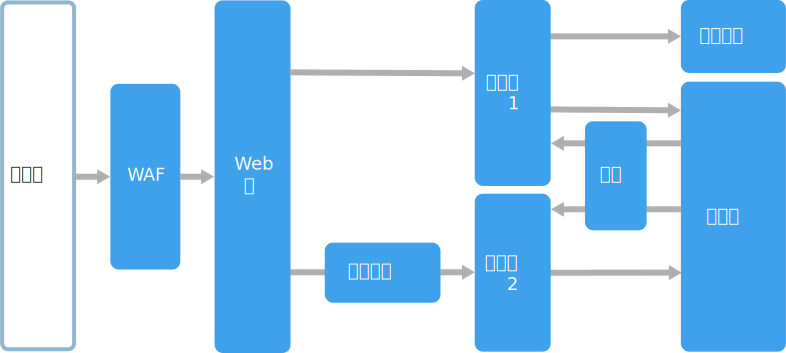
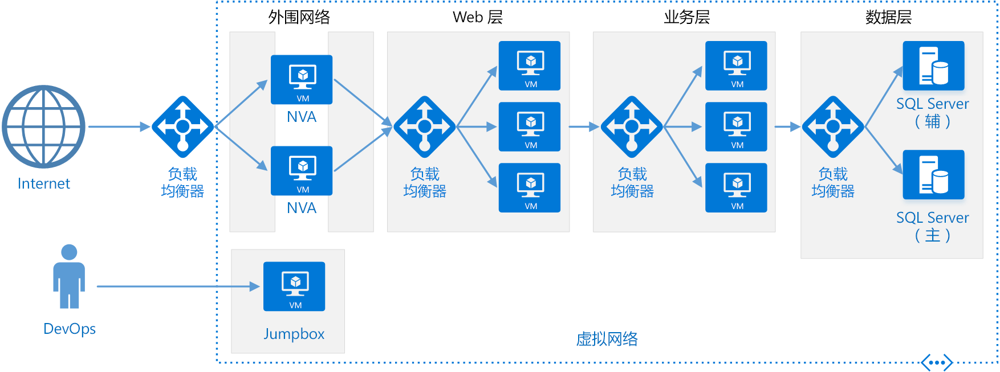

# N 层体系结构样式

N 层体系结构将应用程序分成逻辑层和物理层。 

层是分离职责和管理依赖关系的方式。 每个层都有特定的责任。 较高层可使用较低层中的服务，反之则不行。 

层在物理上是分隔开的，在不同的计算机上运行。 一个层可直接调用另一个层，或使用异步消息传递（消息队列）。 虽然每个层可能托管在自己的层中，但这并不是必需的。 多个层可能托管在同一层上。 在物理上分隔层可以提高可伸缩性和复原能力，但因额外的网络通信也增加了延迟。 

传统的三层应用程序有表示层、中间层和数据库层。 中间层是可选的。 更复杂的应用程序可以多于三层。 上图显示具有两个中间层，且封装了不同功能区域的应用程序。 

N 层应用程序可以有封闭的层体系结构或开放的层体系结构：

- 在封闭的层体系结构中，层只能调用紧邻的下一层。 
- 在开放的层体系结构中，层可以调用它下面的任何层。 

封闭的层体系结构限制层之间的依赖关系。 但是，如果一个层仅将请求传递到下一层，可能会产生不必要的流量。 

## 此体系结构适用的情况

N 层体系结构通常作为服务架构 (IaaS) 应用程序实现，每个层都在独立的 VM 集中运行。 然而，N 层应用程序不需要只是 IaaS。 通常，对体系结构的某些部分使用托管服务是有利的，特别是缓存、消息传递和数据存储。

请考虑将 N 层体系结构用于：

- 简单的 Web 应用程序。 
- 将本地应用程序迁移到 Azure 并进行最小的重构。
- 统一开发本地和云应用程序。

N 层体系结构在传统的本地应用程序中很常见，因此将现有工作负载迁移到 Azure 是很适合的。

## 优点

- 云与本地之间，云平台之间具有可移植性。
- 对于大多数开发者来说，学习曲线较少。
- 从传统应用程序模型自然演变。
- 对异构环境 (Windows/Linux) 开放

## 挑战

- 很容易到最后，中间层仅对数据库执行 CRUD 操作，增加额外延迟，但又不完成任何有用的工作。 
- 单一式设计阻止了独立部署各项功能。
- 管理 IaaS 应用程序的工作量要大于管理只使用托管服务的应用程序。 
- 管理大型系统中的网络安全比较困难。

## 最佳实践

- 使用自动缩放处理负载中的更改。 请参阅[自动缩放的最佳做法][autoscaling]。
- 使用异步消息传递来分离层。
- 缓存半静态数据。 请参阅[缓存的最佳做法][caching]。
- 请使用 [SQL Server Always On 可用性组][sql-always-on]等解决方案配置高可用性的数据层。
- 在前端和 Internet 之间放置 Web 应用程序防火墙 (WAF)。
- 将每个层放置在自己的子网中，并将子网用作安全边界。 
- 通过仅允许来自中间层的请求，限制对数据层的访问。

## 虚拟机上的 N 层体系结构

本部分介绍在 VM 上运行的建议的 N 层体系结构。 

每个层包含两个或多个 VM，它们放置在可用性集或 VM 规模集中。 如果一个 VM 失败，多个 VM 可以提供复原能力。 负载均衡器用于将请求分布到一个层中的 VM 上。 通过向池添加更多 VM 可以水平缩放层。 

每个层也放置在自己的子网中，这意味着它们的内部 IP 地址在同一个地址范围内。 这样可以容易地应用网络安全组 (NSG) 规则，并将表路由到各个层。

Web 和业务层是无状态的。 任何 VM 都可以处理该层的任何请求。 数据层应该包含复制的数据库。 对于 Windows，我们推荐 SQL Server，使用 Always On 可用性组实现高可用性。 对于 Linux，请选择支持复制的数据库，例如 Apache Cassandra。 

网络安全组 (NSG) 限制对每个层的访问。 例如，数据库层仅允许来自业务层的访问。

有关更多详细信息和可部署的资源管理器模板，请参阅以下参考体系结构：

- [运行用于 N 层应用程序的 Windows VM][n-tier-windows]
- [运行用于 N 层应用程序的 Linux VM][n-tier-linux]

### 其他注意事项

- N 层体系结构不限于三层。 对于更复杂的应用程序，通常会有更多层。 在这种情况下，请考虑使用第 7 层路由将请求路由到特定的层。

- 层是可伸缩性、可靠性和安全性的边界。 请考虑为这些区域中有不同需求的服务提供单独的层。

- 使用 VM 规模集进行自动缩放。

- 在体系结构中寻找可以使用托管服务而无需进行大量重构的位置。 具体来说，就是缓存、消息传递、存储和数据库。 

- 为了提高安全性，请在应用程序前放置网络 DMZ。 DMZ 包括防火墙和数据包检查等实现安全功能的网络虚拟设备 (NVA)。 有关详细信息，请参阅[网络 DMZ 参考体系结构][dmz]。

- 为实现高可用性，请在可用性集中放置两个或多个 NVA，并使用外部负载均衡器在实例间分布 Internet 请求。 有关详细信息，请参阅[部署高可用性网络虚拟设备][ha-nva]。

- 不允许将 RDP 或 SSH 访问定向到正在运行应用程序代码的 VM。 相反，运算符应登录到 jumpbox，也称为壁垒主机。 这是管理员在网络上用来连接其他 VM 的 VM。 jumpbox 中有一个 NSG，它仅允许来自已批准的公共 IP 地址的 RDP 或 SSH。

- 可使用站点到站点虚拟专用网络 (VPN) 或 Azure ExpressRoute，将 Azure 虚拟网络扩展到本地网络。 有关详细信息，请参阅[混合网络参考体系结构][hybrid-network]。

- 如果组织使用 Active Directory 管理标识，建议将 Active Directory 环境扩展到 Azure VNet。 有关详细信息，请参阅[标识管理参考体系结构][identity]。

- 如果需要比 VM 提供的 Azure SLA 更高的可用性，可以跨两个区域复制应用程序，并使用 Azure 流量管理器进行故障转移。 有关详细信息，请参阅[在多个区域中运行 Windows VM][multiregion-windows] 或[在多个区域中运行 Linux VM][multiregion-linux]。

[autoscaling]: ../../best-practices/auto-scaling.md
[caching]: ../../best-practices/caching.md
[dmz]: ../../reference-architectures/dmz/index.md
[ha-nva]: ../../reference-architectures/dmz/nva-ha.md
[hybrid-network]: ../../reference-architectures/hybrid-networking/index.md
[identity]: ../../reference-architectures/identity/index.md
[multiregion-linux]: ../../reference-architectures/virtual-machines-linux/multi-region-application.md
[multiregion-windows]: ../../reference-architectures/virtual-machines-windows/multi-region-application.md
[n-tier-linux]: ../../reference-architectures/virtual-machines-linux/n-tier.md
[n-tier-windows]: ../../reference-architectures/virtual-machines-windows/n-tier.md
[sql-always-on]: /sql/database-engine/availability-groups/windows/always-on-availability-groups-sql-server