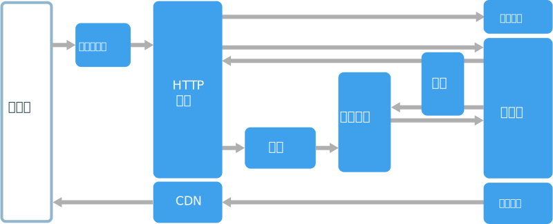

# Web 队列辅助角色体系结构样式

该体系结构的核心组件是处理客户端请求的 Web 前端和执行资源密集型任务、长时间运行的工作流或批处理作业的辅助角色。  Web 前端通过消息队列与辅助角色进行通信。  

通常合并到该体系结构中的其他组件包括：

- 一个或多个数据库。 
- 存储来自数据库的值以便快速读取的缓存。
- 提供静态内容的 CDN
- 远程服务，如电子邮件或 SMS 服务。 这些通常由第三方提供。
- 用于身份验证的标识提供程序。

Web 和辅助角色都无状态。 会话状态可以存储在分布式缓存中。 任何长时间运行的工作都由辅助角色异步完成。 辅助角色可以由队列上的消息触发，或者在用于批处理的计划上运行。 辅助角色是一个可选组件。 如果没有任何长时间运行的操作，则可以省略辅助角色。  

前端可能包括 Web API。 在客户端上，Web API 可以由进行 AJAX 调用的单页应用程序或者本机客户端应用程序使用。

## 此体系结构适用的情况

通常使用托管的计算服务（Azure App Service 或 Azure 云服务）实施 Web 队列辅助角色体系结构。 

请对以下情况考虑使用此体系结构样式：

- 具有相对简单的域的应用程序。
- 具有某些长时间的工作流或批处理操作的应用程序。
- 想要使用托管的服务而不是服务架构 (IaaS) 时。

## 优点

- 体系结构相对简单，易于理解。
- 易于部署和管理。
- 清晰的关注点分离。
- 使用异步消息将前端从辅助角色中分离。
- 前端和辅助角色可以独立缩放。

## 挑战

- 如果没有经过仔细设计，前端和辅助角色可能变成难以维护和更新的庞大组件。
- 如果前端和辅助角色共享数据架构或代码模块，可能会有隐藏依赖项。 

## 最佳实践

- 向客户端公开经过良好设计的 API。 请参阅 [API 设计最佳做法][api-design]。
- 自动缩放以处理负载的更改。 请参阅[自动缩放的最佳做法][autoscaling]。
- 缓存半静态数据。 请参阅[缓存的最佳做法][caching]。
- 使用 CDN 来托管静态内容。 请参阅 [CDN 最佳做法][cdn]。
- 适当时使用混合持久性。 请参阅[为作业使用最佳数据存储][polyglot]。
- 分区数据，可提高可伸缩性、减少争用以及优化性能。 请参阅[数据分区最佳做法][data-partition]。

## Azure App Service 上的 Web 队列辅助角色

本部分介绍使用 Azure App Service 的建议的 Web 队列辅助角色体系结构。 

Azure App Service Web 应用作为前端实现，辅助角色作为 Web 作业实现。 Web 应用和 Web 作业都与提供 VM 实例的应用服务计划相关联。 

可以为消息队列使用 Azure 服务总线或 Azure 存储队列。 （该图显示了 Azure 存储队列。）

Azure Redis 缓存存储会话状态和需要低延迟访问的其他数据。

Azure CDN 用于缓存静态内容，如映像、CSS 或 HTML。

对于存储，请选择最符合应用程序需要的存储技术。 可能使用多个存储技术（混合持久性）。 为了说明这一点，该图显示了 Azure SQL 数据库和 Azure Cosmos DB。  

有关详细信息，请参阅[应用服务 Web 应用程序参考结构][scalable-web-app]。

### 其他注意事项

- 并不是每个事务都必须经过队列和辅助角色才能存储。 Web 前端可以直接执行简单的读取/写入操作。 辅助角色设计用于资源密集型任务或长时间运行的工作流。 在某些情况下，可能根本不需要辅助角色。

- 使用应用服务的内置自动缩放功能来扩大 VM 实例数。 如果应用程序上的负载遵循可预测的模式，请使用基于计划的自动缩放。 如果负载是不可预测的，请使用基于指标的自动缩放规则。      

- 请考虑将 Web 应用和 Web 作业放入单独的应用服务计划中。 这样，它们就托管在单独的 VM 实例上，并可以独立缩放。 

- 使用单独的应用服务计划进行生产和测试。 否则，如果使用同一计划进行生产和测试，则说明测试正在生产 VM 上运行。

- 使用部署槽位以管理部署。 这使你可以将更新的版本部署到过渡槽，然后切换到新版本。 如果更新时出现问题，这也使你可以切换回上一版本。

<!-- links -->

[api-design]: ../../best-practices/api-design.md
[autoscaling]: ../../best-practices/auto-scaling.md
[caching]: ../../best-practices/caching.md
[cdn]: ../../best-practices/cdn.md
[data-partition]: ../../best-practices/data-partitioning.md
[polyglot]: ../design-principles/use-the-best-data-store.md
[scalable-web-app]: ../../reference-architectures/app-service-web-app/scalable-web-app.md