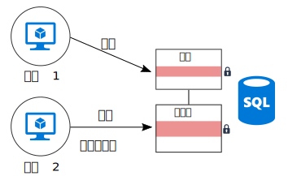
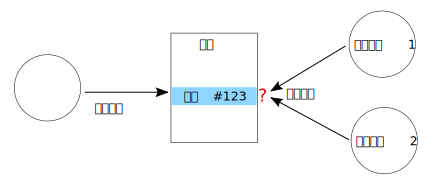

# 最大程度减少协调 

## 最大程度减少应用程序服务之间的协调以获得可伸缩性

大多数云应用程序包含多个应用程序服务 &mdash; web 前端、数据库、业务流程、报告和分析等。 若要实现可伸缩性和可靠性，其中每一个服务都应在多个实例上运行。 

当两个实例尝试执行影响某种共享状态的并发操作时会发生什么？ 在某些情况下，须跨节点进行协调，例如保留 ACID 保证。 此图中，`Node2` 正在等待 `Node1` 释放数据库锁定：

协调限制了水平缩放的优点，且会形成瓶颈。 在此示例中，当横向扩展应用程序并添加更多实例时，锁定争用会增加。 而最糟的情况是前端实例将花费大部分时间等待锁定。

“仅一次”语义是发生协调的另一个常见原因。 例如，一个顺序必须仅处理一次。 两个辅助角色正在侦听新顺序。 `Worker1` 选取一个顺序进行处理。 应用程序须确保 `Worker2` 不会重复工作，并且如果 `Worker1` 崩溃，不会删除顺序。

可使用[计划程序代理监督程序][sas-pattern]等模式在辅助角色之间进行协调，但在这种情况下，采用对工作进行分区的方法可能更好。 每个辅助角色都分配有某范围的顺序（比如按照计费区域）。 如果某辅助角色故障，新的实例会在前一个实例停止的位置启用，但不会出现多个实例争用的情况。

## 建议

**实现最终一致性**。 分布数据时，需要协调来强制执行可靠的一致性保证。 例如，假设通过一项操作更新两个数据库。 最好系统能调节最终一致性（方法是在发生故障后，使用[补偿事务][compensating-transaction]模式进行逻辑回滚），而不是将其置于单个事务范围。

**使用域事件同步状态**。 [域事件][domain-event]是一种事件，可记录域中发生的重要事情。 关注的服务会侦听事件，而不是使用全局事务来协调多个服务。 如果使用此方法，系统必须允许最终一致性（请参阅上一项）。 

请考虑使用 CQRS 和事件源等模式。 这两种模式有助于减少读取工作负载和写入工作负载之间的争用。 

- [CQRS 模式][cqrs-pattern]将读取操作从写入操作中分离。 在某些实现中，读取数据通过物理方式从写入数据中分离。 

- 在[事件源模式][event-sourcing]中，状态更改作为一系列事件被记录到仅追加数据存储中。 将事件追加到流是一种原子操作，需要最小锁定。 

这两种模式互为补充。 如果 CQRS 中的只写存储使用事件源，则只读存储可以侦听相同的事件，以创建当前状态的可读快照（已针对查询进行优化）。 但是，在采用 CQRS 或事件源之前，请先了解此方法的难题。 有关详细信息，请参阅 [CQRS 体系结构样式][cqrs-style]。

**将数据分区**。  避免将所有数据放入一个由多个应用程序服务共享的数据架构中。 微服务体系结构通过使每个服务对自己的数据存储负责来强制执行这一原则。 在单个数据库中，将数据分区到不同分片可以提高并发性，因为写入到一个分片的服务不会影响写入其他分片的服务。

设计幂等操作。 如果可能，请将操作设计为幂等操作。 这样一来，可使用“至少一次”语义处理这些操作。 例如，可将工作项放入队列。 如果某辅助角色在操作期间故障，另一个辅助角色会选取此工作项。

使用异步并行处理。 如果某项操作需要多个异步执行的步骤（例如远程服务调用），可并行调用，然后聚合结果。 此方法假定每个步骤不依赖上一步的结果。   

如果可能，请使用乐观并发。 悲观并发控件使用数据库锁定来防止冲突。 这可能会导致性能不佳，可用性降低。 对于乐观并发控件，每个事务修改数据的副本或快照。 提交事务时，数据库引擎会验证事务并拒绝会影响数据库一致性的任何事务。 

通过[快照隔离][sql-snapshot-isolation]，Azure SQL 数据库和 SQL Server 支持乐观并发。 通过使用 [DocumentDB API][docdb-faq] 和 [Azure 存储][storage-concurrency]等 Etag，一些 Azure 存储服务支持乐观并发。

请考虑使用 MapReduce、其他并行或分布式算法。 根据要执行的工作的数据和类型，可将工作拆分为独立的任务，这些任务可以由并行工作的多个节点执行。 请参阅[大计算的体系结构样式][big-compute]。

使用领导选择进行协调。 如果需要协调操作，请确保协调器不会成为应用程序中的单一故障点。 使用[领导选择模式][leader-election]，一个实例始终是领导并充当协调器。 如果该领导失败，会选择新的实例作为领导。 
 

<!-- links -->

[big-compute]: ../architecture-styles/big-compute.md
[compensating-transaction]: ../../patterns/compensating-transaction.md
[cqrs-style]: ../architecture-styles/cqrs.md
[cqrs-pattern]: ../../patterns/cqrs.md
[docdb-faq]: /azure/documentdb/documentdb-faq
[domain-event]: https://martinfowler.com/eaaDev/DomainEvent.html
[event-sourcing]: ../../patterns/event-sourcing.md
[leader-election]: ../../patterns/leader-election.md
[sas-pattern]: ../../patterns/scheduler-agent-supervisor.md
[sql-snapshot-isolation]: /sql/t-sql/statements/set-transaction-isolation-level-transact-sql
[storage-concurrency]: https://azure.microsoft.com/blog/managing-concurrency-in-microsoft-azure-storage-2/