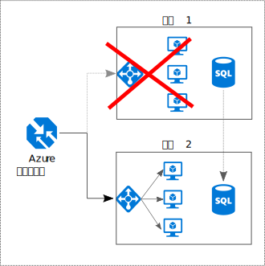

# 实现全面冗余

## 在应用程序中构建冗余，以避免出现单一故障点

有弹性的应用程序围绕故障路由。 标识应用程序中的关键路径。 该路径中的每个点是否都存在冗余？ 如果子系统出现故障，应用程序是否会故障转移到其他组件？

## 建议 

**考虑业务需求**。 在系统中生成的冗余量会影响成本和复杂度。 体系结构应反映业务需求，如恢复时间目标 (RTO)。 例如，多区域部署比单区域部署昂贵，其管理也更复杂。 需要使用操作过程处理故障转移和故障回复。 可能为一些业务方案（而不是其他方案）考虑额外的成本和复杂性。

**将 VM 放在负载均衡器之后**。 请勿将一个 VM 用于任务关键的工作负载。 而是将多个 VM 放置于负载均衡器之后。 如果任何 VM 变得不可用，负载均衡器会向其余正常运行的 VM 分配流量。 若要了解如何部署此配置，请参阅[用于提高可伸缩性和可用性的多个 VM][multi-vm-blueprint]。

**复制数据库**。 Azure SQL 数据库和 Cosmos DB 自动复制区域内的数据，且可以跨区域启用异地复制。 如果使用的是 IaaS 数据库解决方案，请选择支持复制和故障转移的解决方案，如 [SQL Server AlwaysOn 可用性组][sql-always-on]。 

**启用异地复制**。 [Azure SQL 数据库][sql-geo-replication]和 [Cosmos DB][cosmosdb-geo-replication] 的异地复制在一个或多个次要区域中创建数据的可读次要副本。 出现故障时，数据库可以故障转移到供写入的次要区域。

**为提高可用性而分区**。 数据库分区通常用于提高可伸缩性，但它还可以提高可用性。 如果一个分片出现故障，仍可以访问其他分片。 一个分片中的故障仅中断总事务的子集。 

**部署到多个区域**。 为实现最高可用性，请将应用程序部署到多个区域。 这样，在极少数情况下，当某个问题影响到整个区域时，应用程序可以故障转移到另一区域。 下图显示了使用 Azure 流量管理器处理故障转移的多区域应用程序。

**同步前端和后端故障转移**。 使用 Azure 流量管理器将前端故障转移。 如果无法访问一个区域中的前端，流量管理器会将新请求路由到次要区域。 可能需要协调数据库的故障转移，具体取决于数据库解决方案。 

**使用自动故障转移，但手动进行故障回复**。 将流量管理器用于自动故障转移，而不用于自动故障回复。 自动故障回复存在风险，即可能在区域尚未完全正常之前切换到主要区域。 请改为验证所有应用程序子系统均正常运行，然后再手动进行故障回复。 此外，可能需要在故障回复前检查数据一致性，具体取决于数据库。

**为流量管理器包括冗余**。 流量管理器是一个潜在的故障点。 查看流量管理器 SLA，然后决定仅使用流量管理器是否能满足高可用性的业务需求。 如果不能，请考虑添加另一个流量管理解决方案作为故障回复机制。 如果 Azure 流量管理器服务失败，请将 DNS 中的 CNAME 记录更改为指向其他流量管理服务。

<!-- links -->

[multi-vm-blueprint]: ../../reference-architectures/virtual-machines-windows/multi-vm.md

[cassandra]: http://cassandra.apache.org/
[cosmosdb-geo-replication]: /azure/cosmos-db/distribute-data-globally
[sql-always-on]: https://msdn.microsoft.com/library/hh510230.aspx
[sql-geo-replication]: /azure/sql-database/sql-database-geo-replication-overview
