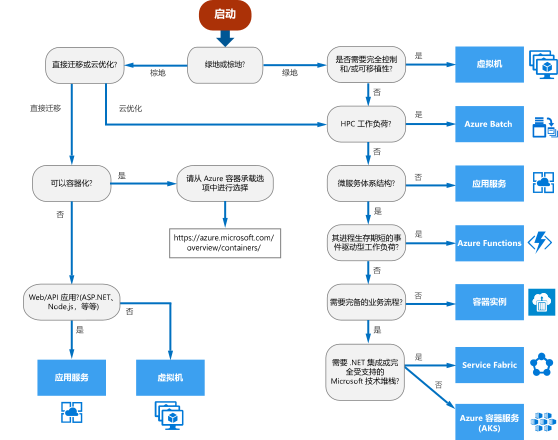

# Azure 计算服务的决策树

Azure 提供多种方式来托管应用程序代码。 术语“计算”指的是计算资源（应用程序在这些资源上运行）的承载模型。 以下流程图将会帮助你选择应用程序的计算服务。
 

该流程图将引导你创建一组关键决策条件用于访问建议。 每个应用程序有独特的要求，因此应将建议视为起点。 然后执行更详细的分析，例如查看：
 
- 特征集
- [服务限制](/azure/azure-subscription-service-limits)
- [成本](https://azure.microsoft.com/pricing/)
- [SLA](https://azure.microsoft.com/support/legal/sla/)
- [区域可用性](https://azure.microsoft.com/global-infrastructure/services/)
- 开发人员生态系统和团队技能
- [计算比较表](./compute-comparison.md)

如果应用程序包括多个工作负荷，请单独评估每个工作负荷。 完整的解决方案可能会合并两个或更多个计算服务。

