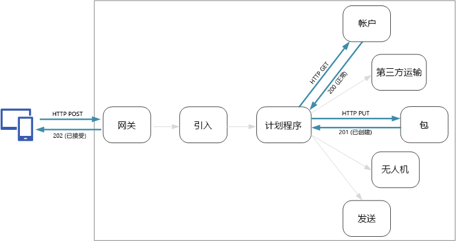
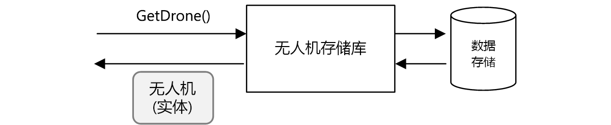
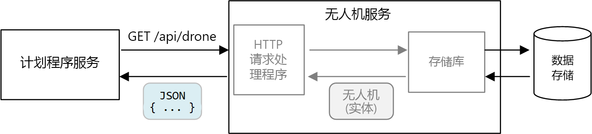
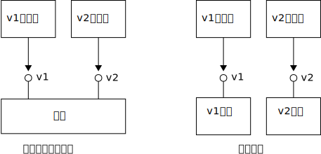

# <a name="designing-microservices-api-design"></a><span data-ttu-id="e9fb0-103">设计微服务：API 设计</span><span class="sxs-lookup"><span data-stu-id="e9fb0-103">Designing microservices: API design</span></span>

<span data-ttu-id="e9fb0-104">在微服务体系结构中，合理的 API 设计非常重要，因为服务之间的所有数据交换都是通过消息或 API 调用发生的。</span><span class="sxs-lookup"><span data-stu-id="e9fb0-104">Good API design is important in a microservices architecture, because all data exchange between services happens either through messages or API calls.</span></span> <span data-ttu-id="e9fb0-105">API 必须有效，以避免出现[琐碎 I/O](../antipatterns/chatty-io/index.md)。</span><span class="sxs-lookup"><span data-stu-id="e9fb0-105">APIs must be efficient to avoid creating [chatty I/O](../antipatterns/chatty-io/index.md).</span></span> <span data-ttu-id="e9fb0-106">由于服务是由独立工作的团队设计的，API 必须具有完善定义的语义和版本控制方案，使得更新不会中断其他服务。</span><span class="sxs-lookup"><span data-stu-id="e9fb0-106">Because services are designed by teams working independently, APIs must have well-defined semantics and versioning schemes, so that updates don't break other services.</span></span>



<span data-ttu-id="e9fb0-107">必须区分两种类型的 API：</span><span class="sxs-lookup"><span data-stu-id="e9fb0-107">It's important to distinguish between two types of API:</span></span>

- <span data-ttu-id="e9fb0-108">客户端应用程序调用的公共 API。</span><span class="sxs-lookup"><span data-stu-id="e9fb0-108">Public APIs that client applications call.</span></span> 
- <span data-ttu-id="e9fb0-109">用于服务间通信的后端 API。</span><span class="sxs-lookup"><span data-stu-id="e9fb0-109">Backend APIs that are used for interservice communication.</span></span>

<span data-ttu-id="e9fb0-110">这两种用例在某种程度上有不同的要求。</span><span class="sxs-lookup"><span data-stu-id="e9fb0-110">These two use cases have somewhat different requirements.</span></span> <span data-ttu-id="e9fb0-111">公共 API 必须与客户端应用程序（通常是浏览器应用程序或本机移动应用程序）兼容。</span><span class="sxs-lookup"><span data-stu-id="e9fb0-111">A public API must be compatible with client applications, typically browser applications or native mobile applications.</span></span> <span data-ttu-id="e9fb0-112">在大多数情况下，这意味着公共 API 将使用基于 HTTP 的 REST。</span><span class="sxs-lookup"><span data-stu-id="e9fb0-112">Most of the time, that means the public API will use REST over HTTP.</span></span> <span data-ttu-id="e9fb0-113">但是，对于后端 API，需要考虑网络性能。</span><span class="sxs-lookup"><span data-stu-id="e9fb0-113">For the backend APIs, however, you need to take network performance into account.</span></span> <span data-ttu-id="e9fb0-114">根据服务的粒度，服务间通信可能会导致大量的网络流量。</span><span class="sxs-lookup"><span data-stu-id="e9fb0-114">Depending on the granularity of your services, interservice communication can result in a lot of network traffic.</span></span> <span data-ttu-id="e9fb0-115">服务可能很快就会受到 I/O 的约束。</span><span class="sxs-lookup"><span data-stu-id="e9fb0-115">Services can quickly become I/O bound.</span></span> <span data-ttu-id="e9fb0-116">出于此原因，在序列化速度和有效负载大小等方面的考虑越发重要。</span><span class="sxs-lookup"><span data-stu-id="e9fb0-116">For that reason, considerations such as serialization speed and payload size become more important.</span></span> <span data-ttu-id="e9fb0-117">基于 HTTP 的 REST 的一些常见替代方案包括 gRPC、Apache Avro 和 Apache Thrift。</span><span class="sxs-lookup"><span data-stu-id="e9fb0-117">Some popular alternatives to using REST over HTTP include gRPC, Apache Avro, and Apache Thrift.</span></span> <span data-ttu-id="e9fb0-118">这些协议支持二进制序列化，并且通常比 HTTP 更加高效。</span><span class="sxs-lookup"><span data-stu-id="e9fb0-118">These protocols support binary serialization and are generally more efficient than HTTP.</span></span>

## <a name="considerations"></a><span data-ttu-id="e9fb0-119">注意事项</span><span class="sxs-lookup"><span data-stu-id="e9fb0-119">Considerations</span></span>

<span data-ttu-id="e9fb0-120">下面是在选择如何实现 API 时要考虑的事项。</span><span class="sxs-lookup"><span data-stu-id="e9fb0-120">Here are some things to think about when choosing how to implement an API.</span></span>

<span data-ttu-id="e9fb0-121">**REST 与 RPC**。</span><span class="sxs-lookup"><span data-stu-id="e9fb0-121">**REST vs RPC**.</span></span> <span data-ttu-id="e9fb0-122">考虑 REST 样式接口与 RPC 样式接口各有哪些利弊。</span><span class="sxs-lookup"><span data-stu-id="e9fb0-122">Consider the tradeoffs between using a REST-style interface versus an RPC-style interface.</span></span>

- <span data-ttu-id="e9fb0-123">REST 为资源建模，这可能是表达域模型的一种自然方式。</span><span class="sxs-lookup"><span data-stu-id="e9fb0-123">REST models resources, which can be a natural way express your domain model.</span></span> <span data-ttu-id="e9fb0-124">REST 基于 HTTP 谓词定义统一接口，从而有利于可演化性。</span><span class="sxs-lookup"><span data-stu-id="e9fb0-124">It defines a uniform interface based on HTTP verbs, which encourages evolvability.</span></span> <span data-ttu-id="e9fb0-125">它在幂等性、负面影响和响应代码方面具有完善定义的语义。</span><span class="sxs-lookup"><span data-stu-id="e9fb0-125">It has well-defined semantics in terms of idempotency, side effects, and response codes.</span></span> <span data-ttu-id="e9fb0-126">此外，它实施无状态通信，从而提高了可伸缩性。</span><span class="sxs-lookup"><span data-stu-id="e9fb0-126">And it enforces stateless communication, which improves scalability.</span></span> 

- <span data-ttu-id="e9fb0-127">相比之下，RPC 主要面向操作或命令。</span><span class="sxs-lookup"><span data-stu-id="e9fb0-127">RPC is more oriented around operations or commands.</span></span> <span data-ttu-id="e9fb0-128">由于 RPC 接口看上去与本地方法调用类似，因此可能导致设计出过于琐碎的 API。</span><span class="sxs-lookup"><span data-stu-id="e9fb0-128">Because RPC interfaces look like local method calls, it may lead you to design overly chatty APIs.</span></span> <span data-ttu-id="e9fb0-129">但是，这并不意味着 RPC 一定是琐碎的，</span><span class="sxs-lookup"><span data-stu-id="e9fb0-129">However, that doesn't mean RPC must be chatty.</span></span> <span data-ttu-id="e9fb0-130">只是在设计接口时需要慎重。</span><span class="sxs-lookup"><span data-stu-id="e9fb0-130">It just means you need to use care when designing the interface.</span></span>

<span data-ttu-id="e9fb0-131">对于 RESTful 接口，最常见的选择是使用 JSON 的基于 HTTP 的 REST。</span><span class="sxs-lookup"><span data-stu-id="e9fb0-131">For a RESTful interface, the most common choice is REST over HTTP using JSON.</span></span> <span data-ttu-id="e9fb0-132">RPC 样式接口有多种常用框架，包括 gRPC、Apache Avro 和 Apache Thrift。</span><span class="sxs-lookup"><span data-stu-id="e9fb0-132">For an RPC-style interface, there are several popular frameworks, including gRPC, Apache  Avro, and Apache Thrift.</span></span>

<span data-ttu-id="e9fb0-133">**效率**。</span><span class="sxs-lookup"><span data-stu-id="e9fb0-133">**Efficiency**.</span></span> <span data-ttu-id="e9fb0-134">考虑速度、内存和有效负载大小方面的效率。</span><span class="sxs-lookup"><span data-stu-id="e9fb0-134">Consider efficiency in terms of speed, memory, and payload size.</span></span> <span data-ttu-id="e9fb0-135">通常，基于 gRPC 的接口比基于 HTTP 的 REST 更快。</span><span class="sxs-lookup"><span data-stu-id="e9fb0-135">Typically a gRPC-based interface is faster than REST over HTTP.</span></span>

<span data-ttu-id="e9fb0-136">**接口定义语言 (IDL)**。</span><span class="sxs-lookup"><span data-stu-id="e9fb0-136">**Interface definition language (IDL)**.</span></span> <span data-ttu-id="e9fb0-137">IDL 用于定义 API 的方法、参数和返回值。</span><span class="sxs-lookup"><span data-stu-id="e9fb0-137">An IDL is used to define the methods, parameters, and return values of an API.</span></span> <span data-ttu-id="e9fb0-138">IDL 可用于生成客户端代码、序列化代码和 API 文档。</span><span class="sxs-lookup"><span data-stu-id="e9fb0-138">An IDL can be used to generate client code, serialization code, and API documentation.</span></span> <span data-ttu-id="e9fb0-139">IDL 还可以由 Postman 等 API 测试工具使用。</span><span class="sxs-lookup"><span data-stu-id="e9fb0-139">IDLs can also be consumed by API testing tools such as Postman.</span></span> <span data-ttu-id="e9fb0-140">gRPC、Avro 和 Thrift 等框架定义自身的 IDL 规范。</span><span class="sxs-lookup"><span data-stu-id="e9fb0-140">Frameworks such as gRPC, Avro, and Thrift define their own IDL specifications.</span></span> <span data-ttu-id="e9fb0-141">基于 HTTP 的 REST 没有标准的 IDL 格式，常见的选择是 OpenAPI（前称为 Swagger）。</span><span class="sxs-lookup"><span data-stu-id="e9fb0-141">REST over HTTP does not have a standard IDL format, but a common choice is OpenAPI (formerly Swagger).</span></span> <span data-ttu-id="e9fb0-142">也可以不使用正式的定义语言来创建 HTTP REST API，但这样会失去代码生成和测试的优点。</span><span class="sxs-lookup"><span data-stu-id="e9fb0-142">You can also create an HTTP REST API without using a formal definition language, but then you lose the benefits of code generation and testing.</span></span>

<span data-ttu-id="e9fb0-143">**序列化**。</span><span class="sxs-lookup"><span data-stu-id="e9fb0-143">**Serialization**.</span></span> <span data-ttu-id="e9fb0-144">如何在线序列化对象？</span><span class="sxs-lookup"><span data-stu-id="e9fb0-144">How are objects serialized over the wire?</span></span> <span data-ttu-id="e9fb0-145">选项包括基于文本的格式（主要是 JSON）和二进制格式（例如协议缓冲区）。</span><span class="sxs-lookup"><span data-stu-id="e9fb0-145">Options include text-based formats (primarily JSON) and binary formats such as protocol buffer.</span></span> <span data-ttu-id="e9fb0-146">二进制格式通常比基于文本的格式更快。</span><span class="sxs-lookup"><span data-stu-id="e9fb0-146">Binary formats are generally faster than text-based formats.</span></span> <span data-ttu-id="e9fb0-147">但是，JSON 在互操作性方面具有优势，因为大多数语言和框架都支持 JSON 序列化。</span><span class="sxs-lookup"><span data-stu-id="e9fb0-147">However, JSON has advantages in terms of interoperability, because most languages and frameworks support JSON serialization.</span></span> <span data-ttu-id="e9fb0-148">有些序列化格式需要固定的架构，但有些需要编译架构定义文件。</span><span class="sxs-lookup"><span data-stu-id="e9fb0-148">Some serialization formats require a fixed schema, and some require compiling a schema definition file.</span></span> <span data-ttu-id="e9fb0-149">在这种情况下，需要将此步骤整合到生成过程。</span><span class="sxs-lookup"><span data-stu-id="e9fb0-149">In that case, you'll need to incorporate this step into your build process.</span></span> 

<span data-ttu-id="e9fb0-150">**框架和语言支持**。</span><span class="sxs-lookup"><span data-stu-id="e9fb0-150">**Framework and language support**.</span></span> <span data-ttu-id="e9fb0-151">几乎每种框架和语言都支持 HTTP。</span><span class="sxs-lookup"><span data-stu-id="e9fb0-151">HTTP is supported in nearly every framework and language.</span></span> <span data-ttu-id="e9fb0-152">gRPC、Avro 和 Thrift 都有适用于 C++、C#、Java 和 Python 的库。</span><span class="sxs-lookup"><span data-stu-id="e9fb0-152">gRPC, Avro, and Thrift all have libraries for C++, C#, Java, and Python.</span></span> <span data-ttu-id="e9fb0-153">Thrift 和 gRPC 还支持 Go。</span><span class="sxs-lookup"><span data-stu-id="e9fb0-153">Thrift and gRPC also support Go.</span></span> 

<span data-ttu-id="e9fb0-154">**兼容性和互操作性**。</span><span class="sxs-lookup"><span data-stu-id="e9fb0-154">**Compatibility and interoperability**.</span></span> <span data-ttu-id="e9fb0-155">如果选择 gRPC 等协议，则可能需要在公共 API 与后端之间创建协议转换层。</span><span class="sxs-lookup"><span data-stu-id="e9fb0-155">If you choose a protocol like gRPC, you may need a protocol translation layer between the public API and the back end.</span></span> <span data-ttu-id="e9fb0-156">[网关](./gateway.md)可以执行此功能。</span><span class="sxs-lookup"><span data-stu-id="e9fb0-156">A [gateway](./gateway.md) can perform that function.</span></span> <span data-ttu-id="e9fb0-157">如果使用服务网格，请考虑哪些协议与服务网格兼容。</span><span class="sxs-lookup"><span data-stu-id="e9fb0-157">If you are using a service mesh, consider which protocols are compatible with the service mesh.</span></span> <span data-ttu-id="e9fb0-158">例如，linkerd 为 HTTP、Thrift 和 gRPC 提供内置支持。</span><span class="sxs-lookup"><span data-stu-id="e9fb0-158">For example, linkerd has built-in support for HTTP, Thrift, and gRPC.</span></span> 

<span data-ttu-id="e9fb0-159">我们的基线建议是，除非需要二进制协议的性能优势，否则请选择基于 HTTP 的 REST。</span><span class="sxs-lookup"><span data-stu-id="e9fb0-159">Our baseline recommendation is to choose REST over HTTP unless you need the performance benefits of a binary protocol.</span></span> <span data-ttu-id="e9fb0-160">基于 HTTP 的 REST 不需要特殊的库。</span><span class="sxs-lookup"><span data-stu-id="e9fb0-160">REST over HTTP requires no special libraries.</span></span> <span data-ttu-id="e9fb0-161">它只会产生极少程度的耦合，因为调用方不需要客户端存根即可与服务通信。</span><span class="sxs-lookup"><span data-stu-id="e9fb0-161">It creates minimal coupling, because callers don't need a client stub to communicate with the service.</span></span> <span data-ttu-id="e9fb0-162">有丰富的工具生态系统可支持 RESTful HTTP 终结点的架构定义、测试和监视。</span><span class="sxs-lookup"><span data-stu-id="e9fb0-162">There is rich ecosystems of tools to support schema definitions, testing, and monitoring of RESTful HTTP endpoints.</span></span> <span data-ttu-id="e9fb0-163">最后，HTTP 与浏览器客户端兼容，因此，我们不需要在客户端与后端之间创建协议转换层。</span><span class="sxs-lookup"><span data-stu-id="e9fb0-163">Finally, HTTP is compatible with browser clients, so you don't need a protocol translation layer between the client and the backend.</span></span> 

<span data-ttu-id="e9fb0-164">但是，如果选择基于 HTTP 的 REST，则应提前在开发过程中执行性能和负载测试，以验证它的表现是否足以满足方案的需要。</span><span class="sxs-lookup"><span data-stu-id="e9fb0-164">However, if you choose REST over HTTP, you should do performance and load testing early in the development process, to validate whether it performs well enough for your scenario.</span></span>

## <a name="restful-api-design"></a><span data-ttu-id="e9fb0-165">RESTful API 设计</span><span class="sxs-lookup"><span data-stu-id="e9fb0-165">RESTful API design</span></span>

<span data-ttu-id="e9fb0-166">可以参考许多的资源来设计 RESTful API。</span><span class="sxs-lookup"><span data-stu-id="e9fb0-166">There are many resources for designing RESTful APIs.</span></span> <span data-ttu-id="e9fb0-167">下面是一些有用的资源：</span><span class="sxs-lookup"><span data-stu-id="e9fb0-167">Here are some that you might find helpful:</span></span>

- [<span data-ttu-id="e9fb0-168">API 设计</span><span class="sxs-lookup"><span data-stu-id="e9fb0-168">API design</span></span>](../best-practices/api-design.md) 

- [<span data-ttu-id="e9fb0-169">API 实现</span><span class="sxs-lookup"><span data-stu-id="e9fb0-169">API implementation</span></span>](../best-practices/api-implementation.md) 

- [<span data-ttu-id="e9fb0-170">Microsoft REST API 准则</span><span class="sxs-lookup"><span data-stu-id="e9fb0-170">Microsoft REST API Guidelines</span></span>](https://github.com/Microsoft/api-guidelines)

<span data-ttu-id="e9fb0-171">下面是要注意的一些具体事项。</span><span class="sxs-lookup"><span data-stu-id="e9fb0-171">Here are some specific considerations to keep in mind.</span></span>

- <span data-ttu-id="e9fb0-172">留意会透露内部实现细节或只是镜像内部数据库架构的 API。</span><span class="sxs-lookup"><span data-stu-id="e9fb0-172">Watch out for APIs that leak internal implementation details or simply mirror an internal database schema.</span></span> <span data-ttu-id="e9fb0-173">API 应该为域建模。</span><span class="sxs-lookup"><span data-stu-id="e9fb0-173">The API should model the domain.</span></span> <span data-ttu-id="e9fb0-174">它是服务之间的协定，在理想情况下，应该只是在添加了新功能的情况下才对它进行更改，而不能仅仅因为重构了某些代码或规范化了数据库表，就对它进行更改。</span><span class="sxs-lookup"><span data-stu-id="e9fb0-174">It's a contract between services, and ideally should only change when new functionality is added, not just because you refactored some code or normalized a database table.</span></span> 

- <span data-ttu-id="e9fb0-175">不同类型的客户端（例如移动应用程序和桌面 Web 浏览器）可能需要不同的有效负载大小或交互模式。</span><span class="sxs-lookup"><span data-stu-id="e9fb0-175">Different types of client, such as mobile application and desktop web browser, may require different payload sizes or interaction patterns.</span></span> <span data-ttu-id="e9fb0-176">请考虑使用[用于前端的后端模式](../patterns/backends-for-frontends.md)为每个客户端创建独立的后端，这些后端可公开该客户端的最佳接口。</span><span class="sxs-lookup"><span data-stu-id="e9fb0-176">Consider using the [Backends for Frontends pattern](../patterns/backends-for-frontends.md) to create separate backends for each client, that expose an optimal interface for that client.</span></span>

- <span data-ttu-id="e9fb0-177">对于产生副作用的操作，请考虑使其成为幂等操作，并将其实现为 PUT 方法。</span><span class="sxs-lookup"><span data-stu-id="e9fb0-177">For operations with side effects, consider making them idempotent and implementing them as PUT methods.</span></span> <span data-ttu-id="e9fb0-178">这样，便可以安全重试并提高复原能力。</span><span class="sxs-lookup"><span data-stu-id="e9fb0-178">That will enable safe retries and can improve resiliency.</span></span> <span data-ttu-id="e9fb0-179">[引入和工作流](./ingestion-workflow.md#idempotent-vs-non-idempotent-operations)和[服务间通信](./interservice-communication.md)章节更详细讨论了此问题。</span><span class="sxs-lookup"><span data-stu-id="e9fb0-179">The chapters [Ingestion and workflow](./ingestion-workflow.md#idempotent-vs-non-idempotent-operations) and [Interservice communication](./interservice-communication.md) discuss this issue in more detail.</span></span>

- <span data-ttu-id="e9fb0-180">HTTP 方法可能采用异步语义，此时，方法将立即返回响应，但服务将以异步方式执行操作。</span><span class="sxs-lookup"><span data-stu-id="e9fb0-180">HTTP methods can have asynchronous semantics, where the method returns a response immediately, but the service carries out the operation asynchronously.</span></span> <span data-ttu-id="e9fb0-181">在这种情况下，方法应返回 [HTTP 202](https://www.w3.org/Protocols/rfc2616/rfc2616-sec10.html) 响应代码，指示请求已被接受进行处理，但处理尚未完成。</span><span class="sxs-lookup"><span data-stu-id="e9fb0-181">In that case, the method should return an [HTTP 202](https://www.w3.org/Protocols/rfc2616/rfc2616-sec10.html) response code, which indicates the request was accepted for processing, but the processing is not yet completed.</span></span>

## <a name="mapping-rest-to-ddd-patterns"></a><span data-ttu-id="e9fb0-182">将 REST 映射到 DDD 模式</span><span class="sxs-lookup"><span data-stu-id="e9fb0-182">Mapping REST to DDD patterns</span></span>

<span data-ttu-id="e9fb0-183">实体、聚合和值对象等模式旨在对域模型中的对象施加特定的约束。</span><span class="sxs-lookup"><span data-stu-id="e9fb0-183">Patterns such as entity, aggregate, and value object are designed to place certain constraints on the objects in your domain model.</span></span> <span data-ttu-id="e9fb0-184">在 DDD 的许多介绍文章中，模式是使用构造函数或属性 getter 和 setter 等面向对象的 (OO) 语言概念建模的。</span><span class="sxs-lookup"><span data-stu-id="e9fb0-184">In many discussions of DDD, the patterns are modeled using object-oriented (OO) language concepts like constructors or property getters and setters.</span></span> <span data-ttu-id="e9fb0-185">例如，值对象被认为是不可变的。</span><span class="sxs-lookup"><span data-stu-id="e9fb0-185">For example, *value objects* are supposed to be immutable.</span></span> <span data-ttu-id="e9fb0-186">在 OO 编程语言中，需要通过在构造函数中分配值并将属性设为只读，来实施此模式：</span><span class="sxs-lookup"><span data-stu-id="e9fb0-186">In an OO programming language, you would enforce this by assigning the values in the constructor and making the properties read-only:</span></span>

```ts
export class Location {
    readonly latitude: number;
    readonly longitude: number;

    constructor(latitude: number, longitude: number) {
        if (latitude < -90 || latitude > 90) {
            throw new RangeError('latitude must be between -90 and 90');
        }
        if (longitude < -180 || longitude > 180) {
            throw new RangeError('longitude must be between -180 and 180');
        }
        this.latitude = latitude;
        this.longitude = longitude;
    }
}
```

<span data-ttu-id="e9fb0-187">构建传统的整体应用程序时，此类编程做法特别重要。</span><span class="sxs-lookup"><span data-stu-id="e9fb0-187">These sorts of coding practices are particularly important when building a traditional monolithic application.</span></span> <span data-ttu-id="e9fb0-188">借助大型代码库，许多子系统可以使用 `Location` 对象，因此，对象必须实施正确的行为。</span><span class="sxs-lookup"><span data-stu-id="e9fb0-188">With a large code base, many subsystems might use the `Location` object, so it's important for the object to enforce correct behavior.</span></span> 

<span data-ttu-id="e9fb0-189">另一个示例是一个存储库模式，它可以确保应用程序的其他部分不会直接在数据存储中执行读取或写入：</span><span class="sxs-lookup"><span data-stu-id="e9fb0-189">Another example is the Repository pattern, which ensures that other parts of the application do not make direct reads or writes to the data store:</span></span>



<span data-ttu-id="e9fb0-190">但是，在微服务体系结构中，服务不共享同一个代码库，也不共享数据存储。</span><span class="sxs-lookup"><span data-stu-id="e9fb0-190">In a microservices architecture, however, services don't share the same code base and don't share data stores.</span></span> <span data-ttu-id="e9fb0-191">它们通过 API 进行通信。</span><span class="sxs-lookup"><span data-stu-id="e9fb0-191">Instead, they communicate through APIs.</span></span> <span data-ttu-id="e9fb0-192">假设计划程序服务需要从无人机服务请求有关无人机的信息。</span><span class="sxs-lookup"><span data-stu-id="e9fb0-192">Consider the case where the Scheduler service requests information about a drone from the Drone service.</span></span> <span data-ttu-id="e9fb0-193">无人机服务有自身的内部无人机模型（通过代码表示）。</span><span class="sxs-lookup"><span data-stu-id="e9fb0-193">The Drone service has its internal model of a drone, expressed through code.</span></span> <span data-ttu-id="e9fb0-194">但是，计划程序看不到该模型。</span><span class="sxs-lookup"><span data-stu-id="e9fb0-194">But the Scheduler doesn't see that.</span></span> <span data-ttu-id="e9fb0-195">它会取回无人机实体的某种表示形式 &mdash; 也许是 HTTP 响应中的某个 JSON 对象。</span><span class="sxs-lookup"><span data-stu-id="e9fb0-195">Instead, it gets back a *representation* of the drone entity &mdash; perhaps a JSON object in an HTTP response.</span></span>



<span data-ttu-id="e9fb0-196">计划程序服务无法修改无人机服务的内部模型，或写入无人机服务的数据存储。</span><span class="sxs-lookup"><span data-stu-id="e9fb0-196">The Scheduler service can't modify the Drone service's internal models, or write to the Drone service's data store.</span></span> <span data-ttu-id="e9fb0-197">这意味着，与传统整体应用程序中的代码相比，实现无人机服务的代码的公开外围应用更小。</span><span class="sxs-lookup"><span data-stu-id="e9fb0-197">That means the code that implements the Drone service has a smaller exposed surface area, compared with code in a traditional monolith.</span></span> <span data-ttu-id="e9fb0-198">如果无人机服务定义了 Location 类，该类的范围将受到限制 &mdash; 其他任何服务都不会直接使用该类。</span><span class="sxs-lookup"><span data-stu-id="e9fb0-198">If the Drone service defines a Location class, the scope of that class is limited &mdash; no other service will directly consume the class.</span></span> 

<span data-ttu-id="e9fb0-199">出于这些原因，本指南并未重点介绍编程做法，因为这些做法与战术 DDD 模式相关。</span><span class="sxs-lookup"><span data-stu-id="e9fb0-199">For these reasons, this guidance doesn't focus much on coding practices as they relate to the tactical DDD patterns.</span></span> <span data-ttu-id="e9fb0-200">但事实证明，我们也可以通过 REST API 为许多 DDD 模式建模。</span><span class="sxs-lookup"><span data-stu-id="e9fb0-200">But it turns out that you can also model many of the DDD patterns through REST APIs.</span></span> 

<span data-ttu-id="e9fb0-201">例如：</span><span class="sxs-lookup"><span data-stu-id="e9fb0-201">For example:</span></span>

- <span data-ttu-id="e9fb0-202">聚合自然映射到 REST 中的资源。</span><span class="sxs-lookup"><span data-stu-id="e9fb0-202">Aggregates map naturally to *resources* in REST.</span></span> <span data-ttu-id="e9fb0-203">例如，交付 API 将交付聚合公开为资源。</span><span class="sxs-lookup"><span data-stu-id="e9fb0-203">For example, the Delivery aggregate would be exposed as a resource by the Delivery API.</span></span>

- <span data-ttu-id="e9fb0-204">聚合是一致性边界。</span><span class="sxs-lookup"><span data-stu-id="e9fb0-204">Aggregates are consistency boundaries.</span></span> <span data-ttu-id="e9fb0-205">对聚合执行的操作永远不可以将某个聚合保持不一致状态。</span><span class="sxs-lookup"><span data-stu-id="e9fb0-205">Operations on aggregates should never leave an aggregate in an inconsistent state.</span></span> <span data-ttu-id="e9fb0-206">因此，应避免创建允许客户端操纵聚合内部状态的 API。</span><span class="sxs-lookup"><span data-stu-id="e9fb0-206">Therefore, you should avoid creating APIs that allow a client to manipulate the internal state of an aggregate.</span></span> <span data-ttu-id="e9fb0-207">应该优先使用可将聚合公开为资源的粗粒度 API。</span><span class="sxs-lookup"><span data-stu-id="e9fb0-207">Instead, favor coarse-grained APIs that expose aggregates as resources.</span></span>

- <span data-ttu-id="e9fb0-208">实体具有唯一标识。</span><span class="sxs-lookup"><span data-stu-id="e9fb0-208">Entities have unique identities.</span></span> <span data-ttu-id="e9fb0-209">在 REST 中，资源具有 URL 格式的唯一标识符。</span><span class="sxs-lookup"><span data-stu-id="e9fb0-209">In REST, resources have unique identifiers in the form of URLs.</span></span> <span data-ttu-id="e9fb0-210">创建对应于实体域标识的资源 URL。</span><span class="sxs-lookup"><span data-stu-id="e9fb0-210">Create resource URLs that correspond to an entity's domain identity.</span></span> <span data-ttu-id="e9fb0-211">从 URL 到域标识的映射对于客户端可能是不透明的。</span><span class="sxs-lookup"><span data-stu-id="e9fb0-211">The mapping from URL to domain identity may be opaque to client.</span></span>

- <span data-ttu-id="e9fb0-212">可以通过从根实体导航来访问聚合的子实体。</span><span class="sxs-lookup"><span data-stu-id="e9fb0-212">Child entities of an aggregate can be reached by navigating from the root entity.</span></span> <span data-ttu-id="e9fb0-213">如果遵循了 [HATEOAS](https://en.wikipedia.org/wiki/HATEOAS) 原则的话，则可以通过父实体表示形式中的链接来访问子实体。</span><span class="sxs-lookup"><span data-stu-id="e9fb0-213">If you follow [HATEOAS](https://en.wikipedia.org/wiki/HATEOAS) principles, child entities can be reached via links in the representation of the parent entity.</span></span> 

- <span data-ttu-id="e9fb0-214">由于值对象是不可变的，可以通过替换整个值对象来执行更新。</span><span class="sxs-lookup"><span data-stu-id="e9fb0-214">Because value objects are immutable, updates are performed by replacing the entire value object.</span></span> <span data-ttu-id="e9fb0-215">在 REST 中，可通过 PUT 或 PATCH 请求来实现更新。</span><span class="sxs-lookup"><span data-stu-id="e9fb0-215">In REST, implement updates through PUT or PATCH requests.</span></span> 

- <span data-ttu-id="e9fb0-216">存储库可让客户端在集合中查询、添加或删除对象，以及提取基础数据存储的详细信息。</span><span class="sxs-lookup"><span data-stu-id="e9fb0-216">A repository lets clients query, add, or remove objects in a collection, abstracting the details of the underlying data store.</span></span> <span data-ttu-id="e9fb0-217">在 REST 中，集合可以是不同的资源，其中包含用于查询集合或将新实体添加到集合的方法。</span><span class="sxs-lookup"><span data-stu-id="e9fb0-217">In REST, a collection can be a distinct resource, with methods for querying the collection or adding new entities to the collection.</span></span>

<span data-ttu-id="e9fb0-218">设计 API 时，请考虑这些 API 如何表达域模型。不仅要考虑到模型中的数据，而且还要考虑业务运营以及对数据的约束。</span><span class="sxs-lookup"><span data-stu-id="e9fb0-218">When you design your APIs, think about how they express the domain model, not just the data inside the model, but also the business operations and the constraints on the data.</span></span>

| <span data-ttu-id="e9fb0-219">DDD 概念</span><span class="sxs-lookup"><span data-stu-id="e9fb0-219">DDD concept</span></span> | <span data-ttu-id="e9fb0-220">REST 等效项</span><span class="sxs-lookup"><span data-stu-id="e9fb0-220">REST equivalent</span></span> | <span data-ttu-id="e9fb0-221">示例</span><span class="sxs-lookup"><span data-stu-id="e9fb0-221">Example</span></span> | 
|-------------|-----------------|---------|
| <span data-ttu-id="e9fb0-222">聚合</span><span class="sxs-lookup"><span data-stu-id="e9fb0-222">Aggregate</span></span> | <span data-ttu-id="e9fb0-223">资源</span><span class="sxs-lookup"><span data-stu-id="e9fb0-223">Resource</span></span> | `{ "1":1234, "status":"pending"... }` | 
| <span data-ttu-id="e9fb0-224">标识</span><span class="sxs-lookup"><span data-stu-id="e9fb0-224">Identity</span></span> | <span data-ttu-id="e9fb0-225">代码</span><span class="sxs-lookup"><span data-stu-id="e9fb0-225">URL</span></span> | `http://delivery-service/deliveries/1` |
| <span data-ttu-id="e9fb0-226">子实体</span><span class="sxs-lookup"><span data-stu-id="e9fb0-226">Child entities</span></span> | <span data-ttu-id="e9fb0-227">链接</span><span class="sxs-lookup"><span data-stu-id="e9fb0-227">Links</span></span> | `{ "href": "/deliveries/1/confirmation" }` |
| <span data-ttu-id="e9fb0-228">更新值对象</span><span class="sxs-lookup"><span data-stu-id="e9fb0-228">Update value objects</span></span> | <span data-ttu-id="e9fb0-229">PUT 或 PATCH</span><span class="sxs-lookup"><span data-stu-id="e9fb0-229">PUT or PATCH</span></span> | `PUT http://delivery-service/deliveries/1/dropoff` |
| <span data-ttu-id="e9fb0-230">存储库</span><span class="sxs-lookup"><span data-stu-id="e9fb0-230">Repository</span></span> | <span data-ttu-id="e9fb0-231">集合</span><span class="sxs-lookup"><span data-stu-id="e9fb0-231">Collection</span></span> | `http://delivery-service/deliveries?status=pending` |


## <a name="api-versioning"></a><span data-ttu-id="e9fb0-232">API 版本控制</span><span class="sxs-lookup"><span data-stu-id="e9fb0-232">API versioning</span></span>

<span data-ttu-id="e9fb0-233">API 是服务与客户端之间的协定，或该服务的使用者。</span><span class="sxs-lookup"><span data-stu-id="e9fb0-233">An API is a contract between a service and clients or consumers of that service.</span></span> <span data-ttu-id="e9fb0-234">如果某个 API 发生更改，依赖于该 API 的客户端存在中断的风险，不管是外部客户端还是其他微服务。</span><span class="sxs-lookup"><span data-stu-id="e9fb0-234">If an API changes, there is a risk of breaking clients that depend on the API, whether those are external clients or other microservices.</span></span> <span data-ttu-id="e9fb0-235">因此，最好是尽量减少对 API 的更改次数。</span><span class="sxs-lookup"><span data-stu-id="e9fb0-235">Therefore, it's a good idea to minimize the number of API changes that you make.</span></span> <span data-ttu-id="e9fb0-236">通常，基础实现中发生更改并不需要对 API 进行任何更改。</span><span class="sxs-lookup"><span data-stu-id="e9fb0-236">Often, changes in the underlying implementation don't require any changes to the API.</span></span> <span data-ttu-id="e9fb0-237">但实际上，在某个时候，我们需要添加新功能，这就需要更改现有的 API。</span><span class="sxs-lookup"><span data-stu-id="e9fb0-237">Realistically, however, at some point you will want to add new features or new capabilities that require changing an existing API.</span></span>

<span data-ttu-id="e9fb0-238">请尽量使 API 更改可向后兼容。</span><span class="sxs-lookup"><span data-stu-id="e9fb0-238">Whenever possible, make API changes backward compatible.</span></span> <span data-ttu-id="e9fb0-239">例如，避免从模型中删除字段，因为这可能会中断预期需要该字段的客户端。</span><span class="sxs-lookup"><span data-stu-id="e9fb0-239">For example, avoid removing a field from a model, because that can break clients that expect the field to be there.</span></span> <span data-ttu-id="e9fb0-240">添加字段不会破坏兼容性，因为客户端应该忽略响应中它们无法识别的任何字段。</span><span class="sxs-lookup"><span data-stu-id="e9fb0-240">Adding a field does not break compatibility, because clients should ignore any fields they don't understand in a response.</span></span> <span data-ttu-id="e9fb0-241">但是，服务必须应对旧式客户端在请求中省略新字段的情况。</span><span class="sxs-lookup"><span data-stu-id="e9fb0-241">However, the service must handle the case where an older client omits the new field in a request.</span></span> 

<span data-ttu-id="e9fb0-242">支持 API 协定中的版本控制。</span><span class="sxs-lookup"><span data-stu-id="e9fb0-242">Support versioning in your API contract.</span></span> <span data-ttu-id="e9fb0-243">如果做了重大的 API 更改，请推出新的 API 版本。</span><span class="sxs-lookup"><span data-stu-id="e9fb0-243">If you introduce a breaking API change, introduce a new API version.</span></span> <span data-ttu-id="e9fb0-244">继续支持以前的版本，并让客户端选择要调用哪个版本。</span><span class="sxs-lookup"><span data-stu-id="e9fb0-244">Continue to support the previous version, and let clients select which version to call.</span></span> <span data-ttu-id="e9fb0-245">可通过多种方法实现此目的。</span><span class="sxs-lookup"><span data-stu-id="e9fb0-245">There are a couple of ways to do this.</span></span> <span data-ttu-id="e9fb0-246">一种简单的方法是在同一个服务中公开两个版本。</span><span class="sxs-lookup"><span data-stu-id="e9fb0-246">One is simply to expose both versions in the same service.</span></span> <span data-ttu-id="e9fb0-247">另一种方法是同时运行服务的两个版本，并根据 HTTP 路由规则，将请求路由到其中一个版本。</span><span class="sxs-lookup"><span data-stu-id="e9fb0-247">Another option is to run two versions of the service side-by-side, and route requests to one or the other version, based on HTTP routing rules.</span></span> 



<span data-ttu-id="e9fb0-248">支持多个版本会在开发人员时间、测试和运营开销方面产生成本。</span><span class="sxs-lookup"><span data-stu-id="e9fb0-248">There's a cost to supporting multiple versions, in terms of developer time, testing, and operational overhead.</span></span> <span data-ttu-id="e9fb0-249">因此，最好尽快淘汰旧版本。</span><span class="sxs-lookup"><span data-stu-id="e9fb0-249">Therefore, it's good to deprecate old versions as quickly as possible.</span></span> <span data-ttu-id="e9fb0-250">对于内部 API，拥有该 API 的团队可与其他团队协作，帮助他们迁移到新版本。</span><span class="sxs-lookup"><span data-stu-id="e9fb0-250">For internal APIs, the team that owns the API can work with other teams to help them migrate to the new version.</span></span> <span data-ttu-id="e9fb0-251">此时，跨团队调控过程非常有用。</span><span class="sxs-lookup"><span data-stu-id="e9fb0-251">This is when having a cross-team governance process is useful.</span></span> <span data-ttu-id="e9fb0-252">对于外部（公共）API，可能很难淘汰 API 版本，当 API 由第三方或本机客户端应用程序使用时尤其如此。</span><span class="sxs-lookup"><span data-stu-id="e9fb0-252">For external (public) APIs, it can be harder to deprecate an API version, especially if the API is consumed by third parties or by native client applications.</span></span> 

<span data-ttu-id="e9fb0-253">当服务实施更改时，使用版本来标记更改会很有用。</span><span class="sxs-lookup"><span data-stu-id="e9fb0-253">When a service implementation changes, it's useful to tag the change with a version.</span></span> <span data-ttu-id="e9fb0-254">排查错误时，版本可提供重要信息。</span><span class="sxs-lookup"><span data-stu-id="e9fb0-254">The version provides important information when troubleshooting errors.</span></span> <span data-ttu-id="e9fb0-255">执行根本原因分析时，版本可能十分有帮助，因为可以确切地知道调用了哪个服务版本。</span><span class="sxs-lookup"><span data-stu-id="e9fb0-255">It can be very helpful for root cause analysis to know exactly which version of the service was called.</span></span> <span data-ttu-id="e9fb0-256">考虑对服务版本使用[语义版本控制](https://semver.org/)。</span><span class="sxs-lookup"><span data-stu-id="e9fb0-256">Consider using [semantic versioning](https://semver.org/) for service versions.</span></span> <span data-ttu-id="e9fb0-257">语义版本控制使用 *MAJOR.MINOR.PATCH* 格式。</span><span class="sxs-lookup"><span data-stu-id="e9fb0-257">Semantic versioning uses a *MAJOR.MINOR.PATCH* format.</span></span> <span data-ttu-id="e9fb0-258">但是，客户端仅应根据主要版本号选择 API；如果次要版本之间发生重要（但非重大）的更改，则可以根据次要版本选择 API。</span><span class="sxs-lookup"><span data-stu-id="e9fb0-258">However, clients should only select an API by the major version number, or possibly the minor version if there are significant (but non-breaking) changes between minor versions.</span></span> <span data-ttu-id="e9fb0-259">换而言之，客户端在 API 版本 1 与版本 2 之间做出选择是合理的做法，但不能选择版本 2.1.3。</span><span class="sxs-lookup"><span data-stu-id="e9fb0-259">In other words, it's reasonable for clients to select between version 1 and version 2 of an API, but not to select version 2.1.3.</span></span> <span data-ttu-id="e9fb0-260">如果允许这种粒度级，则可能存在必须为大量增生版本提供支持的风险。</span><span class="sxs-lookup"><span data-stu-id="e9fb0-260">If you allow that level of granularity, you risk having to support a proliferation of versions.</span></span> 

<span data-ttu-id="e9fb0-261">有关 API 版本控制的其他介绍，请参阅[对 RESTful Web API 进行版本控制](../best-practices/api-design.md#versioning-a-restful-web-api)。</span><span class="sxs-lookup"><span data-stu-id="e9fb0-261">For further discussion of API versioning, see [Versioning a RESTful web API](../best-practices/api-design.md#versioning-a-restful-web-api).</span></span>

> [!div class="nextstepaction"]
> [<span data-ttu-id="e9fb0-262">引入和工作流</span><span class="sxs-lookup"><span data-stu-id="e9fb0-262">Ingestion and workflow</span></span>](./ingestion-workflow.md)