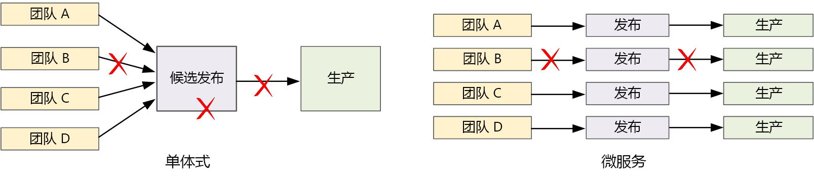

# 设计微服务：持续集成

要在微服务上获得成功，必须实施持续集成和持续交付 (CI/CD)。 没有制定合理的 CI/CD 流程，就无法实现微服务具备的敏捷性。 如果为不同的服务使用多个代码库和异构生成环境，则为微服务实施 CI/CD 会有一定的难度。 本章介绍具体的难题，并推荐一些问题解决方法。

加速发布周期是采用微服务体系结构的最重要原因之一。 

在单纯的整体应用程序中，有一个生成管道的输出就是应用程序可执行文件。 所有开发工作都会馈送到此管道中。 如果发现了高优先级 bug，则必须集成、测试然后发布修复程序，这可能会延缓新功能的发布。 运用合理构造的模块并使用功能分支来最小化代码更改造成的影响确实可以缓解这些问题。 但是，随着应用程序变得越来越复杂和更多功能的添加，整体应用程序的发布过程往往会变得更加脆弱且可能中断。 

根据微服务的理念，永远不应出现一个要让每个团队遵守的冗长发布周期。 生成服务“A”的团队随时可以发布更新，而无需等到已合并、测试并部署服务“B”中的更改。 要实现此目的，CI/CD 过程至关重要。 发布管道必须自动化且高度可靠，以尽量降低部署更新存在的风险。 如果每天或一天中多次向生产环境发布更新，则回退或服务中断的情况必须很少出现。 同时，如果部署了错误的更新，则必须通过可靠的方式快速回滚或者前滚到以前的服务版本。

当我们讨论 CI/CD 时，其实是在讨论多个相关的过程：持续集成、持续交付和持续部署。

- 持续集成是指频繁地将代码更改合并到主分支，并使用自动化的生成和测试过程来确保主分支中的代码始终具有生产级别的质量。

- 持续交付是指将经历 CI 过程的代码更改自动发布到类似于生产的环境。 部署到实时生产环境可能需要人工批准，否则可自动进行。 目标是让代码始终做好部署到生产环境的准备。

- 持续部署是指将经历 CI/CD 过程的代码更改自动部署到生产环境。

在 Kubernetes 和微服务的上下文中，CI 阶段涉及到生成和测试容器映像，然后将这些映像推送到容器注册表。 在部署阶段，将会更新 pod 规范以拾取最新的生产映像。

## 挑战

- **许多小型的独立代码库**。 每个团队负责使用自己的生成管道生成自己的服务。 在某些组织中，团队可能会使用单独的代码存储库。 这可能导致出现这种情况：各个团队对系统的生成方式各不相同，组织中没有人知道如何部署整个应用程序。 例如，在灾难恢复方案中，如果需要快速部署到新群集，会发生什么情况？   

- **多种语言和框架**。 如果每个团队混合使用其自身的技术，则可能难以创建一套可在整个组织中运用的单一生成过程。 生成过程必须足够灵活，使每个团队能够根据所选的语言或框架来改编它。 

- **集成和负载测试**。 如果团队根据自己的步调发布更新，则可能难以设计可靠的端到端测试，尤其是当服务彼此依赖时。 此外，运行整个生产群集可能费用不菲，每个团队不太可能只是出于测试目的，以生产规模运行整个群集。 

- **发布管理**。 每个团队应该能够将更新部署到生产环境。 这并不意味着每个团队成员都有权这样做。 但是，设置集中式“发布管理员”角色可能降低部署速度。 CI/CD 过程的自动化程度和可靠性越高，对集中授权的需求就越少。 也就是说，可以对主要功能更新与次要 bug 修复的发布采用不同的策略。 分散化并不意味着无需任何监管。

- **容器映像版本控制**。 在开发和测试周期，CI/CD 过程将生成许多容器映像。 其中只有一部分映像是发布候选项，因此，也只有这一部分发布候选项会推送到生产环境中。 应该制定明确的版本控制策略，以便知道目前已有哪些映像部署到了生产环境，并可以根据需要回滚到以前的版本。 

- **服务更新**。 将某个服务更新到新版本时，更新过程不应中断依赖于该服务的其他服务。 如果执行滚动更新，在某段时间内，将有多个版本运行。 
 
这些难题反映了一个基本矛盾。 一方面，团队要尽量独立地工作。 另一方面，需要进行某种协调，只让一个人运行集成测试、将整个解决方案重新部署到新群集、回滚错误更新或执行其他任务。 
 
## 微服务的 CI/CD 方法

对于每个服务团队而言，一种合理的做法是将其生成环境容器化。 此容器应该包含生成服务代码项目所需的全部生成工具。 通常，可以找到适用于所用语言和框架的正式 Docker 映像。 然后，可以使用 `docker run` 或 Docker Compose 来运行生成。 

使用此方法可以方便地设置新的生成环境。 想要生成代码的开发人员不需要安装一套生成工具，而只需运行容器映像。 更重要的是，也许可将生成服务器配置为执行相同的操作。 这样，就不需要在生成服务器上安装这些工具，或管理有冲突的工具版本。 

对于本地开发和测试，可以使用 Docker 来运行容器中的服务。 在运行此过程期间，可能需要运行其他容器来模拟用于本地测试的服务或测试数据库。 可以使用 Docker Compose 来协调这些容器，或使用 Minikube 在本地运行 Kubernetes。 

准备好代码后，可发出提取请求并合并到主节点中。 这样就会在生成服务器上启动一个作业：

1. 生成代码资产。 
2. 针对代码运行单元测试。
3. 生成容器映像。
4. 针对正在运行的容器运行功能测试，以测试容器映像。 此步骤可以捕获 Docker 文件中的错误，例如错误的入口点。
5. 将映像推送到容器注册表。
6. 使用新映像更新测试群集以运行集成测试。

准备好将映像部署到生产环境之后，请更新所需的部署文件来指定最新映像，包括任何 Kubernetes 配置文件。 然后，将更新应用到生产群集。

下面是有关提高部署可靠性的一些建议：
 
- 针对要部署到群集中的资源（pod、服务等），定义组织范围的容器标记约定、版本控制和命名约定。 这样，便可以更轻松地诊断部署问题。 

- 创建两个不同的容器注册表，一个用于开发/测试，另一个用于生产。 只有在已准备好将某个映像部署到生产环境之后，才将它推送到生产注册表。 如果将这种做法与容器映像的语义版本控制结合使用，则可以减少意外部署尚未批准发布的版本的可能性。

## 更新服务

可通过多种策略来更新已部署到生产环境的服务。 下面介绍三个常用选项：滚动更新、蓝绿部署和 Canary 发布。

### 滚动更新 

在滚动更新中部署服务的新实例，然后，新实例可开始立即接收请求。 启动新实例后，以前的实例将被删除。

更新部署的 pod 规范时，滚动更新是 Kubernetes 中的默认行为。 部署控制器为更新的 pod 创建新的副本集。 然后，它会纵向扩展新的副本集并纵向缩减旧的副本集，以保持所需的副本计数。 在新 pod 准备就绪之前，它不会删除旧 pod。 Kubernetes 保留更新历史记录，因此，你可以根据需要使用 kubectl 回滚更新。 

如果服务要执行较长的启动任务，则你可以定义就绪状态探测。 当容器已准备好开始接收流量时，就绪状态探测会发出报告。 在探测报告成功之前，Kubernetes 不会将流量发送到 pod。 

滚动更新的一个难题在于，在更新过程中，旧版本和新版本将混合运行并接收流量。 在此期间，任何请求都可能路由到两个版本中的一个。 根据两个版本之间的更改范围，这有可能会造成问题。 

### 蓝绿部署

在蓝绿部署中，需要连同以前的版本一起部署新版本。 验证新版本之后，可以一次性地将所有流量从以前的版本切换到新版本。 切换后，可以监视应用程序中的任何问题。 如果出现问题，可以切换回到旧版本。 如果没有任何问题，则可以删除旧版本。

对于较传统的整体或 N 层应用程序而言，蓝绿部署通常要预配两个相同的环境。 需将新版本部署到过渡环境，然后将客户端流量重定向到过渡环境 &mdash; 例如，通过交换 VIP 地址。

在 Kubernetes 中，不需要预配单独的群集即可执行蓝绿部署。 可以利用选择器。 使用新的 pod 规范和一组不同的标签创建新的部署资源。 无需删除以前的部署或修改指向该部署的服务，即可创建此部署。 运行新 pod 后，可以更新服务的选择器，以匹配新部署。 

蓝绿部署的优势之一是服务可以同时切换所有 pod。 更新服务后，所有新请求将路由到新版本。 缺点是，在更新过程中，需要对服务运行 pod 两次（当前 pod 和下一个 pod）。 如果 pod 需要大量的 CPU 或内存资源，则可能需要暂时横向扩展群集以处理资源消耗。 

### Canary 发布

在 Canary 发布中，可将更新的版本推出到少量的客户端。 然后，可以监视新服务的行为，再将它推出到所有客户端。 这样，便可以通过受控的方式慢速推出，观察真实数据并发现问题，避免对所有客户造成影响。

Canary 发布比蓝绿部署或滚动更新更难于管理，因为必须动态将请求路由到服务的不同版本。 在 Kubernetes 中，可将服务配置为跨越两个副本集（每个版本各有一个），并手动调整副本计数。 但是，由于 Kubernetes 跨 pod 进行负载均衡的方式，这种方法不够精确。 例如，如果总共有 10 个副本，则只能以 10% 的增量切换流量。 如果使用服务网格，则可以使用服务网格路由规则来实现更复杂的 Canary 发布策略。 下面是一些有用的资源：

- 不使用服务网格的 Kubernetes：[Canary 部署](https://kubernetes.io/docs/concepts/cluster-administration/manage-deployment/#canary-deployments)
- Linkerd：[动态请求路由](https://linkerd.io/features/routing/)
- Istio：[使用 Istio 的 Canary 部署](https://istio.io/blog/canary-deployments-using-istio.html)

## 结束语

最近几年，本行业已发生巨变，构建记录系统的做法正逐步转变为构建参与系统。

记录系统属于传统的后端办公数据管理应用程序。 这些系统的核心通常有一个 RDBMS，即单一事实来源。 “参与系统”一词是 Geoffrey Moore 在其 2011 年撰写的论文 *Systems of Engagement and the Future of Enterprise IT*（参与系统和企业 IT 的远景）中创造的。 参与系统是注重于通信和协作的应用程序。 它们能够实时将用户联系到一起。 此类应用程序必须全天候可用。 无需使应用程序脱机，即可定期引入新功能。 用户的期望比较高，他们不太能够忍受意外的延迟或停机。

在消费型领域，更好的用户体验可能意味着可衡量的业务价值。 用户参与应用程序的时间可直接转化为收入。 在业务系统领域，用户的期望已发生变化。 如果这些系统旨在培养沟通和协作，则必须从面向消费者的应用程序获得提示。

微服务就是对这种不断变化的格局做出的响应。 通过将整体应用程序分解为一组松散耦合的服务，我们可以控制每个服务的发布周期，并在不造成停机或重大更改的情况下频繁进行更新。 微服务还有助于提高可伸缩性、故障隔离性和复原能力。 同时，使用云平台可以更轻松地构建和运行微服务，自动预配计算资源、服务形式的容器业务流程协调程序，以及事件驱动的无服务器环境。

但是，如我们所见，微服务体系结构也存在众多难题。 若要获得成功，必须从坚实的设计开始。 必须慎重考虑如何分析域、选择技术、为数据建模、设计 API，以及营造成熟的 DevOps 文化。 我们希望本指南和随附的[参考实现](https://github.com/mspnp/microservices-reference-implementation)能够为微服务的设计之旅带来启示。 

