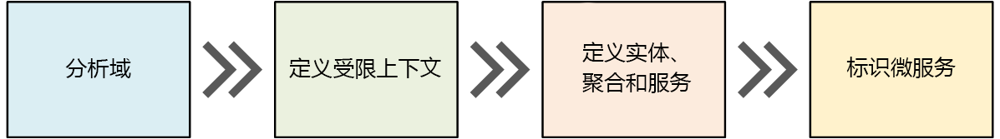
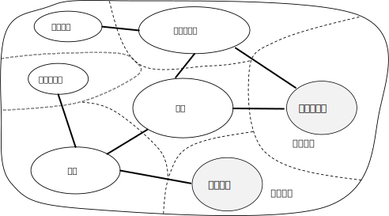
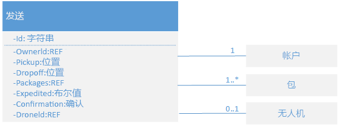
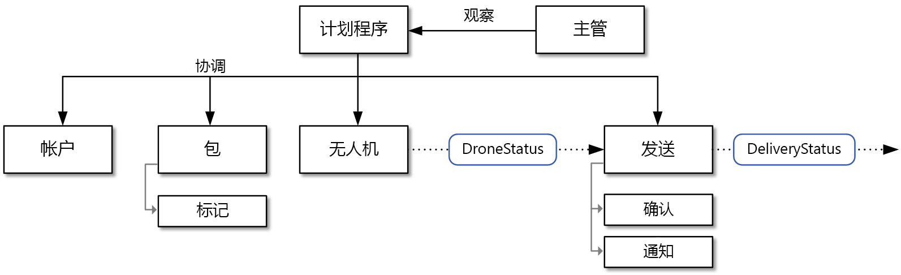

# 设计微服务：域分析 

微服务的最大挑战之一是定义各个服务的边界。 一般的规则是服务应该只做“一件事”&mdash; 但是，实践这条规则需要经过认真的考虑。 没有任何机械性的流程可以生成“适当的”设计。 必须深入考虑业务域、要求和目标。 否则，最终可能得到一个杂乱无章的设计，它呈现一些不需要的特征，例如隐藏服务之间的依赖关系、紧密耦合，或者界面的设计不佳。 本章介绍如何采用域驱动的方法来设计微服务。 

应该围绕业务功能而不是数据访问或消息传递等水平层来设计微服务。 此外，微服务应具有松散耦合和高功能内聚的特点。 如果在无需同时更新其他服务的情况下可以更改一个服务，则微服务是松散耦合的。 如果微服务具有完善定义的单一目的，例如管理用户帐户或跟踪交付历史记录，则它是内聚性的。 服务应该封装域知识，并从客户端抽象化知识。 例如，客户端应该能够在不知道计划算法或如何管理无人机群的情况下安排无人机。

域驱动的设计 (DDD) 提供一个框架，可以让你顺利访问一组完善设计的微服务。 DDD 包括两个不同的阶段：战略和战术。 在战略 DDD 中，可以定义系统的大规模结构。 战略 DDD 有助于确保体系结构专注于业务功能。 战术 DDD 提供一组可用于创建域模型的设计模式。 这些模式包括实体、聚合和域服务。 借助这些战术模式，可以设计松散耦合和内聚的微服务。

本章和下一章将引导你完成以下步骤，并将其应用到无人机交付应用程序： 

1. 我们首先分析业务域，以了解应用程序的功能要求。 此步骤的输出是域的非正式说明，可将其优化成更正式的一组域模型。 

2. 接下来，定义域的边界上下文。 每个边界上下文包含一个域模型，该模型表示较大应用程序的特定子域。 

3. 在边界上下文中，应用战术 DDD 模式以定义实体、聚合和域服务。 
 
4. 使用前一步骤的结果可以标识应用程序中的微服务。

本章介绍前三个步骤，并重点讨论 DDD。 下一章介绍如何标识微服务。 但是，请务必记住，DDD 是迭代的持续过程。 服务边界不是一成不变的。 随着应用程序的演变，你可以决定将某个服务分解成多个较小服务。

> [!NOTE]
> 本章不会完整介绍全面的域分析。 我们有意精简了示例，目的是演示要点。 有关 DDD 的更多背景信息，我们建议阅读 Eric Evans 的 *Domain-Driven Design*（域驱动的设计），该书籍首次引入了该术语。 另一篇极佳的参考文章是 Vaughn Vernon 撰写的 *Implementing Domain-Driven Design*（实施域驱动的设计）。 

## 分析域

借助 DDD 方法可以设计微服务，使每个服务原生都能符合业务功能要求。 此方法有助于避免组织边界或技术选择左右你的设计，从而让你感到困惑。

在编写任何代码之前，需要获取所创建的系统的鸟瞰图。 DDD 模式首先为业务域建模，然后创建域模型。 域模型是业务域的抽象模型。 它可以提取和组织域知识，并为开发人员和域专家提供通用语言。 

首先，映射所有业务功能及其连接。 这可能需要域专家、软件架构师和其他利益干系人之间展开协作。 不需要使用任何特定的形式。  草绘或者在白板上绘制关系图。

在填充关系图时，可以开始标识离散的子域。 哪些功能密切相关？ 哪些功能是业务的核心，哪些功能提供辅助服务？ 依赖项关系图是什么？ 在此初始阶段，不需要考虑技术或实施细节。 也就是说，应该注意应用程序要在哪个位置与 CRM、付款处理或计费系统等外部系统集成。 

## 无人机交付：分析业务域。

完成一些初始域分析之后，Fabrikam 团队绘制了一份描绘无人机交付域的草图。

 

- “交货”位于关系图的中心，因为它是业务的核心。 关系图中的其他任何元素都是为了支持此功能。
- “无人机管理”也是业务的核心。 与无人机管理密切相关的功能包括**无人机维修**，以及使用**预测分析**来预测无人机何时需要检修和维护。 
- **ETA 分析**提供取件和交货的估计时间。 
- 如果包裹无法完全由无人机交货，则应用程序可以通过**第三方运输**来安排替代的运输方式。
- **无人机共享**是核心业务的可能扩展。 公司的无人机在某些时段可能容量过剩，在这种情况下，可以出租无人机，以避免闲置。 初始版本未包括此功能。
- **视频监督**是公司以后可以拓展到的另一个领域。
- **用户帐户**、**开票**和**呼叫中心**是支持核心业务的子域。
 
请注意，在此流程的此阶段，我们尚未做出有关实施或技术的任何决策。 某些子系统可能涉及到外部软件系统或第三方服务。 即便如此，应用程序也需要与这些系统和服务进行交互，因此，必须将它们包含在域模型中。 

> [!NOTE]
> 如果应用程序依赖于外部系统，则存在一种风险：外部系统的数据架构或 API 会渗入应用程序，最终透露体系结构设计。 不遵循新式最佳做法，并使用复杂数据架构或过时 API 的旧式系统尤其如此。 在这种情况下，必须在这些外部系统与应用程序之间妥善定义边界。 为此，请考虑使用 [Strangler 模式](../patterns/strangler.md)或[防损层模式](../patterns/anti-corruption-layer.md)。

## 定义边界上下文

域模型将包含现实世界中事物的表示形式 &mdash; 用户、无人机、包裹，等等。 但这并不意味着，系统的每个部分都需要对相同的事物使用相同的表示形式。 

例如，处理无人机维修和预测分析的子系统需要呈现无人机的许多物理特征，例如其维护历史记录、里程、机龄、型号、性能特征，等等。 但是，在安排交付时，我们并不需要关心这些方面。 计划子系统只需知道无人机是否可用，以及取件和交货的 ETA。 

如果尝试为这两个子系统创建了单个模型，则会不必要地增大复杂性。 此外，模型会更难得到发展，因为任何更改都需要满足处理不同子系统的多个团队的要求。 因此，更好的做法通常是设计不同的模型，用于在两种不同的上下文中呈现相同的真实实体（在本例中为无人机）。 每个模型仅包含其特定上下文中相关的功能和属性。

在此场合下，“边界上下文”的 DDD 概念可以派上用场。 简单而言，边界上下文是应用特定域模型的域中的边界。 在上图中，我们可以根据各种功能是否共享单个域模型将功能分组。 

 
 
边界上下文不一定相互独立。 在此图中，连接边界上下文的实线表示两个边界上下文交互的位置。 例如，“交货”依赖于“用户帐户”来获取有关客户的信息，并依赖于“无人机管理”来安排机群中的无人机。

在 *Domain Driven Design*（域驱动的设计）一书中，Eric Evans 描述了当某个域模型与另一个边界上下文交互时，保持该模型完整性的多种模式。 微服务的主要原则之一是服务通过完善定义的 API 进行通信。 此方法对应于两种模式，即 Evans 所说的“开放主机服务”和“发布语言”。 “开放主机服务”的思路是子系统针对与它通信的其他子系统定义一个正式协议 (API)。 “发布语言”扩展了这种思路，它以其他团队可以用来编写客户端的形式发布 API。 [API 设计](./api-design.md)一章介绍了如何使用 [OpenAPI 规范](https://www.openapis.org/specification/repo)（以前称为 Swagger）来为 REST API 定义语言无关的接口说明（以 JSON 或 YAML 格式表示）。

本教程的余下部分侧重于“交货”边界上下文。 

## 战术 DDD

在 DDD 的战略阶段，我们要绘制业务域的关系图，并定义域模型的边界上下文。 在战术 DDD 阶段，我们要更精确地定义域模型。 战术模式在单个边界上下文中应用。 在微服务体系结构中，我们对实体和聚合模式特别感兴趣。 应用这些模式有助于标识应用程序中服务的自然边界（请参阅[下一章](./microservice-boundaries.md)）。 作为一般原则，微服务应小于聚合，且不大于边界上下文。 首先，让我们了解战术模式。 然后，我们对无人机交付应用程序中的“交货”边界上下文应用这些模式。 

### 战术模式概述

本部分提供战术 DDD 模式的简要概述，如果你已熟悉 DDD，则可以跳过本部分。 Eric Evans 著作的第 5 &ndash; 6 章，以及 Vaughn Vernon 的 *Implementing Domain-Driven Design*（实施域驱动的设计）一书中更详细地介绍了这些模式。 

**实体**。 实体是一直保持唯一标识的对象。 例如，在银行应用程序中，客户和帐户就是实体。 

- 实体在系统中有唯一的标识符，使用该标识符可以查找和检索该实体。 这并不意味着，该标识符始终直接向用户公开。 它可能是数据库中的 GUID 或主键。 
- 一个标识可以跨多个边界上下文，并可能保留到应用程序生存期结束之后。 例如，银行帐号或政府颁发的身份证号不会与特定应用程序的生存期相关联。
- 实体的属性可随时变化。 例如，某人的姓名或地址可能有变化，但他（她）仍是同一个人。 
- 一个实体可以包含对其他实体的引用。
 
**值对象**。 值对象没有标识。 它只由其属性值定义。 值对象也是不可变的。 若要更新值对象，始终需要创建一个新实例来替换旧实例。 值对象可以包含用于封装域逻辑的方法，但这些方法不应该给对象的状态产生负面影响。 值对象的典型示例包括颜色、日期时间和货币值。 

**聚合**。 聚合定义一个或多个实体的一致性边界。 一个聚合只包含一个根实体。 可以使用根实体的标识符执行查找。 聚合中的其他任何实体是根的子级，由从根开始的后续指针引用。 

聚合的作用是为事务不可变性建模。 现实世界中的事物具有复杂的关系网。 客户创建订单，订单包含产品，产品有供应商，等等。 如果应用程序修改了多个相关对象，如何保证一致性？ 如何跟踪并实施不可变性？  

传统应用程序通常使用数据库事务来实施一致性。 但是，在分布式应用程序中，这种做法通常不可行。 单个业务事务可能跨越多个数据存储、长时间运行，或者涉及第三方服务。 最终由应用程序而不是数据层来实施域所需的不可变性。 这就是要为聚合建模的目的。

> [!NOTE]
> 聚合可以包含单个实体且不包含子实体。 聚合的定义由事务边界确定。

**域和应用程序服务**。 在 DDD 术语中，服务是实现某种逻辑且不保存任何状态的对象。 Evans 对封装域逻辑的域服务，以及提供技术功能（例如用户身份验证或发送短信）的应用程序服务做了区分。 域服务通常用来对跨多个实体的行为建模。 

> [!NOTE]
> 软件开发中广泛使用了“服务”一词。 此处的定义不直接与微服务相关。

**域事件**。 发生某种情况时，可以使用域事件来通知系统的其他部件。 顾名思义，域事件应该表示域中发生的某些情况。 例如，“在表中插入了记录”不是域事件。 “已取消交付”是域事件。 域事件与微服务体系结构密切相关。 由于微服务是分发式的且不共享数据存储，微服务可通过域事件来相互协调。 [服务间通信](./interservice-communication.md)一章更详细介绍了异步消息传递。
 
还有其他几种 DDD 模式未在此处列出，包括工厂、存储库和模块。 实施微服务时，这些模式可能十分有用；但是，在微服务之间设计边界时，它们作用不大。

## 无人机交付：应用模式

首先，我们探讨“交货”边界上下文必须处理的方案。

- 某个客户可以请求派遣无人机从已注册到无人机交付服务的公司取件。
- 寄件人生成了一个标记（条形码或 RFID）并粘贴在包裹上。 
- 无人机将会收取包裹，然后将包裹从源位置交付到目标位置。
- 当客户安排交付时，系统将会根据路线信息、天气情况和历史数据提供 ETA。 
- 当无人机起飞时，用户可以跟踪当前位置和最新的 ETA。 
- 在无人机收取包裹之前，客户可以取消交付。
- 完成交付时，客户将收到通知。
- 寄件人可以请求客户提供签名或指纹形式的交付信息。
- 用户可以查找已完成交付的历史记录。

在这些方案中，开发团队确定了以下**实体**。

- 交付
- 程序包
- 无人机
- 帐户
- 确认
- 通知
- 标记

前四个项（“交付”、“包裹”、“无人机”和“帐户”）都是表示事务一致性边界的**聚合**。 “确认”和“通知”是“交付”的子实体，“标记”是“包裹”的子实体。 

此设计中的**值对象**包括“位置”、“ETA”、“包裹重量”和“包裹大小”。 

为便于演示，下面提供了“交付”聚合的 UML 关系图。 请注意，该聚合包含对其他聚合（包括“帐户”、“包裹”和“无人机”）的引用。

有两个域事件：

- 当无人机起飞时，“无人机”实体将发送 DroneStatus 事件，用于描述无人机的位置和状态（飞行中、已着陆）。

- 每当交付阶段发生更改时，“交付”实体将发送 DeliveryTracking 事件。 这些事件包括 DeliveryCreated、DeliveryRescheduled、DeliveryHeadedToDropoff 和 DeliveryCompleted。 

请注意，这些事件描述域模型中有意义的事物。 它们描述有关域的某些信息，但不与特定的编程语言构造相关。

开发团队还确定了另一个功能领域，但该功能领域并不与前面所述的任何实体紧密相关。 系统的某个部件必须协调有关安排或更新交付的所有步骤。 因此，开发团队在设计中添加了两个**域服务**：一个计划程序（用于协调步骤），以及一个监督程序（用于监视每个步骤的状态，以检测是否有任何步骤失败或超时）。这是[计划程序代理监督程序模式](../patterns/scheduler-agent-supervisor.md)的一个变体。

> [!div class="nextstepaction"]
> [标识微服务边界](./microservice-boundaries.md)
