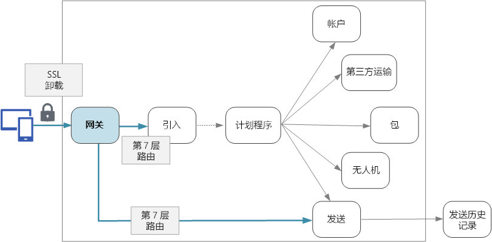

# 设计微服务：API 网关

在微服务体系结构中，客户端可能与多个前端服务进行交互。 如果存在这种情况，客户端如何知道要调用哪些终结点？ 引入了新服务或者重构了现有服务时，会发生什么情况？ 服务如何处理 SSL 终止、身份验证和其他问题？ API 网关可以帮助解决这些难题。 

## 什么是 API 网关?

API 网关位于客户端与服务之间。 它充当反向代理，将来自客户端的请求路由到服务。 它还可以执行各种横切任务，例如身份验证、SSL 终止和速率限制。 如果未部署网关，则客户端必须直接向前端服务发送请求。 但是，直接向客户端公开服务会造成一些潜在问题：

- 可能需要编写复杂的客户端代码。 客户端必须跟踪多个终结点，并以弹性方式处理故障。 
- 会在客户端与后端之间造成耦合。 客户端需要知道如何分解各个服务。 因此，客户端维护和服务重构会变得更困难。
- 单个操作可能需要调用多个服务。 这可能导致在客户端与服务器之间经历多次网络往返，从而明显增大延迟。 
- 每个面向公众的服务必须处理身份验证、SSL 和客户端速率限制等问题。 
- 服务必须公开客户端友好的协议，例如 HTTP 或 WebSocket。 这就限制了[通信协议](./interservice-communication.md)的选择。 
- 包含公共终结点的服务是潜在的受攻击面，必须得到强化。

网关可以通过将客户端与服务分开，来帮助解决这些问题。 网关可以执行许多不同的功能，但我们不一定需要所有这些功能。 这些功能可划分到以下设计模式：

[网关路由](../patterns/gateway-routing.md)。 使用网关作为反向代理，通过第 7 层路由将请求路由到一个或多个后端服务。 网关为客户端提供单一终结点，可帮助将客户端与服务分开。 

[网关聚合](../patterns/gateway-aggregation.md)。 使用网关可将多个单独请求聚合成一个请求。 当单个操作需要调用多个后端服务时，可以应用此模式。 客户端将一个请求发送到网关。 网关会将请求分派到不同的后端系统，然后聚合结果并将其发回给客户端。 这有助于减少客户端与后端之间的通信频率。 

[网关卸载](../patterns/gateway-offloading.md)。 使用网关可将单个服务的功能卸载到网关，尤其适合用于解决横切问题。 可能有效的做法是将这些功能整合到一个位置，而不是让每个服务负责实现这些功能。 对于需要专业技能才能正常实现的功能（例如身份验证和授权），这种做法尤其有效。 

下面是可卸载到网关的一些功能示例：

- SSL 终止
- 身份验证
- IP 白名单
- 客户端速率限制（限制）
- 日志记录和监视
- 响应缓存
- Web 应用程序防火墙
- GZIP 压缩
- 为静态内容提供服务

## 选择网关技术

下面是在应用程序中实施 API 网关时可用的一些选项。

- **反向代理服务器**。 Nginx 和 HAProxy 是流行的反向代理服务器，它们支持负载均衡、SSL 和第 7 层路由等功能。 两者都是免费的开源产品，付费版本提供更多的功能和支持选项。 Nginx 和 HAProxy 是具有丰富功能集和高性能的成熟产品。 可以使用第三方模块或者以 Lua 编写自定义脚本来扩展这两个产品。 Nginx 还支持名为 NginScript 的基于 JavaScript 的脚本模块。

- **服务网格入口控制器**。 如果使用 linkerd 或 Istio 等服务网格，请考虑该服务网格的入口控制器所提供的功能。 例如，Istio 入口控制器支持第 7 层路由、HTTP 重定向、重试和其他功能。 

- [Azure 应用程序网关](/azure/application-gateway/)。 应用程序网关是托管的负载均衡服务，可以执行第 7 层路由和 SSL 终止。 它还提供 Web 应用程序防火墙 (WAF)。

- [Azure API 管理](/azure/api-management/)。 API 管理是可将 API 发布到外部和内部客户的统包式解决方案。 它提供可用于管理面向公众的 API 的功能，包括速率限制、IP 允许列表，以及使用 Azure Active Directory 或其他标识提供者进行身份验证。 API 管理不执行任何负载均衡，因此，应该将它与应用程序网关或反向代理等负载均衡器结合使用。

选择网关技术时，请考虑以下因素：

**功能**。 上面列出的选项都支持第 7 层路由，但对其他功能的支持有所不同。 可以根据所需的功能部署多个网关。 

**部署**。 Azure 应用程序网关和 API 管理属于托管服务。 Nginx 和 HAProxy 通常在群集内的容器中运行，但也可以将其部署到群集外部的专用 VM 上。 这样就可以将网关与其他工作负荷隔离开来，但可能会产生较高的管理开销。

**管理**。 更新服务或者添加新服务后，可能需要更新网关路由规则。 请考虑如何管理此过程。 类似的注意事项同样适用于管理 SSL 证书、IP 允许列表和其他配置方面。

## 部署注意事项

### 将 Nginx 或 HAProxy 部署到 Kubernetes

可将 Nginx 或 HAProxy 作为 [ReplicaSet](https://kubernetes.io/docs/concepts/workloads/controllers/replicaset/) 或 [DaemonSet](https://kubernetes.io/docs/concepts/workloads/controllers/daemonset/)（指定 Nginx 或 HAProxy 容器映像）部署到 Kubernetes。 使用 ConfigMap 存储代理的配置文件，然后将 ConfigMap 装载为卷。 创建 LoadBalancer 类型的服务，以通过 Azure 负载均衡器公开网关。 

<!-- - Configure a readiness probe that serves a static file from the gateway (rather than routing to another service). -->

一种替代方法是创建入口控制器。 入口控制器是部署负载均衡器或反向代理服务器的 Kubernetes 资源。 有多种实施方案，包括 Nginx 和 HAProxy。 有一个名为 Ingress 的独立资源可以定义入口控制器的设置，例如路由规则和 TLS 证书。 这样，我们就无需管理特定代理服务器技术的复杂配置文件。 在撰写本文时，入口控制器仍是 Kubernetes 的 Beta 版功能，该功能将不断改进。

网关是系统中的潜在瓶颈或单一故障点，因此，应至少部署两个副本以实现高可用性。 根据具体的负载，可能需要进一步横向扩展副本。 

另外，请考虑在群集中的一组专用节点上运行网关。 这种做法的好处包括：

- 隔离。 所有入站流量将转到可与后端服务相隔离的固定一组节点。

- 稳定的配置。 如果网关配置不当，则整个应用程序可能不可用。 

- 性能。 出于性能原因，可能需要对网关使用特定的 VM 配置。

<!-- - Load balancing. You can configure the external load balancer so that requests always go to a gateway node. That can save a network hop, which would otherwise happen whenever a request lands on a node that isn't running a gateway pod. This consideration applies mainly to large clusters, where the gateway runs on a relatively small fraction of the total nodes. In Azure Container Service (ACS), this approach currently requires [ACS Engine](https://github.com/Azure/acs-engine)) which allows you to create multiple agent pools. Then you can deploy the gateway as a DaemonSet to the front-end pool. -->

### Azure 应用程序网关

将应用程序网关连接到 Azure 中的 Kubernetes 群集：

1. 在群集 VNet 中创建一个空子网。
2. 部署应用程序网关。
3. 创建类型为 [NodePort](https://kubernetes.io/docs/concepts/services-networking/service/#type-nodeport) 的 Kubernetes 服务。 这会在每个节点上公开该服务，以便可以从群集外部访问它。 此操作不会创建负载均衡器。
5. 获取该服务的分配端口号。
6. 添加应用程序网关规则，其中：
    - 后端池包含代理 VM。
    - HTTP 设置指定服务端口号。
    - 网关侦听器侦听端口 80/443
    
将实例计数设置为 2 或更大，以实现高可用性。

### Azure API 管理 

将 API 管理连接到 Azure 中的 Kubernetes 群集：

1. 在群集 VNet 中创建一个空子网。
2. 将 API 管理部署到该子网。
3. 创建 LoadBalancer 类型的 Kubernetes 服务。 使用[内部负载均衡器](https://kubernetes.io/docs/concepts/services-networking/service/#internal-load-balancer)注释创建内部负载均衡，而不要使用默认的面向 Internet 的负载均衡器。
4. 使用 kubectl 或 Azure CLI 查找内部负载均衡器的专用 IP。
5. 使用 API 管理创建定向到负载均衡器专用 IP 地址的 API。

考虑将 API 管理与某个反向代理（不管是 Nginx、HAProxy 还是 Azure 应用程序网关）结合使用。 有关将 API 管理与应用程序网关配合使用的信息，请参阅[在包含应用程序网关的内部 VNET 中集成 API 管理](/azure/api-management/api-management-howto-integrate-internal-vnet-appgateway)。

> [!div class="nextstepaction"]
> [日志记录和监视](./logging-monitoring.md)
