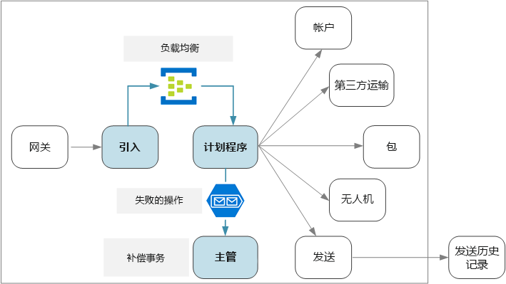
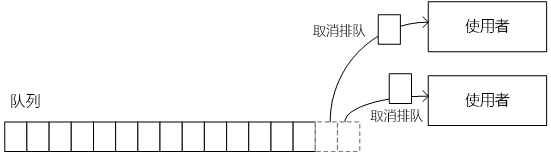
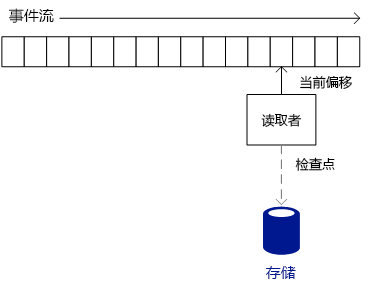
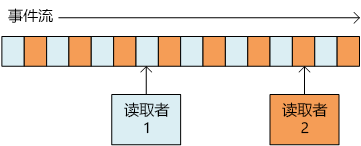
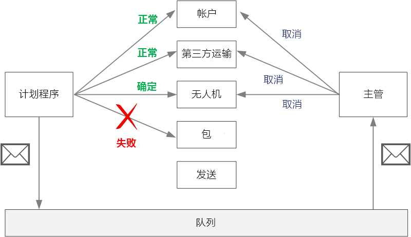

# <a name="designing-microservices-ingestion-and-workflow"></a>设计微服务：引入和工作流

微服务通常有一个跨越多个服务（用于处理单个事务）的工作流。 该工作流必须可靠；它不能丢失事务，或者将事务保留为部分完成状态。 控制传入请求的引入速率至关重要。 当许多的小型服务相互通信时，传入请求的剧增可能会使服务间的通信变瘫痪。 



## <a name="the-drone-delivery-workflow"></a>无人机交付工作流

在无人机交付应用程序中，必须执行以下操作来安排交付：

1. 检查客户帐户的状态（帐户服务）。
2. 创建新的包裹实体（包裹服务）。
3. 根据取件和交付地点，检查此项交付是否需要与任何第三方货运公司合作（第三方运输服务）。
4. 安排无人机取件（无人机服务）。
5. 创建新的交付实体（交付服务）。

这是整个应用程序的核心，因此，端到端的过程必须高效且可靠。 必须解决一些特殊的难题：

- **负载调节**。 过多客户端请求产生的服务间网络流量可能会使系统瘫痪。 此外，还可能会使存储或远程服务等后端依赖项变瘫痪。 这些依赖项做出的反应可能是限制调用它们的服务，从而在系统中产生反压。 因此，必须将传入系统的请求放入缓冲区或队列进行处理，以便对请求进行负载调节。 

- **有保证的传递**。 为了避免丢弃任何客户端请求，引入组件必须保证至少传递消息一次。 

- **错误处理**。 如果有任何服务返回错误代码或者遇到非暂时性故障，则无法安排交付。 错误代码可能指示预期的错误状态（例如，客户帐户处于冻结状态）或意外的服务器错误 (HTTP 5xx)。 也有可能服务不可用，导致网络调用超时。 

首先，让我们探讨等式的引入端 &mdash; 系统如何以较高的吞吐量引入传入的用户请求。 然后，我们考虑无人机交付应用程序如何实现可靠的工作流。 事实证明，引入子系统的设计会影响工作流后端。 

## <a name="ingestion"></a>引入

根据业务要求，开发团队确定了与引入相关的以下非功能性要求：

- 每秒 10000 个请求的持续性吞吐量。
- 在高峰期每秒能够处理多达 50000 个请求，且不会丢弃客户端请求或导致超时。
- 在 99% 的时间内延迟小于 500 毫秒。

处理偶发性流量高峰的要求为设计带来了挑战。 从理论上讲，系统可以横向扩展，以处理最大预期流量。 但是，预配这么多的资源是极其低效的做法。 大多数情况下，应用程序并不需要这么大的容量，因此存在闲置的核心，造成资金浪费。

更好的做法是将传入请求放入缓冲区，并让充当负载调节器。 如果采用这种设计，引入服务必须能够在短时间内应对最大引入速率，但后端服务只需处理最大持续负载。 如果在前端缓冲请求，则后端服务应该不需要处理较大的流量高峰。 根据无人机交付应用程序的规模要求，比较适合使用 [Azure 事件中心](/azure/event-hubs/)进行负载调节。 事件中心提供较低的延迟和较高的吞吐量，是能够处理较高引入量的经济高效解决方案。 

在测试中，我们使用了标准层事件中心，其中包括 32 个分区和 100 个吞吐量单位。 我们已观察到，引入速率大约为 32000 个事件/秒，延迟大约为 90 毫秒。 目前的默认限制为 20 个吞吐量单位，但 Azure 客户可以通过填写支持请求来请求更多的吞吐量单位。 有关详细信息，请参阅[事件中心配额](/azure/event-hubs/event-hubs-quotas)。 与所有性能指标一样，许多因素会影响性能，例如消息有效负载大小，因此，请不要将这些数字视为基准。 如果需要更大的吞吐量，引入服务可以在多个事件中心之间分片。 要进一步提高吞吐率，[事件中心专用版](/azure/event-hubs/event-hubs-dedicated-overview)可提供单租户部署，此类部署每秒可以引入 200 万以上的事件。

必须了解事件中心如何实现这么高的吞吐量，因为这会影响到客户端使用事件中心内的消息的方式。 事件中心不实施队列， 而是实施事件流。 

使用队列时，单个使用者可能会从队列中删除消息，而下一个使用者将看不到该消息。 因此，借助队列可以使用[使用者竞争模式](../patterns/competing-consumers.md)来并行处理消息和提高可伸缩性。 为了提高弹性，使用者可在消息上保留一把锁，并在处理完该消息后释放该锁。 如果使用者发生故障 &mdash; 例如，它运行所在的节点崩溃 &mdash; 该锁将会超时，而消息将返回到队列中。 



在另一方面，事件中心使用流语义。 使用者根据自身的步调独立读取流。 每个使用者负责跟踪它当前在流中的位置。 使用者应该根据某种预定义的间隔将其当前位置写入持久性存储。 这样，如果使用者遇到故障（例如，使用者崩溃，或主机故障），则新实例可以继续从上一个记录的位置读取流。 此过程称为“检查点设置”。 

出于性能原因，使用者通常不会在每条消息的后面设置检查点， 而是根据某个固定的间隔设置检查点，例如，在处理 *n* 条消息之后或者每隔 *n* 秒设置检查点。 因此，如果某个使用者发生故障，则某些事件可能会处理两次，因为新实例始终从最后一个检查点拾取消息。 利弊：密集的检查点可能会降低性能，但设置稀疏的检查点则意味着在发生故障后需要重放更多事件。  


 
事件中心不是针对竞争性使用者设计的。 尽管多个使用者可以读取某个流，但每个使用者需要独立遍历该流。 事件中心使用分区使用者模式。 一个事件中心最多包含 32 个分区。 可以通过将一个独立的使用者分配到每个分区进行横向缩放。

对于无人机交付工作流而言，这意味着什么？ 为了充分利用事件中心的优势，交付计划程序不能等到处理完每条消息之后才转移到下一条消息。 否则，它要将大部分时间花费在等待网络调用完成上。 相反，它需要使用后端服务的异步调用，来并行处理消息批。 我们知道，选择适当的检查点策略也很重要。  

## <a name="workflow"></a>工作流

我们探讨了用于读取和处理消息的三个选项：事件处理程序主机、服务总线队列和 IoTHub React 库。 我们选择了 IoTHub React，但要了解原因，我们最好是从事件处理程序主机着手。 

### <a name="event-processor-host"></a>事件处理程序主机

事件处理程序主机用于消息批处理。 应用程序实现 `IEventProcessor` 接口，处理程序主机为事件中心内的每个分区创建一个事件处理程序实例。 然后，事件处理程序主机对事件消息批调用每个事件处理程序的 `ProcessEventsAsync` 方法。 应用程序控制何时在 `ProcessEventsAsync` 方法内部设置检查点，事件处理程序主机将检查点写入 Azure 存储。 

在分区中，事件处理程序主机等待 `ProcessEventsAsync` 返回，然后对下一批再次发出调用。 此方法简化了编程模型，因为事件处理代码不需要可重入。 但是，它也意味着，事件处理程序每次只能处理一个批，这就限制了处理程序主机输送消息的速度。

> [!NOTE] 
> 实际上，处理程序主机并不是像阻塞线程那样处于等待状态。 `ProcessEventsAsync` 方法是异步的，因此处理程序主机可以在完成该方法的过程中执行其他工作。 但是，只有在该方法返回之后，处理程序主机才传递该分区的下一批消息。 

在无人机应用程序中，可以并行处理一批消息。 但是，等待整个批完成仍可能造成瓶颈。 最快的处理速度以批中最慢的消息为准。 响应时间出现任何差异都可能造成“长尾”，即，少数较慢的响应会拖慢整个系统。 我们的性能测试表明，使用这种方法无法实现目标吞吐量。 这并不意味着我们要避免使用事件处理程序主机。 但是，为了获得较高吞吐量，应避免在 `ProcesssEventsAsync` 方法中执行任何长时间运行的任务。 快速处理每个批。

### <a name="iothub-react"></a>IotHub React 

[IotHub React](https://github.com/Azure/toketi-iothubreact) 是用于从事件中心读取事件的 Akka Streams 库。 Akka Streams 是实施[反应流](http://www.reactive-streams.org/)规范的基于流的编程框架。 使用该库能够生成高效的流式处理管道，其中的所有流式处理操作以异步方式执行，并且管道能够合理处理反压。 当事件源生成事件的速率超过下游使用者接收这些事件的速率时，就会出现反压 &mdash; 无人机交付系统遇到流量高峰时，正好也会出现这种情况。 如果后端服务运行缓慢，IoTHub React 的速度将会下降。 如果增加了容量，则 IoTHub React 会通过管道推送更多消息。

Akka Streams 也是一个用于从事件中心流式处理事件的十分自然的编程模型。 我们无需循环访问一批事件，而可以定义一组要应用到每个事件的操作，然后让 Akka Streams 来处理流。 Akka Streams 在“源”、“流”和“接收器”方面定义流式处理管道。 源生成输出流，流处理输入流并生成输出流，接收器使用流且不生成任何输出。

下面是计划程序服务中用于设置 Akka Streams 管道的代码：

```java
IoTHub iotHub = new IoTHub();
Source<MessageFromDevice, NotUsed> messages = iotHub.source(options);

messages.map(msg -> DeliveryRequestEventProcessor.parseDeliveryRequest(msg))
        .filter(ad -> ad.getDelivery() != null).via(deliveryProcessor()).to(iotHub.checkpointSink())
        .run(streamMaterializer);
```

此代码将事件中心配置为源。 `map` 语句将每条事件消息反序列化为表示传递请求的 Java 类。 `filter` 语句从流中删除所有 `null` 对象；这可以防止出现无法反序列化某条消息的情况。 `via` 语句将源联接到用于处理每个传递请求的流。 `to` 方法将流联接到 IoTHub React 中内置的检查点接收器。

IoTHub React 与事件主机处理程序使用的检查点策略不同。 检查点由检查点接收器写入，这是管道中的终止阶段。 Akka Streams 的设计允许在接收器写入检查点的同时，让管道继续流式处理数据。 这意味着，上游处理阶段无需等待检查点设置发生。 我们可以配置为在发生超时之后，或者在处理选定数量的消息之后设置检查点。

`deliveryProcessor` 方法创建 Akka Streams 流：  

```java
private static Flow<AkkaDelivery, MessageFromDevice, NotUsed> deliveryProcessor() {
    return Flow.of(AkkaDelivery.class).map(delivery -> {
        CompletableFuture<DeliverySchedule> completableSchedule = DeliveryRequestEventProcessor
                .processDeliveryRequestAsync(delivery.getDelivery(), 
                        delivery.getMessageFromDevice().properties());
        
        completableSchedule.whenComplete((deliverySchedule,error) -> {
            if (error!=null){
                Log.info("failed delivery" + error.getStackTrace());
            }
            else{
                Log.info("Completed Delivery",deliverySchedule.toString());
            }
                                
        });
        completableSchedule = null;
        return delivery.getMessageFromDevice();
    });
}
```

该流调用静态 `processDeliveryRequestAsync` 方法，以便对每条消息执行实际处理工作。

### <a name="scaling-with-iothub-react"></a>使用 IoTHub React 进行缩放

计划程序服务在设计上可让每个容器实例从单个分区读取数据。 例如，如果事件中心包含 32 个分区，则在计划程序服务中部署 32 个副本。 这就大大提高了横向缩放的灵活性。 

根据群集大小，群集中的某个节点上可能会运行多个计划程序服务 pod。 但是，如果计划程序服务需要更多资源，则可以横向扩展群集，以跨多个节点分配 pod。 我们的性能测试表明，计划程序服务受限于内存和线程，因此，性能在很大程度上依赖于 VM 大小和每个节点的 pod 数目。

每个实例必须知道要从哪个事件中心分区读取数据。 为了配置分区数目，我们利用了 Kubernetes 中的 [StatefulSet](https://kubernetes.io/docs/concepts/workloads/controllers/statefulset/) 资源类型。 StatefulSet 中的 pod 有一个包含数字索引的永久标识符。 具体而言，pod 名称为 `<statefulset name>-<index>`，容器可以通过 Kubernetes [Downward API](https://kubernetes.io/docs/tasks/inject-data-application/downward-api-volume-expose-pod-information/) 使用此值。 在运行时，计划程序服务将读取 pod 名称，并使用 pod 索引作为分区 ID。

如果需要进一步横向扩展计划程序服务，可为每个事件中心分区分配多个 pod，以便多个 pod 读取每个分区。 但是，在这种情况下，每个实例将读取分配的分区中的所有事件。 为了避免重复处理，需要使用哈希算法，使每个实例跳过一部分消息。 这样，多个读取器可以使用流，但每条消息只由一个实例处理。 
 


### <a name="service-bus-queues"></a>服务总线队列

我们考虑的第三种做法是将消息从事件中心复制到服务总线队列，然后让计划程序服务从服务总线读取消息。 将传入的请求写入事件中心，目的只是为了将其复制服务总线，这一点看起来可能有点奇怪。  但是，这里的思路是利用每个服务的不同优势：使用事件中心可以缓解流量高峰，而利用服务总线中的队列语义优势则可以通过使用者竞争模式处理工作负荷。 请记住，我们在持续吞吐量方面的目标低于预期峰值负载，因此，处理服务总线队列的速度不需要与消息引入一样快。
 
利用此方法，我们的概念证明实施方案实现了每秒大约 4000 个操作。 这些测试使用了模拟后端服务，而这些服务并未执行任何实际工作，只是按固定的量增大了每个服务的延迟。 请注意，我们的性能数字比服务总线的理论最大数字要小得多。 这种差异的可能原因包括：

- 没有为各种客户端参数提供最佳值，例如连接池限制、并行度、预提取计数和批大小。

- 网络 I/O 瓶颈。

- 使用 [PeekLock](/rest/api/servicebus/peek-lock-message-non-destructive-read) 模式，而不要使用 [ReceiveAndDelete](/rest/api/servicebus/receive-and-delete-message-destructive-read)，目的是确保至少传递消息一次。

进一步的性能测试可能发现了根本原因，并使我们能够解决这些问题。 但是，IotHub React满足我们的性能目标，因此我们选择了该选项。 也就是说，服务总线对于此方案是可行的选项。

## <a name="handling-failures"></a>处理故障 

需要考虑三类常规故障。

1. 下游服务可能出现非暂时性故障，即，不太可能会自行解决的故障。 非暂时性故障包括普通的错误状态，例如，在方法中提供了无效的输入。 此外，还包括应用程序代码中未经处理的异常或进程崩溃。 如果发生此类错误，必须将整个业务事务标记为故障。 可能需要撤消同一个事务中已成功完成的其他步骤。 （请参阅下面的“补偿事务”。）
 
2. 下游服务可能遇到网络超时等暂时性故障。 通常，只需通过重试调用即可解决这些错误。 如果尝试特定的次数后操作仍然失败，则认为出现了非暂时性故障。 

3. 计划程序服务本身可能发生故障（例如，由于节点崩溃）。 在这种情况下，Kubernetes 会启动服务的新实例。 但是，必须恢复已在处理的任何事务。 

## <a name="compensating-transactions"></a>补偿事务

如果发生了非暂时性故障，当前事务可能进入“部分失败”状态，此时，一个或多个步骤已成功完成。 例如，如果无人机服务已安排无人机，则必须取消该无人机。 在这种情况下，应用程序需要使用[补偿事务](../patterns/compensating-transaction.md)撤消已成功的步骤。 在某些情况下，必须通过外部系统甚至手动过程来执行此操作。 

如果补偿事务的逻辑比较复杂，请考虑创建一个单独的服务来负责处理此过程。 在无人机交付应用程序中，计划程序服务会将失败的操作放入专用队列。 一个单独的微服务（称作“监督程序”）会从此队列读取数据，并针对需要补偿的服务调用取消 API。 这是[计划程序代理监督程序模式][scheduler-agent-supervisor]的一个变体。 监督程序服务可能还会执行其他操作，例如，通过文本或电子邮件通知用户，或将警报发送到操作仪表板。 



## <a name="idempotent-vs-non-idempotent-operations"></a>幂等与非幂等操作

为了避免丢失任何请求，计划程序服务必须保证至少处理所有消息一次。 如果客户端正确设置了检查点，事件中心可以保证至少传递一次。

计划程序服务可能在处理一个或多个客户端请求的过程中崩溃。 这些消息将由计划程序的另一个实例拾取并重新处理。 如果处理某个请求两次，会发生什么情况？ 必须避免重复任何工作。 毕竟，我们不希望系统派遣两架无人机来投递同一个包裹。

一种做法是将所有操作设计为幂等。 如果某个操作可以调用多次，且在首次调用后不会产生其他副作用，则该操作是幂等的。 换而言之，客户端可以调用该操作一次、两次或许多次，而结果是相同的。 从根本上讲，服务应忽略重复调用。 要使产生副作用的操作成为幂等操作，服务必须能够检测重复调用。 例如，你可以让调用方分配 ID，而不要让服务生成新 ID。 然后，服务可以检查重复 ID。

> [!NOTE]
> HTTP 规范中规定，GET、PUT 和 DELETE 方法必须是幂等的。 无法保证 POST 方法是幂等的。 如果 POST 方法创建新资源，则通常无法保证此操作是幂等的。 

编写幂等方法并不总是那么直截了当。 另一种做法是让计划程序跟踪持久性存储中每个事务的进度。 每当计划程序处理一条消息，它都会在持久性存储中查找状态。 完成每个步骤后，它会将结果写入存储。 此方法可能对性能造成影响。

## <a name="example-idempotent-operations"></a>示例：幂等操作

HTTP 规范中规定，PUT 方法必须是幂等的。 该规范对幂等的定义如下：

>  如果使用某个请求方法的多个相同请求对服务器造成的预期影响与单个此类请求所造成的影响相同，则认为该方法是“幂等的”。 ([RFC 7231](https://tools.ietf.org/html/rfc7231#section-4))

创建新实体时，必须了解 PUT 与 POST 语义之间的区别。 在这两种情况下，客户端都会在请求正文中发送实体的表示形式。 但 URI 的含义有所不同。

- 对于 POST 方法，URI 表示新实体的父资源，例如集合。 例如，若要创建新的交付项，URI 可能是 `/api/deliveries`。 服务器将创建实体并为其分配新 URI，例如 `/api/deliveries/39660`。 此 URI 将在响应的 Location 标头中返回。 每当客户端发送请求时，服务器都会创建一个具有新 URI 的新实体。

- 对于 PUT 方法，URI 标识实体。 如果已存在具有该 URI 的实体，则服务器会将现有实体替换为请求中的版本。 如果不存在具有该 URI 的实体，则服务器会创建一个实体。 例如，假设客户端向 `api/deliveries/39660` 发送了 PUT 请求。 此外，假设不存在具有该 URI 的交付项，则服务器会创建一个新的交付项。 现在，如果客户端再次发送相同的请求，则服务器会替换现有实体。

下面交付服务的 PUT 方法实现。 

```csharp
[HttpPut("{id}")]
[ProducesResponseType(typeof(Delivery), 201)]
[ProducesResponseType(typeof(void), 204)]
public async Task<IActionResult> Put([FromBody]Delivery delivery, string id)
{
    logger.LogInformation("In Put action with delivery {Id}: {@DeliveryInfo}", id, delivery.ToLogInfo());
    try
    {
        var internalDelivery = delivery.ToInternal();

        // Create the new delivery entity.
        await deliveryRepository.CreateAsync(internalDelivery);

        // Create a delivery status event.
        var deliveryStatusEvent = new DeliveryStatusEvent { DeliveryId = delivery.Id, Stage = DeliveryEventType.Created };
        await deliveryStatusEventRepository.AddAsync(deliveryStatusEvent);

        // Return HTTP 201 (Created)
        return CreatedAtRoute("GetDelivery", new { id= delivery.Id }, delivery);
    }
    catch (DuplicateResourceException)
    {
        // This method is mainly used to create deliveries. If the delivery already exists then update it.
        logger.LogInformation("Updating resource with delivery id: {DeliveryId}", id);

        var internalDelivery = delivery.ToInternal();
        await deliveryRepository.UpdateAsync(id, internalDelivery);

        // Return HTTP 204 (No Content)
        return NoContent();
    }
}
```

大多数请求预期会创建新实体，因此，该方法将对存储库对象乐观调用 `CreateAsync`，然后通过更新资源来处理任何重复资源异常。 

> [!div class="nextstepaction"]
> [API 网关](./gateway.md)

<!-- links -->

[scheduler-agent-supervisor]: ../patterns/scheduler-agent-supervisor.md