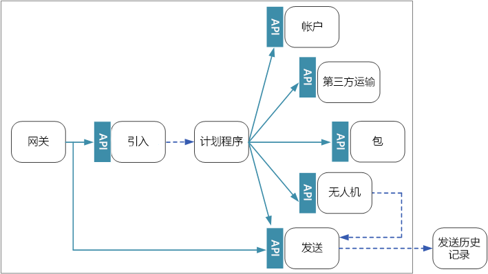
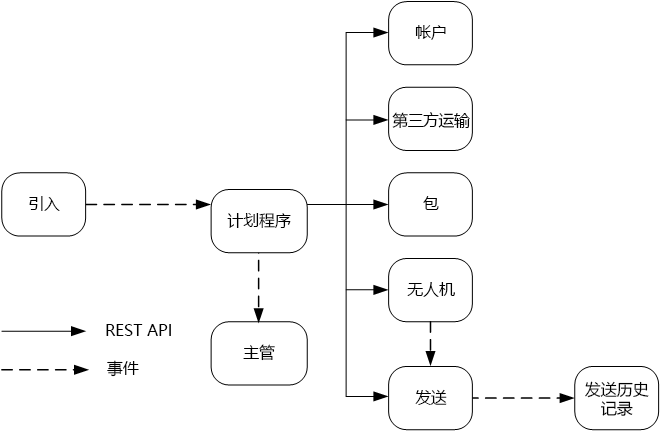

# 设计微服务：服务间通信Designing microservices: Interservice communication

微服务之间的通信必须高效可靠。Communication between microservices must be efficient and robust. 当有大量小型服务交互以完成单个事务时，可能会造成难题。With lots of small services interacting to complete a single transaction, this can be a challenge. 本章探讨异步消息传递与同步 API 之间的利弊。In this chapter, we look at the tradeoffs between asynchronous messaging versus synchronous APIs. 然后，探讨设计弹性服务间通信时存在的难题，以及服务网格可以发挥的作用。Then we look at some of the challenges in designing resilient interservice communication, and the role that a service mesh can play.

## 挑战Challenges 

下面是服务间通信存在的主要难题。Here are some of the main challenges arising from service-to-service communication. 本章稍后介绍的服务网格旨在应对其中的许多难题。Service meshes, described later in this chapter, are designed to handle many of these challenges.

**复原能力**。**Resiliency.** 任意给定的微服务可能有数十甚至数百个实例。There may be dozens or even hundreds of instances of any given microservice. 某个实例可能出于若干原因而发生故障。An instance can fail for any number of reasons. 可能出现节点级的故障，例如硬件故障或 VM 重新启动。There can be a node-level failure, such as a hardware failure or a VM reboot. 实例可能崩溃或收到不堪重负的请求，因此无法处理任何新请求。An instance might crash, or be overwhelmed with requests and unable to process any new requests. 其中的任何事件都可能导致网络调用失败。Any of these events can cause a network call to fail. 可以借助两种设计模式，以更具弹性的方式发出服务间的网络调用：There are two design patterns that can help make service-to-service network calls more resilient:

- **[重试](../patterns/retry.md)**。**[Retry](../patterns/retry.md)**. 网络调用可能出于暂时性故障（可自行消失）而失败。A network call may fail because of a transient fault that goes away by itself. 调用方不会彻底失败，而通常会重试操作特定的次数，或者重试到配置的超时期限结束为止。Rather than fail outright, the caller should typically retry the operation a certain number of times, or until a configured time-out period elapses. 但是，如果操作不是幂等的，则重试可能导致意外的副作用。However, if an operation is not idempotent, retries can cause unintended side effects. 原始调用可能成功，但调用方永远不会获得响应。The original call might succeed, but the caller never gets a response. 如果调用方重试，则可以调用操作两次。If the caller retries, the operation may be invoked twice. 一般而言，重试 POST 或 PATCH 方法并不安全，因为不保证这些方法是幂等的。Generally, it's not safe to retry POST or PATCH methods, because these are not guaranteed to be idempotent.

- **[断路器](../patterns/circuit-breaker.md)**。**[Circuit Breaker](../patterns/circuit-breaker.md)**. 如果失败的请求过多，可能会导致出现瓶颈，因为挂起的请求会在队列中累积。Too many failed requests can cause a bottleneck, as pending requests accumulate in the queue. 这些被阻止的请求可能占用关键的系统资源，例如内存、线程、数据库连接等，从而导致连发故障。These blocked requests might hold critical system resources such as memory, threads, database connections, and so on, which can cause cascading failures. 断路器模式可以防止服务重复尝试执行很可能失败的操作。The Circuit Breaker pattern can prevent a service from repeatedly trying an operation that is likely to fail. 

**负载均衡**。**Load balancing**. 当服务“A”调用服务“B”时，请求必须访问服务“B”的运行中实例。When service "A" calls service "B", the request must reach a running instance of service "B". 在 Kubernetes 中，`Service` 资源类型为一组 pod 提供稳定的 IP 地址。In Kubernetes, the `Service` resource type provides a stable IP address for a group of pods. 发往服务 IP 地址的网络流量将通过 iptable 规则转发到 pod。Network traffic to the service's IP address gets forwarded to a pod by means of iptable rules. 默认情况下，会选择随机 pod。By default, a random pod is chosen. 服务网格（请参阅下文）可以根据观测到的延迟或其他指标提供更智能化的负载均衡算法。A service mesh (see below) can provide more intelligent load balancing algorithms based on observed latency or other metrics.

**分布式跟踪**。**Distributed tracing**. 单个事务可能跨越多个服务。A single transaction may span multiple services. 因此，可能很难监视系统的整体性能和运行状况。That can make it hard to monitor the overall performance and health of the system. 即使每个服务都生成日志和指标，但如果不通过某种方法将这些信息关联在一起，则它们的作用有限。Even if every service generates logs and metrics, without some way to tie them together, they are of limited use. [日志记录和监视](./logging-monitoring.md)一章详细介绍了分布式跟踪，但本章会将此方法作为一个难点来讨论。The chapter [Logging and monitoring](./logging-monitoring.md) talks more about distributed tracing, but we mention it here as a challenge.

**服务版本控制**。**Service versioning**. 当团队部署某个服务的新版本时，必须避免中断其他任何服务或依赖于该服务的外部客户端。When a team deploys a new version of a service, they must avoid breaking any other services or external clients that depend on it. 此外，我们可能需要同时运行某个服务的多个版本，并将请求路由到特定的版本。In addition, you might want to run multiple versions of a service side-by-side, and route requests to a particular version. 有关此问题的详细讨论，请参阅 [API 版本控制](./api-design.md#api-versioning)。See [API Versioning](./api-design.md#api-versioning) for more discussion of this issue.

**TLS 加密和相互 TLS 身份验证**。**TLS encryption and mutual TLS authentication**. 出于安全原因，我们可能需要使用 TLS 加密服务之间的流量，并使用相互 TLS 身份验证对调用方进行身份验证。For security reasons, you may want to encrypt traffic between services with TLS, and use mutual TLS authentication to authenticate callers.

## 同步与异步消息传递Synchronous versus asynchronous messaging

微服务可以使用两种基本消息传递模式来与其他微服务通信。There are two basic messaging patterns that microservices can use to communicate with other microservices. 

1. 同步通信。Synchronous communication. 在此模式下，一个服务使用 HTTP 或 gRPC 等协议调用另一个服务公开的 API。In this pattern, a service calls an API that another service exposes, using a protocol such as HTTP or gRPC. 此选项之所以称作同步消息传递模式，是因为调用方需要等待接收方返回的响应。This option is a synchronous messaging pattern because the caller waits for a response from the receiver. 

2. 异步消息传递。Asynchronous message passing. 在此模式下，服务可以在不等待回应的情况下发送消息，然后一个或多个服务以异步方式处理该消息。In this pattern, a service sends message without waiting for a response, and one or more services process the message asynchronously.

必须区分异步 I/O 和异步协议。It's important to distinguish between asynchronous I/O and an asynchronous protocol. 异步 I/O 表示在完成 I/O 时，调用线程不会阻塞。Asynchronous I/O means the calling thread is not blocked while the I/O completes. 这对于性能很重要，但在体系结构方面需要规划实施细节。That's important for performance, but is an implementation detail in terms of the architecture. 异步协议表示发送方无需等待响应。An asynchronous protocol means the sender doesn't wait for a response. HTTP 是同步协议，不过，HTTP 客户端在发送请求时可以使用异步 I/O。HTTP is a synchronous protocol, even though an HTTP client may use asynchronous I/O when it sends a request. 

每种模式各有利弊。There are tradeoffs to each pattern. 请求/响应是易于理解的范例，因此，设计 API 在感觉上可能比设计消息传递系统更单纯。Request/response is a well-understood paradigm, so designing an API may feel more natural than designing a messaging system. 但是，异步消息传递在微服务体系结构中具有一些有利的优势：However, asynchronous messaging has some advantages that can be very useful in a microservices architecture:

- **减少耦合**。**Reduced coupling**. 消息发送方不需要了解使用者。The message sender does not need to know about the consumer. 

- **多个订阅方**。**Multiple subscribers**. 使用发布/订阅模型，多个使用者可以订阅事件接收。Using a pub/sub model, multiple consumers can subscribe to receive events. 请参阅[事件驱动的体系结构样式](/azure/architecture/guide/architecture-styles/event-driven)。See [Event-driven architecture style](/azure/architecture/guide/architecture-styles/event-driven).

- **故障隔离**。**Failure isolation**. 如果使用者发生故障，发送方仍可发送消息。If the consumer fails, the sender can still send messages. 当使用者恢复时，将拾取消息。The messages will be picked up when the consumer recovers. 此功能在微服务体系结构中尤其有用，因为每个服务具有自身的生命周期。This ability is especially useful in a microservices architecture, because each service has its own lifecycle. 在任意给定时间，服务可能不可用，或者被新版本取代。A service could become unavailable or be replaced with a newer version at any given time. 异步消息传递可以处理间歇性的停机。Asynchronous messaging can handle intermittent downtime. 另一方面，同步 API 需要下游服务保持可用，否则操作将会失败。Synchronous APIs, on the other hand, require the downstream service to be available or the operation fails. 
 
- **响应能力**。**Responsiveness**. 上游服务如果不需要等待下游服务完成处理，则可以更快地做出回复。An upstream service can reply faster if it does not wait on downstream services. 这一点在微服务体系结构中尤其有用。This is especially useful in a microservices architecture. 如果存在服务依赖关系链（服务 A 调用 B，后者调用 C，依此类推），则等待同步调用可能会增大不可接受的延迟时间。If there is a chain of service dependencies (service A calls B, which calls C, and so on), waiting on synchronous calls can add unacceptable amounts of latency.

- **负载调节**。**Load leveling**. 队列可以充当缓冲区来调节工作负荷，使接收方可以根据自身的速率处理消息。A queue can act as a buffer to level the workload, so that receivers can process messages at their own rate. 

- **工作流**。**Workflows**. 完成工作流中的每个步骤后，可以通过在消息中设置检查点，使用队列管理该工作流。Queues can be used to manage a workflow, by check-pointing the message after each step in the workflow.

但是，有效使用异步消息传递也存在一些难题。However, there are also some challenges to using asynchronous messaging effectively.

- **与消息传递基础结构耦合**。**Coupling with the messaging infrastructure**. 使用特定的消息传递基础结构可能导致与该基础结构紧密耦合。Using a particular messaging infrastructure may cause tight coupling with that infrastructure. 以后很难切换到另一个消息传递基础结构。It will be difficult to switch to another messaging infrastructure later.

- **延迟**。**Latency**. 如果消息队列已填满，则操作的端到端延迟可能变得很高。End-to-end latency for an operation may become high if the message queues fill up.  

- **成本**。**Cost**. 吞吐量较高时，消息传递基础结构的资金成本可能很大。At high throughputs, the monetary cost of the messaging infrastructure could be significant.

- **复杂性**。**Complexity**. 处理异步消息传递并不是一个简单的任务。Handling asynchronous messaging is not a trivial task. 例如，必须通过消除重复项或使操作成为幂等操作，来处理重复的消息。For example, you must handle duplicated messages, either by de-duplicating or by making operations idempotent. 此外，很难使用异步消息传递实现请求-响应语义。It's also hard to implement request-response semantics using asynchronous messaging. 若要发送响应，需要使用另一个队列，并通过某种方式来关联请求和响应消息。To send a response, you need another queue, plus a way to correlate request and response messages.

- **吞吐量**。**Throughput**. 如果消息需要队列语义，则队列可能成为系统中的瓶颈。If messages require *queue semantics*, the queue can become a bottleneck in the system. 每条消息至少需要一个排队操作和一个取消排队操作。Each message requires at least one queue operation and one dequeue operation. 此外，队列语义通常需要在消息传递基础结构中进行某种锁定。Moreover, queue semantics generally require some kind of locking inside the messaging infrastructure. 如果队列是托管服务，可能会进一步造成延迟，因为队列在群集虚拟网络的外部。If the queue is a managed service, there may be additional latency, because the queue is external to the cluster's virtual network. 可以通过批处理消息来缓解这些问题，但这会增加代码的复杂性。You can mitigate these issues by batching messages, but that complicates the code. 如果消息不需要队列语义，也许可以事件流来取代队列。If the messages don't require queue semantics, you might be able to use an event *stream* instead of a queue. 有关详细信息，请参阅[事件驱动的体系结构样式](../guide/architecture-styles/event-driven.md)。For more information, see [Event-driven architectural style](../guide/architecture-styles/event-driven.md).  

## 无人机交付：选择消息传递模式Drone Delivery: Choosing the messaging patterns

考虑到上述因素，开发团队针对无人机交付应用程序做出了以下设计选择With these considerations in mind, the development team made the following design choices for the Drone Delivery application

- 引入服务公开一个公共 REST API，客户端应用程序使用该 API 来安排、更新或取消交付。The Ingestion service exposes a public REST API that client applications use to schedule, update, or cancel deliveries.

- 引入服务使用事件中心将异步消息发送到计划程序服务。The Ingestion service uses Event Hubs to send asynchronous messages to the Scheduler service. 必须使用异步消息来实现引入操作所需的负载调节。Asynchronous messages are necessary to implement the load-leveling that is required for ingestion. 有关引入服务和计划程序服务交互方式的详细信息，请参阅[引入和工作流][ingestion-workflow]。For details on how the Ingestion and Scheduler services interact, see [Ingestion and workflow][ingestion-workflow].

- 帐户、交付、包裹、无人机和第三方运输服务全部公开内部 REST API。The Account, Delivery, Package, Drone, and Third-party Transport services all expose internal REST APIs. 计划程序服务调用这些 API 来执行用户请求。The Scheduler service calls these APIs to carry out a user request. 使用同步 API 的原因之一是计划程序需要从每个下游服务获取响应。One reason to use synchronous APIs is that the Scheduler needs to get a response from each of the downstream services. 任何一个下游服务失败都意味着整个操作失败。A failure in any of the downstream services means the entire operation failed. 但是，一个潜在的问题是调用后端服务造成的延迟量。However, a potential issue is the amount of latency that is introduced by calling the backend services. 

- 如果任一下游服务出现非暂时性故障，应将整个事务标记为失败。If any downstream service has a non-transient failure, the entire transaction should be marked as failed. 为了应对这种情况，计划程序服务会将异步消息发送给监督程序，使监督程序能够根据[引入和工作流][ingestion-workflow]一章中所述计划补偿事务。To handle this case, the Scheduler service sends an asynchronous message to the Supervisor, so that the Supervisor can schedule compensating transactions, as described in the chapter [Ingestion and workflow][ingestion-workflow].   

- 交付服务公开一个公共 API，客户端可使用该 API 获取交付状态。The Delivery service exposes a public API that clients can use to get the status of a delivery. [API 网关](./gateway.md)一章介绍了 API 网关如何在客户端中隐藏基础服务，使客户端不需要知道哪些服务公开了哪些 API。In the chapter [API gateway](./gateway.md), we discuss how an API gateway can hide the underlying services from the client, so the client doesn't need to know which services expose which APIs. 

- 当某架无人机已起飞时，无人机服务会发送包含该无人机当前位置和状态的事件。While a drone is in flight, the Drone service sends events that contain the drone's current location and status. 交付服务会侦听这些事件，以跟踪交付状态。The Delivery service listens to these events in order to track the status of a delivery.

- 当交付状态发生更改时，交付服务会发送交付状态事件，例如 `DeliveryCreated` 或 `DeliveryCompleted`。When the status of a delivery changes, the Delivery service sends a delivery status event, such as `DeliveryCreated` or `DeliveryCompleted`. 任何服务都可以订阅这些事件。Any service can subscribe to these events. 在当前设计中，交付服务是唯一的订阅方，但以后可能会推出其他订阅方。In the current design, the Delivery service is the only subscriber, but there might be other subscribers later. 例如，事件可能会进入实时分析服务。For example, the events might go to a real-time analytics service. 此外，由于计划程序无需等待响应，添加更多的订阅方并不影响主要工作流路径。And because the Scheduler doesn't have to wait for a response, adding more subscribers doesn't affect the main workflow path.

请注意，交付状态事件派生自无人机位置事件。Notice that delivery status events are derived from drone location events. 例如，当无人机抵达交货地点并投递了包裹时，交付服务会将此状态转换为 DeliveryCompleted 事件。For example, when a drone reaches a delivery location and drops off a package, the Delivery service translates this into a DeliveryCompleted event. 这是在域模型方面可以考虑的一个示例。This is an example of thinking in terms of domain models. 如前所述，无人机管理属于独立的边界上下文。As described earlier, Drone Management belongs in a separate bounded context. 无人机事件传达无人机的物理位置。The drone events convey the physical location of a drone. 另一方面，交付事件表示交付状态的更改，属于不同的业务实体。The delivery events, on the other hand, represent changes in the status of a delivery, which is a different business entity.

## 使用服务网格Using a service mesh

服务网格是处理服务间通信的软件层。A *service mesh* is a software layer that handles service-to-service communication. 服务网格旨在解决上一部分中列出的许多问题，并将这些问题的责任从微服务本身转移到共享层。Service meshes are designed to address many of the concerns listed in the previous section, and to move responsibility for these concerns away from the microservices themselves and into a shared layer. 服务网格充当代理，可截获群集中微服务之间的网络通信。The service mesh acts as a proxy that intercepts network communication between microservices in the cluster. 

> [!NOTE]
> 服务网格是[代表模式](../patterns/ambassador.md)（代表应用程序发送网络请求的帮助程序服务）的一个例子。Service mesh is an example of the [Ambassador pattern](../patterns/ambassador.md) &mdash; a helper service that sends network requests on behalf of the application. 

目前，Kubernetes 中服务网格的主要选项包括 [linkerd](https://linkerd.io/) 和 [Istio](https://istio.io/)。Right now, the main options for a service mesh in Kubernetes are [linkerd](https://linkerd.io/) and [Istio](https://istio.io/). 这两种技术正在快速演进。Both of these technologies are evolving rapidly. 在编写本指南时，最新的 Istio 版本为 0.2，因此它仍然是很新的技术。At the time we wrote this guide, the latest Istio release is 0.2, so it is still very new. 但是，linkerd 和 Istio 具有一些共同的功能，包括：However, some features that both linkerd and Istio have in common include: 

- 根据观测到的延迟或未完成的请求数，在会话级别进行负载均衡。Load balancing at the session level, based on observed latencies or number of outstanding requests. 这样，便可以基于 Kubernetes 提供的第 4 层负载均衡来提高性能。This can improve performance over the layer-4 load balancing that is provided by Kubernetes. 

- 基于 URL 路径、主机标头、API 版本或其他应用程序级规则进行第 7 层路由。Layer-7 routing based on URL path, Host header, API version, or other application-level rules.

- 失败请求重试。Retry of failed requests. 服务网格可识别 HTTP 错误代码，并可以自动重试失败的请求。A service mesh understands HTTP error codes, and can automatically retry failed requests. 可以配置最大重试次数和超时期限，以限制最大延迟。You can configure that maximum number of retries, along with a timeout period in order to bound the maximum latency. 

- 断路。Circuit breaking. 如果某个实例一直无法完成请求，则服务网格会暂时性地将它标记为不可用。If an instance consistently fails requests, the service mesh will temporarily mark it as unavailable. 在回退期过后，服务将重试该实例。After a backoff period, it will try the instance again. 可以根据多个条件（例如连续失败次数）来配置断路器。You can configure the circuit breaker based on various criteria, such as the number of consecutive failures,  

- 服务网格会捕获有关服务间调用的指标，例如请求量、延迟、错误和成功率，以及响应大小。Service mesh captures metrics about interservice calls, such as the request volume, latency, error and success rates, and response sizes. 此外，服务网格可以通过添加请求中每个跃点的关联信息，来启用分布式跟踪。The service mesh also enables distributed tracing by adding correlation information for each hop in a request.

- 服务间调用的相互 TLS 身份验证。Mutual TLS Authentication for service-to-service calls.

是否需要服务网格？Do you need a service mesh? 显然，服务网格为分布式系统带来的价值很有吸引力。The value they add to a distributed system is certainly compelling. 如果不使用服务网格，则需要考虑本章开头所述的难题。If you don't have a service mesh, you will need to consider each of the challenges mentioned at the beginning of the chapter. 不使用服务网格也可以解决重试、断路器和分布式跟踪等方面的问题，但是，服务网格可将这些问题从单个服务转移到专用的层。You can solve problems like retry, circuit breaker, and distributed tracing without a service mesh, but a service mesh moves these concerns out of the individual services and into a dedicated layer. 另一方面，服务网格是相对较新的技术，目前仍需完善。On the other hand, service meshes are a relatively new technology that is still maturing. 部署服务网格会增大群集设置和配置的复杂性。Deploying a service mesh adds complexity to the setup and configuration of the cluster. 另外，它可能造成性能影响，因为请求现在是通过服务网格代理路由的，并且附加的服务在群集中的每个节点上运行。There may be performance implications, because requests now get routed through the service mesh proxy, and because extra services are now running on every node in the cluster. 在生产环境中部署服务网格之前，应该执行全面的性能和负载测试。You should do thorough performance and load testing before deploying a service mesh in production.

> [!div class="nextstepaction"]
> [API 设计API design](./api-design.md)

<!-- links -->

[ingestion-workflow]: ./ingestion-workflow.md
