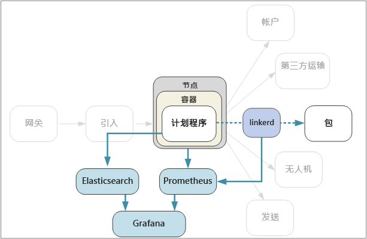

# <a name="designing-microservices-logging-and-monitoring"></a>设计微服务：日志记录和监视

任何复杂的应用程序偶尔都会出现错误。 在微服务应用程序中，需要跟踪几十甚至几百个服务发生的情况。 要获取系统的整体视图，日志记录和监视至关重要。 



在微服务体系结构中，查明错误或性能瓶颈的确切原因可能特别困难。 单个用户操作可能跨越多个服务。 服务可能达到群集中的网络 I/O 限制。 服务之间的调用链可能会在系统中造成反压，从而导致高延迟或连锁故障。 此外，我们通常不知道特定容器在哪个节点中运行。 放在同一节点上的容器可能争用有限的 CPU 或内存。 

为了反映所发生的情况，应用程序必须发出遥测事件。 可以将这些事件分类为指标和基于文本的日志。 

指标是可以分析的数字值。 可以使用指标实时（或接近实时）观察系统，或者分析不同时间段的性能趋势。 指标包括：

- 节点级系统指标，包括 CPU、内存、网络、磁盘和文件系统的使用情况。 借助系统指标可以了解群集中每个节点的资源分配，以及排查异常。
 
- Kubernetes 指标。 由于服务在容器中运行，因此我们需要在容器级别而不仅仅是 VM 级别收集指标。 在 Kubernetes 中，cAdvisor (Container Advisor) 是收集有关每个容器使用的 CPU、内存、文件系统和网络资源的统计信息的代理。 kubelet 后台程序从 cAdvisor 收集资源统计信息，并通过 REST API 公开这些信息。
   
- 应用程序指标。 包括用于了解服务行为的任何指标。 示例包括排队的入站 HTTP 请求数、请求延迟、消息队列长度或每秒处理的事务数。

- 依赖服务指标。 群集中的服务可能调用群集外部的服务，例如托管的 PaaS 服务。 可以使用 [Azure Monitor](/azure/monitoring-and-diagnostics/monitoring-overview) 监视 Azure 服务。 第三方服务不一定提供任何指标。 如果未提供，则必须依赖自己的应用程序指标来跟踪有关延迟和错误率的统计信息。

日志是运行应用程序时发生的事件的记录。 日志包括应用程序日志（跟踪语句）或 Web 服务器日志等。 日志主要用于取证和根本原因分析。 

## <a name="considerations"></a>注意事项

[监视和诊断](../best-practices/monitoring.md)一文介绍了有关监视应用程序的一般最佳做法。 下面是在微服务体系结构上下文中需要考虑的一些具体事项。

**配置和管理**。 是要使用托管服务进行日志记录和监视，还是将日志记录和监视组件作为容器部署在群集中？ 有关这些选项的更多介绍，请参阅下面的[技术选项](#technology-options)部分。

**引入速率**。 系统能够以多高的吞吐量引入遥测事件？ 如果超过该速率，会发生什么情况？ 例如，系统可能会限制客户端，在这种情况下，遥测数据将会丢失，或者减少数据采样。 有时，可以通过减少收集的数据量来缓解此问题：

  - 通过计算平均值和标准偏差等统计信息来聚合指标，然后将该统计数据发送到监视系统。  

  - 减少数据采样 &mdash; 即，只处理一定百分比的事件。

  - 批处理数据，以减少监视服务的网络调用次数。

**成本**。 引入和存储遥测数据可能会产生较高的成本，尤其是引入大量数据时。 在某些情况下，这项成本甚至会超过运行应用程序的成本。 在这种情况下，可能需要根据前面所述，通过聚合、减少采样或批处理数据，来减少遥测量。 
        
**数据保真度**。 指标的精确度如何？ 平均值可能隐藏离群值，尤其是在大规模操作的情况下。 此外，如果采样率过低，则数据的波动可能不明显。 看上去所有请求具有相同的端到端延迟，但实际上有相当多的请求花费更长的时间。 

**延迟**。 若要实现实时监视和警报，应快速提供遥测数据。 数据显示在监视仪表板上的“实时性”有多高？ 只需几秒钟？ 还是需要一分钟以上？

**存储**。 在日志方面，最有有效的做法可能是将日志事件写入群集中的临时存储，并配置一个代理，以将日志文件传送到更持久的存储。  最终应将数据移到长期存储用于追溯分析。 微服务体系结构可能会生成大量的遥测数据，因此，存储该数据的成本是一个重要的考虑因素。 此外，应考虑查询数据的方式。 

**仪表板和可视化效果**。 是否要跨群集和外部服务中的所有服务获取系统的整体视图？ 如果要将遥测数据和日志写入多个位置，仪表板是否可以显示并关联所有这些信息？ 监视仪表板至少应显示以下信息：

- 总体资源分配容量和增长情况。 这包括容器数目、文件系统指标、网络和核心分配。
- 在服务级别关联的容器指标。
- 与容器关联的系统指标。
- 服务错误和异常。
    

## <a name="distributed-tracing"></a>分布式跟踪

如前所述，微服务中的难题之一是如何了解跨服务的事件流。 单个操作或事务可能涉及对多个服务的调用。 若要重新构造整个步骤序列，每个服务应该传播一个关联 ID 用于充当该操作的唯一标识符。 该关联 ID 可以实现跨服务的[分布式跟踪](http://microservices.io/patterns/observability/distributed-tracing.html)。

接收客户端请求的第一个服务应生成关联 ID。 如果该服务对另一服务发出 HTTP 调用，它会在请求标头中放置关联 ID。 同样，如果该服务发送异步消息，则会在该消息中放置关联 ID。 下游服务继续传播关联 ID，以便可以流经整个系统。 此外，写入应用程序指标或日志事件的所有代码都应包含关联 ID。

关联服务调用后，可以计算操作指标，例如整个事务的端到端延迟、每秒成功的事务数和失败的事务百分比。 在应用程序日志中包含关联 ID 可以执行根本原因分析。 如果某个操作失败，你可以查找同一操作中包含的所有服务调用的日志语句。 

下面是在实施分布式跟踪时的一些注意事项：

- 目前，关联 ID 没有标准的 HTTP 标头。 团队应该针对自定义标头值进行标准化。 请根据日志记录/监视框架或所选的服务网格做出选择。

- 对于异步消息，如果消息传递基础结构支持将元数据添加到消息，则应将关联 ID 包含为元数据。 否则，请将关联 ID 包含为消息架构的一部分。

- 如果不包含单个不透明标识符，可以发送一个包含更丰富信息（例如调用方-被调用方关系）的关联上下文。 

- Azure Application Insights SDK 会自动将关联上下文注入 HTTP 标头，并在 Application Insights 日志中包含关联 ID。 如果你确定使用 Application Insights 中内置的关联功能，根据所用的库，某些服务可能仍需要显式传播关联标头。 有关详细信息，请参阅 [Application Insights 中的遥测关联](/azure/application-insights/application-insights-correlation)。
   
- 如果使用 Istio 或 linkerd 作为服务网格，当通过服务网格代理路由 HTTP 调用时，这些技术会自动生成关联标头。 服务应转发关联标头。 

    - Istio：[分布式请求跟踪](https://istio-releases.github.io/v0.1/docs/tasks/zipkin-tracing.html)
    
    - linkerd：[上下文标头](https://linkerd.io/config/1.3.0/linkerd/index.html#http-headers)
    
- 请考虑如何聚合日志。 可能需要在不同的团队之间标准化在日志中包含关联 ID 的方式。 使用结构化或半结构化格式（例如 JSON），并定义一个公用字段来保存关联 ID。

## <a name="technology-options"></a>技术选项

**Application Insights** 是 Azure 中的一个托管服务，可引入和存储遥测数据，并提供用于分析和搜索数据的工具。 若要使用 Application Insights，请在应用程序中安装一个检测包。 此包可监视应用，并将遥测数据发送到 Application Insights 服务。 此外，它还可以从宿主环境提取遥测数据。 Application Insights 提供内置的关联和依赖项跟踪。 可以在 Application Insights 中的单个位置跟踪系统指标、应用程序指标和 Azure 服务指标。

请注意，如果数据传输率超过最大限制，则 Application Insights 会实施限制；有关详细信息，请参阅 [Application Insights 限制](/azure/azure-subscription-service-limits#application-insights-limits)。 单个操作可能生成多个遥测事件，因此，如果应用程序遇到较大的流量，可能会受到限制。 若要缓解此问题，可以执行采样来减少遥测流量。 弊端是指标的精确度会下降。 有关详细信息，请参阅 [Application Insights 中的采样](/azure/application-insights/app-insights-sampling)。 也可以通过预先聚合指标来减少数据量 &mdash; 即，计算平均值和标准偏差等统计值，然后发送这些值而不是原始遥测数据。 以下博客文章介绍了大规模使用 Application Insights 的方法：[Azure Monitoring and Analytics at Scale](https://blogs.msdn.microsoft.com/azurecat/2017/05/11/azure-monitoring-and-analytics-at-scale/)（大规模使用 Azure 监视和分析）。

此外，请确保了解 Application Insights 的定价模型，因为该产品根据数据量收费。 有关详细信息，请参阅[在 Application Insights 中管理定价和数据量](/azure/application-insights/app-insights-pricing)。 如果应用程序生成大量遥测数据，而你不希望对这些数据执行采样或聚合，则 Application Insights 可能不是适当的选择。 

如果 Application Insights 不满足要求，可以参考以下一些建议的方法来使用流行开源技术。

对于系统和容器指标，请考虑将指标导出到群集中运行的时序数据库，例如 **Prometheus** 或 **InfluxDB**。

- InfluxDB 是基于推送的系统。 某个代理需要推送指标。 在这种情况下，可以使用 [Heapster][heapster]，该服务可从 kubelet 收集整个群集的指标，聚合数据，然后将其推送到 InfluxDB 或其他时序存储解决方案。 在设置群集的过程中，Azure 容器服务会部署 Heapster。 另一个选项是 [Telegraf](https://www.influxdata.com/time-series-platform/telegraf/)，这是一个用于收集和报告指标的代理。 

- Prometheus 是基于提取的系统。 它定期从配置的位置擦除指标。 Prometheus 可以擦除 cAdvisor 或 kube-state-metrics 生成的指标。 [kube-state-metrics][kube-state-metrics] 服务从 Kubernetes API 服务器收集指标，然后将这些指标提供给 Prometheus（或者与 Prometheus 客户端终结点兼容的擦除程序）。 Heapster 聚合 Kubernetes 生成的指标并将其转发到接收器，而 kube-state-metrics 生成自身的指标并通过终结点提供这些指标以进行擦除。 对于系统指标，请使用 [Node 导出程序](https://github.com/prometheus/node_exporter)，这是一个针对系统指标的 Prometheus 导出程序。 Prometheus 支持浮点数据，但不支持字符串数据，因此，它适合用于系统指标，而不适合用于日志。

- 使用 **Kibana** 或 **Grafana** 等仪表板工具来可视化和监视数据。 仪表板服务还可以在群集中的容器内运行。

对于应用程序日志，请考虑使用 **Fluentd** 和 **Elasticsearch**。 Fluentd 是一个开源数据收集器，Elasticsearch 是经过优化的文档数据库，可以充当搜索引擎。 使用此方法，每个服务可将日志发送到 `stdout` 和 `stderr`，而 Kubernetes 可将这些流写入本地文件系统。 Fluentd 收集日志，并选择性地使用来自 Kubernetes 的其他元数据丰富这些日志，然后将日志发送到 Elasticsearch。 使用 Kibana、Grafana 或类似工具为 Elasticsearch 创建仪表板。 Fluentd 在群集中作为守护程序集运行，确保为每个节点分配一个 Fluentd pod。 可将 Fluentd 配置为收集 kubelet 日志和容器日志。 在数据量较高的情况下，将日志写入本地文件系统可能造成性能瓶颈，尤其是多个服务在同一个节点上运行时。 监视生产环境中的磁盘延迟和文件系统利用率。

为日志结合使用 Fluentd 和 Elasticsearch 的优势之一是，服务不需要任何附加的库依赖项。 每个服务只需写入 `stdout` 和 `stderr`，而 Fluentd 会处理将日志导出到 Elasticsearch 的过程。 此外，编写服务的团队无需了解如何配置日志记录基础结构。 难题之一是如何为生产部署配置 Elasticsearch 群集，使其能够根据流量处理要求进行缩放。 

另一种做法是将日志发送到 Operations Management Suite (OMS) Log Analytics。 [Log Analytics][log-analytics] 服务将日志数据收集到中心存储库，此外还可以合并来自应用程序使用的其他 Azure 服务的数据。 有关详细信息，请参阅[使用 Microsoft Operations Management Suite (OMS) 监视 Azure 容器服务群集][k8s-to-oms]。

## <a name="example-logging-with-correlation-ids"></a>示例：使用关联 ID 的日志记录

为了演示本章所述的某些要点，下面提供了一个有关 Package 服务如何实现日志记录的详细示例。 该 Package 服务是以 TypeScript 编写的，使用适用于 Node.js 的 [Koa](http://koajs.com/) Web 框架。 可以在多个 Node.js 日志记录库中进行选择。 我们选择了 [Winston](https://github.com/winstonjs/winston)，经过测试，它是符合我们性能要求的流行日志记录库。

为了封装实现详细信息，我们定义了一个抽象 `ILogger` 接口：

```ts
export interface ILogger {
    log(level: string, msg: string, meta?: any)
    debug(msg: string, meta?: any)
    info(msg: string, meta?: any)
    warn(msg: string, meta?: any)
    error(msg: string, meta?: any)
}
```

下面是包装 Winston 库的 `ILogger` 实现。 该实例使用关联 ID 作为构造函数参数，并将该 ID 注入每个日志消息。 

```ts
class WinstonLogger implements ILogger {
    constructor(private correlationId: string) {}
    log(level: string, msg: string, payload?: any) {
        var meta : any = {};
        if (payload) { meta.payload = payload };
        if (this.correlationId) { meta.correlationId = this.correlationId }
        winston.log(level, msg, meta)
    }
  
    info(msg: string, payload?: any) {
        this.log('info', msg, payload);
    }
    debug(msg: string, payload?: any) {
        this.log('debug', msg, payload);
    }
    warn(msg: string, payload?: any) {
        this.log('warn', msg, payload);
    }
    error(msg: string, payload?: any) {
        this.log('error', msg, payload);
    }
}
```

Package 服务需要从 HTTP 请求提取关联 ID。 例如，如果使用的是 linkerd，则可以在 `l5d-ctx-trace` 标头中找到关联 ID。 在 Koa 中，HTTP 请求存储在通过请求处理管道传递的 Context 对象中。 我们可以定义一个中间件函数，以便从 Context 获取关联 ID 并初始化记录器。 （Koa 中的中间件函数只是一个针对每个请求执行的函数。）

```ts
export type CorrelationIdFn = (ctx: Context) => string;

export function logger(level: string, getCorrelationId: CorrelationIdFn) {
    winston.configure({ 
        level: level,
        transports: [new (winston.transports.Console)()]
        });
    return async function(ctx: any, next: any) {
        ctx.state.logger = new WinstonLogger(getCorrelationId(ctx));
        await next();
    }
}
```

此中间件调用调用方定义的函数 `getCorrelationId`，以获取关联 ID。 然后，它创建记录器的实例并将其储藏在 `ctx.state`（Koa 中使用的一个键值字典，用于通过管道传递信息）中。 

在启动时，记录器中间件将添加到管道：

```ts
app.use(logger(Settings.logLevel(), function (ctx) {
    return ctx.headers[Settings.correlationHeader()];  
}));
```

完成所有配置后，便可以轻松地将日志记录语句添加到代码中。 例如，下面是一个查找包的方法。 该方法对 `ILogger.info` 方法发出两次调用。

```ts
async getById(ctx: any, next: any) {
  var logger : ILogger = ctx.state.logger;
  var packageId = ctx.params.packageId;
  logger.info('Entering getById, packageId = %s', packageId);

  await next();

  let pkg = await this.repository.findPackage(ctx.params.packageId)

  if (pkg == null) {
    logger.info(`getById: %s not found`, packageId);
    ctx.response.status= 404;
    return;
  }

  ctx.response.status = 200;
  ctx.response.body = this.mapPackageDbToApi(pkg);
}
```

我们不需要在日志记录语句中包含关联 ID，因为中间件函数会自动执行该操作。 这可以使日志记录代码显得更简洁，并可以减少开发人员忘记包含关联 ID 的可能性。 此外，由于所有日志记录语句使用抽象 `ILogger` 接口，因此以后我们可以轻松替换记录器实现。

> [!div class="nextstepaction"]
> [持续集成和交付](./ci-cd.md)

<!-- links -->

[app-insights]: /azure/application-insights/app-insights-overview
[heapster]: https://github.com/kubernetes/heapster
[kube-state-metrics]: https://github.com/kubernetes/kube-state-metrics
[k8s-to-oms]: /azure/container-service/kubernetes/container-service-kubernetes-oms
[log-analytics]: /azure/log-analytics/