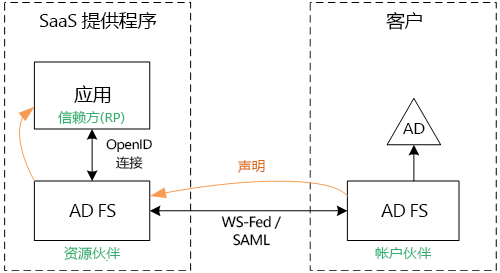
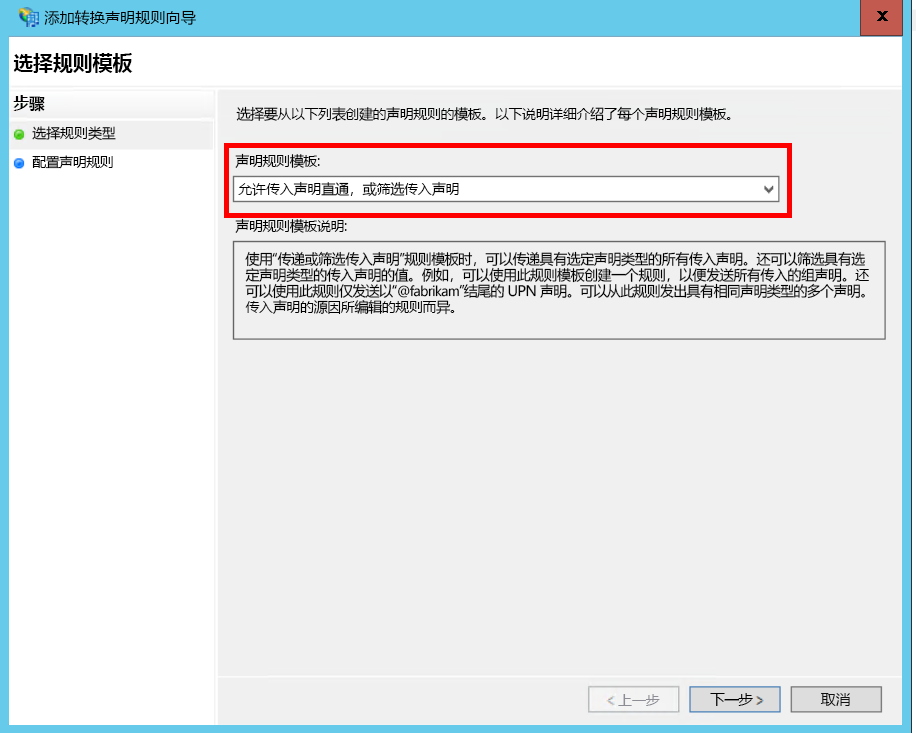
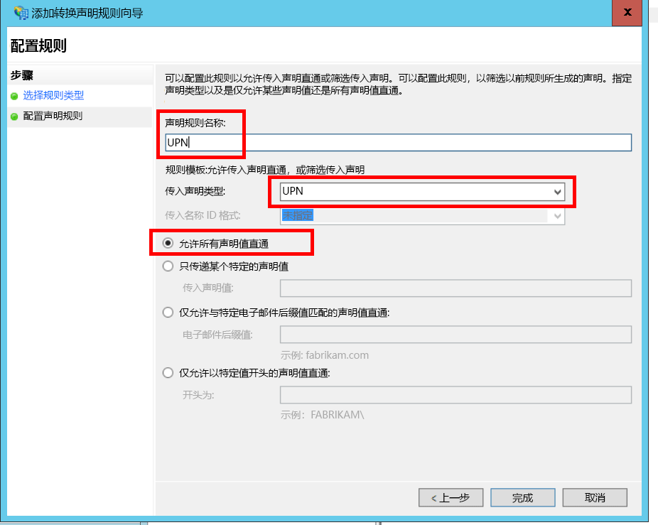
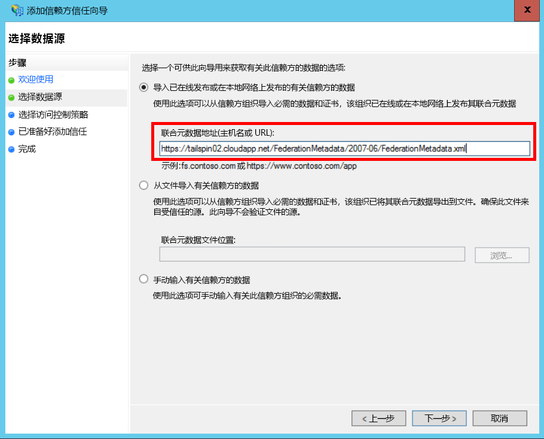
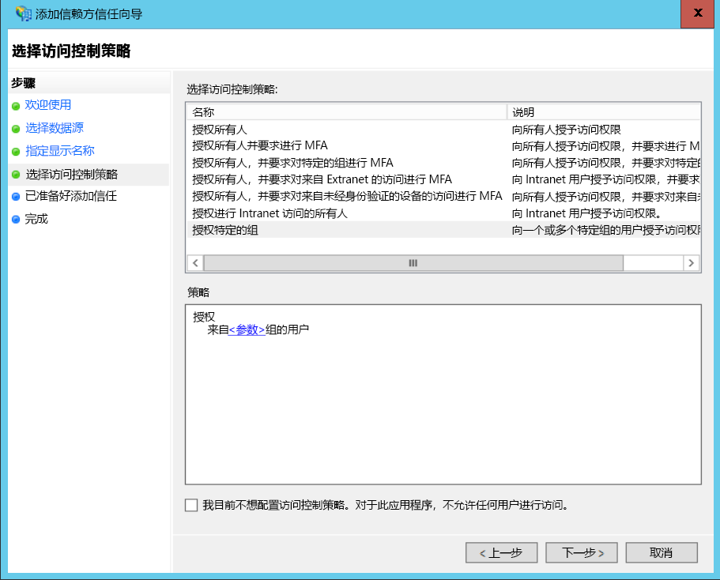
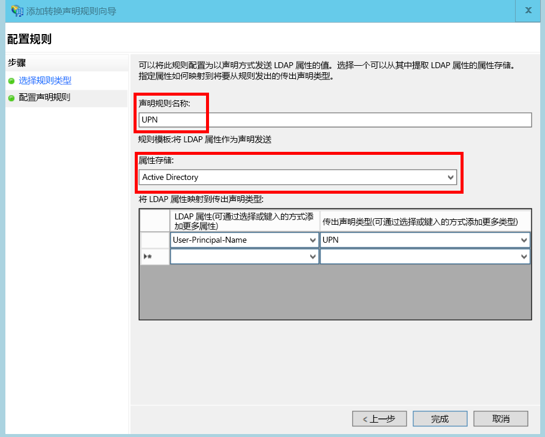
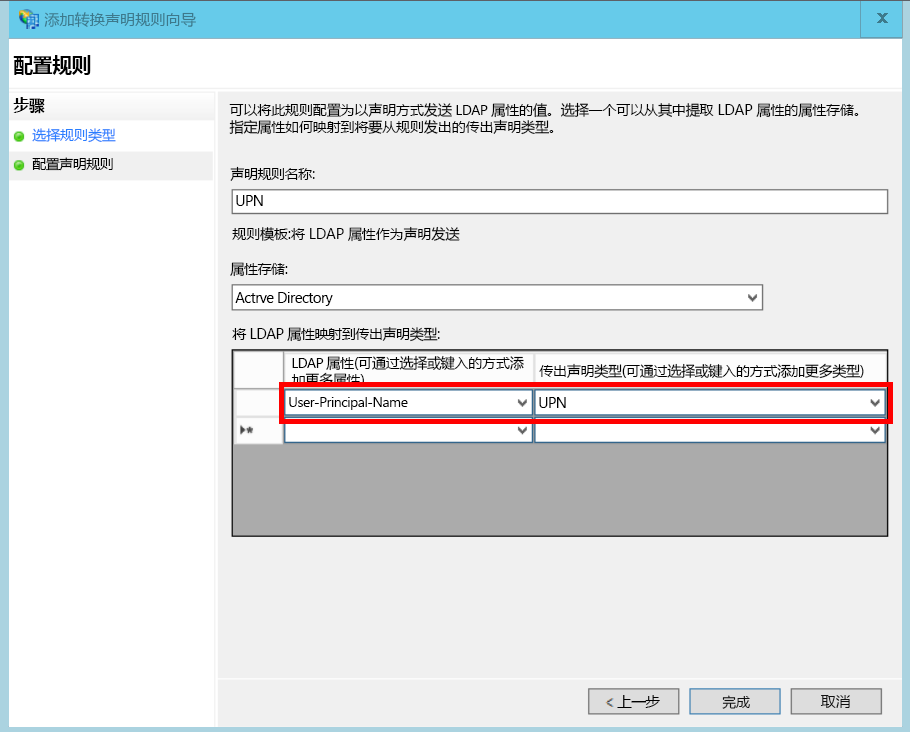

# <a name="federate-with-a-customers-ad-fs"></a><span data-ttu-id="71a98-103">与客户的 AD FS 联合</span><span class="sxs-lookup"><span data-stu-id="71a98-103">Federate with a customer's AD FS</span></span>

<span data-ttu-id="71a98-104">本文介绍了多租户 SaaS 应用程序如何支持通过 Active Directory 联合身份验证服务 (AD FS) 进行的身份验证，以便与客户的 AD FS 联合。</span><span class="sxs-lookup"><span data-stu-id="71a98-104">This article describes how a multi-tenant SaaS application can support authentication via Active Directory Federation Services (AD FS), in order to federate with a customer's AD FS.</span></span>

## <a name="overview"></a><span data-ttu-id="71a98-105">概述</span><span class="sxs-lookup"><span data-stu-id="71a98-105">Overview</span></span>
<span data-ttu-id="71a98-106">Azure Active Directory (Azure AD) 让从 Azure AD 租户（包括 Office365 和 Dynamics CRM Online 客户）登录用户变得简便易行。</span><span class="sxs-lookup"><span data-stu-id="71a98-106">Azure Active Directory (Azure AD) makes it easy to sign in users from Azure AD tenants, including Office365 and Dynamics CRM Online customers.</span></span> <span data-ttu-id="71a98-107">但是，在公司 Intranet 使用本地 Active Directory 的客户该怎么办？</span><span class="sxs-lookup"><span data-stu-id="71a98-107">But what about customers who use on-premise Active Directory on a corporate intranet?</span></span>

<span data-ttu-id="71a98-108">一种选择是，客户使用 [Azure AD Connect] 将其本地 AD 与 Azure AD 同步。</span><span class="sxs-lookup"><span data-stu-id="71a98-108">One option is for these customers to sync their on-premise AD with Azure AD, using [Azure AD Connect].</span></span> <span data-ttu-id="71a98-109">但是，由于公司的 IT 政策或其他原因，某些客户可能无法使用此方法。</span><span class="sxs-lookup"><span data-stu-id="71a98-109">However, some customers may be unable to use this approach, due to corporate IT policy or other reasons.</span></span> <span data-ttu-id="71a98-110">在这种情况下，另一个选择是通过 Active Directory 联合身份验证服务 (AD FS) 进行联合。</span><span class="sxs-lookup"><span data-stu-id="71a98-110">In that case, another option is to federate through Active Directory Federation Services (AD FS).</span></span>

<span data-ttu-id="71a98-111">若要启用此方案：</span><span class="sxs-lookup"><span data-stu-id="71a98-111">To enable this scenario:</span></span>

* <span data-ttu-id="71a98-112">客户必须具有面向 Internet 的 AD FS 场。</span><span class="sxs-lookup"><span data-stu-id="71a98-112">The customer must have an Internet-facing AD FS farm.</span></span>
* <span data-ttu-id="71a98-113">SaaS 提供程序部署自己的 AD FS 场。</span><span class="sxs-lookup"><span data-stu-id="71a98-113">The SaaS provider deploys their own AD FS farm.</span></span>
* <span data-ttu-id="71a98-114">客户和 SaaS 提供程序必须设置[联合身份验证信任]。</span><span class="sxs-lookup"><span data-stu-id="71a98-114">The customer and the SaaS provider must set up [federation trust].</span></span> <span data-ttu-id="71a98-115">这是一个手动过程。</span><span class="sxs-lookup"><span data-stu-id="71a98-115">This is a manual process.</span></span>

<span data-ttu-id="71a98-116">在信任关系中有三个主要角色：</span><span class="sxs-lookup"><span data-stu-id="71a98-116">There are three main roles in the trust relation:</span></span>

* <span data-ttu-id="71a98-117">客户的 AD FS 是[帐户伙伴]，负责从客户的 AD 中对用户进行身份验证，并使用用户声明创建安全令牌。</span><span class="sxs-lookup"><span data-stu-id="71a98-117">The customer's AD FS is the [account partner], responsible for authenticating users from the customer's AD, and creating security tokens with user claims.</span></span>
* <span data-ttu-id="71a98-118">SaaS 提供程序的 AD FS 是[资源伙伴]，负责信任帐户伙伴和接收用户声明。</span><span class="sxs-lookup"><span data-stu-id="71a98-118">The SaaS provider's AD FS is the [resource partner], which trusts the account partner and receives the user claims.</span></span>
* <span data-ttu-id="71a98-119">应用程序在 SaaS 提供程序的 AD FS 中配置为信赖方 (RP)。</span><span class="sxs-lookup"><span data-stu-id="71a98-119">The application is configured as a relying party (RP) in the SaaS provider's AD FS.</span></span>
  
  

> [!NOTE]
> <span data-ttu-id="71a98-121">在本文中，我们假设应用程序使用 OpenID connect 作为身份验证协议。</span><span class="sxs-lookup"><span data-stu-id="71a98-121">In this article, we assume the application uses OpenID connect as the authentication protocol.</span></span> <span data-ttu-id="71a98-122">另一种选择是使用 WS 联合身份验证。</span><span class="sxs-lookup"><span data-stu-id="71a98-122">Another option is to use WS-Federation.</span></span>
> 
> <span data-ttu-id="71a98-123">对于 OpenID Connect，SaaS 提供程序必须使用在 Windows Server 2016 中运行的 AD FS 2016。</span><span class="sxs-lookup"><span data-stu-id="71a98-123">For OpenID Connect, the SaaS provider must use AD FS 2016, running in Windows Server 2016.</span></span> <span data-ttu-id="71a98-124">AD FS 3.0 不支持 OpenID Connect。</span><span class="sxs-lookup"><span data-stu-id="71a98-124">AD FS 3.0 does not support OpenID Connect.</span></span>
> 
> <span data-ttu-id="71a98-125">ASP.NET Core 没有现成可用的 WS 联合身份验证支持。</span><span class="sxs-lookup"><span data-stu-id="71a98-125">ASP.NET Core does not include out-of-the-box support for WS-Federation.</span></span>
> 
> 

<span data-ttu-id="71a98-126">有关将 WS 联合身份验证与 ASP.NET 4 配合使用的示例，请参阅 [active-directory-dotnet-webapp-wsfederation 示例][active-directory-dotnet-webapp-wsfederation]。</span><span class="sxs-lookup"><span data-stu-id="71a98-126">For an example of using WS-Federation with ASP.NET 4, see the [active-directory-dotnet-webapp-wsfederation sample][active-directory-dotnet-webapp-wsfederation].</span></span>

## <a name="authentication-flow"></a><span data-ttu-id="71a98-127">身份验证流</span><span class="sxs-lookup"><span data-stu-id="71a98-127">Authentication flow</span></span>
1. <span data-ttu-id="71a98-128">用户单击"登录"时，应用程序会重定向到 SaaS 提供程序 AD FS 上的 OpenID Connect 终结点。</span><span class="sxs-lookup"><span data-stu-id="71a98-128">When the user clicks "sign in", the application redirects to an OpenID Connect endpoint on the SaaS provider's AD FS.</span></span>
2. <span data-ttu-id="71a98-129">用户输入所在组织中的用户名 ("`alice@corp.contoso.com`")。</span><span class="sxs-lookup"><span data-stu-id="71a98-129">The user enters his or her organizational user name ("`alice@corp.contoso.com`").</span></span> <span data-ttu-id="71a98-130">AD FS 使用主领域发现重定向到客户的 AD FS，用户在此处输入其凭据。</span><span class="sxs-lookup"><span data-stu-id="71a98-130">AD FS uses home realm discovery to redirect to the customer's AD FS, where the user enters their credentials.</span></span>
3. <span data-ttu-id="71a98-131">客户的 AD FS 使用 WF 联合身份验证（或 SAML）将用户声明发送到 SaaS 提供程序的 AD FS。</span><span class="sxs-lookup"><span data-stu-id="71a98-131">The customer's AD FS sends user claims to the SaaS provider's AD FS, using WF-Federation (or SAML).</span></span>
4. <span data-ttu-id="71a98-132">声明使用 OpenID Connect 从 AD FS 流动到应用。</span><span class="sxs-lookup"><span data-stu-id="71a98-132">Claims flow from AD FS to the app, using OpenID Connect.</span></span> <span data-ttu-id="71a98-133">这需要 WS 联合身份验证的协议转换。</span><span class="sxs-lookup"><span data-stu-id="71a98-133">This requires a protocol transition from WS-Federation.</span></span>

## <a name="limitations"></a><span data-ttu-id="71a98-134">限制</span><span class="sxs-lookup"><span data-stu-id="71a98-134">Limitations</span></span>
<span data-ttu-id="71a98-135">默认情况下，信赖方应用程序仅接收一组在 id_token 中提供的固定声明，如下表所示。</span><span class="sxs-lookup"><span data-stu-id="71a98-135">By default, the relying party application receives only a fixed set of claims available in the id_token, shown in the following table.</span></span> <span data-ttu-id="71a98-136">通过 AD FS 2016，可以在 OpenID Connect 方案中自定义 id_token。</span><span class="sxs-lookup"><span data-stu-id="71a98-136">With AD FS 2016, you can customize the id_token in OpenID Connect scenarios.</span></span> <span data-ttu-id="71a98-137">有关详细信息，请参阅[在 AD FS 中自定义 ID 令牌](/windows-server/identity/ad-fs/development/customize-id-token-ad-fs-2016)。</span><span class="sxs-lookup"><span data-stu-id="71a98-137">For more information, see [Custom ID Tokens in AD FS](/windows-server/identity/ad-fs/development/customize-id-token-ad-fs-2016).</span></span>

| <span data-ttu-id="71a98-138">声明</span><span class="sxs-lookup"><span data-stu-id="71a98-138">Claim</span></span> | <span data-ttu-id="71a98-139">说明</span><span class="sxs-lookup"><span data-stu-id="71a98-139">Description</span></span> |
| --- | --- |
| <span data-ttu-id="71a98-140">aud</span><span class="sxs-lookup"><span data-stu-id="71a98-140">aud</span></span> |<span data-ttu-id="71a98-141">目标受众。</span><span class="sxs-lookup"><span data-stu-id="71a98-141">Audience.</span></span> <span data-ttu-id="71a98-142">为其发出声明的应用程序。</span><span class="sxs-lookup"><span data-stu-id="71a98-142">The application for which the claims were issued.</span></span> |
| <span data-ttu-id="71a98-143">authenticationinstant</span><span class="sxs-lookup"><span data-stu-id="71a98-143">authenticationinstant</span></span> |<span data-ttu-id="71a98-144">[身份验证时刻]。</span><span class="sxs-lookup"><span data-stu-id="71a98-144">[Authentication instant].</span></span> <span data-ttu-id="71a98-145">身份验证的发生时间。</span><span class="sxs-lookup"><span data-stu-id="71a98-145">The time at which authentication occurred.</span></span> |
| <span data-ttu-id="71a98-146">c_hash</span><span class="sxs-lookup"><span data-stu-id="71a98-146">c_hash</span></span> |<span data-ttu-id="71a98-147">代码哈希值。</span><span class="sxs-lookup"><span data-stu-id="71a98-147">Code hash value.</span></span> <span data-ttu-id="71a98-148">这是令牌内容的哈希值。</span><span class="sxs-lookup"><span data-stu-id="71a98-148">This is a hash of the token contents.</span></span> |
| <span data-ttu-id="71a98-149">exp</span><span class="sxs-lookup"><span data-stu-id="71a98-149">exp</span></span> |<span data-ttu-id="71a98-150">[过期时间]。</span><span class="sxs-lookup"><span data-stu-id="71a98-150">[Expiration time].</span></span> <span data-ttu-id="71a98-151">此后将不再接受令牌。</span><span class="sxs-lookup"><span data-stu-id="71a98-151">The time after which the token will no longer be accepted.</span></span> |
| <span data-ttu-id="71a98-152">iat</span><span class="sxs-lookup"><span data-stu-id="71a98-152">iat</span></span> |<span data-ttu-id="71a98-153">颁发时间。</span><span class="sxs-lookup"><span data-stu-id="71a98-153">Issued at.</span></span> <span data-ttu-id="71a98-154">颁发令牌的时间。</span><span class="sxs-lookup"><span data-stu-id="71a98-154">The time when the token was issued.</span></span> |
| <span data-ttu-id="71a98-155">iss</span><span class="sxs-lookup"><span data-stu-id="71a98-155">iss</span></span> |<span data-ttu-id="71a98-156">颁发者。</span><span class="sxs-lookup"><span data-stu-id="71a98-156">Issuer.</span></span> <span data-ttu-id="71a98-157">此声明的值一直是资源伙伴的 AD FS。</span><span class="sxs-lookup"><span data-stu-id="71a98-157">The value of this claim is always the resource partner's AD FS.</span></span> |
| <span data-ttu-id="71a98-158">名称</span><span class="sxs-lookup"><span data-stu-id="71a98-158">name</span></span> |<span data-ttu-id="71a98-159">用户名。</span><span class="sxs-lookup"><span data-stu-id="71a98-159">User name.</span></span> <span data-ttu-id="71a98-160">示例：`john@corp.fabrikam.com`</span><span class="sxs-lookup"><span data-stu-id="71a98-160">Example: `john@corp.fabrikam.com`</span></span> |
| <span data-ttu-id="71a98-161">NameIdentifier</span><span class="sxs-lookup"><span data-stu-id="71a98-161">nameidentifier</span></span> |<span data-ttu-id="71a98-162">[名称标识符]。</span><span class="sxs-lookup"><span data-stu-id="71a98-162">[Name identifier].</span></span> <span data-ttu-id="71a98-163">为其颁发令牌的实体的名称标识符。</span><span class="sxs-lookup"><span data-stu-id="71a98-163">The identifier for the name of the entity for which the token was issued.</span></span> |
| <span data-ttu-id="71a98-164">nonce</span><span class="sxs-lookup"><span data-stu-id="71a98-164">nonce</span></span> |<span data-ttu-id="71a98-165">会话 nonce。</span><span class="sxs-lookup"><span data-stu-id="71a98-165">Session nonce.</span></span> <span data-ttu-id="71a98-166">AD FS 生成的唯一值，用于帮助防止遭受重播攻击。</span><span class="sxs-lookup"><span data-stu-id="71a98-166">A unique value generated by AD FS to help prevent replay attacks.</span></span> |
| <span data-ttu-id="71a98-167">upn</span><span class="sxs-lookup"><span data-stu-id="71a98-167">upn</span></span> |<span data-ttu-id="71a98-168">用户主体名称 (UPN)。</span><span class="sxs-lookup"><span data-stu-id="71a98-168">User principal name (UPN).</span></span> <span data-ttu-id="71a98-169">示例：`john@corp.fabrikam.com`</span><span class="sxs-lookup"><span data-stu-id="71a98-169">Example: `john@corp.fabrikam.com`</span></span> |
| <span data-ttu-id="71a98-170">pwd_exp</span><span class="sxs-lookup"><span data-stu-id="71a98-170">pwd_exp</span></span> |<span data-ttu-id="71a98-171">密码过期时段。</span><span class="sxs-lookup"><span data-stu-id="71a98-171">Password expiration period.</span></span> <span data-ttu-id="71a98-172">用户密码或类似的身份验证机密（例如 PIN）过期前的</span><span class="sxs-lookup"><span data-stu-id="71a98-172">The number of seconds until the user's password or a similar authentication secret, such as a PIN.</span></span> <span data-ttu-id="71a98-173">秒数。</span><span class="sxs-lookup"><span data-stu-id="71a98-173">expires.</span></span> |

> [!NOTE]
> <span data-ttu-id="71a98-174">“iss”声明包含合作伙伴的 AD FS（通常，此声明将 SaaS 提供程序标识为颁发者）。</span><span class="sxs-lookup"><span data-stu-id="71a98-174">The "iss" claim contains the AD FS of the partner (typically, this claim will identify the SaaS provider as the issuer).</span></span> <span data-ttu-id="71a98-175">它不会标识客户的 AD FS。</span><span class="sxs-lookup"><span data-stu-id="71a98-175">It does not identify the customer's AD FS.</span></span> <span data-ttu-id="71a98-176">你可以发现客户的域名是 UPN 的一部分。</span><span class="sxs-lookup"><span data-stu-id="71a98-176">You can find the customer's domain as part of the UPN.</span></span>
> 
> 

<span data-ttu-id="71a98-177">本文的其余部分介绍如何设置 RP（应用）和帐户伙伴（客户）之间的信任关系。</span><span class="sxs-lookup"><span data-stu-id="71a98-177">The rest of this article describes how to set up the trust relationship between the RP (the app) and the account partner (the customer).</span></span>

## <a name="ad-fs-deployment"></a><span data-ttu-id="71a98-178">AD FS 部署</span><span class="sxs-lookup"><span data-stu-id="71a98-178">AD FS deployment</span></span>
<span data-ttu-id="71a98-179">SaaS 提供程序可以在本地或 Azure VM 上部署 AD FS。</span><span class="sxs-lookup"><span data-stu-id="71a98-179">The SaaS provider can deploy AD FS either on-premise or on Azure VMs.</span></span> <span data-ttu-id="71a98-180">为了确保安全性和可用性，以下准则非常重要：</span><span class="sxs-lookup"><span data-stu-id="71a98-180">For security and availability, the following guidelines are important:</span></span>

* <span data-ttu-id="71a98-181">至少部署两个 AD FS 服务器和两个 AD FS 代理服务器，以获得 AD FS 服务的最佳可用性。</span><span class="sxs-lookup"><span data-stu-id="71a98-181">Deploy at least two AD FS servers and two AD FS proxy servers to achieve the best availability of the AD FS service.</span></span>
* <span data-ttu-id="71a98-182">域控制器和 AD FS 服务器一定不能直接向 Internet 公开，而应置于可以直接访问它们的虚拟网络中。</span><span class="sxs-lookup"><span data-stu-id="71a98-182">Domain controllers and AD FS servers should never be exposed directly to the Internet and should be in a virtual network with direct access to them.</span></span>
* <span data-ttu-id="71a98-183">必须使用 Web 应用程序代理（以前称为 AD FS 代理）将 AD FS 服务器发布到 Internet。</span><span class="sxs-lookup"><span data-stu-id="71a98-183">Web application proxies (previously AD FS proxies) must be used to publish AD FS servers to the Internet.</span></span>

<span data-ttu-id="71a98-184">在 Azure 中设置类似的拓扑需要使用虚拟网络、NSG 集、Azure VM 集和可用性集。</span><span class="sxs-lookup"><span data-stu-id="71a98-184">To set up a similar topology in Azure requires the use of Virtual networks, NSG’s, azure VM’s and availability sets.</span></span> <span data-ttu-id="71a98-185">有关详细信息，请参阅[在 Azure 虚拟机上部署 Windows Server Active Directory 的指南][active-directory-on-azure]。</span><span class="sxs-lookup"><span data-stu-id="71a98-185">For more details, see [Guidelines for Deploying Windows Server Active Directory on Azure Virtual Machines][active-directory-on-azure].</span></span>

## <a name="configure-openid-connect-authentication-with-ad-fs"></a><span data-ttu-id="71a98-186">使用 AD FS 配置 OpenID Connect 身份验证</span><span class="sxs-lookup"><span data-stu-id="71a98-186">Configure OpenID Connect authentication with AD FS</span></span>
<span data-ttu-id="71a98-187">SaaS 提供程序必须在应用程序与 AD FS 之间启用 OpenID Connect。</span><span class="sxs-lookup"><span data-stu-id="71a98-187">The SaaS provider must enable OpenID Connect between the application and AD FS.</span></span> <span data-ttu-id="71a98-188">若要执行此操作，请在 AD FS 中添加应用程序组。</span><span class="sxs-lookup"><span data-stu-id="71a98-188">To do so, add an application group in AD FS.</span></span>  <span data-ttu-id="71a98-189">有关详细说明，请参阅此[博客文章]的“为 OpenId connect 登录 AD FS 设置一个 Web 应用”一节。</span><span class="sxs-lookup"><span data-stu-id="71a98-189">You can find detailed instructions in this [blog post], under " Setting up a Web App for OpenId Connect sign in AD FS."</span></span> 

<span data-ttu-id="71a98-190">接下来，配置 OpenID Connect 中间件。</span><span class="sxs-lookup"><span data-stu-id="71a98-190">Next, configure the OpenID Connect middleware.</span></span> <span data-ttu-id="71a98-191">元数据终结点是 `https://domain/adfs/.well-known/openid-configuration`，其中，域是 SaaS 提供程序的 AD FS 域。</span><span class="sxs-lookup"><span data-stu-id="71a98-191">The metadata endpoint is `https://domain/adfs/.well-known/openid-configuration`, where domain is the SaaS provider's AD FS domain.</span></span>

<span data-ttu-id="71a98-192">通常情况下，可以将其与其他 OpenID Connect 终结点（如 AAD）结合。</span><span class="sxs-lookup"><span data-stu-id="71a98-192">Typically you might combine this with other OpenID Connect endpoints (such as AAD).</span></span> <span data-ttu-id="71a98-193">不过，这需要设置两个不同的登录按钮或通过其他方式来区分它们，以便将用户发送到正确的身份验证终结点。</span><span class="sxs-lookup"><span data-stu-id="71a98-193">You'll need two different sign-in buttons or some other way to distinguish them, so that the user is sent to the correct authentication endpoint.</span></span>

## <a name="configure-the-ad-fs-resource-partner"></a><span data-ttu-id="71a98-194">配置 AD FS 资源伙伴</span><span class="sxs-lookup"><span data-stu-id="71a98-194">Configure the AD FS Resource Partner</span></span>
<span data-ttu-id="71a98-195">SaaS 提供程序必须为每个想通过 ADFS 连接的客户执行下列操作：</span><span class="sxs-lookup"><span data-stu-id="71a98-195">The SaaS provider must do the following for each customer that wants to connect via ADFS:</span></span>

1. <span data-ttu-id="71a98-196">添加声明提供程序信任。</span><span class="sxs-lookup"><span data-stu-id="71a98-196">Add a claims provider trust.</span></span>
2. <span data-ttu-id="71a98-197">添加声明规则。</span><span class="sxs-lookup"><span data-stu-id="71a98-197">Add claims rules.</span></span>
3. <span data-ttu-id="71a98-198">启用主领域发现。</span><span class="sxs-lookup"><span data-stu-id="71a98-198">Enable home-realm discovery.</span></span>

<span data-ttu-id="71a98-199">以下是更详细的步骤。</span><span class="sxs-lookup"><span data-stu-id="71a98-199">Here are the steps in more detail.</span></span>

### <a name="add-the-claims-provider-trust"></a><span data-ttu-id="71a98-200">添加声明提供程序信任</span><span class="sxs-lookup"><span data-stu-id="71a98-200">Add the claims provider trust</span></span>
1. <span data-ttu-id="71a98-201">在服务器管理器中，单击“工具”，选择“AD FS 管理”。</span><span class="sxs-lookup"><span data-stu-id="71a98-201">In Server Manager, click **Tools**, and then select **AD FS Management**.</span></span>
2. <span data-ttu-id="71a98-202">在控制台树的“AD FS”下，右键单击“声明提供程序信任”。</span><span class="sxs-lookup"><span data-stu-id="71a98-202">In the console tree, under **AD FS**, right click **Claims Provider Trusts**.</span></span> <span data-ttu-id="71a98-203">选择“添加声明提供程序信任”。</span><span class="sxs-lookup"><span data-stu-id="71a98-203">Select **Add Claims Provider Trust**.</span></span>
3. <span data-ttu-id="71a98-204">单击“启动”以启动向导。</span><span class="sxs-lookup"><span data-stu-id="71a98-204">Click **Start** to start the wizard.</span></span>
4. <span data-ttu-id="71a98-205">选择“导入有关联机发布或在本地网络上发布的声明提供程序的数据”选项。</span><span class="sxs-lookup"><span data-stu-id="71a98-205">Select the option "Import data about the claims provider published online or on a local network".</span></span> <span data-ttu-id="71a98-206">输入客户联合身份验证元数据终结点的 URI。</span><span class="sxs-lookup"><span data-stu-id="71a98-206">Enter the URI of the customer's federation metadata endpoint.</span></span> <span data-ttu-id="71a98-207">（示例：`https://contoso.com/FederationMetadata/2007-06/FederationMetadata.xml`。）需要从客户那里获取此项。</span><span class="sxs-lookup"><span data-stu-id="71a98-207">(Example: `https://contoso.com/FederationMetadata/2007-06/FederationMetadata.xml`.) You will need to get this from the customer.</span></span>
5. <span data-ttu-id="71a98-208">使用默认选项完成向导。</span><span class="sxs-lookup"><span data-stu-id="71a98-208">Complete the wizard using the default options.</span></span>

### <a name="edit-claims-rules"></a><span data-ttu-id="71a98-209">编辑声明规则</span><span class="sxs-lookup"><span data-stu-id="71a98-209">Edit claims rules</span></span>
1. <span data-ttu-id="71a98-210">右键单击新添加的声明提供程序信任，然后选择“编辑声明规则”。</span><span class="sxs-lookup"><span data-stu-id="71a98-210">Right-click the newly added claims provider trust, and select **Edit Claims Rules**.</span></span>
2. <span data-ttu-id="71a98-211">单击“添加规则”。</span><span class="sxs-lookup"><span data-stu-id="71a98-211">Click **Add Rule**.</span></span>
3. <span data-ttu-id="71a98-212">选择"传递或筛选传入声明"，然后单击“下一步”。</span><span class="sxs-lookup"><span data-stu-id="71a98-212">Select "Pass Through or Filter an Incoming Claim" and click **Next**.</span></span>
   <span data-ttu-id="71a98-213"></span><span class="sxs-lookup"><span data-stu-id="71a98-213"></span></span>
4. <span data-ttu-id="71a98-214">输入规则的名称。</span><span class="sxs-lookup"><span data-stu-id="71a98-214">Enter a name for the rule.</span></span>
5. <span data-ttu-id="71a98-215">在“传入声明类型”下选择“UPN”。</span><span class="sxs-lookup"><span data-stu-id="71a98-215">Under "Incoming claim type", select **UPN**.</span></span>
6. <span data-ttu-id="71a98-216">选择“传递所有声明值”。</span><span class="sxs-lookup"><span data-stu-id="71a98-216">Select "Pass through all claim values".</span></span>
   <span data-ttu-id="71a98-217"></span><span class="sxs-lookup"><span data-stu-id="71a98-217"></span></span>
7. <span data-ttu-id="71a98-218">单击“完成” 。</span><span class="sxs-lookup"><span data-stu-id="71a98-218">Click **Finish**.</span></span>
8. <span data-ttu-id="71a98-219">重复步骤 2 - 7，为传入声明类型指定“定位声明类型”。</span><span class="sxs-lookup"><span data-stu-id="71a98-219">Repeat steps 2 - 7, and specify **Anchor Claim Type** for the incoming claim type.</span></span>
9. <span data-ttu-id="71a98-220">单击“确定”完成本向导。</span><span class="sxs-lookup"><span data-stu-id="71a98-220">Click **OK** to complete the wizard.</span></span>

### <a name="enable-home-realm-discovery"></a><span data-ttu-id="71a98-221">启用主领域发现</span><span class="sxs-lookup"><span data-stu-id="71a98-221">Enable home-realm discovery</span></span>
<span data-ttu-id="71a98-222">运行以下 PowerShell 脚本：</span><span class="sxs-lookup"><span data-stu-id="71a98-222">Run the following PowerShell script:</span></span>

```
Set-ADFSClaimsProviderTrust -TargetName "name" -OrganizationalAccountSuffix @("suffix")
```

<span data-ttu-id="71a98-223">其中“name”是声明提供程序信任的友好名称，“suffix”是客户 AD 的 UPN 后缀（例如，“corp.fabrikam.com”）。</span><span class="sxs-lookup"><span data-stu-id="71a98-223">where "name" is the friendly name of the claims provider trust, and "suffix" is the UPN suffix for the customer's AD (example, "corp.fabrikam.com").</span></span>

<span data-ttu-id="71a98-224">通过此配置，最终用户可以键入其组织帐户，并且 AD FS 会自动选择相应的声明提供程序。</span><span class="sxs-lookup"><span data-stu-id="71a98-224">With this configuration, end users can type in their organizational account, and AD FS automatically selects the corresponding claims provider.</span></span> <span data-ttu-id="71a98-225">请参阅[自定义 AD FS 登录页]中“配置标识提供者以使用某些电子邮件后缀”一节。</span><span class="sxs-lookup"><span data-stu-id="71a98-225">See [Customizing the AD FS Sign-in Pages], under the section "Configure Identity Provider to use certain email suffixes".</span></span>

## <a name="configure-the-ad-fs-account-partner"></a><span data-ttu-id="71a98-226">配置 AD FS 帐户伙伴</span><span class="sxs-lookup"><span data-stu-id="71a98-226">Configure the AD FS Account Partner</span></span>
<span data-ttu-id="71a98-227">客户必须执行以下操作：</span><span class="sxs-lookup"><span data-stu-id="71a98-227">The customer must do the following:</span></span>

1. <span data-ttu-id="71a98-228">添加信赖方 (RP) 信任。</span><span class="sxs-lookup"><span data-stu-id="71a98-228">Add a relying party (RP) trust.</span></span>
2. <span data-ttu-id="71a98-229">添加声明规则。</span><span class="sxs-lookup"><span data-stu-id="71a98-229">Adds claims rules.</span></span>

### <a name="add-the-rp-trust"></a><span data-ttu-id="71a98-230">添加 RP 信任</span><span class="sxs-lookup"><span data-stu-id="71a98-230">Add the RP trust</span></span>
1. <span data-ttu-id="71a98-231">在服务器管理器中，单击“工具”，选择“AD FS 管理”。</span><span class="sxs-lookup"><span data-stu-id="71a98-231">In Server Manager, click **Tools**, and then select **AD FS Management**.</span></span>
2. <span data-ttu-id="71a98-232">在控制台树的“AD FS”下，右键单击“信赖方信任”。</span><span class="sxs-lookup"><span data-stu-id="71a98-232">In the console tree, under **AD FS**, right click **Relying Party Trusts**.</span></span> <span data-ttu-id="71a98-233">选择“添加信赖方信任”。</span><span class="sxs-lookup"><span data-stu-id="71a98-233">Select **Add Relying Party Trust**.</span></span>
3. <span data-ttu-id="71a98-234">选择“声明感知”，然后单击“启动”。</span><span class="sxs-lookup"><span data-stu-id="71a98-234">Select **Claims Aware** and click **Start**.</span></span>
4. <span data-ttu-id="71a98-235">在“选择数据源”页上，选择“导入有关联机发布或在本地网络上发布的声明提供程序的数据”选项。</span><span class="sxs-lookup"><span data-stu-id="71a98-235">On the **Select Data Source** page, select the option "Import data about the claims provider published online or on a local network".</span></span> <span data-ttu-id="71a98-236">输入 SaaS 提供程序的联合身份验证元数据终结点的 URI。</span><span class="sxs-lookup"><span data-stu-id="71a98-236">Enter the URI of the SaaS provider's federation metadata endpoint.</span></span>
   <span data-ttu-id="71a98-237"></span><span class="sxs-lookup"><span data-stu-id="71a98-237"></span></span>
5. <span data-ttu-id="71a98-238">在“指定显示名称”页上，输入任意名称。</span><span class="sxs-lookup"><span data-stu-id="71a98-238">On the **Specify Display Name** page, enter any name.</span></span>
6. <span data-ttu-id="71a98-239">在“选择访问控制策略”页上选择一项策略。</span><span class="sxs-lookup"><span data-stu-id="71a98-239">On the **Choose Access Control Policy** page, choose a policy.</span></span> <span data-ttu-id="71a98-240">可以允许组织中的每个人，也可选择特定安全组。</span><span class="sxs-lookup"><span data-stu-id="71a98-240">You could permit everyone in the organization, or choose a specific security group.</span></span>
   <span data-ttu-id="71a98-241"></span><span class="sxs-lookup"><span data-stu-id="71a98-241"></span></span>
7. <span data-ttu-id="71a98-242">在“策略”框中输入所需的任何参数。</span><span class="sxs-lookup"><span data-stu-id="71a98-242">Enter any parameters required in the **Policy** box.</span></span>
8. <span data-ttu-id="71a98-243">单击“下一步”按钮完成向导。</span><span class="sxs-lookup"><span data-stu-id="71a98-243">Click **Next** to complete the wizard.</span></span>

### <a name="add-claims-rules"></a><span data-ttu-id="71a98-244">添加声明规则</span><span class="sxs-lookup"><span data-stu-id="71a98-244">Add claims rules</span></span>
1. <span data-ttu-id="71a98-245">右键单击新添加的信赖方信任，然后选择“编辑声明颁发策略”。</span><span class="sxs-lookup"><span data-stu-id="71a98-245">Right-click the newly added relying party trust, and select **Edit Claim Issuance Policy**.</span></span>
2. <span data-ttu-id="71a98-246">单击“添加规则”。</span><span class="sxs-lookup"><span data-stu-id="71a98-246">Click **Add Rule**.</span></span>
3. <span data-ttu-id="71a98-247">选择“以声明方式发送 LDAP 属性”，然后单击“下一步”。</span><span class="sxs-lookup"><span data-stu-id="71a98-247">Select "Send LDAP Attributes as Claims" and click **Next**.</span></span>
4. <span data-ttu-id="71a98-248">输入规则的名称，如“UPN”。</span><span class="sxs-lookup"><span data-stu-id="71a98-248">Enter a name for the rule, such as "UPN".</span></span>
5. <span data-ttu-id="71a98-249">在“属性存储”下，选择“Active Directory”。</span><span class="sxs-lookup"><span data-stu-id="71a98-249">Under **Attribute store**, select **Active Directory**.</span></span>
   <span data-ttu-id="71a98-250"></span><span class="sxs-lookup"><span data-stu-id="71a98-250"></span></span>
6. <span data-ttu-id="71a98-251">在“LDAP 属性的映射”部分中：</span><span class="sxs-lookup"><span data-stu-id="71a98-251">In the **Mapping of LDAP attributes** section:</span></span>
   * <span data-ttu-id="71a98-252">在“LDAP 属性”下，选择“用户主体名称”。</span><span class="sxs-lookup"><span data-stu-id="71a98-252">Under **LDAP Attribute**, select **User-Principal-Name**.</span></span>
   * <span data-ttu-id="71a98-253">在"传出声明类型"下选择“UPN”。</span><span class="sxs-lookup"><span data-stu-id="71a98-253">Under **Outgoing Claim Type**, select **UPN**.</span></span>
     <span data-ttu-id="71a98-254"></span><span class="sxs-lookup"><span data-stu-id="71a98-254"></span></span>
7. <span data-ttu-id="71a98-255">单击“完成” 。</span><span class="sxs-lookup"><span data-stu-id="71a98-255">Click **Finish**.</span></span>
8. <span data-ttu-id="71a98-256">再次单击“添加规则”。</span><span class="sxs-lookup"><span data-stu-id="71a98-256">Click **Add Rule** again.</span></span>
9. <span data-ttu-id="71a98-257">选择“使用自定义规则发送声明”，并单击“下一步”。</span><span class="sxs-lookup"><span data-stu-id="71a98-257">Select "Send Claims Using a Custom Rule" and click **Next**.</span></span>
10. <span data-ttu-id="71a98-258">输入规则名称，如"定位点声明类型"。</span><span class="sxs-lookup"><span data-stu-id="71a98-258">Enter a name for the rule, such as "Anchor Claim Type".</span></span>
11. <span data-ttu-id="71a98-259">在“自定义规则”下，输入以下内容：</span><span class="sxs-lookup"><span data-stu-id="71a98-259">Under **Custom rule**, enter the following:</span></span>
    
    ```
    EXISTS([Type == "http://schemas.microsoft.com/ws/2014/01/identity/claims/anchorclaimtype"])=>
    issue (Type = "http://schemas.microsoft.com/ws/2014/01/identity/claims/anchorclaimtype",
          Value = "http://schemas.xmlsoap.org/ws/2005/05/identity/claims/upn");
    ```
    
    <span data-ttu-id="71a98-260">此规则发出 `anchorclaimtype` 类型的声明。</span><span class="sxs-lookup"><span data-stu-id="71a98-260">This rule issues a claim of type `anchorclaimtype`.</span></span> <span data-ttu-id="71a98-261">此声明告知信赖方使用 UPN 作为用户的不可变 ID。</span><span class="sxs-lookup"><span data-stu-id="71a98-261">The claim tells the relying party to use UPN as the user's immutable ID.</span></span>
12. <span data-ttu-id="71a98-262">单击“完成” 。</span><span class="sxs-lookup"><span data-stu-id="71a98-262">Click **Finish**.</span></span>
13. <span data-ttu-id="71a98-263">单击“确定”完成本向导。</span><span class="sxs-lookup"><span data-stu-id="71a98-263">Click **OK** to complete the wizard.</span></span>


<!-- Links -->
[Azure AD Connect]: /azure/active-directory/active-directory-aadconnect/
[联合身份验证信任]: https://technet.microsoft.com/library/cc770993(v=ws.11).aspx
[帐户伙伴]: https://technet.microsoft.com/library/cc731141(v=ws.11).aspx
[资源伙伴]: https://technet.microsoft.com/library/cc731141(v=ws.11).aspx
[身份验证时刻]: https://msdn.microsoft.com/library/system.security.claims.claimtypes.authenticationinstant%28v=vs.110%29.aspx
[过期时间]: http://tools.ietf.org/html/draft-ietf-oauth-json-web-token-25#section-4.1.
[名称标识符]: https://msdn.microsoft.com/library/system.security.claims.claimtypes.nameidentifier(v=vs.110).aspx
[active-directory-on-azure]: https://msdn.microsoft.com/library/azure/jj156090.aspx
[博客文章]: http://www.cloudidentity.com/blog/2015/08/21/OPENID-CONNECT-WEB-SIGN-ON-WITH-ADFS-IN-WINDOWS-SERVER-2016-TP3/
[自定义 AD FS 登录页]: https://technet.microsoft.com/library/dn280950.aspx
[sample application]: https://github.com/mspnp/multitenant-saas-guidance
[client assertion]: client-assertion.md
[active-directory-dotnet-webapp-wsfederation]: https://github.com/Azure-Samples/active-directory-dotnet-webapp-wsfederation
