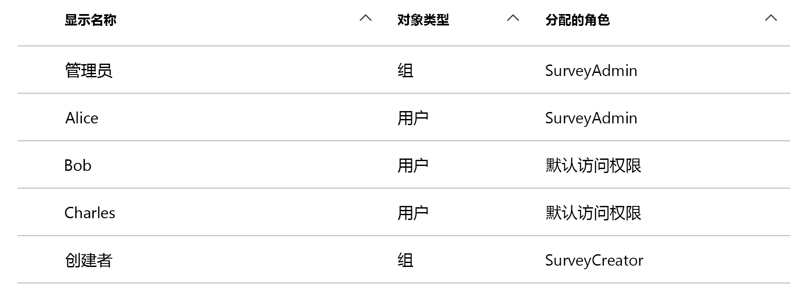
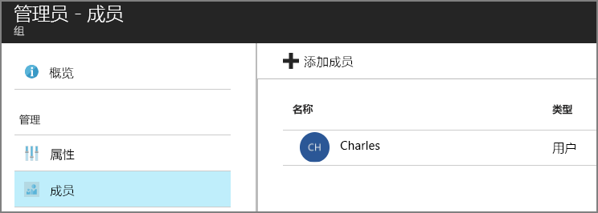

# <a name="application-roles"></a>应用程序角色

[ 示例代码][sample application]

应用程序角色用于向用户分配权限。 例如，[Tailspin Surveys][Tailspin] 应用程序可定义以下角色：

* 管理员。 可在属于该租户的任何调查中执行所有 CRUD 操作。
* 创建者。 可创建新调查。
* 读者。 可读取属于该租户的任何调查。

你会发现在[授权]过程中，角色最终会转换成权限。 但是，首先要解决的问题是如何分配和管理角色。 我们标识了三个主要选项：

* [Azure AD 应用角色](#roles-using-azure-ad-app-roles)
* [Azure AD 安全组](#roles-using-azure-ad-security-groups)
* [应用程序角色管理员](#roles-using-an-application-role-manager)。

## <a name="roles-using-azure-ad-app-roles"></a>使用 Azure AD 应用角色的角色
这是我们在 Tailspin Surveys 应用中使用的方法。

按照这种方法，SaaS 提供程序通过将应用程序角色添加到应用程序清单来定义该角色。 客户注册后，该客户的 AD 目录管理员会将用户分配给角色。 用户登录后，该用户的已分配角色将以声明方式发送过来。

> [!NOTE]
> 如果该客户有 Azure AD Premium，管理员便可向角色分配一个安全组，该组内的成员可继承此应用角色。 这种管理角色的方式比较方便，因为组所有者不一定得是 AD 管理员。
> 
> 

此方法的优点：

* 编程模型简单。
* 角色特定于应用程序。 一个应用程序的角色声明不会发送到另一个应用程序。
* 如果客户从其 AD 租户中删除此应用程序，则角色也会消失。
* 应用程序不需要除读取用户配置文件之外的任何附加 Active Directory 权限。

缺点：

* 如果客户没有 Azure AD Premium，则不能将安全组分配给角色。 对于这类客户，所有的用户分配都必须由 AD 管理员来完成。
* 如果有从 Web 应用程序分离出来的后端 Web API，则 Web 应用的角色分配不适用于 Web API。 有关该点详细讨论，请参阅[保护后端 Web API]。

### <a name="implementation"></a>实现
**定义角色。** SaaS 提供程序可声明[应用程序清单]中的应用角色。 例如，以下是 Surveys 应用的清单条目：

```
"appRoles": [
  {
    "allowedMemberTypes": [
      "User"
    ],
    "description": "Creators can create Surveys",
    "displayName": "SurveyCreator",
    "id": "1b4f816e-5eaf-48b9-8613-7923830595ad",
    "isEnabled": true,
    "value": "SurveyCreator"
  },
  {
    "allowedMemberTypes": [
      "User"
    ],
    "description": "Administrators can manage the Surveys in their tenant",
    "displayName": "SurveyAdmin",
    "id": "c20e145e-5459-4a6c-a074-b942bbd4cfe1",
    "isEnabled": true,
    "value": "SurveyAdmin"
  }
],
```

`value` 属性出现在角色声明中。 `id` 属性是定义角色的唯一标识符。 始终为 `id` 生成新的 GUID 值。

**分配用户**。 新客户注册时，应用程序在客户的 AD 租户中进行注册。 此时，该租户的 AD 管理员可以将用户分配到角色。

> [!NOTE]
> 如前文所述，如果客户有 Azure AD Premium，则可将安全组分配给角色。
> 
> 

在以下 Azure 门户屏幕截图中为 Survey 应用程序的用户和组。 “管理员”和“创建者”是组，分别分配给 SurveyAdmin 和 SurveyCreator 角色。 Alice 是直接分配给 SurveyAdmin 角色的用户。 Bob 和 Charles 是还未直接分配给角色的用户。



如下列屏幕截图所示，Charles 属于“管理员”组，因此他可继承 SurveyAdmin 角色。 而 Bob，尚未分配有角色。




> [!NOTE]
> 另一种方法是应用程序使用 Azure AD Graph API 以编程方式分配角色。 但是，这需要应用程序获取客户 AD 目录的写入权限。 具有这些权限的应用程序可能会造成大量混乱 &mdash; 不过，客户相信此应用不会扰乱其目录。 很多客户可能不愿意授予该级别的访问权限。
> 

**获取角色声明**。 用户登录时，应用程序会在类型为 `http://schemas.microsoft.com/ws/2008/06/identity/claims/role` 的声明中收到用户分配到的角色。  

用户可以有多个角色，也可以没有角色。 不要在授权代码中假设用户只有一个角色声明。 相反，应写入代码，以检查是否存在特定声明值：

```csharp
if (context.User.HasClaim(ClaimTypes.Role, "Admin")) { ... }
```

## <a name="roles-using-azure-ad-security-groups"></a>使用 Azure AD 安全组的角色
在此方法中，角色表示为 AD 安全组。 应用程序根据用户的安全组用户成员身份向用户分配权限。

优点：

* 对于没有 Azure AD Premium 客户，此方法可使客户利用安全组来管理角色分配。

缺点：

* 复杂。 由于每个租户发送的组声明不同，因此应用程序必须为每个租户跟踪哪些安全组对应哪些应用程序角色。
* 如果客户从其 AD 租户中删除应用程序，安全组会保留在其 AD 目录中。

### <a name="implementation"></a>实现
在应用程序清单中，将 `groupMembershipClaims` 属性设置为“SecurityGroup”。 从 AAD 获取组成员资格声明需要此属性。

```
{
   // ...
   "groupMembershipClaims": "SecurityGroup",
}
```

新客户注册时，应用程序会指导客户为应用程序所需的角色创建安全组。 然后，客户需要将组对象 ID 输入到应用程序中。 应用程序会将其存储在一个表中，该表按租户将组 ID 映射到应用程序角色。

> [!NOTE]
> 或者，应用程序可使用 Azure AD Graph API 以编程方式创建组。  这样就不容易出错。 但是，这需要应用程序获取客户 AD 目录的“读取和写入所有组”权限。 很多客户可能不愿意授予该级别的访问权限。
> 
> 

用户登录时：

1. 应用程序以声明方式接收用户的组。 每个声明的值是组的对象 ID。
2. Azure AD 会限制令牌中发送的组数。 如果组数超过此限制，Azure AD 会发送特殊“超额”声明。 如果该声明存在，应用程序必须查询 Azure AD Graph API，以获取该用户所属的所有组。 有关详细信息，请参阅“组声明超额”一节中的[使用 AD 组在云应用程序中授权]。
3. 应用程序在其数据库中查找对象 ID，以查找要分配给用户的相应应用程序角色。
4. 应用程序将自定义声明值添加到表示应用程序角色的用户主体。 例如：`survey_role` = "SurveyAdmin"。

授权策略应使用自定义角色声明，而非组声明。

## <a name="roles-using-an-application-role-manager"></a>使用应用程序角色管理器的角色
如果使用此方法，应用程序角色不会存储在 Azure AD 中。 相反，应用程序会在自身的数据库中存储每个用户的角色分配 &mdash; 例如，在 ASP.NET Identity 中使用 RoleManager 类。

优点：

* 应用可完全控制角色和用户分配。

缺点：

* 更为复杂，维护更困难。
* 不能使用 AD 安全组管理角色分配。
* 将用户信息存储在应用程序数据库中，若添加或删除用户，用户信息可能与租户的 AD 目录不同步。   


[下一篇][授权]

<!-- Links -->
[Tailspin]: tailspin.md

[授权]: authorize.md
[保护后端 Web API]: web-api.md
[应用程序清单]: /azure/active-directory/active-directory-application-manifest/
[sample application]: https://github.com/mspnp/multitenant-saas-guidance
