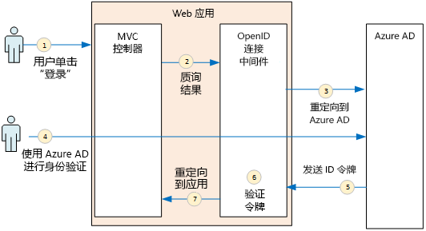
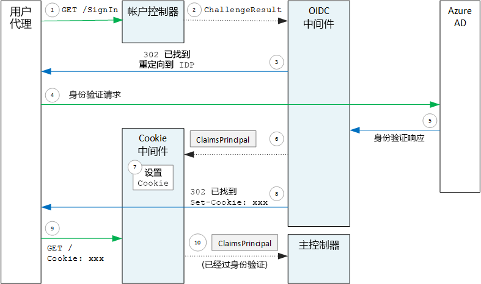

# <a name="authenticate-using-azure-ad-and-openid-connect"></a>使用 Azure AD 和 OpenID Connect 进行身份验证

[ 示例代码][sample application]

Surveys 应用程序使用 OpenID Connect (OIDC) 协议向 Azure Active Directory (Azure AD) 验证用户身份。 Surveys 应用程序使用 ASP.NET Core，后者具有用于 OIDC 的内置中间件。 下图从较高层面展示了用户登录时发生的情况。



1. 用户单击应用中的“登录”按钮。 此操作由 MVC 控制器处理。
2. MVC 控制器返回 **ChallengeResult** 操作。
3. 中间件截获 **ChallengeResult**，并创建 302 响应，以将用户重定向到 Azure AD 登录页面。
4. 用户向 Azure AD 验证身份。
5. Azure AD 向应用程序发送一个 ID 令牌。
6. 中间件验证该 ID 令牌。 此时，用户已在应用程序内通过身份验证。
7. 中间件将用户重定向回应用程序。

## <a name="register-the-app-with-azure-ad"></a>将应用注册到 Azure AD
若要启用 OpenID Connect，SaaS 提供程序可在自己的 Azure AD 租户内注册应用程序。

若要注册应用程序，请遵循[将应用程序与 Azure Active Directory 集成](/azure/active-directory/active-directory-integrating-applications/)的[添加应用程序](/azure/active-directory/active-directory-integrating-applications/#adding-an-application)部分中的步骤。

有关 Surveys 应用程序的具体步骤，请参阅[运行 Surveys 应用程序](./run-the-app.md)。 注意以下事项：

- 对于多租户应用程序，必须显式配置多租户选项。 这样，其他组织就能访问该应用程序。

- 回复 URL 是 Azure AD 将在其中发送 OAuth 2.0 响应的 URL。 使用 ASP.NET Core 时，该 URL 必须与在身份验证中间件中配置的路径（请参阅下一部分）匹配。 

## <a name="configure-the-auth-middleware"></a>配置身份验证中间件
本部分介绍如何在 ASP.NET Core 中为多租户身份验证配置 OpenID Connect 的身份验证中间件。

在 [startup 类](/aspnet/core/fundamentals/startup)中，添加 OpenID Connect 中间件：

```csharp
app.UseOpenIdConnectAuthentication(new OpenIdConnectOptions {
    ClientId = configOptions.AzureAd.ClientId,
    ClientSecret = configOptions.AzureAd.ClientSecret, // for code flow
    Authority = Constants.AuthEndpointPrefix,
    ResponseType = OpenIdConnectResponseType.CodeIdToken,
    PostLogoutRedirectUri = configOptions.AzureAd.PostLogoutRedirectUri,
    SignInScheme = CookieAuthenticationDefaults.AuthenticationScheme,
    TokenValidationParameters = new TokenValidationParameters { ValidateIssuer = false },
    Events = new SurveyAuthenticationEvents(configOptions.AzureAd, loggerFactory),
});
```

请注意，某些设置来自运行时配置选项。 下面说明了各中间件选项的含义：

* **ClientId**。 应用程序的客户端 ID，在 Azure AD 中注册应用程序时获得。
* **Authority**。 对于多租户应用程序，将此选项设置为 `https://login.microsoftonline.com/common/`。 这是 Azure AD common 终结点的 URL，允许用户从任何 Azure AD 租户登录。 有关 common 终结点的详细信息，请参阅[这篇博客文章](http://www.cloudidentity.com/blog/2014/08/26/the-common-endpoint-walks-like-a-tenant-talks-like-a-tenant-but-is-not-a-tenant/)。
* 在 **TokenValidationParameters** 中，将 **ValidateIssuer** 设置为 false。 这意味着应用将负责验证 ID 令牌中的颁发者值。 （中间件仍然验证令牌本身。）有关验证颁发者的详细信息，请参阅[颁发者验证](claims.md#issuer-validation)。
* **PostLogoutRedirectUri**。 指定用于在注销后重定向用户的 URL。这应当是允许匿名请求的页面 &mdash; 通常是主页。
* **SignInScheme**。 将其设置为 `CookieAuthenticationDefaults.AuthenticationScheme`。 此设置意味着用户验证身份后，用户声明存储在本地 cookie 中。 使用此 cookie，用户可以在浏览器会话期间保持登录状态。
* **Events**。 事件回叫；请参阅[身份验证事件](#authentication-events)。

同时将 Cookie 身份验证中间件添加到管道中。 此中间件负责将用户声明写入 cookie，然后在后续页面加载期间读取该 cookie。

```csharp
app.UseCookieAuthentication(new CookieAuthenticationOptions {
    AutomaticAuthenticate = true,
    AutomaticChallenge = true,
    AccessDeniedPath = "/Home/Forbidden",
    CookieSecure = CookieSecurePolicy.Always,

    // The default setting for cookie expiration is 14 days. SlidingExpiration is set to true by default
    ExpireTimeSpan = TimeSpan.FromHours(1),
    SlidingExpiration = true
});
```

## <a name="initiate-the-authentication-flow"></a>启动身份验证流
若要在 ASP.NET MVC 中启动身份验证流，请从控制器返回 **ChallengeResult**：

```csharp
[AllowAnonymous]
public IActionResult SignIn()
{
    return new ChallengeResult(
        OpenIdConnectDefaults.AuthenticationScheme,
        new AuthenticationProperties
        {
            IsPersistent = true,
            RedirectUri = Url.Action("SignInCallback", "Account")
        });
}
```

这会使中间件返回 302（已找到）响应，以重定向到身份验证终结点。

## <a name="user-login-sessions"></a>用户登录会话
如前所述，用户首次登录时，Cookie 身份验证中间件会将用户声明写入 cookie。 之后，通过读取该 cookie 对 HTTP 请求进行身份验证。

默认情况下，cookie 中间件写入一个[会话 cookie][session-cookie]，该 cookie 在用户关闭浏览器后即被删除。 用户下次访问此站点时必须再次登录。 但是，如果在 **ChallengeResult** 中将 **IsPersistent** 设置为 true，中间件会写入一个永久性 cookie，以便关闭浏览器后用户仍保持登录。 可以配置 cookie 到期时间；请参阅[控制 cookie 选项][cookie-options]。 永久性 cookie 更方便用户，但可能不适合某些你希望用户每次都登录的应用程序（比如银行应用程序）。

## <a name="about-the-openid-connect-middleware"></a>关于 OpenID Connect 中间件
ASP.NET 中的 OpenID Connect 中间件隐藏了大多数协议细节。 本部分包含有关实现的一些说明，可帮助了解协议流。

首先，根据 ASP.NET 检查身份验证流（忽略应用与 Azure AD 之间 OIDC 协议流的细节）。 下图展示了此过程。



在此图中，有两个 MVC 控制器。 帐户控制器处理登录请求，主页控制器处理主页。

下面是身份验证过程：

1. 用户单击“登录”按钮，浏览器发送 GET 请求。 例如：`GET /Account/SignIn/`。
2. 帐户控制器返回 `ChallengeResult`。
3. OIDC 中间件返回 HTTP 302 响应，以重定向到 Azure AD。
4. 浏览器将身份验证请求发送到 Azure AD
5. 用户登录 Azure AD，Azure AD 发回身份验证响应。
6. OIDC 中间件创建声明主体，并将其传递给 Cookie 身份验证中间件。
7. cookie 中间件串行化声明主体，并设置 cookie。
8. OIDC 中间件重定向到应用程序的回叫 URL。
9. 浏览器遵循重定向操作，发送请求中的 cookie。
10. cookie 中间件将 cookie 反序列化为声明主体，并将 `HttpContext.User` 设置为声明主体。 请求路由到 MVC 控制器中。

### <a name="authentication-ticket"></a>身份验证票证
如果身份验证成功，OIDC 中间件会创建一个身份验证票证，其中包含保存用户声明的声明主体。 可在 **AuthenticationValidated** 或 **TicketReceived** 事件内部访问该票证。

> [!NOTE]
> 在整个身份验证流完成之前，`HttpContext.User` 仍保存一个匿名主体，而**不是**经过身份验证的用户。 该匿名主体具有一个空的声明集合。 身份验证完成且应用重定向后，cookie 中间件反序列化身份验证 cookie，并将 `HttpContext.User` 设置为表示经过身份验证的用户的声明主体。
> 
> 

### <a name="authentication-events"></a>身份验证事件
在身份验证过程中，OpenID Connect 中间件会引发一系列事件：

* **RedirectToIdentityProvider**。 就在中间件重定向到身份验证终结点之前调用。 此事件可用于修改重定向 URL；例如，添加请求参数。 有关示例，请参阅[添加管理员许可提示](signup.md#adding-the-admin-consent-prompt)。
* **AuthorizationCodeReceived**。 使用授权代码调用。
* **TokenResponseReceived**。 在中间件从 IDP 获取访问令牌之后且验证该令牌之前调用。 仅适用于授权代码流。
* **TokenValidated**。 在中间件验证 ID 令牌后调用。 此时，应用程序具有一组有关用户的已验证声明。 此事件可用于对声明执行附加验证或转换声明。 请参阅[使用声明](claims.md)。
* **UserInformationReceived**。 中间件从用户信息终结点中获取用户配置文件时调用。 仅适用于授权代码流，并且仅当中间件选项中的 `GetClaimsFromUserInfoEndpoint = true` 时可用。
* **TicketReceived**。 身份验证完成时调用。 如果身份验证成功，这就是最后一个事件。 处理此事件后，用户即登录到应用。
* **AuthenticationFailed**。 身份验证失败时调用。 此事件用于处理身份验证失败 &mdash; 例如，通过重定向到错误页。

若要提供这些事件的回叫，请设置中间件上的 **Events** 选项。 可通过两种不同的方式来声明事件处理程序：使用 lambdas 内联，或在派生自 **OpenIdConnectEvents** 的类中。 如果事件回叫包含大量逻辑，则建议使用第二种方法，这样就不会影响 startup 类。 我们的引用实现使用此方法。

### <a name="openid-connect-endpoints"></a>OpenID Connect 终结点
Azure AD 支持 [OpenID Connect 发现](https://openid.net/specs/openid-connect-discovery-1_0.html)，标识提供者 (IDP) 可在其中返回来自某个[已知终结点](https://openid.net/specs/openid-connect-discovery-1_0.html#ProviderConfig)的 JSON 元数据文档。 元数据文档包含以下信息：

* 授权终结点的 URL。 应用通过重定向到该 URL 来验证用户身份。
* “结束会话”终结点的 URL，应用通过转到该 URL 来注销用户。
* 用于获取签名密钥的 URL，客户端用来验证从 IDP 获取的 OIDC 令牌。

默认情况下，OIDC 中间件知道如何提取此元数据。 设置中间件中的 **Authority** 选项，中间件会为元数据构造 URL。 （可通过设置 **MetadataAddress** 选项重写元数据 URL。）

### <a name="openid-connect-flows"></a>OpenID Connect 流
默认情况下，OIDC 中间件将混合流与窗体发布响应模式结合使用。

* *混合流*意味着客户端可以在同一个授权服务器往返中获取 ID 令牌和授权代码。
* *窗体发布响应模式*意味着授权服务器使用 HTTP POST 请求将 ID 令牌和授权代码发送到应用。 其值采用 form-urlencoded 格式（内容类型 =“application/x-www-form-urlencoded”）。

当 OIDC 中间件重定向到授权终结点时，重定向 URL 包含 OIDC 所需的所有查询字符串参数。 对于混合流：

* client_id。 此值在 **ClientId** 选项中设置
* scope = "openid profile"，这表示它是一个 OIDC 请求，我们需要用户的配置文件。
* response_type  = "code id_token"。 此值指定混合流。
* response_mode = "form_post"。 此值指定窗体发布响应。

若要指定其他流，请设置选项上的 **ResponseType** 属性。 例如：

```csharp
app.UseOpenIdConnectAuthentication(options =>
{
    options.ResponseType = "code"; // Authorization code flow

    // Other options
}
```

[**下一篇**][claims]

[claims]: claims.md
[cookie-options]: /aspnet/core/security/authentication/cookie#controlling-cookie-options
[session-cookie]: https://en.wikipedia.org/wiki/HTTP_cookie#Session_cookie
[sample application]: https://github.com/mspnp/multitenant-saas-guidance
