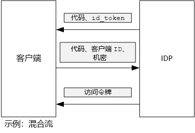

# <a name="use-client-assertion-to-get-access-tokens-from-azure-ad"></a>使用客户端断言从 Azure AD 获取访问令牌

[ 示例代码][sample application]

## <a name="background"></a>背景
在 OpenID Connect 中使用授权代码流或混合流时，客户端交换授权代码来获取访问令牌。 在此步骤中，客户端必须向服务器进行身份验证。



客户端进行身份验证的一种方法是使用客户端密码。 默认情况下，配置 [Tailspin Surveys][Surveys] 应用程序也是采用相同方式。

下面是从客户端到 IDP 请求访问令牌的示例请求。 请注意 `client_secret` 参数。

```
POST https://login.microsoftonline.com/b9bd2162xxx/oauth2/token HTTP/1.1
Content-Type: application/x-www-form-urlencoded

resource=https://tailspin.onmicrosoft.com/surveys.webapi
  &client_id=87df91dc-63de-4765-8701-b59cc8bd9e11
  &client_secret=i3Bf12Dn...
  &grant_type=authorization_code
  &code=PG8wJG6Y...
```

密码只是一个字符串，所以必须确保不会泄漏该值。 最佳做法是将客户端密码排除在源代码管理之外。 在部署到 Azure 时，请将密码存储在[应用设置][configure-web-app]中。

但任何能够访问 Azure 订阅的人都可以查看应用设置。 此外，密码始终倾向于签入到源代码管理中（例如，在部署脚本中），并通过电子邮件等进行共享。

为提高安全性，可使用[客户端断言]取代客户端密码。 通过使用客户端断言，客户端可以使用 X.509 证书来证明令牌请求来自客户端。 客户端证书安装在 Web 服务器上。 通常情况下，限制对证书的访问比确保人们不会无意透露客户端密码更容易。 有关在 Web 应用程序中配置证书的详细信息，请参阅[在 Azure 网站应用程序中使用证书][using-certs-in-websites]

下面是使用客户端断言的令牌请求：

```
POST https://login.microsoftonline.com/b9bd2162xxx/oauth2/token HTTP/1.1
Content-Type: application/x-www-form-urlencoded

resource=https://tailspin.onmicrosoft.com/surveys.webapi
  &client_id=87df91dc-63de-4765-8701-b59cc8bd9e11
  &client_assertion_type=urn:ietf:params:oauth:client-assertion-type:jwt-bearer
  &client_assertion=eyJhbGci...
  &grant_type=authorization_code
  &code= PG8wJG6Y...
```

请注意，`client_secret` 参数已不再使用。 取而代之的是 `client_assertion` 参数，它包含一个使用客户端证书签名的 JWT 令牌。 `client_assertion_type` 参数指定断言类型 &mdash; 在本例中为 JWT 令牌。 服务器验证 JWT 令牌。 如果 JWT 令牌无效，令牌请求将返回一个错误。

> [!NOTE]
> X.509 证书不是客户断言的唯一形式；我们在此关注它，因为它受 Azure AD 支持。
> 
> 

在运行时，Web 应用程序从证书存储中读取证书。 必须在 Web 应用所在的同一计算机上安装证书。

Surveys 应用程序包括帮助程序类，该类创建了 [ClientAssertionCertificate](/dotnet/api/microsoft.identitymodel.clients.activedirectory.clientassertioncertificate)，可将其传递给 [AuthenticationContext.AcquireTokenSilentAsync](/dotnet/api/microsoft.identitymodel.clients.activedirectory.authenticationcontext.acquiretokensilentasync) 方法以从 Azure AD 获取令牌。

```csharp
public class CertificateCredentialService : ICredentialService
{
    private Lazy<Task<AdalCredential>> _credential;

    public CertificateCredentialService(IOptions<ConfigurationOptions> options)
    {
        var aadOptions = options.Value?.AzureAd;
        _credential = new Lazy<Task<AdalCredential>>(() =>
        {
            X509Certificate2 cert = CertificateUtility.FindCertificateByThumbprint(
                aadOptions.Asymmetric.StoreName,
                aadOptions.Asymmetric.StoreLocation,
                aadOptions.Asymmetric.CertificateThumbprint,
                aadOptions.Asymmetric.ValidationRequired);
            string password = null;
            var certBytes = CertificateUtility.ExportCertificateWithPrivateKey(cert, out password);
            return Task.FromResult(new AdalCredential(new ClientAssertionCertificate(aadOptions.ClientId, new X509Certificate2(certBytes, password))));
        });
    }

    public async Task<AdalCredential> GetCredentialsAsync()
    {
        return await _credential.Value;
    }
}
```

有关在 Surveys 应用程序中设置客户端断言的信息，请参阅[使用 Azure Key Vault 保护应用程序机密][key vault]。

[下一篇][key vault]

<!-- Links -->
[configure-web-app]: /azure/app-service-web/web-sites-configure/
[azure-management-portal]: https://portal.azure.com
[客户端断言]: https://tools.ietf.org/html/rfc7521
[key vault]: key-vault.md
[Setup-KeyVault]: https://github.com/mspnp/multitenant-saas-guidance/blob/master/scripts/Setup-KeyVault.ps1
[Surveys]: tailspin.md
[using-certs-in-websites]: https://azure.microsoft.com/blog/using-certificates-in-azure-websites-applications/

[sample application]: https://github.com/mspnp/multitenant-saas-guidance
