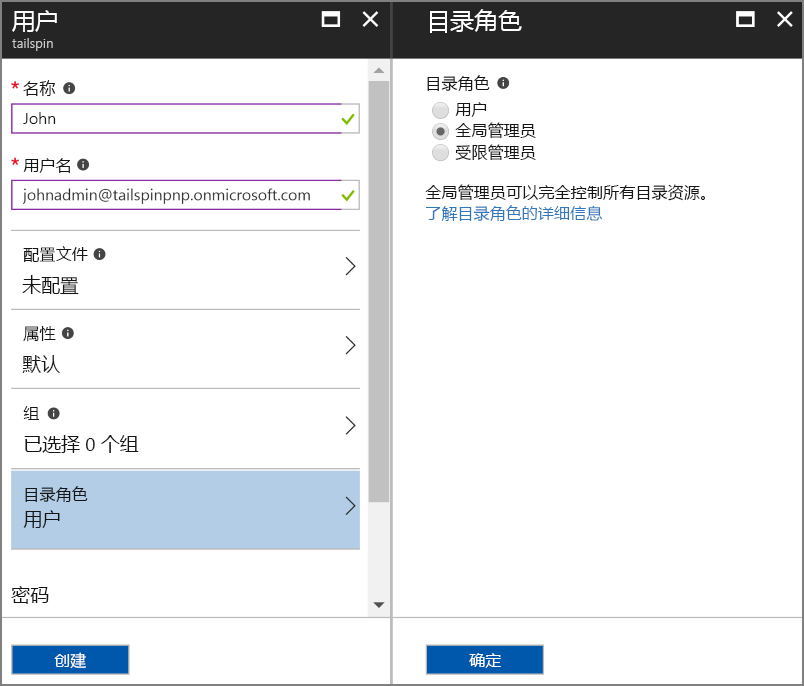
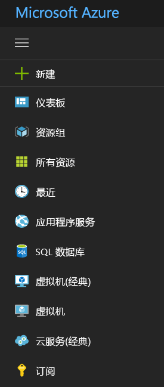

# <a name="use-azure-key-vault-to-protect-application-secrets"></a><span data-ttu-id="cec9d-103">使用 Azure Key Vault 保护应用程序机密</span><span class="sxs-lookup"><span data-stu-id="cec9d-103">Use Azure Key Vault to protect application secrets</span></span>

<span data-ttu-id="cec9d-104">[ 示例代码][sample application]</span><span class="sxs-lookup"><span data-stu-id="cec9d-104">[ Sample code][sample application]</span></span>

<span data-ttu-id="cec9d-105">经常会有敏感的应用程序设置，必须受到保护，例如：</span><span class="sxs-lookup"><span data-stu-id="cec9d-105">It's common to have application settings that are sensitive and must be protected, such as:</span></span>

* <span data-ttu-id="cec9d-106">数据库连接字符串</span><span class="sxs-lookup"><span data-stu-id="cec9d-106">Database connection strings</span></span>
* <span data-ttu-id="cec9d-107">密码</span><span class="sxs-lookup"><span data-stu-id="cec9d-107">Passwords</span></span>
* <span data-ttu-id="cec9d-108">加密密钥</span><span class="sxs-lookup"><span data-stu-id="cec9d-108">Cryptographic keys</span></span>

<span data-ttu-id="cec9d-109">安全的最佳做法是切勿将这些机密存储在源代码管理中。</span><span class="sxs-lookup"><span data-stu-id="cec9d-109">As a security best practice, you should never store these secrets in source control.</span></span> <span data-ttu-id="cec9d-110">即使源代码存储库是私有的，它们也很容易泄露。</span><span class="sxs-lookup"><span data-stu-id="cec9d-110">It's too easy for them to leak &mdash; even if your source code repository is private.</span></span> <span data-ttu-id="cec9d-111">而且这不仅仅是保护机密不被泄露公开。</span><span class="sxs-lookup"><span data-stu-id="cec9d-111">And it's not just about keeping secrets from the general public.</span></span> <span data-ttu-id="cec9d-112">在较大型的项目上，建议限制有权访问生产机密的开发者和操作员。</span><span class="sxs-lookup"><span data-stu-id="cec9d-112">On larger projects, you might want to restrict which developers and operators can access the production secrets.</span></span> <span data-ttu-id="cec9d-113">（测试或开发环境的设置有所不同。）</span><span class="sxs-lookup"><span data-stu-id="cec9d-113">(Settings for test or development environments are different.)</span></span>

<span data-ttu-id="cec9d-114">更安全的做法是将这些机密存储在 [Azure Key Vault][KeyVault]。</span><span class="sxs-lookup"><span data-stu-id="cec9d-114">A more secure option is to store these secrets in [Azure Key Vault][KeyVault].</span></span> <span data-ttu-id="cec9d-115">Key Vault 是用于管理加密密钥和其他机密的云托管服务。</span><span class="sxs-lookup"><span data-stu-id="cec9d-115">Key Vault is a cloud-hosted service for managing cryptographic keys and other secrets.</span></span> <span data-ttu-id="cec9d-116">本文演示如何使用 Key Vault 存储应用的配置设置。</span><span class="sxs-lookup"><span data-stu-id="cec9d-116">This article shows how to use Key Vault to store configuration settings for you app.</span></span>

<span data-ttu-id="cec9d-117">在 [Tailspin Surveys][Surveys] 应用程序中，以下设置是机密：</span><span class="sxs-lookup"><span data-stu-id="cec9d-117">In the [Tailspin Surveys][Surveys] application, the following settings are secret:</span></span>

* <span data-ttu-id="cec9d-118">数据库连接字符串。</span><span class="sxs-lookup"><span data-stu-id="cec9d-118">The database connection string.</span></span>
* <span data-ttu-id="cec9d-119">Redis 连接字符串。</span><span class="sxs-lookup"><span data-stu-id="cec9d-119">The Redis connection string.</span></span>
* <span data-ttu-id="cec9d-120">Web 应用程序的客户端密码。</span><span class="sxs-lookup"><span data-stu-id="cec9d-120">The client secret for the web application.</span></span>

<span data-ttu-id="cec9d-121">Surveys 应用程序从以下位置加载配置设置：</span><span class="sxs-lookup"><span data-stu-id="cec9d-121">The Surveys application loads configuration settings from the following places:</span></span>

* <span data-ttu-id="cec9d-122">appsettings.json 文件</span><span class="sxs-lookup"><span data-stu-id="cec9d-122">The appsettings.json file</span></span>
* <span data-ttu-id="cec9d-123">[用户机密存储][user-secrets]（仅开发环境；用于测试）</span><span class="sxs-lookup"><span data-stu-id="cec9d-123">The [user secrets store][user-secrets] (development environment only; for testing)</span></span>
* <span data-ttu-id="cec9d-124">宿主环境（Azure Web 应用中的应用设置）</span><span class="sxs-lookup"><span data-stu-id="cec9d-124">The hosting environment (app settings in Azure web apps)</span></span>
* <span data-ttu-id="cec9d-125">Key Vault（启用时）</span><span class="sxs-lookup"><span data-stu-id="cec9d-125">Key Vault (when enabled)</span></span>

<span data-ttu-id="cec9d-126">其中的每个设置都会替代上一个设置，因此存储在 Key Vault 中的任何设置都是优先的。</span><span class="sxs-lookup"><span data-stu-id="cec9d-126">Each of these overrides the previous one, so any settings stored in Key Vault take precedence.</span></span>

> [!NOTE]
> <span data-ttu-id="cec9d-127">默认情况下，Key Vault 配置提供程序处于禁用状态。</span><span class="sxs-lookup"><span data-stu-id="cec9d-127">By default, the Key Vault configuration provider is disabled.</span></span> <span data-ttu-id="cec9d-128">无需在本地运行应用程序。</span><span class="sxs-lookup"><span data-stu-id="cec9d-128">It's not needed for running the application locally.</span></span> <span data-ttu-id="cec9d-129">将在生产部署中启用它。</span><span class="sxs-lookup"><span data-stu-id="cec9d-129">You would enable it in a production deployment.</span></span>

<span data-ttu-id="cec9d-130">启动时，应用程序从每个注册的配置提供程序读取设置，并使用它们来填充强类型的选项对象。</span><span class="sxs-lookup"><span data-stu-id="cec9d-130">At startup, the application reads settings from every registered configuration provider, and uses them to populate a strongly typed options object.</span></span> <span data-ttu-id="cec9d-131">有关详细信息，请参阅[使用选项和配置对象][options]。</span><span class="sxs-lookup"><span data-stu-id="cec9d-131">For more information, see [Using Options and configuration objects][options].</span></span>

## <a name="setting-up-key-vault-in-the-surveys-app"></a><span data-ttu-id="cec9d-132">在 Surveys 应用中设置 Key Vault</span><span class="sxs-lookup"><span data-stu-id="cec9d-132">Setting up Key Vault in the Surveys app</span></span>
<span data-ttu-id="cec9d-133">先决条件：</span><span class="sxs-lookup"><span data-stu-id="cec9d-133">Prerequisites:</span></span>

* <span data-ttu-id="cec9d-134">安装 [Azure 资源管理器 Cmdlet][azure-rm-cmdlets]。</span><span class="sxs-lookup"><span data-stu-id="cec9d-134">Install the [Azure Resource Manager Cmdlets][azure-rm-cmdlets].</span></span>
* <span data-ttu-id="cec9d-135">按照[运行 Surveys 应用程序][readme]中所述配置 Surveys 应用程序。</span><span class="sxs-lookup"><span data-stu-id="cec9d-135">Configure the Surveys application as described in [Run the Surveys application][readme].</span></span>

<span data-ttu-id="cec9d-136">高级步骤：</span><span class="sxs-lookup"><span data-stu-id="cec9d-136">High-level steps:</span></span>

1. <span data-ttu-id="cec9d-137">设置租户中的管理员用户。</span><span class="sxs-lookup"><span data-stu-id="cec9d-137">Set up an admin user in the tenant.</span></span>
2. <span data-ttu-id="cec9d-138">设置客户端证书。</span><span class="sxs-lookup"><span data-stu-id="cec9d-138">Set up a client certificate.</span></span>
3. <span data-ttu-id="cec9d-139">创建密钥保管库。</span><span class="sxs-lookup"><span data-stu-id="cec9d-139">Create a key vault.</span></span>
4. <span data-ttu-id="cec9d-140">将配置设置添加到密钥保管库。</span><span class="sxs-lookup"><span data-stu-id="cec9d-140">Add configuration settings to your key vault.</span></span>
5. <span data-ttu-id="cec9d-141">取消评论启动密钥保管库的代码。</span><span class="sxs-lookup"><span data-stu-id="cec9d-141">Uncomment the code that enables key vault.</span></span>
6. <span data-ttu-id="cec9d-142">更新应用程序的用户机密。</span><span class="sxs-lookup"><span data-stu-id="cec9d-142">Update the application's user secrets.</span></span>

### <a name="set-up-an-admin-user"></a><span data-ttu-id="cec9d-143">设置管理员用户</span><span class="sxs-lookup"><span data-stu-id="cec9d-143">Set up an admin user</span></span>
> [!NOTE]
> <span data-ttu-id="cec9d-144">若要创建密钥保管库，必须使用可以管理 Azure 订阅的帐户。</span><span class="sxs-lookup"><span data-stu-id="cec9d-144">To create a key vault, you must use an account which can manage your Azure subscription.</span></span> <span data-ttu-id="cec9d-145">此外，授权从密钥保管库中读取的任何应用程序必须在与该帐户相同的租户中注册。</span><span class="sxs-lookup"><span data-stu-id="cec9d-145">Also, any application that you authorize to read from the key vault must be registered in the same tenant as that account.</span></span>
> 
> 

<span data-ttu-id="cec9d-146">在此步骤中，当你从注册 Surveys 应用的租户以用户身份登录时，需要确保能够创建密钥保管库。</span><span class="sxs-lookup"><span data-stu-id="cec9d-146">In this step, you will make sure that you can create a key vault while signed in as a user from the tenant where the Surveys app is registered.</span></span>

<span data-ttu-id="cec9d-147">在注册 Surveys 应用程序的 Azure AD 租户中创建管理员用户。</span><span class="sxs-lookup"><span data-stu-id="cec9d-147">Create an administrator user within the Azure AD tenant where the Surveys application is registered.</span></span>

1. <span data-ttu-id="cec9d-148">登录到 [Azure 门户][azure-portal]。</span><span class="sxs-lookup"><span data-stu-id="cec9d-148">Log into the [Azure portal][azure-portal].</span></span>
2. <span data-ttu-id="cec9d-149">选择注册应用程序所在的 Azure AD 租户。</span><span class="sxs-lookup"><span data-stu-id="cec9d-149">Select the Azure AD tenant where your application is registered.</span></span>
3. <span data-ttu-id="cec9d-150">单击“更多服务” > “安全 + 标识” > “Azure Active Directory” > 用户和组” > “所有用户”。</span><span class="sxs-lookup"><span data-stu-id="cec9d-150">Click **More service** > **SECURITY + IDENTITY** > **Azure Active Directory** > **User and groups** > **All users**.</span></span>
4. <span data-ttu-id="cec9d-151">在门户顶部单击“新建用户”。</span><span class="sxs-lookup"><span data-stu-id="cec9d-151">At the top of the portal, click **New user**.</span></span>
5. <span data-ttu-id="cec9d-152">填充字段并将用户分配到“全局管理员”目录角色。</span><span class="sxs-lookup"><span data-stu-id="cec9d-152">Fill in the fields and assign the user to the **Global administrator** directory role.</span></span>
6. <span data-ttu-id="cec9d-153">单击“创建” 。</span><span class="sxs-lookup"><span data-stu-id="cec9d-153">Click **Create**.</span></span>



<span data-ttu-id="cec9d-155">现在将此用户分配为订阅所有者。</span><span class="sxs-lookup"><span data-stu-id="cec9d-155">Now assign this user as the subscription owner.</span></span>

1. <span data-ttu-id="cec9d-156">在“中心”菜单上，选择“订阅”。</span><span class="sxs-lookup"><span data-stu-id="cec9d-156">On the Hub menu, select **Subscriptions**.</span></span>

    

2. <span data-ttu-id="cec9d-157">选择希望管理员访问的订阅。</span><span class="sxs-lookup"><span data-stu-id="cec9d-157">Select the subscription that you want the administrator to access.</span></span>
3. <span data-ttu-id="cec9d-158">在“订阅”边栏选项卡中，选择“访问控制 (IAM)”。</span><span class="sxs-lookup"><span data-stu-id="cec9d-158">In the subscription blade, select **Access control (IAM)**.</span></span>
4. <span data-ttu-id="cec9d-159">单击“添加”。</span><span class="sxs-lookup"><span data-stu-id="cec9d-159">Click **Add**.</span></span>
4. <span data-ttu-id="cec9d-160">在“角色”下，选择“所有者”。</span><span class="sxs-lookup"><span data-stu-id="cec9d-160">Under **Role**, select **Owner**.</span></span>
5. <span data-ttu-id="cec9d-161">键入要添加为“所有者”的用户的电子邮件地址。</span><span class="sxs-lookup"><span data-stu-id="cec9d-161">Type the email address of the user you want to add as owner.</span></span>
6. <span data-ttu-id="cec9d-162">选择用户并单击“保存”。</span><span class="sxs-lookup"><span data-stu-id="cec9d-162">Select the user and click **Save**.</span></span>

### <a name="set-up-a-client-certificate"></a><span data-ttu-id="cec9d-163">设置客户端证书</span><span class="sxs-lookup"><span data-stu-id="cec9d-163">Set up a client certificate</span></span>
1. <span data-ttu-id="cec9d-164">如下所示，运行 PowerShell 脚本 [/Scripts/Setup-KeyVault.ps1][Setup-KeyVault]：</span><span class="sxs-lookup"><span data-stu-id="cec9d-164">Run the PowerShell script [/Scripts/Setup-KeyVault.ps1][Setup-KeyVault] as follows:</span></span>
   
    ```
    .\Setup-KeyVault.ps1 -Subject <<subject>>
    ```
    <span data-ttu-id="cec9d-165">对于 `Subject` 参数，键入任意名称，例如“surveysapp”。</span><span class="sxs-lookup"><span data-stu-id="cec9d-165">For the `Subject` parameter, enter any name, such as "surveysapp".</span></span> <span data-ttu-id="cec9d-166">此脚本生成自签名证书，并将其存储在“当前用户/个人”证书存储中。</span><span class="sxs-lookup"><span data-stu-id="cec9d-166">The script generates a self-signed certificate and stores it in the "Current User/Personal" certificate store.</span></span> <span data-ttu-id="cec9d-167">脚本的输出是 JSON 片段。</span><span class="sxs-lookup"><span data-stu-id="cec9d-167">The output from the script is a JSON fragment.</span></span> <span data-ttu-id="cec9d-168">复制此值。</span><span class="sxs-lookup"><span data-stu-id="cec9d-168">Copy this value.</span></span>

2. <span data-ttu-id="cec9d-169">在 [Azure 门户][azure-portal]的右上角选择帐户，切换到注册 Surveys 应用程序所在的目录。</span><span class="sxs-lookup"><span data-stu-id="cec9d-169">In the [Azure portal][azure-portal], switch to the directory where the Surveys application is registered, by selecting your account in the top right corner of the portal.</span></span>

3. <span data-ttu-id="cec9d-170">选择“Azure Active Directory” > “应用注册”>“Surveys”</span><span class="sxs-lookup"><span data-stu-id="cec9d-170">Select **Azure Active Directory** > **App Registrations** > Surveys</span></span>

4.  <span data-ttu-id="cec9d-171">单击“清单”，然后单击“编辑”。</span><span class="sxs-lookup"><span data-stu-id="cec9d-171">Click **Manifest** and then **Edit**.</span></span>

5.  <span data-ttu-id="cec9d-172">将脚本的输出粘贴到 `keyCredentials` 属性。</span><span class="sxs-lookup"><span data-stu-id="cec9d-172">Paste the output from the script into the `keyCredentials` property.</span></span> <span data-ttu-id="cec9d-173">如下图所示：</span><span class="sxs-lookup"><span data-stu-id="cec9d-173">It should look similar to the following:</span></span>
        
    ```json
    "keyCredentials": [
        {
        "type": "AsymmetricX509Cert",
        "usage": "Verify",
        "keyId": "29d4f7db-0539-455e-b708-....",
        "customKeyIdentifier": "ZEPpP/+KJe2fVDBNaPNOTDoJMac=",
        "value": "MIIDAjCCAeqgAwIBAgIQFxeRiU59eL.....
        }
    ],
    ```          

6. <span data-ttu-id="cec9d-174">单击“保存” 。</span><span class="sxs-lookup"><span data-stu-id="cec9d-174">Click **Save**.</span></span>  

7. <span data-ttu-id="cec9d-175">重复步骤 3-6，将相同的 JSON 片段添加到 Web API (Surveys.WebAPI) 的应用程序清单。</span><span class="sxs-lookup"><span data-stu-id="cec9d-175">Repeat steps 3-6 to add the same JSON fragment to the application manifest of the web API (Surveys.WebAPI).</span></span>

8. <span data-ttu-id="cec9d-176">从 PowerShell 窗口运行以下命令以获取证书指纹。</span><span class="sxs-lookup"><span data-stu-id="cec9d-176">From the PowerShell window, run the following command to get the thumbprint of the certificate.</span></span>
   
    ```
    certutil -store -user my [subject]
    ```
    
    <span data-ttu-id="cec9d-177">对于 `[subject]`，请使用为 PowerShell 脚本中的主题指定的值。</span><span class="sxs-lookup"><span data-stu-id="cec9d-177">For `[subject]`, use the value that you specified for Subject in the PowerShell script.</span></span> <span data-ttu-id="cec9d-178">指纹在“Cert Hash(sha1)”下列出。</span><span class="sxs-lookup"><span data-stu-id="cec9d-178">The thumbprint is listed under "Cert Hash(sha1)".</span></span> <span data-ttu-id="cec9d-179">复制此值。</span><span class="sxs-lookup"><span data-stu-id="cec9d-179">Copy this value.</span></span> <span data-ttu-id="cec9d-180">稍后将使用指纹。</span><span class="sxs-lookup"><span data-stu-id="cec9d-180">You will use the thumbprint later.</span></span>

### <a name="create-a-key-vault"></a><span data-ttu-id="cec9d-181">创建 key vault</span><span class="sxs-lookup"><span data-stu-id="cec9d-181">Create a key vault</span></span>
1. <span data-ttu-id="cec9d-182">如下所示，运行 PowerShell 脚本 [/Scripts/Setup-KeyVault.ps1][Setup-KeyVault]：</span><span class="sxs-lookup"><span data-stu-id="cec9d-182">Run the PowerShell script [/Scripts/Setup-KeyVault.ps1][Setup-KeyVault] as follows:</span></span>
   
    ```
    .\Setup-KeyVault.ps1 -KeyVaultName <<key vault name>> -ResourceGroupName <<resource group name>> -Location <<location>>
    ```
   
    <span data-ttu-id="cec9d-183">提示输入凭证时，请以之前创建的 Azure AD 用户身份登录。</span><span class="sxs-lookup"><span data-stu-id="cec9d-183">When prompted for credentials, sign in as the Azure AD user that you created earlier.</span></span> <span data-ttu-id="cec9d-184">此脚本创建新的资源组，并在该资源组中创建新的密钥保管库。</span><span class="sxs-lookup"><span data-stu-id="cec9d-184">The script creates a new resource group, and a new key vault within that resource group.</span></span> 
   
2. <span data-ttu-id="cec9d-185">再次运行 SetupKeyVault.ps，如下所示：</span><span class="sxs-lookup"><span data-stu-id="cec9d-185">Run SetupKeyVault.ps again as follows:</span></span>
   
    ```
    .\Setup-KeyVault.ps1 -KeyVaultName <<key vault name>> -ApplicationIds @("<<Surveys app id>>", "<<Surveys.WebAPI app ID>>")
    ```
   
    <span data-ttu-id="cec9d-186">设置以下参数值：</span><span class="sxs-lookup"><span data-stu-id="cec9d-186">Set the following parameter values:</span></span>
   
       * <span data-ttu-id="cec9d-187">密钥保管库名称 = 上一步中赋予密钥保管库的名称。</span><span class="sxs-lookup"><span data-stu-id="cec9d-187">key vault name = The name that you gave the key vault in the previous step.</span></span>
       * <span data-ttu-id="cec9d-188">Surveys 应用 ID = Surveys Web 应用程序的应用程序 ID。</span><span class="sxs-lookup"><span data-stu-id="cec9d-188">Surveys app ID = The application ID for the Surveys web application.</span></span>
       * <span data-ttu-id="cec9d-189">Surveys.WebApi 应用 ID = Surveys.WebAPI 应用程序的应用程序 ID。</span><span class="sxs-lookup"><span data-stu-id="cec9d-189">Surveys.WebApi app ID = The application ID for the Surveys.WebAPI application.</span></span>
         
    <span data-ttu-id="cec9d-190">示例：</span><span class="sxs-lookup"><span data-stu-id="cec9d-190">Example:</span></span>
     
    ```
     .\Setup-KeyVault.ps1 -KeyVaultName tailspinkv -ApplicationIds @("f84df9d1-91cc-4603-b662-302db51f1031", "8871a4c2-2a23-4650-8b46-0625ff3928a6")
    ```
    
    <span data-ttu-id="cec9d-191">此脚本授权 Web 应用和 Web API 从密钥保管库检索机密。</span><span class="sxs-lookup"><span data-stu-id="cec9d-191">This script authorizes the web app and web API to retrieve secrets from your key vault.</span></span> <span data-ttu-id="cec9d-192">有关详细信息，请参阅 [Azure Key Vault 入门](/azure/key-vault/key-vault-get-started/)。</span><span class="sxs-lookup"><span data-stu-id="cec9d-192">See [Get started with Azure Key Vault](/azure/key-vault/key-vault-get-started/) for more information.</span></span>

### <a name="add-configuration-settings-to-your-key-vault"></a><span data-ttu-id="cec9d-193">将配置设置添加到密钥保管库</span><span class="sxs-lookup"><span data-stu-id="cec9d-193">Add configuration settings to your key vault</span></span>
1. <span data-ttu-id="cec9d-194">运行 SetupKeyVault.ps，如下所示：</span><span class="sxs-lookup"><span data-stu-id="cec9d-194">Run SetupKeyVault.ps as follows::</span></span>
   
    ```
    .\Setup-KeyVault.ps1 -KeyVaultName <<key vault name> -KeyName Redis--Configuration -KeyValue "<<Redis DNS name>>.redis.cache.windows.net,password=<<Redis access key>>,ssl=true" 
    ```
    <span data-ttu-id="cec9d-195">其中</span><span class="sxs-lookup"><span data-stu-id="cec9d-195">where</span></span>
   
   * <span data-ttu-id="cec9d-196">密钥保管库名称 = 上一步中赋予密钥保管库的名称。</span><span class="sxs-lookup"><span data-stu-id="cec9d-196">key vault name = The name that you gave the key vault in the previous step.</span></span>
   * <span data-ttu-id="cec9d-197">Redis DNS 名称 = Redis 缓存实例的 DNS 名称。</span><span class="sxs-lookup"><span data-stu-id="cec9d-197">Redis DNS name = The DNS name of your Redis cache instance.</span></span>
   * <span data-ttu-id="cec9d-198">Redis 访问密钥 = Redis 缓存实例的访问密钥。</span><span class="sxs-lookup"><span data-stu-id="cec9d-198">Redis access key = The access key for your Redis cache instance.</span></span>
     
2. <span data-ttu-id="cec9d-199">此时，最好测试是否已成功将机密存储到密钥保管库。</span><span class="sxs-lookup"><span data-stu-id="cec9d-199">At this point, it's a good idea to test whether you successfully stored the secrets to key vault.</span></span> <span data-ttu-id="cec9d-200">运行以下 PowerShell 命令：</span><span class="sxs-lookup"><span data-stu-id="cec9d-200">Run the following PowerShell command:</span></span>
   
    ```
    Get-AzureKeyVaultSecret <<key vault name>> Redis--Configuration | Select-Object *
    ```

3. <span data-ttu-id="cec9d-201">再次运行 SetupKeyVault.ps 以添加数据库连接字符串：</span><span class="sxs-lookup"><span data-stu-id="cec9d-201">Run SetupKeyVault.ps again to add the database connection string:</span></span>
   
    ```
    .\Setup-KeyVault.ps1 -KeyVaultName <<key vault name> -KeyName Data--SurveysConnectionString -KeyValue <<DB connection string>> -ConfigName "Data:SurveysConnectionString"
    ```
   
    <span data-ttu-id="cec9d-202">其中，`<<DB connection string>>` 是数据库连接字符串的值。</span><span class="sxs-lookup"><span data-stu-id="cec9d-202">where `<<DB connection string>>` is the value of the database connection string.</span></span>
   
    <span data-ttu-id="cec9d-203">要使用本地数据库进行测试，请从 Tailspin.Surveys.Web/appsettings.json 文件复制连接字符串。</span><span class="sxs-lookup"><span data-stu-id="cec9d-203">For testing with the local database, copy the connection string from the Tailspin.Surveys.Web/appsettings.json file.</span></span> <span data-ttu-id="cec9d-204">如果进行该操作，请确保将双反斜杠（“\\\\”）更改为单反斜杠。</span><span class="sxs-lookup"><span data-stu-id="cec9d-204">If you do that, make sure to change the double backslash ('\\\\') into a single backslash.</span></span> <span data-ttu-id="cec9d-205">双反斜杠是 JSON 文件中的转义字符。</span><span class="sxs-lookup"><span data-stu-id="cec9d-205">The double backslash is an escape character in the JSON file.</span></span>
   
    <span data-ttu-id="cec9d-206">示例：</span><span class="sxs-lookup"><span data-stu-id="cec9d-206">Example:</span></span>
   
    ```
    .\Setup-KeyVault.ps1 -KeyVaultName mykeyvault -KeyName Data--SurveysConnectionString -KeyValue "Server=(localdb)\MSSQLLocalDB;Database=Tailspin.SurveysDB;Trusted_Connection=True;MultipleActiveResultSets=true" 
    ```

### <a name="uncomment-the-code-that-enables-key-vault"></a><span data-ttu-id="cec9d-207">取消评论启动 Key Vault 的代码</span><span class="sxs-lookup"><span data-stu-id="cec9d-207">Uncomment the code that enables Key Vault</span></span>
1. <span data-ttu-id="cec9d-208">打开 Tailspin.Surveys 解决方案。</span><span class="sxs-lookup"><span data-stu-id="cec9d-208">Open the Tailspin.Surveys solution.</span></span>
2. <span data-ttu-id="cec9d-209">在 Tailspin.Surveys.Web/Startup.cs 中，查找以下代码块并对其取消评论。</span><span class="sxs-lookup"><span data-stu-id="cec9d-209">In Tailspin.Surveys.Web/Startup.cs, locate the following code block and uncomment it.</span></span>
   
    ```csharp
    //var config = builder.Build();
    //builder.AddAzureKeyVault(
    //    $"https://{config["KeyVault:Name"]}.vault.azure.net/",
    //    config["AzureAd:ClientId"],
    //    config["AzureAd:ClientSecret"]);
    ```
3. <span data-ttu-id="cec9d-210">在 Tailspin.Surveys.Web/Startup.cs 中，查找注册 `ICredentialService` 的代码。</span><span class="sxs-lookup"><span data-stu-id="cec9d-210">In Tailspin.Surveys.Web/Startup.cs, locate the code that registers the `ICredentialService`.</span></span> <span data-ttu-id="cec9d-211">取消评论使用 `CertificateCredentialService` 的行，并注释掉使用 `ClientCredentialService` 的行：</span><span class="sxs-lookup"><span data-stu-id="cec9d-211">Uncomment the line that uses `CertificateCredentialService`, and comment out the line that uses `ClientCredentialService`:</span></span>
   
    ```csharp
    // Uncomment this:
    services.AddSingleton<ICredentialService, CertificateCredentialService>();
    // Comment out this:
    //services.AddSingleton<ICredentialService, ClientCredentialService>();
    ```
   
    <span data-ttu-id="cec9d-212">通过此项更改，Web 应用可以使用[客户端断言][client-assertion]获取 OAuth 访问令牌。</span><span class="sxs-lookup"><span data-stu-id="cec9d-212">This change enables the web app to use [Client assertion][client-assertion] to get OAuth access tokens.</span></span> <span data-ttu-id="cec9d-213">使用客户端断言，就无需 OAuth 客户端密码。</span><span class="sxs-lookup"><span data-stu-id="cec9d-213">With client assertion, you don't need an OAuth client secret.</span></span> <span data-ttu-id="cec9d-214">或者，可以在密钥保管库中存储客户端密码。</span><span class="sxs-lookup"><span data-stu-id="cec9d-214">Alternatively, you could store the client secret in key vault.</span></span> <span data-ttu-id="cec9d-215">但密钥保管库和客户端断言都使用客户端证书，因此，如果启用密钥保管库，最好也启用客户端断言。</span><span class="sxs-lookup"><span data-stu-id="cec9d-215">However, key vault and client assertion both use a client certificate, so if you enable key vault, it's a good practice to enable client assertion as well.</span></span>

### <a name="update-the-user-secrets"></a><span data-ttu-id="cec9d-216">更新用户机密</span><span class="sxs-lookup"><span data-stu-id="cec9d-216">Update the user secrets</span></span>
<span data-ttu-id="cec9d-217">在解决方案资源管理器中，右键单击 Tailspin.Surveys.Web 项目并选“管理用户机密”。</span><span class="sxs-lookup"><span data-stu-id="cec9d-217">In Solution Explorer, right-click the Tailspin.Surveys.Web project and select **Manage User Secrets**.</span></span> <span data-ttu-id="cec9d-218">在 secrets.json 文件中，删除现有的 JSON 并粘贴以下代码：</span><span class="sxs-lookup"><span data-stu-id="cec9d-218">In the secrets.json file, delete the existing JSON and paste in the following:</span></span>

    ```
    {
      "AzureAd": {
        "ClientId": "[Surveys web app client ID]",
        "ClientSecret": "[Surveys web app client secret]",
        "PostLogoutRedirectUri": "https://localhost:44300/",
        "WebApiResourceId": "[App ID URI of your Surveys.WebAPI application]",
        "Asymmetric": {
          "CertificateThumbprint": "[certificate thumbprint. Example: 105b2ff3bc842c53582661716db1b7cdc6b43ec9]",
          "StoreName": "My",
          "StoreLocation": "CurrentUser",
          "ValidationRequired": "false"
        }
      },
      "KeyVault": {
        "Name": "[key vault name]"
      }
    }
    ```

<span data-ttu-id="cec9d-219">用正确的值替换[方括号]中的项。</span><span class="sxs-lookup"><span data-stu-id="cec9d-219">Replace the entries in [square brackets] with the correct values.</span></span>

* <span data-ttu-id="cec9d-220">`AzureAd:ClientId`：Surveys 应用的客户端 ID。</span><span class="sxs-lookup"><span data-stu-id="cec9d-220">`AzureAd:ClientId`: The client ID of the Surveys app.</span></span>
* <span data-ttu-id="cec9d-221">`AzureAd:ClientSecret`：在 Azure AD 中注册 Surveys 应用程序时生成的键。</span><span class="sxs-lookup"><span data-stu-id="cec9d-221">`AzureAd:ClientSecret`: The key that you generated when you registered the Surveys application in Azure AD.</span></span>
* <span data-ttu-id="cec9d-222">`AzureAd:WebApiResourceId`：在 Azure AD 中创建 Surveys.WebAPI 应用程序时指定的应用 ID URI。</span><span class="sxs-lookup"><span data-stu-id="cec9d-222">`AzureAd:WebApiResourceId`: The App ID URI that you specified when you created the Surveys.WebAPI application in Azure AD.</span></span>
* <span data-ttu-id="cec9d-223">`Asymmetric:CertificateThumbprint`：之前在创建客户端证书时获取到的证书指纹。</span><span class="sxs-lookup"><span data-stu-id="cec9d-223">`Asymmetric:CertificateThumbprint`: The certificate thumbprint that you got previously, when you created the client certificate.</span></span>
* <span data-ttu-id="cec9d-224">`KeyVault:Name`：密钥保管库的名称。</span><span class="sxs-lookup"><span data-stu-id="cec9d-224">`KeyVault:Name`: The name of your key vault.</span></span>

> [!NOTE]
> <span data-ttu-id="cec9d-225">`Asymmetric:ValidationRequired` 为 false，因为之前创建的证书不是由根证书颁发机构 (CA) 签名的。</span><span class="sxs-lookup"><span data-stu-id="cec9d-225">`Asymmetric:ValidationRequired` is false because the certificate that you created previously was not signed by a root certificate authority (CA).</span></span> <span data-ttu-id="cec9d-226">在生产中，使用由根 CA 签名的证书并将 `ValidationRequired` 设置为 true。</span><span class="sxs-lookup"><span data-stu-id="cec9d-226">In production, use a certificate that is signed by a root CA and set `ValidationRequired` to true.</span></span>
> 
> 

<span data-ttu-id="cec9d-227">保存已更新的 secrets.json 文件。</span><span class="sxs-lookup"><span data-stu-id="cec9d-227">Save the updated secrets.json file.</span></span>

<span data-ttu-id="cec9d-228">接下来，在解决方案资源管理器中，右键单击 Tailspin.Surveys.WebApi 项目并选择“管理用户机密”。</span><span class="sxs-lookup"><span data-stu-id="cec9d-228">Next, in Solution Explorer, right-click the Tailspin.Surveys.WebApi project and select **Manage User Secrets**.</span></span> <span data-ttu-id="cec9d-229">删除现有的 JSON 并粘贴以下代码：</span><span class="sxs-lookup"><span data-stu-id="cec9d-229">Delete the existing JSON and paste in the following:</span></span>

```
{
  "AzureAd": {
    "ClientId": "[Surveys.WebAPI client ID]",
    "WebApiResourceId": "https://tailspin5.onmicrosoft.com/surveys.webapi",
    "Asymmetric": {
      "CertificateThumbprint": "[certificate thumbprint]",
      "StoreName": "My",
      "StoreLocation": "CurrentUser",
      "ValidationRequired": "false"
    }
  },
  "KeyVault": {
    "Name": "[key vault name]"
  }
}
```

<span data-ttu-id="cec9d-230">替换[方括号]中的项，并保存 secrets.json 文件。</span><span class="sxs-lookup"><span data-stu-id="cec9d-230">Replace the entries in [square brackets] and save the secrets.json file.</span></span>

> [!NOTE]
> <span data-ttu-id="cec9d-231">对于 Web API，请确保使用 Surveys.WebAPI 应用程序的客户端 ID，而不是 Surveys 应用程序的客户端 ID。</span><span class="sxs-lookup"><span data-stu-id="cec9d-231">For the web API, make sure to use the client ID for the Surveys.WebAPI application, not the Surveys application.</span></span>
> 
> 

<span data-ttu-id="cec9d-232">[下一篇][adfs]</span><span class="sxs-lookup"><span data-stu-id="cec9d-232">[**Next**][adfs]</span></span>

<!-- Links -->
[adfs]: ./adfs.md
[authorize-app]: /azure/key-vault/key-vault-get-started//#authorize
[azure-portal]: https://portal.azure.com
[azure-rm-cmdlets]: https://msdn.microsoft.com/library/mt125356.aspx
[client-assertion]: client-assertion.md
[configuration]: /aspnet/core/fundamentals/configuration
[KeyVault]: https://azure.microsoft.com/services/key-vault/
[key-tags]: https://msdn.microsoft.com/library/azure/dn903623.aspx#BKMK_Keytags
[Microsoft.Azure.KeyVault]: https://www.nuget.org/packages/Microsoft.Azure.KeyVault/
[options]: /aspnet/core/fundamentals/configuration#using-options-and-configuration-objects
[readme]: ./run-the-app.md
[Setup-KeyVault]: https://github.com/mspnp/multitenant-saas-guidance/blob/master/scripts/Setup-KeyVault.ps1
[Surveys]: tailspin.md
[user-secrets]: http://go.microsoft.com/fwlink/?LinkID=532709
[sample application]: https://github.com/mspnp/multitenant-saas-guidance
