# <a name="run-the-surveys-application"></a><span data-ttu-id="ea427-103">运行 Surveys 应用程序</span><span class="sxs-lookup"><span data-stu-id="ea427-103">Run the Surveys application</span></span>

<span data-ttu-id="ea427-104">本文介绍了如何从 Visual Studio 在本地运行 [Tailspin Surveys](./tailspin.md) 应用程序。</span><span class="sxs-lookup"><span data-stu-id="ea427-104">This article describes how to run the [Tailspin Surveys](./tailspin.md) application locally, from Visual Studio.</span></span> <span data-ttu-id="ea427-105">在这些步骤中，不会将应用程序部署到 Azure。</span><span class="sxs-lookup"><span data-stu-id="ea427-105">In these steps, you won't deploy the application to Azure.</span></span> <span data-ttu-id="ea427-106">但是，需要创建一些 Azure 资源 &mdash; 一个 Azure Active Directory (Azure AD) 目录和一个 Redis 缓存。</span><span class="sxs-lookup"><span data-stu-id="ea427-106">However, you will need to create some Azure resources &mdash; an Azure Active Directory (Azure AD) directory and a Redis cache.</span></span>

<span data-ttu-id="ea427-107">下面是这些步骤的摘要：</span><span class="sxs-lookup"><span data-stu-id="ea427-107">Here is a summary of the steps:</span></span>

1. <span data-ttu-id="ea427-108">为虚构的 Tailspin 公司创建一个 Azure AD 目录（租户）。</span><span class="sxs-lookup"><span data-stu-id="ea427-108">Create an Azure AD directory (tenant) for the fictitious Tailspin company.</span></span>
2. <span data-ttu-id="ea427-109">向 Azure AD 注册 Surveys 应用程序和后端 web API。</span><span class="sxs-lookup"><span data-stu-id="ea427-109">Register the Surveys application and the backend web API with Azure AD.</span></span>
3. <span data-ttu-id="ea427-110">创建一个 Azure Redis 缓存实例。</span><span class="sxs-lookup"><span data-stu-id="ea427-110">Create an Azure Redis Cache instance.</span></span>
4. <span data-ttu-id="ea427-111">配置应用程序设置并创建一个本地数据库。</span><span class="sxs-lookup"><span data-stu-id="ea427-111">Configure application settings and create a local database.</span></span>
5. <span data-ttu-id="ea427-112">运行应用程序并注册一个新租户。</span><span class="sxs-lookup"><span data-stu-id="ea427-112">Run the application and sign up a new tenant.</span></span>
6. <span data-ttu-id="ea427-113">为用户添加应用程序角色。</span><span class="sxs-lookup"><span data-stu-id="ea427-113">Add application roles to users.</span></span>

## <a name="prerequisites"></a><span data-ttu-id="ea427-114">先决条件</span><span class="sxs-lookup"><span data-stu-id="ea427-114">Prerequisites</span></span>
-   <span data-ttu-id="ea427-115">[Visual Studio 2017][VS2017]</span><span class="sxs-lookup"><span data-stu-id="ea427-115">[Visual Studio 2017][VS2017]</span></span>
-   <span data-ttu-id="ea427-116">[Microsoft Azure](https://azure.microsoft.com) 帐户</span><span class="sxs-lookup"><span data-stu-id="ea427-116">[Microsoft Azure](https://azure.microsoft.com) account</span></span>

## <a name="create-the-tailspin-tenant"></a><span data-ttu-id="ea427-117">创建 Tailspin 租户</span><span class="sxs-lookup"><span data-stu-id="ea427-117">Create the Tailspin tenant</span></span>

<span data-ttu-id="ea427-118">Tailspin 是虚构的公司，它托管着 Surveys 应用程序。</span><span class="sxs-lookup"><span data-stu-id="ea427-118">Tailspin is the fictitious company that hosts the Surveys application.</span></span> <span data-ttu-id="ea427-119">Tailspin 使用 Azure AD 来使其他租户能够向应用程序进行注册。</span><span class="sxs-lookup"><span data-stu-id="ea427-119">Tailspin uses Azure AD to enable other tenants to register with the app.</span></span> <span data-ttu-id="ea427-120">然后，这些客户可以使用其 Azure AD 凭据登录到应用程序。</span><span class="sxs-lookup"><span data-stu-id="ea427-120">Those customers can then use their Azure AD credentials to sign into the app.</span></span>

<span data-ttu-id="ea427-121">在此步骤中，将为 Tailspin 创建一个 Azure AD 目录。</span><span class="sxs-lookup"><span data-stu-id="ea427-121">In this step, you'll create an Azure AD directory for Tailspin.</span></span>

1. <span data-ttu-id="ea427-122">登录到 [Azure 门户][portal]。</span><span class="sxs-lookup"><span data-stu-id="ea427-122">Sign into the [Azure portal][portal].</span></span>

2. <span data-ttu-id="ea427-123">单击“新建” > “安全 + 标识” > “Azure Active Directory”。</span><span class="sxs-lookup"><span data-stu-id="ea427-123">Click **New** > **Security + Identity** > **Azure Active Directory**.</span></span>

3. <span data-ttu-id="ea427-124">输入 `Tailspin` 作为组织名称，然后输入域名。</span><span class="sxs-lookup"><span data-stu-id="ea427-124">Enter `Tailspin` for the organization name, and enter a domain name.</span></span> <span data-ttu-id="ea427-125">域名将采用 `xxxx.onmicrosoft.com` 形式并且必须全局唯一。</span><span class="sxs-lookup"><span data-stu-id="ea427-125">The domain name will have the form `xxxx.onmicrosoft.com` and must be globally unique.</span></span> 

    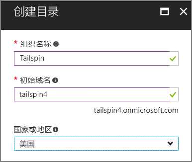

4. <span data-ttu-id="ea427-126">单击“创建”。</span><span class="sxs-lookup"><span data-stu-id="ea427-126">Click **Create**.</span></span> <span data-ttu-id="ea427-127">创建新目录可能需要花费几分钟时间。</span><span class="sxs-lookup"><span data-stu-id="ea427-127">It may take a few minutes to create the new directory.</span></span>

<span data-ttu-id="ea427-128">若要完成端到端方案，你将需要另一个 Azure AD 目录来表示向应用程序进行注册的客户。</span><span class="sxs-lookup"><span data-stu-id="ea427-128">To complete the end-to-end scenario, you'll need a second Azure AD directory to represent a customer that signs up for the application.</span></span> <span data-ttu-id="ea427-129">对于此用途，可以使用默认的 Azure AD 目录（不是 Tailspin），也可以创建一个新目录。</span><span class="sxs-lookup"><span data-stu-id="ea427-129">You can use your default Azure AD directory (not Tailspin), or create a new directory for this purpose.</span></span> <span data-ttu-id="ea427-130">在示例中，我们使用 Contoso 作为虚构的客户。</span><span class="sxs-lookup"><span data-stu-id="ea427-130">In the examples, we use Contoso as the fictitious customer.</span></span>

## <a name="register-the-surveys-web-api"></a><span data-ttu-id="ea427-131">注册 Surveys Web API</span><span class="sxs-lookup"><span data-stu-id="ea427-131">Register the Surveys web API</span></span> 

1. <span data-ttu-id="ea427-132">在 [Azure 门户][portal]中，通过在门户的右上角选择你的帐户切换到新的 Tailspin 目录。</span><span class="sxs-lookup"><span data-stu-id="ea427-132">In the [Azure portal][portal], switch to the new Tailspin directory by selecting your account in the top right corner of the portal.</span></span>

2. <span data-ttu-id="ea427-133">在左侧导航窗格中，选择“Azure Active Directory”。</span><span class="sxs-lookup"><span data-stu-id="ea427-133">In the left-hand navigation pane, choose **Azure Active Directory**.</span></span> 

3. <span data-ttu-id="ea427-134">单击“应用注册” > “新建应用程序注册”。</span><span class="sxs-lookup"><span data-stu-id="ea427-134">Click **App registrations** > **New application registration**.</span></span>

4. <span data-ttu-id="ea427-135">在“创建”边栏选项卡中，输入以下信息：</span><span class="sxs-lookup"><span data-stu-id="ea427-135">In the **Create** blade, enter the following information:</span></span>

   - <span data-ttu-id="ea427-136">**名称**：`Surveys.WebAPI`</span><span class="sxs-lookup"><span data-stu-id="ea427-136">**Name**: `Surveys.WebAPI`</span></span>

   - <span data-ttu-id="ea427-137">**应用程序类型**：`Web app / API`</span><span class="sxs-lookup"><span data-stu-id="ea427-137">**Application type**: `Web app / API`</span></span>

   - <span data-ttu-id="ea427-138">**登录 URL**：`https://localhost:44301/`</span><span class="sxs-lookup"><span data-stu-id="ea427-138">**Sign-on URL**: `https://localhost:44301/`</span></span>
   
   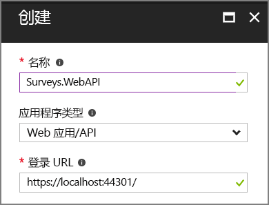 

5. <span data-ttu-id="ea427-139">单击“创建”。</span><span class="sxs-lookup"><span data-stu-id="ea427-139">Click **Create**.</span></span>

6. <span data-ttu-id="ea427-140">在“应用注册”边栏选项卡中，选择新的“Surveys.WebAPI”应用程序。</span><span class="sxs-lookup"><span data-stu-id="ea427-140">In the **App registrations** blade, select the new **Surveys.WebAPI** application.</span></span>
 
7. <span data-ttu-id="ea427-141">单击“属性”。</span><span class="sxs-lookup"><span data-stu-id="ea427-141">Click **Properties**.</span></span>

8. <span data-ttu-id="ea427-142">在“应用 ID URI”编辑框中，输入 `https://<domain>/surveys.webapi`，其中 `<domain>` 是目录的域名。</span><span class="sxs-lookup"><span data-stu-id="ea427-142">In the **App ID URI** edit box, enter `https://<domain>/surveys.webapi`, where `<domain>` is the domain name of the directory.</span></span> <span data-ttu-id="ea427-143">例如： `https://tailspin.onmicrosoft.com/surveys.webapi`</span><span class="sxs-lookup"><span data-stu-id="ea427-143">For example: `https://tailspin.onmicrosoft.com/surveys.webapi`</span></span>

    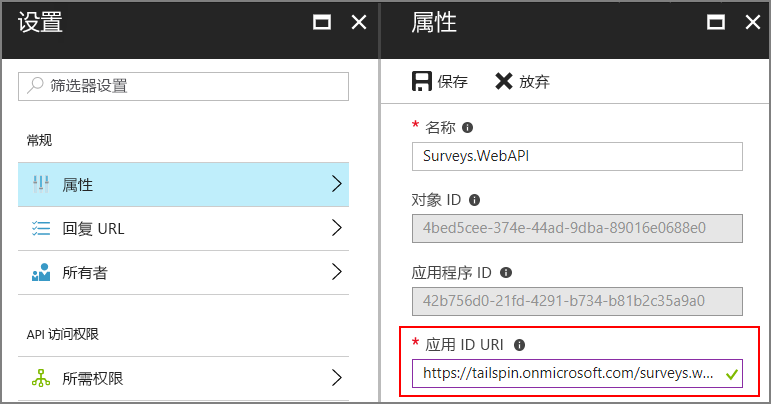

9. <span data-ttu-id="ea427-145">将“多租户”设置为“是”。</span><span class="sxs-lookup"><span data-stu-id="ea427-145">Set **Multi-tenanted** to **YES**.</span></span>

10. <span data-ttu-id="ea427-146">单击“ **保存**”。</span><span class="sxs-lookup"><span data-stu-id="ea427-146">Click **Save**.</span></span>

## <a name="register-the-surveys-web-app"></a><span data-ttu-id="ea427-147">注册 Surveys Web 应用</span><span class="sxs-lookup"><span data-stu-id="ea427-147">Register the Surveys web app</span></span> 

1. <span data-ttu-id="ea427-148">返回到“应用注册”边栏选项卡，单击“新建应用程序注册”。</span><span class="sxs-lookup"><span data-stu-id="ea427-148">Navigate back to the **App registrations** blade, and click **New application registration**.</span></span>

2. <span data-ttu-id="ea427-149">在“创建”边栏选项卡中，输入以下信息：</span><span class="sxs-lookup"><span data-stu-id="ea427-149">In the **Create** blade, enter the following information:</span></span>

   - <span data-ttu-id="ea427-150">**名称**：`Surveys`</span><span class="sxs-lookup"><span data-stu-id="ea427-150">**Name**: `Surveys`</span></span>
   - <span data-ttu-id="ea427-151">**应用程序类型**：`Web app / API`</span><span class="sxs-lookup"><span data-stu-id="ea427-151">**Application type**: `Web app / API`</span></span>
   - <span data-ttu-id="ea427-152">**登录 URL**：`https://localhost:44300/`</span><span class="sxs-lookup"><span data-stu-id="ea427-152">**Sign-on URL**: `https://localhost:44300/`</span></span>
   
   <span data-ttu-id="ea427-153">注意，登录 URL 具有与上一步骤中的 `Surveys.WebAPI` 应用不同的端口号。</span><span class="sxs-lookup"><span data-stu-id="ea427-153">Notice that the sign-on URL has a different port number from the `Surveys.WebAPI` app in the previous step.</span></span>

3. <span data-ttu-id="ea427-154">单击“创建”。</span><span class="sxs-lookup"><span data-stu-id="ea427-154">Click **Create**.</span></span>
 
4. <span data-ttu-id="ea427-155">在“应用注册”边栏选项卡中，选择新的“Surveys”应用程序。</span><span class="sxs-lookup"><span data-stu-id="ea427-155">In the **App registrations** blade, select the new **Surveys** application.</span></span>
 
5. <span data-ttu-id="ea427-156">复制应用程序 ID。</span><span class="sxs-lookup"><span data-stu-id="ea427-156">Copy the application ID.</span></span> <span data-ttu-id="ea427-157">稍后需要此项。</span><span class="sxs-lookup"><span data-stu-id="ea427-157">You will need this later.</span></span>

    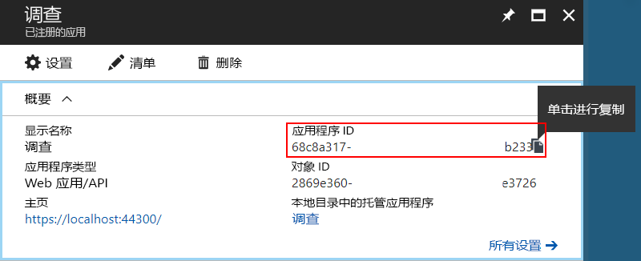

6. <span data-ttu-id="ea427-158">单击“属性”。</span><span class="sxs-lookup"><span data-stu-id="ea427-158">Click **Properties**.</span></span>

7. <span data-ttu-id="ea427-159">在“应用 ID URI”编辑框中，输入 `https://<domain>/surveys`，其中 `<domain>` 是目录的域名。</span><span class="sxs-lookup"><span data-stu-id="ea427-159">In the **App ID URI** edit box, enter `https://<domain>/surveys`, where `<domain>` is the domain name of the directory.</span></span> 

    

8. <span data-ttu-id="ea427-161">将“多租户”设置为“是”。</span><span class="sxs-lookup"><span data-stu-id="ea427-161">Set **Multi-tenanted** to **YES**.</span></span>

9. <span data-ttu-id="ea427-162">单击“ **保存**”。</span><span class="sxs-lookup"><span data-stu-id="ea427-162">Click **Save**.</span></span>

10. <span data-ttu-id="ea427-163">在“设置”边栏选项卡中，单击“回复 URL”。</span><span class="sxs-lookup"><span data-stu-id="ea427-163">In the **Settings** blade, click **Reply URLs**.</span></span>
 
11. <span data-ttu-id="ea427-164">添加以下回复 URL：`https://localhost:44300/signin-oidc`。</span><span class="sxs-lookup"><span data-stu-id="ea427-164">Add the following reply URL: `https://localhost:44300/signin-oidc`.</span></span>

12. <span data-ttu-id="ea427-165">单击“ **保存**”。</span><span class="sxs-lookup"><span data-stu-id="ea427-165">Click **Save**.</span></span>

13. <span data-ttu-id="ea427-166">在“API 访问”下，单击“密钥”。</span><span class="sxs-lookup"><span data-stu-id="ea427-166">Under **API ACCESS**, click **Keys**.</span></span>

14. <span data-ttu-id="ea427-167">输入描述，例如 `client secret`。</span><span class="sxs-lookup"><span data-stu-id="ea427-167">Enter a description, such as `client secret`.</span></span>

15. <span data-ttu-id="ea427-168">在“选择持续时间”下拉列表中，选择“1 年”。</span><span class="sxs-lookup"><span data-stu-id="ea427-168">In the **Select Duration** dropdown, select **1 year**.</span></span> 

16. <span data-ttu-id="ea427-169">单击“ **保存**”。</span><span class="sxs-lookup"><span data-stu-id="ea427-169">Click **Save**.</span></span> <span data-ttu-id="ea427-170">保存时，将生成密钥。</span><span class="sxs-lookup"><span data-stu-id="ea427-170">The key will be generated when you save.</span></span>

17. <span data-ttu-id="ea427-171">在离开此边栏选项卡之前，复制密钥的值。</span><span class="sxs-lookup"><span data-stu-id="ea427-171">Before you navigate away from this blade, copy the value of the key.</span></span>

    > [!NOTE] 
    > <span data-ttu-id="ea427-172">离开此边栏选项卡后，密钥将不再可见。</span><span class="sxs-lookup"><span data-stu-id="ea427-172">The key won't be visible again after you navigate away from the blade.</span></span> 

18. <span data-ttu-id="ea427-173">在“API 访问”下，单击“所需权限”。</span><span class="sxs-lookup"><span data-stu-id="ea427-173">Under **API ACCESS**, click **Required permissions**.</span></span>

19. <span data-ttu-id="ea427-174">单击“添加” > “选择 API”。</span><span class="sxs-lookup"><span data-stu-id="ea427-174">Click **Add** > **Select an API**.</span></span>

20. <span data-ttu-id="ea427-175">在搜索框中，搜索 `Surveys.WebAPI`。</span><span class="sxs-lookup"><span data-stu-id="ea427-175">In the search box, search for `Surveys.WebAPI`.</span></span>

    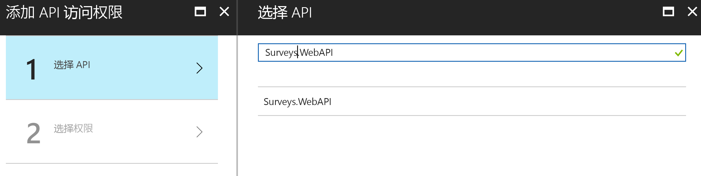

21. <span data-ttu-id="ea427-177">选择 `Surveys.WebAPI` 并单击“选择”。</span><span class="sxs-lookup"><span data-stu-id="ea427-177">Select `Surveys.WebAPI` and click **Select**.</span></span>

22. <span data-ttu-id="ea427-178">在“委派的权限”下，选中“访问 Surveys.WebAPI”复选框。</span><span class="sxs-lookup"><span data-stu-id="ea427-178">Under **Delegated Permissions**, check **Access Surveys.WebAPI**.</span></span>

    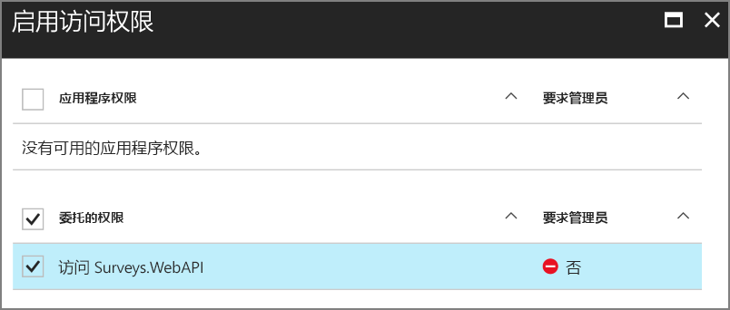

23. <span data-ttu-id="ea427-180">单击“选择” > “完成”。</span><span class="sxs-lookup"><span data-stu-id="ea427-180">Click **Select** > **Done**.</span></span>


## <a name="update-the-application-manifests"></a><span data-ttu-id="ea427-181">部署应用程序清单</span><span class="sxs-lookup"><span data-stu-id="ea427-181">Update the application manifests</span></span>

1. <span data-ttu-id="ea427-182">返回到 `Surveys.WebAPI` 应用程序的“设置”边栏选项卡。</span><span class="sxs-lookup"><span data-stu-id="ea427-182">Navigate back to the **Settings** blade for the `Surveys.WebAPI` app.</span></span>

2. <span data-ttu-id="ea427-183">单击“清单” > “编辑”。</span><span class="sxs-lookup"><span data-stu-id="ea427-183">Click **Manifest** > **Edit**.</span></span>

    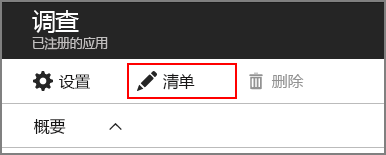
 
3. <span data-ttu-id="ea427-184">将以下 JSON 添加到 `appRoles` 元素。</span><span class="sxs-lookup"><span data-stu-id="ea427-184">Add the following JSON to the `appRoles` element.</span></span> <span data-ttu-id="ea427-185">为 `id` 属性生成新的 GUID。</span><span class="sxs-lookup"><span data-stu-id="ea427-185">Generate new GUIDs for the `id` properties.</span></span>

   ```json
   {
     "allowedMemberTypes": ["User"],
     "description": "Creators can create surveys",
     "displayName": "SurveyCreator",
     "id": "<Generate a new GUID. Example: 1b4f816e-5eaf-48b9-8613-7923830595ad>",
     "isEnabled": true,
     "value": "SurveyCreator"
   },
   {
     "allowedMemberTypes": ["User"],
     "description": "Administrators can manage the surveys in their tenant",
     "displayName": "SurveyAdmin",
     "id": "<Generate a new GUID>",  
     "isEnabled": true,
     "value": "SurveyAdmin"
   }
   ```

4. <span data-ttu-id="ea427-186">在 `knownClientApplications` 属性中，添加 Surveys Web 应用程序的应用程序 ID，该 ID 是在前面注册 Surveys 应用程序时获取的。</span><span class="sxs-lookup"><span data-stu-id="ea427-186">In the `knownClientApplications` property, add the application ID for the Surveys web application, which you got when you registered the Surveys application earlier.</span></span> <span data-ttu-id="ea427-187">例如：</span><span class="sxs-lookup"><span data-stu-id="ea427-187">For example:</span></span>

   ```json
   "knownClientApplications": ["be2cea23-aa0e-4e98-8b21-2963d494912e"],
   ```

   <span data-ttu-id="ea427-188">此设置将 Surveys 应用添加到被授权调用 Web API 的客户端列表。</span><span class="sxs-lookup"><span data-stu-id="ea427-188">This setting adds the Surveys app to the list of clients authorized to call the web API.</span></span>

5. <span data-ttu-id="ea427-189">单击“ **保存**”。</span><span class="sxs-lookup"><span data-stu-id="ea427-189">Click **Save**.</span></span>

<span data-ttu-id="ea427-190">现在，为 Surveys 应用重复相同的步骤，但是不要添加 `knownClientApplications` 的条目。</span><span class="sxs-lookup"><span data-stu-id="ea427-190">Now repeat the same steps for the Surveys app, except do not add an entry for `knownClientApplications`.</span></span> <span data-ttu-id="ea427-191">使用相同的角色定义，但是为 ID 生成新的 GUID。</span><span class="sxs-lookup"><span data-stu-id="ea427-191">Use the same role definitions, but generate new GUIDs for the IDs.</span></span>

## <a name="create-a-new-redis-cache-instance"></a><span data-ttu-id="ea427-192">创建一个新的 Redis 缓存实例</span><span class="sxs-lookup"><span data-stu-id="ea427-192">Create a new Redis Cache instance</span></span>

<span data-ttu-id="ea427-193">Surveys 应用程序使用 Redis 来缓存 OAuth 2 访问令牌。</span><span class="sxs-lookup"><span data-stu-id="ea427-193">The Surveys application uses Redis to cache OAuth 2 access tokens.</span></span> <span data-ttu-id="ea427-194">若要创建缓存，请执行以下步骤：</span><span class="sxs-lookup"><span data-stu-id="ea427-194">To create the cache:</span></span>

1.  <span data-ttu-id="ea427-195">转到 [Azure 门户](https://portal.azure.com)并单击“新建” > “数据库” > “Redis 缓存”。</span><span class="sxs-lookup"><span data-stu-id="ea427-195">Go to [Azure Portal](https://portal.azure.com) and click **New** > **Databases** > **Redis Cache**.</span></span>

2.  <span data-ttu-id="ea427-196">填写所需的信息，包括 DNS 名称、资源组、位置和定价层。</span><span class="sxs-lookup"><span data-stu-id="ea427-196">Fill in the required information, including DNS name, resource group, location, and pricing tier.</span></span> <span data-ttu-id="ea427-197">可以创建新的资源组，也可以使用现有资源组。</span><span class="sxs-lookup"><span data-stu-id="ea427-197">You can create a new resource group or use an existing resource group.</span></span>

3. <span data-ttu-id="ea427-198">单击“创建”。</span><span class="sxs-lookup"><span data-stu-id="ea427-198">Click **Create**.</span></span>

4. <span data-ttu-id="ea427-199">在创建 Resis 缓存后，在门户中导航到该资源。</span><span class="sxs-lookup"><span data-stu-id="ea427-199">After the Resis cache is created, navigate to the resource in the portal.</span></span>

5. <span data-ttu-id="ea427-200">单击“访问密钥”并复制主密钥。</span><span class="sxs-lookup"><span data-stu-id="ea427-200">Click **Access keys** and copy the primary key.</span></span>

<span data-ttu-id="ea427-201">有关创建 Redis 缓存的详细信息，请参阅 [How to Use Azure Redis Cache](/azure/redis-cache/cache-dotnet-how-to-use-azure-redis-cache)（如何使用 Azure Redis 缓存）。</span><span class="sxs-lookup"><span data-stu-id="ea427-201">For more information about creating a Redis cache, see [How to Use Azure Redis Cache](/azure/redis-cache/cache-dotnet-how-to-use-azure-redis-cache).</span></span>

## <a name="set-application-secrets"></a><span data-ttu-id="ea427-202">设置应用程序机密</span><span class="sxs-lookup"><span data-stu-id="ea427-202">Set application secrets</span></span>

1.  <span data-ttu-id="ea427-203">在 Visual Studio 中打开 Tailspin.Surveys 解决方案。</span><span class="sxs-lookup"><span data-stu-id="ea427-203">Open the Tailspin.Surveys solution in Visual Studio.</span></span>

2.  <span data-ttu-id="ea427-204">在“解决方案资源管理器”中，右键单击 Tailspin.Surveys.Web 项目并选“管理用户机密”。</span><span class="sxs-lookup"><span data-stu-id="ea427-204">In Solution Explorer, right-click the Tailspin.Surveys.Web project and select **Manage User Secrets**.</span></span>

3.  <span data-ttu-id="ea427-205">在 secrets.json 文件中，粘贴以下代码：</span><span class="sxs-lookup"><span data-stu-id="ea427-205">In the secrets.json file, paste in the following:</span></span>
    
    ```json
    {
      "AzureAd": {
        "ClientId": "<Surveys application ID>",
        "ClientSecret": "<Surveys app client secret>",
        "PostLogoutRedirectUri": "https://localhost:44300/",
        "WebApiResourceId": "<Surveys.WebAPI app ID URI>"
      },
      "Redis": {
        "Configuration": "<Redis DNS name>.redis.cache.windows.net,password=<Redis primary key>,ssl=true"
      }
    }
    ```
   
    <span data-ttu-id="ea427-206">替换尖括号中显示的项，如下所示：</span><span class="sxs-lookup"><span data-stu-id="ea427-206">Replace the items shown in angle brackets, as follows:</span></span>

    - <span data-ttu-id="ea427-207">`AzureAd:ClientId`：Surveys 应用的应用程序 ID。</span><span class="sxs-lookup"><span data-stu-id="ea427-207">`AzureAd:ClientId`: The application ID of the Surveys app.</span></span>
    - <span data-ttu-id="ea427-208">`AzureAd:ClientSecret`：在 Azure AD 中注册 Surveys 应用程序时生成的密钥。</span><span class="sxs-lookup"><span data-stu-id="ea427-208">`AzureAd:ClientSecret`: The key that you generated when you registered the Surveys application in Azure AD.</span></span>
    - <span data-ttu-id="ea427-209">`AzureAd:WebApiResourceId`：在 Azure AD 中创建 Surveys.WebAPI 应用程序时指定的“应用 ID URI”。</span><span class="sxs-lookup"><span data-stu-id="ea427-209">`AzureAd:WebApiResourceId`: The App ID URI that you specified when you created the Surveys.WebAPI application in Azure AD.</span></span> <span data-ttu-id="ea427-210">它应当采用 `https://<directory>.onmicrosoft.com/surveys.webapi` 形式</span><span class="sxs-lookup"><span data-stu-id="ea427-210">It should have the form `https://<directory>.onmicrosoft.com/surveys.webapi`</span></span>
    - <span data-ttu-id="ea427-211">`Redis:Configuration`：基于 Redis 缓存的 DNS 名称和主访问密钥构建此字符串。</span><span class="sxs-lookup"><span data-stu-id="ea427-211">`Redis:Configuration`: Build this string from the DNS name of the Redis cache and the primary access key.</span></span> <span data-ttu-id="ea427-212">例如“tailspin.redis.cache.windows.net,password=2h5tBxxx,ssl=true”。</span><span class="sxs-lookup"><span data-stu-id="ea427-212">For example, "tailspin.redis.cache.windows.net,password=2h5tBxxx,ssl=true".</span></span>

4.  <span data-ttu-id="ea427-213">保存更新后的 secrets.json 文件。</span><span class="sxs-lookup"><span data-stu-id="ea427-213">Save the updated secrets.json file.</span></span>

5.  <span data-ttu-id="ea427-214">对 Tailspin.Surveys.WebAPI 项目重复这些步骤，但将以下内容粘贴到 secrets.json。</span><span class="sxs-lookup"><span data-stu-id="ea427-214">Repeat these steps for the Tailspin.Surveys.WebAPI project, but paste the following into secrets.json.</span></span> <span data-ttu-id="ea427-215">像前面一样，替换尖括号中显示的项。</span><span class="sxs-lookup"><span data-stu-id="ea427-215">Replace the items in angle brackets, as before.</span></span>

    ```json
    {
      "AzureAd": {
        "WebApiResourceId": "<Surveys.WebAPI app ID URI>"
      },
      "Redis": {
        "Configuration": "<Redis DNS name>.redis.cache.windows.net,password=<Redis primary key>,ssl=true"
      }
    }
    ```

## <a name="initialize-the-database"></a><span data-ttu-id="ea427-216">初始化数据库</span><span class="sxs-lookup"><span data-stu-id="ea427-216">Initialize the database</span></span>

<span data-ttu-id="ea427-217">在此步骤中，将通过 Entity Framework 7 并使用 LocalDB 创建一个本地 SQL 数据库。</span><span class="sxs-lookup"><span data-stu-id="ea427-217">In this step, you will use Entity Framework 7 to create a local SQL database, using LocalDB.</span></span>

1.  <span data-ttu-id="ea427-218">打开命令窗口</span><span class="sxs-lookup"><span data-stu-id="ea427-218">Open a command window</span></span>

2.  <span data-ttu-id="ea427-219">导航到 Tailspin.Surveys.Data 项目。</span><span class="sxs-lookup"><span data-stu-id="ea427-219">Navigate to the Tailspin.Surveys.Data project.</span></span>

3.  <span data-ttu-id="ea427-220">运行以下命令：</span><span class="sxs-lookup"><span data-stu-id="ea427-220">Run the following command:</span></span>

    ```
    dotnet ef database update --startup-project ..\Tailspin.Surveys.Web
    ```
    
## <a name="run-the-application"></a><span data-ttu-id="ea427-221">运行应用程序</span><span class="sxs-lookup"><span data-stu-id="ea427-221">Run the application</span></span>

<span data-ttu-id="ea427-222">若要运行此应用程序，请同时启动 Tailspin.Surveys.Web 和 Tailspin.Surveys.WebAPI 项目。</span><span class="sxs-lookup"><span data-stu-id="ea427-222">To run the application, start both the Tailspin.Surveys.Web and Tailspin.Surveys.WebAPI projects.</span></span>

<span data-ttu-id="ea427-223">可以将 Visual Studio 设置为在按 F5 时自动运行这两个项目，如下所述：</span><span class="sxs-lookup"><span data-stu-id="ea427-223">You can set Visual Studio to run both projects automatically on F5, as follows:</span></span>

1.  <span data-ttu-id="ea427-224">在解决方案资源管理器中，右键单击此解决方案并选择“设置启动项目”。</span><span class="sxs-lookup"><span data-stu-id="ea427-224">In Solution Explorer, right-click the solution and click **Set Startup Projects**.</span></span>
2.  <span data-ttu-id="ea427-225">选择“多启动项目”。</span><span class="sxs-lookup"><span data-stu-id="ea427-225">Select **Multiple startup projects**.</span></span>
3.  <span data-ttu-id="ea427-226">为 Tailspin.Surveys.Web 和 Tailspin.Surveys.WebAPI 项目设置“操作” = “启动”。</span><span class="sxs-lookup"><span data-stu-id="ea427-226">Set **Action** = **Start** for the Tailspin.Surveys.Web and Tailspin.Surveys.WebAPI projects.</span></span>

## <a name="sign-up-a-new-tenant"></a><span data-ttu-id="ea427-227">注册一个新租户</span><span class="sxs-lookup"><span data-stu-id="ea427-227">Sign up a new tenant</span></span>

<span data-ttu-id="ea427-228">当应用程序启动时，你未登录，因此会看到欢迎页面：</span><span class="sxs-lookup"><span data-stu-id="ea427-228">When the application starts, you are not signed in, so you see the welcome page:</span></span>

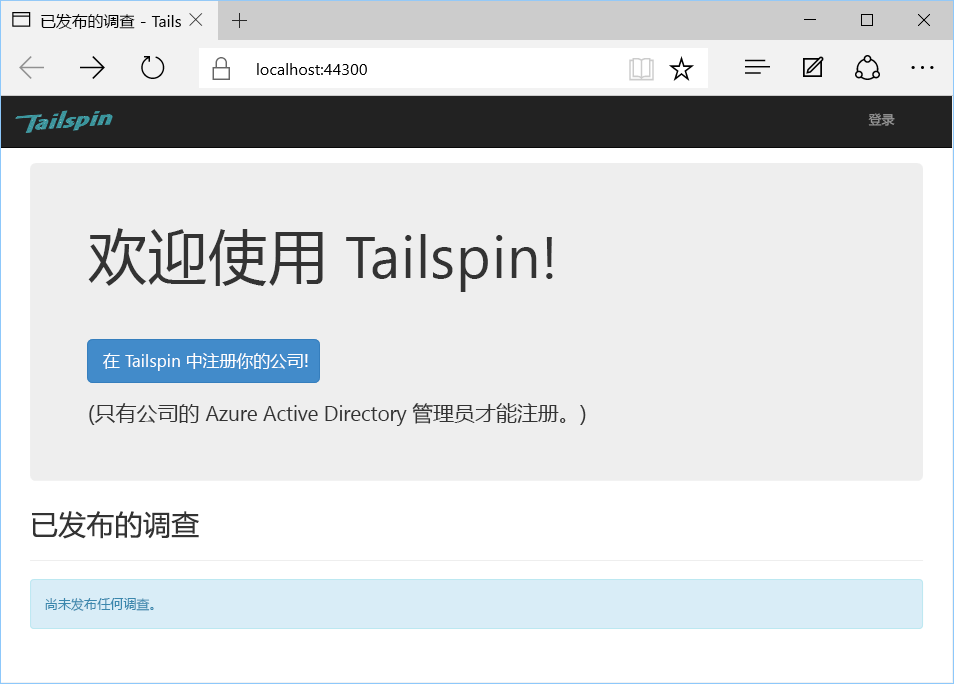

<span data-ttu-id="ea427-230">若要注册某个组织，请执行以下操作：</span><span class="sxs-lookup"><span data-stu-id="ea427-230">To sign up an organization:</span></span>

1. <span data-ttu-id="ea427-231">单击“在 Tailspin 中注册公司”。</span><span class="sxs-lookup"><span data-stu-id="ea427-231">Click **Enroll your company in Tailspin**.</span></span>
2. <span data-ttu-id="ea427-232">使用 Surveys 应用登录到代表该组织的 Azure AD 目录。</span><span class="sxs-lookup"><span data-stu-id="ea427-232">Sign in to the Azure AD directory that represents the organization using the Surveys app.</span></span> <span data-ttu-id="ea427-233">必须以管理员用户身份登录。</span><span class="sxs-lookup"><span data-stu-id="ea427-233">You must sign in as an admin user.</span></span>
3. <span data-ttu-id="ea427-234">接受许可提示。</span><span class="sxs-lookup"><span data-stu-id="ea427-234">Accept the consent prompt.</span></span>

<span data-ttu-id="ea427-235">应用程序将注册该租户，然后将你注销。应用将你注销是因为你在使用应用程序之前需要在 Azure AD 中设置应用程序角色。</span><span class="sxs-lookup"><span data-stu-id="ea427-235">The application registers the tenant, and then signs you out. The app signs you out because you need to set up the application roles in Azure AD, before using the application.</span></span>

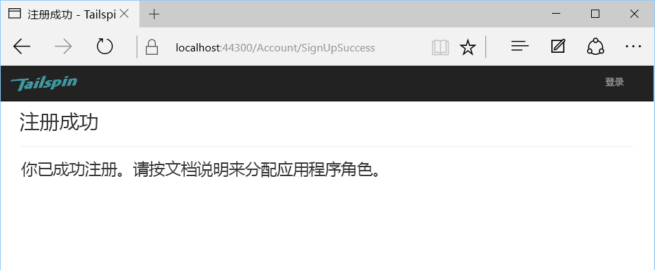

## <a name="assign-application-roles"></a><span data-ttu-id="ea427-237">分配应用程序角色</span><span class="sxs-lookup"><span data-stu-id="ea427-237">Assign application roles</span></span>

<span data-ttu-id="ea427-238">当租户注册时，租户的 AD 管理员必须将应用程序角色分配给用户。</span><span class="sxs-lookup"><span data-stu-id="ea427-238">When a tenant signs up, an AD admin for the tenant must assign application roles to users.</span></span>


1. <span data-ttu-id="ea427-239">在 [Azure 门户][portal]中，切换到注册 Surveys 时使用的 Azure AD 目录。</span><span class="sxs-lookup"><span data-stu-id="ea427-239">In the [Azure portal][portal], switch to the Azure AD directory that you used to sign up for the Surveys app.</span></span> 

2. <span data-ttu-id="ea427-240">在左侧导航窗格中，选择“Azure Active Directory”。</span><span class="sxs-lookup"><span data-stu-id="ea427-240">In the left-hand navigation pane, choose **Azure Active Directory**.</span></span> 

3. <span data-ttu-id="ea427-241">单击“企业应用程序” > “所有应用程序”。</span><span class="sxs-lookup"><span data-stu-id="ea427-241">Click **Enterprise applications** > **All applications**.</span></span> <span data-ttu-id="ea427-242">门户将列出 `Survey` 和 `Survey.WebAPI`。</span><span class="sxs-lookup"><span data-stu-id="ea427-242">The portal will list `Survey` and `Survey.WebAPI`.</span></span> <span data-ttu-id="ea427-243">如果没有列出，请确保你已完成了注册流程。</span><span class="sxs-lookup"><span data-stu-id="ea427-243">If not, make sure that you completed the sign up process.</span></span>

4.  <span data-ttu-id="ea427-244">单击 Surveys 应用程序。</span><span class="sxs-lookup"><span data-stu-id="ea427-244">Click on the Surveys application.</span></span>

5.  <span data-ttu-id="ea427-245">单击“用户和组”。</span><span class="sxs-lookup"><span data-stu-id="ea427-245">Click **Users and Groups**.</span></span>

4.  <span data-ttu-id="ea427-246">单击“添加用户”。</span><span class="sxs-lookup"><span data-stu-id="ea427-246">Click **Add user**.</span></span>

5.  <span data-ttu-id="ea427-247">如果你具有 Azure AD Premium，请单击“用户和组”。</span><span class="sxs-lookup"><span data-stu-id="ea427-247">If you have Azure AD Premium, click **Users and groups**.</span></span> <span data-ttu-id="ea427-248">否则，请单击“用户”。</span><span class="sxs-lookup"><span data-stu-id="ea427-248">Otherwise, click **Users**.</span></span> <span data-ttu-id="ea427-249">（将角色分配给组需要 Azure AD Premium。）</span><span class="sxs-lookup"><span data-stu-id="ea427-249">(Assigning a role to a group requires Azure AD Premium.)</span></span>

6. <span data-ttu-id="ea427-250">选择一个或多个用户，然后单击“选择”。</span><span class="sxs-lookup"><span data-stu-id="ea427-250">Select one or more users and click **Select**.</span></span>

    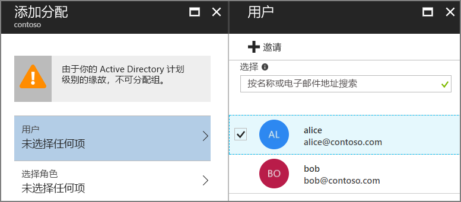

6.  <span data-ttu-id="ea427-252">选择角色并单击“选择”。</span><span class="sxs-lookup"><span data-stu-id="ea427-252">Select the role and click **Select**.</span></span>

    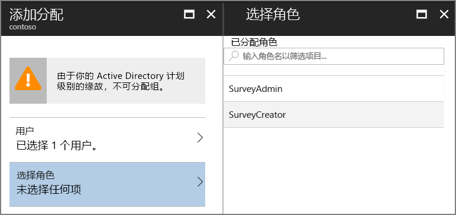

7.  <span data-ttu-id="ea427-254">单击“分配”。</span><span class="sxs-lookup"><span data-stu-id="ea427-254">Click **Assign**.</span></span>

<span data-ttu-id="ea427-255">重复相同的步骤来为 Survey.WebAPI 应用程序分配角色。</span><span class="sxs-lookup"><span data-stu-id="ea427-255">Repeat the same steps to assign roles for the Survey.WebAPI application.</span></span>

> <span data-ttu-id="ea427-256">重要说明：用户在 Survey 和 Survey.WebAPI 中应当始终具有相同的角色。</span><span class="sxs-lookup"><span data-stu-id="ea427-256">Important: A user should always have the same roles in both Survey and Survey.WebAPI.</span></span> <span data-ttu-id="ea427-257">否则，用户将具有不一致的权限，这将导致 Web API 发出 403（被禁止）错误。</span><span class="sxs-lookup"><span data-stu-id="ea427-257">Otherwise, the user will have inconsistent permissions, which may lead to 403 (Forbidden) errors from the Web API.</span></span>

<span data-ttu-id="ea427-258">现在，返回到应用并再次登录。</span><span class="sxs-lookup"><span data-stu-id="ea427-258">Now go back to the app and sign in again.</span></span> <span data-ttu-id="ea427-259">单击“我的调查”。</span><span class="sxs-lookup"><span data-stu-id="ea427-259">Click **My Surveys**.</span></span> <span data-ttu-id="ea427-260">如果为用户分配了 SurveyAdmin 或 SurveyCreator 角色，则你会看到一个“创建调查”按钮，这表示用户有权创建新调查。</span><span class="sxs-lookup"><span data-stu-id="ea427-260">If the user is assigned to the SurveyAdmin or SurveyCreator role, you will see a **Create Survey** button, indicating that the user has permissions to create a new survey.</span></span>

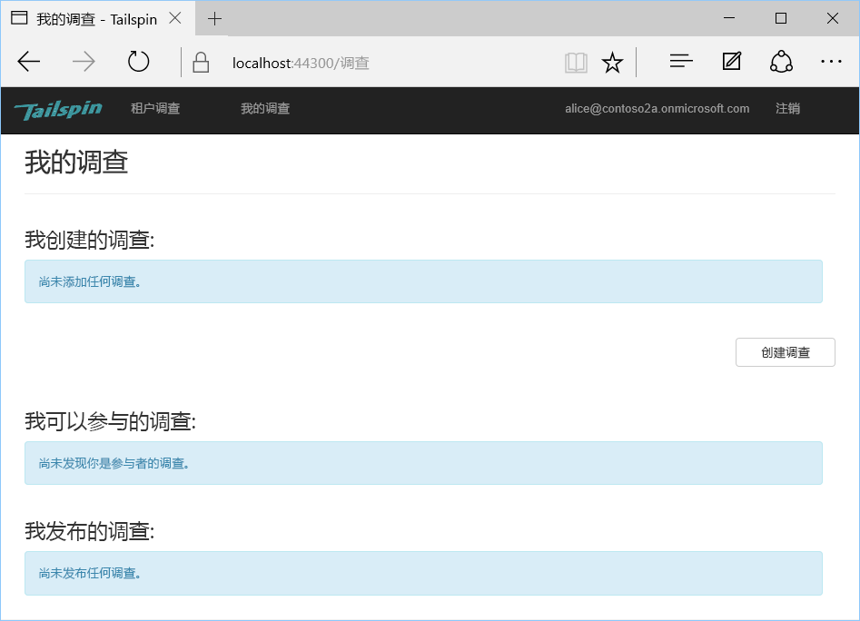


<!-- links -->

[portal]: https://portal.azure.com
[VS2017]: https://www.visualstudio.com/vs/
