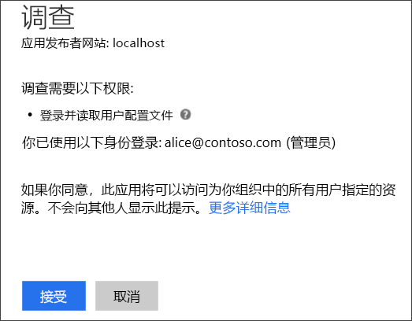
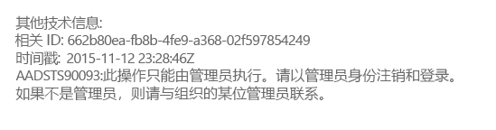
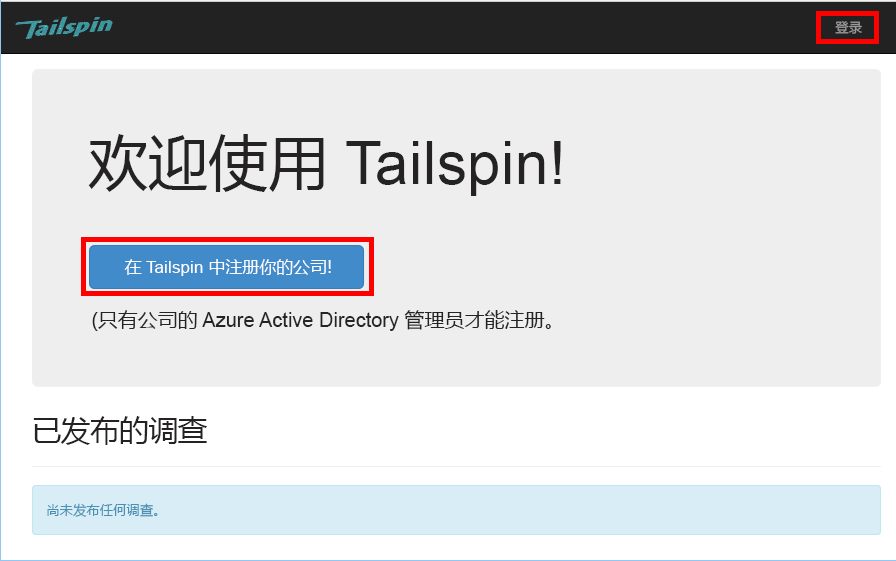
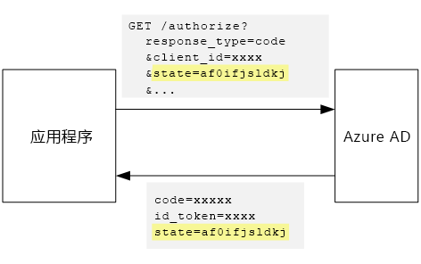

# <a name="tenant-sign-up-and-onboarding"></a><span data-ttu-id="d02f9-103">租户注册和加入</span><span class="sxs-lookup"><span data-stu-id="d02f9-103">Tenant sign-up and onboarding</span></span>

<span data-ttu-id="d02f9-104">[ 示例代码][sample application]</span><span class="sxs-lookup"><span data-stu-id="d02f9-104">[ Sample code][sample application]</span></span>

<span data-ttu-id="d02f9-105">本文介绍如何在多租户应用程序中实施注册过程，使客户能够代表其组织注册应用程序。</span><span class="sxs-lookup"><span data-stu-id="d02f9-105">This article describes how to implement a *sign-up* process in a multi-tenant application, which allows a customer to sign up their organization for your application.</span></span>
<span data-ttu-id="d02f9-106">实施注册过程的原因有多种：</span><span class="sxs-lookup"><span data-stu-id="d02f9-106">There are several reasons to implement a sign-up process:</span></span>

* <span data-ttu-id="d02f9-107">使 AD 管理员能够许可客户所在的整个组织使用该应用程序。</span><span class="sxs-lookup"><span data-stu-id="d02f9-107">Allow an AD admin to consent for the customer's entire organization to use the application.</span></span>
* <span data-ttu-id="d02f9-108">收集信用卡付款信息或其他客户信息。</span><span class="sxs-lookup"><span data-stu-id="d02f9-108">Collect credit card payment or other customer information.</span></span>
* <span data-ttu-id="d02f9-109">执行应用程序所需的任何按租户一次性设置。</span><span class="sxs-lookup"><span data-stu-id="d02f9-109">Perform any one-time per-tenant setup needed by your application.</span></span>

## <a name="admin-consent-and-azure-ad-permissions"></a><span data-ttu-id="d02f9-110">管理员许可和 Azure AD 权限</span><span class="sxs-lookup"><span data-stu-id="d02f9-110">Admin consent and Azure AD permissions</span></span>
<span data-ttu-id="d02f9-111">若要使用 Azure AD 进行身份验证，应用程序需要有权访问用户的目录。</span><span class="sxs-lookup"><span data-stu-id="d02f9-111">In order to authenticate with Azure AD, an application needs access to the user's directory.</span></span> <span data-ttu-id="d02f9-112">应用程序最起码需要用户配置文件的读取权限。</span><span class="sxs-lookup"><span data-stu-id="d02f9-112">At a minimum, the application needs permission to read the user's profile.</span></span> <span data-ttu-id="d02f9-113">当某个用户首次登录时，Azure AD 会显示许可页面，其中列出了请求的权限。</span><span class="sxs-lookup"><span data-stu-id="d02f9-113">The first time that a user signs in, Azure AD shows a consent page that lists the permissions being requested.</span></span> <span data-ttu-id="d02f9-114">用户单击“接受”即表示向应用程序授予了权限。</span><span class="sxs-lookup"><span data-stu-id="d02f9-114">By clicking **Accept**, the user grants permission to the application.</span></span>

<span data-ttu-id="d02f9-115">默认情况下，许可是按用户授予的。</span><span class="sxs-lookup"><span data-stu-id="d02f9-115">By default, consent is granted on a per-user basis.</span></span> <span data-ttu-id="d02f9-116">每个登录用户都会看到许可页面。</span><span class="sxs-lookup"><span data-stu-id="d02f9-116">Every user who signs in sees the consent page.</span></span> <span data-ttu-id="d02f9-117">但是，Azure AD 还支持管理员许可：可让 AD 管理员许可整个组织的访问。</span><span class="sxs-lookup"><span data-stu-id="d02f9-117">However, Azure AD also supports  *admin consent*, which allows an AD administrator to consent for an entire organization.</span></span>

<span data-ttu-id="d02f9-118">使用管理员许可流时，许可页面会指出 AD 管理员正在代表整个租户授予权限：</span><span class="sxs-lookup"><span data-stu-id="d02f9-118">When the admin consent flow is used, the consent page states that the AD admin is granting permission on behalf of the entire tenant:</span></span>



<span data-ttu-id="d02f9-120">管理员单击“接受”后，同一租户中的其他用户可以登录，Azure AD 会跳过许可屏幕。</span><span class="sxs-lookup"><span data-stu-id="d02f9-120">After the admin clicks **Accept**, other users within the same tenant can sign in, and Azure AD will skip the consent screen.</span></span>

<span data-ttu-id="d02f9-121">只有 AD 管理员可以授予管理员许可，因为他（她）代表整个组织授予权限。</span><span class="sxs-lookup"><span data-stu-id="d02f9-121">Only an AD administrator can give admin consent, because it grants permission on behalf of the entire organization.</span></span> <span data-ttu-id="d02f9-122">如果非管理员尝试使用管理员许可流进行身份验证，Azure AD 会显示以下错误：</span><span class="sxs-lookup"><span data-stu-id="d02f9-122">If a non-administrator tries to authenticate with the admin consent flow, Azure AD displays an error:</span></span>



<span data-ttu-id="d02f9-124">如果应用程序后来需要其他权限，则客户需要再次登录，并许可更新的权限。</span><span class="sxs-lookup"><span data-stu-id="d02f9-124">If the application requires additional permissions at a later point, the customer will need to sign up again and consent to the updated permissions.</span></span>  

## <a name="implementing-tenant-sign-up"></a><span data-ttu-id="d02f9-125">实施租户注册</span><span class="sxs-lookup"><span data-stu-id="d02f9-125">Implementing tenant sign-up</span></span>
<span data-ttu-id="d02f9-126">针对 [Tailspin Surveys][Tailspin] 应用程序，我们定义了有关注册过程的几项要求：</span><span class="sxs-lookup"><span data-stu-id="d02f9-126">For the [Tailspin Surveys][Tailspin] application,  we defined several requirements for the sign-up process:</span></span>

* <span data-ttu-id="d02f9-127">在用户可以登录之前，租户必须注册。</span><span class="sxs-lookup"><span data-stu-id="d02f9-127">A tenant must sign up before users can sign in.</span></span>
* <span data-ttu-id="d02f9-128">注册过程使用管理员许可流。</span><span class="sxs-lookup"><span data-stu-id="d02f9-128">Sign-up uses the admin consent flow.</span></span>
* <span data-ttu-id="d02f9-129">注册过程将用户的租户添加到应用程序数据库。</span><span class="sxs-lookup"><span data-stu-id="d02f9-129">Sign-up adds the user's tenant to the application database.</span></span>
* <span data-ttu-id="d02f9-130">租户注册后，应用程序显示加入页面。</span><span class="sxs-lookup"><span data-stu-id="d02f9-130">After a tenant signs up, the application shows an onboarding page.</span></span>

<span data-ttu-id="d02f9-131">本部分将逐步讲解注册过程的实施方式。</span><span class="sxs-lookup"><span data-stu-id="d02f9-131">In this section, we'll walk through our implementation of the sign-up process.</span></span>
<span data-ttu-id="d02f9-132">必须知道，“注册”与“登录”是应用程序相关的概念。</span><span class="sxs-lookup"><span data-stu-id="d02f9-132">It's important to understand that "sign up" versus "sign in" is an application concept.</span></span> <span data-ttu-id="d02f9-133">在执行身份验证流期间，Azure AD 并非原本就知道用户是否正在注册。</span><span class="sxs-lookup"><span data-stu-id="d02f9-133">During the authentication flow, Azure AD does not inherently know whether the user is in process of signing up.</span></span> <span data-ttu-id="d02f9-134">由应用程序负责跟踪上下文。</span><span class="sxs-lookup"><span data-stu-id="d02f9-134">It's up to the application to keep track of the context.</span></span>

<span data-ttu-id="d02f9-135">当某个匿名用户访问 Surveys 应用程序时，该用户会看到两个按钮：一个按钮用于登录，另一个按钮用于登记公司（注册）。</span><span class="sxs-lookup"><span data-stu-id="d02f9-135">When an anonymous user visits the Surveys application, the user is shown two buttons, one to sign in, and one to "enroll your company" (sign up).</span></span>



<span data-ttu-id="d02f9-137">这些按钮调用 `AccountController` 类中的操作。</span><span class="sxs-lookup"><span data-stu-id="d02f9-137">These buttons invoke actions in the `AccountController` class.</span></span>

<span data-ttu-id="d02f9-138">`SignIn` 操作返回 **ChallegeResult**，导致 OpenID Connect 中间件重定向到身份验证终结点。</span><span class="sxs-lookup"><span data-stu-id="d02f9-138">The `SignIn` action returns a **ChallegeResult**, which causes the OpenID Connect middleware to redirect to the authentication endpoint.</span></span> <span data-ttu-id="d02f9-139">这是在 ASP.NET Core 中触发身份验证的默认方式。</span><span class="sxs-lookup"><span data-stu-id="d02f9-139">This is the default way to trigger authentication in ASP.NET Core.</span></span>  

```csharp
[AllowAnonymous]
public IActionResult SignIn()
{
    return new ChallengeResult(
        OpenIdConnectDefaults.AuthenticationScheme,
        new AuthenticationProperties
        {
            IsPersistent = true,
            RedirectUri = Url.Action("SignInCallback", "Account")
        });
}
```

<span data-ttu-id="d02f9-140">现在，我们与 `SignUp` 操作相对比：</span><span class="sxs-lookup"><span data-stu-id="d02f9-140">Now compare the `SignUp` action:</span></span>

```csharp
[AllowAnonymous]
public IActionResult SignUp()
{
    var state = new Dictionary<string, string> { { "signup", "true" }};
    return new ChallengeResult(
        OpenIdConnectDefaults.AuthenticationScheme,
        new AuthenticationProperties(state)
        {
            RedirectUri = Url.Action(nameof(SignUpCallback), "Account")
        });
}
```

<span data-ttu-id="d02f9-141">与 `SignIn` 一样，`SignUp` 操作也会返回 `ChallengeResult`。</span><span class="sxs-lookup"><span data-stu-id="d02f9-141">Like `SignIn`, the `SignUp` action also returns a `ChallengeResult`.</span></span> <span data-ttu-id="d02f9-142">但这一次，我们将一段状态信息添加到了 `ChallengeResult` 中的 `AuthenticationProperties`：</span><span class="sxs-lookup"><span data-stu-id="d02f9-142">But this time, we add a piece of state information to the `AuthenticationProperties` in the `ChallengeResult`:</span></span>

* <span data-ttu-id="d02f9-143">signup：一个布尔标志，指示用户是否已启动注册过程。</span><span class="sxs-lookup"><span data-stu-id="d02f9-143">signup: A Boolean flag, indicating that the user has started the sign-up process.</span></span>

<span data-ttu-id="d02f9-144">`AuthenticationProperties` 中的状态信息会添加到在执行身份验证流期间往返的 OpenID Connect [state] 参数。</span><span class="sxs-lookup"><span data-stu-id="d02f9-144">The state information in `AuthenticationProperties` gets added to the OpenID Connect [state] parameter, which round trips during the authentication flow.</span></span>



<span data-ttu-id="d02f9-146">用户在 Azure AD 中完成身份验证并重定向回到应用程序之后，身份验证票证包含状态。</span><span class="sxs-lookup"><span data-stu-id="d02f9-146">After the user authenticates in Azure AD and gets redirected back to the application, the authentication ticket contains the state.</span></span> <span data-ttu-id="d02f9-147">我们将使用此事实数据来确保整个身份验证流中保留“signup”值。</span><span class="sxs-lookup"><span data-stu-id="d02f9-147">We are using this fact to make sure the "signup" value persists across the entire authentication flow.</span></span>

## <a name="adding-the-admin-consent-prompt"></a><span data-ttu-id="d02f9-148">添加管理员许可提示</span><span class="sxs-lookup"><span data-stu-id="d02f9-148">Adding the admin consent prompt</span></span>
<span data-ttu-id="d02f9-149">在 Azure AD 中，可以通过将“prompt”参数添加到身份验证请求中的查询字符串来触发管理员许可流：</span><span class="sxs-lookup"><span data-stu-id="d02f9-149">In Azure AD, the admin consent flow is triggered by adding a "prompt" parameter to the query string in the authentication request:</span></span>

```
/authorize?prompt=admin_consent&...
```

<span data-ttu-id="d02f9-150">Surveys 应用程序在 `RedirectToAuthenticationEndpoint` 事件期间添加提示。</span><span class="sxs-lookup"><span data-stu-id="d02f9-150">The Surveys application adds the prompt during the `RedirectToAuthenticationEndpoint` event.</span></span> <span data-ttu-id="d02f9-151">调用此事件之后，紧接着中间件会重定向到身份验证终结点。</span><span class="sxs-lookup"><span data-stu-id="d02f9-151">This event is called right before the middleware redirects to the authentication endpoint.</span></span>

```csharp
public override Task RedirectToAuthenticationEndpoint(RedirectContext context)
{
    if (context.IsSigningUp())
    {
        context.ProtocolMessage.Prompt = "admin_consent";
    }

    _logger.RedirectToIdentityProvider();
    return Task.FromResult(0);
}
```

<span data-ttu-id="d02f9-152">设置 ` ProtocolMessage.Prompt` 会告知中间件要将“prompt”参数添加到身份验证请求。</span><span class="sxs-lookup"><span data-stu-id="d02f9-152">Setting` ProtocolMessage.Prompt` tells the middleware to add the "prompt" parameter to the authentication request.</span></span>

<span data-ttu-id="d02f9-153">请注意，仅在注册期间才需要提示。</span><span class="sxs-lookup"><span data-stu-id="d02f9-153">Note that the prompt is only needed during sign-up.</span></span> <span data-ttu-id="d02f9-154">常规登录不应包含提示。</span><span class="sxs-lookup"><span data-stu-id="d02f9-154">Regular sign-in should not include it.</span></span> <span data-ttu-id="d02f9-155">为了区分这两种情况，让我们查看身份验证状态中的 `signup` 值。</span><span class="sxs-lookup"><span data-stu-id="d02f9-155">To distinguish between them, we check for the `signup` value in the authentication state.</span></span> <span data-ttu-id="d02f9-156">以下扩展方法检查此条件：</span><span class="sxs-lookup"><span data-stu-id="d02f9-156">The following extension method checks for this condition:</span></span>

```csharp
internal static bool IsSigningUp(this BaseControlContext context)
{
    Guard.ArgumentNotNull(context, nameof(context));

    string signupValue;
    // Check the HTTP context and convert to string
    if ((context.Ticket == null) ||
        (!context.Ticket.Properties.Items.TryGetValue("signup", out signupValue)))
    {
        return false;
    }

    // We have found the value, so see if it's valid
    bool isSigningUp;
    if (!bool.TryParse(signupValue, out isSigningUp))
    {
        // The value for signup is not a valid boolean, throw                
        throw new InvalidOperationException($"'{signupValue}' is an invalid boolean value");
    }

    return isSigningUp;
}
```

## <a name="registering-a-tenant"></a><span data-ttu-id="d02f9-157">注册租户</span><span class="sxs-lookup"><span data-stu-id="d02f9-157">Registering a Tenant</span></span>
<span data-ttu-id="d02f9-158">Surveys 应用程序在应用程序数据库中存储有关每个租户和用户的一些信息。</span><span class="sxs-lookup"><span data-stu-id="d02f9-158">The Surveys application stores some information about each tenant and user in the application database.</span></span>


<span data-ttu-id="d02f9-160">在租户表中，IssuerValue 是租户的颁发者声明值。</span><span class="sxs-lookup"><span data-stu-id="d02f9-160">In the Tenant table, IssuerValue is the value of the issuer claim for the tenant.</span></span> <span data-ttu-id="d02f9-161">对于 Azure AD，此声明为 `https://sts.windows.net/<tentantID>`，提供每个租户的唯一值。</span><span class="sxs-lookup"><span data-stu-id="d02f9-161">For Azure AD, this is `https://sts.windows.net/<tentantID>` and gives a unique value per tenant.</span></span>

<span data-ttu-id="d02f9-162">当新租户注册时，Surveys 应用程序会将租户记录写入数据库。</span><span class="sxs-lookup"><span data-stu-id="d02f9-162">When a new tenant signs up, the Surveys application writes a tenant record to the database.</span></span> <span data-ttu-id="d02f9-163">此操作在 `AuthenticationValidated` 事件中发生。</span><span class="sxs-lookup"><span data-stu-id="d02f9-163">This happens inside the `AuthenticationValidated` event.</span></span> <span data-ttu-id="d02f9-164">（不要在此事件之前执行此操作，因为 ID 令牌尚未经过验证，因此不能信任声明值。）</span><span class="sxs-lookup"><span data-stu-id="d02f9-164">(Don't do it before this event, because the ID token won't be validated yet, so you can't trust the claim values.</span></span> <span data-ttu-id="d02f9-165">请参阅[身份验证]。</span><span class="sxs-lookup"><span data-stu-id="d02f9-165">See [Authentication].</span></span>

<span data-ttu-id="d02f9-166">下面是 Surveys 应用程序中的相关代码：</span><span class="sxs-lookup"><span data-stu-id="d02f9-166">Here is the relevant code from the Surveys application:</span></span>

```csharp
public override async Task TokenValidated(TokenValidatedContext context)
{
    var principal = context.AuthenticationTicket.Principal;
    var userId = principal.GetObjectIdentifierValue();
    var tenantManager = context.HttpContext.RequestServices.GetService<TenantManager>();
    var userManager = context.HttpContext.RequestServices.GetService<UserManager>();
    var issuerValue = principal.GetIssuerValue();
    _logger.AuthenticationValidated(userId, issuerValue);

    // Normalize the claims first.
    NormalizeClaims(principal);
    var tenant = await tenantManager.FindByIssuerValueAsync(issuerValue)
        .ConfigureAwait(false);

    if (context.IsSigningUp())
    {
        if (tenant == null)
        {
            tenant = await SignUpTenantAsync(context, tenantManager)
                .ConfigureAwait(false);
        }

        // In this case, we need to go ahead and set up the user signing us up.
        await CreateOrUpdateUserAsync(context.Ticket, userManager, tenant)
            .ConfigureAwait(false);
    }
    else
    {
        if (tenant == null)
        {
            _logger.UnregisteredUserSignInAttempted(userId, issuerValue);
            throw new SecurityTokenValidationException($"Tenant {issuerValue} is not registered");
        }

        await CreateOrUpdateUserAsync(context.Ticket, userManager, tenant)
            .ConfigureAwait(false);
    }
}
```

<span data-ttu-id="d02f9-167">此代码将执行以下操作：</span><span class="sxs-lookup"><span data-stu-id="d02f9-167">This code does the following:</span></span>

1. <span data-ttu-id="d02f9-168">检查租户的颁发者值是否已在数据库中。</span><span class="sxs-lookup"><span data-stu-id="d02f9-168">Check if the tenant's issuer value is already in the database.</span></span> <span data-ttu-id="d02f9-169">如果租户尚未注册，`FindByIssuerValueAsync` 会返回 null。</span><span class="sxs-lookup"><span data-stu-id="d02f9-169">If the tenant has not signed up, `FindByIssuerValueAsync` returns null.</span></span>
2. <span data-ttu-id="d02f9-170">如果用户已注册：</span><span class="sxs-lookup"><span data-stu-id="d02f9-170">If the user is signing up:</span></span>
   1. <span data-ttu-id="d02f9-171">将租户添加到数据库 (`SignUpTenantAsync`)。</span><span class="sxs-lookup"><span data-stu-id="d02f9-171">Add the tenant to the database (`SignUpTenantAsync`).</span></span>
   2. <span data-ttu-id="d02f9-172">将经过身份验证的用户添加到数据库 (`CreateOrUpdateUserAsync`)。</span><span class="sxs-lookup"><span data-stu-id="d02f9-172">Add the authenticated user to the database (`CreateOrUpdateUserAsync`).</span></span>
3. <span data-ttu-id="d02f9-173">否则，完成正常的登录流：</span><span class="sxs-lookup"><span data-stu-id="d02f9-173">Otherwise complete the normal sign-in flow:</span></span>
   1. <span data-ttu-id="d02f9-174">如果在数据库中找不到租户的颁发者，则表示租户尚未注册，并且客户需要注册。</span><span class="sxs-lookup"><span data-stu-id="d02f9-174">If the tenant's issuer was not found in the database, it means the tenant is not registered, and the customer needs to sign up.</span></span> <span data-ttu-id="d02f9-175">在这种情况下，会引发异常，导致身份验证失败。</span><span class="sxs-lookup"><span data-stu-id="d02f9-175">In that case, throw an exception to cause the authentication to fail.</span></span>
   2. <span data-ttu-id="d02f9-176">否则，为此用户创建数据库记录（如果尚不存在）(`CreateOrUpdateUserAsync`)。</span><span class="sxs-lookup"><span data-stu-id="d02f9-176">Otherwise, create a database record for this user, if there isn't one already (`CreateOrUpdateUserAsync`).</span></span>

<span data-ttu-id="d02f9-177">下面是用于将租户添加到数据库的 `SignUpTenantAsync` 方法。</span><span class="sxs-lookup"><span data-stu-id="d02f9-177">Here is the `SignUpTenantAsync` method that adds the tenant to the database.</span></span>

```csharp
private async Task<Tenant> SignUpTenantAsync(BaseControlContext context, TenantManager tenantManager)
{
    Guard.ArgumentNotNull(context, nameof(context));
    Guard.ArgumentNotNull(tenantManager, nameof(tenantManager));

    var principal = context.Ticket.Principal;
    var issuerValue = principal.GetIssuerValue();
    var tenant = new Tenant
    {
        IssuerValue = issuerValue,
        Created = DateTimeOffset.UtcNow
    };

    try
    {
        await tenantManager.CreateAsync(tenant)
            .ConfigureAwait(false);
    }
    catch(Exception ex)
    {
        _logger.SignUpTenantFailed(principal.GetObjectIdentifierValue(), issuerValue, ex);
        throw;
    }

    return tenant;
}
```

<span data-ttu-id="d02f9-178">下面是 Surveys 应用程序中整个注册流的摘要：</span><span class="sxs-lookup"><span data-stu-id="d02f9-178">Here is a summary of the entire sign-up flow in the Surveys application:</span></span>

1. <span data-ttu-id="d02f9-179">用户单击“注册”按钮。</span><span class="sxs-lookup"><span data-stu-id="d02f9-179">The user clicks the **Sign Up** button.</span></span>
2. <span data-ttu-id="d02f9-180">`AccountController.SignUp` 操作返回质询结果。</span><span class="sxs-lookup"><span data-stu-id="d02f9-180">The `AccountController.SignUp` action returns a challege result.</span></span>  <span data-ttu-id="d02f9-181">身份验证状态包含“signup”值。</span><span class="sxs-lookup"><span data-stu-id="d02f9-181">The authentication state includes "signup" value.</span></span>
3. <span data-ttu-id="d02f9-182">在 `RedirectToAuthenticationEndpoint` 事件中添加 `admin_consent` 提示。</span><span class="sxs-lookup"><span data-stu-id="d02f9-182">In the `RedirectToAuthenticationEndpoint` event, add the `admin_consent` prompt.</span></span>
4. <span data-ttu-id="d02f9-183">OpenID Connect 中间件重定向到 Azure AD，用户执行身份验证。</span><span class="sxs-lookup"><span data-stu-id="d02f9-183">The OpenID Connect middleware redirects to Azure AD and the user authenticates.</span></span>
5. <span data-ttu-id="d02f9-184">在 `AuthenticationValidated` 事件中查找“signup”状态。</span><span class="sxs-lookup"><span data-stu-id="d02f9-184">In the `AuthenticationValidated` event, look for the "signup" state.</span></span>
6. <span data-ttu-id="d02f9-185">将租户添加到数据库。</span><span class="sxs-lookup"><span data-stu-id="d02f9-185">Add the tenant to the database.</span></span>

<span data-ttu-id="d02f9-186">[**下一篇**][app roles]</span><span class="sxs-lookup"><span data-stu-id="d02f9-186">[**Next**][app roles]</span></span>

<!-- Links -->
[app roles]: app-roles.md
[Tailspin]: tailspin.md

[state]: http://openid.net/specs/openid-connect-core-1_0.html#AuthRequest
[身份验证]: authenticate.md
[sample application]: https://github.com/mspnp/multitenant-saas-guidance
