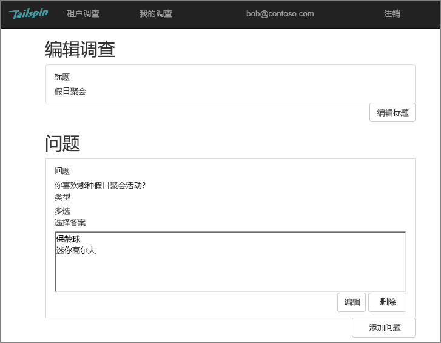
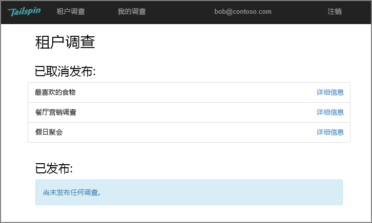
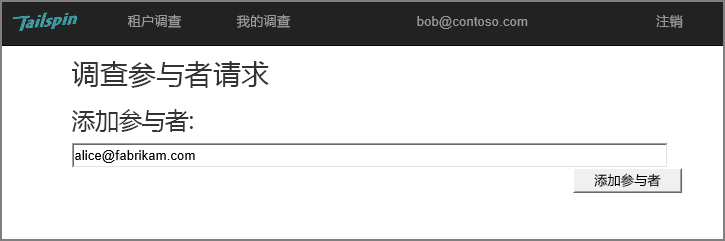
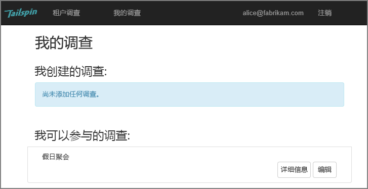
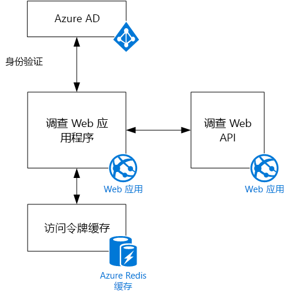

# Tailspin 方案

[ 示例代码][sample application]

Tailspin 是一家虚构公司，开发名为 Surveys 的 SaaS 应用程序。 组织可以使用此应用程序创建并发布在线调查。

* 组织可以注册使用此应用程序。
* 组织注册后，用户可以使用组织的凭据登录到此应用程序。
* 用户可以创建、编辑和发布调查。

> [!NOTE]
> 要开始使用此应用程序，请参阅[运行 Surveys 应用程序]。
> 
> 

## 用户可以创建、编辑和查看调查
经过身份验证的用户可以查看自己创建的或拥有参与者权限的所有调查，还可以创建新调查。 请注意，用户使用其组织身份 `bob@contoso.com` 登录。

此屏幕截图显示“编辑调查”页面：

用户还可以查看同一租户中其他用户创建的任何调查。

## 调查所有者可以邀请参与者
用户创建调查时，他/她可以邀请其他人成为调查的参与者。 参与者可以编辑调查，但无法删除或发布调查。  

用户可以从其他租户添加参与者，从而实现跨租户资源共享。 在此屏幕截图中，Bob (`bob@contoso.com`) 将 Alice (`alice@fabrikam.com`) 添加为他创建的调查的参与者。

Alice 登录时，会看到“我可以参与的调查”下列出了该调查。

请注意，Alice 是登录到她自己的租户，而不是作为 Contoso 租户的来宾登录。 Alice 仅拥有对该调查的参与者权限 &mdash; 而无法查看 Contoso 租户中的其他调查。

## 体系结构
Surveys 应用程序由 Web 前端和 Web API 后端组成。 两者都通过使用 [ASP.NET Core] 实现。

Web 应用程序使用 Azure Active Directory (Azure AD) 对用户进行身份验证。 Web 应用程序还调用 Azure AD 来获取 Web API 的 OAuth 2 访问令牌。 访问令牌在 Azure Redis 缓存中进行缓存。 通过缓存，多个实例可以共享同一令牌缓存（例如，在服务器场中）。

[下一篇][authentication]

<!-- Links -->

[authentication]: authenticate.md

[运行 Surveys 应用程序]: ./run-the-app.md
[ASP.NET Core]: /aspnet/core
[sample application]: https://github.com/mspnp/multitenant-saas-guidance
