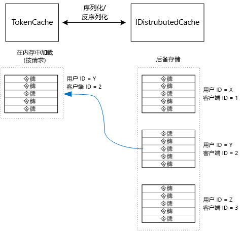

# <a name="cache-access-tokens"></a>缓存访问令牌

[ 示例代码][sample application]

获取 OAuth 访问令牌成本较高，因为它需要对令牌终结点进行 HTTP 请求。 因此，最好尽可能缓存令牌。 [Azure AD 身份验证库][ADAL] (ADAL) 会自动缓存从 Azure AD 获取的令牌，包括刷新令牌。

ADAL 提供默认令牌缓存实现。 但是，此令牌缓存适用于本机客户端应用，不适用于 web 应用：

* 它是一个静态实例，非线程安全。
* 它不会扩展到许多用户，因为所有用户的令牌都进入同一个字典。
* 它也无法在一个场中的多个 web 服务器间共享。

应实现自定义令牌缓存（该缓存派生自 ADAL `TokenCache` 类且适用于服务器环境），并为不同用户提供所需的令牌间的隔离级别。

`TokenCache` 类存储令牌字典，该字典按照颁发者、资源、客户端 ID 和用户索引。 自定义令牌缓存应将此字典写入一个后备存储，如 Redis 缓存。

在 Tailspin Surveys 应用程序中，`DistributedTokenCache` 类实现令牌缓存。 此实现使用 ASP.NET Core 中的 [IDistributedCache][distributed-cache] 抽象。 这样一来，任何 `IDistributedCache` 实现可用作后备存储。

* 默认情况下，Surveys 应用使用 Redis 缓存。
* 对于单实例 web 服务器，可使用 ASP.NET Core [内存中缓存][in-memory-cache]。 （这对于开发期间在本地运行应用也是一个不错的选择。）

`DistributedTokenCache` 将缓存数据以键/值对的形式存储在后备存储中。 键是用户 ID 加客户端 ID，所以后备存储可为用户/客户端的每个唯一组合保存单独的缓存数据。



后备存储由用户进行分区。 对于每个 HTTP 请求，用户的令牌从后备存储中读取并加载到 `TokenCache` 字典。 如果将 Redis 用作后备存储，则服务器场中的每个服务器实例会读取/写入到同一个缓存，并且此方法可扩展到许多用户。

## <a name="encrypting-cached-tokens"></a>加密已缓存令牌
令牌是敏感数据，因为令牌授予对用户资源的访问权限。 （而且，令牌与用户密码不同，不能仅存储令牌的哈希。）因此，保护令牌不被盗用至关重要。 Redis 支持的缓存受密码保护，但如果有人获取了密码，他便可以获取所有已缓存的访问令牌。 为此，`DistributedTokenCache` 对所有写入后备存储的信息进行加密。 加密操作是通过 ASP.NET Core [数据保护][data-protection] API 完成的。

> [!NOTE]
> 如果部署到 Azure 网站，会将加密密钥备份到网络存储，并同步到所有计算机（请参阅[密钥管理和生存期][key-management]）。 默认情况下，密钥在 Azure 网站中运行时未加密，但可[使用 X.509 证书][x509-cert-encryption]启用加密。
> 
> 

## <a name="distributedtokencache-implementation"></a>DistributedTokenCache 实现
`DistributedTokenCache` 类派生自 ADAL [TokenCache][tokencache-class] 类。

在构造函数中，`DistributedTokenCache` 类创建当前用户的密钥，并从后备存储中加载缓存：

```csharp
public DistributedTokenCache(
    ClaimsPrincipal claimsPrincipal,
    IDistributedCache distributedCache,
    ILoggerFactory loggerFactory,
    IDataProtectionProvider dataProtectionProvider)
    : base()
{
    _claimsPrincipal = claimsPrincipal;
    _cacheKey = BuildCacheKey(_claimsPrincipal);
    _distributedCache = distributedCache;
    _logger = loggerFactory.CreateLogger<DistributedTokenCache>();
    _protector = dataProtectionProvider.CreateProtector(typeof(DistributedTokenCache).FullName);
    AfterAccess = AfterAccessNotification;
    LoadFromCache();
}
```

通过连接用户 ID 和客户端 ID 创建密钥。 两者都来自用户的 `ClaimsPrincipal` 中的声明：

```csharp
private static string BuildCacheKey(ClaimsPrincipal claimsPrincipal)
{
    string clientId = claimsPrincipal.FindFirstValue("aud", true);
    return string.Format(
        "UserId:{0}::ClientId:{1}",
        claimsPrincipal.GetObjectIdentifierValue(),
        clientId);
}
```

若要加载缓存数据，请从后备存储中读取序列化 blob，并调用 `TokenCache.Deserialize`，将 blob 转换为缓存数据。

```csharp
private void LoadFromCache()
{
    byte[] cacheData = _distributedCache.Get(_cacheKey);
    if (cacheData != null)
    {
        this.Deserialize(_protector.Unprotect(cacheData));
    }
}
```

每当 ADAL 访问此缓存，会引发 `AfterAccess` 事件。 如果缓存数据已更改，则 `HasStateChanged` 属性为 true。 在这种情况下，更新后备存储以反映更改，并将 `HasStateChanged` 设置为 false。

```csharp
public void AfterAccessNotification(TokenCacheNotificationArgs args)
{
    if (this.HasStateChanged)
    {
        try
        {
            if (this.Count > 0)
            {
                _distributedCache.Set(_cacheKey, _protector.Protect(this.Serialize()));
            }
            else
            {
                // There are no tokens for this user/client, so remove the item from the cache.
                _distributedCache.Remove(_cacheKey);
            }
            this.HasStateChanged = false;
        }
        catch (Exception exp)
        {
            _logger.WriteToCacheFailed(exp);
            throw;
        }
    }
}
```

TokenCache 发送其他两个事件：

* `BeforeWrite`。 ADAL 写入缓存前会立即进行调用。 可将其用于实施并发策略
* `BeforeAccess`。 ADAL 从缓存中读取前，会立即进行调用。 此时可重新加载缓存，以获取最新版本。

在本例中，我们不处理这两个事件。

* 对于并发，以最后一次写入为准。 这是没问题的，因为令牌是为每个“用户 + 客户端”组合独立存储的，所以只有当同一个用户有两个并发登录会话时才会发生冲突。
* 对于读取，我们会针对每个请求加载缓存。 请求的生存期较短。 如果在请求生存期内修改缓存，下一个请求会选取新值。

[**下一篇**][client-assertion]

<!-- links -->
[ADAL]: https://msdn.microsoft.com/library/azure/jj573266.aspx
[client-assertion]: ./client-assertion.md
[data-protection]: /aspnet/core/security/data-protection/
[distributed-cache]: /aspnet/core/performance/caching/distributed
[key-management]: /aspnet/core/security/data-protection/configuration/default-settings
[in-memory-cache]: /aspnet/core/performance/caching/memory
[tokencache-class]: https://msdn.microsoft.com/library/azure/microsoft.identitymodel.clients.activedirectory.tokencache.aspx
[x509-cert-encryption]: /aspnet/core/security/data-protection/implementation/key-encryption-at-rest#x509-certificate
[sample application]: https://github.com/mspnp/multitenant-saas-guidance
