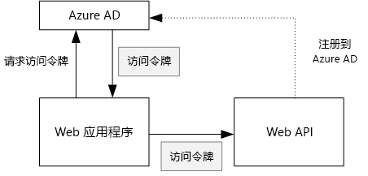
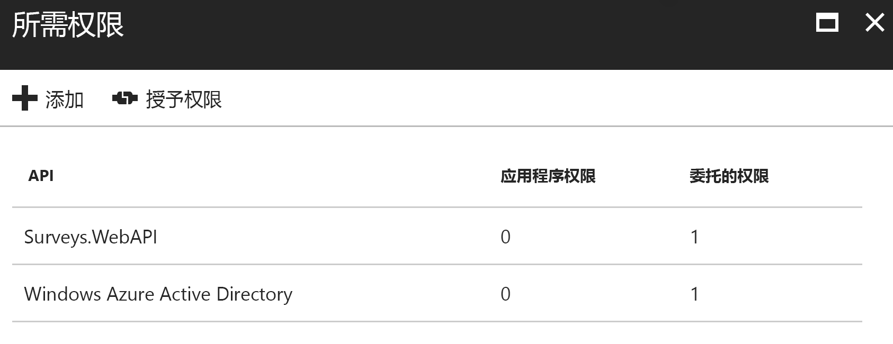

# <a name="secure-a-backend-web-api"></a>保护后端 Web API

[ 示例代码][sample application]

[Tailspin Surveys] 应用程序使用后端 Web API 来管理针对调查表执行的 CRUD 操作。 例如，当用户单击“我的调查表”时，Web 应用程序会将 HTTP 请求发送到 Web API：

```
GET /users/{userId}/surveys
```

Web API 返回一个 JSON 对象：

```
{
  "Published":[],
  "Own":[
    {"Id":1,"Title":"Survey 1"},
    {"Id":3,"Title":"Survey 3"},
    ],
  "Contribute": [{"Id":8,"Title":"My survey"}]
}
```

Web API 不允许匿名请求，因此，Web 应用必须使用 OAuth 2 持有者令牌对自身进行身份验证。

> [!NOTE]
> 这是一种服务器到服务器的方案。 应用程序不会通过浏览器客户端对 API 发出任何 AJAX 调用。
> 
> 

可以采用两种主要方法：

* 委托的用户标识。 Web 应用程序使用用户标识进行身份验证。
* 应用程序标识。 Web 应用程序通过 OAuth2 客户端凭据流，使用其客户端 ID 进行身份验证。

Tailspin 应用程序实施委托的用户标识。 两种方法的主要区别是：

**委托的用户标识**

* 发送到 Web API 的持有者令牌包含用户标识。
* Web API 基于用户标识做出授权决策。
* 如果用户无权执行操作，Web 应用程序需要处理来自 Web API 的 403（禁止访问）错误。
* 通常，Web 应用程序仍会做出一些影响 UI 的授权决策（例如，显示或隐藏 UI 元素）。
* Web API 可能会被不受信任的客户端（例如 JavaScript 应用程序或本机客户端应用程序）使用。

**应用程序标识**

* Web API 不会获取有关用户的信息。
* Web API 无法基于用户标识执行任何授权。 所有授权决策由 Web 应用程序做出。  
* 不受信任的客户端（JavaScript 或本机客户端应用程序）无法使用 Web API。
* 此方法在一定程度上更容易实现，因为 Web API 中不存在授权逻辑。

不管使用哪种方法，Web 应用程序都必须获取访问令牌，也就是调用 Web API 时所需的凭据。

* 使用委托的用户标识时，令牌必须来自可代表用户颁发令牌的 IDP。
* 对于客户端凭据，应用程序可以从 IDP 获取令牌，或者托管其自身的令牌服务器。 （但是，不需要从头开始编写令牌服务器；使用类似于 [IdentityServer3] 的经全面测试的框架即可。）如果通过 Azure AD 进行身份验证，则即使使用了客户端凭据流，我们也强烈建议从 Azure AD 获取访问令牌。

本文的余下部分假设应用程序使用 Azure AD 进行身份验证。



## <a name="register-the-web-api-in-azure-ad"></a>在 Azure AD 中注册 Web API
要使 Azure AD 颁发 Web API 的持有者令牌，需要在 Azure AD 中配置一些设置。

1. 在 Azure AD 中注册 Web API。

2. 将 Web 应用的客户端 ID 添加到 Web API 应用程序清单中的 `knownClientApplications` 属性。 请参阅[更新应用程序清单]。

3. 授予 Web 应用程序调用 Web API 的权限。 在 Azure 管理门户中，可以设置两种类型的权限：针对应用程序标识（客户端凭据流）的“应用程序权限”，或针对委托用户标识的“委托的权限”。
   
   

## <a name="getting-an-access-token"></a>获取访问令牌
在调用 Web API 之前，Web 应用程序会从 Azure AD 获取访问令牌。 在 .NET 应用程序，需使用[适用于 .NET 的 Azure AD 身份验证库 (ADAL)][ADAL]。

在 OAuth 2 授权代码流中，应用程序会使用授权代码交换访问令牌。 以下代码使用 ADAL 获取访问令牌。 此代码是在 `AuthorizationCodeReceived` 事件期间调用的。

```csharp
// The OpenID Connect middleware sends this event when it gets the authorization code.   
public override async Task AuthorizationCodeReceived(AuthorizationCodeReceivedContext context)
{
    string authorizationCode = context.ProtocolMessage.Code;
    string authority = "https://login.microsoftonline.com/" + tenantID
    string resourceID = "https://tailspin.onmicrosoft.com/surveys.webapi" // App ID URI
    ClientCredential credential = new ClientCredential(clientId, clientSecret);

    AuthenticationContext authContext = new AuthenticationContext(authority, tokenCache);
    AuthenticationResult authResult = await authContext.AcquireTokenByAuthorizationCodeAsync(
        authorizationCode, new Uri(redirectUri), credential, resourceID);

    // If successful, the token is in authResult.AccessToken
}
```

下面是需要的各个参数：

* `authority`。 派生自登录用户的租户 ID。 （不是 SaaS 提供程序的租户 ID）  
* `authorizationCode`。 从 IDP 取回的身份验证代码。
* `clientId`。 Web 应用程序的客户端 ID。
* `clientSecret`。 Web 应用程序的客户端机密。
* `redirectUri`。 为 OpenID Connect 设置的重定向 URI。 IDP 在此 URI 中使用令牌发出回调。
* `resourceID`。 Web API 的应用 ID URI，这是在 Azure AD 中注册 Web API 时创建的 URI
* `tokenCache`。 用于缓存访问令牌的对象。 请参阅[令牌缓存]。

如果 `AcquireTokenByAuthorizationCodeAsync` 成功，则 ADAL 会缓存令牌。 以后，可以通过调用 AcquireTokenSilentAsync 从缓存中获取令牌：

```csharp
AuthenticationContext authContext = new AuthenticationContext(authority, tokenCache);
var result = await authContext.AcquireTokenSilentAsync(resourceID, credential, new UserIdentifier(userId, UserIdentifierType.UniqueId));
```

其中，`userId` 是 `http://schemas.microsoft.com/identity/claims/objectidentifier` 声明中的用户对象 ID。

## <a name="using-the-access-token-to-call-the-web-api"></a>使用访问令牌调用 Web API
获取令牌后，请在发往 Web API 的 HTTP 请求的授权标头中发送该令牌。

```
Authorization: Bearer xxxxxxxxxx
```

Surveys 应用程序中的以下扩展方法使用 **HttpClient** 类在 HTTP 请求中设置授权标头。

```csharp
public static async Task<HttpResponseMessage> SendRequestWithBearerTokenAsync(this HttpClient httpClient, HttpMethod method, string path, object requestBody, string accessToken, CancellationToken ct)
{
    var request = new HttpRequestMessage(method, path);
    if (requestBody != null)
    {
        var json = JsonConvert.SerializeObject(requestBody, Formatting.None);
        var content = new StringContent(json, Encoding.UTF8, "application/json");
        request.Content = content;
    }

    request.Headers.Authorization = new AuthenticationHeaderValue("Bearer", accessToken);
    request.Headers.Accept.Add(new MediaTypeWithQualityHeaderValue("application/json"));

    var response = await httpClient.SendAsync(request, ct);
    return response;
}
```

## <a name="authenticating-in-the-web-api"></a>在 Web API 中进行身份验证
Web API 必须对持有者令牌进行身份验证。 在 ASP.NET Core 中，可以使用 [Microsoft.AspNet.Authentication.JwtBearer][JwtBearer] 包。 此包提供可让应用程序接收 OpenID Connect 持有者令牌的中间件。

在 Web API `Startup` 类中注册该中间件。

```csharp
public void Configure(IApplicationBuilder app, IHostingEnvironment env, ApplicationDbContext dbContext, ILoggerFactory loggerFactory)
{
    // ...

    app.UseJwtBearerAuthentication(new JwtBearerOptions {
        Audience = configOptions.AzureAd.WebApiResourceId,
        Authority = Constants.AuthEndpointPrefix,
        TokenValidationParameters = new TokenValidationParameters {
            ValidateIssuer = false
        },
        Events= new SurveysJwtBearerEvents(loggerFactory.CreateLogger<SurveysJwtBearerEvents>())
    });
    
    // ...
}
```

* **Audience**。 请将此类设置为 Web API 的应用 ID URL，即在 Azure AD 中注册 Web API 时创建的 URL。
* **Authority**。 对于多租户应用程序，请将此类设置为 `https://login.microsoftonline.com/common/`。
* **TokenValidationParameters**。 对于多租户应用程序，请将 **ValidateIssuer** 设置为 false。 这意味着应用程序将会验证颁发者。
* **Events** 是派生自 **JwtBearerEvents** 的类。

### <a name="issuer-validation"></a>颁发者验证
在 **JwtBearerEvents.TokenValidated** 事件中验证令牌颁发者。 该颁发者在“iss”声明中发送。

在 Surveys 应用程序中，Web API 不会处理[租户注册]。 因此，它只会检查应用程序数据库中是否已包含该颁发者。 如果不包含，则引发异常，从而导致身份验证失败。

```csharp
public override async Task TokenValidated(TokenValidatedContext context)
{
    var principal = context.Ticket.Principal;
    var tenantManager = context.HttpContext.RequestServices.GetService<TenantManager>();
    var userManager = context.HttpContext.RequestServices.GetService<UserManager>();
    var issuerValue = principal.GetIssuerValue();
    var tenant = await tenantManager.FindByIssuerValueAsync(issuerValue);

    if (tenant == null)
    {
        // The caller was not from a trusted issuer. Throw to block the authentication flow.
        throw new SecurityTokenValidationException();
    }

    var identity = principal.Identities.First();

    // Add new claim for survey_userid
    var registeredUser = await userManager.FindByObjectIdentifier(principal.GetObjectIdentifierValue());
    identity.AddClaim(new Claim(SurveyClaimTypes.SurveyUserIdClaimType, registeredUser.Id.ToString()));
    identity.AddClaim(new Claim(SurveyClaimTypes.SurveyTenantIdClaimType, registeredUser.TenantId.ToString()));

    // Add new claim for Email
    var email = principal.FindFirst(ClaimTypes.Upn)?.Value;
    if (!string.IsNullOrWhiteSpace(email))
    {
        identity.AddClaim(new Claim(ClaimTypes.Email, email));
    }
}
```

如此示例中所示，也可以使用 **TokenValidated** 事件修改声明。 请记住，这些声明直接来自 Azure AD。 如果 Web 应用程序修改了它所获取的声明，这些更改不会显示在 Web API 收到的持有者令牌中。 有关详细信息，请参阅[声明转换][claims-transformation]。

## <a name="authorization"></a>授权
有关授权的一般性介绍，请参阅[基于角色和基于资源的授权][Authorization]。 

JwtBearer 中间件处理授权响应。 例如，若要限制为只有经过身份验证的用户才能执行控制器操作，请使用 **[Authorize]** 属性，并指定 **JwtBearerDefaults.AuthenticationScheme** 作为身份验证方案：

```csharp
[Authorize(ActiveAuthenticationSchemes = JwtBearerDefaults.AuthenticationScheme)]
```

如果用户未经身份验证，此代码会返回 401 状态代码。

若要通过授权策略限制控制器操作，请在 **[Authorize]** 属性中指定策略名称：

```csharp
[Authorize(Policy = PolicyNames.RequireSurveyCreator)]
```

如果用户未经身份验证，此代码会返回 401 状态代码；如果用户已经过身份验证但未获授权，此代码会返回 403。 启动时注册策略：

```csharp
public void ConfigureServices(IServiceCollection services)
{
    services.AddAuthorization(options =>
    {
        options.AddPolicy(PolicyNames.RequireSurveyCreator,
            policy =>
            {
                policy.AddRequirements(new SurveyCreatorRequirement());
                policy.RequireAuthenticatedUser(); // Adds DenyAnonymousAuthorizationRequirement 
                policy.AddAuthenticationSchemes(JwtBearerDefaults.AuthenticationScheme);
            });
        options.AddPolicy(PolicyNames.RequireSurveyAdmin,
            policy =>
            {
                policy.AddRequirements(new SurveyAdminRequirement());
                policy.RequireAuthenticatedUser(); // Adds DenyAnonymousAuthorizationRequirement 
                policy.AddAuthenticationSchemes(JwtBearerDefaults.AuthenticationScheme);
            });
    });
    
    // ...
}
```

[**下一篇**][token cache]

<!-- links -->
[ADAL]: https://msdn.microsoft.com/library/azure/jj573266.aspx
[JwtBearer]: https://www.nuget.org/packages/Microsoft.AspNet.Authentication.JwtBearer

[Tailspin Surveys]: tailspin.md
[IdentityServer3]: https://github.com/IdentityServer/IdentityServer3
[更新应用程序清单]: ./run-the-app.md#update-the-application-manifests
[令牌缓存]: token-cache.md
[租户注册]: signup.md
[claims-transformation]: claims.md#claims-transformations
[Authorization]: authorize.md
[sample application]: https://github.com/mspnp/multitenant-saas-guidance
[token cache]: token-cache.md
