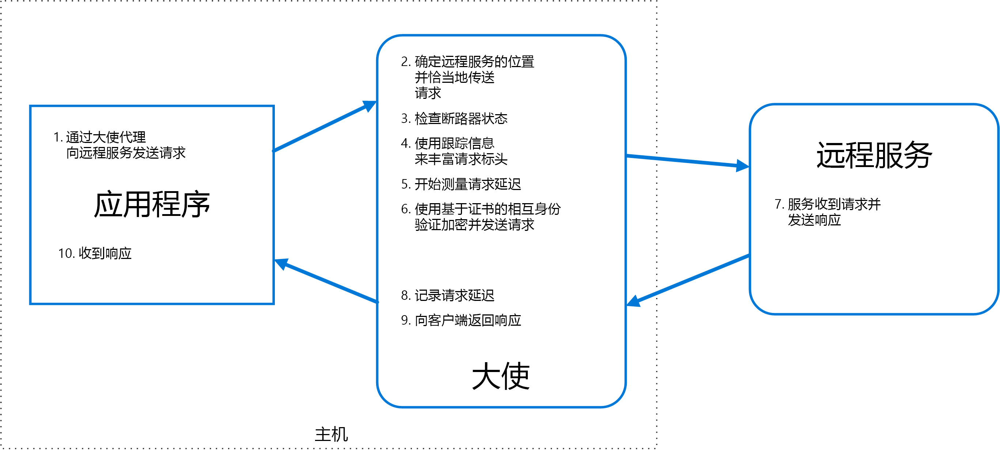

# 代表模式

创建代表客户服务或应用程序发送网络请求的帮助程序服务。 代表服务可以看作是与客户端置位于同一位置的进程外代理。

此模式可用于以一种与语言无关的方式卸载常见客户端连接任务，如监视、记录、路由、安全（如 TLS）和[复原模式][resiliency-patterns]。 它通常用于旧版应用程序或其他很难修改的应用程序，以扩展其网络功能。 它还可以使一个专业团队能够实现这些功能。

## 上下文和问题

基于云的可复原应用程序需要[断路][circuit-breaker]、路由、计量和监视等功能，以及能够进行与网络相关的配置更新。 要更新旧版应用程序或现有代码库来添加这些功能可能比较困难，或者根本不可能，因为开发团队已不再维护或不能轻易修改代码。

网络调用可能也需要大量连接、授权和认证配置。 如果这些调用跨多个应用程序使用，并且是使用多种语言和框架建构的，则必须分别每个实例配置调用。 此外，网络和安全功能可能需要组织中的中心团队来管理。 由于代码库很大，团队更新不熟悉的应用程序代码时可能会有风险。

## 解决方案

将客户端框架和库放到一个外部进程中，该进程充当应用程序和外部服务之间的代理。 将代理部署在与应用程序相同的主机环境中，以允许对路由、复原能力、安全功能进行控制，并避免出现与主机相关的访问限制。 还可以使用代表模式标准化和扩展检测。 代理可以监视性能指标（如延迟或资源使用状况），且在与应用程序相同的主机环境中执行此监视。

卸载到代表的功能可独立于应用程序进行管理。 可以更新和修改代表，而不影响应用程序的旧功能。 单独、专业的团队还可以实施和维护已转移给代表的安全、网络或身份验证功能。

代表服务可部署为 [sidecar][sidecar] 以伴随使用应用程序或服务的生命周期。 或者，如果代表由公共主机上的多个单独进程所共享，则可将其部署为守护程序或 Windows 服务。 如果使用服务进行了容器化，那么代表应该创建为同一个主机上的单独容器，并且配置适当的链接用于通信。

## 问题和注意事项

- 代理会添加一些延迟开销。 请考虑使用应用程序直接调用的客户端库是否是更好的方法。
- 请考虑在代理中包含通用功能可能带来的影响。 例如，代表可以处理重试操作，但这可能不安全，除非所有操作都是幂等的。
- 请考虑一种允许客户端将一些上下文传递到代理，同时也可传递回客户端的机制。 例如，包含 HTTP 请求标头以选择退出重试，或指定最大重试次数。
- 请考虑如何打包和部署代理。
- 考虑是让所有客户端使用一个共享实例还是让每个客户端单独使用一个实例。

## 何时使用此模式

在以下情况中使用此模式：

- 需要为多种语言或框架构建一组通用的客户端连接功能。
- 需要将跨领域客户端连接性问题转移给基础结构开发人员或其他更专业化的团队。
- 需要在旧版应用程序或难以修改的应用程序中支持云或群集连接需求。

此模式可能不适用于以下情况：

- 网络请求延迟严重。 代理将产生一些开销，虽然是最小开销，但在某些情况下，仍然可能会影响应用程序。
- 客户端连接功能仅用于一种语言。 在这种情况下，最好以包的形式将客户端库分发给开发团队。
- 连接功能无法通用化，且需要与客户端应用程序进行更深层的集成。

## 示例

下列图表显示应用程序通过代表代理向远程服务提出请求的情况。 代表提供路由、断路和记录操作。 它调用远程服务，然后将响应返回到客户端应用程序:

 

## 相关指南

- [Sidecar 模式](./sidecar.md)

<!-- links -->

[circuit-breaker]: ./circuit-breaker.md
[resiliency-patterns]: ./category/resiliency.md
[sidecar]: ./sidecar.md
