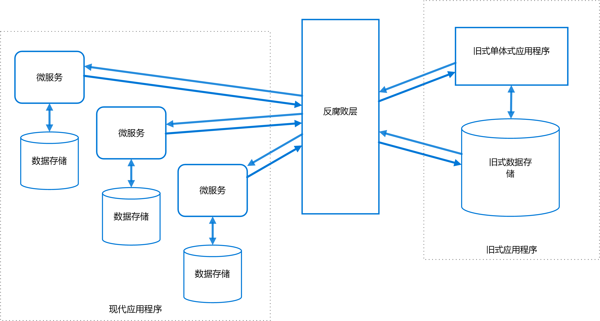

# 防损层模式

在不共享相同语义的不同子系统之间实施外观或适配器层。 此层转换一个子系统向另一个子系统发出的请求。 使用此模式可确保应用程序的设计不受限于对外部子系统的依赖。 此模式最先由 Eric Evans 在 *Domain-Driven Design*（域驱动的设计）中描述。

## 上下文和问题

大多数应用程序依赖于其他系统的某些数据或功能。 例如，旧版应用程序迁移到新式系统时，可能仍需要现有的旧的资源。 新功能必须能够调用旧系统。 逐步迁移尤其如此，随着时间推移，较大型应用程序的不同功能迁移到新式系统中。

这些旧系统通常会出现质量问题，如复杂的数据架构或过时的 API。 旧系统使用的功能和技术可能与新式系统中的功能和技术有很大差异。 若要与旧系统进行互操作，新应用程序可能需要支持过时的基础结构、协议、数据模型、API、或其他不会引入新式应用程序的功能。

保持新旧系统之间的访问可以强制新系统至少支持某些旧系统的 API 或其他语义。 这些旧的功能出现质量问题时，支持它们“损坏”可能会是完全设计的新式应用程序。 

不仅仅是旧系统，不受开发团队控制的任何外部系统都可能出现类似的问题。 

## 解决方案

在不同的子系统之间放置防损层以将其隔离。 此层转换两个系统之间的通信，在一个系统保持不变的情况下，使另一个系统可以避免破坏其设计和技术方法。

 

上图显示了采用两个子系统的应用程序。 子系统 A 通过防损层调用子系统 B。 子系统 A 与防损层之间的通信始终使用子系统 A 的数据模型和体系结构。防损层向子系统 B 发出的调用符合该子系统的数据模型或方法。 防损层包含在两个系统之间转换所必需的所有逻辑。 该层可作为应用程序内的组件或作为独立服务实现。

## 问题和注意事项

- 防损层可能将延迟添加到两个系统之间的调用。
- 防损层将添加一项必须管理和维护的其他服务。
- 请考虑防损层的缩放方式。
- 请考虑是否需要多个防损层。 可能需要使用不同的技术或语言将功能分解为多个服务，或者可能因其他原因对防损层进行分区。
- 请考虑如何管理与其他应用程序或服务相关的防损层。 如何将其集成到监视、发布和配置进程中？
- 确保维护并可以监视事务和数据一致性。
- 请考虑防损层是要处理不同子系统之间的所有通信，还是只需处理部分功能。 
- 如果防损层是应用程序迁移策略的一部分，请考虑该层是永久性的，还是在迁移所有旧功能后即会停用。

## 何时使用此模式

在以下情况下使用此模式：

- 迁移计划为发生在多个阶段，但是新旧系统之间的集成需要维护。
- 两个或更多个子系统具有不同的语义，但仍需要进行通信。 

如果新旧系统之间没有重要的语义差异，则此模式可能不适合。 

## 相关指南

- [Strangler 模式](./strangler.md)
