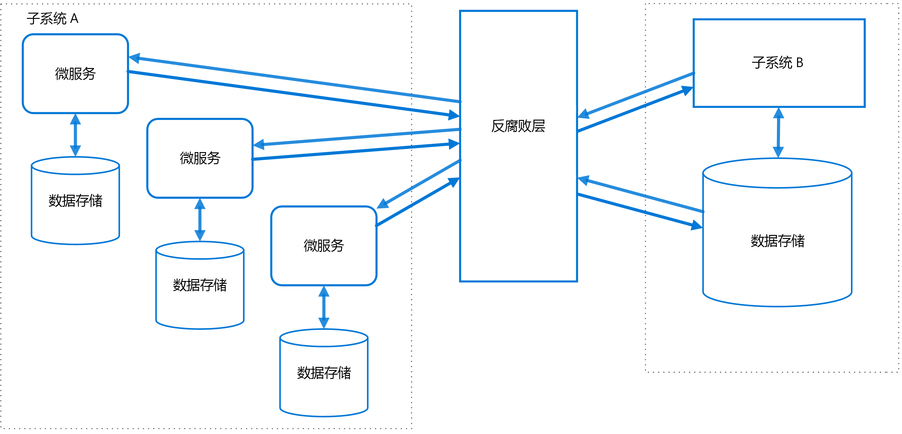

# 防损层模式Anti-Corruption Layer pattern

在不共享相同语义的不同子系统之间实施外观或适配器层。Implement a façade or adapter layer between different subsystems that don't share the same semantics. 此层转换一个子系统向另一个子系统发出的请求。This layer translates requests that one subsystem makes to the other subsystem. 使用此模式可确保应用程序的设计不受限于对外部子系统的依赖。Use this pattern to ensure that an application's design is not limited by dependencies on outside subsystems. 此模式最先由 Eric Evans 在 *Domain-Driven Design*（域驱动的设计）中描述。This pattern was first described by Eric Evans in *Domain-Driven Design*.

## 上下文和问题Context and problem

大多数应用程序依赖于其他系统的某些数据或功能。Most applications rely on other systems for some data or functionality. 例如，旧版应用程序迁移到新式系统时，可能仍需要现有的旧的资源。For example, when a legacy application is migrated to a modern system, it may still need existing legacy resources. 新功能必须能够调用旧系统。New features must be able to call the legacy system. 逐步迁移尤其如此，随着时间推移，较大型应用程序的不同功能迁移到新式系统中。This is especially true of gradual migrations, where different features of a larger application are moved to a modern system over time.

这些旧系统通常会出现质量问题，如复杂的数据架构或过时的 API。Often these legacy systems suffer from quality issues such as convoluted data schemas or obsolete APIs. 旧系统使用的功能和技术可能与新式系统中的功能和技术有很大差异。The features and technologies used in legacy systems can vary widely from more modern systems. 若要与旧系统进行互操作，新应用程序可能需要支持过时的基础结构、协议、数据模型、API、或其他不会引入新式应用程序的功能。To interoperate with the legacy system, the new application may need to support outdated infrastructure, protocols, data models, APIs, or other features that you wouldn't otherwise put into a modern application.

保持新旧系统之间的访问可以强制新系统至少支持某些旧系统的 API 或其他语义。Maintaining access between new and legacy systems can force the new system to adhere to at least some of the legacy system's APIs or other semantics. 这些旧的功能出现质量问题时，支持它们“损坏”可能会是完全设计的新式应用程序。When these legacy features have quality issues, supporting them "corrupts" what might otherwise be a cleanly designed modern application. 

不仅仅是旧系统，不受开发团队控制的任何外部系统都可能出现类似的问题。Similar issues can arise with any external system that your development team doesn't control, not just legacy systems. 

## 解决方案Solution

在不同的子系统之间放置防损层以将其隔离。Isolate the different subsystems by placing an anti-corruption layer between them. 此层转换两个系统之间的通信，在一个系统保持不变的情况下，使另一个系统可以避免破坏其设计和技术方法。This layer translates communications between the two systems, allowing one system to remain unchanged while the other can avoid compromising its design and technological approach.

 

上图显示了采用两个子系统的应用程序。The diagram above shows an application with two subsystems. 子系统 A 通过防损层调用子系统 B。Subsystem A calls to subsystem B through an anti-corruption layer. 子系统 A 与防损层之间的通信始终使用子系统 A 的数据模型和体系结构。防损层向子系统 B 发出的调用符合该子系统的数据模型或方法。Communication between subsystem A and the anti-corruption layer always uses the data model and architecture of subsystem A. Calls from the anti-corruption layer to subsystem B conform to that subsystem's data model or methods. 防损层包含在两个系统之间转换所必需的所有逻辑。The anti-corruption layer contains all of the logic necessary to translate between the two systems. 该层可作为应用程序内的组件或作为独立服务实现。The layer can be implemented as a component within the application or as an independent service.

## 问题和注意事项Issues and considerations

- 防损层可能将延迟添加到两个系统之间的调用。The anti-corruption layer may add latency to calls made between the two systems.
- 防损层将添加一项必须管理和维护的其他服务。The anti-corruption layer adds an additional service that must be managed and maintained.
- 请考虑防损层的缩放方式。Consider how your anti-corruption layer will scale.
- 请考虑是否需要多个防损层。Consider whether you need more than one anti-corruption layer. 可能需要使用不同的技术或语言将功能分解为多个服务，或者可能因其他原因对防损层进行分区。You may want to decompose functionality into multiple services using different technologies or languages, or there may be other reasons to partition the anti-corruption layer.
- 请考虑如何管理与其他应用程序或服务相关的防损层。Consider how the anti-corruption layer will be managed in relation with your other applications or services. 如何将其集成到监视、发布和配置进程中？How will it be integrated into your monitoring, release, and configuration processes?
- 确保维护并可以监视事务和数据一致性。Make sure transaction and data consistency are maintained and can be monitored.
- 请考虑防损层是要处理不同子系统之间的所有通信，还是只需处理部分功能。Consider whether the anti-corruption layer needs to handle all communication between different subsystems, or just a subset of features. 
- 如果防损层是应用程序迁移策略的一部分，请考虑该层是永久性的，还是在迁移所有旧功能后即会停用。If the anti-corruption layer is part of an application migration strategy, consider whether it will be permanent, or will be retired after all legacy functionality has been migrated.

## 何时使用此模式When to use this pattern

在以下情况下使用此模式：Use this pattern when:

- 迁移计划为发生在多个阶段，但是新旧系统之间的集成需要维护。A migration is planned to happen over multiple stages, but integration between new and legacy systems needs to be maintained.
- 两个或更多个子系统具有不同的语义，但仍需要进行通信。Two or more subsystems have different semantics, but still need to communicate. 

如果新旧系统之间没有重要的语义差异，则此模式可能不适合。This pattern may not be suitable if there are no significant semantic differences between new and legacy systems. 

## 相关指南Related guidance

- [Strangler 模式Strangler pattern](./strangler.md)
