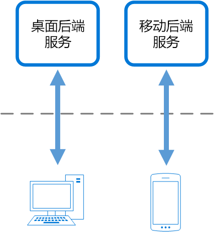

# 用于前端的后端模式

创建单独的后端服务，供特定的前端应用程序或接口使用。 要避免为多个接口自定义一个后端时，此模式十分有用。 此模式最先是由 Sam Newman 描述的。

## 上下文和问题

应用程序最初可能面向桌面 Web UI。 通常并行开发提供该 UI 所需功能的后端服务。 随着应用程序用户群的增长，开发出了必须与同一后端交互的移动应用程序。 后端服务成为一般用途的后端，满足桌面和移动接口的需求。

但移动设备和桌面浏览器在屏幕大小、性能和显示限制方面的功能存在显著差异。 因此，移动应用程序和桌面 Web UI 对后端的需求也有所不同。 

这些差异导致两者对后端的需求相互冲突。 为向桌面 Web UI 和移动应用程序提供服务，后端需要进行常规更改和重大更改。 单独的接口团队通常致力于每个前端，导致后端成为开发过程中的瓶颈。 矛盾的更新需求以及让服务适用于这两个前端的需要会导致在一个可部署资源上花费大量精力。

 

因为开发活动注重后端服务，所以可能要建立单独的团队来管理和维护后端。 这最终导致接口和后端开发团队之间的连接断开，为平衡不同 UI 团队冲突的需求而增加后端团队的负担。 一个接口团队要求更改后端时，必须先与其他接口团队验证这些更改，然后才能将其集成到后端。 

## 解决方案

为每个用户界面创建一个后端。 在无需担心影响其他前端体验的情况下，微调每个后端的行为和性能以最大程度地满足前端环境的需求。

 

每个后端特定于一个接口，因此可针对该接口优化后端。 因此，与试图满足所有接口的需求的泛型后端相比，它更小、复杂性更低并且速度可能更快。 每个接口团队可自主控制其后端，无需依赖于集中式后端开发团队。 这向接口团队提供了后端的语言选择、发布节奏、工作负载优先顺序和功能集成方面的灵活性。

有关详细信息，请参阅[模式：用于前端的后端](http://samnewman.io/patterns/architectural/bff/)。

## 问题和注意事项

- 请考虑要部署的后端数量。
- 如果不同接口（如移动客户端）发出相同请求，请考虑是否必须为每个接口实现一个后端，或者一个后端是否可以满足需求。
- 实现此模式时，服务之间的代码很可能重复。
- 专注于前端的后端服务应仅包含特定于客户端的逻辑和行为。 应当在应用程序的其他位置管理常规业务逻辑和其他全局功能。
- 思考此模式在开发团队责任中可能具有的体现。
- 请考虑实现此模式所需的时间。 假如你继续支持现有的泛型后端，生成新后端所需的工作量是否会导致出现技术债务？

## 何时使用此模式

在以下情况下使用此模式：

- 必须使用大量开发开销维护共享或常规用途的后端服务。
- 想要优化后端以满足特定客户端接口的需求。
- 自定义一般用途的后端以适应多个接口。
- 另一种语言更适合另一用户界面的后端。

此模式可能不适用于以下情况：

- 接口向后端发出相同或类似的请求时。
- 仅使用一个接口与后端交互时。

## 相关指南

- [网关聚合模式](./gateway-aggregation.md)
- [网关卸载模式](./gateway-offloading.md)
- [网关路由模式](./gateway-routing.md)

